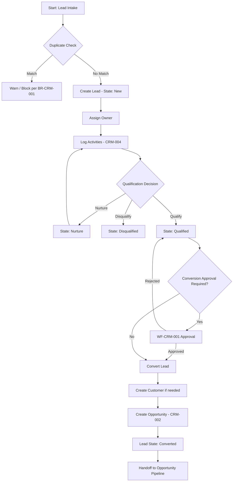
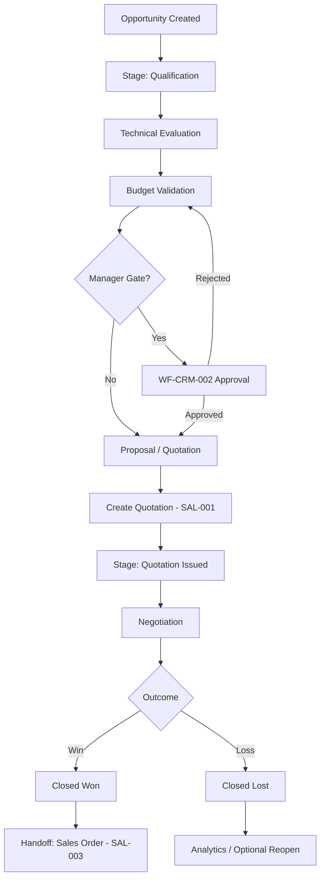
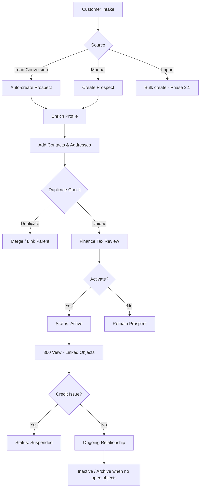
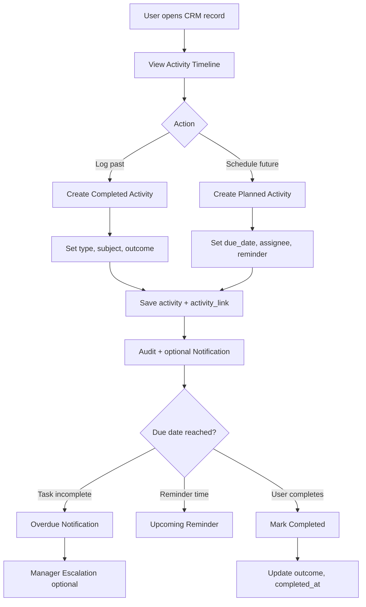

# E-LinkUp CRM — Business Functional Specification Pack

**Document ID:** ELU-BFS-CRM  
**Document Name:** CRM Domain Business Functional Specification (Complete Pack)  
**Version:** 1.0  
**Status:** Approved
**Related Documents:** ELU-DOC-001, ELU-DF-001, ELU-BRD-001, ELU-EFS-001, ELU-RTM-001
**Classification:** Internal Confidential  
**Project:** E-LinkUp (By Euphoria Infotech)  
**Prepared By:** Senior BA / Enterprise Solution Architect / Product Owner  
**Document Owner:** PMO  
**Example Tenant:** Euphoria  
**Technology Stack:** Flutter (Web + Android) · Python FastAPI · PostgreSQL · JWT + Refresh Token · Docker · Linux VPS / Azure  
**Related Documents:** ELU-DF-001, ELU-BRD-001, ELU-STORY-001, ELU-WF-001, ELU-SAD-001, ELU-HLD-001

---

## Version History

| Version | Date | Author | Change |
|---------|------|--------|--------|
| 1.0 | 2026-07-31 | EIIP | Initial BFS pack (seventeen sections) |
| 1.0a | 2026-07-31 | EIIP / PMO | Status Approved; registered in ELU-DOC-001; Related Documents standardized |

## Document Index

| # | Module ID | Sub Module | Feature ID | Feature Name | Priority | Phase |
|---|-----------|------------|------------|--------------|----------|-------|
| 1 | CRM-001 | CRM-001-001 Lead | CRM-001-001-001 | Lead Capture | Critical | Phase 2 |
| 2 | CRM-002 | CRM-002-001 Opportunity | CRM-002-001-001 | Opportunity Pipeline | Critical | Phase 2 |
| 3 | CRM-003 | CRM-003-001 Customer Master | CRM-003-001-001 | Customer Profile | Critical | Phase 2 |
| 4 | CRM-004 | CRM-004-001 Activities | CRM-004-001-001 | Activity Timeline | High | Phase 2 |

### Cross-Module Workflow Spine

```text
Lead (CRM-001) → Qualification → Opportunity (CRM-002) → Quotation (SAL-001)
       ↑                                    ↓
  Activity Timeline (CRM-004)         Customer Profile (CRM-003)
```

### Shared Engines Referenced

| Engine | Module Code | CRM Usage |
|--------|-------------|-----------|
| Workflow Engine | CPS-001 | Lead qualification, opportunity stage gates, approval routing |
| Rule Engine | CPS-002 | Duplicate detection, probability, SLA timers, auto-assignment |
| Notification Engine | CPS-003 | Assignment, conversion, stage change, overdue alerts |
| Reporting & Analytics | CPS-004 | Pipeline, lead funnel, activity compliance |
| Audit Service | CPS-005 / PF-010 | All CRUD, status, convert, assign events |
| Document Management | CPS-006 | Lead/opportunity attachments |
| Integration Framework | CPS-008 / INT-* | Web forms, email capture, external CRM sync |

### Minimum Edition per Feature

| Feature | Community | Professional | Enterprise |
|---------|-----------|--------------|------------|
| CRM-001-001-001 Lead Capture | ✓ (basic) | ✓ | ✓ |
| CRM-002-001-001 Opportunity Pipeline | — | ✓ | ✓ |
| CRM-003-001-001 Customer Profile | ✓ (basic) | ✓ | ✓ |
| CRM-004-001-001 Activity Timeline | ✓ | ✓ | ✓ |

---

# Module 1 — CRM-001 Lead Management

**Document ID:** ELU-BFS-CRM-001  
**Module:** CRM-001 — Lead Management  
**Sub Module:** CRM-001-001 — Lead  
**Feature:** CRM-001-001-001 — Lead Capture  
**Domain:** CRM  
**Priority / Phase / Release:** Critical · Phase 2 · v1.0  
**Workflow Reference:** WF-CRM-001  
**Example Tenant:** Euphoria  
**Stack:** Flutter · FastAPI · PostgreSQL · JWT+Refresh · Docker

---

## 1. Business Objective

### 1.1 Why this module exists

Euphoria sales users receive inbound interest through multiple channels — website forms, events, referrals, cold outreach, and partner introductions. Without a governed Lead Capture module, contact details sit in personal inboxes, duplicate records proliferate, and qualification decisions lack audit trail. CRM-001 establishes the **first system-of-record object** in the E-LinkUp lead-to-cash spine.

### 1.2 Business value

| Value Driver | Measure |
|--------------|---------|
| Pipeline hygiene | Single lead register with owner, source, and status |
| Conversion velocity | Structured qualification → Opportunity handoff |
| Data quality | Duplicate detection on email / phone / company |
| Accountability | Every lead has owner, activity history, and audit |
| Forecast accuracy | Qualified leads feed Opportunity pipeline with traceability |

### 1.3 Business scope

| In Scope | Out of Scope |
|----------|--------------|
| Manual lead creation (Web + Android) | Marketing automation campaign orchestration (v3) |
| Lead source master and attribution | Full MAP integration (INT-002, deferred) |
| Contact details on lead (lead_contact) | Bulk import wizard (Phase 2.1) |
| Lead assignment and reassignment | AI lead scoring (CPS-007, v3) |
| Qualification / Disqualification / Nurture | Legal contract management |
| Lead → Opportunity + Customer conversion (Professional+) | Quotation creation (SAL-001) |
| Community: Lead → Customer only (`convert_mode=CUSTOMER_ONLY`) | Opportunity module (Community) |  
| **Community convert** = Customer only (no Opportunity) per **ELU-EDM-001** / **ELU-L2C-001** | |
| Attachments via Document Engine | |
| Activity logging (via CRM-004) | |
| Duplicate check and merge preview | |
| Lead list, search, filter, export | |

### 1.4 Users involved

Sales Executive, Sales Manager, Pre-Sales, Tenant Admin, Finance (read-only advisory), Customer Contact (indirect — source only), System engines (Workflow, Rule, Notification, Audit, Document).

### 1.5 Module reference

| Attribute | Value |
|-----------|-------|
| Domain | CRM |
| Module | CRM-001 Lead Management |
| Sub Module | CRM-001-001 Lead |
| Feature | CRM-001-001-001 Lead Capture |
| Priority | Critical |
| Phase | Phase 2 |
| Release | v1.0 |
| Dependencies | PF-008 Users, PF-009 RBAC, PF-010 Audit, CRM-004 Activity Timeline |
| Downstream | CRM-002 Opportunity, CRM-003 Customer, SAL-001 Quotation |

---

## 2. Business Actors

| Actor | Type | Primary Actions | Secondary Actions |
|-------|------|-----------------|-------------------|
| Sales Executive | Internal | Create lead, log activities, update qualification fields, request conversion | View own leads, attach documents |
| Sales Manager | Internal | Review queue, qualify/disqualify, reassign, approve conversion, export | View team pipeline of leads |
| Pre-Sales | Internal | Review technical fit on qualified leads, add notes | Read leads linked to assigned opportunities |
| Tenant Admin | Internal | Configure lead sources, assignment rules, numbering prefix | Full read; configure masters |
| Finance User | Internal | — | Read lead value estimates for forecast advisory |
| Customer Contact | External | — | Appears as lead contact; no direct system login in Phase 2 |
| Workflow Engine (CPS-001) | System | Route qualification approval when configured | Escalate stale leads |
| Rule Engine (CPS-002) | System | Duplicate detection, auto-assignment by source/territory | Enforce mandatory fields by source |
| Notification Engine (CPS-003) | System | Alert on assign, qualify, convert, overdue | Digest to managers |
| Audit Service (CPS-005) | System | Immutable event log | — |
| Document Engine (CPS-006) | System | Store lead_attachment binaries | Virus scan hook (Enterprise) |

---

## 3. Business Story

**Tenant:** Euphoria · **Workflow:** WF-CRM-001

On a Monday morning, **Sales Executive** Priya Sharma receives a referral from an existing Euphoria customer contact. She opens E-LinkUp on Flutter Web and creates a **Lead** with source *Referral*, company *Acme Manufacturing Pvt Ltd*, estimated value ₹18,00,000, and primary contact details in **lead_contact**. The **Rule Engine** runs **BR-CRM-001** duplicate check against email and phone; no match is found. The lead enters state **New** with Priya as owner.

Priya logs a discovery call on the **Activity Timeline** (CRM-004) — activity type *Call*, outcome *Interested*. She updates BANT fields (Budget, Authority, Need, Timeline) and moves the lead to **Under Qualification**.

**Sales Manager** Rajesh Mehta reviews his team's qualification queue. He sees Priya's lead, validates the BANT assessment, and transitions the lead to **Qualified**. The **Notification Engine** confirms qualification to Priya. Rajesh optionally triggers **WF-CRM-001** conversion approval because estimated value exceeds the tenant threshold (BR-CRM-012).

Priya initiates **Convert Lead**. The system:
1. Creates **Customer** (CRM-003) if no matching customer exists, or links to existing customer per BR-CRM-015.
2. Creates **Opportunity** (CRM-002) in stage *Qualification* with inherited value and contacts.
3. Sets Lead state to **Converted** (read-only except notes).
4. Writes audit events and notifies Rajesh and assigned Pre-Sales **Anita Desai**.

**Exception — Not ready:** If the prospect needs nurturing, Priya sets state **Nurture** with next follow-up date. The **Scheduler** (via Rule Engine) raises an overdue notification if no activity occurs by the follow-up date.

**Exception — Unfit:** Rajesh **Disqualifies** with mandatory reason *No budget this FY*. Lead becomes **Disqualified** (read-only). It remains searchable for analytics but cannot convert.

**Exception — Duplicate:** A second Sales Executive attempts to create a lead with the same company email. **BR-CRM-001** returns a warning with link to existing lead; creation is blocked unless Manager overrides with justification (BR-CRM-002).

This story is the entry point to: **Lead → Qualification → Opportunity → Quotation**.

---

## 4. Business Workflow

### 4.1 Process Flow (Mermaid)



### 4.2 Step Table

| Step | Actor | Action | Input | Output | Engine |
|------|-------|--------|-------|--------|--------|
| 1 | Sales Executive | Capture lead details | Web form / manual entry | lead, lead_contact | Rule Engine (duplicate) |
| 2 | System | Assign default owner | lead_source, territory rules | lead.owner_id | Rule Engine |
| 3 | Sales Executive | Log discovery activities | Call/Email/Meeting data | activity, activity_link | CRM-004 |
| 4 | Sales Executive / Manager | Update BANT / qualification | lead fields | Updated lead | — |
| 5 | Sales Manager | Qualify or Disqualify | lead | State transition | Workflow Engine (optional) |
| 6 | Sales Executive | Request conversion | Qualified lead | Conversion request | Workflow Engine |
| 7 | Sales Manager | Approve conversion (if threshold) | Conversion request | Approval outcome | Workflow Engine |
| 8 | System | Convert lead | Approved lead | customer, opportunity, lead=Converted | Rule + Audit |
| 9 | System | Notify stakeholders | Conversion event | Notifications | Notification Engine |
| 10 | Sales Executive / Pre-Sales | Continue on Opportunity | opportunity | Pipeline progression | CRM-002 |

---

## 5. Business States

| State Code | State Label | Description | Allowed Next States | Entry Actors | System Effects |
|------------|-------------|-------------|---------------------|--------------|----------------|
| NEW | New | Freshly captured, not yet worked | UNDER_QUALIFICATION, NURTURE, DISQUALIFIED, CANCELLED | Sales Executive, System (import) | Editable; assignment notifications |
| UNDER_QUALIFICATION | Under Qualification | Active discovery / BANT in progress | QUALIFIED, NURTURE, DISQUALIFIED, ON_HOLD | Sales Executive, Sales Manager | Activity reminders enabled |
| NURTURE | Nurture | Not ready now; scheduled follow-up | UNDER_QUALIFICATION, DISQUALIFIED, CANCELLED | Sales Executive, Sales Manager | Follow-up date mandatory; scheduler watches |
| ON_HOLD | On Hold | Paused (e.g. contact unavailable) | UNDER_QUALIFICATION, NURTURE, DISQUALIFIED | Sales Manager | No conversion allowed |
| QUALIFIED | Qualified | Fit confirmed; ready for conversion | CONVERTED, UNDER_QUALIFICATION, DISQUALIFIED | Sales Manager | Conversion unlocked |
| DISQUALIFIED | Disqualified | Not a fit | ARCHIVED | Sales Manager | Read-only; reason mandatory |
| CONVERTED | Converted | Successfully became Opportunity (+ Customer) | — (terminal) | System | Read-only; links to opportunity_id, customer_id |
| CANCELLED | Cancelled | Created in error / withdrawn | ARCHIVED | Sales Manager | Soft-delete eligible |
| ARCHIVED | Archived | Historical record | — | Tenant Admin, System | Hidden from default lists |

---

## 6. Business Rules

| Rule ID | Statement | Type | Severity | Enforcement |
|---------|-----------|------|----------|-------------|
| BR-CRM-001 | A lead shall not be created if an active lead or customer exists with the same primary email or mobile within the tenant | Validation | Error | API + Rule Engine |
| BR-CRM-002 | Sales Manager may override BR-CRM-001 with mandatory override reason logged in audit | Approval | Warning | API + Audit |
| BR-CRM-003 | Every lead must have a lead_source_id and owner_id before leaving state New | Validation | Error | API |
| BR-CRM-004 | Company name is mandatory for B2B leads; individual name mandatory for B2C leads | Validation | Error | UI + API |
| BR-CRM-005 | Disqualification requires disqualification_reason_id and free-text comment | Lifecycle | Error | API |
| BR-CRM-006 | Only leads in state Qualified may initiate conversion | Lifecycle | Error | API + Workflow |
| BR-CRM-007 | Converted leads are immutable except internal notes | Security | Error | API |
| BR-CRM-008 | estimated_value must be ≥ 0; currency must match tenant default or explicit currency_id | Validation | Error | API |
| BR-CRM-009 | Nurture state requires next_follow_up_date ≥ today | Validation | Error | UI + API |
| BR-CRM-010 | Lead owner must belong to same tenant and have active user status | Security | Error | API |
| BR-CRM-011 | Sales Executive may update only leads they own unless granted lead.update.all | Security | Error | API + RBAC |
| BR-CRM-012 | Conversion requires Sales Manager approval when estimated_value > tenant threshold (default ₹10,00,000) | Approval | Error | Workflow Engine |
| BR-CRM-013 | On conversion, system shall create opportunity in stage Qualification with probability per opportunity_stage default | Calculation | Info | Rule Engine |
| BR-CRM-014 | On conversion, at least one lead_contact must be marked is_primary | Validation | Error | API |
| BR-CRM-015 | If customer match found by tax_id or exact company name, link existing customer instead of creating duplicate | Validation | Warning | Rule Engine |
| BR-CRM-016 | Soft-deleted leads shall not appear in default search; restore requires lead.restore permission | Lifecycle | Error | API |
| BR-CRM-017 | All lead records must include tenant_id from JWT; client-supplied tenant_id is ignored | Security | Error | API |
| BR-CRM-018 | Lead number shall be auto-generated per tenant prefix (e.g. EUP-LD-2026-00001) | Calculation | Info | API + DB |
| BR-CRM-019 | Attachments on disqualified or converted leads may be added only by Sales Manager | Security | Warning | API + RBAC |
| BR-CRM-020 | Lead export requires lead.export; PII fields masked per role | Security | Error | API + RBAC |

---

## 7. Database Impact

| Table Name | Type | Purpose | Tenant Scoped |
|------------|------|---------|---------------|
| lead | Transaction | Primary lead header record | Yes |
| lead_contact | Transaction | Contacts associated with a lead | Yes |
| lead_activity | Link | Legacy direct link; prefer activity_link (CRM-004) | Yes |
| lead_attachment | Transaction | Metadata for files stored in Document Engine | Yes |
| lead_source | Master | Channel/source lookup (Web, Referral, Event, etc.) | Yes |
| lead_disqualification_reason | Lookup | Standardised disqualification reasons | Yes |
| lead_assignment_history | Audit | Owner change trail | Yes |
| lead_conversion_log | Audit | Conversion snapshot (ids, user, timestamp) | Yes |
| lead_note | Transaction | Internal notes / comments | Yes |
| activity | Transaction | Shared activity entity (CRM-004) | Yes |
| activity_link | Link | Polymorphic link activity → lead | Yes |
| audit_event | Audit | Platform audit (PF-010) | Yes |

---

## 8. Relationships

| Parent | Child | Cardinality | On Delete | Notes |
|--------|-------|-------------|-----------|-------|
| tenant | lead | 1:N | Restrict | tenant_id FK on all tables |
| lead_source | lead | 1:N | Restrict | |
| user (owner) | lead | 1:N | Restrict | owner_id |
| lead | lead_contact | 1:N | Cascade | At least one primary |
| lead | lead_attachment | 1:N | Cascade | Binary in object storage |
| lead | lead_note | 1:N | Cascade | |
| lead | lead_assignment_history | 1:N | Cascade | |
| lead | lead_conversion_log | 1:1 | Restrict | After conversion |
| lead | activity_link | 1:N | Cascade | Polymorphic entity_type=LEAD |
| activity | activity_link | 1:N | Cascade | |
| lead | opportunity | 1:1 | Restrict | opportunity.source_lead_id |
| lead | customer | N:1 | Restrict | After conversion, optional match |
| organization / branch | lead | N:1 | Restrict | Optional territory scoping |

---

## 9. Field Groups

### 9.1 lead

| Field Group | Logical Contents |
|-------------|------------------|
| Identification | lead_number, external_reference, source_campaign |
| General Information | company_name, industry_id, lead_type (B2B/B2C), description |
| Contact Summary | primary_email, primary_phone (denormalised from lead_contact) |
| Commercial | estimated_value, currency_id, expected_close_date |
| Qualification (BANT) | budget_confirmed, authority_contact, need_summary, timeline_date |
| Assignment | owner_id, team_id, branch_id |
| Status | status, status_reason, next_follow_up_date |
| Source Attribution | lead_source_id, referrer_customer_id |
| Conversion | converted_at, converted_by, opportunity_id, customer_id |
| System / Audit | tenant_id, is_active, is_deleted, version_no, created_by/on, modified_by/on |

### 9.2 lead_contact

| Field Group | Logical Contents |
|-------------|------------------|
| Identity | salutation, first_name, last_name, job_title, department |
| Communication | email, phone_mobile, phone_work, preferred_channel |
| Flags | is_primary, is_decision_maker |
| Address | address_line, city, state, country, postal_code |
| Audit | tenant_id, created/modified metadata |

### 9.3 lead_source

| Field Group | Logical Contents |
|-------------|------------------|
| General | code, name, description, is_active |
| Routing | default_owner_id, auto_assign_rule_id |
| Audit | tenant_id, created/modified metadata |

### 9.4 lead_attachment

| Field Group | Logical Contents |
|-------------|------------------|
| File Metadata | file_name, file_size, mime_type, storage_key |
| Classification | document_type, description |
| Audit | uploaded_by, uploaded_at, tenant_id |

---

## 10. REST APIs

Base path: `/api/v1/crm` · Auth: Bearer JWT · Tenant: from JWT claim

| Method | Path | Purpose | Permission |
|--------|------|---------|------------|
| POST | `/api/v1/crm/leads` | Create lead | lead.create |
| GET | `/api/v1/crm/leads` | List leads (paginated, filtered) | lead.read |
| GET | `/api/v1/crm/leads/{id}` | Get lead by ID | lead.read |
| PUT | `/api/v1/crm/leads/{id}` | Full update | lead.update |
| PATCH | `/api/v1/crm/leads/{id}` | Partial update | lead.update |
| PATCH | `/api/v1/crm/leads/{id}/status` | Status transition | lead.update |
| DELETE | `/api/v1/crm/leads/{id}` | Soft delete | lead.delete |
| POST | `/api/v1/crm/leads/{id}/restore` | Restore archived/deleted | lead.restore |
| POST | `/api/v1/crm/leads/{id}/assign` | Assign / reassign owner | lead.assign |
| POST | `/api/v1/crm/leads/{id}/qualify` | Mark qualified | lead.qualify |
| POST | `/api/v1/crm/leads/{id}/disqualify` | Disqualify with reason | lead.disqualify |
| POST | `/api/v1/crm/leads/{id}/convert` | Convert to opportunity + customer | lead.convert |
| GET | `/api/v1/crm/leads/search` | Advanced search | lead.read |
| GET | `/api/v1/crm/leads/export` | Export CSV/XLSX | lead.export |
| POST | `/api/v1/crm/leads/duplicate-check` | Pre-create duplicate check | lead.create |
| GET | `/api/v1/crm/leads/{id}/history` | Assignment + status history | lead.read |
| POST | `/api/v1/crm/leads/{id}/contacts` | Add lead contact | lead.update |
| PUT | `/api/v1/crm/leads/{id}/contacts/{contact_id}` | Update contact | lead.update |
| DELETE | `/api/v1/crm/leads/{id}/contacts/{contact_id}` | Remove contact | lead.update |
| POST | `/api/v1/crm/leads/{id}/attachments` | Upload attachment | lead.update |
| GET | `/api/v1/crm/leads/{id}/attachments` | List attachments | lead.read |
| DELETE | `/api/v1/crm/leads/{id}/attachments/{attachment_id}` | Remove attachment | lead.update |
| GET | `/api/v1/crm/lead-sources` | List lead sources | lead.read |
| POST | `/api/v1/crm/lead-sources` | Create source (admin) | lead.configure |

---

## 11. Flutter Screens

| Screen ID | Screen Name | Type | Route | Primary Actor |
|-----------|-------------|------|-------|---------------|
| UI-CRM-LD-001 | Lead List | List | `/crm/leads` | Sales Executive, Sales Manager |
| UI-CRM-LD-002 | Lead Create | Create | `/crm/leads/new` | Sales Executive |
| UI-CRM-LD-003 | Lead Edit | Edit | `/crm/leads/{id}/edit` | Sales Executive |
| UI-CRM-LD-004 | Lead Detail | View | `/crm/leads/{id}` | All internal CRM roles |
| UI-CRM-LD-005 | Lead Search Advanced | Search | `/crm/leads/search` | Sales Manager |
| UI-CRM-LD-006 | Lead Qualification | Action | `/crm/leads/{id}/qualify` | Sales Manager |
| UI-CRM-LD-007 | Lead Convert Wizard | Wizard | `/crm/leads/{id}/convert` | Sales Executive |
| UI-CRM-LD-008 | Lead Disqualify Dialog | Modal | (modal on detail) | Sales Manager |
| UI-CRM-LD-009 | Lead Assignment | Action | `/crm/leads/{id}/assign` | Sales Manager |
| UI-CRM-LD-010 | Lead History | History | `/crm/leads/{id}/history` | Sales Manager |
| UI-CRM-LD-011 | Lead Source Admin | Admin | `/crm/settings/lead-sources` | Tenant Admin |
| UI-CRM-LD-012 | Lead Duplicate Review | Modal | (modal on create) | Sales Executive |

**UI Notes:** Detail screen embeds Activity Timeline (CRM-004). Converted leads show read-only banner with links to Opportunity and Customer. Web and Android share routes; Android supports offline draft (sync on reconnect) for create only.

---

## 12. RBAC Permissions

### 12.1 Permission Catalogue

| Permission | Description |
|------------|-------------|
| lead.create | Create new leads |
| lead.read | View leads |
| lead.update | Edit lead fields |
| lead.update.all | Edit any lead in tenant |
| lead.delete | Soft delete leads |
| lead.restore | Restore deleted/archived leads |
| lead.assign | Assign/reassign owner |
| lead.qualify | Mark qualified |
| lead.disqualify | Disqualify leads |
| lead.convert | Convert to opportunity |
| lead.approve | Approve conversion (threshold) |
| lead.export | Export lead data |
| lead.import | Bulk import (Phase 2.1) |
| lead.configure | Manage lead sources and settings |

### 12.2 Role × Permission Matrix (Euphoria)

| Permission | Sales Executive | Sales Manager | Pre-Sales | Tenant Admin | Finance |
|------------|:---------------:|:-------------:|:---------:|:------------:|:-------:|
| lead.create | ✓ | ✓ | — | ✓ | — |
| lead.read | ✓ (own/team) | ✓ (team) | ✓ (linked) | ✓ | ✓ (read) |
| lead.update | ✓ (own) | ✓ | — | ✓ | — |
| lead.update.all | — | ✓ | — | ✓ | — |
| lead.delete | — | ✓ | — | ✓ | — |
| lead.assign | — | ✓ | — | ✓ | — |
| lead.qualify | — | ✓ | — | ✓ | — |
| lead.disqualify | — | ✓ | — | ✓ | — |
| lead.convert | ✓ | ✓ | — | ✓ | — |
| lead.approve | — | ✓ | — | ✓ | — |
| lead.export | — | ✓ | — | ✓ | — |
| lead.configure | — | — | — | ✓ | — |

---

## 13. Notifications

| Event ID | Event | Channels | Recipients | Template Key |
|----------|-------|----------|------------|--------------|
| NTF-CRM-LD-001 | Lead assigned to owner | Push, Internal | Owner | lead.assigned |
| NTF-CRM-LD-002 | Lead qualified | Push, Internal | Owner, Manager | lead.qualified |
| NTF-CRM-LD-003 | Lead disqualified | Internal | Owner | lead.disqualified |
| NTF-CRM-LD-004 | Conversion approval requested | Push, Email, Internal | Sales Manager | lead.conversion.pending |
| NTF-CRM-LD-005 | Conversion approved / rejected | Push, Internal | Requester | lead.conversion.approved / .rejected |
| NTF-CRM-LD-006 | Lead converted | Push, Internal | Owner, Manager, Pre-Sales | lead.converted |
| NTF-CRM-LD-007 | Nurture follow-up due | Push, Internal | Owner | lead.followup.due |
| NTF-CRM-LD-008 | Lead stale (no activity N days) | Email, Internal | Owner, Manager | lead.stale |
| NTF-CRM-LD-009 | Duplicate override logged | Internal | Manager | lead.duplicate.override |

---

## 14. Reports

| Report ID | Name | Type | Audience | Grain | Key Filters | Export |
|-----------|------|------|----------|-------|-------------|--------|
| RPT-CRM-LD-001 | Lead Register | Operational | Sales Executive | Lead | Owner, status, source, date range | CSV, XLSX, PDF |
| RPT-CRM-LD-002 | Lead Funnel | Management | Sales Manager | Lead status transitions | Period, source, team | XLSX, PDF |
| RPT-CRM-LD-003 | Lead Source Performance | Management | Sales Manager | Source × status | Quarter, branch | XLSX |
| RPT-CRM-LD-004 | Conversion Rate | KPI | Sales Manager, Tenant Admin | Lead → Opportunity | Period, owner | Dashboard |
| RPT-CRM-LD-005 | Disqualification Analysis | Management | Sales Manager | Reason code | Period | XLSX |
| RPT-CRM-LD-006 | Lead Aging | Operational | Sales Manager | Days in status | Status, owner | CSV |
| RPT-CRM-LD-007 | Executive Lead Summary | Executive Dashboard | Tenant Admin | Aggregated KPIs | FY, quarter | Dashboard |

---

## 15. Audit Requirements

| Event | Payload Captured | Retention |
|-------|------------------|-----------|
| lead.created | Full snapshot, user, IP, tenant_id | Per tenant compliance policy (default 7 years) |
| lead.updated | Field-level diff | 7 years |
| lead.status_changed | Old/new status, reason | 7 years |
| lead.assigned | Old/new owner_id | 7 years |
| lead.qualified | Qualifier user, timestamp | 7 years |
| lead.disqualified | Reason code, comment | 7 years |
| lead.conversion_requested | Approval workflow instance id | 7 years |
| lead.converted | opportunity_id, customer_id | 7 years |
| lead.deleted / restored | Actor, timestamp | 7 years |
| lead.exported | Filter criteria, row count | 7 years |
| lead.duplicate_override | Matched record id, reason | 7 years |
| lead.attachment_added / removed | File metadata | 7 years |

---

## 16. Acceptance Criteria

| # | Criterion |
|---|-----------|
| AC-CRM-LD-001 | **Given** Euphoria Sales Executive with lead.create, **When** valid lead is submitted, **Then** lead is created in state New with auto lead_number and audit event |
| AC-CRM-LD-002 | **Given** duplicate email exists, **When** create attempted, **Then** API returns 409 with existing lead reference per BR-CRM-001 |
| AC-CRM-LD-003 | **Given** lead in Qualified state, **When** Sales Executive converts, **Then** Customer and Opportunity are created and lead is Converted |
| AC-CRM-LD-004 | **Given** value above threshold, **When** convert requested, **Then** Workflow approval is required before conversion |
| AC-CRM-LD-005 | **Given** lead Converted, **When** update attempted, **Then** API rejects with 403 except notes |
| AC-CRM-LD-006 | **Given** two tenants, **When** Tenant A queries leads, **Then** zero Tenant B records returned |
| AC-CRM-LD-007 | **Given** Sales Manager disqualifies, **When** reason missing, **Then** validation error displayed |
| AC-CRM-LD-008 | **Given** nurture lead with past follow-up date, **When** scheduler runs, **Then** NTF-CRM-LD-007 sent to owner |
| AC-CRM-LD-009 | **Given** Flutter Lead List, **When** filtered by status and source, **Then** results match API pagination |
| AC-CRM-LD-010 | **Given** lead.export permission, **When** export triggered, **Then** CSV contains only authorised fields |

---

## 17. Future Enhancements

| Version | Enhancement |
|---------|-------------|
| v2.1 | Bulk import wizard, web-to-lead public form (INT-001) |
| v2.2 | Lead scoring rules (Rule Engine), territory auto-assignment |
| v3.0 | AI lead enrichment (CPS-007), predictive conversion score |
| v3.0 | Marketing campaign attribution, multi-touch source |
| v3.1 | Lead merge tool with survivorship rules |

---

# Module 2 — CRM-002 Opportunity Management

**Document ID:** ELU-BFS-CRM-002  
**Module:** CRM-002 — Opportunity Management  
**Sub Module:** CRM-002-001 — Opportunity  
**Feature:** CRM-002-001-001 — Opportunity Pipeline  
**Domain:** CRM  
**Priority / Phase / Release:** Critical · Phase 2 · v1.0  
**Workflow Reference:** WF-CRM-002  
**Example Tenant:** Euphoria  
**Stack:** Flutter · FastAPI · PostgreSQL · JWT+Refresh · Docker

---

## 1. Business Objective

### 1.1 Why this module exists

After qualification, revenue potential must be tracked through a governed **Opportunity Pipeline** with stages, probability, ownership, and forecast contribution. CRM-002 is the system-of-record between CRM Lead conversion and SAL Quotation — ensuring Sales Executive, Sales Manager, Pre-Sales, and Finance work from one pipeline truth.

### 1.2 Business value

| Value Driver | Measure |
|--------------|---------|
| Forecast accuracy | Weighted pipeline by stage probability |
| Stage discipline | Enforced transitions and mandatory fields per stage |
| Cross-functional handoff | Pre-Sales and Finance visibility at defined gates |
| Revenue traceability | Opportunity links back to source Lead and forward to Quotation |
| Management oversight | Stage aging, win/loss analysis, approval on commercial exceptions |

### 1.3 Business scope

| In Scope | Out of Scope |
|----------|--------------|
| Opportunity create (manual + from lead conversion) | Quotation line items (SAL-001) |
| Configurable pipeline stages (opportunity_stage) | Contract lifecycle |
| Stage transitions with guards | Revenue recognition (FIN) |
| Win / Loss closure with reason codes | Commission calculation |
| Probability and weighted value | Multi-currency hedging |
| Competitor tracking (basic) | |
| Link to Customer and Contacts | |
| Pipeline list, kanban, forecast views | |
| Approval for stage skip or discount flag | |
| Activity timeline integration (CRM-004) | |

### 1.4 Users involved

Sales Executive, Sales Manager, Pre-Sales, Tenant Admin, Finance User, Customer Contact (indirect), System engines.

### 1.5 Module reference

| Attribute | Value |
|-----------|-------|
| Module | CRM-002 Opportunity Management |
| Sub Module | CRM-002-001 Opportunity |
| Feature | CRM-002-001-001 Opportunity Pipeline |
| Priority | Critical |
| Phase | Phase 2 |
| Dependencies | CRM-001, CRM-003, CRM-004, PF-009 RBAC |
| Downstream | SAL-001 Quotation, SAL-003 Sales Order |

---

## 2. Business Actors

| Actor | Type | Primary Actions | Secondary Actions |
|-------|------|-----------------|-------------------|
| Sales Executive | Internal | Create/edit opportunities, advance stages, log activities, initiate quotation | View own pipeline |
| Sales Manager | Internal | Approve stage skips, reassign, close won/lost, forecast commit | Team pipeline review |
| Pre-Sales | Internal | Update technical evaluation fields, attach solution docs | Read/write assigned opps |
| Tenant Admin | Internal | Configure stages, probabilities, approval thresholds | Full read |
| Finance User | Internal | Validate budget stage fields | Read pipeline for forecast |
| Customer Contact | External | — | Referenced on opportunity contacts |
| Workflow Engine | System | Stage gate approvals, win/loss sign-off | Escalation on stalled deals |
| Rule Engine | System | Auto-probability, mandatory field enforcement | Competitor warnings |
| Notification Engine | System | Stage change, assignment, close alerts | Weekly pipeline digest |
| Audit Service | System | All transitions logged | — |

---

## 3. Business Story

**Tenant:** Euphoria · **Workflow:** WF-CRM-002

Following lead conversion, **Sales Executive** Priya Sharma owns **Opportunity** *EUP-OPP-2026-0042* for Acme Manufacturing — stage **Qualification**, value ₹18,00,000, close date 30-Sep-2026. The opportunity links to **Customer** Acme Manufacturing (CRM-003) and primary **Customer Contact** Ravi Kumar.

Priya advances to **Technical Evaluation** and assigns **Pre-Sales** Anita Desai as contributor. Anita logs technical activities, uploads architecture notes, and marks *Technical Fit: Approved*. Priya moves to **Budget Validation**; **Finance User** Suresh Patel reviews estimated margin flags (advisory read).

**Sales Manager** Rajesh Mehta reviews the pipeline kanban. He approves advancement to **Proposal / Quotation** stage via **WF-CRM-002** because the deal exceeds ₹15,00,000 (BR-CRM-032). Priya creates a **Quotation** (SAL-001) from the opportunity; the opportunity stage auto-updates to **Quotation Issued** per BR-CRM-035.

During negotiation, stage moves to **Negotiation**. Rajesh closes the opportunity **Closed Won** after customer verbal acceptance and approved quotation. System sets probability to 100%, locks the record, and notifies Finance for Sales Order processing.

**Loss path:** If Acme selects a competitor, Rajesh marks **Closed Lost** with reason *Price* and competitor name. Opportunity is read-only; analytics capture loss reason.

**Reopen path:** Within 30 days, Rajesh may **Reopen** a Closed Lost opportunity to Negotiation with mandatory justification (BR-CRM-040).

Spine position: **Lead → Qualification → Opportunity → Quotation**.

---

## 4. Business Workflow

### 4.1 Process Flow (Mermaid)



### 4.2 Step Table

| Step | Actor | Action | Input | Output | Engine |
|------|-------|--------|-------|--------|--------|
| 1 | System / Sales Executive | Create opportunity | Lead conversion or manual | opportunity | Rule Engine |
| 2 | Sales Executive | Advance to Technical Evaluation | opportunity | Stage update | Rule Engine |
| 3 | Pre-Sales | Complete technical assessment | Notes, attachments | Fields updated | Document Engine |
| 4 | Sales Executive | Move to Budget Validation | opportunity | Stage update | — |
| 5 | Finance User | Review budget advisory fields | opportunity | Comment / flag | — |
| 6 | Sales Manager | Approve pipeline gate | opportunity | Approval record | Workflow Engine |
| 7 | Sales Executive | Create quotation | opportunity | quotation (SAL-001) | SAL module |
| 8 | System | Sync stage to Quotation Issued | quotation created | opportunity stage | Rule Engine |
| 9 | Sales Manager | Close Won / Lost | opportunity | Terminal state | Workflow + Audit |
| 10 | System | Notify Finance / Delivery | Closed Won | Notifications | Notification Engine |

---

## 5. Business States

Pipeline stages are modelled as **opportunity_stage** records; opportunity.status reflects overall lifecycle.

### 5.1 Opportunity Lifecycle Status

| State Code | State Label | Description | Allowed Next | Entry Actors | System Effects |
|------------|-------------|-------------|--------------|--------------|----------------|
| OPEN | Open | Active pipeline record | ON_HOLD, CLOSED_WON, CLOSED_LOST, CANCELLED | System, Sales Executive | Editable per stage rules |
| ON_HOLD | On Hold | Temporarily paused | OPEN, CLOSED_LOST, CANCELLED | Sales Manager | Blocks quotation create |
| CLOSED_WON | Closed Won | Deal won | REOPENED (limited) | Sales Manager | Locks record; triggers SAL handoff |
| CLOSED_LOST | Closed Lost | Deal lost | REOPENED (limited) | Sales Manager | Locks record; loss analytics |
| CANCELLED | Cancelled | Created in error | ARCHIVED | Sales Manager | Soft-delete eligible |
| REOPENED | Reopened | Previously closed, active again | OPEN | Sales Manager | Audit justification required |
| ARCHIVED | Archived | Historical | — | Tenant Admin | Hidden from pipeline |

### 5.2 Default Pipeline Stages (opportunity_stage)

| Stage Code | Stage Label | Default Probability % | Next Stages |
|------------|-------------|----------------------|-------------|
| QUALIFICATION | Qualification | 10 | TECHNICAL_EVAL, CLOSED_LOST |
| TECHNICAL_EVAL | Technical Evaluation | 25 | BUDGET_VALIDATION, CLOSED_LOST |
| BUDGET_VALIDATION | Budget Validation | 40 | PROPOSAL, CLOSED_LOST |
| PROPOSAL | Proposal / Quotation | 60 | QUOTATION_ISSUED, CLOSED_LOST |
| QUOTATION_ISSUED | Quotation Issued | 70 | NEGOTIATION, CLOSED_LOST |
| NEGOTIATION | Negotiation | 85 | CLOSED_WON, CLOSED_LOST |

---

## 6. Business Rules

| Rule ID | Statement | Type | Severity | Enforcement |
|---------|-----------|------|----------|-------------|
| BR-CRM-021 | Every opportunity must reference customer_id and owner_id | Validation | Error | API |
| BR-CRM-022 | opportunity_value must be > 0 for stages beyond Qualification | Validation | Error | API + Rule Engine |
| BR-CRM-023 | expected_close_date must be ≥ today when stage ≥ Proposal | Validation | Error | UI + API |
| BR-CRM-024 | Stage transitions must follow opportunity_stage.allowed_next unless Manager override | Lifecycle | Error | Workflow + API |
| BR-CRM-025 | Probability shall default from opportunity_stage; manual override requires Manager permission | Calculation | Warning | API + RBAC |
| BR-CRM-026 | weighted_value = opportunity_value × (probability / 100) | Calculation | Info | API |
| BR-CRM-027 | Closed Won requires at least one approved Quotation linked (SAL-001) OR Manager exception | Approval | Error | Rule Engine |
| BR-CRM-028 | Closed Lost requires loss_reason_id and mandatory comment | Lifecycle | Error | API |
| BR-CRM-029 | Only one primary opportunity_contact per opportunity | Validation | Error | API |
| BR-CRM-030 | Sales Executive may edit only owned opportunities unless opportunity.update.all | Security | Error | RBAC |
| BR-CRM-031 | Pre-Sales may update only technical_evaluation field group on assigned opportunities | Security | Error | RBAC |
| BR-CRM-032 | Advancement to Proposal stage requires Sales Manager approval when value > ₹15,00,000 | Approval | Error | Workflow Engine |
| BR-CRM-033 | ON_HOLD opportunities cannot create new quotations | Lifecycle | Error | API |
| BR-CRM-034 | Competitor name required when loss_reason = Competitor | Validation | Error | API |
| BR-CRM-035 | Creating approved Quotation auto-advances stage to Quotation Issued if current stage < Quotation Issued | Lifecycle | Info | Rule Engine + SAL integration |
| BR-CRM-036 | opportunity_number auto-generated per tenant (EUP-OPP-YYYY-NNNNN) | Calculation | Info | API |
| BR-CRM-037 | Reopen Closed Lost within 30 days only with opportunity.reopen permission | Lifecycle | Error | API + RBAC |
| BR-CRM-038 | tenant_id enforced from JWT on all opportunity APIs | Security | Error | API |
| BR-CRM-039 | Soft-deleted opportunities excluded from forecast reports | Lifecycle | Info | Reporting |
| BR-CRM-040 | Reopen requires justification text ≥ 20 characters logged to audit | Audit | Error | API |

---

## 7. Database Impact

| Table Name | Type | Purpose | Tenant Scoped |
|------------|------|---------|---------------|
| opportunity | Transaction | Primary opportunity header | Yes |
| opportunity_stage | Master | Pipeline stage definitions | Yes |
| opportunity_stage_history | Audit | Stage transition log | Yes |
| opportunity_contact | Link | Contacts on opportunity | Yes |
| opportunity_competitor | Transaction | Competitor tracking | Yes |
| opportunity_loss_reason | Lookup | Standard loss reasons | Yes |
| opportunity_team_member | Link | Pre-Sales / contributors | Yes |
| opportunity_note | Transaction | Internal notes | Yes |
| opportunity_forecast_snapshot | Transaction | Period forecast commits | Yes |
| activity_link | Link | activity → opportunity | Yes |
| customer | Master | FK parent (CRM-003) | Yes |
| lead | Transaction | source_lead_id FK (optional) | Yes |

---

## 8. Relationships

| Parent | Child | Cardinality | On Delete | Notes |
|--------|-------|-------------|-----------|-------|
| customer | opportunity | 1:N | Restrict | |
| lead | opportunity | 1:1 | Restrict | source_lead_id nullable |
| opportunity_stage | opportunity | 1:N | Restrict | current stage |
| opportunity | opportunity_stage_history | 1:N | Cascade | |
| opportunity | opportunity_contact | 1:N | Cascade | Links to customer_contact |
| opportunity | opportunity_competitor | 1:N | Cascade | |
| opportunity | opportunity_team_member | 1:N | Cascade | |
| opportunity | opportunity_note | 1:N | Cascade | |
| opportunity | activity_link | 1:N | Cascade | entity_type=OPPORTUNITY |
| opportunity | quotation | 1:N | Restrict | SAL-001 downstream |
| user | opportunity | 1:N | Restrict | owner_id |

---

## 9. Field Groups

### 9.1 opportunity

| Field Group | Logical Contents |
|-------------|------------------|
| Identification | opportunity_number, name, description |
| Classification | opportunity_type, lead_source_id, campaign_id |
| Customer Link | customer_id, primary_contact_id |
| Commercial | opportunity_value, currency_id, expected_close_date, weighted_value |
| Pipeline | stage_id, probability_pct, status, forecast_category (Pipeline/Best Case/Commit) |
| Technical Evaluation | technical_fit, solution_summary, pre_sales_owner_id |
| Budget / Finance | budget_confirmed, margin_estimate_pct, finance_review_flag |
| Competitor | primary_competitor, competitive_position |
| Closure | actual_close_date, win_reason, loss_reason_id, loss_comment |
| Source | source_lead_id |
| Assignment | owner_id, team_id, branch_id |
| System / Audit | tenant_id, is_active, is_deleted, version_no, audit columns |

### 9.2 opportunity_stage

| Field Group | Logical Contents |
|-------------|------------------|
| Definition | code, name, sequence_no, default_probability |
| Rules | allowed_next_stages, mandatory_field_groups, requires_approval |
| Status | is_active, is_won_stage, is_lost_stage |
| Audit | tenant_id, created/modified metadata |

### 9.3 opportunity_contact

| Field Group | Logical Contents |
|-------------|------------------|
| Link | customer_contact_id, role (Decision Maker, Influencer, etc.) |
| Flags | is_primary |
| Audit | tenant_id |

---

## 10. REST APIs

| Method | Path | Purpose | Permission |
|--------|------|---------|------------|
| POST | `/api/v1/crm/opportunities` | Create opportunity | opportunity.create |
| GET | `/api/v1/crm/opportunities` | List / filter | opportunity.read |
| GET | `/api/v1/crm/opportunities/{id}` | Get by ID | opportunity.read |
| PUT | `/api/v1/crm/opportunities/{id}` | Full update | opportunity.update |
| PATCH | `/api/v1/crm/opportunities/{id}` | Partial update | opportunity.update |
| PATCH | `/api/v1/crm/opportunities/{id}/stage` | Advance / change stage | opportunity.update |
| POST | `/api/v1/crm/opportunities/{id}/close-won` | Close won | opportunity.close |
| POST | `/api/v1/crm/opportunities/{id}/close-lost` | Close lost | opportunity.close |
| POST | `/api/v1/crm/opportunities/{id}/reopen` | Reopen closed opp | opportunity.reopen |
| POST | `/api/v1/crm/opportunities/{id}/assign` | Assign owner | opportunity.assign |
| POST | `/api/v1/crm/opportunities/{id}/hold` | Put on hold | opportunity.update |
| DELETE | `/api/v1/crm/opportunities/{id}` | Soft delete | opportunity.delete |
| GET | `/api/v1/crm/opportunities/search` | Advanced search | opportunity.read |
| GET | `/api/v1/crm/opportunities/pipeline` | Kanban pipeline view | opportunity.read |
| GET | `/api/v1/crm/opportunities/forecast` | Forecast summary | opportunity.read |
| GET | `/api/v1/crm/opportunities/export` | Export | opportunity.export |
| GET | `/api/v1/crm/opportunities/{id}/history` | Stage history | opportunity.read |
| POST | `/api/v1/crm/opportunities/{id}/team-members` | Add contributor | opportunity.assign |
| GET | `/api/v1/crm/opportunity-stages` | List stages | opportunity.read |
| POST | `/api/v1/crm/opportunity-stages` | Configure stage | opportunity.configure |
| PUT | `/api/v1/crm/opportunity-stages/{id}` | Update stage | opportunity.configure |

---

## 11. Flutter Screens

| Screen ID | Screen Name | Type | Route | Primary Actor |
|-----------|-------------|------|-------|---------------|
| UI-CRM-OPP-001 | Opportunity List | List | `/crm/opportunities` | Sales Executive, Manager |
| UI-CRM-OPP-002 | Opportunity Pipeline Kanban | Kanban | `/crm/opportunities/pipeline` | Sales Manager |
| UI-CRM-OPP-003 | Opportunity Create | Create | `/crm/opportunities/new` | Sales Executive |
| UI-CRM-OPP-004 | Opportunity Edit | Edit | `/crm/opportunities/{id}/edit` | Sales Executive |
| UI-CRM-OPP-005 | Opportunity Detail | View | `/crm/opportunities/{id}` | All CRM roles |
| UI-CRM-OPP-006 | Stage Advance Dialog | Modal | (modal) | Sales Executive |
| UI-CRM-OPP-007 | Close Won / Lost Wizard | Wizard | `/crm/opportunities/{id}/close` | Sales Manager |
| UI-CRM-OPP-008 | Forecast View | Dashboard | `/crm/opportunities/forecast` | Sales Manager, Finance |
| UI-CRM-OPP-009 | Opportunity Team | Edit | `/crm/opportunities/{id}/team` | Sales Manager |
| UI-CRM-OPP-010 | Stage History | History | `/crm/opportunities/{id}/history` | Sales Manager |
| UI-CRM-OPP-011 | Pipeline Stage Admin | Admin | `/crm/settings/opportunity-stages` | Tenant Admin |
| UI-CRM-OPP-012 | Competitor Tracker | Edit | (tab on detail) | Sales Executive |

---

## 12. RBAC Permissions

### 12.1 Permission Catalogue

| Permission | Description |
|------------|-------------|
| opportunity.create | Create opportunities |
| opportunity.read | View opportunities |
| opportunity.update | Edit opportunity fields |
| opportunity.update.all | Edit any opportunity |
| opportunity.delete | Soft delete |
| opportunity.assign | Assign owner / team |
| opportunity.stage | Advance pipeline stages |
| opportunity.approve | Approve stage gate / skip |
| opportunity.close | Close won or lost |
| opportunity.reopen | Reopen closed opportunity |
| opportunity.forecast | View/edit forecast commits |
| opportunity.export | Export data |
| opportunity.configure | Manage pipeline stages |

### 12.2 Role × Permission Matrix

| Permission | Sales Executive | Sales Manager | Pre-Sales | Tenant Admin | Finance |
|------------|:---------------:|:-------------:|:---------:|:------------:|:-------:|
| opportunity.create | ✓ | ✓ | — | ✓ | — |
| opportunity.read | ✓ (own) | ✓ (team) | ✓ (assigned) | ✓ | ✓ |
| opportunity.update | ✓ (own) | ✓ | ✓ (tech fields) | ✓ | — |
| opportunity.stage | ✓ (own) | ✓ | — | ✓ | — |
| opportunity.approve | — | ✓ | — | ✓ | — |
| opportunity.close | — | ✓ | — | ✓ | — |
| opportunity.reopen | — | ✓ | — | ✓ | — |
| opportunity.forecast | — | ✓ | — | ✓ | ✓ (read) |
| opportunity.export | — | ✓ | — | ✓ | ✓ |
| opportunity.configure | — | — | — | ✓ | — |

---

## 13. Notifications

| Event ID | Event | Channels | Recipients | Template Key |
|----------|-------|----------|------------|--------------|
| NTF-CRM-OPP-001 | Opportunity assigned | Push, Internal | Owner | opportunity.assigned |
| NTF-CRM-OPP-002 | Stage changed | Push, Internal | Owner, Manager, Team | opportunity.stage.changed |
| NTF-CRM-OPP-003 | Gate approval required | Email, Internal | Sales Manager | opportunity.approval.pending |
| NTF-CRM-OPP-004 | Gate approved / rejected | Internal | Owner | opportunity.approval.result |
| NTF-CRM-OPP-005 | Pre-Sales added to team | Internal | Pre-Sales | opportunity.team.added |
| NTF-CRM-OPP-006 | Closed Won | Email, Internal | Owner, Manager, Finance | opportunity.closed.won |
| NTF-CRM-OPP-007 | Closed Lost | Internal | Owner, Manager | opportunity.closed.lost |
| NTF-CRM-OPP-008 | Close date approaching (7 days) | Push, Internal | Owner | opportunity.closedate.reminder |
| NTF-CRM-OPP-009 | Stalled in stage (>14 days) | Email, Internal | Owner, Manager | opportunity.stalled |
| NTF-CRM-OPP-010 | Weekly pipeline digest | Email | Sales Manager | opportunity.pipeline.weekly |

---

## 14. Reports

| Report ID | Name | Type | Audience | Grain | Filters | Export |
|-----------|------|------|----------|-------|---------|--------|
| RPT-CRM-OPP-001 | Pipeline by Stage | Operational | Sales Manager | Opportunity × stage | Owner, team, period | Dashboard, XLSX |
| RPT-CRM-OPP-002 | Weighted Forecast | Management | Sales Manager, Finance | Weighted value | Forecast category, FY | XLSX, PDF |
| RPT-CRM-OPP-003 | Win/Loss Analysis | Management | Sales Manager | Closed opportunities | Period, reason, competitor | XLSX |
| RPT-CRM-OPP-004 | Stage Aging | Operational | Sales Manager | Days in stage | Stage, owner | CSV |
| RPT-CRM-OPP-005 | Opportunity Register | Operational | Sales Executive | Opportunity | Status, customer | CSV |
| RPT-CRM-OPP-006 | Pre-Sales Utilisation | Management | Tenant Admin | Opps per Pre-Sales | Quarter | XLSX |
| RPT-CRM-OPP-007 | Executive Revenue Pipeline | Executive Dashboard | Tenant Admin | Aggregated KPIs | FY | Dashboard |

---

## 15. Audit Requirements

| Event | Payload | Retention |
|-------|---------|-----------|
| opportunity.created | Snapshot, source (lead/manual) | 7 years |
| opportunity.updated | Field-level diff | 7 years |
| opportunity.stage_changed | Old/new stage, probability | 7 years |
| opportunity.assigned | Old/new owner | 7 years |
| opportunity.approval_requested / completed | Workflow instance | 7 years |
| opportunity.closed_won / closed_lost | Reason, value, linked quotation | 7 years |
| opportunity.reopened | Justification | 7 years |
| opportunity.deleted / restored | Actor | 7 years |
| opportunity.forecast_committed | Forecast category change | 7 years |
| opportunity.team_changed | Member add/remove | 7 years |

---

## 16. Acceptance Criteria

| # | Criterion |
|---|-----------|
| AC-CRM-OPP-001 | **Given** converted lead, **When** conversion completes, **Then** opportunity created in Qualification with correct customer link |
| AC-CRM-OPP-002 | **Given** invalid stage skip, **When** PATCH stage, **Then** API returns 422 per BR-CRM-024 |
| AC-CRM-OPP-003 | **Given** value > ₹15L moving to Proposal, **When** stage advance, **Then** workflow approval triggered |
| AC-CRM-OPP-004 | **Given** approved quotation, **When** linked to opportunity, **Then** stage updates to Quotation Issued |
| AC-CRM-OPP-005 | **Given** Close Won without quotation, **When** no manager exception, **Then** blocked per BR-CRM-027 |
| AC-CRM-OPP-006 | **Given** Closed Lost, **When** loss reason missing, **Then** validation error |
| AC-CRM-OPP-007 | **Given** kanban view, **When** manager drags card, **Then** stage updates if transition allowed |
| AC-CRM-OPP-008 | **Given** weighted forecast API, **When** called, **Then** sum equals Σ(value × probability) |
| AC-CRM-OPP-009 | **Given** tenant isolation test, **When** cross-tenant ID queried, **Then** 404 returned |
| AC-CRM-OPP-010 | **Given** Pre-Sales role, **When** editing commercial fields, **Then** 403 returned |

---

## 17. Future Enhancements

| Version | Enhancement |
|---------|-------------|
| v2.1 | Split opportunities, parent/child deal hierarchy |
| v2.2 | Customisable pipeline per business unit |
| v3.0 | AI win-probability and next-best-action (CPS-007) |
| v3.0 | Integrated CPQ from opportunity detail |
| v3.1 | Partner/co-sell opportunity sharing |

---

# Module 3 — CRM-003 Customer Management

**Document ID:** ELU-BFS-CRM-003  
**Module:** CRM-003 — Customer Management  
**Sub Module:** CRM-003-001 — Customer Master  
**Feature:** CRM-003-001-001 — Customer Profile  
**Domain:** CRM  
**Priority / Phase / Release:** Critical · Phase 2 · v1.0  
**Workflow Reference:** WF-CRM-003  
**Example Tenant:** Euphoria  
**Stack:** Flutter · FastAPI · PostgreSQL · JWT+Refresh · Docker

---

## 1. Business Objective

### 1.1 Why this module exists

The **Customer** (Account) master is the enduring commercial identity for Euphoria — persisting beyond individual Leads and Opportunities. CRM-003 provides a single profile for contacts, addresses, tax identifiers, credit classification, and cross-module links (Opportunities, Quotations, Projects, Invoices, Tickets).

### 1.2 Business value

| Value Driver | Measure |
|--------------|---------|
| Single customer truth | One account per legal entity within tenant |
| Relationship continuity | All sales, delivery, finance, support on one profile |
| Compliance | Tax ID, billing address, GSTIN validation |
| Credit governance | Finance flags visible before order commitment |
| 360° view | Timeline of activities, deals, invoices |

### 1.3 Business scope

| In Scope | Out of Scope |
|----------|--------------|
| Customer create (manual, lead conversion, import) | Full credit management workflow (FIN) |
| Customer contacts (customer_contact) | Payment terms engine (FIN-001) |
| Multiple addresses (customer_address) | Vendor master (FIN-003) |
| Tax / registration identifiers | KYC document verification service |
| Customer classification (segment, industry, tier) | |
| Parent / child account hierarchy (1 level) | |
| Status: Prospect, Active, Inactive, Suspended | |
| Merge preview (duplicate detection) | |
| 360 profile view with linked objects | |
| Customer search and export | |

### 1.4 Users involved

Sales Executive, Sales Manager, Pre-Sales, Tenant Admin, Finance User, Customer Contact (external party on record), System engines.

### 1.5 Module reference

| Attribute | Value |
|-----------|-------|
| Module | CRM-003 Customer Management |
| Sub Module | CRM-003-001 Customer Master |
| Feature | CRM-003-001-001 Customer Profile |
| Priority | Critical |
| Phase | Phase 2 |
| Dependencies | PF-004 Organization, PF-009 RBAC, CRM-004 |
| Downstream | CRM-002, SAL-*, FIN-*, SRV-*, PRJ-* |

---

## 2. Business Actors

| Actor | Type | Primary Actions | Secondary Actions |
|-------|------|-----------------|-------------------|
| Sales Executive | Internal | Create prospect customers, maintain contacts | View customer 360 |
| Sales Manager | Internal | Approve customer activation, merge duplicates | Assign account owner |
| Pre-Sales | Internal | Read customer technical profile | Add technical notes |
| Tenant Admin | Internal | Configure segments, industries, numbering | Full admin |
| Finance User | Internal | Set credit class, tax validation, suspend for credit | Read all customers |
| Customer Contact | External | — | Listed on customer_contact; portal Phase 3 |
| Rule Engine | System | Duplicate detection on tax_id / name | GSTIN format validation |
| Notification Engine | System | New customer, status change alerts | |
| Audit Service | System | All profile changes | |

---

## 3. Business Story

**Tenant:** Euphoria · **Workflow:** WF-CRM-003

When Priya converts a lead for Acme Manufacturing, the system creates **Customer** *EUP-CUS-2026-00158* in status **Prospect** with company name, industry *Manufacturing*, and GSTIN. Primary contact Ravi Kumar is copied to **customer_contact**; registered office address to **customer_address** (type *Registered*).

**Sales Manager** Rajesh reviews new accounts weekly. He promotes Acme to **Active** after first qualified opportunity reaches Proposal stage (BR-CRM-052). He assigns **account owner** Priya Sharma.

**Finance User** Suresh Patel sets **credit_classification** *Standard*, validates GSTIN format, and adds billing address (type *Billing*) for future invoicing. He flags *Tax Exempt: No*.

As the relationship matures, Acme accumulates linked **Opportunities**, **Quotations**, and eventually **Projects** and **Invoices** — all visible on the Customer 360 screen. **Pre-Sales** Anita reviews technical notes without editing financial fields.

**Duplicate scenario:** A second Sales Executive creates *Acme Manufacturing Pvt Ltd* manually. **BR-CRM-045** detects near-match; merge preview shows existing customer. Manager consolidates via merge workflow (Phase 2.1) or links as child account under parent (BR-CRM-048).

**Suspension:** Finance suspends a customer for overdue invoices (BR-CRM-055). New quotations are blocked; existing projects continue. Sales Manager receives NTF-CRM-CUS-006.

Customer Contact Ravi Kumar does not log in during Phase 2; he is referenced for communications and future Customer Portal (v3).

Position in spine: Customer is created at **Lead conversion** and persists through **Opportunity → Quotation → Order → Project → Invoice**.

---

## 4. Business Workflow

### 4.1 Process Flow (Mermaid)



### 4.2 Step Table

| Step | Actor | Action | Input | Output | Engine |
|------|-------|--------|-------|--------|--------|
| 1 | System | Create customer from lead conversion | lead data | customer (Prospect) | Rule Engine |
| 2 | Sales Executive | Enrich profile and contacts | customer | Updated customer, customer_contact | — |
| 3 | Sales Executive | Add addresses | Address data | customer_address | — |
| 4 | System | Duplicate check | tax_id, name | Warning / block | Rule Engine |
| 5 | Finance User | Validate tax, set credit class | customer | Updated finance fields | Rule Engine |
| 6 | Sales Manager | Activate customer | Prospect customer | status=Active | Workflow (optional) |
| 7 | All modules | Link transactions | opp, quote, invoice | 360 view | Cross-module FKs |
| 8 | Finance User | Suspend for credit | Active customer | status=Suspended | Notification Engine |
| 9 | Tenant Admin | Deactivate / archive | customer | status=Inactive/Archived | Audit |

---

## 5. Business States

| State Code | State Label | Description | Allowed Next | Entry Actors | System Effects |
|------------|-------------|-------------|--------------|--------------|----------------|
| PROSPECT | Prospect | New account; not fully validated | ACTIVE, INACTIVE, CANCELLED | System, Sales Executive | Quotations allowed with warning |
| ACTIVE | Active | Verified trading customer | INACTIVE, SUSPENDED, ON_HOLD | Sales Manager, Finance | Full commercial use |
| ON_HOLD | On Hold | Temporary pause (dispute) | ACTIVE, SUSPENDED | Sales Manager, Finance | Blocks new quotations |
| SUSPENDED | Suspended | Credit / compliance block | ACTIVE (Finance release) | Finance User | Blocks new SAL transactions |
| INACTIVE | Inactive | No current business | ACTIVE, ARCHIVED | Sales Manager | Read-only create on SAL |
| CANCELLED | Cancelled | Created in error | ARCHIVED | Tenant Admin | Soft-delete eligible |
| ARCHIVED | Archived | Historical | — | Tenant Admin | Hidden from default search |

---

## 6. Business Rules

| Rule ID | Statement | Type | Severity | Enforcement |
|---------|-----------|------|----------|-------------|
| BR-CRM-041 | customer_name must be unique per tenant (case-insensitive) | Validation | Error | API + DB unique index |
| BR-CRM-042 | GSTIN / tax_id when provided must pass format validation for country | Validation | Error | Rule Engine |
| BR-CRM-043 | At least one customer_contact with is_primary required before status Active | Validation | Error | API |
| BR-CRM-044 | At least one customer_address type Registered or Billing required before Active | Validation | Error | API |
| BR-CRM-045 | Duplicate tax_id shall block create; duplicate name triggers warning | Validation | Error/Warning | Rule Engine |
| BR-CRM-046 | customer_number auto-generated (EUP-CUS-YYYY-NNNNN) | Calculation | Info | API |
| BR-CRM-047 | Finance User only may set credit_classification and suspend status | Security | Error | RBAC |
| BR-CRM-048 | Parent account hierarchy limited to 1 level; child cannot be parent | Validation | Error | API |
| BR-CRM-049 | Suspended customers cannot have new quotations or sales orders | Lifecycle | Error | API + SAL integration |
| BR-CRM-050 | Inactive customers require no open opportunities in Open status | Lifecycle | Error | Rule Engine |
| BR-CRM-051 | customer_id on opportunity cannot change after quotation issued | Security | Error | API |
| BR-CRM-052 | Auto-promote Prospect → Active when linked opportunity reaches Proposal stage (configurable) | Lifecycle | Info | Rule Engine |
| BR-CRM-053 | PII fields masked in export for roles without customer.export.full | Security | Error | RBAC |
| BR-CRM-054 | tenant_id from JWT; never trust client | Security | Error | API |
| BR-CRM-055 | Suspension requires finance reason code and comment | Lifecycle | Error | API |
| BR-CRM-056 | customer_contact email unique per customer | Validation | Error | API |
| BR-CRM-057 | Only one primary address per address_type per customer | Validation | Error | API |
| BR-CRM-058 | Merge requires customer.merge permission and manager approval | Approval | Error | Workflow Engine |
| BR-CRM-059 | Archived customers cannot be linked to new opportunities | Lifecycle | Error | API |
| BR-CRM-060 | Customer delete is soft-only; hard delete prohibited if transactions exist | Lifecycle | Error | API + DB |

---

## 7. Database Impact

| Table Name | Type | Purpose | Tenant Scoped |
|------------|------|---------|---------------|
| customer | Master | Customer / Account header | Yes |
| customer_contact | Transaction | People at customer organisation | Yes |
| customer_address | Transaction | Registered, billing, shipping addresses | Yes |
| customer_segment | Lookup | Segmentation (Enterprise, SME, etc.) | Yes |
| customer_industry | Lookup | Industry classification | Yes |
| customer_credit_class | Lookup | Credit rating categories | Yes |
| customer_note | Transaction | Internal notes | Yes |
| customer_relationship | Link | Parent / child account | Yes |
| customer_tax_registration | Transaction | Multiple tax IDs if needed | Yes |
| customer_status_history | Audit | Status change log | Yes |
| activity_link | Link | activity → customer | Yes |

---

## 8. Relationships

| Parent | Child | Cardinality | On Delete | Notes |
|--------|-------|-------------|-----------|-------|
| customer | customer_contact | 1:N | Cascade | |
| customer | customer_address | 1:N | Cascade | |
| customer | customer_note | 1:N | Cascade | |
| customer | customer_tax_registration | 1:N | Cascade | |
| customer | customer_relationship | 1:N | Cascade | Parent/child |
| customer | opportunity | 1:N | Restrict | |
| customer | lead | N:1 | Restrict | After conversion |
| customer | quotation | 1:N | Restrict | SAL-001 |
| customer | invoice | 1:N | Restrict | FIN-001 |
| customer | ticket | 1:N | Restrict | SRV-001 |
| customer | project | 1:N | Restrict | PRJ-001 |
| customer | activity_link | 1:N | Cascade | entity_type=CUSTOMER |
| customer_segment | customer | 1:N | Restrict | |
| user | customer | 1:N | Restrict | account_owner_id |

---

## 9. Field Groups

### 9.1 customer

| Field Group | Logical Contents |
|-------------|------------------|
| Identification | customer_number, legal_name, trade_name, external_erp_id |
| Classification | customer_type (B2B/B2C), segment_id, industry_id, tier |
| Tax & Registration | tax_id (GSTIN), pan, registration_number, tax_exempt_flag |
| Commercial | annual_revenue, employee_count, website |
| Credit & Finance | credit_classification, payment_terms_id, credit_limit |
| Hierarchy | parent_customer_id |
| Assignment | account_owner_id, branch_id |
| Status | status, status_reason, activated_at |
| Communication | primary_email, primary_phone (denormalised) |
| System / Audit | tenant_id, is_active, is_deleted, version_no, audit columns |

### 9.2 customer_contact

| Field Group | Logical Contents |
|-------------|------------------|
| Identity | salutation, first_name, last_name, job_title, department |
| Communication | email, phone_mobile, phone_work, linkedin_url |
| Role | contact_role (Decision Maker, Billing, Technical) |
| Flags | is_primary, is_active, portal_access (future) |
| Preferences | preferred_language, preferred_channel |
| Audit | tenant_id, created/modified metadata |

### 9.3 customer_address

| Field Group | Logical Contents |
|-------------|------------------|
| Type | address_type (Registered, Billing, Shipping, Other) |
| Address | address_line_1/2, city, state, country, postal_code |
| Geo | latitude, longitude (optional) |
| Flags | is_primary, is_active |
| Audit | tenant_id |

---

## 10. REST APIs

| Method | Path | Purpose | Permission |
|--------|------|---------|------------|
| POST | `/api/v1/crm/customers` | Create customer | customer.create |
| GET | `/api/v1/crm/customers` | List customers | customer.read |
| GET | `/api/v1/crm/customers/{id}` | Get customer | customer.read |
| GET | `/api/v1/crm/customers/{id}/360` | 360 aggregated view | customer.read |
| PUT | `/api/v1/crm/customers/{id}` | Full update | customer.update |
| PATCH | `/api/v1/crm/customers/{id}` | Partial update | customer.update |
| PATCH | `/api/v1/crm/customers/{id}/status` | Change status | customer.update |
| DELETE | `/api/v1/crm/customers/{id}` | Soft delete | customer.delete |
| POST | `/api/v1/crm/customers/{id}/restore` | Restore | customer.restore |
| POST | `/api/v1/crm/customers/{id}/suspend` | Suspend (finance) | customer.suspend |
| POST | `/api/v1/crm/customers/{id}/activate` | Activate | customer.activate |
| GET | `/api/v1/crm/customers/search` | Advanced search | customer.read |
| GET | `/api/v1/crm/customers/export` | Export | customer.export |
| POST | `/api/v1/crm/customers/duplicate-check` | Duplicate preview | customer.create |
| POST | `/api/v1/crm/customers/{id}/merge` | Merge duplicate (Phase 2.1) | customer.merge |
| POST | `/api/v1/crm/customers/{id}/contacts` | Add contact | customer.update |
| PUT | `/api/v1/crm/customers/{id}/contacts/{contact_id}` | Update contact | customer.update |
| DELETE | `/api/v1/crm/customers/{id}/contacts/{contact_id}` | Remove contact | customer.update |
| POST | `/api/v1/crm/customers/{id}/addresses` | Add address | customer.update |
| PUT | `/api/v1/crm/customers/{id}/addresses/{address_id}` | Update address | customer.update |
| DELETE | `/api/v1/crm/customers/{id}/addresses/{address_id}` | Remove address | customer.update |
| GET | `/api/v1/crm/customers/{id}/opportunities` | Linked opportunities | customer.read |
| GET | `/api/v1/crm/customers/{id}/activities` | Activity timeline | customer.read |
| GET | `/api/v1/crm/customer-segments` | List segments | customer.read |
| POST | `/api/v1/crm/customer-segments` | Configure segment | customer.configure |

---

## 11. Flutter Screens

| Screen ID | Screen Name | Type | Route | Primary Actor |
|-----------|-------------|------|-------|---------------|
| UI-CRM-CUS-001 | Customer List | List | `/crm/customers` | Sales Executive, Manager |
| UI-CRM-CUS-002 | Customer Create | Create | `/crm/customers/new` | Sales Executive |
| UI-CRM-CUS-003 | Customer Edit | Edit | `/crm/customers/{id}/edit` | Sales Executive |
| UI-CRM-CUS-004 | Customer Detail | View | `/crm/customers/{id}` | All CRM roles |
| UI-CRM-CUS-005 | Customer 360 | Dashboard | `/crm/customers/{id}/360` | Sales Manager, Finance |
| UI-CRM-CUS-006 | Contact Manager | Edit | `/crm/customers/{id}/contacts` | Sales Executive |
| UI-CRM-CUS-007 | Address Manager | Edit | `/crm/customers/{id}/addresses` | Sales Executive |
| UI-CRM-CUS-008 | Customer Search | Search | `/crm/customers/search` | Sales Manager |
| UI-CRM-CUS-009 | Suspend Customer Dialog | Modal | (modal) | Finance User |
| UI-CRM-CUS-010 | Duplicate Merge Preview | Wizard | `/crm/customers/merge` | Sales Manager |
| UI-CRM-CUS-011 | Segment Admin | Admin | `/crm/settings/customer-segments` | Tenant Admin |
| UI-CRM-CUS-012 | Customer History | History | `/crm/customers/{id}/history` | Sales Manager |

---

## 12. RBAC Permissions

### 12.1 Permission Catalogue

| Permission | Description |
|------------|-------------|
| customer.create | Create customers |
| customer.read | View customers |
| customer.update | Edit customer profile |
| customer.update.all | Edit any customer |
| customer.delete | Soft delete |
| customer.restore | Restore deleted |
| customer.activate | Promote to Active |
| customer.suspend | Suspend for credit/compliance |
| customer.merge | Merge duplicate records |
| customer.export | Export data |
| customer.export.full | Export without PII masking |
| customer.import | Bulk import |
| customer.configure | Manage segments, industries |

### 12.2 Role × Permission Matrix

| Permission | Sales Executive | Sales Manager | Pre-Sales | Tenant Admin | Finance |
|------------|:---------------:|:-------------:|:---------:|:------------:|:-------:|
| customer.create | ✓ | ✓ | — | ✓ | — |
| customer.read | ✓ | ✓ | ✓ | ✓ | ✓ |
| customer.update | ✓ (owned accounts) | ✓ | — | ✓ | ✓ (finance fields) |
| customer.activate | — | ✓ | — | ✓ | ✓ |
| customer.suspend | — | — | — | ✓ | ✓ |
| customer.merge | — | ✓ | — | ✓ | — |
| customer.export | — | ✓ | — | ✓ | ✓ |
| customer.configure | — | — | — | ✓ | — |

---

## 13. Notifications

| Event ID | Event | Channels | Recipients | Template Key |
|----------|-------|----------|------------|--------------|
| NTF-CRM-CUS-001 | New customer created | Internal | Account owner, Manager | customer.created |
| NTF-CRM-CUS-002 | Customer activated | Internal | Owner, Finance | customer.activated |
| NTF-CRM-CUS-003 | Primary contact changed | Internal | Owner | customer.contact.changed |
| NTF-CRM-CUS-004 | Duplicate detected on create | Internal | Creator, Manager | customer.duplicate.warning |
| NTF-CRM-CUS-005 | Tax ID validation failed | Internal | Creator, Finance | customer.tax.invalid |
| NTF-CRM-CUS-006 | Customer suspended | Email, Internal | Owner, Manager, Sales Executive | customer.suspended |
| NTF-CRM-CUS-007 | Suspension released | Internal | Owner, Finance | customer.reactivated |
| NTF-CRM-CUS-008 | Account owner assigned | Push, Internal | New owner | customer.assigned |
| NTF-CRM-CUS-009 | Merge completed | Internal | Manager, Owner | customer.merged |

---

## 14. Reports

| Report ID | Name | Type | Audience | Grain | Filters | Export |
|-----------|------|------|----------|-------|---------|--------|
| RPT-CRM-CUS-001 | Customer Register | Operational | Sales Manager | Customer | Status, segment, owner | CSV, XLSX |
| RPT-CRM-CUS-002 | New Customers by Period | Management | Sales Manager | Customer create date | Month, quarter | XLSX |
| RPT-CRM-CUS-003 | Customer by Segment | Management | Tenant Admin | Segment × count | Industry | Dashboard |
| RPT-CRM-CUS-004 | Account Owner Workload | Operational | Sales Manager | Customers per owner | Branch | XLSX |
| RPT-CRM-CUS-005 | Suspended Accounts | Operational | Finance | Suspended customers | — | CSV |
| RPT-CRM-CUS-006 | Customer 360 Summary | Executive Dashboard | Tenant Admin | Revenue, open opps per customer | FY | Dashboard |
| RPT-CRM-CUS-007 | Duplicate Candidate List | Operational | Sales Manager | Match score | — | CSV |

---

## 15. Audit Requirements

| Event | Payload | Retention |
|-------|---------|-----------|
| customer.created | Snapshot, source | 7 years |
| customer.updated | Field-level diff | 7 years |
| customer.status_changed | Old/new status, reason | 7 years |
| customer.suspended / reactivated | Finance user, reason | 7 years |
| customer.contact_added / updated / removed | Contact id | 7 years |
| customer.address_added / updated / removed | Address id | 7 years |
| customer.assigned | Old/new account_owner | 7 years |
| customer.merged | Source/target ids | 7 years |
| customer.deleted / restored | Actor | 7 years |
| customer.exported | Criteria, row count | 7 years |

---

## 16. Acceptance Criteria

| # | Criterion |
|---|-----------|
| AC-CRM-CUS-001 | **Given** lead conversion, **When** complete, **Then** customer created as Prospect with contacts copied |
| AC-CRM-CUS-002 | **Given** duplicate GSTIN, **When** create attempted, **Then** blocked per BR-CRM-045 |
| AC-CRM-CUS-003 | **Given** Prospect without primary contact, **When** activate attempted, **Then** validation error BR-CRM-043 |
| AC-CRM-CUS-004 | **Given** Finance suspends customer, **When** quotation create attempted (SAL), **Then** blocked per BR-CRM-049 |
| AC-CRM-CUS-005 | **Given** Customer 360 API, **When** called, **Then** returns linked opportunities, activities, counts |
| AC-CRM-CUS-006 | **Given** Sales Executive, **When** editing credit_classification, **Then** 403 returned |
| AC-CRM-CUS-007 | **Given** parent customer, **When** child assigned as parent of parent, **Then** rejected BR-CRM-048 |
| AC-CRM-CUS-008 | **Given** tenant isolation, **When** cross-tenant customer id used, **Then** 404 |
| AC-CRM-CUS-009 | **Given** auto-promote enabled, **When** opportunity hits Proposal, **Then** customer becomes Active |
| AC-CRM-CUS-010 | **Given** customer.export without full, **When** export, **Then** PII fields masked |

---

## 17. Future Enhancements

| Version | Enhancement |
|---------|-------------|
| v2.1 | Customer merge wizard with field survivorship |
| v2.2 | DUNS / external enrichment (INT-003) |
| v3.0 | Customer self-service portal (contacts login) |
| v3.0 | Multi-level account hierarchy |
| v3.1 | KYC document vault integration |

---

# Module 4 — CRM-004 Activity Management

**Document ID:** ELU-BFS-CRM-004  
**Module:** CRM-004 — Activity Management  
**Sub Module:** CRM-004-001 — Activities  
**Feature:** CRM-004-001-001 — Activity Timeline  
**Domain:** CRM  
**Priority / Phase / Release:** High · Phase 2 · v1.0  
**Workflow Reference:** WF-CRM-004  
**Example Tenant:** Euphoria  
**Stack:** Flutter · FastAPI · PostgreSQL · JWT+Refresh · Docker

---

## 1. Business Objective

### 1.1 Why this module exists

Revenue outcomes depend on consistent follow-up. CRM-004 provides a **unified Activity Timeline** — calls, emails, meetings, tasks, and notes — linked polymorphically to Leads, Opportunities, Customers, and (in later phases) Quotations, Projects, and Tickets. Without it, engagement history fragments across user calendars and inboxes.

### 1.2 Business value

| Value Driver | Measure |
|--------------|---------|
| Engagement visibility | Chronological timeline on every CRM object |
| Manager oversight | Activity compliance per owner / team |
| Handoff continuity | Pre-Sales and Sales see same interaction history |
| Forecast discipline | Overdue tasks surface before close dates slip |
| Audit defensibility | Who contacted whom, when, with what outcome |

### 1.3 Business scope

| In Scope | Out of Scope |
|----------|--------------|
| Activity types: Call, Email, Meeting, Task, Note | Full email sync (INT-002, v2.2) |
| Polymorphic linking via activity_link | Calendar bi-directional sync (v3) |
| Due dates, reminders, completion | Microsoft Teams meeting bot |
| Activity assignment to users | |
| Timeline widget on Lead/Opp/Customer detail | |
| Activity list, filter, search | |
| Outcome / result codes per type | |
| Overdue and upcoming dashboards | |
| Bulk complete (manager) | |

### 1.4 Users involved

Sales Executive, Sales Manager, Pre-Sales, Tenant Admin, Finance (read-only on linked customers), Customer Contact (referenced, not author in Phase 2), System engines (Notification, Scheduler, Audit).

### 1.5 Module reference

| Attribute | Value |
|-----------|-------|
| Module | CRM-004 Activity Management |
| Sub Module | CRM-004-001 Activities |
| Feature | CRM-004-001-001 Activity Timeline |
| Priority | High |
| Phase | Phase 2 |
| Dependencies | PF-008 Users, CRM-001/002/003 (link targets) |
| Downstream | SAL, PRJ, SRV modules reuse activity_link |

---

## 2. Business Actors

| Actor | Type | Primary Actions | Secondary Actions |
|-------|------|-----------------|-------------------|
| Sales Executive | Internal | Log calls, schedule meetings, create tasks, complete activities | View timelines on owned records |
| Sales Manager | Internal | Review team activity compliance, reassign tasks | View all team timelines |
| Pre-Sales | Internal | Log technical meetings and notes on assigned opps | Complete assigned tasks |
| Tenant Admin | Internal | Configure activity types, outcomes, SLA defaults | Full read |
| Finance User | Internal | — | Read activities on finance-linked customers |
| Customer Contact | External | — | Subject of meetings/calls; no login Phase 2 |
| Notification Engine | System | Remind on due tasks, overdue escalation | Daily digest |
| Scheduler | System | Execute due-date checks | — |
| Audit Service | System | Log create, complete, reassign | — |

---

## 3. Business Story

**Tenant:** Euphoria · **Workflow:** WF-CRM-004

**Sales Executive** Priya opens Lead *EUP-LD-2026-00891* and taps **Log Call** on the Activity Timeline. She records a 15-minute discovery call with Ravi Kumar, outcome *Interested*, and sets a follow-up **Task** due in 3 days: *Send capability deck*. The activity is stored in **activity** with **activity_link** pointing to entity_type=LEAD, entity_id=lead.id.

When the lead converts, the timeline remains on the lead (read-only) and new activities attach to the **Opportunity** and **Customer**. **Pre-Sales** Anita logs a **Meeting** — *Technical workshop* — on the opportunity with internal and external attendees noted. She marks it **Completed** with outcome *Requirements captured*.

**Sales Manager** Rajesh opens his **Activity Compliance** dashboard. He sees Priya has 2 overdue tasks across leads and opportunities. NTF-CRM-ACT-004 fires. He reassigns a task to another executive via **activity.assign**.

A **Meeting** scheduled for tomorrow triggers NTF-CRM-ACT-003 reminder to Priya and Anita at 09:00 tenant timezone (Asia/Kolkata for Euphoria).

**Finance User** Suresh views Customer Acme's timeline in read-only mode to understand last commercial touchpoint before credit review — he sees meetings and calls but cannot create activities.

Activities on the Customer persist across the lifecycle: Lead activities (historical link), Opportunity activities, and post-sale Project activities (PRJ module, same activity_link pattern) render in unified 360 chronological order on Customer 360 (CRM-003).

Exception: User attempts to delete a completed activity — only Sales Manager may soft-delete with reason (BR-CRM-068). Exception: Task marked complete without outcome when type requires it — blocked (BR-CRM-063).

---

## 4. Business Workflow

### 4.1 Process Flow (Mermaid)



### 4.2 Step Table

| Step | Actor | Action | Input | Output | Engine |
|------|-------|--------|-------|--------|--------|
| 1 | Sales Executive | Open record detail | lead/opp/customer id | Timeline loaded | API |
| 2 | Sales Executive | Create activity | Form data | activity, activity_link | API |
| 3 | System | Write audit event | activity | audit_event | Audit Service |
| 4 | System | Schedule reminder | due_date, reminder_offset | scheduler job | Scheduler |
| 5 | Notification Engine | Send reminder | Trigger time | Push/Email | Notification Engine |
| 6 | Assignee | Complete activity | outcome | activity.status=Completed | API |
| 7 | Sales Manager | Reassign overdue task | new assignee | activity.owner_id | Notification |
| 8 | System | Roll up to compliance report | Activities | RPT-CRM-ACT-* | Reporting |

---

## 5. Business States

### 5.1 Activity Status

| State Code | State Label | Description | Allowed Next | Entry Actors | System Effects |
|------------|-------------|-------------|--------------|--------------|----------------|
| PLANNED | Planned | Future scheduled activity | IN_PROGRESS, COMPLETED, CANCELLED | Creator, Assignee | Reminders scheduled |
| IN_PROGRESS | In Progress | Started but not finished | COMPLETED, CANCELLED | Assignee | — |
| COMPLETED | Completed | Done with outcome | — (terminal) | Assignee, Manager | Immutable except notes |
| CANCELLED | Cancelled | Will not occur | ARCHIVED | Creator, Manager | Reminders cancelled |
| OVERDUE | Overdue | System flag on past-due incomplete tasks | COMPLETED, CANCELLED | System | Escalation notifications |
| ARCHIVED | Archived | Soft-deleted / historical | — | Manager | Hidden from default timeline |

### 5.2 Activity Types (activity_type lookup)

| Type Code | Label | Requires Outcome | Supports Duration |
|-----------|-------|------------------|-------------------|
| CALL | Call | Yes | Yes |
| EMAIL | Email | Optional | No |
| MEETING | Meeting | Yes | Yes |
| TASK | Task | Yes | No |
| NOTE | Note | No | No |

---

## 6. Business Rules

| Rule ID | Statement | Type | Severity | Enforcement |
|---------|-----------|------|----------|-------------|
| BR-CRM-061 | Every activity must link to at least one entity via activity_link | Validation | Error | API |
| BR-CRM-062 | activity.subject is mandatory; min 3 characters | Validation | Error | UI + API |
| BR-CRM-063 | CALL, MEETING, TASK require outcome_id when status=Completed | Validation | Error | API |
| BR-CRM-064 | due_date mandatory for TASK and MEETING types when status=Planned | Validation | Error | API |
| BR-CRM-065 | due_date must be ≥ created_at date for Planned activities | Validation | Error | API |
| BR-CRM-066 | assignee_id must be active user in same tenant | Security | Error | API |
| BR-CRM-067 | Users may edit only activities they created or are assigned unless activity.update.all | Security | Error | RBAC |
| BR-CRM-068 | Completed activities cannot be deleted except by Manager with reason | Lifecycle | Error | API + RBAC |
| BR-CRM-069 | activity_link entity must exist and belong to same tenant | Security | Error | API |
| BR-CRM-070 | Maximum 10 entity links per activity | Validation | Warning | API |
| BR-CRM-071 | OVERDUE status auto-set by Scheduler when due_date < today and status Planned | Lifecycle | Info | Scheduler |
| BR-CRM-072 | Reminder default: 1 day before due_date at 09:00 tenant timezone | Calculation | Info | Scheduler |
| BR-CRM-073 | Note type activities default to Completed on create | Lifecycle | Info | API |
| BR-CRM-074 | duration_minutes must be > 0 for CALL and MEETING when completed | Validation | Error | API |
| BR-CRM-075 | tenant_id enforced from JWT | Security | Error | API |
| BR-CRM-076 | Timeline API returns max 100 activities per page; sorted desc by activity_at | Calculation | Info | API |
| BR-CRM-077 | PII in activity description masked in export for non-manager roles | Security | Error | RBAC |
| BR-CRM-078 | activity_at cannot be more than 7 days in future for past-logged types | Validation | Warning | API |
| BR-CRM-079 | Cancelling activity requires cancel_reason for TASK and MEETING | Validation | Error | API |
| BR-CRM-080 | lead_activity deprecated; all new integrations use activity + activity_link | Technical | Info | API |

---

## 7. Database Impact

| Table Name | Type | Purpose | Tenant Scoped |
|------------|------|---------|---------------|
| activity | Transaction | Core activity record | Yes |
| activity_link | Link | Polymorphic FK to CRM entities | Yes |
| activity_type | Lookup | Call, Email, Meeting, Task, Note | Yes (tenant override) |
| activity_outcome | Lookup | Result codes per activity type | Yes |
| activity_attendee | Transaction | Meeting attendees (internal/external) | Yes |
| activity_reminder | Transaction | Scheduled reminder instances | Yes |
| activity_attachment | Link | Optional file attachments | Yes |
| lead_activity | Link | Legacy; read-only for migration | Yes |

---

## 8. Relationships

| Parent | Child | Cardinality | On Delete | Notes |
|--------|-------|-------------|-----------|-------|
| activity | activity_link | 1:N | Cascade | entity_type + entity_id polymorphic |
| activity | activity_attendee | 1:N | Cascade | Meetings |
| activity | activity_reminder | 1:N | Cascade | |
| activity | activity_attachment | 1:N | Cascade | |
| activity_type | activity | 1:N | Restrict | |
| activity_outcome | activity | 1:N | Restrict | |
| user | activity | 1:N | Restrict | created_by, assignee_id |
| lead | activity_link | 1:N | Cascade | entity_type=LEAD |
| opportunity | activity_link | 1:N | Cascade | entity_type=OPPORTUNITY |
| customer | activity_link | 1:N | Cascade | entity_type=CUSTOMER |
| quotation | activity_link | 1:N | Cascade | entity_type=QUOTATION (SAL, Phase 2.1) |

---

## 9. Field Groups

### 9.1 activity

| Field Group | Logical Contents |
|-------------|------------------|
| Classification | activity_type_id, subject, description |
| Scheduling | activity_at, due_date, duration_minutes, timezone |
| Assignment | assignee_id, created_by |
| Outcome | outcome_id, outcome_notes |
| Status | status, completed_at, cancel_reason |
| Priority | priority (Low, Normal, High) |
| Reminder | reminder_offset_minutes, reminder_sent_at |
| Location | location, is_online, meeting_url |
| System / Audit | tenant_id, is_deleted, version_no, audit columns |

### 9.2 activity_link

| Field Group | Logical Contents |
|-------------|------------------|
| Polymorphic Link | entity_type (LEAD, OPPORTUNITY, CUSTOMER, QUOTATION, PROJECT, TICKET) |
| Reference | entity_id |
| Role | link_role (Primary, Related) |
| Audit | tenant_id, created_at |

### 9.3 activity_attendee

| Field Group | Logical Contents |
|-------------|------------------|
| Attendee | user_id (internal) OR external_name, external_email |
| Response | attendance_status (Accepted, Declined, Tentative) |
| Audit | tenant_id |

### 9.4 activity_outcome

| Field Group | Logical Contents |
|-------------|------------------|
| Definition | code, label, activity_type_id |
| Flags | is_positive, is_active |
| Audit | tenant_id |

---

## 10. REST APIs

| Method | Path | Purpose | Permission |
|--------|------|---------|------------|
| POST | `/api/v1/crm/activities` | Create activity | activity.create |
| GET | `/api/v1/crm/activities` | List activities (global) | activity.read |
| GET | `/api/v1/crm/activities/{id}` | Get activity | activity.read |
| PUT | `/api/v1/crm/activities/{id}` | Full update | activity.update |
| PATCH | `/api/v1/crm/activities/{id}` | Partial update | activity.update |
| PATCH | `/api/v1/crm/activities/{id}/complete` | Mark completed | activity.update |
| PATCH | `/api/v1/crm/activities/{id}/cancel` | Cancel activity | activity.update |
| DELETE | `/api/v1/crm/activities/{id}` | Soft delete | activity.delete |
| POST | `/api/v1/crm/activities/{id}/assign` | Reassign | activity.assign |
| POST | `/api/v1/crm/activities/{id}/links` | Add entity link | activity.update |
| DELETE | `/api/v1/crm/activities/{id}/links/{link_id}` | Remove link | activity.update |
| GET | `/api/v1/crm/activities/timeline` | Timeline by entity | activity.read |
| GET | `/api/v1/crm/leads/{id}/activities` | Lead timeline shortcut | activity.read |
| GET | `/api/v1/crm/opportunities/{id}/activities` | Opportunity timeline | activity.read |
| GET | `/api/v1/crm/customers/{id}/activities` | Customer timeline | activity.read |
| GET | `/api/v1/crm/activities/upcoming` | Current user's upcoming | activity.read |
| GET | `/api/v1/crm/activities/overdue` | Overdue tasks | activity.read |
| GET | `/api/v1/crm/activities/search` | Search | activity.read |
| GET | `/api/v1/crm/activities/export` | Export | activity.export |
| POST | `/api/v1/crm/activities/bulk-complete` | Manager bulk complete | activity.update.all |
| GET | `/api/v1/crm/activity-types` | List types | activity.read |
| GET | `/api/v1/crm/activity-outcomes` | List outcomes by type | activity.read |
| POST | `/api/v1/crm/activity-types` | Configure type | activity.configure |

---

## 11. Flutter Screens

| Screen ID | Screen Name | Type | Route | Primary Actor |
|-----------|-------------|------|-------|---------------|
| UI-CRM-ACT-001 | Activity Timeline Widget | Component | (embedded on detail screens) | All CRM users |
| UI-CRM-ACT-002 | Log Activity Dialog | Modal | (modal) | Sales Executive |
| UI-CRM-ACT-003 | Schedule Meeting | Create | `/crm/activities/meeting/new` | Sales Executive |
| UI-CRM-ACT-004 | Create Task | Create | `/crm/activities/task/new` | Sales Executive |
| UI-CRM-ACT-005 | Activity Detail | View | `/crm/activities/{id}` | All CRM users |
| UI-CRM-ACT-006 | Activity Edit | Edit | `/crm/activities/{id}/edit` | Creator, Assignee |
| UI-CRM-ACT-007 | My Activities | List | `/crm/activities/my` | Sales Executive |
| UI-CRM-ACT-008 | Team Activities | List | `/crm/activities/team` | Sales Manager |
| UI-CRM-ACT-009 | Overdue Activities | List | `/crm/activities/overdue` | Sales Manager |
| UI-CRM-ACT-010 | Upcoming Calendar List | List | `/crm/activities/upcoming` | Sales Executive |
| UI-CRM-ACT-011 | Activity Search | Search | `/crm/activities/search` | Sales Manager |
| UI-CRM-ACT-012 | Activity Type Admin | Admin | `/crm/settings/activity-types` | Tenant Admin |
| UI-CRM-ACT-013 | Complete Activity Dialog | Modal | (modal) | Assignee |

**UI Notes:** Timeline widget is embedded in UI-CRM-LD-004, UI-CRM-OPP-005, UI-CRM-CUS-004/005. Supports infinite scroll pagination. Android allows offline task create with sync queue.

---

## 12. RBAC Permissions

### 12.1 Permission Catalogue

| Permission | Description |
|------------|-------------|
| activity.create | Create activities |
| activity.read | View activities |
| activity.update | Edit own/assigned activities |
| activity.update.all | Edit any activity |
| activity.delete | Soft delete activities |
| activity.assign | Reassign activities |
| activity.complete | Mark complete |
| activity.export | Export activity log |
| activity.configure | Manage types and outcomes |

### 12.2 Role × Permission Matrix

| Permission | Sales Executive | Sales Manager | Pre-Sales | Tenant Admin | Finance |
|------------|:---------------:|:-------------:|:---------:|:------------:|:-------:|
| activity.create | ✓ | ✓ | ✓ | ✓ | — |
| activity.read | ✓ (linked records) | ✓ (team) | ✓ (assigned opps) | ✓ | ✓ (read) |
| activity.update | ✓ (own/assigned) | ✓ | ✓ (own) | ✓ | — |
| activity.update.all | — | ✓ | — | ✓ | — |
| activity.delete | — | ✓ | — | ✓ | — |
| activity.assign | — | ✓ | — | ✓ | — |
| activity.complete | ✓ | ✓ | ✓ | ✓ | — |
| activity.export | — | ✓ | — | ✓ | — |
| activity.configure | — | — | — | ✓ | — |

---

## 13. Notifications

| Event ID | Event | Channels | Recipients | Template Key |
|----------|-------|----------|------------|--------------|
| NTF-CRM-ACT-001 | Activity assigned | Push, Internal | Assignee | activity.assigned |
| NTF-CRM-ACT-002 | Activity completed (on watched record) | Internal | Record owner | activity.completed |
| NTF-CRM-ACT-003 | Upcoming reminder (meeting/task) | Push, Email | Assignee | activity.reminder.upcoming |
| NTF-CRM-ACT-004 | Task overdue | Push, Email, Internal | Assignee, Manager | activity.overdue |
| NTF-CRM-ACT-005 | Meeting scheduled (internal attendees) | Email, Internal | Attendees | activity.meeting.scheduled |
| NTF-CRM-ACT-006 | Activity cancelled | Internal | Assignee, Creator | activity.cancelled |
| NTF-CRM-ACT-007 | Daily activity digest | Email | Sales Executive | activity.daily.digest |
| NTF-CRM-ACT-008 | Manager weekly compliance summary | Email | Sales Manager | activity.compliance.weekly |
| NTF-CRM-ACT-009 | Escalation: overdue > 3 days | Email | Sales Manager | activity.escalation |

---

## 14. Reports

| Report ID | Name | Type | Audience | Grain | Filters | Export |
|-----------|------|------|----------|-------|---------|--------|
| RPT-CRM-ACT-001 | Activity Log | Operational | Sales Executive | Activity | Type, date, entity | CSV |
| RPT-CRM-ACT-002 | Activity by Owner | Management | Sales Manager | Owner × type × count | Period | XLSX |
| RPT-CRM-ACT-003 | Overdue Task Report | Operational | Sales Manager | Task status=Overdue | Owner, team | CSV |
| RPT-CRM-ACT-004 | Meeting Summary | Management | Sales Manager | Meeting × outcome | Quarter | XLSX |
| RPT-CRM-ACT-005 | Call Outcome Analysis | Management | Sales Manager | Call outcomes | Period | Dashboard |
| RPT-CRM-ACT-006 | Activity Compliance Score | KPI | Sales Manager | % on-time completion | Team, month | Dashboard |
| RPT-CRM-ACT-007 | Entity Engagement Depth | Executive Dashboard | Tenant Admin | Activities per lead/opp | FY | Dashboard |

---

## 15. Audit Requirements

| Event | Payload | Retention |
|-------|---------|-----------|
| activity.created | Snapshot, linked entities | 7 years |
| activity.updated | Field-level diff | 7 years |
| activity.completed | outcome_id, completed_at | 7 years |
| activity.cancelled | cancel_reason | 7 years |
| activity.assigned | Old/new assignee | 7 years |
| activity.deleted | Actor, reason (manager) | 7 years |
| activity.link_added / removed | entity_type, entity_id | 7 years |
| activity.reminder_sent | Channel, timestamp | 3 years |
| activity.exported | Filter criteria | 7 years |

---

## 16. Acceptance Criteria

| # | Criterion |
|---|-----------|
| AC-CRM-ACT-001 | **Given** Sales Executive on lead detail, **When** logs call with outcome, **Then** activity appears on timeline within 2s |
| AC-CRM-ACT-002 | **Given** task with due_date yesterday, **When** scheduler runs, **Then** status=Overdue and NTF-CRM-ACT-004 sent |
| AC-CRM-ACT-003 | **Given** complete without outcome on CALL, **When** submitted, **Then** validation error BR-CRM-063 |
| AC-CRM-ACT-004 | **Given** timeline API for customer, **When** called, **Then** returns activities linked to customer AND child opps (configurable) |
| AC-CRM-ACT-005 | **Given** Pre-Sales on unassigned opp, **When** create activity, **Then** 403 unless on team |
| AC-CRM-ACT-006 | **Given** reminder scheduled, **When** due time reached, **Then** push notification delivered |
| AC-CRM-ACT-007 | **Given** completed activity, **When** executive deletes, **Then** 403; manager succeeds with reason |
| AC-CRM-ACT-008 | **Given** Android offline, **When** task created, **Then** synced on reconnect without duplicate |
| AC-CRM-ACT-009 | **Given** tenant isolation, **When** activity linked to other tenant entity, **Then** 404 |
| AC-CRM-ACT-010 | **Given** compliance dashboard, **When** loaded, **Then** overdue count matches API |

---

## 17. Future Enhancements

| Version | Enhancement |
|---------|-------------|
| v2.1 | Email sync via INT-002; auto-log inbound emails |
| v2.2 | Google / Outlook calendar integration |
| v3.0 | AI suggested next activity (CPS-007) |
| v3.0 | Voice note transcription on mobile |
| v3.1 | Customer portal: Customer Contact logs support activities |

---

## Appendix A — Cross-Module Integration Matrix

| Source Module | Target Module | Integration Point | Direction |
|---------------|---------------|-------------------|-----------|
| CRM-001 Lead | CRM-002 Opportunity | lead.convert | Lead → Opportunity create |
| CRM-001 Lead | CRM-003 Customer | lead.convert | Lead → Customer create/match |
| CRM-001 Lead | CRM-004 Activity | activity_link | Activities on lead |
| CRM-002 Opportunity | SAL-001 Quotation | opportunity_id FK | Opp → Quotation |
| CRM-002 Opportunity | CRM-004 Activity | activity_link | Activities on opportunity |
| CRM-003 Customer | CRM-002 Opportunity | customer_id FK | Customer → Opportunities |
| CRM-003 Customer | CRM-004 Activity | activity_link + 360 view | Unified timeline |
| CRM-004 Activity | CPS-003 Notification | Event hooks | Reminders, overdue |
| CRM-004 Activity | CPS-005 Audit | All mutations | Immutable trail |
| All CRM | PF-009 RBAC | Permission middleware | Server-side enforcement |

---

## Appendix B — CRM API Namespace Summary

All endpoints under `/api/v1/crm/` require `Authorization: Bearer <access_token>`.

| Resource Group | Base Path | Primary Permissions |
|----------------|-----------|---------------------|
| Leads | `/api/v1/crm/leads` | lead.* |
| Lead Sources | `/api/v1/crm/lead-sources` | lead.configure |
| Opportunities | `/api/v1/crm/opportunities` | opportunity.* |
| Opportunity Stages | `/api/v1/crm/opportunity-stages` | opportunity.configure |
| Customers | `/api/v1/crm/customers` | customer.* |
| Customer Segments | `/api/v1/crm/customer-segments` | customer.configure |
| Activities | `/api/v1/crm/activities` | activity.* |
| Activity Types | `/api/v1/crm/activity-types` | activity.configure |

**Common response codes:** 200 OK, 201 Created, 400 Validation Error, 401 Unauthorized, 403 Forbidden, 404 Not Found, 409 Conflict (duplicate), 422 Business Rule Violation.

**Pagination:** `?page=1&page_size=25&sort=-created_at` on all list endpoints.

---

## Appendix C — PostgreSQL Schema Notes (Logical)

- All CRM business tables include: `id UUID PK`, `tenant_id UUID NOT NULL FK`, audit columns (`created_by`, `created_at`, `modified_by`, `modified_at`), `is_deleted BOOLEAN DEFAULT false`, `version_no INTEGER DEFAULT 1`.
- Indexes: `(tenant_id, status)`, `(tenant_id, owner_id)`, `(tenant_id, created_at DESC)` on primary transaction tables.
- `activity_link`: composite index `(tenant_id, entity_type, entity_id, activity_id)`.
- Soft delete: `is_deleted=true` records excluded via default ORM filter.
- FastAPI: SQLAlchemy 2.x async; Alembic migrations per module sprint.

---

## Document Control

| Field | Value |
|-------|-------|
| Document ID | ELU-BFS-CRM |
| Version | 1.0 |
| Status | Approved for Development (Phase 2) |
| Author | Senior BA / Enterprise Solution Architect / Product Owner |
| Reviewers | Tech Lead, QA Lead, PMO |
| Next Artefacts | ELU-FD-CRM, ELU-ERD-CRM, ELU-API-CRM, ELU-UI-CRM, ELU-TC-CRM |
| Open Questions | None — ready for Field Dictionary workshop |

### Revision History

| Version | Date | Author | Changes |
|---------|------|--------|---------|
| 1.0 | 2026-07-31 | PO / BA / SA | Initial complete BFS pack for CRM-001 through CRM-004 |

---

*© Euphoria Infotech (I) Limited — E-LinkUp CRM Business Functional Specification*
