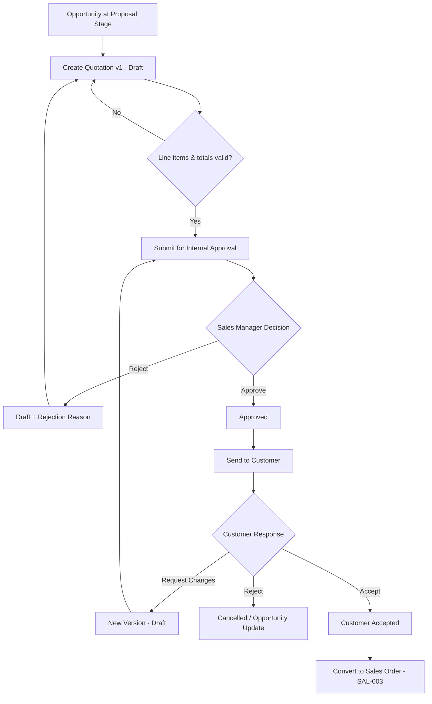
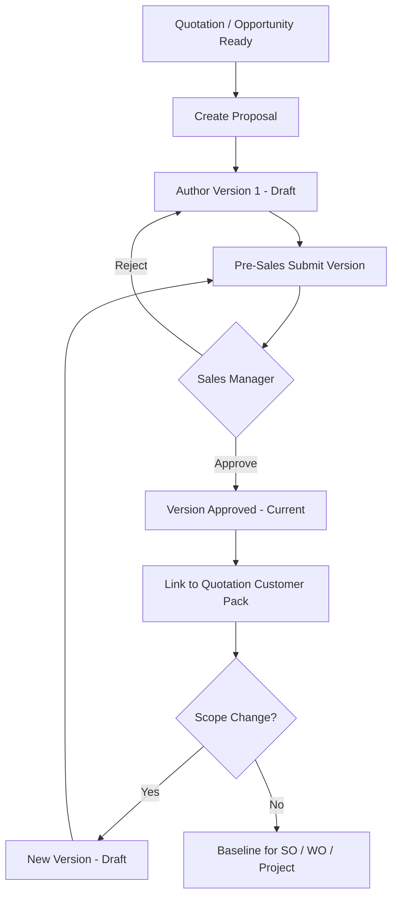
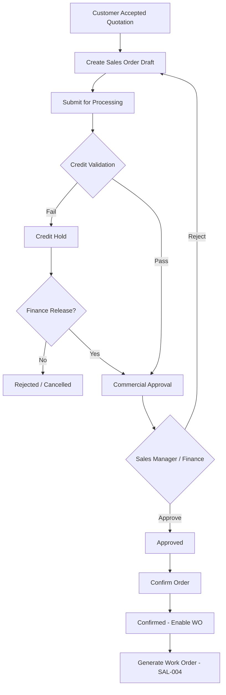
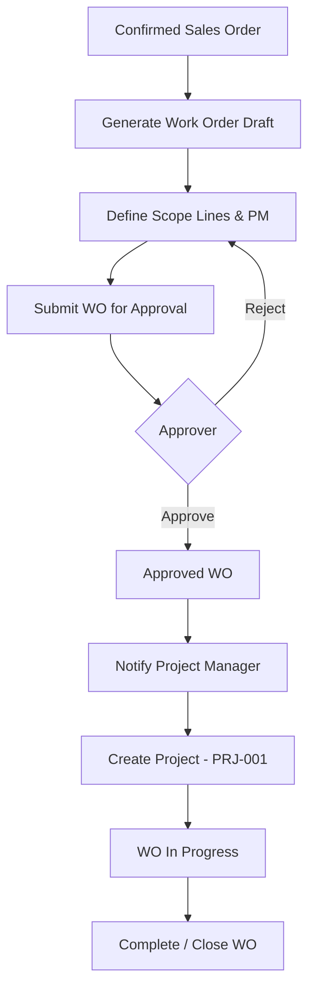

# E-LinkUp Sales Domain — Business Functional Specification Pack
**Document ID:** ELU-BFS-SAL  
**Document Name:** Sales Domain BFS Pack (SAL-001 … SAL-004)  
**Version:** 1.0  
**Status:** Approved
**Related Documents:** ELU-DOC-001, ELU-DF-001, ELU-BRD-001, ELU-EFS-001, ELU-RTM-001
**Classification:** Internal Confidential  
**Project:** E-LinkUp (By Euphoria Infotech)  
**Prepared By:** Senior Business Analyst · Enterprise Solution Architect · Product Owner  
**Document Owner:** PMO  
**SEH Alignment:** Enterprise Software Engineering Handbook (SEH)  
**Technology Stack:** Flutter (Web + Android) · Python FastAPI · PostgreSQL · JWT + Refresh Token · Docker · Linux VPS / Azure  
**Related Documents:** ELU-DF-001, ELU-BRD-001, ELU-STORY-001, ELU-WF-001, ELU-SAD-001, ELU-HLD-001

---

## Version History

| Version | Date | Author | Change |
|---------|------|--------|--------|
| 1.0 | 2026-07-31 | EIIP | Initial BFS pack (seventeen sections) |
| 1.0a | 2026-07-31 | EIIP / PMO | Status Approved; registered in ELU-DOC-001; Related Documents standardized |

## Pack Index

| # | Module ID | Module Name | Sub Module | Feature | Priority | Phase | Release | BFS Section |
|---|-----------|-------------|------------|---------|----------|-------|---------|-------------|
| 1 | SAL-001 | Quotation Management | SAL-001-001 Quotation | SAL-001-001-001 Quotation Creation | Critical | Phase 2 | v1.0 | [§ SAL-001](#sal-001-quotation-management) |
| 2 | SAL-002 | Proposal Management | SAL-002-001 Proposal | SAL-002-001-001 Proposal Versioning | Critical | Phase 2 | v1.0 | [§ SAL-002](#sal-002-proposal-management) |
| 3 | SAL-003 | Sales Order Management | SAL-003-001 Sales Order | SAL-003-001-001 Sales Order Processing | Critical | Phase 2 | v1.0 | [§ SAL-003](#sal-003-sales-order-management) |
| 4 | SAL-004 | Work Order Management | SAL-004-001 Work Order | SAL-004-001-001 Work Order Generation | Critical | Phase 2 | v1.0 | [§ SAL-004](#sal-004-work-order-management) |

### Cross-Module Conversion Spine

```text
Opportunity (CRM-002)
    │
    ▼
Quotation (SAL-001) ──link──► Proposal (SAL-002)
    │                              │
    │ Internal Approval            │ Version Control
    │ Customer Accept                │
    ▼                              ▼
Sales Order (SAL-003) ◄── Credit Validation · Commercial Approval
    │
    ▼
Work Order (SAL-004)
    │
    ▼
Project (PRJ-001)  [downstream — PRJ BFS pack]
```

### Standard User Handoff Chain (Tenant: Euphoria)

| Step | From Actor | To Actor | Object Transition |
|------|------------|----------|-------------------|
| 1 | Sales Executive | Sales Manager | Quotation submitted for internal approval |
| 2 | Sales Manager | Pre-Sales | Proposal authoring / technical validation |
| 3 | Pre-Sales | Sales Manager | Proposal version submitted for approval |
| 4 | Sales Manager | Finance User | Sales Order credit / commercial validation |
| 5 | Finance User | Project Manager | Work Order release → Project initiation |

### Shared Engine Dependencies

| Engine | Module Code | SAL Usage |
|--------|-------------|-----------|
| Workflow Engine | CPS-001 | Internal approval, commercial approval, WO release |
| Rule Engine | CPS-002 | Discount thresholds, credit hold, validity, tax |
| Notification Engine | CPS-003 | Submit, approve, reject, convert, expire |
| Reporting & Analytics | CPS-004 | Pipeline, conversion, ageing reports |
| Audit Service | CPS-005 / PF-010 | All lifecycle and approval events |
| Document Management | CPS-006 | Proposal attachments, customer-facing PDFs |
| Integration Framework | CPS-008 / INT-* | Future ERP / e-sign connectors (v2+) |

### API Namespace Convention

All Sales domain REST endpoints use prefix: **`/api/v1/sales/`**  
Authentication: Bearer JWT (tenant resolved from token claim — never from client body).  
Multi-tenancy: every business table scoped by `tenant_id` (UUID, indexed).

### Minimum Edition

| Module | Community | Professional | Enterprise |
|--------|-----------|--------------|------------|
| SAL-001 Quotation | — | ✓ | ✓ |
| SAL-002 Proposal | — | ✓ | ✓ |
| SAL-003 Sales Order | — | ✓ | ✓ |
| SAL-004 Work Order | — | — | ✓ |

---

# SAL-001 — Quotation Management

**Document ID:** ELU-BFS-SAL-001  
**Module:** SAL-001 — Quotation Management  
**Sub Module:** SAL-001-001 — Quotation  
**Feature:** SAL-001-001-001 — Quotation Creation  
**Domain:** SAL (Sales)  
**Priority / Phase / Release:** Critical · Phase 2 · v1.0  
**Example Tenant:** Euphoria  
**Workflow Reference:** WF-SAL-001  
**Stack:** Flutter · FastAPI · PostgreSQL · JWT+Refresh · Docker · VPS/Azure

---

## 1. Business Objective

### 1.1 Why this module exists

Euphoria users require a governed commercial quoting capability that originates from qualified Opportunities, enforces pricing and discount policy, supports revision and approval before customer release, and provides the sole approved baseline for Sales Order conversion. Without SAL-001, commercial terms live outside the system of record, breaking auditability and the lead-to-cash chain.

### 1.2 Business value

| Value Driver | Outcome |
|--------------|---------|
| Revenue governance | Discount and margin rules enforced before customer exposure |
| Pipeline integrity | Quotation value rolls up to Opportunity forecast |
| Conversion readiness | Approved, non-expired quotations convert to Sales Order in one action |
| Audit & compliance | Full trail of versions, approvers, and customer send events |
| Operational efficiency | Line-item catalog, tax, and totals calculated consistently (FIN-004 integration) |

### 1.3 Business scope

| In Scope (v1.0) | Out of Scope (v1.0) |
|-----------------|---------------------|
| Quotation header and line items | Multi-currency hedging |
| Versioning (revision creates new version; prior locked) | CPQ configurator / bundle rules engine |
| Internal approval workflow (Workflow Engine) | Customer self-service quote portal |
| Link to Opportunity, Customer, Contact | Automated competitive pricing feeds |
| Tax calculation via tenant tax config | Subscription / recurring billing quotes |
| Validity period and expiry enforcement | Third-party e-sign on quotation (v2) |
| Customer send tracking (sent date, channel) | |
| Convert to Sales Order (approved version only) | |
| Soft delete, export, print PDF | |
| Multi-tenant isolation | |

### 1.4 Users involved

Sales Executive (primary author), Sales Manager (approval), Pre-Sales (advisory / line validation), Finance User (advisory on commercial terms), Tenant Admin (configuration), Customer Contact (external recipient — read-only via shared document).

### 1.5 Module reference

| Attribute | Value |
|-----------|-------|
| Domain | SAL |
| Module | SAL-001 |
| Sub Module | SAL-001-001 |
| Feature | SAL-001-001-001 |
| Priority | Critical |
| Phase | Phase 2 |
| Release | v1.0 |
| Depends on | CRM-002 Opportunity, CRM-003 Customer, PF-009 RBAC, CPS-001 Workflow, CPS-002 Rules, FIN-004 Tax |
| Downstream | SAL-002 Proposal, SAL-003 Sales Order |

---

## 2. Business Actors

| Actor | Type | Primary Actions | Secondary Actions |
|-------|------|-----------------|-------------------|
| Sales Executive | Internal | Create, edit draft quotation; add line items; submit for approval; send to customer; record customer response | View history, export, print |
| Sales Manager | Internal | Approve / reject quotation; reassign owner; override hold (with audit) | View pipeline quotations, reports |
| Pre-Sales / Solution Architect | Internal | Review technical line items; comment; attach scope references | View, export |
| Finance User | Internal | Advisory review on payment terms; credit flag visibility | View, comment |
| Tenant Admin | Internal | Configure quotation prefixes, approval thresholds, default validity | Configure |
| Customer Contact | External | Receive quotation; accept / reject / request changes (recorded by Sales) | — |
| System (Workflow Engine) | System | Route approval tasks; enforce state guards | — |
| System (Rule Engine) | System | Validate discount, validity, mandatory links | — |
| System (Notification Engine) | System | Alert on submit, approve, reject, expire | — |
| System (Audit Service) | System | Immutable event log | — |

---

## 3. Business Story

A **Sales Executive** at tenant **Euphoria** opens Opportunity `OPP-2026-0142` in stage *Proposal / Quotation*. The Opportunity is linked to Customer **Euphoria Internal Account** (standard CRM Customer record — not a fictional third party) and primary Contact. The executive creates **Quotation** `QUO-2026-0087` (SAL-001-001-001), selects price list, adds line items (services, licenses, milestones), and sets validity to 30 days.

The Rule Engine evaluates line discounts: one line exceeds the tenant discount threshold (BR-SAL-003). The quotation cannot proceed to customer send until internal approval completes. The Sales Executive submits the quotation. The Workflow Engine assigns an approval task to the **Sales Manager**.

The **Sales Manager** reviews margin summary, attached Proposal reference (SAL-002), and approves. State moves to `Approved`. The Sales Executive marks the quotation *Sent to Customer* with send date and channel. The **Pre-Sales** user had previously linked technical scope notes in the Proposal version; those remain read-only on the quotation detail.

The Customer Contact requests a revision. The Sales Executive creates **version 2** (BR-SAL-006): version 1 locks; version 2 starts in `Draft`. After re-approval, version 2 is sent. The Customer accepts. The Sales Executive records *Customer Accepted* on the approved version.

On acceptance, the system enables **Convert to Sales Order** (handoff to SAL-003). If validity had expired (BR-SAL-002), conversion is blocked until validity is extended and re-approved. If the Sales Manager rejects during internal review, the quotation returns to `Draft` with mandatory rejection reason; the Sales Executive revises and resubmits.

Exception paths: **Cancel** (reason required, Opportunity remains open), **Expire** (system job on validity date), **On Hold** (Sales Manager pause during negotiation).

---

## 4. Business Workflow

### 4.1 Process Flow (Mermaid)



### 4.2 Step Table

| Step | Actor | Action | Input | Output | Engine |
|------|-------|--------|-------|--------|--------|
| 1 | Sales Executive | Create quotation from Opportunity | Opportunity, Customer | Quotation Draft v1 | API |
| 2 | Sales Executive | Add / edit line items, terms, validity | Product/Service catalog | Updated quotation | Rule Engine (tax) |
| 3 | Sales Executive | Submit for approval | Draft quotation | Submitted | Workflow Engine |
| 4 | Sales Manager | Approve or reject | Submitted quotation | Approved / Draft | Workflow Engine |
| 5 | Sales Executive | Send to customer | Approved quotation | Sent | Notification, Document |
| 6 | Sales Executive | Record customer response | Sent quotation | Accepted / Change Request / Rejected | API |
| 7 | Sales Executive | Revise (new version) | Change request | Quotation v(n+1) Draft | Versioning |
| 8 | Sales Executive | Convert to Sales Order | Approved + Accepted + Valid | Sales Order Draft | SAL-003 API |
| 9 | System | Expire on validity date | Approved/Sent | Expired | Scheduler |

---

## 5. Business States

| State Code | State Label | Description | Allowed Next States | Entry Actors | System Effects |
|------------|-------------|-------------|---------------------|--------------|----------------|
| `DRAFT` | Draft | Editable; not visible to customer | SUBMITTED, CANCELLED | Sales Executive | Line items editable |
| `SUBMITTED` | Submitted | Awaiting internal approval | UNDER_REVIEW, APPROVED, REJECTED, DRAFT | Sales Executive, System | Locks commercial fields |
| `UNDER_REVIEW` | Under Review | Active approval task | APPROVED, REJECTED | Sales Manager | Workflow task open |
| `APPROVED` | Approved | Internally approved; ready to send | SENT, ON_HOLD, CANCELLED, EXPIRED | Sales Manager, System | Conversion eligible (if accepted) |
| `REJECTED` | Rejected | Internal rejection | DRAFT | Sales Manager | Notification to owner |
| `SENT` | Sent to Customer | Released to customer | CUSTOMER_ACCEPTED, CUSTOMER_REJECTED, CHANGE_REQUESTED, EXPIRED, ON_HOLD | Sales Executive | PDF snapshot locked |
| `CUSTOMER_ACCEPTED` | Customer Accepted | Customer agreed to terms | CONVERTED, CANCELLED | Sales Executive | Enables SO conversion |
| `CUSTOMER_REJECTED` | Customer Rejected | Customer declined | CANCELLED, DRAFT (new version) | Sales Executive | Opportunity update suggested |
| `CHANGE_REQUESTED` | Change Requested | Customer wants revision | DRAFT (new version) | Sales Executive | Parent version locked |
| `ON_HOLD` | On Hold | Negotiation pause | APPROVED, SENT, CANCELLED | Sales Manager | Blocks conversion |
| `EXPIRED` | Expired | Past validity date | DRAFT (extension workflow) | System | Blocks conversion |
| `CONVERTED` | Converted | Linked Sales Order created | — | System | Read-only |
| `CANCELLED` | Cancelled | Voided with reason | — | Sales Executive, Sales Manager | Read-only |
| `ARCHIVED` | Archived | Soft-deleted / historical | — | Tenant Admin | Hidden from default lists |

---

## 6. Business Rules

| Rule ID | Statement | Type | Severity | Enforcement |
|---------|-----------|------|----------|-------------|
| BR-SAL-001 | A Quotation shall reference a valid Opportunity and Customer within the same tenant | Validation | Error | API, DB |
| BR-SAL-002 | Validity end date is mandatory; expired quotations shall not convert to Sales Order | Lifecycle | Error | Rule Engine, API |
| BR-SAL-003 | Line or header discount above tenant threshold shall require Sales Manager approval before Approved state | Approval | Error | Rule Engine, Workflow |
| BR-SAL-004 | Tax amounts shall be calculated using tenant tax configuration (FIN-004) | Calculation | Error | Rule Engine, API |
| BR-SAL-005 | Only a quotation in Approved or Customer Accepted state with current approved version flag may create a Sales Order | Lifecycle | Error | API |
| BR-SAL-006 | Creating a new quotation version shall increment version_no, lock the prior version, and link parent_version_id | Lifecycle | Error | API, DB |
| BR-SAL-007 | Only one version per quotation family may be marked is_current_approved at a time | Validation | Error | DB |
| BR-SAL-008 | Submitted quotations shall lock unit price and discount fields until rejected back to Draft | Lifecycle | Warning | UI, API |
| BR-SAL-009 | Quotation total shall equal sum of line extended amounts plus tax minus header discount | Calculation | Error | API |
| BR-SAL-010 | Cancel and reject actions shall require a reason code and comment | Validation | Error | UI, API |
| BR-SAL-011 | Customer Contact linked on quotation shall belong to the same Customer record | Validation | Error | API |
| BR-SAL-012 | Soft-deleted quotations shall not appear in default search; restore requires quotation.restore permission | Security | Error | API |
| BR-SAL-013 | Quotation number shall be unique per tenant per fiscal year prefix | Validation | Error | DB |
| BR-SAL-014 | Send to Customer shall be blocked unless state is Approved | Lifecycle | Error | API |
| BR-SAL-015 | Opportunity stage should reflect Quotation activity (info sync to CRM-002) | Lifecycle | Info | Integration hook |

---

## 7. Database Impact

| Table Name | Type | Purpose | Tenant Scoped |
|------------|------|---------|---------------|
| `quotation` | Transaction | Quotation header, status, versioning, totals | Yes |
| `quotation_line` | Transaction | Line items, qty, price, discount, tax | Yes |
| `quotation_version` | Transaction | Version metadata, parent link, is_current_approved | Yes |
| `quotation_approval` | Transaction | Approval history steps | Yes |
| `quotation_customer_response` | Transaction | Accept / reject / change request log | Yes |
| `quotation_tax_line` | Transaction | Tax breakdown per quotation | Yes |
| `quotation_attachment_link` | Link | Document Engine references | Yes |
| `quotation_status_history` | Audit | State transition log | Yes |
| `quotation_number_sequence` | Master | Per-tenant FY numbering | Yes |

---

## 8. Relationships

| Parent | Child | Cardinality | On Delete | Notes |
|--------|-------|-------------|-----------|-------|
| `tenant` | `quotation` | 1:N | Restrict | Platform tenancy |
| `opportunity` | `quotation` | 1:N | Restrict | CRM-002 FK |
| `customer` | `quotation` | 1:N | Restrict | CRM-003 FK |
| `contact` | `quotation` | 1:N | Restrict | Optional bill-to / ship-to contact |
| `quotation` | `quotation_line` | 1:N | Cascade (soft) | Lines belong to one header |
| `quotation` | `quotation_version` | 1:N | Restrict | Version family |
| `quotation_version` | `quotation` | 1:1 | — | Current version pointer on header |
| `quotation` | `proposal` | N:M | Restrict | Via `quotation_proposal_link` (SAL-002) |
| `quotation` | `sales_order` | 1:1 | Restrict | Post-conversion; one SO per accepted quote v1.0 |
| `user` | `quotation` | 1:N | Restrict | owner_id, created_by |
| `price_list` | `quotation_line` | 1:N | Restrict | Optional catalog reference |

---

## 9. Field Groups

### `quotation`
General Information · Commercial Summary · Validity & Terms · Customer & Opportunity Links · Assignment · Status & Version · Approval Metadata · Customer Send · Conversion Links · Attachments · Audit

### `quotation_line`
Line Identity · Product/Service Reference · Quantity & UOM · Pricing · Discount · Tax · Line Totals · Delivery Notes · Audit

### `quotation_version`
Version Identity · Parent Version · Approval Snapshot · Lock Flags · Audit

### `quotation_approval`
Workflow Step · Approver · Decision · Timestamp · Comments · Audit

### `quotation_customer_response`
Response Type · Date · Channel · Notes · Recorded By · Audit

---

## 10. REST APIs

| Method | Path | Purpose | Permission |
|--------|------|---------|------------|
| POST | `/api/v1/sales/quotations` | Create quotation | `quotation.create` |
| GET | `/api/v1/sales/quotations` | List with filters (status, owner, opportunity, date) | `quotation.read` |
| GET | `/api/v1/sales/quotations/{id}` | Get by ID with lines and version | `quotation.read` |
| PUT | `/api/v1/sales/quotations/{id}` | Full update (Draft only) | `quotation.update` |
| PATCH | `/api/v1/sales/quotations/{id}` | Partial update | `quotation.update` |
| PATCH | `/api/v1/sales/quotations/{id}/status` | State transition | `quotation.submit` / `quotation.approve` |
| POST | `/api/v1/sales/quotations/{id}/submit` | Submit for approval | `quotation.submit` |
| POST | `/api/v1/sales/quotations/{id}/approve` | Approve | `quotation.approve` |
| POST | `/api/v1/sales/quotations/{id}/reject` | Reject with reason | `quotation.reject` |
| POST | `/api/v1/sales/quotations/{id}/send` | Mark sent to customer | `quotation.update` |
| POST | `/api/v1/sales/quotations/{id}/customer-response` | Record accept/reject/change | `quotation.update` |
| POST | `/api/v1/sales/quotations/{id}/versions` | Create new version | `quotation.update` |
| POST | `/api/v1/sales/quotations/{id}/convert` | Convert to Sales Order | `quotation.convert` |
| POST | `/api/v1/sales/quotations/{id}/cancel` | Cancel with reason | `quotation.cancel` |
| DELETE | `/api/v1/sales/quotations/{id}` | Soft delete | `quotation.delete` |
| POST | `/api/v1/sales/quotations/{id}/restore` | Restore archived | `quotation.restore` |
| GET | `/api/v1/sales/quotations/search` | Advanced search | `quotation.read` |
| GET | `/api/v1/sales/quotations/{id}/export` | Export PDF/Excel | `quotation.export` |
| GET | `/api/v1/sales/quotations/{id}/history` | Status and approval history | `quotation.read` |
| POST | `/api/v1/sales/quotations/{id}/lines` | Add line | `quotation.update` |
| PUT | `/api/v1/sales/quotations/{id}/lines/{line_id}` | Update line | `quotation.update` |
| DELETE | `/api/v1/sales/quotations/{id}/lines/{line_id}` | Remove line | `quotation.update` |

---

## 11. Flutter Screens

| Screen ID | Screen | Type | Primary Actor | Route (illustrative) | Notes |
|-----------|--------|------|---------------|----------------------|-------|
| SAL-UI-Q-001 | Quotation List | List | Sales Executive | `/sales/quotations` | Filters: status, owner, opportunity, expiry |
| SAL-UI-Q-002 | Quotation Create | Create | Sales Executive | `/sales/quotations/new` | Opportunity pre-fill when launched from CRM |
| SAL-UI-Q-003 | Quotation Edit | Edit | Sales Executive | `/sales/quotations/{id}/edit` | Draft only |
| SAL-UI-Q-004 | Quotation Detail | View | All internal roles | `/sales/quotations/{id}` | Tabs: lines, versions, approval, documents |
| SAL-UI-Q-005 | Quotation Search | Search | Sales Manager | `/sales/quotations/search` | Advanced filters |
| SAL-UI-Q-006 | Quotation Approval Inbox | Approval | Sales Manager | `/sales/quotations/approvals` | Workflow Engine tasks |
| SAL-UI-Q-007 | Quotation Version History | History | Sales Executive | `/sales/quotations/{id}/versions` | Compare versions |
| SAL-UI-Q-008 | Quotation Send Dialog | Action | Sales Executive | modal | Channel, date, message |
| SAL-UI-Q-009 | Quotation Convert Wizard | Action | Sales Executive | `/sales/quotations/{id}/convert` | Handoff to Sales Order |
| SAL-UI-Q-010 | Quotation Print / Export | Export | Sales Executive | `/sales/quotations/{id}/print` | Branded PDF |

Web and Android share IA; Android supports offline read of cached quotation detail (sync on reconnect).

---

## 12. RBAC Permissions

### Permission Codes

`quotation.create` · `quotation.read` · `quotation.update` · `quotation.delete` · `quotation.submit` · `quotation.approve` · `quotation.reject` · `quotation.assign` · `quotation.convert` · `quotation.export` · `quotation.cancel` · `quotation.restore` · `quotation.configure`

### Role Matrix (Tenant: Euphoria)

| Permission | Sales Executive | Sales Manager | Pre-Sales | Finance User | Tenant Admin |
|------------|:---------------:|:-------------:|:---------:|:------------:|:------------:|
| quotation.create | ✓ | ✓ | — | — | ✓ |
| quotation.read | ✓ | ✓ | ✓ | ✓ | ✓ |
| quotation.update | ✓ | ✓ | — | — | ✓ |
| quotation.submit | ✓ | ✓ | — | — | — |
| quotation.approve | — | ✓ | — | — | ✓ |
| quotation.reject | — | ✓ | — | — | ✓ |
| quotation.convert | ✓ | ✓ | — | — | — |
| quotation.export | ✓ | ✓ | ✓ | ✓ | ✓ |
| quotation.cancel | ✓ | ✓ | — | — | ✓ |
| quotation.delete | — | ✓ | — | — | ✓ |
| quotation.configure | — | — | — | — | ✓ |

Enforcement: server-side on every API; UI hides disabled actions.

---

## 13. Notifications

| Event | Channels | Recipients | Template Key |
|-------|----------|------------|--------------|
| Quotation submitted for approval | Email, Push, Internal | Sales Manager (approver) | NTF-SAL-Q-001 |
| Quotation approved | Email, Push, Internal | Sales Executive (owner) | NTF-SAL-Q-002 |
| Quotation rejected | Email, Push, Internal | Sales Executive (owner) | NTF-SAL-Q-003 |
| Quotation sent to customer | Email, Internal | Sales Manager | NTF-SAL-Q-004 |
| Quotation expiring in 3 days | Email, Push | Sales Executive | NTF-SAL-Q-005 |
| Quotation expired | Email, Push, Internal | Sales Executive, Sales Manager | NTF-SAL-Q-006 |
| Quotation customer accepted | Email, Push, Internal | Sales Manager, Finance User | NTF-SAL-Q-007 |
| Quotation converted to Sales Order | Email, Internal | Sales Executive, Finance User | NTF-SAL-Q-008 |

Phase 2: Email + Internal mandatory; Push where mobile enabled; SMS/WhatsApp deferred to v2.

---

## 14. Reports

### Operational
| Report ID | Name | Audience | Grain | Filters | Export |
|-----------|------|----------|-------|---------|--------|
| RPT-SAL-Q-001 | Open Quotations by Status | Sales Executive | Quotation | Owner, status, date | PDF, Excel |
| RPT-SAL-Q-002 | Quotation Ageing | Sales Manager | Quotation | Days open, stage | Excel |
| RPT-SAL-Q-003 | Expiring Quotations (7/30 day) | Sales Executive | Quotation | Validity window | Excel |

### Management
| Report ID | Name | Audience | Grain | Filters | Export |
|-----------|------|----------|-------|---------|--------|
| RPT-SAL-Q-010 | Quotation Pipeline Value | Sales Manager | Opportunity / Quotation | BU, period | PDF, Excel |
| RPT-SAL-Q-011 | Win/Loss on Quotations | Sales Manager | Quotation | Outcome, reason | Excel |
| RPT-SAL-Q-012 | Discount Exception Report | Finance User | Line | Threshold breach | Excel |

### Executive / KPI
| KPI ID | Name | Formula (illustrative) |
|--------|------|------------------------|
| KPI-SAL-Q-001 | Quote-to-Order Conversion Rate | Converted quotations / Customer accepted |
| KPI-SAL-Q-002 | Average Approval Cycle Time | Approved_at − Submitted_at |
| KPI-SAL-Q-003 | Quotation Pipeline Value | Sum open approved/sent quotation totals |

---

## 15. Audit Requirements

| Event | Payload Captured | Retention |
|-------|------------------|-----------|
| quotation.created | Full header snapshot | Tenant policy (default 7 years) |
| quotation.updated | Field-level diff | Tenant policy |
| quotation.status_changed | Old/new state, actor, reason | Tenant policy |
| quotation.submitted | Approver routing | Tenant policy |
| quotation.approved / rejected | Approver, comments | Tenant policy |
| quotation.sent | Channel, recipient contact | Tenant policy |
| quotation.customer_response | Response type, notes | Tenant policy |
| quotation.version_created | Parent version, new version_no | Tenant policy |
| quotation.converted | sales_order_id | Tenant policy |
| quotation.cancelled | Reason | Tenant policy |
| quotation.exported | Format, user | Tenant policy |
| quotation.soft_deleted / restored | Actor, timestamp | Tenant policy |

---

## 16. Acceptance Criteria

1. **Given** a Sales Executive on tenant Euphoria with `quotation.create`, **when** they create a quotation from a qualified Opportunity, **then** Customer and Opportunity are auto-linked and quotation is in `Draft`.
2. **Given** a draft quotation with line discount above threshold, **when** submitted, **then** Workflow routes to Sales Manager and state is `Under Review`.
3. **Given** a submitted quotation, **when** Sales Manager rejects with reason, **then** state returns to `Draft`, owner is notified, and reason is auditable.
4. **Given** an approved quotation, **when** validity date passes, **then** system sets `Expired` and blocks conversion.
5. **Given** an approved, valid, customer-accepted quotation, **when** convert is invoked, **then** Sales Order draft is created in SAL-003 with line copy and quotation is `Converted`.
6. **Given** two tenants, **when** User A queries quotations, **then** no tenant B data is returned (isolation test).
7. **Given** a new version request, **when** version 2 is created, **then** version 1 is locked and parent_version_id is set.
8. **Given** a non-approved quotation, **when** convert API is called, **then** HTTP 422 with BR-SAL-005 message.
9. **Given** tax configuration in FIN-004, **when** lines are saved, **then** tax matches rule engine calculation.
10. **Given** any status change, **when** completed, **then** audit event is written within 1 second.

---

## 17. Future Enhancements

| Version | Enhancement |
|---------|-------------|
| v2.0 | Customer self-service quote portal; e-sign integration (INT-003); multi-currency with FX rates; quotation templates library; AI-assisted line suggestions (CPS-007) |
| v3.0 | Full CPQ configurator; subscription / recurring quote lines; competitive win-loss analytics; deep ERP real-time sync |

---

# SAL-002 — Proposal Management

**Document ID:** ELU-BFS-SAL-002  
**Module:** SAL-002 — Proposal Management  
**Sub Module:** SAL-002-001 — Proposal  
**Feature:** SAL-002-001-001 — Proposal Versioning  
**Domain:** SAL  
**Priority / Phase / Release:** Critical · Phase 2 · v1.0  
**Example Tenant:** Euphoria  
**Workflow Reference:** WF-SAL-001  
**Stack:** Flutter · FastAPI · PostgreSQL · JWT+Refresh · Docker · VPS/Azure

---

## 1. Business Objective

### 1.1 Why this module exists

Technical and solution content must be authored, versioned, and approved separately from commercial line items while remaining linked to the same Opportunity and Quotation. SAL-002 provides governed Proposal versioning for Pre-Sales output — scope, assumptions, deliverables, architecture narrative — with Document Engine integration and approval alignment to commercial release.

### 1.2 Business value

| Value Driver | Outcome |
|--------------|---------|
| Solution accuracy | Version-controlled scope reduces delivery disputes |
| Collaboration | Pre-Sales and Sales Executive work on linked artefacts |
| Compliance | Only approved proposal versions attach to customer-facing packs |
| Traceability | Full version lineage from v1 to customer-accepted baseline |
| Delivery handoff | Approved proposal versions inform Work Order and Project scope (PRJ-001) |

### 1.3 Business scope

| In Scope (v1.0) | Out of Scope (v1.0) |
|-----------------|---------------------|
| Proposal header linked to Opportunity / Quotation | Collaborative real-time co-editing (v2) |
| Version create, lock, compare, approve | BOQ auto-sync from external CAD tools |
| Rich text + structured sections | Full document redlining between users |
| Document attachments per version | Customer portal co-authoring |
| Internal approval per version | AI-generated proposal body (v3) |
| Link multiple proposals to one quotation (primary flag) | |
| Mark current approved version | |

### 1.4 Users involved

Pre-Sales / Solution Architect (primary author), Sales Executive (initiator / coordinator), Sales Manager (approver), Project Manager (downstream consumer), Tenant Admin.

### 1.5 Module reference

| Attribute | Value |
|-----------|-------|
| Module | SAL-002 |
| Sub Module | SAL-002-001 |
| Feature | SAL-002-001-001 |
| Priority | Critical |
| Phase | Phase 2 |
| Release | v1.0 |
| Depends on | SAL-001, CRM-002, CPS-006 Document, CPS-001 Workflow |
| Downstream | SAL-003, SAL-004, PRJ-001 |

---

## 2. Business Actors

| Actor | Type | Primary Actions | Secondary Actions |
|-------|------|-----------------|-------------------|
| Pre-Sales / Solution Architect | Internal | Author proposal versions; upload technical documents; submit for approval | Comment, compare versions |
| Sales Executive | Internal | Initiate proposal; link to quotation; coordinate customer send | View, export |
| Sales Manager | Internal | Approve / reject proposal versions | View all proposals |
| Project Manager | Internal | View approved proposal for delivery planning | Read-only post-WO |
| Tenant Admin | Internal | Configure section templates | Configure |
| System (Document Engine) | System | Store versioned files | — |
| System (Workflow Engine) | System | Route approvals | — |
| System (Audit Service) | System | Log version and approval events | — |

---

## 3. Business Story

After **Sales Executive** creates Quotation `QUO-2026-0087`, they initiate **Proposal** `PRP-2026-0034` linked to the same Opportunity. **Pre-Sales** opens the proposal, selects the standard Euphoria section template (Executive Summary, Scope, Assumptions, Deliverables, Timeline, Team, Commercial Reference), and authors **version 1** in `Draft`.

Pre-Sales uploads architecture diagram and SOW appendix via Document Engine. When content is complete, Pre-Sales submits version 1 for internal approval. **Sales Manager** reviews technical scope against quotation line items; a mismatch triggers rejection with comment. Pre-Sales fixes scope and creates **version 2** — version 1 locks automatically (BR-SAL-024).

Version 2 is approved. The system sets `is_current_approved = true` on version 2 and clears the flag on version 1 (BR-SAL-025). The Sales Executive attaches the approved proposal pack to the customer quotation send.

Customer requests scope change. Pre-Sales creates **version 3** from version 2 with change reason *Customer change request*. The approval cycle repeats. Only the current approved version may be linked as primary on the Quotation customer send (BR-SAL-026).

When the Opportunity converts to Sales Order and later Work Order, **Project Manager** opens the approved proposal version as the baseline scope document for PRJ-001 project initiation — completing the Pre-Sales → Delivery handoff.

---

## 4. Business Workflow

### 4.1 Process Flow



### 4.2 Step Table

| Step | Actor | Action | Input | Output | Engine |
|------|-------|--------|-------|--------|--------|
| 1 | Sales Executive | Create proposal shell | Opportunity, Quotation | Proposal record | API |
| 2 | Pre-Sales | Author version content | Template sections | Proposal version Draft | Document Engine |
| 3 | Pre-Sales | Submit version | Draft version | Submitted | Workflow |
| 4 | Sales Manager | Approve / reject | Submitted version | Approved / Draft | Workflow |
| 5 | System | Set current approved flag | Approved version | is_current_approved | Rule Engine |
| 6 | Sales Executive | Attach to quotation send | Approved version | Customer pack | SAL-001 |
| 7 | Pre-Sales | Create new version on change | Prior version | New version Draft | Versioning |
| 8 | Project Manager | Consume approved version | Approved proposal | Project scope input | PRJ-001 |

---

## 5. Business States

### Proposal (header) states

| State Code | State Label | Description | Allowed Next States | Entry Actors | System Effects |
|------------|-------------|-------------|---------------------|--------------|----------------|
| `DRAFT` | Draft | No approved version yet | ACTIVE, CANCELLED | Pre-Sales, Sales Executive | Editable |
| `ACTIVE` | Active | At least one approved version exists | ON_HOLD, CLOSED, CANCELLED | System | Primary for linking |
| `ON_HOLD` | On Hold | Pause authoring | ACTIVE, CANCELLED | Sales Manager | Blocks new submit |
| `CLOSED` | Closed | Opportunity won/lost; read-only | ARCHIVED | System, Sales Manager | Historical |
| `CANCELLED` | Cancelled | Voided | ARCHIVED | Sales Manager | — |
| `ARCHIVED` | Archived | Soft deleted | — | Tenant Admin | Hidden |

### Proposal Version states

| State Code | State Label | Allowed Next States | Entry Actors |
|------------|-------------|---------------------|--------------|
| `DRAFT` | Draft | SUBMITTED, CANCELLED | Pre-Sales |
| `SUBMITTED` | Submitted | UNDER_REVIEW, APPROVED, REJECTED | Pre-Sales |
| `UNDER_REVIEW` | Under Review | APPROVED, REJECTED | Sales Manager |
| `APPROVED` | Approved | SUPERSEDED | Sales Manager |
| `REJECTED` | Rejected | DRAFT (new version) | Sales Manager |
| `SUPERSEDED` | Superseded | — | System (when newer version approved) |
| `LOCKED` | Locked | — | System (on new version create) |

---

## 6. Business Rules

| Rule ID | Statement | Type | Severity | Enforcement |
|---------|-----------|------|----------|-------------|
| BR-SAL-020 | A Proposal shall reference Opportunity; Quotation link is recommended when quotation exists | Validation | Error | API |
| BR-SAL-021 | Proposal version number shall increment monotonically per proposal_id | Lifecycle | Error | DB |
| BR-SAL-022 | Creating a new proposal version shall lock the prior version content and attachments | Lifecycle | Error | API, Document Engine |
| BR-SAL-023 | Rejected versions shall return to Draft or require new version; approved content shall not be silently overwritten | Lifecycle | Error | API |
| BR-SAL-024 | Only Pre-Sales or Sales Executive with proposal.update may author versions | Security | Error | RBAC, API |
| BR-SAL-025 | Only one proposal version per proposal may have is_current_approved = true | Validation | Error | DB |
| BR-SAL-026 | Customer-facing quotation send shall reference a proposal version in Approved state with is_current_approved | Lifecycle | Error | API, SAL-001 |
| BR-SAL-027 | Version submit shall require all mandatory sections completed per template | Validation | Error | Rule Engine |
| BR-SAL-028 | Superseded versions shall be read-only | Lifecycle | Error | API |
| BR-SAL-029 | Proposal cancellation shall require reason and Sales Manager authority | Lifecycle | Error | API |
| BR-SAL-030 | Document attachments shall be version-scoped, not shared mutable across versions | Security | Error | Document Engine |
| BR-SAL-031 | Compare view shall show section-level diff metadata between two selected versions | Info | Info | UI |
| BR-SAL-032 | Closed proposal shall not accept new versions without Sales Manager reopen | Lifecycle | Warning | API |

---

## 7. Database Impact

| Table Name | Type | Purpose | Tenant Scoped |
|------------|------|---------|---------------|
| `proposal` | Transaction | Proposal header, status, links | Yes |
| `proposal_version` | Transaction | Version body, status, approval flags | Yes |
| `proposal_section` | Transaction | Structured section content per version | Yes |
| `proposal_template` | Master | Tenant section templates | Yes |
| `proposal_version_approval` | Transaction | Per-version approval steps | Yes |
| `quotation_proposal_link` | Link | Quotation ↔ Proposal (primary flag) | Yes |
| `proposal_attachment_link` | Link | Document Engine refs per version | Yes |
| `proposal_version_compare_cache` | Transaction | Optional diff cache | Yes |

---

## 8. Relationships

| Parent | Child | Cardinality | On Delete | Notes |
|--------|-------|-------------|-----------|-------|
| `opportunity` | `proposal` | 1:N | Restrict | CRM-002 |
| `quotation` | `proposal` | N:M | Restrict | Via link table |
| `proposal` | `proposal_version` | 1:N | Restrict | Version family |
| `proposal_version` | `proposal_section` | 1:N | Cascade (soft) | |
| `proposal_template` | `proposal_section` | 1:N | Restrict | Template default |
| `proposal_version` | `proposal_attachment_link` | 1:N | Restrict | Document Engine |
| `proposal_version` | `work_order` | 1:N | Restrict | Scope reference SAL-004 |
| `proposal_version` | `project` | 1:N | Restrict | PRJ-001 scope baseline |

---

## 9. Field Groups

### `proposal`
General Information · Opportunity & Quotation Links · Assignment · Header Status · Primary Version Pointer · Audit

### `proposal_version`
Version Identity · Content Summary · Approval Status · Lock Flags · is_current_approved · Change Reason · Submitted/Approved Dates · Audit

### `proposal_section`
Section Key · Title · Body (rich text) · Sort Order · Mandatory Flag · Completion Status · Audit

### `proposal_template`
Template Name · Section Definitions · Edition Scope · Active Flag · Audit

---

## 10. REST APIs

| Method | Path | Purpose | Permission |
|--------|------|---------|------------|
| POST | `/api/v1/sales/proposals` | Create proposal | `proposal.create` |
| GET | `/api/v1/sales/proposals` | List proposals | `proposal.read` |
| GET | `/api/v1/sales/proposals/{id}` | Get proposal with versions summary | `proposal.read` |
| PUT | `/api/v1/sales/proposals/{id}` | Update header (Draft/Active) | `proposal.update` |
| PATCH | `/api/v1/sales/proposals/{id}/status` | Header status change | `proposal.update` |
| DELETE | `/api/v1/sales/proposals/{id}` | Soft delete | `proposal.delete` |
| POST | `/api/v1/sales/proposals/{id}/versions` | Create new version | `proposal.version` |
| GET | `/api/v1/sales/proposals/{id}/versions` | List versions | `proposal.read` |
| GET | `/api/v1/sales/proposals/{id}/versions/{version_id}` | Get version detail + sections | `proposal.read` |
| PUT | `/api/v1/sales/proposals/{id}/versions/{version_id}` | Update draft version | `proposal.update` |
| POST | `/api/v1/sales/proposals/{id}/versions/{version_id}/submit` | Submit for approval | `proposal.submit` |
| POST | `/api/v1/sales/proposals/{id}/versions/{version_id}/approve` | Approve version | `proposal.approve` |
| POST | `/api/v1/sales/proposals/{id}/versions/{version_id}/reject` | Reject version | `proposal.reject` |
| GET | `/api/v1/sales/proposals/{id}/versions/compare` | Compare two versions | `proposal.read` |
| POST | `/api/v1/sales/proposals/{id}/link-quotation` | Link to quotation | `proposal.update` |
| GET | `/api/v1/sales/proposals/search` | Search | `proposal.read` |
| GET | `/api/v1/sales/proposals/{id}/versions/{version_id}/export` | Export PDF | `proposal.export` |
| POST | `/api/v1/sales/proposals/{id}/versions/{version_id}/attachments` | Add attachment | `proposal.update` |

---

## 11. Flutter Screens

| Screen ID | Screen | Type | Primary Actor | Route | Notes |
|-----------|--------|------|---------------|-------|-------|
| SAL-UI-P-001 | Proposal List | List | Pre-Sales | `/sales/proposals` | Filter by opportunity, status |
| SAL-UI-P-002 | Proposal Create | Create | Sales Executive | `/sales/proposals/new` | Link opportunity / quotation |
| SAL-UI-P-003 | Proposal Version Editor | Edit | Pre-Sales | `/sales/proposals/{id}/versions/{vid}/edit` | Section tabs, attachments |
| SAL-UI-P-004 | Proposal Detail | View | All | `/sales/proposals/{id}` | Version timeline |
| SAL-UI-P-005 | Version Compare | View | Pre-Sales, Sales Manager | `/sales/proposals/{id}/compare` | Side-by-side |
| SAL-UI-P-006 | Proposal Approval Inbox | Approval | Sales Manager | `/sales/proposals/approvals` | |
| SAL-UI-P-007 | Template Admin | Configure | Tenant Admin | `/settings/sales/proposal-templates` | |
| SAL-UI-P-008 | Version History | History | Pre-Sales | `/sales/proposals/{id}/versions` | Lock indicators |

---

## 12. RBAC Permissions

`proposal.create` · `proposal.read` · `proposal.update` · `proposal.delete` · `proposal.submit` · `proposal.approve` · `proposal.reject` · `proposal.version` · `proposal.export` · `proposal.restore` · `proposal.configure`

| Permission | Sales Executive | Sales Manager | Pre-Sales | Project Manager | Tenant Admin |
|------------|:---------------:|:-------------:|:---------:|:---------------:|:------------:|
| proposal.create | ✓ | ✓ | ✓ | — | ✓ |
| proposal.read | ✓ | ✓ | ✓ | ✓ | ✓ |
| proposal.update | ✓ | — | ✓ | — | ✓ |
| proposal.version | — | — | ✓ | — | ✓ |
| proposal.submit | — | — | ✓ | — | — |
| proposal.approve | — | ✓ | — | — | ✓ |
| proposal.reject | — | ✓ | — | — | ✓ |
| proposal.export | ✓ | ✓ | ✓ | ✓ | ✓ |

---

## 13. Notifications

| Event | Channels | Recipients | Template Key |
|-------|----------|------------|--------------|
| Proposal version submitted | Email, Internal | Sales Manager | NTF-SAL-P-001 |
| Proposal version approved | Email, Internal | Pre-Sales, Sales Executive | NTF-SAL-P-002 |
| Proposal version rejected | Email, Internal | Pre-Sales | NTF-SAL-P-003 |
| New version created (supersedes) | Internal | Sales Executive | NTF-SAL-P-004 |
| Proposal linked to quotation | Internal | Sales Executive | NTF-SAL-P-005 |

---

## 14. Reports

| Report ID | Name | Audience | Grain | Export |
|-----------|------|----------|-------|--------|
| RPT-SAL-P-001 | Open Proposals by Status | Pre-Sales | Proposal | Excel |
| RPT-SAL-P-002 | Proposal Version Approval Cycle | Sales Manager | Version | Excel |
| RPT-SAL-P-003 | Proposals Without Approved Version | Sales Manager | Proposal | Excel |
| KPI-SAL-P-001 | Avg Versions per Won Opportunity | Sales Manager | Opportunity | Dashboard |

---

## 15. Audit Requirements

Version created · version submitted · version approved/rejected · section updated · attachment added/removed · current approved flag changed · quotation link changed · proposal status changed · export · soft delete/restore.

---

## 16. Acceptance Criteria

1. Pre-Sales can create version 1 and submit; Sales Manager approval sets `is_current_approved`.
2. Creating version 2 locks version 1; version 1 state becomes `Locked` or `Superseded` after v2 approval.
3. Quotation customer send blocked if linked proposal lacks approved current version (BR-SAL-026).
4. Compare API returns section diff for two version IDs.
5. Multi-tenant isolation verified for all proposal endpoints.
6. Project Manager can read approved version linked from Work Order context.
7. Reject requires comment; audit trail complete.

---

## 17. Future Enhancements

| Version | Enhancement |
|---------|-------------|
| v2.0 | Real-time collaborative editing; customer portal view; e-sign on proposal; BOQ import |
| v3.0 | AI scope drafting; automatic risk clause suggestions; integration with knowledge base |

---

# SAL-003 — Sales Order Management

**Document ID:** ELU-BFS-SAL-003  
**Module:** SAL-003 — Sales Order Management  
**Sub Module:** SAL-003-001 — Sales Order  
**Feature:** SAL-003-001-001 — Sales Order Processing  
**Domain:** SAL  
**Priority / Phase / Release:** Critical · Phase 2 · v1.0  
**Example Tenant:** Euphoria  
**Workflow Reference:** WF-SAL-002  
**Stack:** Flutter · FastAPI · PostgreSQL · JWT+Refresh · Docker · VPS/Azure

---

## 1. Business Objective

### 1.1 Why this module exists

A Sales Order is the contractual commitment record between Euphoria and the Customer, created from an accepted Quotation after credit and commercial validation. SAL-003 formalises order processing, internal approvals, confirmation, and release to Work Order generation — bridging Sales and Delivery.

### 1.2 Business value

| Value Driver | Outcome |
|--------------|---------|
| Revenue recognition readiness | Confirmed order is system-of-record for delivery and billing |
| Credit risk control | Finance validation before commitment |
| Operational trigger | Confirmed SO enables Work Order and Project creation |
| Governance | Legal/commercial approval path by order value |
| Forecast accuracy | Committed revenue updates Opportunity to Closed Won |

### 1.3 Business scope

| In Scope (v1.0) | Out of Scope (v1.0) |
|-----------------|---------------------|
| SO creation from approved Quotation | Drop-ship PO automation |
| Credit validation hold/release | Revenue recognition engine (FIN v2) |
| Commercial / finance approval workflow | Complex revenue scheduling |
| Order confirmation and line copy | Returns / RMA (v2) |
| Partial delivery tracking flags | |
| Cancel with reason and audit | |
| Link to Proposal approved version | |
| Handoff to Work Order (SAL-004) | |

### 1.4 Users involved

Sales Executive, Sales Manager, Finance User, Pre-Sales (read), Project Manager (notify on confirm), Tenant Admin.

### 1.5 Module reference

| Attribute | Value |
|-----------|-------|
| Module | SAL-003 |
| Sub Module | SAL-003-001 |
| Feature | SAL-003-001-001 |
| Priority | Critical |
| Phase | Phase 2 |
| Release | v1.0 |
| Depends on | SAL-001, SAL-002, CRM-002, CRM-003, FIN (credit config), CPS-001 |
| Downstream | SAL-004, PRJ-001, FIN-001 Invoice |

---

## 2. Business Actors

| Actor | Type | Primary Actions | Secondary Actions |
|-------|------|-----------------|-------------------|
| Sales Executive | Internal | Initiate SO from quotation; maintain draft; submit | View, export |
| Sales Manager | Internal | Commercial approval; confirm order | Reject, hold |
| Finance User | Internal | Credit validation; payment term enforcement; release hold | View, approve |
| Pre-Sales | Internal | Validate scope alignment | Read, comment |
| Project Manager | Internal | Receive confirmation notification; plan intake | Read |
| Tenant Admin | Internal | Credit rules, approval matrix | Configure |
| System (Rule Engine) | System | Credit check, amount thresholds | — |
| System (Workflow Engine) | System | Multi-step approval | — |

---

## 3. Business Story

**Sales Executive** converts customer-accepted Quotation `QUO-2026-0087` to **Sales Order** `SO-2026-0041` in `Draft`. Lines, tax, and commercial terms copy from the quotation; links persist to Opportunity, Customer, Contact, and approved Proposal version.

The executive submits the Sales Order. The **Rule Engine** runs **credit validation** (BR-SAL-042): Customer credit limit and outstanding AR are evaluated. If exposure exceeds limit, state moves to `Credit Hold` and **Finance User** receives a task.

**Finance User** reviews payment terms, outstanding invoices, and either releases the hold (with optional advance payment note) or rejects with escalation to Sales Manager. On credit pass, the **Workflow Engine** routes commercial approval: Sales Manager for orders below enterprise threshold; additional Finance approval above threshold (BR-SAL-043).

**Sales Manager** approves. State becomes `Approved`. Sales Manager or Finance confirms the order (`Confirmed`). System updates Opportunity to **Closed Won**, notifies **Project Manager** and delivery queue, and enables **Work Order generation** (SAL-004).

If the customer amends scope before confirmation, the Sales Order returns to `Draft` only if no Work Order exists; otherwise a change request path applies (BR-SAL-045). Cancellation requires reason and Finance visibility if credit was consumed.

---

## 4. Business Workflow



### Step Table

| Step | Actor | Action | Input | Output | Engine |
|------|-------|--------|-------|--------|--------|
| 1 | Sales Executive | Convert quotation to SO | Quotation | SO Draft | API |
| 2 | Sales Executive | Submit | Draft SO | Submitted | API |
| 3 | System | Credit check | Customer AR | Pass / Credit Hold | Rule Engine |
| 4 | Finance User | Release or block credit hold | Credit Hold SO | Cleared / Rejected | Workflow |
| 5 | Sales Manager | Commercial approve | Submitted SO | Approved | Workflow |
| 6 | Finance User | Secondary approve (if threshold) | Large SO | Approved | Workflow |
| 7 | Sales Manager / Finance | Confirm | Approved SO | Confirmed | API |
| 8 | System | Notify delivery | Confirmed SO | Notification | NTF |
| 9 | Sales Manager | Trigger WO generation | Confirmed SO | Work Order Draft | SAL-004 |

---

## 5. Business States

| State Code | State Label | Description | Allowed Next States | Entry Actors | System Effects |
|------------|-------------|-------------|---------------------|--------------|----------------|
| `DRAFT` | Draft | Editable pre-submission | SUBMITTED, CANCELLED | Sales Executive | Lines editable |
| `SUBMITTED` | Submitted | In processing queue | CREDIT_HOLD, PENDING_APPROVAL, CANCELLED | Sales Executive | Locks prices |
| `CREDIT_HOLD` | Credit Hold | Awaiting Finance | PENDING_APPROVAL, REJECTED, CANCELLED | System, Finance | Blocks approval |
| `PENDING_APPROVAL` | Pending Approval | Workflow active | APPROVED, REJECTED | Sales Manager, Finance | |
| `APPROVED` | Approved | Commercially approved | CONFIRMED, CANCELLED | Sales Manager, Finance | |
| `REJECTED` | Rejected | Failed approval | DRAFT, CANCELLED | Sales Manager, Finance | Notify owner |
| `CONFIRMED` | Confirmed | Binding commitment | PARTIALLY_DELIVERED, COMPLETED, CANCELLED | Sales Manager, Finance | WO enabled; Opp Closed Won |
| `PARTIALLY_DELIVERED` | Partially Delivered | Some WO/PRJ complete | COMPLETED | System | |
| `COMPLETED` | Completed | Fully delivered | CLOSED | System | |
| `CANCELLED` | Cancelled | Voided | — | Sales Manager, Finance | Audit reason |
| `CLOSED` | Closed | Archived complete | ARCHIVED | System | |
| `ON_HOLD` | On Hold | Manual pause | prior state | Sales Manager | Blocks WO |

---

## 6. Business Rules

| Rule ID | Statement | Type | Severity | Enforcement |
|---------|-----------|------|----------|-------------|
| BR-SAL-040 | Sales Order shall be created only from quotation in Customer Accepted or Converted-eligible state | Lifecycle | Error | API |
| BR-SAL-041 | SO lines shall copy from quotation lines; manual add requires Sales Manager permission | Validation | Warning | API |
| BR-SAL-042 | Credit validation shall run on submit; failure sets Credit Hold | Validation | Error | Rule Engine |
| BR-SAL-043 | Order total above tenant threshold shall require Finance approval in addition to Sales Manager | Approval | Error | Workflow |
| BR-SAL-044 | Confirmed Sales Order shall set linked Opportunity to Closed Won | Lifecycle | Error | API, CRM hook |
| BR-SAL-045 | Sales Order with active Work Order shall not return to Draft; changes require change request | Lifecycle | Error | API |
| BR-SAL-046 | Cancel shall require reason and Finance notification if state was Confirmed | Lifecycle | Error | API |
| BR-SAL-047 | Payment terms on SO shall default from Customer master; override requires Finance approval | Approval | Warning | Workflow |
| BR-SAL-048 | SO number unique per tenant per FY | Validation | Error | DB |
| BR-SAL-049 | Only Confirmed SO may generate Work Order | Lifecycle | Error | API |
| BR-SAL-050 | Tax recalculation on SO shall match quotation unless Finance approves variance | Calculation | Error | Rule Engine |
| BR-SAL-051 | Credit release shall be auditable with Finance user id and comment | Audit | Error | API |
| BR-SAL-052 | Partial delivery percent derived from linked WO completion | Calculation | Info | System |

---

## 7. Database Impact

| Table Name | Type | Purpose | Tenant Scoped |
|------------|------|---------|---------------|
| `sales_order` | Transaction | SO header, status, credit flags | Yes |
| `sales_order_line` | Transaction | Order lines | Yes |
| `sales_order_approval` | Transaction | Approval history | Yes |
| `sales_order_credit_check` | Transaction | Credit validation results | Yes |
| `sales_order_status_history` | Audit | State transitions | Yes |
| `sales_order_tax_line` | Transaction | Tax breakdown | Yes |
| `sales_order_number_sequence` | Master | Numbering | Yes |

---

## 8. Relationships

| Parent | Child | Cardinality | On Delete | Notes |
|--------|-------|-------------|-----------|-------|
| `quotation` | `sales_order` | 1:1 | Restrict | v1.0 one SO per quotation |
| `opportunity` | `sales_order` | 1:N | Restrict | |
| `customer` | `sales_order` | 1:N | Restrict | Credit master |
| `proposal_version` | `sales_order` | N:1 | Restrict | Scope baseline |
| `sales_order` | `sales_order_line` | 1:N | Cascade (soft) | |
| `sales_order` | `work_order` | 1:N | Restrict | SAL-004 |
| `sales_order` | `invoice` | 1:N | Restrict | FIN-001 downstream |

---

## 9. Field Groups

### `sales_order`
General Information · Source Quotation Links · Commercial Summary · Payment & Credit · Tax · Status · Approval · Confirmation · Delivery Progress · Assignment · Audit

### `sales_order_line`
Line Identity · Product/Service · Quantity · Pricing · Discount · Tax · Delivery Status · Link to WO Line · Audit

### `sales_order_credit_check`
Check Timestamp · Customer Exposure · Limit · Result · Released By · Comments · Audit

---

## 10. REST APIs

| Method | Path | Purpose | Permission |
|--------|------|---------|------------|
| POST | `/api/v1/sales/orders` | Create SO (manual — rare) | `sales_order.create` |
| POST | `/api/v1/sales/orders/from-quotation/{quotation_id}` | Convert from quotation | `sales_order.create` |
| GET | `/api/v1/sales/orders` | List | `sales_order.read` |
| GET | `/api/v1/sales/orders/{id}` | Detail | `sales_order.read` |
| PUT | `/api/v1/sales/orders/{id}` | Update draft | `sales_order.update` |
| PATCH | `/api/v1/sales/orders/{id}/status` | Status transition | role-specific |
| POST | `/api/v1/sales/orders/{id}/submit` | Submit | `sales_order.submit` |
| POST | `/api/v1/sales/orders/{id}/credit-release` | Finance release hold | `sales_order.credit_release` |
| POST | `/api/v1/sales/orders/{id}/approve` | Approve | `sales_order.approve` |
| POST | `/api/v1/sales/orders/{id}/reject` | Reject | `sales_order.reject` |
| POST | `/api/v1/sales/orders/{id}/confirm` | Confirm order | `sales_order.confirm` |
| POST | `/api/v1/sales/orders/{id}/cancel` | Cancel | `sales_order.cancel` |
| POST | `/api/v1/sales/orders/{id}/hold` | Place on hold | `sales_order.hold` |
| DELETE | `/api/v1/sales/orders/{id}` | Soft delete (draft only) | `sales_order.delete` |
| GET | `/api/v1/sales/orders/search` | Search | `sales_order.read` |
| GET | `/api/v1/sales/orders/{id}/export` | Export | `sales_order.export` |
| GET | `/api/v1/sales/orders/{id}/history` | Audit history | `sales_order.read` |
| GET | `/api/v1/sales/orders/{id}/credit-check` | Credit check detail | `sales_order.read` |

---

## 11. Flutter Screens

| Screen ID | Screen | Type | Primary Actor | Route |
|-----------|--------|------|---------------|-------|
| SAL-UI-SO-001 | Sales Order List | List | Sales Executive | `/sales/orders` |
| SAL-UI-SO-002 | Sales Order Detail | View | All | `/sales/orders/{id}` |
| SAL-UI-SO-003 | Sales Order Create (from Quotation) | Create | Sales Executive | wizard |
| SAL-UI-SO-004 | Credit Hold Queue | Approval | Finance User | `/sales/orders/credit-holds` |
| SAL-UI-SO-005 | Commercial Approval Inbox | Approval | Sales Manager | `/sales/orders/approvals` |
| SAL-UI-SO-006 | Confirm Order Dialog | Action | Sales Manager | modal |
| SAL-UI-SO-007 | Sales Order History | History | Finance User | `/sales/orders/{id}/history` |

---

## 12. RBAC Permissions

`sales_order.create` · `sales_order.read` · `sales_order.update` · `sales_order.delete` · `sales_order.submit` · `sales_order.approve` · `sales_order.reject` · `sales_order.confirm` · `sales_order.credit_release` · `sales_order.cancel` · `sales_order.hold` · `sales_order.export` · `sales_order.configure`

| Permission | Sales Executive | Sales Manager | Finance User | Project Manager |
|------------|:---------------:|:-------------:|:------------:|:---------------:|
| sales_order.create | ✓ | ✓ | — | — |
| sales_order.submit | ✓ | ✓ | — | — |
| sales_order.approve | — | ✓ | ✓ | — |
| sales_order.credit_release | — | — | ✓ | — |
| sales_order.confirm | — | ✓ | ✓ | — |
| sales_order.read | ✓ | ✓ | ✓ | ✓ |
| sales_order.cancel | — | ✓ | ✓ | — |

---

## 13. Notifications

| Event | Channels | Recipients | Template Key |
|-------|----------|------------|--------------|
| SO submitted | Internal | Sales Manager, Finance | NTF-SAL-SO-001 |
| Credit hold placed | Email, Internal | Finance User | NTF-SAL-SO-002 |
| Credit released | Internal | Sales Executive | NTF-SAL-SO-003 |
| SO approved | Internal | Sales Executive | NTF-SAL-SO-004 |
| SO confirmed | Email, Internal | Project Manager, Sales Executive | NTF-SAL-SO-005 |
| SO cancelled | Email, Internal | Finance, Project Manager | NTF-SAL-SO-006 |

---

## 14. Reports

| Report ID | Name | Audience | Export |
|-----------|------|----------|--------|
| RPT-SAL-SO-001 | Open Sales Orders | Sales Manager | Excel |
| RPT-SAL-SO-002 | Credit Hold Register | Finance User | Excel |
| RPT-SAL-SO-003 | SO Confirmation Log | Finance User | PDF |
| RPT-SAL-SO-004 | Quote-to-Order Cycle Time | Sales Manager | Dashboard |
| KPI-SAL-SO-001 | Confirmed Order Value (MTD) | Executive | Dashboard |

---

## 15. Audit Requirements

Create · update · submit · credit check result · credit release · approve/reject · confirm · cancel · hold · export · line changes · opportunity sync.

---

## 16. Acceptance Criteria

1. Convert from valid quotation creates SO with matching lines and links.
2. Credit failure places SO in Credit Hold; WO generation blocked.
3. Finance credit release moves SO to Pending Approval with audit.
4. Confirm sets Opportunity Closed Won and notifies Project Manager.
5. WO generation API returns 422 if SO not Confirmed.
6. Multi-tenant isolation pass.
7. Cancel on Confirmed SO requires reason and notifies Finance.

---

## 17. Future Enhancements

| Version | Enhancement |
|---------|-------------|
| v2.0 | Revenue schedule; partial invoicing plans; RMA; ERP SO sync |
| v3.0 | Automated credit scoring; dynamic payment term optimization |

---

# SAL-004 — Work Order Management

**Document ID:** ELU-BFS-SAL-004  
**Module:** SAL-004 — Work Order Management  
**Sub Module:** SAL-004-001 — Work Order  
**Feature:** SAL-004-001-001 — Work Order Generation  
**Domain:** SAL  
**Priority / Phase / Release:** Critical · Phase 2 · v1.0  
**Example Tenant:** Euphoria  
**Workflow Reference:** WF-SAL-003  
**Stack:** Flutter · FastAPI · PostgreSQL · JWT+Refresh · Docker · VPS/Azure

---

## 1. Business Objective

### 1.1 Why this module exists

Work Orders translate confirmed Sales Orders into executable delivery units — scope, resources, timelines, and procurement flags — for the Project Manager to initiate Projects (PRJ-001). SAL-004 closes the Sales-to-Delivery handoff with governed generation, approval, and project creation.

### 1.2 Business value

| Value Driver | Outcome |
|--------------|---------|
| Delivery clarity | Executable scope from SO and approved Proposal |
| Phased delivery | Multiple WOs per SO supported |
| Resource planning | Early resource and procurement signals |
| Accountability | PM assignment and approval before project kickoff |
| Traceability | WO → Project link for full lifecycle audit |

### 1.3 Business scope

| In Scope (v1.0) | Out of Scope (v1.0) |
|-----------------|---------------------|
| WO generation from Confirmed SO | Full resource scheduling (PRJ module) |
| Single or multiple WO per SO (phased) | Procurement PO creation (v2) |
| Scope lines mapped from SO lines | Shop floor manufacturing WO |
| PM assignment | |
| WO approval workflow | |
| Create Project from approved WO | |
| Cancel with reason | |

### 1.4 Users involved

Sales Manager (initiate release), Project Manager (primary owner post-approval), Finance User (read for billing alignment), Pre-Sales (scope reference), Tenant Admin.

### 1.5 Module reference

| Attribute | Value |
|-----------|-------|
| Module | SAL-004 |
| Sub Module | SAL-004-001 |
| Feature | SAL-004-001-001 |
| Priority | Critical |
| Phase | Phase 2 |
| Release | v1.0 |
| Depends on | SAL-003, SAL-002, PRJ-001, CPS-001 |
| Downstream | PRJ-001 Project, FIN-001 (milestone billing) |

---

## 2. Business Actors

| Actor | Type | Primary Actions | Secondary Actions |
|-------|------|-----------------|-------------------|
| Sales Manager | Internal | Initiate WO generation from SO; approve release | View |
| Project Manager | Internal | Accept WO; complete planning; trigger Project create | Update assignment |
| Finance User | Internal | Review commercial alignment | Read |
| Pre-Sales | Internal | Scope clarification | Read |
| Tenant Admin | Internal | WO numbering, approval config | Configure |
| System (Workflow Engine) | System | WO approval routing | — |
| System (Notification Engine) | System | Notify PM on release | — |

---

## 3. Business Story

**Sales Manager** opens confirmed Sales Order `SO-2026-0041` and initiates **Work Order** generation. The system pre-populates scope lines from SO lines and links the approved **Proposal version** as the technical baseline. For phased delivery, the manager creates **WO-2026-0012** (Phase 1 — Discovery) and **WO-2026-0013** (Phase 2 — Implementation), splitting quantities and dates (BR-SAL-061).

Each Work Order is assigned a **Project Manager**. WO-2026-0012 is submitted for approval. **Sales Manager** (or delegated Delivery Head per tenant config) approves. State becomes `Approved`. The **Project Manager** receives notification, reviews scope and resource placeholders, and executes **Create Project** — system creates **Project** `PRJ-2026-0098` (PRJ-001) with links to Customer, SO, WO, and Proposal version.

WO-2026-0013 remains in `Draft` until Phase 1 nears completion. If scope must be cancelled, Project Manager or Sales Manager cancels with mandatory reason (BR-SAL-064); audit captures the event; linked Project if any is not auto-cancelled (handled in PRJ module).

This completes the handoff: **Sales Executive → Sales Manager → Pre-Sales → Finance → Project Manager** across Quotation, Proposal, Sales Order, and Work Order.

---

## 4. Business Workflow



### Step Table

| Step | Actor | Action | Input | Output | Engine |
|------|-------|--------|-------|--------|--------|
| 1 | Sales Manager | Generate WO from SO | Confirmed SO | WO Draft | API |
| 2 | Sales Manager / PM | Edit scope, dates, PM | WO Draft | Updated WO | API |
| 3 | Sales Manager | Submit for approval | WO Draft | Submitted | Workflow |
| 4 | Approver | Approve / reject | Submitted WO | Approved / Draft | Workflow |
| 5 | System | Notify PM | Approved WO | Notification | NTF |
| 6 | Project Manager | Create project | Approved WO | Project Draft | PRJ-001 API |
| 7 | Project Manager | Execute delivery | Project | WO In Progress → Complete | PRJ sync |
| 8 | Sales Manager | Cancel WO (if needed) | Active WO | Cancelled | Audit |

---

## 5. Business States

| State Code | State Label | Description | Allowed Next States | Entry Actors | System Effects |
|------------|-------------|-------------|---------------------|--------------|----------------|
| `DRAFT` | Draft | Being defined | SUBMITTED, CANCELLED | Sales Manager, PM | Editable |
| `SUBMITTED` | Submitted | Awaiting approval | UNDER_REVIEW, APPROVED, REJECTED | Sales Manager | |
| `UNDER_REVIEW` | Under Review | Approval task open | APPROVED, REJECTED | Approver | |
| `APPROVED` | Approved | Ready for project creation | PROJECT_CREATED, CANCELLED | Approver | Enables PRJ create |
| `REJECTED` | Rejected | Sent back | DRAFT | Approver | |
| `PROJECT_CREATED` | Project Created | Linked PRJ exists | IN_PROGRESS | Project Manager | |
| `IN_PROGRESS` | In Progress | Delivery active | COMPLETED, ON_HOLD, CANCELLED | Project Manager | |
| `ON_HOLD` | On Hold | Paused | IN_PROGRESS, CANCELLED | Project Manager | |
| `COMPLETED` | Completed | Delivery done | CLOSED | Project Manager | Updates SO delivery % |
| `CANCELLED` | Cancelled | Voided | — | Sales Manager, PM | Reason required |
| `CLOSED` | Closed | Archived | ARCHIVED | System | |

---

## 6. Business Rules

| Rule ID | Statement | Type | Severity | Enforcement |
|---------|-----------|------|----------|-------------|
| BR-SAL-060 | Work Order shall require Sales Order in Confirmed state | Lifecycle | Error | API |
| BR-SAL-061 | Multiple Work Orders may exist per Sales Order for phased delivery; line qty sum shall not exceed SO line qty | Validation | Error | Rule Engine |
| BR-SAL-062 | WO shall link approved Proposal version when available | Validation | Warning | API |
| BR-SAL-063 | Project creation shall be allowed only from Approved or Project Created WO | Lifecycle | Error | API |
| BR-SAL-064 | WO cancellation shall require reason and audit entry | Lifecycle | Error | API |
| BR-SAL-065 | WO number unique per tenant per FY | Validation | Error | DB |
| BR-SAL-066 | Approved WO shall assign Project Manager before project create | Validation | Error | API |
| BR-SAL-067 | SO partial delivery percent updated when WO completes | Calculation | Info | System |
| BR-SAL-068 | WO with linked active Project shall not hard-delete | Security | Error | API |
| BR-SAL-069 | Procurement flag on WO line is advisory in v1.0 (no auto PO) | Info | Info | UI |
| BR-SAL-070 | Only one active Project per WO in v1.0 | Validation | Error | DB |

---

## 7. Database Impact

| Table Name | Type | Purpose | Tenant Scoped |
|------------|------|---------|---------------|
| `work_order` | Transaction | WO header, status, PM assignment | Yes |
| `work_order_line` | Transaction | Scope lines mapped to SO lines | Yes |
| `work_order_approval` | Transaction | Approval history | Yes |
| `work_order_status_history` | Audit | State transitions | Yes |
| `work_order_project_link` | Link | WO ↔ Project | Yes |
| `work_order_number_sequence` | Master | Numbering | Yes |

---

## 8. Relationships

| Parent | Child | Cardinality | On Delete | Notes |
|--------|-------|-------------|-----------|-------|
| `sales_order` | `work_order` | 1:N | Restrict | Phased delivery |
| `sales_order_line` | `work_order_line` | 1:N | Restrict | Qty split |
| `proposal_version` | `work_order` | 1:N | Restrict | Scope doc |
| `work_order` | `project` | 1:1 | Restrict | v1.0 one project per WO |
| `user` | `work_order` | 1:N | Restrict | project_manager_id |
| `customer` | `work_order` | 1:N | Restrict | Denormalized for queries |

---

## 9. Field Groups

### `work_order`
General Information · Sales Order Link · Proposal Link · Scope Summary · Schedule · Project Manager Assignment · Procurement Flags · Status · Approval · Project Link · Audit

### `work_order_line`
Line Identity · SO Line Reference · Description · Quantity · UOM · Planned Dates · Resource Hints · Procurement Required · Status · Audit

---

## 10. REST APIs

| Method | Path | Purpose | Permission |
|--------|------|---------|------------|
| POST | `/api/v1/sales/work-orders/from-order/{sales_order_id}` | Generate WO | `work_order.create` |
| GET | `/api/v1/sales/work-orders` | List | `work_order.read` |
| GET | `/api/v1/sales/work-orders/{id}` | Detail | `work_order.read` |
| PUT | `/api/v1/sales/work-orders/{id}` | Update draft | `work_order.update` |
| PATCH | `/api/v1/sales/work-orders/{id}/status` | Status change | role-specific |
| POST | `/api/v1/sales/work-orders/{id}/submit` | Submit | `work_order.submit` |
| POST | `/api/v1/sales/work-orders/{id}/approve` | Approve | `work_order.approve` |
| POST | `/api/v1/sales/work-orders/{id}/reject` | Reject | `work_order.reject` |
| POST | `/api/v1/sales/work-orders/{id}/create-project` | Create PRJ | `work_order.convert` |
| POST | `/api/v1/sales/work-orders/{id}/cancel` | Cancel | `work_order.cancel` |
| POST | `/api/v1/sales/work-orders/{id}/hold` | Hold | `work_order.hold` |
| DELETE | `/api/v1/sales/work-orders/{id}` | Soft delete (draft) | `work_order.delete` |
| GET | `/api/v1/sales/work-orders/search` | Search | `work_order.read` |
| GET | `/api/v1/sales/work-orders/{id}/export` | Export | `work_order.export` |
| GET | `/api/v1/sales/work-orders/{id}/history` | History | `work_order.read` |

---

## 11. Flutter Screens

| Screen ID | Screen | Type | Primary Actor | Route |
|-----------|--------|------|---------------|-------|
| SAL-UI-WO-001 | Work Order List | List | Project Manager | `/sales/work-orders` |
| SAL-UI-WO-002 | Work Order Detail | View | PM, Sales Manager | `/sales/work-orders/{id}` |
| SAL-UI-WO-003 | Generate WO Wizard | Create | Sales Manager | `/sales/orders/{id}/work-orders/new` |
| SAL-UI-WO-004 | WO Approval Inbox | Approval | Sales Manager | `/sales/work-orders/approvals` |
| SAL-UI-WO-005 | Create Project Action | Action | Project Manager | modal from WO detail |
| SAL-UI-WO-006 | WO Scope Editor | Edit | Sales Manager, PM | `/sales/work-orders/{id}/edit` |

---

## 12. RBAC Permissions

`work_order.create` · `work_order.read` · `work_order.update` · `work_order.delete` · `work_order.submit` · `work_order.approve` · `work_order.reject` · `work_order.convert` · `work_order.cancel` · `work_order.hold` · `work_order.export` · `work_order.configure`

| Permission | Sales Manager | Project Manager | Finance User | Pre-Sales |
|------------|:-------------:|:---------------:|:------------:|:---------:|
| work_order.create | ✓ | — | — | — |
| work_order.read | ✓ | ✓ | ✓ | ✓ |
| work_order.update | ✓ | ✓ | — | — |
| work_order.approve | ✓ | — | — | — |
| work_order.convert | — | ✓ | — | — |
| work_order.cancel | ✓ | ✓ | — | — |

---

## 13. Notifications

| Event | Channels | Recipients | Template Key |
|-------|----------|------------|--------------|
| WO submitted for approval | Internal | Approver | NTF-SAL-WO-001 |
| WO approved | Email, Internal | Project Manager | NTF-SAL-WO-002 |
| WO rejected | Internal | Sales Manager | NTF-SAL-WO-003 |
| Project created from WO | Email, Internal | Sales Manager, Finance | NTF-SAL-WO-004 |
| WO completed | Internal | Sales Manager, Finance | NTF-SAL-WO-005 |
| WO cancelled | Email, Internal | Project Manager, Finance | NTF-SAL-WO-006 |

---

## 14. Reports

| Report ID | Name | Audience | Export |
|-----------|------|----------|--------|
| RPT-SAL-WO-001 | Open Work Orders | Project Manager | Excel |
| RPT-SAL-WO-002 | WO to Project Conversion Lag | Delivery Head | Dashboard |
| RPT-SAL-WO-003 | Phased Delivery Status by SO | Sales Manager | PDF |
| KPI-SAL-WO-001 | WO Approval Cycle Time | Delivery Head | Dashboard |

---

## 15. Audit Requirements

WO generated · updated · submitted · approved/rejected · PM assigned · project created · status changes · cancel/hold · export · line split from SO.

---

## 16. Acceptance Criteria

1. Cannot generate WO from non-Confirmed SO (BR-SAL-060).
2. Multiple WOs allowed; line qty validation enforced (BR-SAL-061).
3. Approved WO → Create Project succeeds and links PRJ-001 record.
4. PM notified on approval within notification SLA.
5. Cancel requires reason; audit written.
6. SO partial delivery updates on WO complete.
7. Multi-tenant isolation verified.

---

## 17. Future Enhancements

| Version | Enhancement |
|---------|-------------|
| v2.0 | Procurement PO generation from WO lines; resource capacity check; Gantt preview |
| v3.0 | Auto WO split templates; IoT / field service dispatch integration |

---

## Document Control

| Field | Value |
|-------|-------|
| Status | Ready for BA / SA / PO review |
| Version | 1.0 |
| Open Questions | Credit limit source: Customer master vs FIN AR ledger (confirm in FIN BFS); Legal review step optional flag per tenant |
| Next Artefacts | ELU-FD-SAL, ELU-ERD-SAL, ELU-API-SAL, ELU-UI-SAL, ELU-WF-SAL, ELU-TC-SAL |
| Definition of Ready | All §§1–17 complete per module ✓ |

---

*© Euphoria Infotech (I) Limited — E-LinkUp Sales Domain BFS Pack v1.0*
