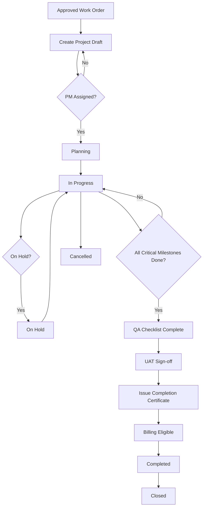
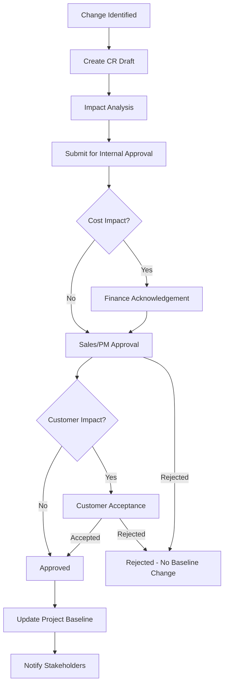

# ELU-BFS-PRJ — Projects Domain Business Functional Specification Pack

**Document ID:** ELU-BFS-PRJ  
**Document Name:** E-LinkUp Projects Domain — Complete BFS Pack (PRJ-001 … PRJ-006)  
**Version:** 1.0  
**Status:** Approved
**Related Documents:** ELU-DOC-001, ELU-DF-001, ELU-BRD-001, ELU-EFS-001, ELU-RTM-001
**Classification:** Internal Confidential  
**Project:** E-LinkUp (By Euphoria Infotech)  
**Prepared By:** Senior Business Analyst · Enterprise Solution Architect · Product Owner  
**Document Owner:** PMO  
**Phase / Release:** Phase 2 · v1.0  
**Example Tenant:** Euphoria  
**Stack:** Flutter (Web + Android) · Python FastAPI · PostgreSQL · JWT + Refresh Token · Docker · Linux VPS / Azure  
**Related Documents:** ELU-DF-001, ELU-BRD-001, ELU-SAD-001, ELU-WF-001, ELU-STORY-001, ELU-BFS-SAL (SAL-004 Work Order)

---

## Version History

| Version | Date | Author | Change |
|---------|------|--------|--------|
| 1.0 | 2026-07-31 | EIIP | Initial BFS pack (seventeen sections) |
| 1.0a | 2026-07-31 | EIIP / PMO | Status Approved; registered in ELU-DOC-001; Related Documents standardized |

## Pack Index

| # | Module ID | Module Name | Sub Module | Feature | Priority | BFS Anchor |
|---|-----------|-------------|------------|---------|----------|------------|
| 1 | PRJ-001 | Project Management | PRJ-001-001 Project | PRJ-001-001-001 Project Planning | **Critical** | [§ PRJ-001](#prj-001--project-management) |
| 2 | PRJ-002 | Milestone Management | PRJ-002-001 Milestone | PRJ-002-001-001 Milestone Tracking | **High** | [§ PRJ-002](#prj-002--milestone-management) |
| 3 | PRJ-003 | Task Management | PRJ-003-001 Task | PRJ-003-001-001 Task Assignment | **Critical** | [§ PRJ-003](#prj-003--task-management) |
| 4 | PRJ-004 | Timesheet Management | PRJ-004-001 Timesheet | PRJ-004-001-001 Time Entry | **High** | [§ PRJ-004](#prj-004--timesheet-management) |
| 5 | PRJ-005 | Issue Management | PRJ-005-001 Issue | PRJ-005-001-001 Issue Tracking | **Medium** | [§ PRJ-005](#prj-005--issue-management) |
| 6 | PRJ-006 | Change Request Management | PRJ-006-001 Change Request | PRJ-006-001-001 Scope Change | **High** | [§ PRJ-006](#prj-006--change-request-management) |

### Pack-Level Conventions

| Item | Standard |
|------|----------|
| API prefix | `/api/v1/projects/...` |
| Business rules | `BR-PRJ-{nnn}` — master index in [§ Pack Rule Index](#pack-business-rule-index) |
| Workflows | `WF-PRJ-001` Planning & Execution · `WF-PRJ-002` Change Request Control · `WF-PRJ-003` Completion & Closure |
| Upstream link | **Work Order** (SAL-004) → Project creation (BR-PRJ-004) |
| Downstream link | QA → UAT → **Completion Certificate** → Invoice eligibility (WF-FIN-001) |
| Edition (minimum) | **Professional** (Projects module); Enterprise for advanced workflow / API bulk |
| Actors (this pack) | Project Manager · Team Member · Sales Manager · Finance User · Customer Contact · Tenant Admin · System |

### End-to-End Delivery Spine

```text
Approved Work Order (SAL-004)
        │
        ▼
Create Project (PRJ-001) ──► Plan Milestones (PRJ-002) ──► Assign Tasks (PRJ-003)
        │                              │                           │
        │                              │                           ├── Timesheets (PRJ-004)
        │                              │                           └── Issues (PRJ-005)
        │                              │
        │                              └── Change Requests (PRJ-006) ──► Baseline revision
        │
        ▼
Execute & Monitor (RAG, dashboards)
        │
        ▼
All critical milestones Done
        │
        ▼
QA Checklist (project_qa_checklist) ──► UAT Sign-off (project_uat_signoff)
        │
        ▼
Completion Certificate (project_completion_certificate)
        │
        ▼
Billing Eligibility flag ──► Finance Invoice (FIN-001 / WF-FIN-001)
        │
        ▼
Project Closed (WF-PRJ-003)
```

### Shared Engines

| Engine | CPS Code | Usage in PRJ Pack |
|--------|----------|-------------------|
| Workflow Engine | CPS-001 | Project approval, timesheet approval, CR approval, completion gate |
| Rule Engine | CPS-002 | WO linkage, billing eligibility, baseline lock, threshold alerts |
| Notification Engine | CPS-003 | Assignment, approval, overdue, completion events |
| Reporting & Analytics | CPS-004 | Project health, utilisation, milestone variance |
| Audit Service | CPS-005 / PF-010 | All state changes, assignments, exports |
| Document Management | CPS-006 | QA artefacts, UAT evidence, Completion Certificate PDF |

### Pack Business Rule Index

| Rule ID | Module | Statement (summary) |
|---------|--------|---------------------|
| BR-PRJ-001 | PRJ-006 | No baseline change without approved Change Request |
| BR-PRJ-002 | PRJ-006 | Cost-impacting CR requires Finance acknowledgement |
| BR-PRJ-003 | PRJ-006 | Customer-facing CR requires documented acceptance |
| BR-PRJ-004 | PRJ-001 | Project must link to approved Work Order |
| BR-PRJ-005 | PRJ-001 | One active Project per Work Order (tenant policy) |
| BR-PRJ-006 | PRJ-001 | Project Manager must be assigned before Planning state |
| BR-PRJ-007 | PRJ-001 | Baseline locked after first Approved milestone plan |
| BR-PRJ-008 | PRJ-001 | Completion Certificate requires QA + UAT gates passed |
| BR-PRJ-009 | PRJ-001 | Billing eligibility set only after Completion Certificate issued |
| BR-PRJ-010 | PRJ-001 | Cancelled Project cannot issue Completion Certificate |
| BR-PRJ-011 | PRJ-002 | Milestone dates must fall within Project date range |
| BR-PRJ-012 | PRJ-002 | Critical milestones must be flagged for completion gate |
| BR-PRJ-013 | PRJ-002 | Milestone % complete derived from linked Tasks when WBS mode |
| BR-PRJ-014 | PRJ-002 | Invoice-trigger milestones require Finance User visibility |
| BR-PRJ-015 | PRJ-003 | Task must belong to same Project as parent Milestone |
| BR-PRJ-016 | PRJ-003 | Assignee must be active Team Member on Project |
| BR-PRJ-017 | PRJ-003 | Closed Task cannot accept new time entries |
| BR-PRJ-018 | PRJ-003 | Overdue Task notifies assignee and Project Manager |
| BR-PRJ-019 | PRJ-004 | Time Entry date cannot be in the future |
| BR-PRJ-020 | PRJ-004 | Submitted timesheet locked for edit until rejected |
| BR-PRJ-021 | PRJ-004 | Billable flag requires approved timesheet + billable Task |
| BR-PRJ-022 | PRJ-004 | Finance User may view billable hours; cannot edit entries |
| BR-PRJ-023 | PRJ-005 | Open critical Issue blocks Completion Certificate |
| BR-PRJ-024 | PRJ-005 | Issue resolution requires root-cause category |
| BR-PRJ-025 | PRJ-005 | Customer-visible Issue requires Customer Contact notification |
| BR-PRJ-026 | PRJ-006 | Draft CR cannot modify baseline |
| BR-PRJ-027 | PRJ-006 | Schedule-impacting CR requires revised milestone dates |
| BR-PRJ-028 | PRJ-006 | Rejected CR archived with reason; no baseline change |

---

<a id="prj-001--project-management"></a>
# PRJ-001 — Project Management

**Document ID:** ELU-BFS-PRJ-001  
**Module:** PRJ-001 — Project Management  
**Sub Module:** PRJ-001-001 — Project  
**Feature:** PRJ-001-001-001 — Project Planning  
**Domain:** PRJ  
**Priority / Phase / Release:** Critical · Phase 2 · v1.0  
**Minimum Edition:** Professional  
**Example Tenant:** Euphoria  
**Workflow:** WF-PRJ-001, WF-PRJ-003  

---

## 1. Business Objective

### 1.1 Why this module exists

Euphoria delivers contracted work through **Projects** spawned from approved **Work Orders**. Without a governed Project object, delivery teams cannot plan scope, dates, budget, and ownership in a single auditable record linked to Sales and Finance. Project Management is the anchor for all PRJ sub-modules and the completion-to-invoice gate.

### 1.2 Business value

| Value | Measure |
|-------|---------|
| Single delivery truth | One Project per WO with Customer, Sales Order, WO linkage |
| Predictable handoff | Sales → PM transition at WO approval |
| Revenue recognition alignment | Completion Certificate unlocks Invoice eligibility |
| Governance | Baseline lock, audit trail, RBAC by role |

### 1.3 Business scope

| In Scope | Out of Scope |
|----------|--------------|
| Create Project from approved Work Order | Portfolio / program management (v2) |
| Project planning: dates, budget, PM, team | Resource capacity planning engine (v2) |
| Baseline versioning (initial + CR-driven) | Earned Value Management (v3) |
| RAG health status | Gantt critical-path optimisation (v2) |
| QA → UAT → Completion Certificate path | External PPM tool sync (INT future) |
| Billing eligibility flag for Finance | Invoice creation (FIN-001) |

### 1.4 Users involved

Project Manager (primary), Team Member (read/execute), Sales Manager (commercial context), Finance User (billing eligibility view), Customer Contact (UAT / certificate), Tenant Admin (configuration).

### 1.5 Module reference

| Field | Value |
|-------|-------|
| Domain | PRJ |
| Module | PRJ-001 Project Management |
| Sub Module | PRJ-001-001 Project |
| Feature | PRJ-001-001-001 Project Planning |
| Priority | Critical |
| Phase | 2 |
| Release | v1.0 |
| Dependencies | SAL-004 Work Order, CRM Customer, CPS-001 Workflow, CPS-002 Rule Engine |

---

## 2. Business Actors

| Actor | Type | Primary Actions | Secondary Actions |
|-------|------|-----------------|-------------------|
| Project Manager | Internal | Create/edit Project, plan, assign team, drive QA/UAT/Certificate | Approve timesheets, manage issues |
| Team Member | Internal | View assigned Project context | Log time, update tasks |
| Sales Manager | Internal | View Project linked to SO/WO | Escalate commercial disputes |
| Finance User | Internal | View billing eligibility, budget burn | Cannot edit Project plan |
| Customer Contact | External | Participate in UAT, sign acceptance | View shared Project status (portal) |
| Tenant Admin | Internal | Configure Project types, templates, numbering | Full read, limited edit |
| System | System | State transitions, eligibility flags, notifications | Workflow / Rule Engine |

---

## 3. Business Story

**Sales Manager** approves **Work Order** WO-2026-0042 for Customer **Acme Industries** under **Sales Order** SO-2026-0118. **Project Manager** Priya receives notification and opens **Create Project** from the Work Order context.

Priya names the Project `PRJ-EUP-2026-0042 — Acme CRM Implementation`, sets planned start/end, budget (INR), and assigns herself as PM. She adds **Team Members** from the delivery pool. Project state moves `Initiating → Planning`.

Priya defines **Milestones** (PRJ-002): Discovery, Build, QA, UAT, Go-Live. She creates **Tasks** (PRJ-003) and assigns owners. **Team Members** log **Timesheets** (PRJ-004); Priya approves billable hours. **Issues** (PRJ-005) are raised and resolved.

Mid-delivery, scope expands. Priya raises **Change Request** CR-003 (PRJ-006). After internal and Customer Contact acceptance, baseline dates and budget revise per BR-PRJ-001.

At delivery end, all **critical milestones** are Done. Priya completes **QA Checklist**. **Customer Contact** Rajesh completes **UAT Sign-off**. Priya issues **Completion Certificate** CC-2026-0042. System sets `billing_eligible = true` (BR-PRJ-009). **Finance User** Anil sees the Project on the billing workbench and creates **Invoice** per WF-FIN-001.

**Exception — On Hold:** PM sets Project On Hold; tasks pause; notifications sent. Resume returns to In Progress.

**Exception — Cancel:** Tenant Admin or PM cancels before certificate; WO may be re-opened per SAL rules; no billing eligibility.

---

## 4. Business Workflow

### 4.1 Flow Diagram



### 4.2 Step Table

| Step | Actor | Action | Input | Output | Engine |
|------|-------|--------|-------|--------|--------|
| 1 | Project Manager | Create Project from WO | Work Order | Project (Draft) | API |
| 2 | Project Manager | Set plan, budget, team | Project | Project (Planning) | Workflow |
| 3 | Project Manager | Execute delivery | Milestones, Tasks | Project (In Progress) | — |
| 4 | Team Member / PM | Timesheets, Issues | Task | Approved time, resolved issues | Workflow |
| 5 | Project Manager | Complete QA checklist | project_qa_checklist | QA passed | Rule Engine |
| 6 | Customer Contact | UAT sign-off | project_uat_signoff | UAT accepted | Workflow |
| 7 | Project Manager | Issue Completion Certificate | Certificate | billing_eligible=true | Rule Engine |
| 8 | Finance User | Invoice from eligibility | Project flag | Invoice draft (FIN) | Integration |
| 9 | Project Manager | Close Project | Invoice status | Project (Closed) | Workflow |

---

## 5. Business States

| State Code | Label | Description | Next States | Entry Actors | System Effects |
|------------|-------|-------------|-------------|--------------|----------------|
| `DRAFT` | Draft | Created from WO, incomplete | PLANNING, CANCELLED | PM | Editable all fields |
| `PLANNING` | Planning | Plan being built | IN_PROGRESS, CANCELLED | PM | Milestone/task creation enabled |
| `IN_PROGRESS` | In Progress | Active delivery | ON_HOLD, COMPLETED, CANCELLED | PM | Timesheet/issue active |
| `ON_HOLD` | On Hold | Paused | IN_PROGRESS, CANCELLED | PM, Tenant Admin | Task time entry warning |
| `COMPLETED` | Completed | Certificate issued | CLOSED | PM | billing_eligible set |
| `CLOSED` | Closed | Financially closed | ARCHIVED | PM, Finance User | Read-only |
| `CANCELLED` | Cancelled | Abandoned | — | PM, Tenant Admin | No certificate |
| `ARCHIVED` | Archived | Long-term store | — | System | Hidden from default lists |

---

## 6. Business Rules

| Rule ID | Statement | Type | Severity | Enforcement |
|---------|-----------|------|----------|-------------|
| BR-PRJ-004 | Project shall be created only from an **Approved** Work Order (SAL-004). | Validation | Error | API, Rule Engine |
| BR-PRJ-005 | At most one **active** Project (non-Cancelled, non-Closed) per Work Order per tenant. | Validation | Error | DB unique partial index |
| BR-PRJ-006 | Project Manager must be assigned before transition to `PLANNING`. | Lifecycle | Error | Workflow |
| BR-PRJ-007 | Initial baseline locks when first Milestone plan is **Approved** by PM. | Lifecycle | Warning | Rule Engine |
| BR-PRJ-008 | Completion Certificate shall not issue until QA checklist **Passed** and UAT **Accepted**. | Approval | Error | Workflow, Rule Engine |
| BR-PRJ-009 | `billing_eligible` may be set `true` only upon Completion Certificate **Issued** state. | Lifecycle | Error | Rule Engine, API |
| BR-PRJ-010 | `CANCELLED` Project shall not transition to `COMPLETED` or issue certificate. | Lifecycle | Error | Workflow |
| BR-PRJ-011 | Planned end date must be ≥ planned start date. | Validation | Error | UI, API |
| BR-PRJ-012 | Budget currency must match Sales Order commercial currency unless Finance override. | Validation | Warning | Rule Engine |
| BR-PRJ-013 | Customer on Project must match Work Order Customer. | Validation | Error | API |
| BR-PRJ-014 | Soft-deleted Project hidden from lists; restore requires Tenant Admin. | Security | Error | API |

---

## 7. Database Impact

| Table | Type | Purpose | Tenant Scoped |
|-------|------|---------|---------------|
| `project` | Transaction | Master delivery record | Yes |
| `project_baseline` | Transaction | Versioned scope/schedule/cost snapshot | Yes |
| `project_team_member` | Link | PM + team roster | Yes |
| `project_qa_checklist` | Transaction | QA gate before UAT | Yes |
| `project_qa_checklist_item` | Transaction | Line items per checklist | Yes |
| `project_uat_signoff` | Transaction | Customer UAT acceptance | Yes |
| `project_completion_certificate` | Transaction | Formal delivery acceptance | Yes |
| `project_status_history` | Audit | State transition log | Yes |
| `project_type` | Lookup | Implementation, Support, etc. | Yes |

---

## 8. Relationships

| Parent | Child | Cardinality | On Delete | Notes |
|--------|-------|-------------|-----------|-------|
| `work_order` (SAL) | `project` | 1:N | Restrict | BR-PRJ-005 limits active count |
| `customer` | `project` | 1:N | Restrict | Denormalised for query |
| `sales_order` (SAL) | `project` | 1:N | Restrict | Commercial header |
| `project` | `project_baseline` | 1:N | Cascade | Version per CR |
| `project` | `project_team_member` | 1:N | Cascade | |
| `project` | `milestone` | 1:N | Restrict | PRJ-002 |
| `project` | `project_qa_checklist` | 1:1 | Cascade | Active checklist |
| `project` | `project_uat_signoff` | 1:N | Restrict | Versioned sign-offs |
| `project` | `project_completion_certificate` | 1:1 | Restrict | One active certificate |
| `user` | `project` (pm_user_id) | 1:N | Restrict | PM assignment |

---

## 9. Field Groups

### `project`

General Information · Commercial Links (customer_id, sales_order_id, work_order_id) · Schedule · Budget · Status · Health (RAG) · Billing Eligibility · Assignment · Attachments · Audit

### `project_baseline`

Version · Scope Summary · Schedule Snapshot · Cost Snapshot · CR Reference · Approval · Audit

### `project_team_member`

Member · Role on Project · Allocation % · Effective Dates · Audit

### `project_qa_checklist` / `project_qa_checklist_item`

Checklist Header · Pass/Fail · Completed By · Items (description, result, evidence)

### `project_uat_signoff`

Signatory · Acceptance Date · Scope Reference · Comments · Document Link · Audit

### `project_completion_certificate`

Certificate Number · Issue Date · Issued By · Customer Signatory · Billing Trigger · Document PDF · Audit

---

## 10. REST APIs

| Method | Path | Purpose | Permission |
|--------|------|---------|------------|
| POST | `/api/v1/projects` | Create Project (body includes work_order_id) | `project.create` |
| GET | `/api/v1/projects` | List with filters (status, PM, customer, WO) | `project.read` |
| GET | `/api/v1/projects/{id}` | Get Project detail | `project.read` |
| PUT | `/api/v1/projects/{id}` | Full update (Draft/Planning only) | `project.update` |
| PATCH | `/api/v1/projects/{id}` | Partial update / RAG | `project.update` |
| PATCH | `/api/v1/projects/{id}/status` | State transition | `project.submit` |
| DELETE | `/api/v1/projects/{id}` | Soft delete | `project.delete` |
| GET | `/api/v1/projects/search` | Advanced search | `project.read` |
| GET | `/api/v1/projects/export` | Export CSV/XLSX | `project.export` |
| POST | `/api/v1/projects/from-work-order/{wo_id}` | Create from WO shortcut | `project.create` |
| GET | `/api/v1/projects/{id}/team` | List team members | `project.read` |
| POST | `/api/v1/projects/{id}/team` | Add team member | `project.assign` |
| DELETE | `/api/v1/projects/{id}/team/{user_id}` | Remove team member | `project.assign` |
| GET | `/api/v1/projects/{id}/baselines` | List baselines | `project.read` |
| POST | `/api/v1/projects/{id}/qa-checklist` | Create/submit QA | `project.submit` |
| PATCH | `/api/v1/projects/{id}/qa-checklist` | Update QA results | `project.update` |
| POST | `/api/v1/projects/{id}/uat-signoff` | Record UAT | `project.submit` |
| POST | `/api/v1/projects/{id}/completion-certificate` | Issue certificate | `project.approve` |
| GET | `/api/v1/projects/{id}/billing-eligibility` | Finance eligibility view | `project.read`, `invoice.read` |
| GET | `/api/v1/projects/{id}/history` | Status / audit history | `project.read` |

---

## 11. Flutter Screens

| Screen ID | Screen | Type | Primary Actor | Route (illustrative) |
|-----------|--------|------|---------------|----------------------|
| PRJ-SCR-001 | Project List | List | PM, Team Member | `/projects` |
| PRJ-SCR-002 | Project Create | Create | PM | `/projects/create` |
| PRJ-SCR-003 | Project Create from WO | Create | PM | `/work-orders/{id}/create-project` |
| PRJ-SCR-004 | Project Detail | View | All assigned | `/projects/{id}` |
| PRJ-SCR-005 | Project Edit | Edit | PM | `/projects/{id}/edit` |
| PRJ-SCR-006 | Project Planning Board | View | PM | `/projects/{id}/plan` |
| PRJ-SCR-007 | Project Team | Edit | PM | `/projects/{id}/team` |
| PRJ-SCR-008 | QA Checklist | Approval | PM | `/projects/{id}/qa` |
| PRJ-SCR-009 | UAT Sign-off | Approval | PM, Customer Contact | `/projects/{id}/uat` |
| PRJ-SCR-010 | Completion Certificate | Approval | PM | `/projects/{id}/certificate` |
| PRJ-SCR-011 | Project Search | Search | PM, Sales Manager | `/projects/search` |
| PRJ-SCR-012 | Billing Eligibility | View | Finance User | `/projects/{id}/billing` |
| PRJ-SCR-013 | Project History | History | PM, Tenant Admin | `/projects/{id}/history` |

---

## 12. RBAC Permissions

| Permission | Description |
|------------|-------------|
| `project.create` | Create Project |
| `project.read` | View Project |
| `project.update` | Edit Project fields |
| `project.delete` | Soft delete |
| `project.submit` | Submit QA / UAT / status |
| `project.approve` | Issue Completion Certificate |
| `project.assign` | Manage team |
| `project.cancel` | Cancel Project |
| `project.export` | Export data |
| `project.configure` | Templates, types (Tenant Admin) |

| Actor | create | read | update | delete | submit | approve | assign | cancel | export |
|-------|--------|------|--------|--------|--------|---------|--------|--------|--------|
| Project Manager | ✓ | ✓ | ✓ | ✓ | ✓ | ✓ | ✓ | ✓ | ✓ |
| Team Member | — | ✓* | — | — | — | — | — | — | — |
| Sales Manager | — | ✓ | — | — | — | — | — | — | ✓ |
| Finance User | — | ✓ | — | — | — | — | — | — | ✓ |
| Customer Contact | — | ✓† | — | — | ✓‡ | — | — | — | — |
| Tenant Admin | ✓ | ✓ | ✓ | ✓ | ✓ | ✓ | ✓ | ✓ | ✓ |

\* Team Member: assigned projects only. † Customer Contact: portal-shared projects. ‡ UAT sign-off only.

---

## 13. Notifications

| Event | Channels | Recipients | Template Key |
|-------|----------|------------|--------------|
| Project created from WO | Email, Push, Internal | PM, Sales Manager | NTF-PRJ-001 |
| Project assigned to PM | Email, Push | PM | NTF-PRJ-002 |
| Project On Hold | Email, Internal | Team, Sales Manager | NTF-PRJ-003 |
| QA checklist required | Internal, Push | PM | NTF-PRJ-004 |
| UAT requested | Email, Portal | Customer Contact, PM | NTF-PRJ-005 |
| Completion Certificate issued | Email, Internal | Finance User, Sales Manager, Customer | NTF-PRJ-006 |
| Billing eligible | Email, Internal | Finance User | NTF-PRJ-007 |
| Project Closed | Email, Internal | Stakeholders | NTF-PRJ-008 |

---

## 14. Reports

| Report ID | Name | Type | Audience | Grain | Filters |
|-----------|------|------|----------|-------|---------|
| RPT-PRJ-001 | Project Register | Operational | PM, Sales Manager | Project | Status, PM, Customer, date |
| RPT-PRJ-002 | Project Health (RAG) | Management | PM, Tenant Admin | Project | RAG, overdue milestone |
| RPT-PRJ-003 | WO to Project Tracker | Operational | Sales Manager | WO/Project | Unconverted WOs |
| RPT-PRJ-004 | Completion Pipeline | Management | PM, Finance | Project | QA/UAT/Cert stage |
| RPT-PRJ-005 | Billing Eligibility Queue | Operational | Finance User | Project | billing_eligible=true, no invoice |
| KPI-PRJ-001 | On-Time Delivery % | Executive Dashboard | Leadership | Monthly | Completed projects |
| KPI-PRJ-002 | Budget Variance % | Executive Dashboard | Leadership | Project | In Progress + Completed |

Export: PDF, XLSX, CSV.

---

## 15. Audit Requirements

| Event | Captured Fields |
|-------|-----------------|
| Project create / update / soft delete | Before/after JSON, actor, timestamp |
| Status transition | From/to state, reason |
| Team member add/remove | User ID, role |
| Baseline create / revise | Version, CR link |
| QA checklist submit | Pass/fail, actor |
| UAT sign-off | Signatory, evidence doc ID |
| Completion Certificate issue | Certificate no., billing_eligible change |
| Export | Filter criteria, row count |

Retention: per tenant compliance policy (default 7 years).

---

## 16. Acceptance Criteria

| # | Criterion |
|---|-----------|
| AC-PRJ-001-01 | **Given** approved WO, **when** PM creates Project, **then** Customer and SO match WO and Project is `DRAFT`. |
| AC-PRJ-001-02 | **Given** no PM assigned, **when** transition to Planning requested, **then** API returns 422 per BR-PRJ-006. |
| AC-PRJ-001-03 | **Given** active Project exists for WO, **when** second create attempted, **then** blocked per BR-PRJ-005. |
| AC-PRJ-001-04 | **Given** all critical milestones Done, QA Passed, UAT Accepted, **when** PM issues Certificate, **then** `billing_eligible=true`. |
| AC-PRJ-001-05 | **Given** open critical Issue, **when** certificate issue attempted, **then** blocked (BR-PRJ-023 cross-ref). |
| AC-PRJ-001-06 | **Given** tenant A user, **when** accessing tenant B Project, **then** 404/403. |
| AC-PRJ-001-07 | **Given** Certificate issued, **when** Finance opens billing workbench, **then** Project appears for Invoice creation. |

---

## 17. Future Enhancements

| Version | Enhancement |
|---------|-------------|
| v2.0 | Portfolio dashboard, resource capacity, Gantt export |
| v2.0 | Project templates with milestone/task presets |
| v3.0 | Earned Value (PV/EV/AC), predictive delay AI (CPS-007) |

---

<a id="prj-002--milestone-management"></a>
# PRJ-002 — Milestone Management

**Document ID:** ELU-BFS-PRJ-002  
**Module:** PRJ-002 — Milestone Management  
**Sub Module:** PRJ-002-001 — Milestone  
**Feature:** PRJ-002-001-001 — Milestone Tracking  
**Domain:** PRJ  
**Priority / Phase / Release:** High · Phase 2 · v1.0  
**Minimum Edition:** Professional  
**Example Tenant:** Euphoria  
**Workflow:** WF-PRJ-001, WF-PRJ-003  

---

## 1. Business Objective

### 1.1 Why this module exists

Milestones partition Project delivery into measurable checkpoints (design, QA, UAT, go-live) and drive completion gates, invoice triggers, and executive visibility.

### 1.2 Business value

Structured delivery tracking; critical-milestone gate for Completion Certificate; milestone-based billing alignment with FIN-001.

### 1.3 Business scope

| In Scope | Out of Scope |
|----------|--------------|
| CRUD milestones on Project | Cross-project milestone dependencies |
| Critical / invoice-trigger flags | Automated MS Project import |
| % complete (manual + task rollup) | |

### 1.4 Users involved

Project Manager (primary), Team Member (progress), Finance User (invoice-trigger view), Sales Manager (read).

### 1.5 Module reference

| Field | Value |
|-------|-------|
| Module | PRJ-002 Milestone Management |
| Sub Module | PRJ-002-001 Milestone |
| Feature | PRJ-002-001-001 Milestone Tracking |
| Priority | High |
| Dependencies | PRJ-001, PRJ-003 |

---

## 2. Business Actors

| Actor | Type | Primary Actions | Secondary Actions |
|-------|------|-----------------|-------------------|
| Project Manager | Internal | Create/edit milestones, mark complete | Approve plan |
| Team Member | Internal | Update task-linked progress | View milestones |
| Finance User | Internal | View invoice-trigger milestones | — |
| Sales Manager | Internal | — | View timeline |
| Tenant Admin | Internal | Configure milestone types | — |
| System | System | Roll up % from tasks, gate checks | Rule Engine |

---

## 3. Business Story

**Project Manager** Priya on Project `PRJ-EUP-2026-0042` creates milestones: **Discovery** (week 1–2), **Build** (week 3–8), **QA** (week 9), **UAT** (week 10), **Go-Live** (week 11). She marks **QA**, **UAT**, and **Go-Live** as **critical** (BR-PRJ-012) and **UAT** as **invoice-trigger** (BR-PRJ-014) per Sales Order payment schedule.

**Team Members** complete Tasks linked to **Build**; system rolls milestone % complete (BR-PRJ-013). Priya marks **Discovery** Done. At project end, all critical milestones must be `DONE` before QA/UAT/Certificate path proceeds.

If a **Change Request** shifts Go-Live, revised milestone dates update via baseline revision (PRJ-006).

---

## 4. Business Workflow

```text
Project (Planning)
   │
   ▼
Create Milestones (ordered, dated)
   │
   ▼
Link Tasks (optional WBS)
   │
   ▼
Execute ──► Update % / Mark DONE
   │
   ▼
[All critical = DONE] ──► Enable Project completion path
```

| Step | Actor | Action | Input | Output | Engine |
|------|-------|--------|-------|--------|--------|
| 1 | PM | Create milestone | Project | Milestone (Planned) | API |
| 2 | PM | Set critical / invoice flags | Milestone | Configured milestone | Rule Engine |
| 3 | Team Member | Complete tasks | Task | Milestone % rollup | Rule Engine |
| 4 | PM | Mark milestone DONE | Milestone | Milestone (DONE) | Workflow |
| 5 | System | Check completion gate | All critical DONE | Unlock QA path | Rule Engine |

---

## 5. Business States

| State Code | Label | Next States | Entry Actors | System Effects |
|------------|-------|-------------|--------------|----------------|
| `PLANNED` | Planned | IN_PROGRESS, CANCELLED | PM | Editable |
| `IN_PROGRESS` | In Progress | DONE, ON_HOLD, CANCELLED | PM, System | Task rollup active |
| `ON_HOLD` | On Hold | IN_PROGRESS, CANCELLED | PM | Warning on dependent tasks |
| `DONE` | Done | — | PM | Locks dates; counts toward gate |
| `CANCELLED` | Cancelled | — | PM | Excluded from gate |

---

## 6. Business Rules

| Rule ID | Statement | Type | Severity | Enforcement |
|---------|-----------|------|----------|-------------|
| BR-PRJ-011 | Milestone planned dates must fall within parent Project date range. | Validation | Error | API |
| BR-PRJ-012 | At least one milestone must be flagged `is_critical` before Project moves to In Progress. | Validation | Error | Workflow |
| BR-PRJ-013 | When `progress_mode=WBS`, milestone % = weighted average of linked Task completion. | Calculation | Info | Rule Engine |
| BR-PRJ-014 | `is_invoice_trigger` milestones visible to Finance User; FIN may reference for billing. | Security | Info | RBAC |
| BR-PRJ-029 | DONE milestone cannot revert to IN_PROGRESS without Tenant Admin + audit reason. | Lifecycle | Error | Workflow |
| BR-PRJ-030 | Milestone sequence_no must be unique per Project. | Validation | Error | DB |

---

## 7. Database Impact

| Table | Type | Purpose | Tenant Scoped |
|-------|------|---------|---------------|
| `milestone` | Transaction | Delivery checkpoint | Yes |
| `milestone_type` | Lookup | Standard names (QA, UAT, etc.) | Yes |
| `milestone_task_link` | Link | WBS rollup (optional) | Yes |

---

## 8. Relationships

| Parent | Child | Cardinality | On Delete | Notes |
|--------|-------|-------------|-----------|-------|
| `project` | `milestone` | 1:N | Restrict | |
| `milestone` | `task` | 1:N | Restrict | PRJ-003 |
| `milestone` | `milestone_task_link` | 1:N | Cascade | Rollup |

---

## 9. Field Groups

### `milestone`

General (name, description) · Schedule (planned/actual dates) · Progress (% complete, mode) · Flags (critical, invoice_trigger) · Sequence · Status · Audit

---

## 10. REST APIs

| Method | Path | Purpose | Permission |
|--------|------|---------|------------|
| POST | `/api/v1/projects/{project_id}/milestones` | Create | `milestone.create` |
| GET | `/api/v1/projects/{project_id}/milestones` | List | `milestone.read` |
| GET | `/api/v1/projects/{project_id}/milestones/{id}` | Get | `milestone.read` |
| PUT | `/api/v1/projects/{project_id}/milestones/{id}` | Update | `milestone.update` |
| PATCH | `/api/v1/projects/{project_id}/milestones/{id}/status` | Status change | `milestone.submit` |
| DELETE | `/api/v1/projects/{project_id}/milestones/{id}` | Soft delete | `milestone.delete` |
| GET | `/api/v1/projects/{project_id}/milestones/export` | Export | `milestone.export` |
| PATCH | `/api/v1/projects/{project_id}/milestones/reorder` | Reorder sequence | `milestone.update` |

---

## 11. Flutter Screens

| Screen ID | Screen | Type | Actor | Route |
|-----------|--------|------|-------|-------|
| PRJ-SCR-020 | Milestone List | List | PM | `/projects/{id}/milestones` |
| PRJ-SCR-021 | Milestone Create/Edit | Create/Edit | PM | `/projects/{id}/milestones/edit` |
| PRJ-SCR-022 | Milestone Timeline | View | PM, Sales Manager | `/projects/{id}/timeline` |
| PRJ-SCR-023 | Milestone Detail | View | All | `/projects/{id}/milestones/{mid}` |

---

## 12. RBAC Permissions

| Permission | PM | Team Member | Finance User | Sales Manager | Tenant Admin |
|------------|----|-------------|--------------|---------------|--------------|
| `milestone.create` | ✓ | — | — | — | ✓ |
| `milestone.read` | ✓ | ✓* | ✓ | ✓ | ✓ |
| `milestone.update` | ✓ | — | — | — | ✓ |
| `milestone.submit` | ✓ | — | — | — | ✓ |
| `milestone.delete` | ✓ | — | — | — | ✓ |
| `milestone.export` | ✓ | — | ✓ | ✓ | ✓ |

---

## 13. Notifications

| Event | Channels | Recipients | Template |
|-------|----------|------------|----------|
| Milestone overdue | Email, Push | PM, assignees | NTF-PRJ-010 |
| Critical milestone DONE | Internal | PM, Finance (if invoice trigger) | NTF-PRJ-011 |
| All critical milestones DONE | Email, Internal | PM, Finance | NTF-PRJ-012 |

---

## 14. Reports

| Report ID | Name | Audience | Grain |
|-----------|------|----------|-------|
| RPT-PRJ-010 | Milestone Status | PM | Milestone |
| RPT-PRJ-011 | Milestone Variance (planned vs actual) | Management | Milestone |
| RPT-PRJ-012 | Invoice-Trigger Milestones | Finance User | Milestone |
| KPI-PRJ-003 | Milestone On-Time % | Executive | Monthly |

---

## 15. Audit Requirements

Create, update, status change, critical/invoice flag change, soft delete, reorder, export.

---

## 16. Acceptance Criteria

| # | Criterion |
|---|-----------|
| AC-PRJ-002-01 | Milestone dates outside Project range rejected (BR-PRJ-011). |
| AC-PRJ-002-02 | Project cannot go In Progress without ≥1 critical milestone. |
| AC-PRJ-002-03 | WBS rollup calculates % when tasks updated. |
| AC-PRJ-002-04 | DONE critical milestones required before QA checklist enabled. |
| AC-PRJ-002-05 | Tenant isolation on all milestone APIs. |

---

## 17. Future Enhancements

| Version | Enhancement |
|---------|-------------|
| v2.0 | Milestone dependencies (FS/SS) |
| v2.0 | Baseline variance visual on timeline |
| v3.0 | Auto invoice draft on invoice-trigger milestone DONE |

---

<a id="prj-003--task-management"></a>
# PRJ-003 — Task Management

**Document ID:** ELU-BFS-PRJ-003  
**Module:** PRJ-003 — Task Management  
**Sub Module:** PRJ-003-001 — Task  
**Feature:** PRJ-003-001-001 — Task Assignment  
**Domain:** PRJ  
**Priority / Phase / Release:** Critical · Phase 2 · v1.0  
**Minimum Edition:** Professional  
**Example Tenant:** Euphoria  
**Workflow:** WF-PRJ-001  

---

## 1. Business Objective

### 1.1 Why this module exists

Tasks operationalise the Work Breakdown Structure (WBS): assignable units of work with owners, dates, and billable flags that feed milestone progress and timesheet entry.

### 1.2 Business value

Clear ownership; execution tracking; billable/non-billable classification for Finance; foundation for utilisation reporting.

### 1.3 Business scope

| In Scope | Out of Scope |
|----------|--------------|
| Task CRUD, assignment, status | Kanban automation rules (v2) |
| Link to Project and Milestone | Sub-task hierarchy >1 level (v2) |
| Priority, estimates, billable flag | |

### 1.4 Users involved

Project Manager (assign/manage), Team Member (execute), Tenant Admin (config).

### 1.5 Module reference

| Field | Value |
|-------|-------|
| Module | PRJ-003 Task Management |
| Feature | PRJ-003-001-001 Task Assignment |
| Priority | Critical |
| Dependencies | PRJ-001, PRJ-002 |

---

## 2. Business Actors

| Actor | Type | Primary Actions | Secondary Actions |
|-------|------|-----------------|-------------------|
| Project Manager | Internal | Create tasks, assign, close | Reassign, set billable |
| Team Member | Internal | Update progress, complete | View my tasks |
| Tenant Admin | Internal | Task categories | — |
| System | System | Overdue alerts, rollup to milestone | Notification Engine |

---

## 3. Business Story

Priya creates Task `T-042 Configure Lead Module` under Milestone **Build**, estimates 40 hours, marks **billable**, assigns **Team Member** Arjun. Arjun sees the task in **My Tasks**, updates progress to 50%, logs time (PRJ-004). Priya reassigns to Neha when Arjun is on leave — audit captures reassignment.

On completion, Priya marks Task **Done**; milestone % updates. Closed tasks reject new time entries (BR-PRJ-017). Overdue tasks notify assignee and PM daily (BR-PRJ-018).

---

## 4. Business Workflow

```text
PM creates Task ──► Assign to Team Member ──► IN_PROGRESS
        │                                        │
        │                                        ├── Progress updates
        │                                        ├── Timesheet entries
        │                                        └── Issues linked
        ▼
    DONE / CANCELLED
```

| Step | Actor | Action | Input | Output | Engine |
|------|-------|--------|-------|--------|--------|
| 1 | PM | Create task | Milestone/Project | Task (Open) | API |
| 2 | PM | Assign user | Task | Assignment notification | Notification |
| 3 | Team Member | Work & update % | Task | IN_PROGRESS | API |
| 4 | Team Member | Log time | Timesheet | Hours captured | PRJ-004 |
| 5 | PM / Assignee | Mark DONE | Task | Milestone rollup | Rule Engine |

---

## 5. Business States

| State Code | Label | Next States | Entry Actors | System Effects |
|------------|-------|-------------|--------------|----------------|
| `OPEN` | Open | IN_PROGRESS, CANCELLED | PM | Assignable |
| `IN_PROGRESS` | In Progress | DONE, ON_HOLD, CANCELLED | Assignee, PM | Time entry allowed |
| `ON_HOLD` | On Hold | IN_PROGRESS, CANCELLED | PM | Time entry warning |
| `DONE` | Done | — | Assignee, PM | No new time entries |
| `CANCELLED` | Cancelled | — | PM | No time entries |

---

## 6. Business Rules

| Rule ID | Statement | Type | Severity | Enforcement |
|---------|-----------|------|----------|-------------|
| BR-PRJ-015 | Task `project_id` must match parent Milestone `project_id`. | Validation | Error | API, DB |
| BR-PRJ-016 | Assignee must exist in `project_team_member` for the Project. | Validation | Error | API |
| BR-PRJ-017 | Time entries not allowed on `DONE` or `CANCELLED` tasks. | Validation | Error | API |
| BR-PRJ-018 | Overdue task (past due_date, not DONE) notifies assignee + PM daily. | Lifecycle | Info | Scheduler |
| BR-PRJ-031 | Task reassignment requires audit comment when work started. | Audit | Warning | UI |
| BR-PRJ-032 | Billable task requires Project with commercial WO link. | Validation | Warning | Rule Engine |

---

## 7. Database Impact

| Table | Type | Purpose | Tenant Scoped |
|-------|------|---------|---------------|
| `task` | Transaction | Work unit | Yes |
| `task_assignment` | Transaction | Assignment history | Yes |
| `task_category` | Lookup | Development, Testing, etc. | Yes |

---

## 8. Relationships

| Parent | Child | Cardinality | On Delete | Notes |
|--------|-------|-------------|-----------|-------|
| `project` | `task` | 1:N | Restrict | |
| `milestone` | `task` | 1:N | Restrict | Optional parent |
| `user` | `task` (assignee) | 1:N | Restrict | |
| `task` | `timesheet_entry` | 1:N | Restrict | PRJ-004 |
| `task` | `issue` | 1:N | Set Null | PRJ-005 |

---

## 9. Field Groups

### `task`

General · Schedule · Assignment · Progress · Commercial (billable, estimate_hours) · Priority · Category · Status · Audit

### `task_assignment`

Assignee · Assigned By · From/To Dates · Reason · Audit

---

## 10. REST APIs

| Method | Path | Purpose | Permission |
|--------|------|---------|------------|
| POST | `/api/v1/projects/{project_id}/tasks` | Create | `task.create` |
| GET | `/api/v1/projects/{project_id}/tasks` | List | `task.read` |
| GET | `/api/v1/projects/{project_id}/tasks/my` | My tasks (current user) | `task.read` |
| GET | `/api/v1/projects/{project_id}/tasks/{id}` | Get | `task.read` |
| PUT | `/api/v1/projects/{project_id}/tasks/{id}` | Update | `task.update` |
| PATCH | `/api/v1/projects/{project_id}/tasks/{id}/assign` | Assign/reassign | `task.assign` |
| PATCH | `/api/v1/projects/{project_id}/tasks/{id}/status` | Status | `task.submit` |
| DELETE | `/api/v1/projects/{project_id}/tasks/{id}` | Soft delete | `task.delete` |
| GET | `/api/v1/projects/{project_id}/tasks/search` | Search | `task.read` |
| GET | `/api/v1/projects/{project_id}/tasks/export` | Export | `task.export` |

---

## 11. Flutter Screens

| Screen ID | Screen | Type | Actor | Route |
|-----------|--------|------|-------|-------|
| PRJ-SCR-030 | Task List (Project) | List | PM | `/projects/{id}/tasks` |
| PRJ-SCR-031 | My Tasks | List | Team Member | `/my-tasks` |
| PRJ-SCR-032 | Task Create/Edit | Create/Edit | PM | `/projects/{id}/tasks/edit` |
| PRJ-SCR-033 | Task Detail | View | All | `/projects/{id}/tasks/{tid}` |
| PRJ-SCR-034 | Task Assignment | Edit | PM | `/projects/{id}/tasks/{tid}/assign` |

---

## 12. RBAC Permissions

| Permission | PM | Team Member | Tenant Admin |
|------------|----|-------------|--------------|
| `task.create` | ✓ | — | ✓ |
| `task.read` | ✓ | ✓* | ✓ |
| `task.update` | ✓ | ✓† | ✓ |
| `task.assign` | ✓ | — | ✓ |
| `task.submit` | ✓ | ✓† | ✓ |
| `task.delete` | ✓ | — | ✓ |
| `task.export` | ✓ | — | ✓ |

\* Assigned tasks. † Own assigned tasks only (progress/status).

---

## 13. Notifications

| Event | Channels | Recipients | Template |
|-------|----------|------------|----------|
| Task assigned | Push, Email, Internal | Assignee | NTF-PRJ-020 |
| Task reassigned | Push, Internal | Old + new assignee | NTF-PRJ-021 |
| Task overdue | Email, Push | Assignee, PM | NTF-PRJ-022 |
| Task completed | Internal | PM | NTF-PRJ-023 |

---

## 14. Reports

| Report ID | Name | Audience |
|-----------|------|----------|
| RPT-PRJ-020 | Task Burn-down | PM |
| RPT-PRJ-021 | Open Tasks by Assignee | PM |
| RPT-PRJ-022 | Overdue Tasks | PM, Tenant Admin |
| KPI-PRJ-004 | Task Completion Rate | Management |

---

## 15. Audit Requirements

Create, update, assign/reassign, status change, billable flag change, soft delete, export.

---

## 16. Acceptance Criteria

| # | Criterion |
|---|-----------|
| AC-PRJ-003-01 | Assignee not on project team rejected (BR-PRJ-016). |
| AC-PRJ-003-02 | Time entry on DONE task rejected (BR-PRJ-017). |
| AC-PRJ-003-03 | My Tasks returns only current user's open assignments. |
| AC-PRJ-003-04 | Task completion updates milestone % in WBS mode. |
| AC-PRJ-003-05 | Tenant isolation enforced. |

---

## 17. Future Enhancements

| Version | Enhancement |
|---------|-------------|
| v2.0 | Sub-tasks, Kanban board, recurring tasks |
| v2.0 | Bulk assignment import |
| v3.0 | AI effort estimation from historical tasks |

---

<a id="prj-004--timesheet-management"></a>
# PRJ-004 — Timesheet Management

**Document ID:** ELU-BFS-PRJ-004  
**Module:** PRJ-004 — Timesheet Management  
**Sub Module:** PRJ-004-001 — Timesheet  
**Feature:** PRJ-004-001-001 — Time Entry  
**Domain:** PRJ  
**Priority / Phase / Release:** High · Phase 2 · v1.0  
**Minimum Edition:** Professional  
**Example Tenant:** Euphoria  
**Workflow:** WF-PRJ-001  

---

## 1. Business Objective

### 1.1 Why this module exists

Timesheets capture actual effort against Tasks and Projects, enabling utilisation analysis, cost tracking, and billable hours handoff to Finance.

### 1.2 Business value

Accurate effort capture; PM approval control; billable hours feed Invoice and margin analysis.

### 1.3 Business scope

| In Scope | Out of Scope |
|----------|--------------|
| Weekly/daily timesheet periods | Payroll integration (v3) |
| Time entry per task | GPS/mobile clock-in (v2) |
| Submit → PM approve/reject | |
| Billable flag propagation | |

### 1.4 Users involved

Team Member (entry), Project Manager (approval), Finance User (read billable).

### 1.5 Module reference

| Field | Value |
|-------|-------|
| Module | PRJ-004 Timesheet Management |
| Feature | PRJ-004-001-001 Time Entry |
| Priority | High |
| Dependencies | PRJ-001, PRJ-003 |

---

## 2. Business Actors

| Actor | Type | Primary Actions | Secondary Actions |
|-------|------|-----------------|-------------------|
| Team Member | Internal | Create entries, submit timesheet | Edit draft |
| Project Manager | Internal | Approve/reject timesheet | View team hours |
| Finance User | Internal | View approved billable hours | Export |
| Tenant Admin | Internal | Configure periods, policies | — |
| System | System | Lock submitted sheets | Workflow |

---

## 3. Business Story

Arjun opens **Timesheet** for week ending 2026-07-25. He logs 6h Mon and 4h Tue against Task `T-042`. He adds 2h Wed on internal non-billable task. He **submits**; sheet locks (BR-PRJ-020). Priya **approves**; billable 10h marked for Finance (BR-PRJ-021). Finance User Anil views billable summary when planning Invoice — cannot edit entries (BR-PRJ-022).

Rejected timesheet returns to Draft with PM comments; Arjun corrects and resubmits.

---

## 4. Business Workflow

```text
Team Member creates Time Entries (Draft)
        │
        ▼
Submit Timesheet ──► SUBMITTED (locked)
        │
        ├── PM Approve ──► APPROVED ──► Billable hours available to Finance
        │
        └── PM Reject ──► REJECTED ──► Draft (editable)
```

| Step | Actor | Action | Input | Output | Engine |
|------|-------|--------|-------|--------|--------|
| 1 | Team Member | Add time entries | Task, hours, date | timesheet_entry | API |
| 2 | Team Member | Submit period | timesheet | SUBMITTED | Workflow |
| 3 | PM | Approve/reject | timesheet | APPROVED/REJECTED | Workflow |
| 4 | Finance User | Query billable | APPROVED entries | Report/export | Reporting |

---

## 5. Business States

### Timesheet Header (`timesheet`)

| State Code | Label | Next States | Entry Actors |
|------------|-------|-------------|--------------|
| `DRAFT` | Draft | SUBMITTED | Team Member |
| `SUBMITTED` | Submitted | APPROVED, REJECTED | Team Member |
| `APPROVED` | Approved | — | PM |
| `REJECTED` | Rejected | DRAFT | PM |

### Time Entry — no separate lifecycle; governed by parent timesheet state.

---

## 6. Business Rules

| Rule ID | Statement | Type | Severity | Enforcement |
|---------|-----------|------|----------|-------------|
| BR-PRJ-019 | Time entry `entry_date` shall not be in the future. | Validation | Error | API |
| BR-PRJ-020 | SUBMITTED timesheet entries are read-only until REJECTED. | Lifecycle | Error | API |
| BR-PRJ-021 | `is_billable=true` on entry requires APPROVED timesheet and billable Task. | Calculation | Error | Rule Engine |
| BR-PRJ-022 | Finance User has read-only access to timesheet data. | Security | Error | RBAC |
| BR-PRJ-033 | Daily hours per user shall not exceed tenant policy max (default 24). | Validation | Error | API |
| BR-PRJ-034 | Time entry requires user to be assignee or PM override with reason. | Security | Error | API |

---

## 7. Database Impact

| Table | Type | Purpose | Tenant Scoped |
|-------|------|---------|---------------|
| `timesheet` | Transaction | Period header per user/project | Yes |
| `timesheet_entry` | Transaction | Line-level hours | Yes |
| `timesheet_approval` | Audit | Approval actions | Yes |

---

## 8. Relationships

| Parent | Child | Cardinality | On Delete | Notes |
|--------|-------|-------------|-----------|-------|
| `project` | `timesheet` | 1:N | Restrict | |
| `user` | `timesheet` | 1:N | Restrict | Owner |
| `timesheet` | `timesheet_entry` | 1:N | Cascade | |
| `task` | `timesheet_entry` | 1:N | Restrict | |
| `timesheet` | `timesheet_approval` | 1:N | Cascade | |

---

## 9. Field Groups

### `timesheet`

Period (week start/end) · User · Project · Status · Totals (hours, billable_hours) · Audit

### `timesheet_entry`

Entry Date · Task · Hours · Description · Billable Flag · Audit

---

## 10. REST APIs

| Method | Path | Purpose | Permission |
|--------|------|---------|------------|
| POST | `/api/v1/projects/{project_id}/timesheets` | Create timesheet period | `timesheet.create` |
| GET | `/api/v1/projects/{project_id}/timesheets` | List | `timesheet.read` |
| GET | `/api/v1/projects/{project_id}/timesheets/{id}` | Get with entries | `timesheet.read` |
| POST | `/api/v1/projects/{project_id}/timesheets/{id}/entries` | Add entry | `timesheet.create` |
| PUT | `/api/v1/projects/{project_id}/timesheets/{id}/entries/{eid}` | Update entry | `timesheet.update` |
| DELETE | `/api/v1/projects/{project_id}/timesheets/{id}/entries/{eid}` | Delete entry | `timesheet.update` |
| PATCH | `/api/v1/projects/{project_id}/timesheets/{id}/submit` | Submit | `timesheet.submit` |
| PATCH | `/api/v1/projects/{project_id}/timesheets/{id}/approve` | Approve | `timesheet.approve` |
| PATCH | `/api/v1/projects/{project_id}/timesheets/{id}/reject` | Reject | `timesheet.approve` |
| GET | `/api/v1/projects/{project_id}/timesheets/billable-summary` | Billable rollup | `timesheet.read`, `invoice.read` |
| GET | `/api/v1/projects/{project_id}/timesheets/export` | Export | `timesheet.export` |
| GET | `/api/v1/timesheets/my` | Cross-project my timesheets | `timesheet.read` |

---

## 11. Flutter Screens

| Screen ID | Screen | Type | Actor | Route |
|-----------|--------|------|-------|-------|
| PRJ-SCR-040 | My Timesheet | Edit | Team Member | `/timesheets/my` |
| PRJ-SCR-041 | Timesheet Entry Grid | Edit | Team Member | `/projects/{id}/timesheets/{tid}` |
| PRJ-SCR-042 | Timesheet Approval Inbox | Approval | PM | `/timesheets/approvals` |
| PRJ-SCR-043 | Billable Hours Summary | View | Finance User | `/projects/{id}/timesheets/billable` |
| PRJ-SCR-044 | Timesheet History | History | PM | `/projects/{id}/timesheets` |

---

## 12. RBAC Permissions

| Permission | Team Member | PM | Finance User | Tenant Admin |
|------------|-------------|----|--------------|--------------|
| `timesheet.create` | ✓ | ✓ | — | ✓ |
| `timesheet.read` | ✓* | ✓ | ✓ | ✓ |
| `timesheet.update` | ✓* | ✓ | — | ✓ |
| `timesheet.submit` | ✓ | — | — | ✓ |
| `timesheet.approve` | — | ✓ | — | ✓ |
| `timesheet.export` | — | ✓ | ✓ | ✓ |

\* Own timesheets only.

---

## 13. Notifications

| Event | Channels | Recipients | Template |
|-------|----------|------------|----------|
| Timesheet submitted | Internal, Push | PM | NTF-PRJ-030 |
| Timesheet approved | Email, Internal | Team Member | NTF-PRJ-031 |
| Timesheet rejected | Email, Push | Team Member | NTF-PRJ-032 |
| Weekly reminder (missing entry) | Push | Team Member | NTF-PRJ-033 |

---

## 14. Reports

| Report ID | Name | Audience |
|-----------|------|----------|
| RPT-PRJ-030 | Utilisation by User | PM, Management |
| RPT-PRJ-031 | Billable vs Non-Billable Hours | Finance User |
| RPT-PRJ-032 | Pending Timesheet Approvals | PM |
| KPI-PRJ-005 | Billable Utilisation % | Executive |

---

## 15. Audit Requirements

Entry create/update/delete, submit, approve, reject, export, PM override on entry.

---

## 16. Acceptance Criteria

| # | Criterion |
|---|-----------|
| AC-PRJ-004-01 | Future-dated entry rejected (BR-PRJ-019). |
| AC-PRJ-004-02 | Submitted timesheet entries immutable until rejected. |
| AC-PRJ-004-03 | Billable flag effective only after approval. |
| AC-PRJ-004-04 | Finance User cannot PATCH timesheet entries. |
| AC-PRJ-004-05 | Tenant isolation on all timesheet APIs. |

---

## 17. Future Enhancements

| Version | Enhancement |
|---------|-------------|
| v2.0 | Timer/clock-in on Android |
| v2.0 | Cross-project single weekly grid |
| v3.0 | Payroll export, cost rate per user |

---

<a id="prj-005--issue-management"></a>
# PRJ-005 — Issue Management

**Document ID:** ELU-BFS-PRJ-005  
**Module:** PRJ-005 — Issue Management  
**Sub Module:** PRJ-005-001 — Issue  
**Feature:** PRJ-005-001-001 — Issue Tracking  
**Domain:** PRJ  
**Priority / Phase / Release:** Medium · Phase 2 · v1.0  
**Minimum Edition:** Professional  
**Example Tenant:** Euphoria  
**Workflow:** WF-PRJ-001  

---

## 1. Business Objective

### 1.1 Why this module exists

Issues capture delivery blockers, defects, and risks during Project execution. Critical open issues gate Completion Certificate issuance (BR-PRJ-023).

### 1.2 Business value

Transparent blocker resolution; audit trail; customer-visible issues when required; quality gate before billing.

### 1.3 Business scope

| In Scope | Out of Scope |
|----------|--------------|
| Issue CRUD, assign, resolve, close | Full ITSM (see SRV-001 Tickets post-delivery) |
| Link to Project, Task, Milestone | Problem/Change ITIL depth (v2) |
| Severity, critical flag, customer-visible | |

### 1.4 Users involved

Project Manager, Team Member, Customer Contact (customer-visible issues), Tenant Admin.

### 1.5 Module reference

| Field | Value |
|-------|-------|
| Module | PRJ-005 Issue Management |
| Feature | PRJ-005-001-001 Issue Tracking |
| Priority | Medium |
| Dependencies | PRJ-001, PRJ-003 |

---

## 2. Business Actors

| Actor | Type | Primary Actions | Secondary Actions |
|-------|------|-----------------|-------------------|
| Project Manager | Internal | Create, assign, close issues | Escalate |
| Team Member | Internal | Investigate, resolve | Raise issues |
| Customer Contact | External | Raise/view customer-visible issues | Comment |
| Tenant Admin | Internal | Issue categories, severities | — |
| System | System | Certificate gate check | Rule Engine |

---

## 3. Business Story

During **UAT**, Customer Contact Rajesh raises Issue `ISS-018 Screen validation error on mobile`. PM Priya marks it **critical** and **customer-visible** (BR-PRJ-025). She assigns Neha. Neha resolves with root-cause **Configuration** (BR-PRJ-024). Priya verifies and **closes** the issue.

A second critical issue left **Open** blocks Completion Certificate (BR-PRJ-023). After closure, certificate path proceeds.

Non-critical issues may remain open at closure with PM waiver and audit (Tenant Admin policy).

---

## 4. Business Workflow

```text
Raise Issue (OPEN)
   │
   ▼
Assign ──► IN_PROGRESS
   │
   ├── Resolve ──► RESOLVED ──► Close ──► CLOSED
   │
   └── Defer ──► DEFERRED ──► Reopen ──► IN_PROGRESS
```

| Step | Actor | Action | Input | Output | Engine |
|------|-------|--------|-------|--------|--------|
| 1 | Any authorised | Raise issue | Project/Task | Issue OPEN | API |
| 2 | PM | Assign | Issue | IN_PROGRESS | Notification |
| 3 | Assignee | Resolve | Issue | RESOLVED | API |
| 4 | PM | Close | Issue | CLOSED | Workflow |
| 5 | System | Gate check | Critical open count | Block/allow certificate | Rule Engine |

---

## 5. Business States

| State Code | Label | Next States | Entry Actors | System Effects |
|------------|-------|-------------|--------------|----------------|
| `OPEN` | Open | IN_PROGRESS, CANCELLED | PM, Team Member, Customer* | Counts toward gate if critical |
| `IN_PROGRESS` | In Progress | RESOLVED, DEFERRED | Assignee, PM | |
| `RESOLVED` | Resolved | CLOSED, IN_PROGRESS | Assignee | Awaiting PM verification |
| `DEFERRED` | Deferred | IN_PROGRESS | PM | Excluded from gate if approved |
| `CLOSED` | Closed | — | PM | No longer blocks |
| `CANCELLED` | Cancelled | — | PM | Duplicate/invalid |

\* Customer Contact: customer-visible issues only.

---

## 6. Business Rules

| Rule ID | Statement | Type | Severity | Enforcement |
|---------|-----------|------|----------|-------------|
| BR-PRJ-023 | Open **critical** Issue blocks Completion Certificate issuance. | Approval | Error | Rule Engine |
| BR-PRJ-024 | Transition to RESOLVED requires `root_cause_category`. | Validation | Error | API |
| BR-PRJ-025 | Customer-visible Issue notifies Customer Contact on create/update. | Lifecycle | Info | Notification |
| BR-PRJ-035 | Issue must reference valid `project_id`. | Validation | Error | API |
| BR-PRJ-036 | DEFERRED critical issue requires PM comment and does not block gate. | Lifecycle | Warning | Workflow |
| BR-PRJ-037 | Closed Issue cannot reopen without PM approval. | Lifecycle | Error | Workflow |

---

## 7. Database Impact

| Table | Type | Purpose | Tenant Scoped |
|-------|------|---------|---------------|
| `issue` | Transaction | Delivery issue/defect | Yes |
| `issue_comment` | Transaction | Discussion thread | Yes |
| `issue_root_cause` | Lookup | Root cause categories | Yes |
| `issue_severity` | Lookup | Critical, High, Medium, Low | Yes |

---

## 8. Relationships

| Parent | Child | Cardinality | On Delete | Notes |
|--------|-------|-------------|-----------|-------|
| `project` | `issue` | 1:N | Restrict | |
| `task` | `issue` | 1:N | Set Null | Optional |
| `milestone` | `issue` | 1:N | Set Null | Optional |
| `user` | `issue` (assignee, reporter) | 1:N | Restrict | |
| `issue` | `issue_comment` | 1:N | Cascade | |

---

## 9. Field Groups

### `issue`

General · Classification (severity, critical, customer_visible) · Assignment · Resolution (root_cause, resolution_summary) · Links (task, milestone) · Status · Attachments · Audit

---

## 10. REST APIs

| Method | Path | Purpose | Permission |
|--------|------|---------|------------|
| POST | `/api/v1/projects/{project_id}/issues` | Create | `issue.create` |
| GET | `/api/v1/projects/{project_id}/issues` | List | `issue.read` |
| GET | `/api/v1/projects/{project_id}/issues/{id}` | Get | `issue.read` |
| PUT | `/api/v1/projects/{project_id}/issues/{id}` | Update | `issue.update` |
| PATCH | `/api/v1/projects/{project_id}/issues/{id}/assign` | Assign | `issue.assign` |
| PATCH | `/api/v1/projects/{project_id}/issues/{id}/status` | Status transition | `issue.submit` |
| POST | `/api/v1/projects/{project_id}/issues/{id}/comments` | Add comment | `issue.update` |
| DELETE | `/api/v1/projects/{project_id}/issues/{id}` | Soft delete | `issue.delete` |
| GET | `/api/v1/projects/{project_id}/issues/search` | Search | `issue.read` |
| GET | `/api/v1/projects/{project_id}/issues/open-critical` | Gate check view | `issue.read`, `project.approve` |

---

## 11. Flutter Screens

| Screen ID | Screen | Type | Actor | Route |
|-----------|--------|------|-------|-------|
| PRJ-SCR-050 | Issue List | List | PM, Team Member | `/projects/{id}/issues` |
| PRJ-SCR-051 | Issue Create/Edit | Create/Edit | PM, Team Member | `/projects/{id}/issues/edit` |
| PRJ-SCR-052 | Issue Detail | View | All | `/projects/{id}/issues/{iid}` |
| PRJ-SCR-053 | Customer Issue Portal | View/Create | Customer Contact | `/portal/projects/{id}/issues` |
| PRJ-SCR-054 | Critical Issues Dashboard | View | PM | `/projects/{id}/issues/critical` |

---

## 12. RBAC Permissions

| Permission | PM | Team Member | Customer Contact | Tenant Admin |
|------------|----|-------------|------------------|--------------|
| `issue.create` | ✓ | ✓ | ✓* | ✓ |
| `issue.read` | ✓ | ✓ | ✓* | ✓ |
| `issue.update` | ✓ | ✓† | ✓‡ | ✓ |
| `issue.assign` | ✓ | — | — | ✓ |
| `issue.submit` | ✓ | ✓† | — | ✓ |
| `issue.delete` | ✓ | — | — | ✓ |

\* Customer-visible only. † Own assigned. ‡ Comments on own issues.

---

## 13. Notifications

| Event | Channels | Recipients | Template |
|-------|----------|------------|----------|
| Issue created | Internal, Portal | PM, assignee | NTF-PRJ-040 |
| Critical issue opened | Email, Push | PM, Team | NTF-PRJ-041 |
| Customer-visible update | Email, Portal | Customer Contact | NTF-PRJ-042 |
| Issue resolved | Internal | Reporter | NTF-PRJ-043 |

---

## 14. Reports

| Report ID | Name | Audience |
|-----------|------|----------|
| RPT-PRJ-040 | Open Issues by Project | PM |
| RPT-PRJ-041 | Critical Issue Ageing | PM, Management |
| RPT-PRJ-042 | Root Cause Analysis | PM |
| KPI-PRJ-006 | Issue Resolution SLA % | Management |

---

## 15. Audit Requirements

Create, update, assign, status change, defer with reason, customer visibility toggle, comment, soft delete.

---

## 16. Acceptance Criteria

| # | Criterion |
|---|-----------|
| AC-PRJ-005-01 | Open critical issue blocks certificate (BR-PRJ-023). |
| AC-PRJ-005-02 | Resolve without root cause rejected (BR-PRJ-024). |
| AC-PRJ-005-03 | Customer-visible issue triggers Customer Contact notification. |
| AC-PRJ-005-04 | Deferred critical issue with comment does not block gate. |
| AC-PRJ-005-05 | Tenant isolation enforced. |

---

## 17. Future Enhancements

| Version | Enhancement |
|---------|-------------|
| v2.0 | Link resolved issue to Knowledge Article (SRV-003) |
| v2.0 | Convert issue to Support Ticket at closure |
| v3.0 | AI duplicate issue detection |

---

<a id="prj-006--change-request-management"></a>
# PRJ-006 — Change Request Management

**Document ID:** ELU-BFS-PRJ-006  
**Module:** PRJ-006 — Change Request Management  
**Sub Module:** PRJ-006-001 — Change Request  
**Feature:** PRJ-006-001-001 — Scope Change  
**Domain:** PRJ  
**Priority / Phase / Release:** High · Phase 2 · v1.0  
**Minimum Edition:** Professional (Enterprise for multi-step approval chains)  
**Example Tenant:** Euphoria  
**Workflow:** WF-PRJ-002  

---

## 1. Business Objective

### 1.1 Why this module exists

Scope, schedule, and cost changes during delivery must be formally controlled. Change Requests (CR) are the only authorised mechanism to revise Project baseline (BR-PRJ-001 per ELU-WF-001).

### 1.2 Business value

Prevents unapproved scope creep; Finance visibility on cost impact; Customer documented acceptance; audit-ready baseline history.

### 1.3 Business scope

| In Scope | Out of Scope |
|----------|--------------|
| CR lifecycle: raise → analyse → approve → baseline update | Auto SO revision (manual handoff to SAL-003) |
| Impact analysis (effort, cost, schedule) | Variation Quotation automation (v2) |
| Internal + Customer approval paths | |
| Baseline revision on approval | |

### 1.4 Users involved

Project Manager (primary), Sales Manager (commercial), Finance User (cost), Customer Contact (acceptance), Tenant Admin.

### 1.5 Module reference

| Field | Value |
|-------|-------|
| Module | PRJ-006 Change Request Management |
| Feature | PRJ-006-001-001 Scope Change |
| Priority | High |
| Dependencies | PRJ-001, PRJ-002, SAL-003 (optional SO revision) |

---

## 2. Business Actors

| Actor | Type | Primary Actions | Secondary Actions |
|-------|------|-----------------|-------------------|
| Project Manager | Internal | Raise CR, impact analysis, submit | Implement after approval |
| Sales Manager | Internal | Commercial review | Approve customer-facing CR |
| Finance User | Internal | Acknowledge cost impact | Approve budget revision |
| Customer Contact | External | Accept/reject customer-facing CR | View CR status (portal) |
| Tenant Admin | Internal | CR types, approval matrix | — |
| System | System | Baseline revision, notify | Workflow, Rule Engine |

---

## 3. Business Story

Customer requests additional reporting module mid-project. Priya raises **CR-003** type **Scope Change**: +80 hours, +INR 4,00,000, Go-Live +2 weeks. She documents impact on Milestones **Build** and **UAT**.

Internal workflow: PM submit → Sales Manager commercial review → Finance User acknowledges cost (BR-PRJ-002) → Customer Contact accepts (BR-PRJ-003).

On approval, system creates `project_baseline` v2, updates milestone dates (BR-PRJ-027), increases Project budget. Sales Manager optionally revises **Sales Order** offline. Stakeholders notified.

If **rejected**, CR closes with reason; baseline unchanged (BR-PRJ-028).

---

## 4. Business Workflow



| Step | Actor | Action | Input | Output | Engine |
|------|-------|--------|-------|--------|--------|
| 1 | PM | Create CR | Project | CR DRAFT | API |
| 2 | PM | Impact analysis | CR | Submitted fields | API |
| 3 | PM | Submit | CR | UNDER_REVIEW | Workflow |
| 4 | Finance User | Acknowledge cost | CR | Finance ack flag | Workflow |
| 5 | Sales Manager | Internal approve | CR | INTERNAL_APPROVED | Workflow |
| 6 | Customer Contact | Accept/reject | CR | CUSTOMER_ACCEPTED/REJECTED | Workflow |
| 7 | System | Revise baseline | Approved CR | project_baseline v+n | Rule Engine |
| 8 | System | Notify | CR | NTF-PRJ-050+ | Notification |

---

## 5. Business States

| State Code | Label | Next States | Entry Actors | System Effects |
|------------|-------|-------------|--------------|----------------|
| `DRAFT` | Draft | SUBMITTED, CANCELLED | PM | No baseline impact |
| `SUBMITTED` | Submitted | UNDER_REVIEW, CANCELLED | PM | Locked for edit |
| `UNDER_REVIEW` | Under Review | INTERNAL_APPROVED, REJECTED | Workflow | Approval chain active |
| `INTERNAL_APPROVED` | Internally Approved | CUSTOMER_PENDING, APPROVED, REJECTED | Sales Manager, Finance | |
| `CUSTOMER_PENDING` | Awaiting Customer | CUSTOMER_ACCEPTED, REJECTED | System | Portal notification |
| `CUSTOMER_ACCEPTED` | Customer Accepted | APPROVED | Customer Contact | |
| `APPROVED` | Approved | IMPLEMENTED | Workflow | Triggers baseline update |
| `IMPLEMENTED` | Implemented | CLOSED | PM, System | Milestones/tasks updated |
| `REJECTED` | Rejected | — | Approvers | Archived, no baseline change |
| `CANCELLED` | Cancelled | — | PM | — |
| `CLOSED` | Closed | — | PM | Read-only |

---

## 6. Business Rules

| Rule ID | Statement | Type | Severity | Enforcement |
|---------|-----------|------|----------|-------------|
| BR-PRJ-001 | No Project baseline change without **APPROVED** Change Request. | Lifecycle | Error | Rule Engine, Workflow |
| BR-PRJ-002 | Cost-impacting CR (`cost_delta > 0`) requires Finance User acknowledgement before approval. | Approval | Error | Workflow |
| BR-PRJ-003 | Customer-facing CR (`requires_customer_acceptance=true`) requires documented Customer Contact acceptance. | Approval | Error | Workflow, Document Engine |
| BR-PRJ-026 | DRAFT CR shall not modify `project_baseline`. | Lifecycle | Error | API |
| BR-PRJ-027 | Schedule-impacting CR shall update affected Milestone planned dates on IMPLEMENTED. | Lifecycle | Error | Rule Engine |
| BR-PRJ-028 | REJECTED CR archived with `rejection_reason`; baseline unchanged. | Lifecycle | Error | Workflow |
| BR-PRJ-038 | Only one CR in UNDER_REVIEW per Project (configurable). | Validation | Warning | Rule Engine |
| BR-PRJ-039 | IMPLEMENTED CR creates immutable baseline version snapshot. | Audit | Error | DB |

---

## 7. Database Impact

| Table | Type | Purpose | Tenant Scoped |
|-------|------|---------|---------------|
| `change_request` | Transaction | CR header | Yes |
| `change_request_impact` | Transaction | Effort/cost/schedule lines | Yes |
| `change_request_approval` | Transaction | Approval steps | Yes |
| `change_request_type` | Lookup | Scope, Schedule, Cost, Combined | Yes |
| `project_baseline` | Transaction | Revised baseline (shared with PRJ-001) | Yes |

---

## 8. Relationships

| Parent | Child | Cardinality | On Delete | Notes |
|--------|-------|-------------|-----------|-------|
| `project` | `change_request` | 1:N | Restrict | |
| `change_request` | `change_request_impact` | 1:N | Cascade | |
| `change_request` | `change_request_approval` | 1:N | Cascade | |
| `change_request` | `project_baseline` | 1:1 | Restrict | On APPROVED |
| `sales_order` | `change_request` | 1:N | Set Null | Optional commercial link |

---

## 9. Field Groups

### `change_request`

General · Type · Description · Impact Summary · Flags (cost/schedule/customer) · Status · Linked SO · Audit

### `change_request_impact`

Dimension (scope/schedule/cost) · Before/After Values · Delta · Affected Milestone IDs · Audit

### `change_request_approval`

Step · Approver Role · Approver User · Decision · Timestamp · Comments

---

## 10. REST APIs

| Method | Path | Purpose | Permission |
|--------|------|---------|------------|
| POST | `/api/v1/projects/{project_id}/change-requests` | Create CR | `change_request.create` |
| GET | `/api/v1/projects/{project_id}/change-requests` | List | `change_request.read` |
| GET | `/api/v1/projects/{project_id}/change-requests/{id}` | Get | `change_request.read` |
| PUT | `/api/v1/projects/{project_id}/change-requests/{id}` | Update (Draft only) | `change_request.update` |
| POST | `/api/v1/projects/{project_id}/change-requests/{id}/impact` | Add impact lines | `change_request.update` |
| PATCH | `/api/v1/projects/{project_id}/change-requests/{id}/submit` | Submit | `change_request.submit` |
| PATCH | `/api/v1/projects/{project_id}/change-requests/{id}/approve` | Approve step | `change_request.approve` |
| PATCH | `/api/v1/projects/{project_id}/change-requests/{id}/reject` | Reject | `change_request.reject` |
| PATCH | `/api/v1/projects/{project_id}/change-requests/{id}/customer-accept` | Customer accept | `change_request.approve` |
| PATCH | `/api/v1/projects/{project_id}/change-requests/{id}/implement` | Apply baseline | `change_request.approve` |
| GET | `/api/v1/projects/{project_id}/change-requests/{id}/approvals` | Approval history | `change_request.read` |
| GET | `/api/v1/projects/{project_id}/change-requests/export` | Export | `change_request.export` |

---

## 11. Flutter Screens

| Screen ID | Screen | Type | Actor | Route |
|-----------|--------|------|-------|-------|
| PRJ-SCR-060 | Change Request List | List | PM | `/projects/{id}/change-requests` |
| PRJ-SCR-061 | CR Create/Edit | Create/Edit | PM | `/projects/{id}/change-requests/edit` |
| PRJ-SCR-062 | CR Impact Analysis | Edit | PM | `/projects/{id}/change-requests/{cid}/impact` |
| PRJ-SCR-063 | CR Approval Inbox | Approval | Sales Manager, Finance | `/change-requests/approvals` |
| PRJ-SCR-064 | Customer CR Acceptance | Approval | Customer Contact | `/portal/projects/{id}/change-requests/{cid}` |
| PRJ-SCR-065 | Baseline Comparison | View | PM, Finance | `/projects/{id}/baselines/compare` |

---

## 12. RBAC Permissions

| Permission | PM | Sales Manager | Finance User | Customer Contact | Tenant Admin |
|------------|----|--------------|--------------|------------------|--------------|
| `change_request.create` | ✓ | — | — | — | ✓ |
| `change_request.read` | ✓ | ✓ | ✓ | ✓* | ✓ |
| `change_request.update` | ✓ | — | — | — | ✓ |
| `change_request.submit` | ✓ | — | — | — | ✓ |
| `change_request.approve` | — | ✓ | ✓† | ✓‡ | ✓ |
| `change_request.reject` | — | ✓ | ✓ | ✓‡ | ✓ |
| `change_request.export` | ✓ | ✓ | ✓ | — | ✓ |

\* Customer-facing CRs. † Cost acknowledgement step. ‡ Customer acceptance step only.

---

## 13. Notifications

| Event | Channels | Recipients | Template |
|-------|----------|------------|----------|
| CR submitted | Internal, Email | Sales Manager, Finance | NTF-PRJ-050 |
| Finance acknowledgement required | Email, Internal | Finance User | NTF-PRJ-051 |
| Customer acceptance required | Email, Portal | Customer Contact, PM | NTF-PRJ-052 |
| CR approved — baseline updated | Email, Internal | PM, Team, Finance | NTF-PRJ-053 |
| CR rejected | Email, Internal | PM, raiser | NTF-PRJ-054 |

---

## 14. Reports

| Report ID | Name | Audience |
|-----------|------|----------|
| RPT-PRJ-060 | Change Request Register | PM, Management |
| RPT-PRJ-061 | CR Approval Turnaround | Management |
| RPT-PRJ-062 | Baseline Revision History | PM, Finance |
| KPI-PRJ-007 | CR Approval Rate % | Executive |

---

## 15. Audit Requirements

CR create/update, impact changes, each approval step, customer acceptance document, baseline version create, reject with reason, implement, export.

---

## 16. Acceptance Criteria

| # | Criterion |
|---|-----------|
| AC-PRJ-006-01 | Baseline update without approved CR blocked (BR-PRJ-001). |
| AC-PRJ-006-02 | Cost CR cannot approve without Finance acknowledgement (BR-PRJ-002). |
| AC-PRJ-006-03 | Customer CR requires acceptance record (BR-PRJ-003). |
| AC-PRJ-006-04 | Rejected CR leaves baseline version unchanged (BR-PRJ-028). |
| AC-PRJ-006-05 | Implemented CR updates milestone dates per impact (BR-PRJ-027). |
| AC-PRJ-006-06 | Tenant isolation on all CR APIs. |

---

## 17. Future Enhancements

| Version | Enhancement |
|---------|-------------|
| v2.0 | Auto-create Variation Quotation (SAL-001) from approved CR |
| v2.0 | Auto Sales Order revision workflow |
| v3.0 | CR impact simulation / what-if dashboard |

---

## Pack Document Control

| Field | Value |
|-------|-------|
| Document ID | ELU-BFS-PRJ |
| Version | 1.0 |
| Status | Ready for BA / SA / PO Review |
| Phase | 2 |
| Release | v1.0 |
| Modules Covered | PRJ-001 … PRJ-006 (6 modules, 17 sections each) |
| Total Business Rules | BR-PRJ-001 … BR-PRJ-039 (pack index + module sections) |
| Downstream Artefacts | ELU-FD-PRJ, ELU-ERD-PRJ, ELU-API-PRJ, ELU-UI-PRJ, ELU-WF-PRJ, ELU-RBAC-PRJ, ELU-NTF-PRJ, ELU-RPT-PRJ, ELU-TC-PRJ |
| Open Questions | None — Phase 2 v1.0 scope locked pending PO sign-off |
| Reviewers | Senior BA · Enterprise Solution Architect · Product Owner |
| Next Action | Field Dictionary workshop for `project`, `milestone`, `task`, `timesheet`, `issue`, `change_request` |

### Cross-Module Integration Matrix

| From | To | Integration Point |
|------|-----|-------------------|
| SAL-004 Work Order | PRJ-001 | `POST /api/v1/projects/from-work-order/{wo_id}` |
| PRJ-002 Milestone | FIN-001 | Invoice-trigger milestone flag → billing workbench hint |
| PRJ-001 Completion Certificate | FIN-001 | `billing_eligible` → WF-FIN-001 Invoice creation |
| PRJ-004 Timesheet | FIN-001 | Approved billable hours → T&M invoice lines (v2) |
| PRJ-006 CR | SAL-003 | Manual SO revision handoff (automation v2) |
| PRJ-001 Closed | CRM | Renewal Opportunity (ELU-STORY-001 Scene 10) |

### QA / UAT / Completion Certificate → Invoice Path (Normative)

```text
1. All critical milestones = DONE                    [PRJ-002 / Rule Engine]
2. QA checklist status = PASSED                        [PRJ-001 / BR-PRJ-008]
3. No open critical issues OR deferred with waiver     [PRJ-005 / BR-PRJ-023]
4. UAT sign-off status = ACCEPTED                      [PRJ-001 / Customer Contact]
5. PM issues Completion Certificate                    [PRJ-001 / BR-PRJ-009]
6. System sets project.billing_eligible = true         [Rule Engine → FIN]
7. Finance User creates Invoice per WF-FIN-001         [FIN-001]
```

---

*© Euphoria Infotech (I) Limited — E-LinkUp Projects Domain BFS Pack · Phase 2 v1.0 · Tenant Reference: Euphoria*
