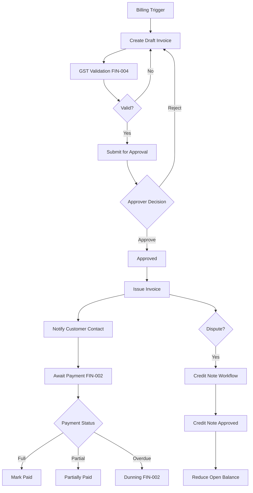

# E-LinkUp Business Functional Specification — Finance Domain Pack
**Document ID:** ELU-BFS-FIN  
**Document Name:** Finance Domain Business Functional Specification Pack  
**Version:** 1.0  
**Status:** Approved
**Related Documents:** ELU-DOC-001, ELU-DF-001, ELU-BRD-001, ELU-EFS-001, ELU-RTM-001
**Classification:** Internal Confidential  
**Project:** E-LinkUp (By Euphoria Infotech)  
**Prepared By:** Senior BA · Enterprise Solution Architect · Product Owner  
**Document Owner:** PMO  
**Example Tenant:** Euphoria  
**Stack:** Flutter (Web + Android) · Python FastAPI · PostgreSQL · JWT + Refresh Token · Docker · Linux VPS / Azure  
**Phase / Release:** Phase 2 · v1.0  
**Related Documents:** ELU-DF-001, ELU-BRD-001, ELU-SAD-001, ELU-WF-001, ELU-STORY-001

---

## Version History

| Version | Date | Author | Change |
|---------|------|--------|--------|
| 1.0 | 2026-07-31 | EIIP | Initial BFS pack (seventeen sections) |
| 1.0a | 2026-07-31 | EIIP / PMO | Status Approved; registered in ELU-DOC-001; Related Documents standardized |

## Pack Index

| Module ID | Module Name | Sub Module | Feature | Priority | BFS Section |
|-----------|-------------|------------|---------|----------|-------------|
| FIN-001 | Invoice Management | FIN-001-001 Invoice | FIN-001-001-001 Customer Invoice | **Critical** | §1–§17 below |
| FIN-002 | Payment Management | FIN-002-001 Payment | FIN-002-001-001 Payment Receipt | **Critical** | §1–§17 below |
| FIN-003 | Vendor Settlement | FIN-003-001 Settlement | FIN-003-001-001 Vendor Payment | **High** | §1–§17 below |
| FIN-004 | Tax Management | FIN-004-001 Tax | FIN-004-001-001 GST & TDS Processing | **High** | §1–§17 below |

### Cross-Module Finance Capabilities (Phase 2)

| Capability | Primary Module | Workflow | Key BR IDs |
|------------|----------------|----------|------------|
| Customer Invoice lifecycle | FIN-001 | WF-FIN-001 | BR-FIN-001–015 |
| Invoice approval | FIN-001 | WF-FIN-001 | BR-FIN-006–008 |
| Credit Note issuance | FIN-001 | WF-FIN-001 | BR-FIN-009–011 |
| GST validation & computation | FIN-004 | WF-FIN-001 | BR-FIN-040–048 |
| Payment Receipt & allocation | FIN-002 | WF-FIN-001 | BR-FIN-016–025 |
| Bank reconciliation | FIN-002 | WF-FIN-001 | BR-FIN-026–030 |
| Dunning automation | FIN-002 | WF-FIN-001 | BR-FIN-031–035 |
| Vendor Payment settlement | FIN-003 | WF-FIN-002 | BR-FIN-036–039 |
| TDS processing | FIN-004 | WF-FIN-002 | BR-FIN-049–055 |

### Shared Engine Dependencies

| Engine | Module Code | Finance Usage |
|--------|-------------|---------------|
| Workflow Engine | CPS-001 | Invoice approval, Credit Note approval, Vendor Payment approval |
| Rule Engine | CPS-002 | GST validation, dunning thresholds, TDS rate lookup, allocation rules |
| Notification Engine | CPS-003 | Invoice issued, payment received, dunning reminders, settlement paid |
| Reporting & Analytics | CPS-004 | Ageing, collections, tax summary, vendor liability |
| Audit Service | CPS-005 / PF-010 | All financial mutations |
| Document Management | CPS-006 | Invoice PDF, payment proof, vendor invoice attachments |
| Integration Framework | CPS-008 / INT-* | Bank feed (Phase 4), GST portal (Phase 4) |

### Edition Gating (Euphoria = Enterprise)

| Feature | Community | Professional | Enterprise |
|---------|-----------|--------------|------------|
| Customer Invoice | — | ✓ | ✓ |
| Payment Receipt | — | ✓ | ✓ |
| Credit Notes | — | ✓ | ✓ |
| Dunning automation | — | Basic | Full configurable |
| Bank reconciliation | — | Manual | Manual + import |
| Vendor Settlement | — | ✓ | ✓ |
| GST & TDS Processing | — | ✓ | ✓ |
| Multi-level invoice approval | — | 1 level | Multi-level |

---

# FIN-001 — Invoice Management

**Document ID:** ELU-BFS-FIN-001  
**Module:** FIN-001 — Invoice Management  
**Sub Module:** FIN-001-001 — Invoice  
**Feature:** FIN-001-001-001 — Customer Invoice  
**Domain:** FIN  
**Priority / Phase / Release:** Critical · Phase 2 · v1.0  
**Example Tenant:** Euphoria  
**Workflow:** WF-FIN-001

---

## 1. Business Objective

### 1.1 Why this module exists

Euphoria delivers IT services, EPC, and government projects where billing is tied to **Sales Orders**, **Project Milestones**, and contractual schedules—not ad-hoc spreadsheets. The Invoice Management module is the authoritative system of record for **Customer Invoices**, **Credit Notes**, and billing eligibility from delivery truth (milestone acceptance, completion certificates). Without it, receivables ageing, GST compliance, and collections cannot be governed in E-LinkUp.

### 1.2 Business value

| Value Driver | Outcome for Euphoria |
|--------------|----------------------|
| Billing accuracy | Invoices generated from approved SO / milestone data reduce manual errors |
| GST compliance | Validated GSTIN, HSN/SAC, place-of-supply rules before issue |
| Approval governance | Finance and Sales Manager sign-off before customer-facing issue |
| Receivables visibility | Issued invoices feed ageing, dunning (FIN-002), and MIS dashboards |
| Audit trail | Immutable issued invoices; corrections only via Credit Note |

### 1.3 Business scope

| In Scope (Phase 2) | Out of Scope (Phase 2) |
|--------------------|------------------------|
| Customer Invoice create from SO / Project / Milestone / manual | Vendor invoices (FIN-003) |
| Invoice line items with tax breakdown | Full accounting GL posting |
| Draft → Approval → Issue lifecycle | E-invoice IRN generation (Phase 4 / INT) |
| Credit Note against issued invoice | Pro-forma invoice (v2.0) |
| Invoice PDF generation & email to Customer Contact | Multi-currency FX revaluation |
| Invoice cancellation (pre-issue) and credit (post-issue) | Recurring subscription billing engine |
| Link to Customer, SO, Project, Milestone | |
| GST validation via FIN-004 | |
| Invoice approval workflow (WF-FIN-001) | |

### 1.4 Users involved

Finance User (primary), Sales Manager (approval / credit notes), Project Manager (billing trigger visibility), Customer Contact (receives invoice), Tenant Admin (configuration).

### 1.5 Module reference

| Attribute | Value |
|-----------|-------|
| Domain | FIN |
| Module | FIN-001 Invoice Management |
| Sub Module | FIN-001-001 Invoice |
| Feature | FIN-001-001-001 Customer Invoice |
| Priority | Critical |
| Phase | 2 |
| Release | v1.0 |
| Dependencies | SAL-003 Sales Order, PRJ-002 Milestone, CRM-003 Customer, FIN-004 Tax, CPS-001 Workflow |

---

## 2. Business Actors

| Actor | Type | Primary Actions | Secondary Actions |
|-------|------|-----------------|-------------------|
| Finance User | Internal | Create/edit draft invoice; submit for approval; issue invoice; create credit note; print/email PDF | View project billing status |
| Sales Manager | Internal | Approve/reject invoice and credit note; view pipeline billing | Notify on credit note |
| Project Manager | Internal | View milestone billing eligibility; request billing | Cannot issue invoice |
| Customer Contact | External | Receive invoice PDF/email; view invoice in customer portal | Pay (FIN-002) |
| Tenant Admin | Internal | Configure invoice numbering, approval rules, dunning link | View all invoices |
| System (Workflow Engine) | System | Route approval tasks; enforce state transitions | — |
| System (Rule Engine) | System | GST validation; line total computation | — |
| System (Notification Engine) | System | Send invoice issued, approval pending alerts | — |
| System (Scheduler) | System | Overdue status flip; dunning trigger handoff to FIN-002 | — |

---

## 3. Business Story

A **Project Manager** completes a **Project Milestone** (PRJ-002) and obtains Customer Contact acceptance. The milestone status becomes **Billing Eligible**, which surfaces on the Finance billing workbench for tenant **Euphoria**.

The **Finance User** opens the billing workbench, selects the milestone linked to **Customer** record and **Sales Order** schedule line. They initiate **Customer Invoice** creation. The system pulls commercial terms (rate, quantity, HSN/SAC, tax category) from the SO and applies **GST** rules from FIN-004: validates Customer GSTIN format, determines place of supply (inter-state vs intra-state), and computes CGST/SGST or IGST per line.

The Finance User reviews the **Draft Invoice**, attaches supporting documents (milestone sign-off, completion certificate) via Document Engine, and **submits for approval**. The **Workflow Engine** routes to **Sales Manager** when invoice value exceeds tenant threshold (e.g. ₹5,00,000) or when credit terms differ from SO; otherwise Finance Manager auto-approves per rule.

**Sales Manager** reviews commercial alignment, approves. Invoice moves to **Approved**. Finance User **issues** the invoice: system assigns invoice number (FY-scoped sequence), locks line items, generates PDF, and notifies **Customer Contact** via email with portal link.

Thirty days later, payment is not received. Scheduler marks invoice **Overdue** and FIN-002 dunning picks up reminders.

If Customer disputes quantity, Finance User cannot edit the issued invoice. They create a **Credit Note** linked to the original invoice, submit for Sales Manager approval, and upon approval the credit note reduces open balance and adjusts tax registers (FIN-004).

**Exception — Rejection:** Sales Manager rejects draft invoice; Finance User corrects lines or billing source and resubmits.

**Exception — Cancellation:** Draft or Approved (not yet Issued) invoice can be cancelled by Finance User with reason; Issued invoices require Credit Note path only.

---

## 4. Business Workflow

### 4.1 Process Flow



### 4.2 Step Table

| Step | Actor | Action | Input Object | Output Object | Engine |
|------|-------|--------|--------------|---------------|--------|
| 1 | System / PM | Milestone billing eligible | Milestone | Billing Eligibility flag | Workflow |
| 2 | Finance User | Create draft invoice | SO / Milestone / Customer | Draft Invoice | — |
| 3 | System | Compute tax & validate GST | Invoice lines, Tax masters | Tax breakdown | Rule Engine |
| 4 | Finance User | Submit for approval | Draft Invoice | Pending Approval Invoice | Workflow Engine |
| 5 | Sales Manager | Approve / reject | Pending Approval Invoice | Approved / Rejected Invoice | Workflow Engine |
| 6 | Finance User | Issue invoice | Approved Invoice | Issued Invoice + PDF | Document Engine |
| 7 | System | Notify customer | Issued Invoice | Email / Portal notification | Notification Engine |
| 8 | Finance User | Create credit note | Issued Invoice | Draft Credit Note | — |
| 9 | Sales Manager | Approve credit note | Draft Credit Note | Issued Credit Note | Workflow Engine |
| 10 | System | Update open balance | Credit Note | Adjusted Invoice balance | Rule Engine |
| 11 | System | Mark overdue | Issued Invoice (due date passed) | Overdue Invoice | Scheduler |
| 12 | FIN-002 | Dunning & payment | Overdue Invoice | Payment / Reminder | Notification Engine |

---

## 5. Business States

### 5.1 Customer Invoice States

| State Code | State Label | Description | Allowed Next States | Entry Actors | System Effects |
|------------|-------------|-------------|---------------------|--------------|----------------|
| `DRAFT` | Draft | Editable working copy | SUBMITTED, CANCELLED | Finance User | No customer visibility |
| `PENDING_APPROVAL` | Pending Approval | Awaiting approver | APPROVED, REJECTED, DRAFT | Finance User (submit) | Approval task created |
| `REJECTED` | Rejected | Returned to originator | DRAFT, CANCELLED | Sales Manager | Notify Finance User |
| `APPROVED` | Approved | Ready to issue | ISSUED, CANCELLED | Sales Manager / Workflow | Lock commercial edits |
| `ISSUED` | Issued | Customer-facing; immutable | PARTIALLY_PAID, PAID, OVERDUE, CREDITED | Finance User (issue) | PDF generated; audit lock |
| `PARTIALLY_PAID` | Partially Paid | Allocation < total due | PARTIALLY_PAID, PAID, OVERDUE | System (FIN-002) | Open balance updated |
| `PAID` | Paid | Fully allocated | CLOSED | System (FIN-002) | Billing complete |
| `OVERDUE` | Overdue | Past due date; balance > 0 | PARTIALLY_PAID, PAID | Scheduler | Dunning eligible |
| `CANCELLED` | Cancelled | Voided pre-issue | — | Finance User | No numbering consumed if pre-number |
| `CREDITED` | Credited | Net balance zero via credit note(s) | CLOSED | System | Link to credit notes |
| `CLOSED` | Closed | Terminal archived state | ARCHIVED | System / Finance User | Read-only |

### 5.2 Credit Note States

| State Code | State Label | Allowed Next States | Entry Actors |
|------------|-------------|---------------------|--------------|
| `DRAFT` | Draft | PENDING_APPROVAL, CANCELLED | Finance User |
| `PENDING_APPROVAL` | Pending Approval | APPROVED, REJECTED | Finance User |
| `APPROVED` | Approved | ISSUED | Sales Manager |
| `ISSUED` | Issued | APPLIED | Finance User |
| `APPLIED` | Applied | CLOSED | System |
| `CANCELLED` | Cancelled | — | Finance User |

---

## 6. Business Rules

| Rule ID | Statement | Type | Severity | Enforcement |
|---------|-----------|------|----------|-------------|
| BR-FIN-001 | Every Customer Invoice must link to exactly one Customer record | Validation | Error | API / DB |
| BR-FIN-002 | Every Customer Invoice must link to at least one billing source: Sales Order line, Project Milestone, or manual billing reason code | Validation | Error | API |
| BR-FIN-003 | Invoice line quantity and rate for milestone/SO-sourced lines must not exceed source eligible quantity/value without Sales Manager override | Validation | Error | Rule Engine |
| BR-FIN-004 | Tax on each line shall be computed from FIN-004 tax configuration; manual tax override requires reason and is audited | Calculation | Warning/Error | Rule Engine / API |
| BR-FIN-005 | Customer GSTIN must pass format validation when tax registration type is Registered | Validation | Error | Rule Engine |
| BR-FIN-006 | Invoice submission for approval requires at least one line item with non-zero taxable value | Validation | Error | UI / API |
| BR-FIN-007 | Invoices exceeding tenant approval threshold shall route to Sales Manager per WF-FIN-001 | Approval | — | Workflow Engine |
| BR-FIN-008 | Invoices with credit terms differing from linked Sales Order shall require Sales Manager approval | Approval | — | Workflow Engine |
| BR-FIN-009 | Issued invoices are immutable; line items, tax, and customer details cannot be updated except status transitions from payment | Lifecycle | Error | API / DB |
| BR-FIN-010 | Corrections to Issued invoices must be performed only via Credit Note | Lifecycle | Error | API |
| BR-FIN-011 | Credit Note total cannot exceed remaining open balance of parent invoice | Validation | Error | API |
| BR-FIN-012 | Credit Note must reference exactly one parent Issued Invoice | Validation | Error | API / DB |
| BR-FIN-013 | Invoice number is assigned only at Issue action; sequence is FY-scoped per tenant | Calculation | — | API |
| BR-FIN-014 | Invoice due date defaults from Customer payment terms or SO terms unless overridden with reason | Calculation | — | Rule Engine |
| BR-FIN-015 | Cancelled invoices cannot be reactivated; a new invoice must be created | Lifecycle | Error | API |

---

## 7. Database Impact

| Table Name | Type | Purpose | Tenant Scoped |
|------------|------|---------|---------------|
| `invoice` | Transaction | Customer Invoice header | Yes |
| `invoice_line` | Transaction | Invoice line items | Yes |
| `invoice_tax_line` | Transaction | Tax breakdown per invoice line | Yes |
| `credit_note` | Transaction | Credit note header | Yes |
| `credit_note_line` | Transaction | Credit note lines | Yes |
| `invoice_billing_source` | Link | Invoice ↔ SO / Milestone / Project | Yes |
| `invoice_status_history` | Audit | State transition log | Yes |
| `invoice_number_sequence` | Master | FY-scoped numbering | Yes |
| `billing_eligibility` | Transaction | Milestone/SO billing queue | Yes |

---

## 8. Relationships

| Parent | Child | Cardinality | On Delete | Notes |
|--------|-------|-------------|-----------|-------|
| `tenant` | `invoice` | 1:N | Restrict | Platform isolation |
| `customer` | `invoice` | 1:N | Restrict | Billing party |
| `sales_order` | `invoice_billing_source` | 1:N | Restrict | Optional source |
| `project_milestone` | `invoice_billing_source` | 1:N | Restrict | Optional source |
| `project` | `invoice_billing_source` | 1:N | Restrict | Optional source |
| `invoice` | `invoice_line` | 1:N | Cascade | Lines |
| `invoice_line` | `invoice_tax_line` | 1:N | Cascade | GST lines |
| `invoice` | `credit_note` | 1:N | Restrict | Parent invoice |
| `credit_note` | `credit_note_line` | 1:N | Cascade | |
| `invoice` | `payment_allocation` | 1:N | Restrict | FIN-002 link |
| `user` | `invoice` | 1:N | Restrict | created_by |

---

## 9. Field Groups

### `invoice`

| Group | Contents (logical) |
|-------|-------------------|
| General Information | Invoice type, document date, due date, currency, description |
| Customer & Billing | Customer, billing address, ship-to, contact, GSTIN |
| Commercial | Payment terms, PO reference, SO reference, project reference |
| Tax Summary | Taxable value, CGST, SGST, IGST, cess, total tax, grand total |
| Status | Status code, approval status, issue date, overdue flag |
| Assignment | Owning Finance User, collections owner |
| Attachments | Milestone sign-off, supporting docs |
| Audit | tenant_id, version, soft delete, created/modified |

### `invoice_line`

| Group | Contents |
|-------|----------|
| Line Identity | Line number, item/service description, HSN/SAC |
| Quantity & Rate | Quantity, UOM, unit rate, discount |
| Tax | Tax category, taxable amount, tax components |
| Source Link | SO line id, milestone id |

### `credit_note`

| Group | Contents |
|-------|----------|
| General | Credit note number, date, reason code, narrative |
| Parent Link | Parent invoice id, original invoice number |
| Amounts | Credit taxable, tax, total |
| Status | Lifecycle state |
| Approval | Approver, approval date |
| Audit | Standard audit columns |

---

## 10. REST APIs

| Method | Path | Purpose | Permission |
|--------|------|---------|------------|
| GET | `/api/v1/finance/invoices` | List invoices (filter, sort, page) | `invoice.read` |
| GET | `/api/v1/finance/invoices/{id}` | Get invoice detail with lines & tax | `invoice.read` |
| POST | `/api/v1/finance/invoices` | Create draft invoice | `invoice.create` |
| PUT | `/api/v1/finance/invoices/{id}` | Update draft invoice | `invoice.update` |
| PATCH | `/api/v1/finance/invoices/{id}/status` | Status transition (submit, issue, cancel) | `invoice.submit` / `invoice.issue` / `invoice.cancel` |
| DELETE | `/api/v1/finance/invoices/{id}` | Soft delete draft only | `invoice.delete` |
| GET | `/api/v1/finance/invoices/search` | Advanced search | `invoice.read` |
| GET | `/api/v1/finance/invoices/export` | Export register (CSV/XLSX) | `invoice.export` |
| POST | `/api/v1/finance/invoices/{id}/submit` | Submit for approval | `invoice.submit` |
| POST | `/api/v1/finance/invoices/{id}/approve` | Approve invoice | `invoice.approve` |
| POST | `/api/v1/finance/invoices/{id}/reject` | Reject invoice | `invoice.reject` |
| POST | `/api/v1/finance/invoices/{id}/issue` | Issue to customer | `invoice.issue` |
| GET | `/api/v1/finance/invoices/{id}/pdf` | Download PDF | `invoice.print` |
| POST | `/api/v1/finance/invoices/{id}/email` | Email to Customer Contact | `invoice.issue` |
| GET | `/api/v1/finance/billing-eligibility` | Billing workbench queue | `invoice.read` |
| POST | `/api/v1/finance/invoices/from-milestone/{milestone_id}` | Create from milestone | `invoice.create` |
| POST | `/api/v1/finance/invoices/from-sales-order/{so_id}` | Create from SO schedule | `invoice.create` |
| GET | `/api/v1/finance/credit-notes` | List credit notes | `credit_note.read` |
| POST | `/api/v1/finance/credit-notes` | Create credit note | `credit_note.create` |
| POST | `/api/v1/finance/credit-notes/{id}/submit` | Submit CN for approval | `credit_note.submit` |
| POST | `/api/v1/finance/credit-notes/{id}/approve` | Approve credit note | `credit_note.approve` |
| POST | `/api/v1/finance/credit-notes/{id}/issue` | Issue credit note | `credit_note.issue` |
| GET | `/api/v1/finance/invoices/{id}/history` | Status & audit history | `invoice.read` |

**Standards:** Bearer JWT; `tenant_id` from JWT claim; pagination `page`, `page_size`; soft delete; idempotent issue via `Idempotency-Key` header.

---

## 11. Flutter Screens

| Screen ID | Screen Name | Type | Primary Actor | Route (Web) |
|-----------|-------------|------|---------------|-------------|
| FIN-UI-001 | Invoice List | List | Finance User | `/finance/invoices` |
| FIN-UI-002 | Invoice Create | Create | Finance User | `/finance/invoices/new` |
| FIN-UI-003 | Invoice Edit | Edit | Finance User | `/finance/invoices/{id}/edit` |
| FIN-UI-004 | Invoice Detail | View | Finance User, Sales Manager | `/finance/invoices/{id}` |
| FIN-UI-005 | Invoice Search | Search | Finance User | `/finance/invoices/search` |
| FIN-UI-006 | Invoice Approval Inbox | Approval | Sales Manager | `/finance/invoices/approvals` |
| FIN-UI-007 | Billing Workbench | List | Finance User | `/finance/billing-eligibility` |
| FIN-UI-008 | Credit Note Create | Create | Finance User | `/finance/credit-notes/new` |
| FIN-UI-009 | Credit Note Detail | View | Finance User | `/finance/credit-notes/{id}` |
| FIN-UI-010 | Invoice History | History | Finance User | `/finance/invoices/{id}/history` |
| FIN-UI-011 | Customer Invoice Portal | View | Customer Contact | `/portal/invoices` |

---

## 12. RBAC Permissions

| Permission | Description |
|------------|-------------|
| `invoice.create` | Create draft invoices |
| `invoice.read` | View invoices |
| `invoice.update` | Edit drafts |
| `invoice.delete` | Soft delete drafts |
| `invoice.submit` | Submit for approval |
| `invoice.approve` | Approve invoices |
| `invoice.reject` | Reject invoices |
| `invoice.issue` | Issue to customer |
| `invoice.cancel` | Cancel pre-issue |
| `invoice.print` | PDF / print |
| `invoice.export` | Export register |
| `credit_note.create` | Create credit notes |
| `credit_note.read` | View credit notes |
| `credit_note.submit` | Submit CN |
| `credit_note.approve` | Approve CN |
| `credit_note.issue` | Issue CN |

### Role Matrix (Euphoria)

| Permission | Finance User | Sales Manager | Project Manager | Customer Contact | Tenant Admin |
|------------|:------------:|:-------------:|:---------------:|:----------------:|:------------:|
| invoice.create | ✓ | — | — | — | ✓ |
| invoice.read | ✓ | ✓ | ✓ (project-linked) | ✓ (own) | ✓ |
| invoice.update | ✓ | — | — | — | ✓ |
| invoice.submit | ✓ | — | — | — | ✓ |
| invoice.approve | — | ✓ | — | — | ✓ |
| invoice.issue | ✓ | — | — | — | ✓ |
| invoice.cancel | ✓ | — | — | — | ✓ |
| credit_note.create | ✓ | — | — | — | ✓ |
| credit_note.approve | — | ✓ | — | — | ✓ |

---

## 13. Notifications

| Event | Channels | Recipients | Template Key |
|-------|----------|------------|--------------|
| Invoice pending approval | Email, Internal | Sales Manager | NTF-FIN-001 |
| Invoice approved | Internal | Finance User | NTF-FIN-002 |
| Invoice rejected | Email, Internal | Finance User | NTF-FIN-003 |
| Invoice issued | Email, Portal | Customer Contact, Finance User | NTF-FIN-004 |
| Invoice overdue | Email, Internal | Finance User, Sales Manager | NTF-FIN-005 |
| Credit note pending approval | Internal | Sales Manager | NTF-FIN-006 |
| Credit note issued | Email | Customer Contact | NTF-FIN-007 |

---

## 14. Reports

| Report ID | Name | Type | Audience | Grain | Filters | Export |
|-----------|------|------|----------|-------|---------|--------|
| RPT-FIN-001 | Invoice Register | Operational | Finance User | Invoice | Date, Customer, Status, Project | CSV, XLSX, PDF |
| RPT-FIN-002 | Billing Eligibility Queue | Operational | Finance User | Milestone/SO line | Project, PM, date | CSV |
| RPT-FIN-003 | Invoice Ageing | Management | Finance User, Sales Manager | Invoice | Customer, ageing bucket | CSV, XLSX |
| RPT-FIN-004 | Credit Note Register | Operational | Finance User | Credit Note | Date, parent invoice | CSV |
| RPT-FIN-005 | Collections Dashboard KPI | Executive | Tenant Admin | Tenant | FY, segment | Dashboard |
| KPI-FIN-001 | DSO (Days Sales Outstanding) | KPI | Tenant Admin | Tenant monthly | FY | Dashboard |
| KPI-FIN-002 | Invoice-to-Cash Cycle Time | KPI | Finance User | Invoice | Project | Dashboard |

---

## 15. Audit Requirements

| Event | Audited Fields | Retention |
|-------|----------------|-----------|
| Invoice created | Header, lines, source links | Tenant policy (default 7 years) |
| Invoice updated (draft) | Changed fields diff | Tenant policy |
| Status transition | From/to state, actor, timestamp | Tenant policy |
| Approval / rejection | Approver, comments | Tenant policy |
| Issue | Invoice number, issue timestamp | Permanent |
| Credit note lifecycle | Full CN record | Tenant policy |
| PDF generated / emailed | Document id, recipient | Tenant policy |
| Export register | Actor, filter criteria | Tenant policy |
| Tax override | Original vs override, reason | Tenant policy |

---

## 16. Acceptance Criteria

| AC ID | Criterion |
|-------|-----------|
| AC-FIN-001-01 | Given a billing-eligible milestone for Euphoria Customer, Finance User can create draft invoice with lines auto-populated from milestone value |
| AC-FIN-001-02 | Given draft invoice with invalid Customer GSTIN format, submission fails with BR-FIN-005 message |
| AC-FIN-001-03 | Given invoice above approval threshold, submit routes approval task to Sales Manager |
| AC-FIN-001-04 | Given approved invoice, Finance User can issue; system assigns FY invoice number and generates PDF |
| AC-FIN-001-05 | Given issued invoice, PUT update on line items returns 403 / BR-FIN-009 |
| AC-FIN-001-06 | Given issued invoice with open balance, Finance User can create credit note ≤ open balance |
| AC-FIN-001-07 | Given credit note approved and issued, parent invoice open balance reduces correctly |
| AC-FIN-001-08 | Given invoice past due date with balance > 0, system transitions to OVERDUE |
| AC-FIN-001-09 | Customer Contact can view issued invoice in portal for their Customer record only |
| AC-FIN-001-10 | Tenant isolation: Euphoria user cannot read another tenant's invoices |

---

## 17. Future Enhancements

| Version | Enhancement |
|---------|-------------|
| v2.0 | Pro-forma invoices; recurring billing schedules; multi-currency with FX |
| v2.0 | Invoice templates per service line (IT, EPC, AMC) |
| v3.0 | E-invoice IRN via GST portal integration (INT-004) |
| v3.0 | AI-assisted billing anomaly detection (CPS-007) |
| v3.0 | Retention billing and holdback release automation |

---

# FIN-002 — Payment Management

**Document ID:** ELU-BFS-FIN-002  
**Module:** FIN-002 — Payment Management  
**Sub Module:** FIN-002-001 — Payment  
**Feature:** FIN-002-001-001 — Payment Receipt  
**Domain:** FIN  
**Priority / Phase / Release:** Critical · Phase 2 · v1.0  
**Example Tenant:** Euphoria  
**Workflow:** WF-FIN-001

---

## 1. Business Objective

### 1.1 Why this module exists

Issuing invoices (FIN-001) without disciplined **payment recording**, **allocation**, **reconciliation**, and **dunning** leaves Euphoria with unreliable receivables data and manual bank-matching effort. Payment Management closes the invoice-to-cash loop.

### 1.2 Business value

| Value Driver | Outcome |
|--------------|---------|
| Cash application | Payments allocated to invoices with audit trail |
| Partial payments | Correct open balance and ageing |
| Reconciliation | Bank statement lines matched to receipts |
| Dunning | Automated overdue reminders reduce DSO |
| Customer experience | Portal payment status visibility |

### 1.3 Business scope

| In Scope | Out of Scope |
|----------|--------------|
| Payment Receipt manual entry | Payment gateway integration (Phase 4) |
| Allocation to one or many invoices | Payroll payments |
| Unallocated / on-account payments | Petty cash |
| Bank reconciliation (manual match) | Auto bank feed (Enterprise Phase 4) |
| Dunning schedule & reminders | Legal collections workflow |
| Payment reversal with approval | |
| Customer portal payment history | |

### 1.4 Users involved

Finance User (primary), Sales Manager (escalation visibility), Customer Contact (portal), Tenant Admin (dunning config).

### 1.5 Module reference

| Attribute | Value |
|-----------|-------|
| Module | FIN-002 Payment Management |
| Sub Module | FIN-002-001 Payment |
| Feature | FIN-002-001-001 Payment Receipt |
| Priority | Critical |
| Phase | 2 |
| Dependencies | FIN-001 Invoice, FIN-004 Tax (TDS on receipt), CRM-003 Customer |

---

## 2. Business Actors

| Actor | Type | Primary Actions | Secondary Actions |
|-------|------|-----------------|-------------------|
| Finance User | Internal | Record receipt; allocate; reconcile; configure dunning | Export collections report |
| Sales Manager | Internal | View overdue accounts; receive escalation | — |
| Project Manager | Internal | View project collection status | — |
| Customer Contact | External | View payment history in portal | Initiate bank transfer (external) |
| Tenant Admin | Internal | Dunning schedule config | Full payment read |
| System (Scheduler) | System | Dunning reminders; overdue escalation | — |
| System (Notification Engine) | System | Payment confirmation; dunning emails | — |

---

## 3. Business Story

**Customer Contact** transfers funds to Euphoria's bank account against Invoice INV-2025-0042. **Finance User** receives bank confirmation and creates a **Payment Receipt** in E-LinkUp: date, amount, mode (NEFT/RTGS/Cheque/UPI), bank reference, Customer.

Finance User opens **Payment Allocation** screen, searches open invoices for that Customer, and allocates ₹8,00,000 to INV-2025-0042. System applies allocation, updates invoice to **Paid**, records TDS deducted by customer if applicable (FIN-004), and writes `payment_allocation` rows.

A second receipt of ₹2,00,000 is partial against INV-2025-0055 (₹5,00,000 due). Allocation of ₹2,00,000 moves invoice to **Partially Paid**; remaining ₹3,00,000 stays in ageing.

Finance User imports bank statement CSV (Enterprise) into **Reconciliation** workbench, matches unreconciled receipts to statement lines, marks reconciled. Unmatched statement lines remain for investigation.

Invoice INV-2025-0038 is 15 days overdue. **Dunning** Level 1 email goes to Customer Contact. At 30 days Level 2 includes Sales Manager. At 45 days Level 3 escalates to Tenant Admin configurable list.

If a receipt was recorded in error, Finance User initiates **reversal**; system requires reason and Tenant Admin approval; allocations unwind and invoice balances restore.

---

## 4. Business Workflow

```mermaid
flowchart TD
    A[Payment Received] --> B[Create Payment Receipt]
    B --> C[Allocate to Invoice(s)]
    C --> D{Fully allocated?}
    D -->|Yes| E[Update Invoice Paid/Partial]
    D -->|No| F[On-account balance]
    E --> G[Reconciliation Workbench]
    F --> G
    G --> H{Match bank line?}
    H -->|Yes| I[Mark Reconciled]
    H -->|No| J[Outstanding for review]
    E --> K{Invoice overdue?}
    K -->|Yes| L[Dunning Engine]
    L --> M[Reminder / Escalation]
```

### Step Table

| Step | Actor | Action | Input | Output | Engine |
|------|-------|--------|-------|--------|--------|
| 1 | Finance User | Create payment receipt | Bank advice | Payment Receipt | — |
| 2 | Finance User | Allocate to invoices | Receipt, Invoices | Allocations | Rule Engine |
| 3 | System | Update invoice balance/status | Allocations | Paid/Partially Paid | — |
| 4 | Finance User | Import/match bank statement | CSV / manual | Reconciliation match | — |
| 5 | System | Run dunning | Overdue invoices | Reminders | Scheduler + Notification |
| 6 | Finance User | Reverse payment | Receipt | Reversal + restored balances | Workflow (approval) |

---

## 5. Business States

### Payment Receipt

| State Code | Label | Next States | Entry Actor |
|------------|-------|-------------|-------------|
| `DRAFT` | Draft | CONFIRMED, CANCELLED | Finance User |
| `CONFIRMED` | Confirmed | ALLOCATED, REVERSED | Finance User |
| `ALLOCATED` | Allocated | RECONCILED, REVERSED | System / Finance User |
| `RECONCILED` | Reconciled | REVERSED | Finance User |
| `REVERSED` | Reversed | — | Tenant Admin approval |
| `CANCELLED` | Cancelled | — | Finance User |

### Dunning Case

| State Code | Label | Description |
|------------|-------|-------------|
| `ACTIVE` | Active | Dunning in progress |
| `PAUSED` | Paused | Manual hold (dispute) |
| `RESOLVED` | Resolved | Invoice paid |
| `ESCALATED` | Escalated | Max level reached |

---

## 6. Business Rules

| Rule ID | Statement | Type | Severity | Enforcement |
|---------|-----------|------|----------|-------------|
| BR-FIN-016 | Payment Receipt must reference one Customer | Validation | Error | API / DB |
| BR-FIN-017 | Payment amount must be greater than zero | Validation | Error | API |
| BR-FIN-018 | Allocation sum per receipt cannot exceed receipt amount | Validation | Error | API |
| BR-FIN-019 | Allocation to invoice cannot exceed invoice open balance | Validation | Error | API |
| BR-FIN-020 | One allocation row links one receipt to one invoice line or invoice header | Validation | Error | DB |
| BR-FIN-021 | Payment mode and bank reference are mandatory for NEFT/RTGS/Cheque | Validation | Error | UI / API |
| BR-FIN-022 | Confirmed receipt cannot be deleted; only reversal allowed | Lifecycle | Error | API |
| BR-FIN-023 | Reversal requires Tenant Admin approval and restores all allocations | Approval | — | Workflow |
| BR-FIN-024 | TDS deducted by customer on payment shall be recorded per FIN-004 rules | Calculation | Warning | Rule Engine |
| BR-FIN-025 | On-account (unallocated) balance shall remain visible on Customer financial summary | Calculation | — | API |
| BR-FIN-026 | Bank reconciliation match requires equal amount and compatible date window | Validation | Error | API |
| BR-FIN-027 | Reconciled receipt cannot be edited except via reversal | Lifecycle | Error | API |
| BR-FIN-028 | Duplicate bank reference for same bank account shall be blocked | Validation | Error | API |
| BR-FIN-029 | Statement import duplicate detection by reference + date + amount | Validation | Warning | API |
| BR-FIN-030 | Unreconciled receipts older than tenant threshold flagged on dashboard | Calculation | Info | Reporting |
| BR-FIN-031 | Dunning shall not run on invoices in dispute (paused dunning case) | Lifecycle | — | Rule Engine |
| BR-FIN-032 | Dunning level advancement based on tenant schedule days overdue | Calculation | — | Scheduler |
| BR-FIN-033 | Dunning Level 3 shall notify Sales Manager and Finance User | Notification | — | Notification Engine |
| BR-FIN-034 | Partial payment retains invoice in ageing for remaining balance | Lifecycle | — | System |
| BR-FIN-035 | Full allocation on overdue invoice resolves dunning case | Lifecycle | — | System |

---

## 7. Database Impact

| Table Name | Type | Purpose | Tenant Scoped |
|------------|------|---------|---------------|
| `payment_receipt` | Transaction | Payment header | Yes |
| `payment_allocation` | Link | Receipt ↔ Invoice allocation | Yes |
| `payment_receipt_status_history` | Audit | Status log | Yes |
| `bank_statement_line` | Transaction | Imported/manual bank lines | Yes |
| `reconciliation_match` | Link | Statement line ↔ receipt | Yes |
| `dunning_schedule` | Master | Tenant dunning config | Yes |
| `dunning_case` | Transaction | Per-invoice dunning state | Yes |
| `dunning_action_log` | Audit | Reminder history | Yes |

---

## 8. Relationships

| Parent | Child | Cardinality | On Delete | Notes |
|--------|-------|-------------|-----------|-------|
| `customer` | `payment_receipt` | 1:N | Restrict | Paying party |
| `payment_receipt` | `payment_allocation` | 1:N | Restrict | |
| `invoice` | `payment_allocation` | 1:N | Restrict | |
| `payment_receipt` | `reconciliation_match` | 1:1 | Restrict | Optional |
| `bank_statement_line` | `reconciliation_match` | 1:1 | Restrict | |
| `invoice` | `dunning_case` | 1:1 | Restrict | When overdue |
| `dunning_schedule` | `dunning_case` | 1:N | Restrict | Template |

---

## 9. Field Groups

### `payment_receipt`

| Group | Contents |
|-------|----------|
| General | Receipt number, receipt date, amount, currency |
| Payment Details | Mode, bank name, reference number, cheque details |
| Customer | Customer, contact |
| TDS | TDS deducted amount, certificate reference |
| Allocation Summary | Total allocated, unallocated balance |
| Status | Lifecycle state, reconciliation flag |
| Audit | Standard |

### `payment_allocation`

| Group | Contents |
|-------|----------|
| Link | Receipt id, invoice id |
| Amounts | Allocated amount, discount taken, write-off (future) |
| Audit | Created by/on |

### `dunning_schedule`

| Group | Contents |
|-------|----------|
| Configuration | Level, days overdue, channel, template, escalate to role |

---

## 10. REST APIs

| Method | Path | Purpose | Permission |
|--------|------|---------|------------|
| GET | `/api/v1/finance/payments` | List payment receipts | `payment.read` |
| GET | `/api/v1/finance/payments/{id}` | Get receipt with allocations | `payment.read` |
| POST | `/api/v1/finance/payments` | Create payment receipt | `payment.create` |
| PATCH | `/api/v1/finance/payments/{id}/confirm` | Confirm receipt | `payment.confirm` |
| POST | `/api/v1/finance/payments/{id}/allocate` | Allocate to invoices | `payment.allocate` |
| DELETE | `/api/v1/finance/payments/{id}/allocations/{alloc_id}` | Remove allocation (pre-reconcile) | `payment.allocate` |
| POST | `/api/v1/finance/payments/{id}/reverse` | Request reversal | `payment.reverse` |
| GET | `/api/v1/finance/payments/search` | Search receipts | `payment.read` |
| GET | `/api/v1/finance/payments/export` | Export | `payment.export` |
| GET | `/api/v1/finance/reconciliation/unmatched` | Unmatched receipts & lines | `reconciliation.read` |
| POST | `/api/v1/finance/reconciliation/bank-statement/import` | Import CSV | `reconciliation.import` |
| POST | `/api/v1/finance/reconciliation/match` | Match receipt to line | `reconciliation.match` |
| POST | `/api/v1/finance/reconciliation/unmatch` | Undo match | `reconciliation.match` |
| GET | `/api/v1/finance/dunning/cases` | Active dunning cases | `dunning.read` |
| GET | `/api/v1/finance/dunning/schedule` | Get tenant schedule | `dunning.configure` |
| PUT | `/api/v1/finance/dunning/schedule` | Update schedule | `dunning.configure` |
| POST | `/api/v1/finance/dunning/cases/{id}/pause` | Pause dunning | `dunning.manage` |
| POST | `/api/v1/finance/dunning/cases/{id}/resume` | Resume dunning | `dunning.manage` |
| GET | `/api/v1/finance/customers/{id}/payment-summary` | Customer payment summary | `payment.read` |

---

## 11. Flutter Screens

| Screen ID | Name | Type | Actor | Route |
|-----------|------|------|-------|-------|
| FIN-UI-012 | Payment Receipt List | List | Finance User | `/finance/payments` |
| FIN-UI-013 | Payment Receipt Create | Create | Finance User | `/finance/payments/new` |
| FIN-UI-014 | Payment Receipt Detail | View | Finance User | `/finance/payments/{id}` |
| FIN-UI-015 | Payment Allocation | Edit | Finance User | `/finance/payments/{id}/allocate` |
| FIN-UI-016 | Reconciliation Workbench | List | Finance User | `/finance/reconciliation` |
| FIN-UI-017 | Bank Statement Import | Create | Finance User | `/finance/reconciliation/import` |
| FIN-UI-018 | Dunning Dashboard | List | Finance User | `/finance/dunning` |
| FIN-UI-019 | Dunning Schedule Config | Edit | Tenant Admin | `/finance/settings/dunning` |
| FIN-UI-020 | Customer Payment Portal | View | Customer Contact | `/portal/payments` |

---

## 12. RBAC Permissions

| Permission | Finance User | Sales Manager | Project Manager | Customer Contact | Tenant Admin |
|------------|:------------:|:-------------:|:---------------:|:----------------:|:------------:|
| payment.create | ✓ | — | — | — | ✓ |
| payment.read | ✓ | ✓ | ✓ (project) | ✓ (own) | ✓ |
| payment.confirm | ✓ | — | — | — | ✓ |
| payment.allocate | ✓ | — | — | — | ✓ |
| payment.reverse | — | — | — | — | ✓ |
| reconciliation.read | ✓ | — | — | — | ✓ |
| reconciliation.match | ✓ | — | — | — | ✓ |
| dunning.read | ✓ | ✓ | — | — | ✓ |
| dunning.configure | — | — | — | — | ✓ |
| dunning.manage | ✓ | — | — | — | ✓ |

---

## 13. Notifications

| Event | Channels | Recipients | Template |
|-------|----------|------------|----------|
| Payment recorded | Email, Portal | Customer Contact | NTF-FIN-008 |
| Dunning Level 1 | Email | Customer Contact | NTF-FIN-009 |
| Dunning Level 2 | Email | Customer Contact, Finance User | NTF-FIN-010 |
| Dunning Level 3 escalation | Email, Internal | Sales Manager, Tenant Admin | NTF-FIN-011 |
| Payment reversal approved | Internal | Finance User | NTF-FIN-012 |
| Reconciliation backlog alert | Internal | Finance User | NTF-FIN-013 |

---

## 14. Reports

| Report ID | Name | Audience | Grain |
|-----------|------|----------|-------|
| RPT-FIN-006 | Payment Register | Finance User | Receipt |
| RPT-FIN-007 | Unallocated Receipts | Finance User | Receipt |
| RPT-FIN-008 | Reconciliation Status | Finance User | Bank line |
| RPT-FIN-009 | Dunning Activity Log | Finance User, Sales Manager | Dunning action |
| RPT-FIN-010 | Collections vs Target | Sales Manager | Customer / month |
| KPI-FIN-003 | Collection Efficiency | Tenant Admin | Monthly |

---

## 15. Audit Requirements

| Event | Notes |
|-------|-------|
| Receipt created / confirmed | Full record |
| Allocation created / removed | Invoice id, amounts |
| Reconciliation match / unmatch | Bank line id |
| Dunning pause / resume | Reason |
| Reversal | Approval chain |
| Dunning schedule change | Before/after config |

---

## 16. Acceptance Criteria

| AC ID | Criterion |
|-------|-----------|
| AC-FIN-002-01 | Finance User can record receipt and fully allocate to open invoice; invoice becomes Paid |
| AC-FIN-002-02 | Partial allocation updates invoice to Partially Paid with correct open balance |
| AC-FIN-002-03 | Allocation exceeding receipt amount rejected (BR-FIN-018) |
| AC-FIN-002-04 | Duplicate bank reference blocked (BR-FIN-028) |
| AC-FIN-002-05 | Reconciliation match marks receipt and statement line reconciled |
| AC-FIN-002-06 | Overdue invoice triggers dunning Level 1 per schedule |
| AC-FIN-002-07 | Paused dunning case suppresses reminders (BR-FIN-031) |
| AC-FIN-002-08 | Payment reversal with Tenant Admin approval restores invoice balance |
| AC-FIN-002-09 | Customer Contact sees payment history for own Customer only |
| AC-FIN-002-10 | Multi-tenant isolation verified for payment APIs |

---

## 17. Future Enhancements

| Version | Enhancement |
|---------|-------------|
| v2.0 | Payment gateway (Razorpay/Stripe) integration |
| v2.0 | Auto bank feed reconciliation |
| v3.0 | ML-based match suggestions |
| v3.0 | Write-off workflow with approval |

---

# FIN-003 — Vendor Settlement

**Document ID:** ELU-BFS-FIN-003  
**Module:** FIN-003 — Vendor Settlement  
**Sub Module:** FIN-003-001 — Settlement  
**Feature:** FIN-003-001-001 — Vendor Payment  
**Domain:** FIN  
**Priority / Phase / Release:** High · Phase 2 · v1.0 · Professional+  
**Example Tenant:** Euphoria  
**Workflow:** WF-FIN-002

---

## 1. Business Objective

### 1.1 Why this module exists

Euphoria projects incur vendor and subcontractor costs that must be **matched**, **approved**, and **settled** against project budgets. Vendor Settlement provides controlled **Vendor Payment** processing linked to projects and purchase commitments—complementing customer-side FIN-001/FIN-002.

### 1.2 Business value

| Value Driver | Outcome |
|--------------|---------|
| Cost control | Payments matched to PO / work order / project cost |
| Approval governance | PM and Finance sign-off before disbursement |
| Project profitability | Actual vendor cost visible against budget |
| Compliance | TDS on vendor payments (FIN-004) |

### 1.3 Business scope

| In Scope | Out of Scope |
|----------|--------------|
| Vendor Payment request and approval | Full procurement PO module (SAL/PRJ scope) |
| Match to vendor invoice / claim | Employee expense reimbursements |
| Settlement disbursement recording | Treasury cash management |
| Link to Project / Work Order | |
| TDS deduction on vendor payment | |
| Vendor payment reconciliation | |

### 1.4 Users involved

Finance User, Project Manager, Tenant Admin.

### 1.5 Module reference

| Module | FIN-003 Vendor Settlement |
| Sub Module | FIN-003-001 Settlement |
| Feature | FIN-003-001-001 Vendor Payment |
| Priority | High |
| Phase | 2 (Enterprise edition) |
| Dependencies | PRJ-001 Project, FIN-004 Tax (TDS), CPS-001 Workflow |

---

## 2. Business Actors

| Actor | Type | Primary Actions | Secondary Actions |
|-------|------|-----------------|-------------------|
| Finance User | Internal | Create settlement; record vendor payment; TDS | View project costs |
| Project Manager | Internal | Approve vendor payment request; validate work | View settlement status |
| Tenant Admin | Internal | Configure approval limits | All settlements |
| System (Workflow Engine) | System | Approval routing | — |
| System (Rule Engine) | System | Budget check; TDS computation | — |

*Note: Vendor is not a CRM user actor; vendor master is a Finance master record.*

---

## 3. Business Story

A subcontractor completes work on Euphoria **Project** PRJ-2025-011. **Project Manager** confirms deliverable in project cost tracker. **Finance User** receives vendor tax invoice (PDF attached via Document Engine) and creates **Vendor Payment** request: vendor master, project, committed PO/work reference, gross amount, vendor GSTIN.

**Rule Engine** validates vendor GSTIN, computes **TDS** under FIN-004 (e.g. Section 194C), and checks project **budget remaining**. If budget exceeded, workflow requires **Project Manager** and **Tenant Admin** escalation.

**Project Manager** approves work completion. **Finance User** submits for payment approval. Upon approval, Finance User records disbursement (NEFT reference), system posts settlement **Paid**, updates project actual cost, and stores TDS deducted for statutory reporting.

Unpaid approved settlements appear on **Vendor Liability** report until paid.

---

## 4. Business Workflow

```text
Vendor Invoice / Claim Received
        │
        ▼
Create Vendor Payment Request (Draft)
        │
        ▼
Match to Project / PO / Work Reference
        │
        ▼
GST & TDS Validation (FIN-004)
        │
        ▼
Budget Check ──fail──► Escalation Approval
        │ pass
        ▼
PM Approval (work verification)
        │
        ▼
Finance Approval
        │
        ├── Rejected ──► Correct & resubmit
        │
        └── Approved
              │
              ▼
        Record Disbursement
              │
              ▼
        Reconcile & Update Project Actual Cost
              │
              ▼
        Archive / Close Settlement
```

---

## 5. Business States

| State Code | Label | Next States | Entry Actor |
|------------|-------|-------------|-------------|
| `DRAFT` | Draft | SUBMITTED, CANCELLED | Finance User |
| `SUBMITTED` | Submitted | PM_APPROVED, REJECTED | Finance User |
| `PM_APPROVED` | PM Approved | FINANCE_APPROVED, REJECTED | Project Manager |
| `FINANCE_APPROVED` | Finance Approved | PAID, CANCELLED | Finance User / Workflow |
| `REJECTED` | Rejected | DRAFT | PM / Finance |
| `PAID` | Paid | RECONCILED | Finance User |
| `RECONCILED` | Reconciled | CLOSED | Finance User |
| `CANCELLED` | Cancelled | — | Finance User |
| `CLOSED` | Closed | — | System |

---

## 6. Business Rules

| Rule ID | Statement | Type | Severity | Enforcement |
|---------|-----------|------|----------|-------------|
| BR-FIN-036 | Vendor Payment must reference a registered vendor master record | Validation | Error | API / DB |
| BR-FIN-037 | Vendor Payment must link to at least one Project | Validation | Error | API |
| BR-FIN-038 | Gross payment amount must be greater than zero | Validation | Error | API |
| BR-FIN-039 | TDS on vendor payment computed per FIN-004; net pay = gross − TDS | Calculation | Error | Rule Engine |
| BR-FIN-040 | Payment exceeding project vendor budget remaining requires PM + Tenant Admin approval | Approval | — | Workflow |
| BR-FIN-041 | Vendor GSTIN validated when vendor is GST registered | Validation | Error | Rule Engine |
| BR-FIN-042 | PM approval required before Finance approval for all vendor payments | Approval | — | Workflow |
| BR-FIN-043 | Paid settlement cannot be edited; reversal requires Tenant Admin | Lifecycle | Error | API |
| BR-FIN-044 | Duplicate vendor invoice number for same vendor blocked | Validation | Error | API |
| BR-FIN-045 | Disbursement requires bank reference for NEFT/RTGS modes | Validation | Error | API |

---

## 7. Database Impact

| Table Name | Type | Purpose | Tenant Scoped |
|------------|------|---------|---------------|
| `vendor` | Master | Vendor party master | Yes |
| `vendor_payment` | Transaction | Settlement header | Yes |
| `vendor_payment_line` | Transaction | Cost lines / PO refs | Yes |
| `vendor_payment_tax` | Transaction | GST input, TDS deducted | Yes |
| `vendor_payment_status_history` | Audit | State log | Yes |
| `vendor_payment_sequence` | Master | Payment voucher numbering | Yes |

---

## 8. Relationships

| Parent | Child | Cardinality | On Delete |
|--------|-------|-------------|-----------|
| `vendor` | `vendor_payment` | 1:N | Restrict |
| `project` | `vendor_payment` | 1:N | Restrict |
| `vendor_payment` | `vendor_payment_line` | 1:N | Cascade |
| `work_order` | `vendor_payment_line` | 1:N | Restrict | Optional link |
| `purchase_order` | `vendor_payment_line` | 1:N | Restrict | Optional link |

---

## 9. Field Groups

### `vendor_payment`

| Group | Contents |
|-------|----------|
| General | Payment voucher no, request date, vendor invoice no/date |
| Vendor | Vendor id, GSTIN, PAN |
| Project | Project id, cost center |
| Amounts | Gross, TDS, net payable, GST input |
| Approval | PM approver, finance approver, dates |
| Disbursement | Payment date, mode, bank reference |
| Status | Lifecycle |
| Attachments | Vendor tax invoice scan |
| Audit | Standard |

---

## 10. REST APIs

| Method | Path | Purpose | Permission |
|--------|------|---------|------------|
| GET | `/api/v1/finance/vendors` | List vendors | `vendor.read` |
| POST | `/api/v1/finance/vendors` | Create vendor | `vendor.create` |
| GET | `/api/v1/finance/settlements` | List vendor payments | `settlement.read` |
| GET | `/api/v1/finance/settlements/{id}` | Detail | `settlement.read` |
| POST | `/api/v1/finance/settlements` | Create draft | `settlement.create` |
| PUT | `/api/v1/finance/settlements/{id}` | Update draft | `settlement.update` |
| POST | `/api/v1/finance/settlements/{id}/submit` | Submit | `settlement.submit` |
| POST | `/api/v1/finance/settlements/{id}/pm-approve` | PM approve | `settlement.pm_approve` |
| POST | `/api/v1/finance/settlements/{id}/approve` | Finance approve | `settlement.approve` |
| POST | `/api/v1/finance/settlements/{id}/reject` | Reject | `settlement.reject` |
| POST | `/api/v1/finance/settlements/{id}/pay` | Record disbursement | `settlement.pay` |
| POST | `/api/v1/finance/settlements/{id}/reconcile` | Mark reconciled | `settlement.reconcile` |
| GET | `/api/v1/finance/settlements/export` | Export | `settlement.export` |
| GET | `/api/v1/finance/projects/{id}/vendor-costs` | Project vendor actuals | `settlement.read` |

---

## 11. Flutter Screens

| Screen ID | Name | Type | Actor | Route |
|-----------|------|------|-------|-------|
| FIN-UI-021 | Vendor List | List | Finance User | `/finance/vendors` |
| FIN-UI-022 | Vendor Payment List | List | Finance User | `/finance/settlements` |
| FIN-UI-023 | Vendor Payment Create | Create | Finance User | `/finance/settlements/new` |
| FIN-UI-024 | Vendor Payment Detail | View | Finance User, PM | `/finance/settlements/{id}` |
| FIN-UI-025 | PM Settlement Approval | Approval | Project Manager | `/finance/settlements/pm-approvals` |
| FIN-UI-026 | Finance Settlement Approval | Approval | Finance User | `/finance/settlements/approvals` |
| FIN-UI-027 | Project Vendor Cost View | View | Project Manager | `/projects/{id}/vendor-costs` |

---

## 12. RBAC Permissions

| Permission | Finance User | Project Manager | Tenant Admin |
|------------|:------------:|:---------------:|:------------:|
| vendor.create | ✓ | — | ✓ |
| vendor.read | ✓ | ✓ | ✓ |
| settlement.create | ✓ | — | ✓ |
| settlement.read | ✓ | ✓ | ✓ |
| settlement.submit | ✓ | — | ✓ |
| settlement.pm_approve | — | ✓ | ✓ |
| settlement.approve | ✓ | — | ✓ |
| settlement.pay | ✓ | — | ✓ |
| settlement.reconcile | ✓ | — | ✓ |

---

## 13. Notifications

| Event | Channels | Recipients | Template |
|-------|----------|------------|----------|
| Settlement submitted for PM | Internal | Project Manager | NTF-FIN-014 |
| PM approved | Internal | Finance User | NTF-FIN-015 |
| Settlement approved for payment | Internal | Finance User | NTF-FIN-016 |
| Settlement paid | Email (vendor optional) | Finance User | NTF-FIN-017 |
| Budget escalation required | Internal | Tenant Admin | NTF-FIN-018 |

---

## 14. Reports

| Report ID | Name | Audience |
|-----------|------|----------|
| RPT-FIN-011 | Vendor Payment Register | Finance User |
| RPT-FIN-012 | Vendor Liability (unpaid approved) | Finance User |
| RPT-FIN-013 | Project Vendor Cost Actuals | Project Manager |
| RPT-FIN-014 | TDS on Vendor Payments | Finance User |
| KPI-FIN-004 | Project Cost vs Budget | Tenant Admin |

---

## 15. Audit Requirements

Full audit on create, update, approvals, disbursement, reconciliation, reversal; vendor master changes; budget escalation events.

---

## 16. Acceptance Criteria

| AC ID | Criterion |
|-------|-----------|
| AC-FIN-003-01 | Finance User creates vendor payment linked to project with vendor invoice attachment |
| AC-FIN-003-02 | TDS auto-computed on vendor payment per tax config |
| AC-FIN-003-03 | PM can approve/reject; Finance cannot pay without PM approval |
| AC-FIN-003-04 | Budget overrun triggers escalation workflow |
| AC-FIN-003-05 | Disbursement records bank reference; status becomes Paid |
| AC-FIN-003-06 | Project actual vendor cost updates on Paid |
| AC-FIN-003-07 | Duplicate vendor invoice number rejected |
| AC-FIN-003-08 | Professional+ edition: Community tenant receives 403 on vendor settlement APIs |

---

## 17. Future Enhancements

| Version | Enhancement |
|---------|-------------|
| v2.0 | Full PO integration; three-way match |
| v2.0 | Vendor portal for invoice submission |
| v3.0 | Bulk vendor payment run |

---

# FIN-004 — Tax Management

**Document ID:** ELU-BFS-FIN-004  
**Module:** FIN-004 — Tax Management  
**Sub Module:** FIN-004-001 — Tax  
**Feature:** FIN-004-001-001 — GST & TDS Processing  
**Domain:** FIN  
**Priority / Phase / Release:** High · Phase 2 · v1.0  
**Example Tenant:** Euphoria  
**Workflow:** WF-FIN-001, WF-FIN-002

---

## 1. Business Objective

### 1.1 Why this module exists

Indian enterprise operations for Euphoria require accurate **GST** on customer invoices and **TDS** on customer receipts and vendor payments. Tax Management centralises tax masters, validation rules, and computation engines consumed by FIN-001, FIN-002, and FIN-003.

### 1.2 Business value

| Value Driver | Outcome |
|--------------|---------|
| Compliance | GSTIN validation, HSN/SAC, place of supply |
| Consistency | Single tax engine for sales and vendor flows |
| Reporting | GSTR-oriented summaries; TDS certificates tracking |
| Audit | Tax override reasons captured |

### 1.3 Business scope

| In Scope | Out of Scope |
|----------|--------------|
| GST rate masters (CGST/SGST/IGST) | Direct tax return filing automation |
| HSN/SAC code library | International VAT (v3.0) |
| Place of supply rules | |
| GSTIN format validation | |
| Customer invoice tax computation | |
| TDS sections and rates (194C, 194J, etc.) | |
| TDS on vendor payment (FIN-003) | |
| TDS deducted by customer on receipt (FIN-002) | |
| Tax override with audit | |
| GST summary reports | |

### 1.4 Users involved

Finance User, Tenant Admin.

### 1.5 Module reference

| Module | FIN-004 Tax Management |
| Feature | FIN-004-001-001 GST & TDS Processing |
| Priority | High |
| Phase | 2 |
| Dependencies | PF Tenant Settings (FY, state), CRM Customer GSTIN |

---

## 2. Business Actors

| Actor | Type | Primary Actions | Secondary Actions |
|-------|------|-----------------|-------------------|
| Finance User | Internal | View tax on transactions; request override | Export tax reports |
| Tenant Admin | Internal | Maintain tax masters, rates, TDS sections | Configure validation rules |
| System (Rule Engine) | System | Compute tax; validate GSTIN | — |

---

## 3. Business Story

**Tenant Admin** configures Euphoria tax settings: registered state (West Bengal), default GST rates for service categories, HSN/SAC mappings for IT services (998314), EPC classifications, and TDS sections with thresholds.

When **Finance User** creates a Customer Invoice (FIN-001), the tax engine reads Customer GSTIN and billing state. Intra-state supply to a B2B registered customer in West Bengal applies CGST 9% + SGST 9% on taxable value. Inter-state supply applies IGST 18%. Unregistered customer in same state may attract GST per tenant B2C rules. Invalid GSTIN blocks issue (BR-FIN-005).

On **Payment Receipt** (FIN-002), if Customer deducted TDS under 194J, Finance User records TDS amount and certificate number; net receipt reconciles to bank credit.

On **Vendor Payment** (FIN-003), system applies 194C TDS when vendor is individual subcontractor above threshold; net payment computed automatically.

Month-end, Finance User runs **GST Summary** and **TDS Deduction** reports for statutory preparation (export CSV; filing integration Phase 4).

---

## 4. Business Workflow

```text
Tax Configuration (Tenant Admin)
        │
        ▼
Transaction Event (Invoice / Payment / Vendor Payment)
        │
        ▼
Resolve Tax Context
  • Party GSTIN / registration type
  • Place of supply
  • HSN/SAC per line
  • TDS section eligibility
        │
        ▼
Rule Engine Computation
        │
        ├── GST lines (CGST/SGST/IGST)
        └── TDS amount (if applicable)
        │
        ▼
Validation Gate
  ├── GSTIN format / state code match
  └── Rate effective date
        │
        ▼
Attach Tax Lines to Transaction
        │
        ▼
Reporting & Audit
```

---

## 5. Business States

Tax configuration objects use standard master lifecycle:

| State Code | Label | Applies To |
|------------|-------|------------|
| `DRAFT` | Draft | Tax rate versions |
| `ACTIVE` | Active | Current effective rates |
| `EXPIRED` | Expired | Superseded rates |
| `INACTIVE` | Inactive | Disabled masters |

Transaction tax lines are immutable once parent document is Issued / Paid.

---

## 6. Business Rules

| Rule ID | Statement | Type | Severity | Enforcement |
|---------|-----------|------|----------|-------------|
| BR-FIN-046 | GSTIN must match regex `^[0-9]{2}[A-Z]{5}[0-9]{4}[A-Z]{1}[1-9A-Z]{1}Z[0-9A-Z]{1}$` when provided | Validation | Error | Rule Engine |
| BR-FIN-047 | First two digits of GSTIN must correspond to valid Indian state code | Validation | Error | Rule Engine |
| BR-FIN-048 | Place of supply for B2B defaults to Customer registered state when GSTIN present | Calculation | — | Rule Engine |
| BR-FIN-049 | Intra-state supply applies CGST + SGST; inter-state applies IGST | Calculation | Error | Rule Engine |
| BR-FIN-050 | HSN/SAC code required on every taxable invoice line | Validation | Error | API |
| BR-FIN-051 | Tax rate selection must use ACTIVE rate for document date | Validation | Error | Rule Engine |
| BR-FIN-052 | Manual tax override requires reason code and Finance User permission | Security | Error | API / Audit |
| BR-FIN-053 | TDS section rate applied per vendor/customer PAN and cumulative threshold | Calculation | — | Rule Engine |
| BR-FIN-054 | TDS on vendor payment uses section configured on vendor master default | Calculation | — | Rule Engine |
| BR-FIN-055 | TDS recorded on customer payment reduces net receipt; gross invoice unchanged | Calculation | — | Rule Engine |
| BR-FIN-056 | Reverse charge flag (if enabled) switches tax liability per tenant config | Calculation | Warning | Rule Engine |
| BR-FIN-057 | Exempt / nil-rated lines shall carry zero tax with reason code | Validation | Warning | API |
| BR-FIN-058 | Tax masters cannot be deleted if referenced; only expire | Lifecycle | Error | API |

---

## 7. Database Impact

| Table Name | Type | Purpose | Tenant Scoped |
|------------|------|---------|---------------|
| `tax_rate` | Master | GST rate versions | Yes |
| `hsn_sac_code` | Master | Code library | Yes |
| `tds_section` | Master | Section definitions | Yes |
| `tds_rate` | Master | Rate per section | Yes |
| `tax_registration` | Master | Tenant GST registrations | Yes |
| `party_tax_profile` | Master | Customer/Vendor tax attrs | Yes |
| `transaction_tax_line` | Transaction | Computed tax per txn line | Yes |
| `tds_transaction` | Transaction | TDS deducted/collected | Yes |
| `tax_override_log` | Audit | Override audit | Yes |

---

## 8. Relationships

| Parent | Child | Cardinality | Notes |
|--------|-------|-------------|-------|
| `tenant` | `tax_rate` | 1:N | |
| `hsn_sac_code` | `tax_rate` | 1:N | Optional mapping |
| `invoice_line` | `transaction_tax_line` | 1:N | GST |
| `payment_receipt` | `tds_transaction` | 1:N | TDS received |
| `vendor_payment` | `tds_transaction` | 1:N | TDS deducted |
| `customer` | `party_tax_profile` | 1:1 | |
| `vendor` | `party_tax_profile` | 1:1 | |

---

## 9. Field Groups

### `tax_rate`

| Group | Contents |
|-------|----------|
| Identity | Tax type (GST), component (CGST/SGST/IGST) |
| Rate | Percentage, effective from/to |
| Scope | HSN/SAC, service category |
| Status | Active/expired |

### `tds_section`

| Group | Contents |
|-------|----------|
| Identity | Section code (194C, 194J), description |
| Threshold | Single payment, cumulative FY threshold |
| Rate | Percentage, surcharge conditions |
| Applicability | Vendor type, PAN status |

### `transaction_tax_line`

| Group | Contents |
|-------|----------|
| Link | Parent transaction, line id |
| Tax | Component, rate, taxable base, tax amount |
| Context | Place of supply state, HSN/SAC |

---

## 10. REST APIs

| Method | Path | Purpose | Permission |
|--------|------|---------|------------|
| GET | `/api/v1/finance/tax/rates` | List tax rates | `tax.read` |
| POST | `/api/v1/finance/tax/rates` | Create rate version | `tax.configure` |
| PATCH | `/api/v1/finance/tax/rates/{id}/expire` | Expire rate | `tax.configure` |
| GET | `/api/v1/finance/tax/hsn-sac` | List HSN/SAC | `tax.read` |
| POST | `/api/v1/finance/tax/hsn-sac` | Create code | `tax.configure` |
| GET | `/api/v1/finance/tax/tds-sections` | List TDS sections | `tax.read` |
| POST | `/api/v1/finance/tax/tds-sections` | Configure section | `tax.configure` |
| POST | `/api/v1/finance/tax/compute` | Preview tax for line set | `tax.read` |
| POST | `/api/v1/finance/tax/validate-gstin` | Validate GSTIN | `tax.read` |
| GET | `/api/v1/finance/tax/gst-summary` | GST summary report data | `tax.report` |
| GET | `/api/v1/finance/tax/tds-summary` | TDS summary report data | `tax.report` |
| GET | `/api/v1/finance/tax/registrations` | Tenant GST registrations | `tax.configure` |
| POST | `/api/v1/finance/tax/registrations` | Add registration | `tax.configure` |
| GET | `/api/v1/finance/tax/overrides` | Override audit log | `tax.report` |

---

## 11. Flutter Screens

| Screen ID | Name | Type | Actor | Route |
|-----------|------|------|-------|-------|
| FIN-UI-028 | Tax Rate List | List | Tenant Admin | `/finance/settings/tax-rates` |
| FIN-UI-029 | HSN/SAC Library | List | Tenant Admin | `/finance/settings/hsn-sac` |
| FIN-UI-030 | TDS Section Config | List | Tenant Admin | `/finance/settings/tds` |
| FIN-UI-031 | GST Registration | Edit | Tenant Admin | `/finance/settings/gst-registrations` |
| FIN-UI-032 | Tax Preview Calculator | View | Finance User | `/finance/tax/preview` |
| FIN-UI-033 | GST Summary Report | Report | Finance User | `/finance/reports/gst-summary` |
| FIN-UI-034 | TDS Summary Report | Report | Finance User | `/finance/reports/tds-summary` |

---

## 12. RBAC Permissions

| Permission | Finance User | Tenant Admin |
|------------|:------------:|:------------:|
| tax.read | ✓ | ✓ |
| tax.configure | — | ✓ |
| tax.report | ✓ | ✓ |
| tax.override | ✓ (with reason) | ✓ |

---

## 13. Notifications

| Event | Channels | Recipients | Template |
|-------|----------|------------|----------|
| Tax rate expiring in 30 days | Internal | Tenant Admin | NTF-FIN-019 |
| GSTIN validation failure on invoice | Internal | Finance User | NTF-FIN-020 |

---

## 14. Reports

| Report ID | Name | Audience |
|-----------|------|----------|
| RPT-FIN-015 | GST Output Tax Summary | Finance User |
| RPT-FIN-016 | GST by HSN/SAC | Finance User |
| RPT-FIN-017 | TDS Deducted (Vendor) | Finance User |
| RPT-FIN-018 | TDS Received (Customer) | Finance User |
| RPT-FIN-019 | Tax Override Log | Tenant Admin |
| KPI-FIN-005 | Effective Tax Rate by Service Line | Tenant Admin |

---

## 15. Audit Requirements

Tax rate create/expire; TDS section changes; every tax computation on issued documents; all overrides with reason; GSTIN validation failures logged.

---

## 16. Acceptance Criteria

| AC ID | Criterion |
|-------|-----------|
| AC-FIN-004-01 | Valid GSTIN passes validation API |
| AC-FIN-004-02 | Invalid GSTIN format fails with BR-FIN-046 |
| AC-FIN-004-03 | Intra-state B2B invoice computes CGST+SGST correctly |
| AC-FIN-004-04 | Inter-state invoice computes IGST correctly |
| AC-FIN-004-05 | TDS on vendor payment computed per section and threshold |
| AC-FIN-004-06 | TDS on customer receipt recorded; net matches bank |
| AC-FIN-004-07 | Tax override requires reason; appears in override log |
| AC-FIN-004-08 | GST summary report matches sum of issued invoice tax lines |
| AC-FIN-004-09 | Expired tax rate not applied to new invoices |
| AC-FIN-004-10 | Tax config isolated per tenant |

---

## 17. Future Enhancements

| Version | Enhancement |
|---------|-------------|
| v2.0 | GSTR-1 / GSTR-3B export formats |
| v3.0 | GST portal API integration (INT-004) |
| v3.0 | E-invoice IRN and e-way bill |
| v3.0 | International VAT/GST multi-country |

---

## Document Control

| Field | Value |
|-------|-------|
| Status | Ready for BA / SA / PO Review |
| Version | 1.0 |
| Author | Senior BA / Enterprise Solution Architect / Product Owner |
| Reviewers | Tech Lead, QA Lead |
| Next Artefacts | ELU-FD-FIN, ELU-ERD-FIN, ELU-API-FIN, ELU-UI-FIN, ELU-WF-FIN, ELU-RBAC-FIN, ELU-TC-FIN |

### Open Questions Log

| ID | Question | Owner | Status |
|----|----------|-------|--------|
| OQ-FIN-001 | Multi-GSTIN per tenant branch billing address selection on invoice | SA | Open |
| OQ-FIN-002 | Write-off workflow scope — FIN-002 v2.0 or FIN-001? | PO | Open |
| OQ-FIN-003 | Vendor master — shared with future procurement module? | SA | Open |

### Dependency Matrix

| Finance Module | Upstream | Downstream |
|----------------|----------|------------|
| FIN-001 | SAL-003, PRJ-002, CRM-003, FIN-004 | FIN-002, CPS-004 Reports |
| FIN-002 | FIN-001, FIN-004, CRM-003 | CPS-004, Customer Portal |
| FIN-003 | PRJ-001, FIN-004 | CPS-004 Project costing |
| FIN-004 | PF Tenant Settings | FIN-001, FIN-002, FIN-003 |

---

*© Euphoria Infotech (I) Limited — E-LinkUp Finance Domain BFS Pack v1.0*
