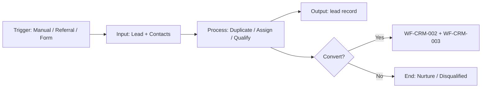
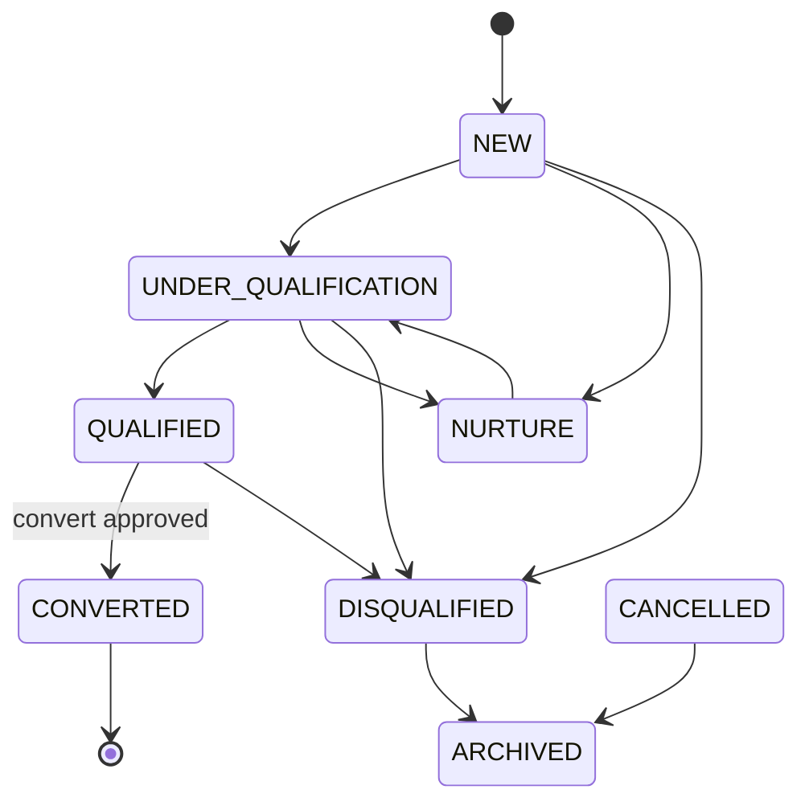
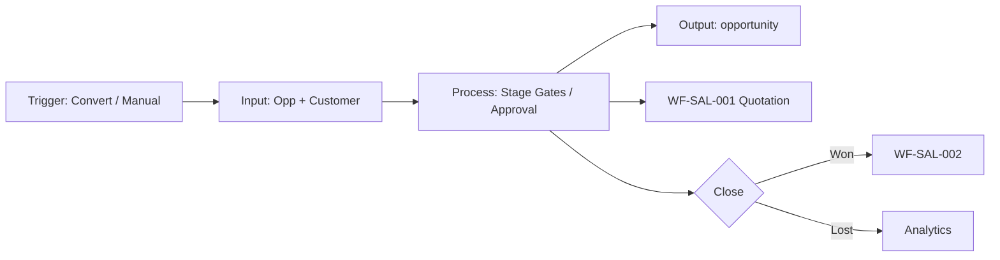
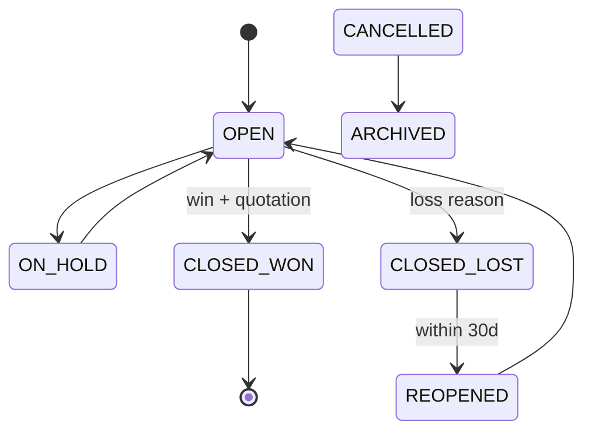
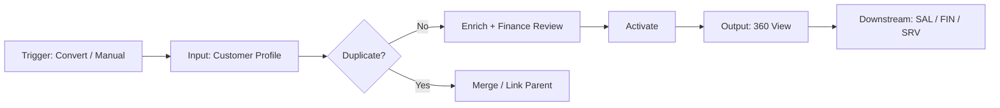
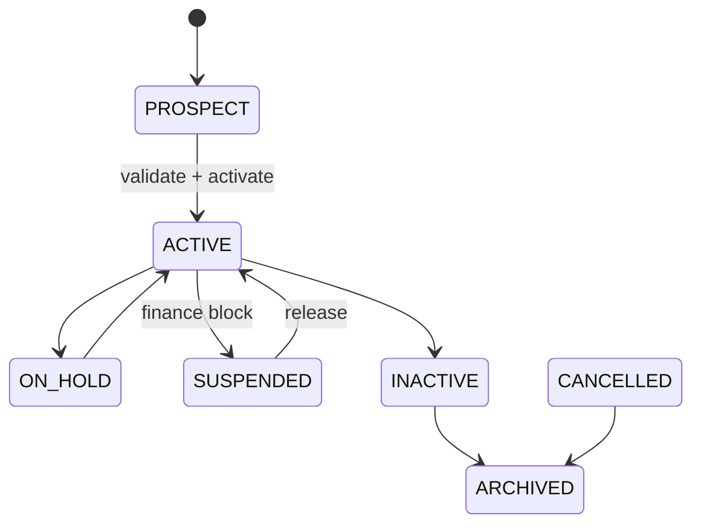
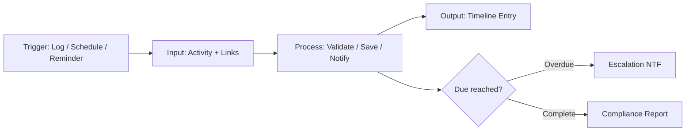
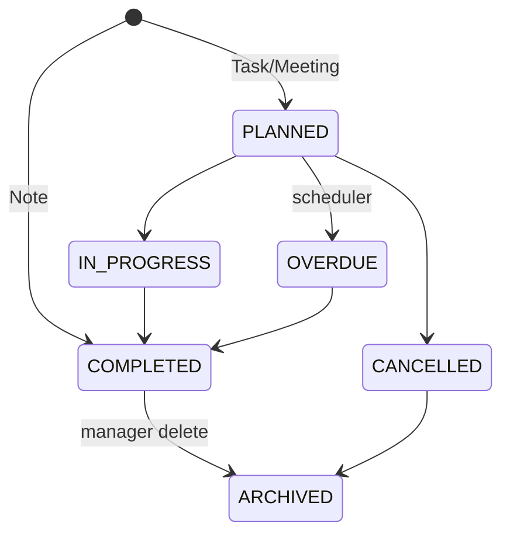

# E-LinkUp CRM — Enterprise Functional Specification Enrichments

**Document ID:** ELU-EFS-CRM  
**Document Name:** CRM Workflow EFS Enrichment Pack  
**Version:** 1.0  
**Classification:** Internal Confidential  
**Project:** E-LinkUp (By Euphoria Infotech)  
**Example Tenant:** Euphoria  
**Technology Stack:** Flutter (Web + Android) · Python FastAPI · PostgreSQL · JWT + Refresh Token · Docker · Linux VPS / Azure  
**Related Documents:** ELU-WF-001, ELU-BFS-CRM, ELU-DF-001, ELU-SAD-001  
**Insert Target:** `ELU-Workflow-Documentation.md` §4 CRM Workflows

This pack contains **EFS enrichment blocks only** — implementation-ready supplements to WF-CRM-001 through WF-CRM-004. Each block provides fifteen mandatory engineering sections with traceability to BFS, APIs, Flutter screens, database tables, and business rules **BR-CRM-001** through **BR-CRM-014**.

---

<!-- EFS:WF-CRM-001 -->

### WF-CRM-001 — Lead Capture & Qualification (EFS Enrichment)

#### 4.1.6 Workflow Traceability

| Attribute | Value |
|-----------|-------|
| **Workflow ID** | WF-CRM-001 |
| **Domain** | CRM |
| **Module** | CRM-001 Lead Management |
| **Sub Module** | CRM-001-001 Lead |
| **Feature** | CRM-001-001-001 Lead Capture |
| **Business Process** | Lead Capture & Qualification |
| **Priority** | Critical \| Phase 2 \| v2.0 |
| **Related Modules** | CRM-002 Opportunity, CRM-003 Customer, CRM-004 Activity, CPS-001 Workflow, CPS-002 Rule Engine, CPS-003 Notification, CPS-005 Audit |
| **Dependent Workflows** | WF-PF-002 (Org & RBAC Setup) |
| **Downstream Workflows** | WF-CRM-002 Opportunity Pipeline |
| **Related Documents** | ELU-BFS-CRM-001, ELU-API-CRM, ELU-UI-CRM, ELU-WF-CRM-001 |
| **Primary Table** | `lead` |
| **Related Tables** | `lead_contact`, `lead_source`, `lead_attachment`, `lead_assignment_history`, `lead_conversion_log`, `lead_note`, `activity`, `activity_link`, `audit_event` |
| **Related Flutter Screens** | UI-CRM-LD-001 … UI-CRM-LD-012 |
| **Related REST APIs** | `/api/v1/crm/leads/*`, `/api/v1/crm/lead-sources/*` |
| **Related Reports** | RPT-CRM-LD-001 … RPT-CRM-LD-007 |
| **Business Rules** | BR-CRM-001, BR-CRM-002, BR-CRM-003, BR-CRM-004, BR-CRM-005, BR-CRM-006, BR-CRM-007, BR-CRM-008, BR-CRM-009, BR-CRM-010, BR-CRM-011, BR-CRM-012, BR-CRM-013, BR-CRM-014 |
| **Notifications** | NTF-CRM-LD-001 … NTF-CRM-LD-009 |
| **Roles** | Sales Executive, Sales Manager, Pre-Sales, Finance User, Support Agent, Tenant Admin |
| **Permissions** | `lead.create`, `lead.read`, `lead.update`, `lead.update.all`, `lead.assign`, `lead.qualify`, `lead.disqualify`, `lead.convert`, `lead.approve`, `lead.export`, `lead.configure` |

#### 4.1.7 Input / Output Definition

| Element | Definition |
|---------|------------|
| **Input** | Lead intake payload: company/contact details, `lead_source_id`, estimated value, BANT fields, optional attachments; JWT with `tenant_id` (Euphoria) |
| **Trigger** | Manual create (Web/Android), referral intake, future web-to-lead (INT-001), duplicate-check pre-submit |
| **Processing** | Duplicate check (BR-CRM-001/002) → auto-assign owner → qualification state transitions → optional conversion approval (BR-CRM-012) → convert to Customer + Opportunity |
| **Output** | `lead` record with `lead_number` (EUP-LD-YYYY-NNNNN); linked `lead_contact`; `activity` entries via CRM-004; on convert: `customer`, `opportunity`, `lead_conversion_log` |
| **Next Workflow** | WF-CRM-002 Opportunity Pipeline |

#### 4.1.8 State Machine

| Category | States |
|----------|--------|
| **Initial** | NEW |
| **Intermediate** | UNDER_QUALIFICATION, NURTURE, ON_HOLD, QUALIFIED |
| **Terminal** | CONVERTED, DISQUALIFIED |
| **Cancelled** | CANCELLED |
| **Archived** | ARCHIVED |

| From State | To State | Actor | Guard (BR-*) | Valid |
|------------|----------|-------|--------------|-------|
| NEW | UNDER_QUALIFICATION | Sales Executive | BR-CRM-003 (source + owner) | ✓ |
| NEW | NURTURE | Sales Executive | BR-CRM-009 (follow-up date) | ✓ |
| NEW | DISQUALIFIED | Sales Manager | BR-CRM-005 (reason) | ✓ |
| UNDER_QUALIFICATION | QUALIFIED | Sales Manager | BANT complete | ✓ |
| QUALIFIED | CONVERTED | System | BR-CRM-006, BR-CRM-012, BR-CRM-014 | ✓ |
| QUALIFIED | UNDER_QUALIFICATION | Sales Manager | — | ✓ |
| CONVERTED | *any* | — | BR-CRM-007 immutable | ✗ |
| DISQUALIFIED | CONVERTED | — | — | ✗ |

**Rollback Rules:** Conversion approval rejection returns lead to QUALIFIED; assignment rollback writes `lead_assignment_history`; no rollback from CONVERTED.

#### 4.1.9 Ownership Matrix

| Role | Owner | Reviewer | Approver | Executor | Watcher | Notification Recipient | Escalation Owner |
|------|:-----:|:--------:|:--------:|:--------:|:-------:|:----------------------:|:----------------:|
| Sales Executive | ● | — | — | ● | — | On assign / qualify | Sales Manager |
| Sales Manager | — | ● | ● (convert threshold) | ● | ● | Team queue / conversion | Tenant Admin |
| Pre-Sales | — | ● (tech fit) | — | ○ | ● | On convert | Sales Manager |
| Finance User | — | ○ (value advisory) | — | — | ● | High-value convert | Sales Manager |
| Support Agent | — | — | — | — | ○ | — | — |
| Tenant Admin | — | — | ● (override) | ○ | ● | Config changes | Platform Admin |
| Rule Engine | — | — | — | ● | — | Duplicate / assign | — |
| Workflow Engine | — | — | ● | ● | — | Approval pending | Sales Manager |

#### 4.1.10 Exception Handling

| Exception Type | Condition | System Behaviour | User Action | Audit Event |
|----------------|-----------|------------------|-------------|-------------|
| **Rejected** | Conversion approval denied | Status remains QUALIFIED; notify requester | Revise value/BANT or re-request | `lead.conversion.rejected` |
| **Expired** | Nurture follow-up past due | NTF-CRM-LD-007; flag stale | Log activity or reschedule | `lead.followup.overdue` |
| **Cancelled** | Lead created in error | State CANCELLED; soft-delete eligible | Manager confirms cancel | `lead.status_changed` |
| **Duplicate** | Email/phone match (BR-CRM-001) | 409 Conflict; link to existing | Manager override with reason (BR-CRM-002) | `lead.duplicate_override` |
| **Rollback** | Failed mid-convert (txn error) | Full DB rollback; lead stays QUALIFIED | Retry convert | `lead.conversion.failed` |
| **Retry** | Transient API / Rule Engine timeout | Idempotent retry on convert | Auto-retry ×3 | `lead.conversion.retry` |
| **Re-open** | Disqualified → re-qualify | Not allowed in Phase 2; create new lead | — | — |
| **Escalation** | No activity N days (default 7) | NTF-CRM-LD-008 to owner + manager | Manager reassign | `lead.stale.escalated` |
| **Business Exception** | Convert without primary contact | 422 BR-CRM-014 | Add primary `lead_contact` | `lead.validation.failed` |
| **System Exception** | DB constraint / storage failure | 500; no partial write | Support ticket | `system.error` |

#### 4.1.11 Workflow Timing / SLA

| Metric | Target (Euphoria) | Max SLA | Escalation | Reminder | Auto-Close |
|--------|-------------------|---------|------------|----------|------------|
| Lead creation → first contact | 4 business hours | 1 business day | +4h → Manager | Daily digest | — |
| NEW → UNDER_QUALIFICATION | 2 business days | 5 business days | Day 5 → Manager | NTF-CRM-LD-008 | — |
| Qualification cycle | 10 business days | 21 business days | Day 14 → Manager | Weekly | — |
| Conversion approval | 8 business hours | 2 business days | +1 day → Tenant Admin | NTF-CRM-LD-004 | Reject after 5 days idle |
| Nurture follow-up | Per `next_follow_up_date` | +1 day overdue | +3 days → Manager | NTF-CRM-LD-007 | — |
| Duplicate check API | < 500 ms p95 | 2 s | — | — | — |
| Convert transaction | < 3 s p95 | 10 s | — | — | — |

**Tenant timezone:** Asia/Kolkata · **Business calendar:** Euphoria Mon–Sat (configurable).

#### 4.1.12 Database Impact

| Table | Type | Operation | Notes |
|-------|------|-----------|-------|
| `lead` | Transaction | INSERT, UPDATE | Primary workflow entity; `tenant_id` from JWT |
| `lead_contact` | Transaction | INSERT, UPDATE, DELETE | Cascade; ≥1 `is_primary` before convert |
| `lead_source` | Master | READ | Assignment routing |
| `lead_attachment` | Transaction | INSERT, DELETE | Metadata; binary in Document Engine |
| `lead_assignment_history` | Audit | INSERT | Every owner change |
| `lead_conversion_log` | Audit | INSERT | Snapshot on convert |
| `lead_note` | Transaction | INSERT | Allowed on converted (BR-CRM-007) |
| `activity` | Transaction | INSERT | Via WF-CRM-004 |
| `activity_link` | Link | INSERT | `entity_type=LEAD` |
| `customer` | Master | INSERT (on convert) | WF-CRM-003 handoff |
| `opportunity` | Transaction | INSERT (on convert) | WF-CRM-002 handoff |
| `audit_event` | Audit | INSERT | All mutations |

**Indexes used:** `(tenant_id, status)`, `(tenant_id, owner_id)`, `(tenant_id, primary_email)`, `(tenant_id, lead_number)`.

#### 4.1.13 API Mapping

Base: `/api/v1/crm` · Auth: Bearer JWT · Tenant: JWT claim (Euphoria)

| Method | Path | Purpose | Permission | BR Ref |
|--------|------|---------|------------|--------|
| POST | `/api/v1/crm/leads` | Create lead | `lead.create` | BR-CRM-001, 003, 004, 010, 017 |
| GET | `/api/v1/crm/leads` | List (paginated) | `lead.read` | BR-CRM-011 |
| GET | `/api/v1/crm/leads/{id}` | Get by ID | `lead.read` | — |
| PUT | `/api/v1/crm/leads/{id}` | Full update | `lead.update` | BR-CRM-007, 011 |
| PATCH | `/api/v1/crm/leads/{id}` | Partial update | `lead.update` | BR-CRM-008, 009 |
| PATCH | `/api/v1/crm/leads/{id}/status` | Status transition | `lead.update` | BR-CRM-005, 006 |
| DELETE | `/api/v1/crm/leads/{id}` | Soft delete | `lead.delete` | BR-CRM-016 |
| POST | `/api/v1/crm/leads/{id}/restore` | Restore | `lead.restore` | — |
| POST | `/api/v1/crm/leads/{id}/assign` | Assign owner | `lead.assign` | BR-CRM-010 |
| POST | `/api/v1/crm/leads/{id}/qualify` | Mark qualified | `lead.qualify` | BR-CRM-006 |
| POST | `/api/v1/crm/leads/{id}/disqualify` | Disqualify | `lead.disqualify` | BR-CRM-005 |
| POST | `/api/v1/crm/leads/{id}/convert` | Convert | `lead.convert` | BR-CRM-006, 012, 013, 014 |
| GET | `/api/v1/crm/leads/search` | Advanced search | `lead.read` | — |
| GET | `/api/v1/crm/leads/export` | Export CSV/XLSX | `lead.export` | BR-CRM-020 |
| POST | `/api/v1/crm/leads/duplicate-check` | Pre-create check | `lead.create` | BR-CRM-001, 002 |
| GET | `/api/v1/crm/leads/{id}/history` | Assignment + status history | `lead.read` | — |
| POST | `/api/v1/crm/leads/{id}/contacts` | Add contact | `lead.update` | BR-CRM-014 |
| POST | `/api/v1/crm/leads/{id}/attachments` | Upload attachment | `lead.update` | BR-CRM-019 |
| GET | `/api/v1/crm/lead-sources` | List sources | `lead.read` | — |

**Response codes:** 200, 201, 400, 401, 403, 404, 409 (duplicate), 422 (BR violation).

#### 4.1.14 Flutter Mapping

| Screen ID | Screen | Route | Workflow Step | Offline |
|-----------|--------|-------|---------------|---------|
| UI-CRM-LD-001 | Lead List | `/crm/leads` | Browse / filter queue | Read cache |
| UI-CRM-LD-002 | Lead Create | `/crm/leads/new` | Capture + duplicate check | Draft sync |
| UI-CRM-LD-003 | Lead Edit | `/crm/leads/{id}/edit` | Update BANT / fields | — |
| UI-CRM-LD-004 | Lead Detail | `/crm/leads/{id}` | View + timeline embed | Read cache |
| UI-CRM-LD-005 | Lead Search | `/crm/leads/search` | Manager advanced search | — |
| UI-CRM-LD-006 | Lead Qualification | `/crm/leads/{id}/qualify` | Qualify action | — |
| UI-CRM-LD-007 | Lead Convert Wizard | `/crm/leads/{id}/convert` | Convert + approval | — |
| UI-CRM-LD-008 | Disqualify Dialog | Modal | Disqualify with reason | — |
| UI-CRM-LD-009 | Lead Assignment | `/crm/leads/{id}/assign` | Reassign owner | — |
| UI-CRM-LD-010 | Lead History | `/crm/leads/{id}/history` | Audit trail view | — |
| UI-CRM-LD-011 | Lead Source Admin | `/crm/settings/lead-sources` | Configure sources | — |
| UI-CRM-LD-012 | Duplicate Review | Modal | BR-CRM-001/002 handling | — |
| UI-CRM-ACT-001 | Activity Timeline | Embedded | WF-CRM-004 integration | Partial |

#### 4.1.15 Notification Matrix

| Event ID | Trigger | Email | SMS | WhatsApp | Push | Internal | Recipients | Template Key |
|----------|---------|:-----:|:---:|:--------:|:----:|:--------:|------------|--------------|
| NTF-CRM-LD-001 | Lead assigned | — | — | — | ✓ | ✓ | Owner | `lead.assigned` |
| NTF-CRM-LD-002 | Lead qualified | — | — | — | ✓ | ✓ | Owner, Manager | `lead.qualified` |
| NTF-CRM-LD-003 | Lead disqualified | — | — | — | — | ✓ | Owner | `lead.disqualified` |
| NTF-CRM-LD-004 | Conversion approval pending | ✓ | — | — | ✓ | ✓ | Sales Manager | `lead.conversion.pending` |
| NTF-CRM-LD-005 | Conversion approved/rejected | — | — | — | ✓ | ✓ | Requester | `lead.conversion.approved` / `.rejected` |
| NTF-CRM-LD-006 | Lead converted | — | — | — | ✓ | ✓ | Owner, Manager, Pre-Sales | `lead.converted` |
| NTF-CRM-LD-007 | Nurture follow-up due | — | — | — | ✓ | ✓ | Owner | `lead.followup.due` |
| NTF-CRM-LD-008 | Lead stale (no activity) | ✓ | — | — | — | ✓ | Owner, Manager | `lead.stale` |
| NTF-CRM-LD-009 | Duplicate override | — | — | — | — | ✓ | Manager | `lead.duplicate.override` |

#### 4.1.16 Reporting Impact

| Report ID | Name | Type | Workflow Touchpoint | KPI |
|-----------|------|------|---------------------|-----|
| RPT-CRM-LD-001 | Lead Register | Operational | All states | Volume by status |
| RPT-CRM-LD-002 | Lead Funnel | Management | State transitions | Conversion funnel |
| RPT-CRM-LD-003 | Lead Source Performance | Management | Create + convert | Source ROI |
| RPT-CRM-LD-004 | Conversion Rate | KPI | QUALIFIED → CONVERTED | % convert |
| RPT-CRM-LD-005 | Disqualification Analysis | Management | DISQUALIFIED | Reason breakdown |
| RPT-CRM-LD-006 | Lead Aging | Operational | Days in status | SLA compliance |
| RPT-CRM-LD-007 | Executive Lead Summary | Executive Dashboard | Aggregated | Pipeline intake |

**Analytics events:** `lead.created`, `lead.qualified`, `lead.converted`, `lead.disqualified` → CPS-004 warehouse.

#### 4.1.17 Security

| Control | Implementation |
|---------|----------------|
| **RBAC** | All endpoints enforce `lead.*` permissions server-side; UI hides actions per role matrix |
| **Tenant isolation** | `tenant_id` from JWT only (BR-CRM-017); cross-tenant ID returns 404 |
| **Approval** | BR-CRM-012: Workflow Engine gate when `estimated_value` > ₹10,00,000 |
| **Ownership** | BR-CRM-011: Sales Executive edits own leads only unless `lead.update.all` |
| **Sensitive fields** | PII (email, phone) masked in export per BR-CRM-020 / role |
| **Immutable states** | BR-CRM-007: CONVERTED leads reject field updates (403) except notes |
| **Audit** | All mutations → `audit_event` via CPS-005 |
| **Attachments** | BR-CRM-019: disqualified/converted attachment add restricted to Manager |

#### 4.1.18 Audit Trail

| Event | Payload | Retention | Actor |
|-------|---------|-----------|-------|
| `lead.created` | Full snapshot, IP, `tenant_id` | 7 years | Creator |
| `lead.updated` | Field-level diff | 7 years | Editor |
| `lead.status_changed` | Old/new status, reason | 7 years | Actor |
| `lead.assigned` | Old/new `owner_id` | 7 years | Assigner |
| `lead.qualified` | Qualifier, timestamp | 7 years | Manager |
| `lead.disqualified` | Reason code, comment | 7 years | Manager |
| `lead.conversion_requested` | Workflow instance id | 7 years | Requester |
| `lead.converted` | `opportunity_id`, `customer_id` | 7 years | System |
| `lead.deleted` / `lead.restored` | Actor, timestamp | 7 years | Manager/Admin |
| `lead.exported` | Filter criteria, row count | 7 years | Exporter |
| `lead.duplicate_override` | Matched record id, reason | 7 years | Manager |

#### 4.1.19 Acceptance Criteria

| Category | ID | Criterion |
|----------|-----|-----------|
| **Functional** | AC-CRM-LD-001 | Valid lead creates in NEW with auto `lead_number` EUP-LD-YYYY-NNNNN |
| **Functional** | AC-CRM-LD-002 | Duplicate email returns 409 per BR-CRM-001 |
| **Functional** | AC-CRM-LD-003 | Convert creates Customer + Opportunity; lead = CONVERTED |
| **Functional** | AC-CRM-LD-004 | Value > threshold triggers approval before convert (BR-CRM-012) |
| **Functional** | AC-CRM-LD-005 | CONVERTED lead update rejected (403) except notes |
| **Technical** | AC-CRM-LD-006 | Tenant A JWT returns zero Tenant B leads |
| **Technical** | AC-CRM-LD-007 | Convert is atomic; failure rolls back all inserts |
| **Performance** | AC-CRM-LD-008 | Lead list p95 < 800 ms for 10k records (paginated) |
| **Performance** | AC-CRM-LD-009 | Duplicate check p95 < 500 ms |
| **Security** | AC-CRM-LD-010 | Export masks PII without `lead.export` + role grant |
| **Security** | AC-CRM-LD-011 | Sales Executive cannot qualify without `lead.qualify` |

#### 4.1.20 Future Enhancement (v2 / v3 / AI)

| Version | Enhancement | Engine |
|---------|-------------|--------|
| v2.1 | Bulk import wizard; web-to-lead public form (INT-001) | CPS-008 |
| v2.2 | Lead scoring rules; territory auto-assignment | CPS-002 |
| v3.0 | AI lead enrichment and predictive conversion score | CPS-007 |
| v3.0 | Multi-touch campaign attribution | INT-002 |
| v3.1 | Lead merge tool with survivorship rules | CPS-001 |

<!-- /EFS:WF-CRM-001 -->

---

<!-- EFS:WF-CRM-002 -->

### WF-CRM-002 — Opportunity Pipeline (EFS Enrichment)

#### 4.2.4 Workflow Traceability

| Attribute | Value |
|-----------|-------|
| **Workflow ID** | WF-CRM-002 |
| **Domain** | CRM |
| **Module** | CRM-002 Opportunity Management |
| **Sub Module** | CRM-002-001 Opportunity |
| **Feature** | CRM-002-001-001 Opportunity Pipeline |
| **Business Process** | Opportunity Pipeline Management |
| **Priority** | Critical \| Phase 2 \| v2.0 |
| **Related Modules** | CRM-001 Lead, CRM-003 Customer, CRM-004 Activity, SAL-001 Quotation, CPS-001 Workflow, CPS-002 Rule Engine |
| **Dependent Workflows** | WF-CRM-001 Lead Capture (conversion), WF-CRM-003 Customer Master |
| **Downstream Workflows** | WF-SAL-001 Quotation & Proposal, WF-SAL-002 Sales Order |
| **Related Documents** | ELU-BFS-CRM-002, ELU-API-CRM, ELU-UI-CRM |
| **Primary Table** | `opportunity` |
| **Related Tables** | `opportunity_stage`, `opportunity_stage_history`, `opportunity_contact`, `opportunity_competitor`, `opportunity_team_member`, `opportunity_note`, `customer`, `activity`, `activity_link` |
| **Related Flutter Screens** | UI-CRM-OPP-001 … UI-CRM-OPP-012 |
| **Related REST APIs** | `/api/v1/crm/opportunities/*`, `/api/v1/crm/opportunity-stages/*` |
| **Related Reports** | RPT-CRM-OPP-001 … RPT-CRM-OPP-007 |
| **Business Rules** | BR-CRM-010, BR-CRM-011, BR-CRM-012, BR-CRM-013, BR-CRM-014 (workflow); BR-CRM-021 … BR-CRM-040 (BFS extended) |
| **Notifications** | NTF-CRM-OPP-001 … NTF-CRM-OPP-010 |
| **Roles** | Sales Executive, Sales Manager, Pre-Sales, Finance User, Support Agent, Tenant Admin |
| **Permissions** | `opportunity.create`, `opportunity.read`, `opportunity.update`, `opportunity.stage`, `opportunity.approve`, `opportunity.close`, `opportunity.reopen`, `opportunity.forecast`, `opportunity.export` |

#### 4.2.5 Input / Output Definition

| Element | Definition |
|---------|------------|
| **Input** | Opportunity header: `customer_id`, `opportunity_value`, `expected_close_date`, `stage_id`, contacts, team; or auto-created from lead conversion |
| **Trigger** | Lead conversion (WF-CRM-001), manual create, stage advance, quotation link (SAL-001) |
| **Processing** | Stage gate validation → manager approval (BR-CRM-011/032) → probability calc (BR-CRM-013) → weighted value → close won/lost |
| **Output** | `opportunity` with `opportunity_number` (EUP-OPP-YYYY-NNNNN); `opportunity_stage_history`; linked quotation; forecast contribution |
| **Next Workflow** | WF-SAL-001 (Proposal stage) → WF-SAL-002 (Closed Won) |

#### 4.2.6 State Machine

**Lifecycle Status (`opportunity.status`):**

| Category | States |
|----------|--------|
| **Initial** | OPEN (stage: QUALIFICATION) |
| **Intermediate** | OPEN (all pipeline stages), ON_HOLD, REOPENED |
| **Terminal** | CLOSED_WON, CLOSED_LOST |
| **Cancelled** | CANCELLED |
| **Archived** | ARCHIVED |

**Pipeline Stages (`opportunity_stage`):** QUALIFICATION → TECHNICAL_EVAL → BUDGET_VALIDATION → PROPOSAL → QUOTATION_ISSUED → NEGOTIATION

| From | To | Guard | Valid |
|------|-----|-------|-------|
| QUALIFICATION | TECHNICAL_EVAL | `opportunity_value` > 0 (BR-CRM-022) | ✓ |
| BUDGET_VALIDATION | PROPOSAL | Manager approval if value > ₹15L (BR-CRM-011) | ✓ |
| PROPOSAL | QUOTATION_ISSUED | Quotation created (BR-CRM-035) | ✓ |
| NEGOTIATION | CLOSED_WON | Approved quotation linked (BR-CRM-027) | ✓ |
| Any OPEN | CLOSED_LOST | `loss_reason_id` + comment (BR-CRM-012) | ✓ |
| CLOSED_LOST | REOPENED | Within 30 days + justification (BR-CRM-014) | ✓ |
| CLOSED_WON | *edit commercial* | Locked | ✗ |

#### 4.2.7 Ownership Matrix

| Role | Owner | Reviewer | Approver | Executor | Watcher | Notification | Escalation |
|------|:-----:|:--------:|:--------:|:--------:|:-------:|:------------:|:----------:|
| Sales Executive | ● | — | — | ● | — | Stage change | Sales Manager |
| Sales Manager | — | ● | ● (gates, close) | ● | ● | Pipeline digest | Tenant Admin |
| Pre-Sales | ○ | ● (tech eval) | — | ● | ● | Team add | Sales Manager |
| Finance User | — | ● (budget) | — | — | ● | Closed Won | Finance Head |
| Support Agent | — | — | — | — | ○ | — | — |
| Workflow Engine | — | — | ● | ● | — | Approval pending | Sales Manager |

#### 4.2.8 Exception Handling

| Exception Type | Condition | System Behaviour | Audit |
|----------------|-----------|------------------|-------|
| **Rejected** | Stage gate approval denied | Revert to prior stage | `opportunity.approval.rejected` |
| **Expired** | `expected_close_date` passed | NTF-CRM-OPP-008 reminder | `opportunity.closedate.overdue` |
| **Cancelled** | Created in error | CANCELLED; soft-delete | `opportunity.cancelled` |
| **Duplicate** | Second opp from same lead | BR-CRM-014: warn / block | `opportunity.duplicate.warning` |
| **Rollback** | Failed stage transition | Revert `stage_id` + history | `opportunity.stage.rollback` |
| **Retry** | SAL integration timeout on stage sync | Retry ×3 idempotent | `opportunity.sync.retry` |
| **Re-open** | Closed Lost within 30 days | REOPENED → OPEN (BR-CRM-014) | `opportunity.reopened` |
| **Escalation** | Stalled > 14 days in stage | NTF-CRM-OPP-009 | `opportunity.stalled` |
| **Business Exception** | Close Won without quotation | 422 BR-CRM-027 | `opportunity.validation.failed` |
| **System Exception** | DB failure on close | 500; no partial close | `system.error` |

#### 4.2.9 Workflow Timing / SLA

| Metric | Target | Max SLA | Escalation | Reminder |
|--------|--------|---------|------------|----------|
| Lead convert → opp created | < 3 s | 10 s | — | NTF-CRM-OPP-001 |
| Stage advance (no approval) | Immediate | 2 s | — | NTF-CRM-OPP-002 |
| Manager gate approval | 8 business hours | 2 business days | +1 day → Admin | NTF-CRM-OPP-003 |
| Technical Evaluation | 5 business days | 10 business days | Day 10 → Manager | Weekly |
| Close date approaching | 7 days before | — | Day 0 → Owner | NTF-CRM-OPP-008 |
| Stalled in stage | — | 14 calendar days | NTF-CRM-OPP-009 | — |
| Pipeline kanban load | < 1.2 s p95 | 3 s | — | — |
| Forecast API | < 2 s p95 | 5 s | — | — |

#### 4.2.10 Database Impact

| Table | Type | Operation | Notes |
|-------|------|-----------|-------|
| `opportunity` | Transaction | INSERT, UPDATE | Core entity; `customer_id` FK required |
| `opportunity_stage` | Master | READ | Tenant-configurable pipeline |
| `opportunity_stage_history` | Audit | INSERT | Every stage transition |
| `opportunity_contact` | Link | INSERT, UPDATE | Links `customer_contact` |
| `opportunity_competitor` | Transaction | INSERT | Loss analysis |
| `opportunity_team_member` | Link | INSERT, DELETE | Pre-Sales contributors |
| `opportunity_note` | Transaction | INSERT | Internal notes |
| `opportunity_forecast_snapshot` | Transaction | INSERT | Period commits |
| `customer` | Master | READ | BR-CRM-010 parent |
| `activity` / `activity_link` | Transaction/Link | INSERT | WF-CRM-004 |
| `audit_event` | Audit | INSERT | All mutations |

#### 4.2.11 API Mapping

| Method | Path | Purpose | Permission | BR Ref |
|--------|------|---------|------------|--------|
| POST | `/api/v1/crm/opportunities` | Create | `opportunity.create` | BR-CRM-010, 021 |
| GET | `/api/v1/crm/opportunities` | List / filter | `opportunity.read` | BR-CRM-030 |
| GET | `/api/v1/crm/opportunities/{id}` | Get by ID | `opportunity.read` | — |
| PUT | `/api/v1/crm/opportunities/{id}` | Full update | `opportunity.update` | BR-CRM-022, 030 |
| PATCH | `/api/v1/crm/opportunities/{id}` | Partial update | `opportunity.update` | — |
| PATCH | `/api/v1/crm/opportunities/{id}/stage` | Advance stage | `opportunity.stage` | BR-CRM-011, 024, 032 |
| POST | `/api/v1/crm/opportunities/{id}/close-won` | Close won | `opportunity.close` | BR-CRM-027 |
| POST | `/api/v1/crm/opportunities/{id}/close-lost` | Close lost | `opportunity.close` | BR-CRM-012, 028, 034 |
| POST | `/api/v1/crm/opportunities/{id}/reopen` | Reopen | `opportunity.reopen` | BR-CRM-014, 037, 040 |
| POST | `/api/v1/crm/opportunities/{id}/assign` | Assign owner | `opportunity.assign` | — |
| POST | `/api/v1/crm/opportunities/{id}/hold` | Put on hold | `opportunity.update` | BR-CRM-033 |
| DELETE | `/api/v1/crm/opportunities/{id}` | Soft delete | `opportunity.delete` | — |
| GET | `/api/v1/crm/opportunities/pipeline` | Kanban view | `opportunity.read` | — |
| GET | `/api/v1/crm/opportunities/forecast` | Forecast summary | `opportunity.forecast` | BR-CRM-013, 026 |
| GET | `/api/v1/crm/opportunities/export` | Export | `opportunity.export` | — |
| GET | `/api/v1/crm/opportunities/{id}/history` | Stage history | `opportunity.read` | — |
| POST | `/api/v1/crm/opportunities/{id}/team-members` | Add contributor | `opportunity.assign` | BR-CRM-031 |
| GET | `/api/v1/crm/opportunity-stages` | List stages | `opportunity.read` | — |

#### 4.2.12 Flutter Mapping

| Screen ID | Screen | Route | Workflow Step |
|-----------|--------|-------|---------------|
| UI-CRM-OPP-001 | Opportunity List | `/crm/opportunities` | Browse pipeline |
| UI-CRM-OPP-002 | Pipeline Kanban | `/crm/opportunities/pipeline` | Drag stage advance |
| UI-CRM-OPP-003 | Opportunity Create | `/crm/opportunities/new` | Manual create |
| UI-CRM-OPP-004 | Opportunity Edit | `/crm/opportunities/{id}/edit` | Update fields |
| UI-CRM-OPP-005 | Opportunity Detail | `/crm/opportunities/{id}` | View + timeline |
| UI-CRM-OPP-006 | Stage Advance Dialog | Modal | Stage transition |
| UI-CRM-OPP-007 | Close Won/Lost Wizard | `/crm/opportunities/{id}/close` | Terminal states |
| UI-CRM-OPP-008 | Forecast View | `/crm/opportunities/forecast` | Weighted pipeline |
| UI-CRM-OPP-009 | Opportunity Team | `/crm/opportunities/{id}/team` | Pre-Sales assign |
| UI-CRM-OPP-010 | Stage History | `/crm/opportunities/{id}/history` | Audit trail |
| UI-CRM-OPP-011 | Stage Admin | `/crm/settings/opportunity-stages` | Tenant config |
| UI-CRM-OPP-012 | Competitor Tracker | Tab on detail | Loss tracking |

#### 4.2.13 Notification Matrix

| Event ID | Trigger | Email | Push | Internal | Recipients | Template |
|----------|---------|:-----:|:----:|:--------:|------------|----------|
| NTF-CRM-OPP-001 | Opp assigned | — | ✓ | ✓ | Owner | `opportunity.assigned` |
| NTF-CRM-OPP-002 | Stage changed | — | ✓ | ✓ | Owner, Manager, Team | `opportunity.stage.changed` |
| NTF-CRM-OPP-003 | Gate approval pending | ✓ | ✓ | ✓ | Sales Manager | `opportunity.approval.pending` |
| NTF-CRM-OPP-004 | Gate approved/rejected | — | — | ✓ | Owner | `opportunity.approval.result` |
| NTF-CRM-OPP-005 | Pre-Sales added | — | — | ✓ | Pre-Sales | `opportunity.team.added` |
| NTF-CRM-OPP-006 | Closed Won | ✓ | ✓ | ✓ | Owner, Manager, Finance | `opportunity.closed.won` |
| NTF-CRM-OPP-007 | Closed Lost | — | — | ✓ | Owner, Manager | `opportunity.closed.lost` |
| NTF-CRM-OPP-008 | Close date in 7 days | ✓ | ✓ | ✓ | Owner | `opportunity.closedate.reminder` |
| NTF-CRM-OPP-009 | Stalled > 14 days | ✓ | — | ✓ | Owner, Manager | `opportunity.stalled` |
| NTF-CRM-OPP-010 | Weekly pipeline digest | ✓ | — | — | Sales Manager | `opportunity.pipeline.weekly` |

#### 4.2.14 Reporting Impact

| Report ID | Name | Type | KPI |
|-----------|------|------|-----|
| RPT-CRM-OPP-001 | Pipeline by Stage | Operational | Count × stage |
| RPT-CRM-OPP-002 | Weighted Forecast | Management | Σ(value × probability) |
| RPT-CRM-OPP-003 | Win/Loss Analysis | Management | Win rate, loss reasons |
| RPT-CRM-OPP-004 | Stage Aging | Operational | Days in stage |
| RPT-CRM-OPP-005 | Opportunity Register | Operational | Full register |
| RPT-CRM-OPP-006 | Pre-Sales Utilisation | Management | Opps per Pre-Sales |
| RPT-CRM-OPP-007 | Executive Revenue Pipeline | Executive | FY forecast |

#### 4.2.15 Security

| Control | Implementation |
|---------|----------------|
| **RBAC** | `opportunity.*` enforced per role; Pre-Sales limited to tech fields (BR-CRM-031) |
| **Tenant isolation** | BR-CRM-038: JWT `tenant_id` only |
| **Stage gates** | BR-CRM-011/032: Workflow approval above ₹15,00,000 |
| **Close controls** | BR-CRM-027: Won requires quotation or manager exception |
| **Probability override** | BR-CRM-025: Manager permission required |
| **ON_HOLD** | BR-CRM-033: blocks quotation create |
| **Sensitive data** | Competitor and margin fields restricted to Manager/Finance |

#### 4.2.16 Audit Trail

| Event | Payload | Retention |
|-------|---------|-----------|
| `opportunity.created` | Snapshot, `source_lead_id` | 7 years |
| `opportunity.updated` | Field diff | 7 years |
| `opportunity.stage_changed` | Old/new stage, probability | 7 years |
| `opportunity.assigned` | Old/new owner | 7 years |
| `opportunity.approval_requested` / `completed` | Workflow instance | 7 years |
| `opportunity.closed_won` / `closed_lost` | Reason, value, quotation id | 7 years |
| `opportunity.reopened` | Justification (≥20 chars) | 7 years |
| `opportunity.team_changed` | Member add/remove | 7 years |
| `opportunity.forecast_committed` | Category change | 7 years |

#### 4.2.17 Acceptance Criteria

| Category | ID | Criterion |
|----------|-----|-----------|
| **Functional** | AC-CRM-OPP-001 | Lead convert creates opp in QUALIFICATION with customer link |
| **Functional** | AC-CRM-OPP-002 | Invalid stage skip returns 422 (BR-CRM-024) |
| **Functional** | AC-CRM-OPP-003 | Value > ₹15L to PROPOSAL triggers approval (BR-CRM-011) |
| **Functional** | AC-CRM-OPP-004 | Quotation link auto-advances to QUOTATION_ISSUED (BR-CRM-035) |
| **Functional** | AC-CRM-OPP-005 | Close Won blocked without quotation (BR-CRM-027) |
| **Technical** | AC-CRM-OPP-006 | Cross-tenant opp id returns 404 |
| **Technical** | AC-CRM-OPP-007 | Kanban drag updates stage when transition valid |
| **Performance** | AC-CRM-OPP-008 | Forecast API p95 < 2 s for 5k opps |
| **Security** | AC-CRM-OPP-009 | Pre-Sales editing commercial fields returns 403 |
| **Security** | AC-CRM-OPP-010 | Reopen without justification returns 422 (BR-CRM-014) |

#### 4.2.18 Future Enhancement (v2 / v3 / AI)

| Version | Enhancement | Engine |
|---------|-------------|--------|
| v2.1 | Split opportunities; parent/child hierarchy | — |
| v2.2 | Customisable pipeline per business unit | CPS-002 |
| v3.0 | AI win-probability and next-best-action | CPS-007 |
| v3.0 | Integrated CPQ from opportunity detail | SAL + CPS |
| v3.1 | Partner/co-sell opportunity sharing | INT-004 |

<!-- /EFS:WF-CRM-002 -->

---

<!-- EFS:WF-CRM-003 -->

### WF-CRM-003 — Customer Master Lifecycle (EFS Enrichment)

#### 4.3.1 Workflow Traceability

| Attribute | Value |
|-----------|-------|
| **Workflow ID** | WF-CRM-003 |
| **Domain** | CRM |
| **Module** | CRM-003 Customer Management |
| **Sub Module** | CRM-003-001 Customer Master |
| **Feature** | CRM-003-001-001 Customer Profile |
| **Business Process** | Customer Master Lifecycle |
| **Priority** | Critical \| Phase 2 \| v2.0 |
| **Related Modules** | CRM-001 Lead, CRM-002 Opportunity, CRM-004 Activity, SAL-001, FIN-001, SRV-001, PRJ-001 |
| **Dependent Workflows** | WF-CRM-001 (lead conversion creates Prospect) |
| **Downstream Workflows** | WF-SAL-001, WF-FIN-001, WF-SRV-001 |
| **Related Documents** | ELU-BFS-CRM-003, ELU-API-CRM, ELU-UI-CRM |
| **Primary Table** | `customer` |
| **Related Tables** | `customer_contact`, `customer_address`, `customer_segment`, `customer_industry`, `customer_credit_class`, `customer_note`, `customer_relationship`, `customer_tax_registration`, `customer_status_history`, `activity`, `activity_link` |
| **Related Flutter Screens** | UI-CRM-CUS-001 … UI-CRM-CUS-012 |
| **Related REST APIs** | `/api/v1/crm/customers/*`, `/api/v1/crm/customer-segments/*` |
| **Related Reports** | RPT-CRM-CUS-001 … RPT-CRM-CUS-007 |
| **Business Rules** | BR-CRM-010 (customer link on opp), BR-CRM-014 (single primary opp per lead); BR-CRM-041 … BR-CRM-060 (BFS extended) |
| **Notifications** | NTF-CRM-CUS-001 … NTF-CRM-CUS-009 |
| **Roles** | Sales Executive, Sales Manager, Pre-Sales, Finance User, Support Agent, Tenant Admin |
| **Permissions** | `customer.create`, `customer.read`, `customer.update`, `customer.activate`, `customer.suspend`, `customer.merge`, `customer.export`, `customer.configure` |

#### 4.3.2 Input / Output Definition

| Element | Definition |
|---------|------------|
| **Input** | Customer profile: legal/trade name, tax IDs (GSTIN), contacts, addresses, segment, credit class; or auto from lead conversion |
| **Trigger** | Lead conversion, manual create, opportunity link, finance review, suspension event |
| **Processing** | Duplicate check → enrich profile → finance validation → activate → 360 relationship maintenance → suspend/release |
| **Output** | `customer` with `customer_number` (EUP-CUS-YYYY-NNNNN); linked contacts/addresses; 360 aggregated view |
| **Next Workflow** | WF-CRM-002 (opportunities), WF-SAL-001 (quotations), WF-FIN-001 (invoicing) |

#### 4.3.3 State Machine

| Category | States |
|----------|--------|
| **Initial** | PROSPECT |
| **Intermediate** | ON_HOLD |
| **Terminal** | INACTIVE, ARCHIVED |
| **Active commercial** | ACTIVE |
| **Blocked** | SUSPENDED |
| **Cancelled** | CANCELLED |

| From | To | Actor | Guard | Valid |
|------|-----|-------|-------|-------|
| PROSPECT | ACTIVE | Sales Manager / Finance | BR-CRM-043, 044 (contact + address) | ✓ |
| PROSPECT | ACTIVE | System | Auto-promote at Proposal stage (BR-CRM-052) | ✓ |
| ACTIVE | SUSPENDED | Finance User | BR-CRM-055 (reason + comment) | ✓ |
| SUSPENDED | ACTIVE | Finance User | Release with audit | ✓ |
| ACTIVE | INACTIVE | Sales Manager | No open opps (BR-CRM-050) | ✓ |
| ARCHIVED | *new opp* | — | BR-CRM-059 blocked | ✗ |

#### 4.3.4 Ownership Matrix

| Role | Owner | Reviewer | Approver | Executor | Watcher | Notification | Escalation |
|------|:-----:|:--------:|:--------:|:--------:|:-------:|:------------:|:----------:|
| Sales Executive | ● (account) | — | — | ● | — | Created / assigned | Sales Manager |
| Sales Manager | — | ● | ● (activate, merge) | ● | ● | Activation | Tenant Admin |
| Pre-Sales | — | ○ | — | — | ● | — | Sales Manager |
| Finance User | — | ● | ● (suspend, credit) | ● | ● | Suspension | Finance Head |
| Support Agent | — | ○ | — | ○ | ● | Ticket link | Support Manager |
| Tenant Admin | — | — | ● (merge, config) | ○ | ● | Merge complete | — |

#### 4.3.5 Exception Handling

| Exception Type | Condition | System Behaviour | Audit |
|----------------|-----------|------------------|-------|
| **Rejected** | Activation without primary contact | 422 BR-CRM-043 | `customer.validation.failed` |
| **Expired** | Prospect inactive > 180 days | Warning to owner | `customer.prospect.stale` |
| **Cancelled** | Created in error | CANCELLED | `customer.cancelled` |
| **Duplicate** | Matching GSTIN / name (BR-CRM-045) | Block or warning + merge preview | `customer.duplicate.warning` |
| **Rollback** | Failed merge transaction | Revert both records | `customer.merge.rollback` |
| **Retry** | Tax validation service timeout | Retry ×3; flag manual review | `customer.tax.retry` |
| **Re-open** | INACTIVE → ACTIVE | Allowed with manager approval | `customer.reactivated` |
| **Escalation** | Suspended customer quotation attempt | Block + notify owner (BR-CRM-049) | `customer.suspension.blocked` |
| **Business Exception** | Child assigned as parent | 422 BR-CRM-048 | `customer.hierarchy.invalid` |
| **System Exception** | DB failure on activate | 500; no partial write | `system.error` |

#### 4.3.6 Workflow Timing / SLA

| Metric | Target | Max SLA | Escalation | Reminder |
|--------|--------|---------|------------|----------|
| Lead convert → customer created | < 3 s (part of convert txn) | 10 s | — | NTF-CRM-CUS-001 |
| Prospect → profile enriched | 3 business days | 10 business days | Day 10 → Manager | — |
| Finance tax validation | 2 business days | 5 business days | Day 5 → Finance Head | NTF-CRM-CUS-005 |
| Activation after validation | 1 business day | 3 business days | — | NTF-CRM-CUS-002 |
| Suspension notification | Immediate | 1 hour | — | NTF-CRM-CUS-006 |
| Customer 360 API | < 1.5 s p95 | 4 s | — | — |
| Duplicate check | < 500 ms p95 | 2 s | — | — |

#### 4.3.7 Database Impact

| Table | Type | Operation | Notes |
|-------|------|-----------|-------|
| `customer` | Master | INSERT, UPDATE | Core account; unique name per tenant |
| `customer_contact` | Transaction | INSERT, UPDATE, DELETE | ≥1 primary for Active |
| `customer_address` | Transaction | INSERT, UPDATE, DELETE | Registered/Billing required |
| `customer_segment` | Lookup | READ | Classification |
| `customer_industry` | Lookup | READ | — |
| `customer_credit_class` | Lookup | READ/UPDATE | Finance only |
| `customer_tax_registration` | Transaction | INSERT, UPDATE | GSTIN validation |
| `customer_relationship` | Link | INSERT | Parent/child (1 level) |
| `customer_status_history` | Audit | INSERT | Status transitions |
| `customer_note` | Transaction | INSERT | Internal notes |
| `opportunity` | Transaction | READ | 360 view; FK restrict |
| `activity` / `activity_link` | Transaction/Link | READ/INSERT | WF-CRM-004 |
| `audit_event` | Audit | INSERT | All mutations |

#### 4.3.8 API Mapping

| Method | Path | Purpose | Permission | BR Ref |
|--------|------|---------|------------|--------|
| POST | `/api/v1/crm/customers` | Create | `customer.create` | BR-CRM-041, 045, 046 |
| GET | `/api/v1/crm/customers` | List | `customer.read` | — |
| GET | `/api/v1/crm/customers/{id}` | Get | `customer.read` | — |
| GET | `/api/v1/crm/customers/{id}/360` | 360 view | `customer.read` | — |
| PUT | `/api/v1/crm/customers/{id}` | Full update | `customer.update` | BR-CRM-047, 051 |
| PATCH | `/api/v1/crm/customers/{id}` | Partial update | `customer.update` | — |
| PATCH | `/api/v1/crm/customers/{id}/status` | Change status | `customer.update` | BR-CRM-050, 055 |
| DELETE | `/api/v1/crm/customers/{id}` | Soft delete | `customer.delete` | BR-CRM-060 |
| POST | `/api/v1/crm/customers/{id}/restore` | Restore | `customer.restore` | — |
| POST | `/api/v1/crm/customers/{id}/suspend` | Suspend | `customer.suspend` | BR-CRM-047, 055 |
| POST | `/api/v1/crm/customers/{id}/activate` | Activate | `customer.activate` | BR-CRM-043, 044 |
| GET | `/api/v1/crm/customers/search` | Advanced search | `customer.read` | — |
| GET | `/api/v1/crm/customers/export` | Export | `customer.export` | BR-CRM-053 |
| POST | `/api/v1/crm/customers/duplicate-check` | Duplicate preview | `customer.create` | BR-CRM-045 |
| POST | `/api/v1/crm/customers/{id}/merge` | Merge duplicate | `customer.merge` | BR-CRM-058 |
| POST | `/api/v1/crm/customers/{id}/contacts` | Add contact | `customer.update` | BR-CRM-056 |
| POST | `/api/v1/crm/customers/{id}/addresses` | Add address | `customer.update` | BR-CRM-057 |
| GET | `/api/v1/crm/customers/{id}/opportunities` | Linked opps | `customer.read` | — |
| GET | `/api/v1/crm/customers/{id}/activities` | Timeline | `customer.read` | — |

#### 4.3.9 Flutter Mapping

| Screen ID | Screen | Route | Workflow Step |
|-----------|--------|-------|---------------|
| UI-CRM-CUS-001 | Customer List | `/crm/customers` | Browse accounts |
| UI-CRM-CUS-002 | Customer Create | `/crm/customers/new` | Manual create |
| UI-CRM-CUS-003 | Customer Edit | `/crm/customers/{id}/edit` | Enrich profile |
| UI-CRM-CUS-004 | Customer Detail | `/crm/customers/{id}` | View + timeline |
| UI-CRM-CUS-005 | Customer 360 | `/crm/customers/{id}/360` | Aggregated view |
| UI-CRM-CUS-006 | Contact Manager | `/crm/customers/{id}/contacts` | Manage contacts |
| UI-CRM-CUS-007 | Address Manager | `/crm/customers/{id}/addresses` | Manage addresses |
| UI-CRM-CUS-008 | Customer Search | `/crm/customers/search` | Advanced search |
| UI-CRM-CUS-009 | Suspend Dialog | Modal | Finance suspend |
| UI-CRM-CUS-010 | Merge Preview | `/crm/customers/merge` | Duplicate merge |
| UI-CRM-CUS-011 | Segment Admin | `/crm/settings/customer-segments` | Config |
| UI-CRM-CUS-012 | Customer History | `/crm/customers/{id}/history` | Status audit |

#### 4.3.10 Notification Matrix

| Event ID | Trigger | Email | Push | Internal | Recipients | Template |
|----------|---------|:-----:|:----:|:--------:|------------|----------|
| NTF-CRM-CUS-001 | New customer created | — | — | ✓ | Owner, Manager | `customer.created` |
| NTF-CRM-CUS-002 | Customer activated | — | — | ✓ | Owner, Finance | `customer.activated` |
| NTF-CRM-CUS-003 | Primary contact changed | — | — | ✓ | Owner | `customer.contact.changed` |
| NTF-CRM-CUS-004 | Duplicate detected | — | — | ✓ | Creator, Manager | `customer.duplicate.warning` |
| NTF-CRM-CUS-005 | Tax ID validation failed | — | — | ✓ | Creator, Finance | `customer.tax.invalid` |
| NTF-CRM-CUS-006 | Customer suspended | ✓ | — | ✓ | Owner, Manager, Sales | `customer.suspended` |
| NTF-CRM-CUS-007 | Suspension released | — | — | ✓ | Owner, Finance | `customer.reactivated` |
| NTF-CRM-CUS-008 | Account owner assigned | — | ✓ | ✓ | New owner | `customer.assigned` |
| NTF-CRM-CUS-009 | Merge completed | — | — | ✓ | Manager, Owner | `customer.merged` |

#### 4.3.11 Reporting Impact

| Report ID | Name | Type | KPI |
|-----------|------|------|-----|
| RPT-CRM-CUS-001 | Customer Register | Operational | Accounts by status |
| RPT-CRM-CUS-002 | New Customers by Period | Management | Acquisition rate |
| RPT-CRM-CUS-003 | Customer by Segment | Management | Segment distribution |
| RPT-CRM-CUS-004 | Account Owner Workload | Operational | Customers per owner |
| RPT-CRM-CUS-005 | Suspended Accounts | Operational | Credit risk |
| RPT-CRM-CUS-006 | Customer 360 Summary | Executive | Revenue per account |
| RPT-CRM-CUS-007 | Duplicate Candidate List | Operational | Data quality |

#### 4.3.12 Security

| Control | Implementation |
|---------|----------------|
| **RBAC** | Finance-only for `credit_classification`, suspend (BR-CRM-047) |
| **Tenant isolation** | BR-CRM-054: JWT `tenant_id` enforced |
| **PII masking** | BR-CRM-053: export masks PII without `customer.export.full` |
| **Suspension gate** | BR-CRM-049: blocks new SAL transactions |
| **Hierarchy** | BR-CRM-048: 1-level parent/child only |
| **Immutability** | BR-CRM-051: `customer_id` on opp locked after quotation |
| **Merge** | BR-CRM-058: requires `customer.merge` + manager approval |
| **Support read** | Support Agent read-only on customer for ticket context |

#### 4.3.13 Audit Trail

| Event | Payload | Retention |
|-------|---------|-----------|
| `customer.created` | Snapshot, source (lead/manual) | 7 years |
| `customer.updated` | Field diff | 7 years |
| `customer.status_changed` | Old/new status, reason | 7 years |
| `customer.suspended` / `reactivated` | Finance user, reason code | 7 years |
| `customer.contact_added` / `updated` / `removed` | Contact id | 7 years |
| `customer.address_added` / `updated` / `removed` | Address id | 7 years |
| `customer.assigned` | Old/new `account_owner_id` | 7 years |
| `customer.merged` | Source/target ids | 7 years |
| `customer.exported` | Criteria, row count | 7 years |

#### 4.3.14 Acceptance Criteria

| Category | ID | Criterion |
|----------|-----|-----------|
| **Functional** | AC-CRM-CUS-001 | Lead convert creates Prospect with contacts copied |
| **Functional** | AC-CRM-CUS-002 | Duplicate GSTIN blocks create (BR-CRM-045) |
| **Functional** | AC-CRM-CUS-003 | Activate without primary contact fails (BR-CRM-043) |
| **Functional** | AC-CRM-CUS-004 | Suspended customer blocks quotation (BR-CRM-049) |
| **Functional** | AC-CRM-CUS-005 | 360 API returns linked opps, activities, counts |
| **Technical** | AC-CRM-CUS-006 | Cross-tenant customer id returns 404 |
| **Technical** | AC-CRM-CUS-007 | Auto-promote at Proposal stage when configured (BR-CRM-052) |
| **Performance** | AC-CRM-CUS-008 | Customer 360 p95 < 1.5 s |
| **Security** | AC-CRM-CUS-009 | Sales Executive editing credit class returns 403 |
| **Security** | AC-CRM-CUS-010 | Export masks PII without full export permission |

#### 4.3.15 Future Enhancement (v2 / v3 / AI)

| Version | Enhancement | Engine |
|---------|-------------|--------|
| v2.1 | Customer merge wizard with field survivorship | CPS-001 |
| v2.2 | DUNS / external enrichment (INT-003) | CPS-008 |
| v3.0 | Customer self-service portal | PF + CRM |
| v3.0 | Multi-level account hierarchy | — |
| v3.1 | KYC document vault integration | CPS-006 |

<!-- /EFS:WF-CRM-003 -->

---

<!-- EFS:WF-CRM-004 -->

### WF-CRM-004 — Activity Timeline (EFS Enrichment)

#### 4.4.1 Workflow Traceability

| Attribute | Value |
|-----------|-------|
| **Workflow ID** | WF-CRM-004 |
| **Domain** | CRM |
| **Module** | CRM-004 Activity Management |
| **Sub Module** | CRM-004-001 Activities |
| **Feature** | CRM-004-001-001 Activity Timeline |
| **Business Process** | Unified Activity Timeline |
| **Priority** | High \| Phase 2 \| v2.0 |
| **Related Modules** | CRM-001 Lead, CRM-002 Opportunity, CRM-003 Customer, CPS-003 Notification, CPS-005 Audit |
| **Dependent Workflows** | WF-PF-002 (users), WF-CRM-001/002/003 (link targets) |
| **Downstream Workflows** | SAL, PRJ, SRV modules reuse `activity_link` pattern |
| **Related Documents** | ELU-BFS-CRM-004, ELU-API-CRM, ELU-UI-CRM |
| **Primary Table** | `activity` |
| **Related Tables** | `activity_link`, `activity_type`, `activity_outcome`, `activity_attendee`, `activity_reminder`, `activity_attachment`, `lead`, `opportunity`, `customer` |
| **Related Flutter Screens** | UI-CRM-ACT-001 … UI-CRM-ACT-013 (embedded + standalone) |
| **Related REST APIs** | `/api/v1/crm/activities/*`, `/api/v1/crm/activity-types/*`, entity shortcuts |
| **Related Reports** | RPT-CRM-ACT-001 … RPT-CRM-ACT-007 |
| **Business Rules** | BR-CRM-005 (communications logged); BR-CRM-061 … BR-CRM-080 (BFS activity rules) |
| **Notifications** | NTF-CRM-ACT-001 … NTF-CRM-ACT-009 |
| **Roles** | Sales Executive, Sales Manager, Pre-Sales, Finance User, Support Agent, Tenant Admin |
| **Permissions** | `activity.create`, `activity.read`, `activity.update`, `activity.update.all`, `activity.delete`, `activity.assign`, `activity.complete`, `activity.export`, `activity.configure` |

#### 4.4.2 Input / Output Definition

| Element | Definition |
|---------|------------|
| **Input** | Activity payload: type (Call/Email/Meeting/Task/Note), subject, description, `activity_at`, `due_date`, assignee, outcome, entity links |
| **Trigger** | User logs activity on Lead/Opp/Customer detail; scheduler fires reminders; manager bulk-complete |
| **Processing** | Validate type rules → create `activity` + `activity_link` → schedule reminders → complete/cancel → compliance roll-up |
| **Output** | `activity` record; polymorphic `activity_link`; timeline API response; reminder jobs |
| **Next Workflow** | Feeds qualification (WF-CRM-001), pipeline discipline (WF-CRM-002), 360 view (WF-CRM-003) |

#### 4.4.3 State Machine

| Category | States |
|----------|--------|
| **Initial** | PLANNED (Task/Meeting), COMPLETED (Note on create) |
| **Intermediate** | IN_PROGRESS, OVERDUE (system flag) |
| **Terminal** | COMPLETED |
| **Cancelled** | CANCELLED |
| **Archived** | ARCHIVED (soft-deleted) |

| From | To | Actor | Guard | Valid |
|------|-----|-------|-------|-------|
| PLANNED | COMPLETED | Assignee | Outcome required for CALL/MEETING/TASK (BR-CRM-063) | ✓ |
| PLANNED | OVERDUE | System | `due_date` < today (BR-CRM-071) | ✓ |
| OVERDUE | COMPLETED | Assignee | Outcome required | ✓ |
| COMPLETED | *delete* | Sales Executive | — | ✗ |
| COMPLETED | ARCHIVED | Sales Manager | Reason required (BR-CRM-068) | ✓ |
| PLANNED | CANCELLED | Creator/Manager | Cancel reason for TASK/MEETING (BR-CRM-079) | ✓ |

#### 4.4.4 Ownership Matrix

| Role | Owner | Reviewer | Approver | Executor | Watcher | Notification | Escalation |
|------|:-----:|:--------:|:--------:|:--------:|:-------:|:------------:|:----------:|
| Sales Executive | ● | — | — | ● | — | Assigned / overdue | Sales Manager |
| Sales Manager | — | ● | ● (bulk complete, delete) | ● | ● | Team compliance | Tenant Admin |
| Pre-Sales | ● (assigned) | — | — | ● | — | Meeting scheduled | Sales Manager |
| Finance User | — | ○ | — | — | ● (read) | — | — |
| Support Agent | ● (ticket-linked) | — | — | ● | — | Task assigned | Support Manager |
| Scheduler | — | — | — | ● | — | Reminder / overdue | — |

#### 4.4.5 Exception Handling

| Exception Type | Condition | System Behaviour | Audit |
|----------------|-----------|------------------|-------|
| **Rejected** | Complete without outcome (CALL) | 422 BR-CRM-063 | `activity.validation.failed` |
| **Expired** | Reminder job missed | Catch-up on next scheduler run | `activity.reminder.missed` |
| **Cancelled** | User cancels meeting/task | CANCELLED; reminders cancelled | `activity.cancelled` |
| **Duplicate** | Offline sync duplicate (Android) | Idempotent key dedup | `activity.sync.deduped` |
| **Rollback** | Failed multi-link insert | Rollback activity + links | `activity.rollback` |
| **Retry** | Notification delivery failure | Retry ×3 via CPS-003 | `activity.notification.retry` |
| **Re-open** | Completed → edit | Blocked; create new activity | — |
| **Escalation** | Overdue > 3 days | NTF-CRM-ACT-009 to Manager | `activity.escalation` |
| **Business Exception** | Link to other-tenant entity | 404 BR-CRM-069 | `activity.security.violation` |
| **System Exception** | Scheduler failure | Alert ops; manual catch-up | `system.error` |

#### 4.4.6 Workflow Timing / SLA

| Metric | Target | Max SLA | Escalation | Reminder |
|--------|--------|---------|------------|----------|
| Activity create → timeline visible | < 2 s | 5 s | — | — |
| Reminder delivery | 09:00 tenant TZ, 1 day before due (BR-CRM-072) | ±15 min | — | NTF-CRM-ACT-003 |
| Overdue detection | Daily 00:05 Asia/Kolkata | — | Day 3 → Manager | NTF-CRM-ACT-004 |
| Manager compliance digest | Weekly Monday 08:00 | — | — | NTF-CRM-ACT-008 |
| Daily user digest | Daily 07:30 | — | — | NTF-CRM-ACT-007 |
| Timeline API (100/page) | < 600 ms p95 | 2 s | — | — |
| Bulk complete (50 items) | < 5 s | 15 s | — | — |

#### 4.4.7 Database Impact

| Table | Type | Operation | Notes |
|-------|------|-----------|-------|
| `activity` | Transaction | INSERT, UPDATE | Core record; `tenant_id` from JWT |
| `activity_link` | Link | INSERT, DELETE | Polymorphic: LEAD, OPPORTUNITY, CUSTOMER |
| `activity_type` | Lookup | READ | Call, Email, Meeting, Task, Note |
| `activity_outcome` | Lookup | READ | Per-type outcomes |
| `activity_attendee` | Transaction | INSERT | Meeting attendees |
| `activity_reminder` | Transaction | INSERT, UPDATE | Scheduled reminders |
| `activity_attachment` | Link | INSERT | Optional files |
| `lead` / `opportunity` / `customer` | Master/Txn | READ | Link target validation |
| `audit_event` | Audit | INSERT | All mutations |

**Index:** `(tenant_id, entity_type, entity_id, activity_id)` on `activity_link`.

#### 4.4.8 API Mapping

| Method | Path | Purpose | Permission | BR Ref |
|--------|------|---------|------------|--------|
| POST | `/api/v1/crm/activities` | Create | `activity.create` | BR-CRM-061, 062, 064, 073 |
| GET | `/api/v1/crm/activities` | Global list | `activity.read` | — |
| GET | `/api/v1/crm/activities/{id}` | Get by ID | `activity.read` | — |
| PUT | `/api/v1/crm/activities/{id}` | Full update | `activity.update` | BR-CRM-067 |
| PATCH | `/api/v1/crm/activities/{id}` | Partial update | `activity.update` | — |
| PATCH | `/api/v1/crm/activities/{id}/complete` | Complete | `activity.complete` | BR-CRM-063, 074 |
| PATCH | `/api/v1/crm/activities/{id}/cancel` | Cancel | `activity.update` | BR-CRM-079 |
| DELETE | `/api/v1/crm/activities/{id}` | Soft delete | `activity.delete` | BR-CRM-068 |
| POST | `/api/v1/crm/activities/{id}/assign` | Reassign | `activity.assign` | BR-CRM-066 |
| POST | `/api/v1/crm/activities/{id}/links` | Add entity link | `activity.update` | BR-CRM-069, 070 |
| GET | `/api/v1/crm/activities/timeline` | Timeline by entity | `activity.read` | BR-CRM-076 |
| GET | `/api/v1/crm/leads/{id}/activities` | Lead shortcut | `activity.read` | — |
| GET | `/api/v1/crm/opportunities/{id}/activities` | Opp shortcut | `activity.read` | — |
| GET | `/api/v1/crm/customers/{id}/activities` | Customer shortcut | `activity.read` | — |
| GET | `/api/v1/crm/activities/upcoming` | User upcoming | `activity.read` | — |
| GET | `/api/v1/crm/activities/overdue` | Overdue tasks | `activity.read` | — |
| GET | `/api/v1/crm/activities/search` | Search | `activity.read` | — |
| GET | `/api/v1/crm/activities/export` | Export | `activity.export` | BR-CRM-077 |
| POST | `/api/v1/crm/activities/bulk-complete` | Manager bulk | `activity.update.all` | — |
| GET | `/api/v1/crm/activity-types` | List types | `activity.read` | — |
| GET | `/api/v1/crm/activity-outcomes` | List outcomes | `activity.read` | — |

#### 4.4.9 Flutter Mapping

| Screen ID | Screen | Route | Workflow Step | Offline |
|-----------|--------|-------|---------------|---------|
| UI-CRM-ACT-001 | Timeline Widget | Embedded on detail | View timeline | Read cache |
| UI-CRM-ACT-002 | Log Activity Dialog | Modal | Quick log call/note | — |
| UI-CRM-ACT-003 | Schedule Meeting | `/crm/activities/meeting/new` | Plan meeting | — |
| UI-CRM-ACT-004 | Create Task | `/crm/activities/task/new` | Plan task | Draft sync |
| UI-CRM-ACT-005 | Activity Detail | `/crm/activities/{id}` | View single | — |
| UI-CRM-ACT-006 | Activity Edit | `/crm/activities/{id}/edit` | Edit planned | — |
| UI-CRM-ACT-007 | My Activities | `/crm/activities/my` | Personal queue | Read cache |
| UI-CRM-ACT-008 | Team Activities | `/crm/activities/team` | Manager view | — |
| UI-CRM-ACT-009 | Overdue Activities | `/crm/activities/overdue` | Escalation queue | — |
| UI-CRM-ACT-010 | Upcoming List | `/crm/activities/upcoming` | Calendar list | — |
| UI-CRM-ACT-011 | Activity Search | `/crm/activities/search` | Advanced search | — |
| UI-CRM-ACT-012 | Type Admin | `/crm/settings/activity-types` | Config | — |
| UI-CRM-ACT-013 | Complete Dialog | Modal | Mark complete | — |

**Embed points:** UI-CRM-LD-004, UI-CRM-OPP-005, UI-CRM-CUS-004/005.

#### 4.4.10 Notification Matrix

| Event ID | Trigger | Email | Push | Internal | Recipients | Template |
|----------|---------|:-----:|:----:|:--------:|------------|----------|
| NTF-CRM-ACT-001 | Activity assigned | — | ✓ | ✓ | Assignee | `activity.assigned` |
| NTF-CRM-ACT-002 | Activity completed | — | — | ✓ | Record owner | `activity.completed` |
| NTF-CRM-ACT-003 | Upcoming reminder | ✓ | ✓ | ✓ | Assignee | `activity.reminder.upcoming` |
| NTF-CRM-ACT-004 | Task overdue | ✓ | ✓ | ✓ | Assignee, Manager | `activity.overdue` |
| NTF-CRM-ACT-005 | Meeting scheduled | ✓ | — | ✓ | Attendees | `activity.meeting.scheduled` |
| NTF-CRM-ACT-006 | Activity cancelled | — | — | ✓ | Assignee, Creator | `activity.cancelled` |
| NTF-CRM-ACT-007 | Daily digest | ✓ | — | — | Sales Executive | `activity.daily.digest` |
| NTF-CRM-ACT-008 | Weekly compliance | ✓ | — | — | Sales Manager | `activity.compliance.weekly` |
| NTF-CRM-ACT-009 | Escalation > 3 days | ✓ | — | ✓ | Sales Manager | `activity.escalation` |

#### 4.4.11 Reporting Impact

| Report ID | Name | Type | KPI |
|-----------|------|------|-----|
| RPT-CRM-ACT-001 | Activity Log | Operational | Volume by type |
| RPT-CRM-ACT-002 | Activity by Owner | Management | Owner × type count |
| RPT-CRM-ACT-003 | Overdue Task Report | Operational | Overdue count |
| RPT-CRM-ACT-004 | Meeting Summary | Management | Outcomes × quarter |
| RPT-CRM-ACT-005 | Call Outcome Analysis | Management | Positive/negative ratio |
| RPT-CRM-ACT-006 | Activity Compliance Score | KPI | % on-time completion |
| RPT-CRM-ACT-007 | Entity Engagement Depth | Executive | Activities per lead/opp |

#### 4.4.12 Security

| Control | Implementation |
|---------|----------------|
| **RBAC** | BR-CRM-067: edit own/assigned only unless `activity.update.all` |
| **Tenant isolation** | BR-CRM-075: JWT `tenant_id`; linked entity same tenant (BR-CRM-069) |
| **Delete** | BR-CRM-068: completed activities — Manager only with reason |
| **Finance read** | Read-only on customer-linked activities; no create |
| **Support** | Create/read on ticket-linked activities (SRV integration) |
| **PII export** | BR-CRM-077: description masked for non-manager export |
| **Pre-Sales scope** | Activities on assigned opportunities only |
| **Max links** | BR-CRM-070: 10 entity links per activity (warning) |

#### 4.4.13 Audit Trail

| Event | Payload | Retention |
|-------|---------|-----------|
| `activity.created` | Snapshot, linked entities | 7 years |
| `activity.updated` | Field diff | 7 years |
| `activity.completed` | `outcome_id`, `completed_at` | 7 years |
| `activity.cancelled` | `cancel_reason` | 7 years |
| `activity.assigned` | Old/new assignee | 7 years |
| `activity.deleted` | Actor, reason (manager) | 7 years |
| `activity.link_added` / `removed` | `entity_type`, `entity_id` | 7 years |
| `activity.reminder_sent` | Channel, timestamp | 3 years |
| `activity.exported` | Filter criteria | 7 years |

#### 4.4.14 Acceptance Criteria

| Category | ID | Criterion |
|----------|-----|-----------|
| **Functional** | AC-CRM-ACT-001 | Log call with outcome appears on timeline < 2 s |
| **Functional** | AC-CRM-ACT-002 | Overdue task triggers NTF-CRM-ACT-004 via scheduler |
| **Functional** | AC-CRM-ACT-003 | Complete CALL without outcome returns 422 (BR-CRM-063) |
| **Functional** | AC-CRM-ACT-004 | Customer timeline returns linked + child opp activities |
| **Functional** | AC-CRM-ACT-005 | Pre-Sales on unassigned opp cannot create (403) |
| **Technical** | AC-CRM-ACT-006 | Reminder fires at configured tenant timezone |
| **Technical** | AC-CRM-ACT-007 | Android offline task syncs without duplicate |
| **Performance** | AC-CRM-ACT-008 | Timeline API p95 < 600 ms (100 items/page) |
| **Security** | AC-CRM-ACT-009 | Executive cannot delete completed; Manager can with reason |
| **Security** | AC-CRM-ACT-010 | Cross-tenant entity link returns 404 |

#### 4.4.15 Future Enhancement (v2 / v3 / AI)

| Version | Enhancement | Engine |
|---------|-------------|--------|
| v2.1 | Email sync via INT-002; auto-log inbound | CPS-008 |
| v2.2 | Google / Outlook calendar bi-directional sync | INT-004 |
| v3.0 | AI suggested next activity (CPS-007) | CPS-007 |
| v3.0 | Voice note transcription on Android | CPS-007 |
| v3.1 | Customer portal: contact logs support activities | SRV + CRM |

<!-- /EFS:WF-CRM-004 -->

---

## Document Control

| Field | Value |
|-------|-------|
| Document ID | ELU-EFS-CRM |
| Version | 1.0 |
| Status | Approved for Development (Phase 2) |
| Author | Senior BA / Enterprise Solution Architect |
| Insert Into | ELU-Workflow-Documentation.md §4.1.6–4.4.15 |
| Open Questions | None |

### Revision History

| Version | Date | Author | Changes |
|---------|------|--------|---------|
| 1.0 | 2026-07-31 | PO / BA / SA | Initial CRM EFS enrichment pack (WF-CRM-001 … 004) |

---

*© Euphoria Infotech (I) Limited — E-LinkUp CRM Enterprise Functional Specification Enrichments*
