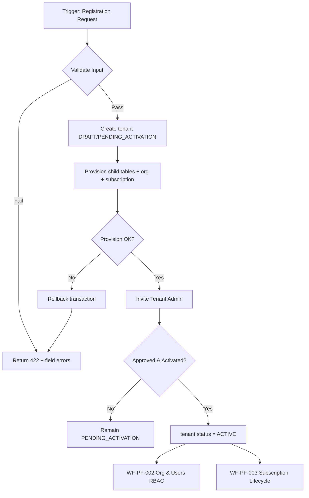
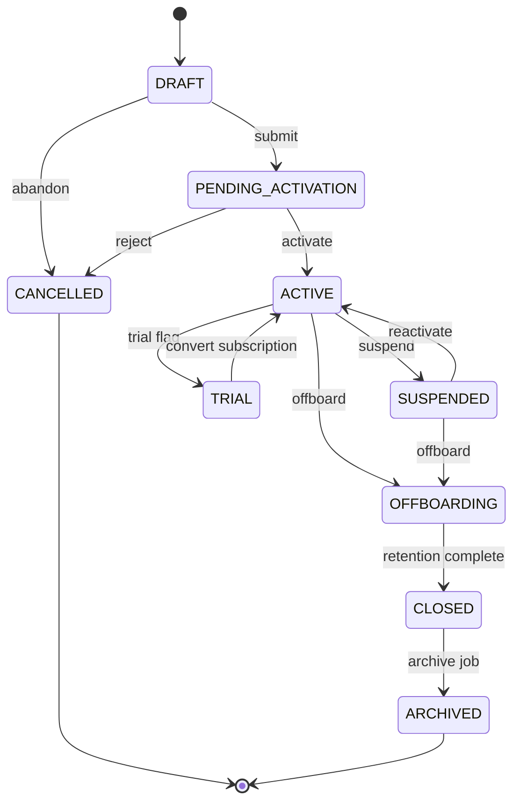
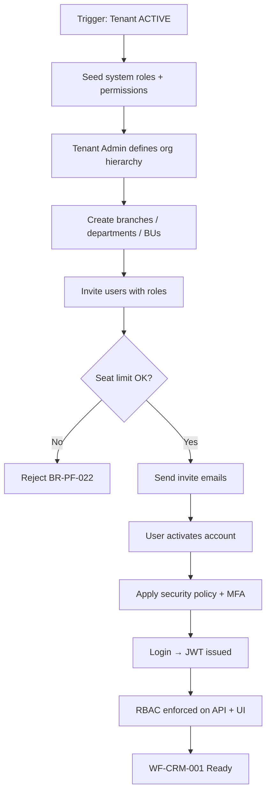
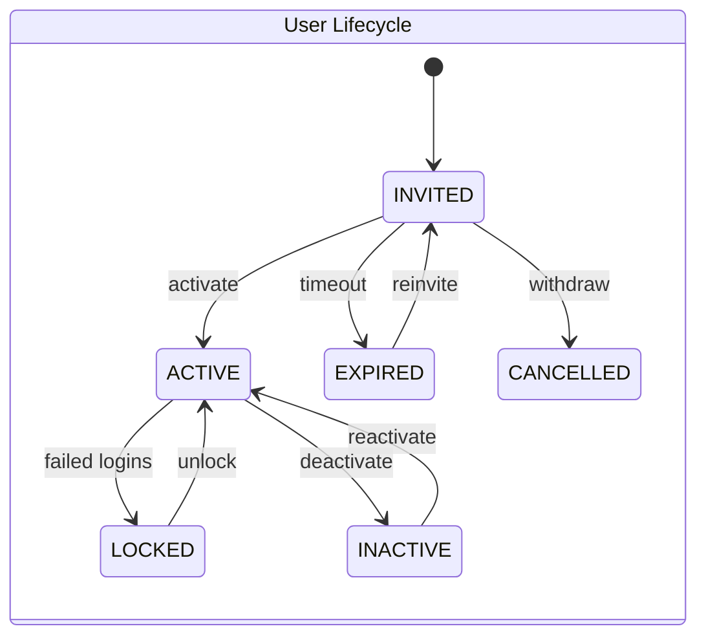
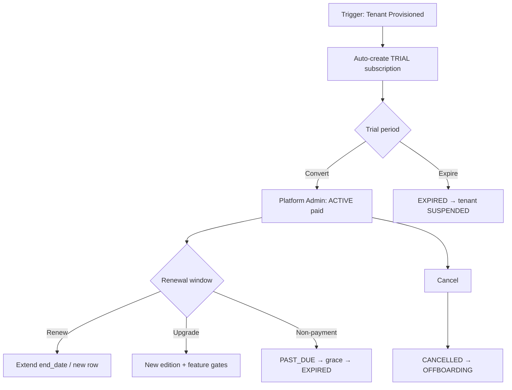
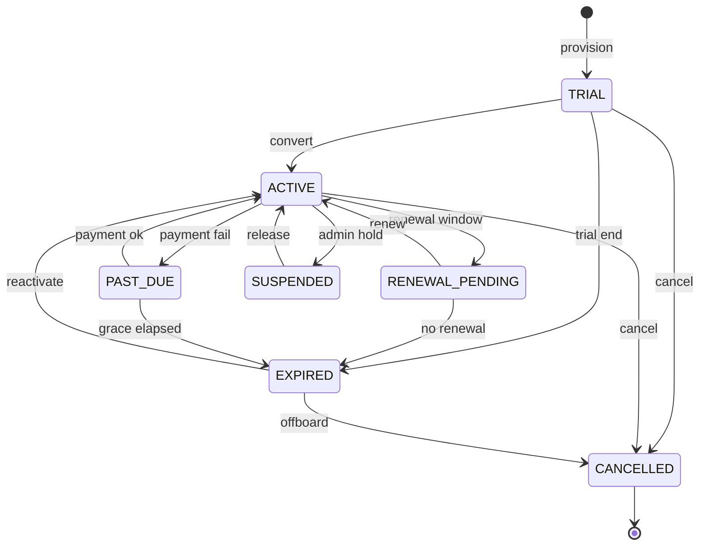

# E-LinkUp — Enterprise Functional Specification Enrichments
## Platform Foundation (PF) Workflows

| Attribute | Value |
|-----------|-------|
| **Document ID** | ELU-EFS-PF |
| **Version** | 1.0 |
| **Classification** | Internal Confidential |
| **Project** | E-LinkUp (By Euphoria Infotech) |
| **Example Tenant** | Euphoria |
| **Technology Stack** | Flutter (Web + Android) · Python FastAPI · PostgreSQL · JWT + Refresh Token · Docker · Linux VPS / Azure |
| **Related Documents** | ELU-BFS-PF, ELU-SAD-001, ELU-DF-001, ELU-WF-001, ELU-EFS-001 |
| **Enrichment Scope** | WF-PF-001, WF-PF-002, WF-PF-003 — implementation-ready enrichment blocks only |

> **Usage:** Insert each enrichment block immediately after the referenced anchor section in `ELU-EFS-001` / `ELU-WF-001`. These blocks do **not** repeat the base workflow narrative; they extend it for engineering delivery.

---

<!-- EFS:WF-PF-001 -->

#### 3.1.8 Workflow Traceability

| Traceability Element | Value |
|----------------------|-------|
| **Workflow ID** | WF-PF-001 |
| **Workflow Name** | Tenant Registration & Activation |
| **Domain** | PF — Platform Foundation |
| **Module** | PF-002 — Tenant Management |
| **Sub Module** | PF-002-001 — Tenant Profile |
| **Business Process** | Multi-tenant SaaS onboarding — provision isolated tenant shell with edition, subscription, default organisation, administrator, and baseline configuration |
| **Priority** | P0 · Critical · Phase 1 · Release R1.0 |
| **Related Modules** | PF-001 (Edition), PF-003 (Subscription), PF-004 (Organization), PF-008 (Users), PF-011 (Configuration), CPS-001 (Workflow Engine), CPS-003 (Notification Engine), CPS-005 (Audit Service) |
| **Dependent Workflows** | None (root workflow) |
| **Downstream Workflows** | WF-PF-002 (Org & Users RBAC), WF-PF-003 (Subscription Lifecycle) |
| **Related Documents** | ELU-BFS-PF § PF-002, ELU-SAD-001 § 5.2, ELU-DF-001, ELU-WF-001 § 3.1 |
| **Related Database Tables** | `tenant`, `tenant_contact`, `tenant_address`, `tenant_branding`, `tenant_settings`, `tenant_security`, `tenant_localization`, `edition`, `subscription`, `organization`, `users`, `audit_event` |
| **Related Flutter Screens** | `TenantListScreen`, `TenantRegisterWizard`, `TenantEditScreen`, `TenantViewScreen`, `TenantApprovalScreen`, `TenantBrandingScreen`, `TenantSecuritySettingsScreen`, `TenantLocalizationScreen`, `TenantHistoryScreen` |
| **Related REST APIs** | `/api/v1/platform/tenants/*`, `/api/v1/tenant/profile`, `/api/v1/tenant/contacts`, `/api/v1/tenant/addresses`, `/api/v1/tenant/branding`, `/api/v1/tenant/settings`, `/api/v1/tenant/security`, `/api/v1/tenant/localization` |
| **Related Reports** | RPT-PF-002-01 Tenant Directory, RPT-PF-002-02 Tenant Onboarding Pipeline, RPT-PF-002-03 Suspended Tenants, RPT-PF-002-04 Tenant Growth Dashboard |
| **Related Business Rules** | BR-PF-001 (unique tenant code), BR-PF-002 (unique tenant name), BR-PF-003 (edition required), BR-PF-004 (active subscription required), BR-PF-005 (no hard delete), BR-PF-006 (suspended = no access), BR-PF-007 (expired subscription restricts features), BR-PF-008 (tenant_id on all data); also BR-PF-009…018 from ELU-BFS-PF § PF-002 |
| **Related Notifications** | NTF-PF-002-01…06 (registered, approved, activated, suspended, reactivated, closing) |
| **Related Roles** | Platform Admin, Tenant Admin (designate), Sales Manager, System (Provisioning Engine, Notification Engine, Audit Service) |
| **Related Permissions** | `tenant.create`, `tenant.read`, `tenant.update`, `tenant.delete`, `tenant.approve`, `tenant.suspend`, `tenant.reactivate`, `tenant.export`, `tenant_contact.*`, `tenant_branding.update`, `tenant_security.configure` |

---

#### 3.1.9 Input / Output Definition

| Element | Specification |
|---------|---------------|
| **Input** | Tenant registration payload: `code`, `legal_name`, `trade_name`, `edition_id`, primary contact (name, email, mobile), registered address, optional billing/technical contacts, `provision_source` (MANUAL / SALES_DEAL), industry and company size metadata |
| **Trigger** | Platform Admin submits Tenant Registration wizard **or** Sales Manager raises onboarding request approved by Platform Admin |
| **Processing** | Validate uniqueness (BR-PF-001, BR-PF-002) → validate edition ACTIVE (BR-PF-003) → transactional provision: `tenant` + child profile tables → root `organization` → TRIAL `subscription` (BR-PF-004) → seed `tenant_settings`, `tenant_security`, `tenant_localization` → create INVITED Tenant Admin user → set status `PENDING_ACTIVATION` → emit audit + notifications → await approval/activation |
| **Output** | Fully provisioned tenant record (status `ACTIVE` or `TRIAL`), `current_subscription_id` populated, root organisation, Tenant Admin account (ACTIVE after activation), welcome/activation notifications dispatched, audit trail complete |
| **Next Workflow** | WF-PF-002 (Organisation Users RBAC) upon `ACTIVE`; WF-PF-003 manages subscription conversion Trial → Active |

---

#### 3.1.10 State Machine

| State Category | State Codes | Description |
|----------------|-------------|-------------|
| **Initial** | `DRAFT` | Registration wizard in progress; no users provisioned |
| **Intermediate** | `PENDING_ACTIVATION`, `TRIAL`, `SUSPENDED`, `OFFBOARDING` | Awaiting activation, trial period, access blocked, or retention countdown |
| **Terminal** | `ACTIVE`, `CLOSED` | Operational tenant or permanently terminated |
| **Cancelled** | `CANCELLED` | Registration abandoned before go-live |
| **Archived** | `ARCHIVED` | Historical record; platform read-only view |

**Allowed Transitions**

| From | To | Actor | Condition |
|------|----|-------|-----------|
| `DRAFT` | `PENDING_ACTIVATION` | Platform Admin | All mandatory fields valid |
| `DRAFT` | `CANCELLED` | Platform Admin | Abandon registration |
| `PENDING_ACTIVATION` | `ACTIVE` | Tenant Admin + System | Activation token consumed; password policy met |
| `PENDING_ACTIVATION` | `CANCELLED` | Platform Admin | Pre-activation cancel |
| `ACTIVE` | `SUSPENDED` | Platform Admin | Policy violation / non-payment flag |
| `ACTIVE` | `OFFBOARDING` | Platform Admin | Offboarding initiated |
| `SUSPENDED` | `ACTIVE` | Platform Admin | Issue resolved |
| `SUSPENDED` | `OFFBOARDING` | Platform Admin | Proceed to close |
| `OFFBOARDING` | `CLOSED` | Platform Admin / System | Retention period elapsed |
| `CLOSED` | `ARCHIVED` | System | Archive job (90 days post-close) |
| `TRIAL` | `ACTIVE` | Platform Admin | Subscription converted (WF-PF-003) |

**Invalid Transitions**

| From | To | Reason |
|------|----|--------|
| `CLOSED` | `ACTIVE` | Requires new tenant registration |
| `ARCHIVED` | any | Immutable |
| `CANCELLED` | `ACTIVE` | Must re-register |
| `SUSPENDED` | `DRAFT` | Not reversible to draft |

**Rollback Rules**

| Scenario | Rollback Action |
|----------|-----------------|
| Provision failure mid-transaction | Full DB transaction rollback; no partial tenant |
| Activation email failure | Tenant remains `PENDING_ACTIVATION`; retry notification (max 3) |
| Approval rejected | Status → `CANCELLED`; soft-delete draft rows after 30 days |
| Suspend → Reactivate | No data rollback; JWT re-issued on login |

---

#### 3.1.11 Ownership Matrix

| RACI Role | Actor | Responsibility |
|-----------|-------|----------------|
| **Owner** | Platform Admin (Provisioning) | End-to-end tenant lifecycle accountability |
| **Reviewer** | Sales Manager | Validates commercial terms before registration |
| **Approver** | Platform Admin | Approves `PENDING_ACTIVATION` → `ACTIVE` |
| **Executor** | System — Provisioning Engine | Creates tenant shell, child tables, subscription, org |
| **Watcher** | Tenant Admin (designate) | Monitors activation email; completes setup |
| **Notification Recipients** | Platform Admin, Tenant Admin designate, Sales Manager (on create) | Per notification matrix § 3.1.17 |
| **Escalation Owner** | Head of Platform Operations | Unresolved provisioning failures > 4 hours |

---

#### 3.1.12 Exception Handling

| Exception Type | Detection | System Response | User Action | Recovery |
|----------------|-----------|-----------------|-------------|----------|
| **Rejected** | Platform Admin rejects registration | Status → `CANCELLED`; NTF-PF-002-01 variant | Sales Manager notified with reason | Re-submit new registration |
| **Expired** | Activation token > 72 h | Invite `EXPIRED`; tenant stays `PENDING_ACTIVATION` | Platform Admin re-sends activation | `POST /tenants/{id}/resend-activation` |
| **Cancelled** | Admin abandons draft | `CANCELLED`; cleanup job scheduled | — | None |
| **Duplicate** | Duplicate `code` or `legal_name` (BR-PF-001, BR-PF-002) | HTTP 409; no DB write | Correct input | Retry with unique values |
| **Rollback** | DB constraint / provision error | Transaction rolled back; error logged | Platform Admin reviews logs | Retry provision |
| **Retry** | Notification delivery failure | Exponential backoff: 1m, 5m, 15m | — | Auto-retry max 3 |
| **Re-open** | `SUSPENDED` → `ACTIVE` | JWT invalidation reversed; access restored | Platform Admin documents reason | `POST /tenants/{id}/reactivate` |
| **Escalation** | Provision SLA breach > 4 h | Alert to Escalation Owner | Manual intervention | CPS-003 escalation template |
| **Business Exception** | DEPRECATED edition selected | HTTP 422 BR-PF-005 (BFS) / BR-PF-013 | Select ACTIVE edition | Choose valid edition |
| **System Exception** | PostgreSQL connection / Docker service down | HTTP 503; idempotency key preserved | DevOps alert | Retry with same `Idempotency-Key` header |

---

#### 3.1.13 Workflow Timing

| Timing Parameter | Value | Notes |
|------------------|-------|-------|
| **Expected Processing Time** | 2–5 minutes (automated provision) | Excludes human approval wait |
| **Max SLA** | 24 hours (registration → ACTIVE) | Business hours; Platform Admin approval |
| **Escalation Time** | 4 hours | Pending activation without admin action |
| **Reminder Frequency** | Activation reminder: 24 h, 48 h, 72 h | To Tenant Admin designate |
| **Auto Close Policy** | `DRAFT` auto-cancel after 7 days inactivity; `PENDING_ACTIVATION` escalate at 72 h | Scheduler job `JOB-PF-002-01` |

---

#### 3.1.14 Database Impact

| Impact Category | Tables | Operation | Notes |
|-----------------|--------|-----------|-------|
| **Master** | `tenant`, `tenant_contact`, `tenant_address`, `tenant_branding`, `tenant_settings`, `tenant_security`, `tenant_localization`, `edition`, `organization` | INSERT on provision; UPDATE on profile edit | `tenant` is root; not tenant-scoped |
| **Transaction** | `subscription` (initial TRIAL row), `user_invite` | INSERT | Links via `tenant.current_subscription_id` |
| **Audit** | `audit_event` | INSERT | `tenant.created`, `tenant.status_changed`, `tenant.approved` |
| **Attachments** | `document_attachment` (via CPS-006) | INSERT optional | Logo upload on branding step |
| **History** | `tenant_status_history` | INSERT on every status change | old_status, new_status, reason, actor_id |

**Transactional Boundary:** Single PostgreSQL transaction for steps: `tenant` → all child profile tables → `organization` → `subscription` → `users` (INVITED). Commit only on full success.

---

#### 3.1.15 API Mapping

| HTTP Method | Path | Purpose | Permission | Idempotent |
|-------------|------|---------|------------|------------|
| **POST** | `/api/v1/platform/tenants` | Register tenant (provision) | `tenant.create` | Yes (`Idempotency-Key`) |
| **GET** | `/api/v1/platform/tenants` | List tenants (paginated) | `tenant.read` | — |
| **GET** | `/api/v1/platform/tenants/{id}` | Tenant detail + children | `tenant.read` | — |
| **PUT** | `/api/v1/platform/tenants/{id}` | Full profile update | `tenant.update` | — |
| **PATCH** | `/api/v1/platform/tenants/{id}` | Partial update | `tenant.update` | — |
| **PATCH** | `/api/v1/platform/tenants/{id}/status` | Status transition | `tenant.approve` / `tenant.suspend` | — |
| **DELETE** | `/api/v1/platform/tenants/{id}` | Soft close / archive | `tenant.delete` | — |
| **GET** | `/api/v1/platform/tenants/search` | Search by code, name, status, edition | `tenant.read` | — |
| **GET** | `/api/v1/platform/tenants/export` | Export XLSX/CSV | `tenant.export` | — |
| **POST** | `/api/v1/platform/tenants/bulk-import` | Bulk tenant import | `tenant.create` | Yes |
| **PATCH** | `/api/v1/platform/tenants/bulk-update` | Bulk status update | `tenant.update` | — |
| **POST** | `/api/v1/platform/tenants/{id}/approve` | Approve registration | `tenant.approve` | — |
| **POST** | `/api/v1/platform/tenants/{id}/suspend` | Suspend tenant | `tenant.suspend` | — |
| **POST** | `/api/v1/platform/tenants/{id}/reactivate` | Reactivate tenant | `tenant.reactivate` | — |
| **POST** | `/api/v1/platform/tenants/{id}/resend-activation` | Resend activation email | `tenant.approve` | Rate-limited |
| **GET** | `/api/v1/tenant/profile` | Current tenant profile (JWT scope) | `tenant.read` | — |
| **PUT** | `/api/v1/tenant/profile` | Update own tenant profile | `tenant.update` | — |

---

#### 3.1.16 Flutter Mapping

| Screen Type | Route / Widget | Actor | Key Actions | State Binding |
|-------------|----------------|-------|-------------|---------------|
| **List** | `/platform/tenants` → `TenantListScreen` | Platform Admin | Filter by status/edition; bulk actions | `TenantListProvider` |
| **Create** | `/platform/tenants/register` → `TenantRegisterWizard` | Platform Admin | 5-step wizard: identity, contacts, address, edition, review | `TenantRegisterNotifier` |
| **Edit** | `/platform/tenants/{id}/edit` → `TenantEditScreen` | Platform Admin, Tenant Admin | Tabbed edit: profile, contacts, addresses | `TenantEditProvider` |
| **Details** | `/platform/tenants/{id}` → `TenantViewScreen` | Platform Admin, Tenant Admin | Summary cards, status badge, subscription link | `TenantDetailProvider` |
| **Approval** | `/platform/tenants/{id}/approve` → `TenantApprovalScreen` | Platform Admin | Approve / reject with reason | Workflow action API |
| **History** | `/platform/tenants/{id}/history` → `TenantHistoryScreen` | Platform Admin | Status timeline, audit events | `AuditTimelineWidget` |
| **Attachments** | Branding tab → logo upload | Tenant Admin | Logo/favicon upload (max 2 MB) | `DocumentUploadWidget` |
| **Timeline** | Embedded in Details/History | Platform Admin | Provisioning milestones | CPS-005 feed |

---

#### 3.1.17 Notification Matrix

| Trigger Event | Email | SMS | WhatsApp | Push | Internal | Recipients | Template Key |
|---------------|:-----:|:---:|:--------:|:----:|:--------:|------------|--------------|
| Tenant registered | ✓ | — | — | — | ✓ | Platform Admin | NTF-PF-002-01 |
| Tenant approved | ✓ | ✓ | — | — | — | Tenant Admin designate | NTF-PF-002-02 |
| Tenant activated | ✓ | — | — | ✓ | — | Tenant Admin | NTF-PF-002-03 |
| Activation reminder (24/48/72 h) | ✓ | ✓ | — | — | — | Tenant Admin designate | NTF-PF-002-02-R |
| Tenant suspended | ✓ | ✓ | — | ✓ | ✓ | All Tenant Admins | NTF-PF-002-04 |
| Tenant reactivated | ✓ | — | — | ✓ | — | All Tenant Admins | NTF-PF-002-05 |
| Tenant closing / offboarding | ✓ | — | — | — | ✓ | Tenant Admin, Platform Admin | NTF-PF-002-06 |
| Provision failure | — | — | — | — | ✓ | Platform Admin, DevOps | NTF-PF-002-07 |
| Trial expiring (via subscription) | ✓ | — | — | ✓ | — | Tenant Admin | NTF-PF-003-02 |

---

#### 3.1.18 Reporting Impact

| Report Category | Report ID | Name | Audience | KPIs / Metrics |
|-----------------|-----------|------|----------|----------------|
| **Operational** | RPT-PF-002-01 | Tenant Directory | Platform Admin | Count by status, edition |
| **Operational** | RPT-PF-002-03 | Suspended Tenants | Platform Admin | Suspension reason, duration |
| **MIS** | RPT-PF-002-02 | Tenant Onboarding Pipeline | Sales Manager | Avg days DRAFT → ACTIVE, stage funnel |
| **Executive** | RPT-PF-002-04 | Tenant Growth Dashboard | Leadership | New tenants/month, edition mix, churn |
| **Charts** | CHART-PF-002-01 | Onboarding Funnel | Sales Manager | DRAFT → PENDING → ACTIVE conversion |
| **Analytics** | ANA-PF-002-01 | Time-to-Activate | Platform Admin | P50/P95 activation duration |

---

#### 3.1.19 Security

| Security Control | Implementation |
|------------------|----------------|
| **RBAC** | All `/api/v1/platform/tenants/*` require Platform Admin role or explicit `tenant.*` permissions; tenant-scoped endpoints use JWT `tenant_id` |
| **Approval** | `PENDING_ACTIVATION` → `ACTIVE` requires `tenant.approve`; dual-control optional (v2) |
| **Permissions** | See § 3.1.8; enforced server-side via FastAPI dependency `require_permission()` |
| **Tenant Isolation** | BR-PF-008: middleware injects `tenant_id` from JWT; row-level filter on all queries; `tenant_id` in body rejected if mismatched (BR-PF-016) |
| **Audit** | All mutations emit `audit_event`; sensitive field changes diff-logged |
| **Sensitive Fields** | `tax_id`, `registration_number`, primary contact email/phone — masked in list views; encrypted at rest (AES-256) |
| **Auth** | Platform Admin: JWT (15 min) + refresh (7 d); activation token: single-use, 72 h, signed HS256 |
| **Transport** | TLS 1.2+; HSTS on Azure/VPS reverse proxy |

---

#### 3.1.20 Audit Trail

| Event | Actor | Captured Data | Retention |
|-------|-------|---------------|-----------|
| **Create** | Platform Admin / System | tenant_id, code, legal_name, edition_id, provision_source | Per tenant security policy (90 d – 7 yr) |
| **Update** | Platform Admin, Tenant Admin | Field-level diff (JSON patch) | Per policy |
| **Delete** | Platform Admin | Soft delete flag, reason | Permanent |
| **Approve** | Platform Admin | old_status, new_status, approval_notes | Permanent |
| **Reject** | Platform Admin | rejection_reason | Permanent |
| **Export** | Platform Admin | export_format, row_count, filter_criteria | 1 year |
| **Print** | Platform Admin | report_id, timestamp | 1 year |
| **Login** | Tenant Admin (post-activation) | IP, device, user_agent | Per policy |

---

#### 3.1.21 Acceptance Criteria

| Category | ID | Criterion |
|----------|-----|-----------|
| **Functional** | AC-WF-PF-001-F01 | Given valid registration for tenant **Euphoria**, when approved and activated, then all child tables exist and Tenant Admin can log in |
| **Functional** | AC-WF-PF-001-F02 | Given duplicate tenant `code`, when POST `/platform/tenants`, then HTTP 409 (BR-PF-001) |
| **Functional** | AC-WF-PF-001-F03 | Given duplicate `legal_name`, when POST, then HTTP 409 (BR-PF-002) |
| **Functional** | AC-WF-PF-001-F04 | Given provision completes, when queried, then exactly one root `organization` and one TRIAL `subscription` exist (BR-PF-004) |
| **Functional** | AC-WF-PF-001-F05 | Given SUSPENDED tenant, when user login attempted, then auth fails (BR-PF-006) |
| **Technical** | AC-WF-PF-001-T01 | Provision is atomic — simulated failure on step 4 rolls back all prior inserts |
| **Technical** | AC-WF-PF-001-T02 | Idempotent POST with same `Idempotency-Key` returns same tenant_id |
| **Performance** | AC-WF-PF-001-P01 | Provision completes within 5 s at P95 under 50 concurrent registrations |
| **Security** | AC-WF-PF-001-S01 | Tenant Admin of Euphoria cannot GET another tenant's profile (tenant isolation) |
| **Security** | AC-WF-PF-001-S02 | All provision steps write `audit_event` rows |

---

#### 3.1.22 Future Enhancement

| Version | Enhancement | Description |
|---------|-------------|-------------|
| **v2** | Self-registration portal | Professional+ tenants register via public form with email domain verification (BR-PF-018) |
| **v2** | Custom domain mapping | `crm.euphoria.co.in` CNAME to tenant instance |
| **v2** | GDPR data export | Full tenant data portability package on OFFBOARDING |
| **v3** | Multi-region residency | Tenant selects data region at registration (EU, IN, US) |
| **v3** | Parent-child tenant hierarchy | Conglomerate structure with shared billing |
| **AI** | Onboarding assistant | AI-guided wizard pre-fills from company website / GSTIN lookup |
| **Automation** | Deal-to-tenant pipeline | Salesforce/CRM deal closure auto-triggers WF-PF-001 via INT-001 |

<!-- /EFS:WF-PF-001 -->

---

<!-- EFS:WF-PF-002 -->

#### 3.2.3 Workflow Traceability

| Traceability Element | Value |
|----------------------|-------|
| **Workflow ID** | WF-PF-002 |
| **Workflow Name** | Organisation, Users & RBAC Setup |
| **Domain** | PF — Platform Foundation |
| **Module** | PF-004 (Organization), PF-005 (Branch), PF-006 (Department), PF-007 (Business Unit), PF-008 (Users), PF-009 (RBAC) |
| **Sub Module** | PF-004-001, PF-005-001, PF-006-001, PF-007-001, PF-008-001, PF-009-001 |
| **Business Process** | Post-activation structural setup — define org hierarchy, invite users, assign roles/permissions, enforce security policy, enable CRM operations |
| **Priority** | P0 · Critical · Phase 1 · Release R1.0 |
| **Related Modules** | PF-002 (Tenant), PF-003 (Subscription), PF-010 (Audit), PF-011 (Configuration), CPS-001, CPS-003, CPS-005 |
| **Dependent Workflows** | WF-PF-001 (tenant must be ACTIVE or TRIAL) |
| **Downstream Workflows** | WF-CRM-001 (Lead Capture), all domain workflows requiring authenticated users |
| **Related Documents** | ELU-BFS-PF §§ PF-004…009, ELU-SAD-001 § 5.3, ELU-DF-001 |
| **Related Database Tables** | `organization`, `branch`, `department`, `business_unit`, `users`, `user_credentials`, `user_session`, `user_invite`, `user_mfa`, `role`, `permission`, `role_permission`, `user_role`, `tenant_security`, `subscription` |
| **Related Flutter Screens** | `OrgHierarchyScreen`, `BranchListScreen`, `DepartmentListScreen`, `BusinessUnitListScreen`, `UserListScreen`, `UserInviteScreen`, `RoleListScreen`, `RolePermissionMatrixScreen`, `UserRoleAssignmentScreen`, `LoginScreen`, `MFASetupScreen` |
| **Related REST APIs** | `/api/v1/org/*`, `/api/v1/users/*`, `/api/v1/rbac/*`, `/api/v1/auth/*` |
| **Related Reports** | RPT-PF-004-01…04, RPT-PF-008-01…04, RPT-PF-009-01…04 |
| **Related Business Rules** | BR-PF-001…008 (tenant isolation, subscription limits), BR-PF-022 (seat limit), BR-PF-051…060 (users), BR-PF-061…068 (RBAC) |
| **Related Notifications** | NTF-PF-004-01…03, NTF-PF-008-01…08, NTF-PF-009-01…04 |
| **Related Roles** | Tenant Admin, Platform Admin, Sales Manager, Sales Executive, Finance User, Project Manager, Support Agent, Team Member |
| **Related Permissions** | `organization.*`, `branch.*`, `department.*`, `business_unit.*`, `user.*`, `role.*`, `permission.read`, `role.configure`, `role.assign` |

---

#### 3.2.4 Input / Output Definition

| Element | Specification |
|---------|---------------|
| **Input** | Active tenant (WF-PF-001); org hierarchy definition (branches, departments, BUs); user invite payloads (email, name, role_ids, branch_id, department_id); role-permission mappings; security policy configuration |
| **Trigger** | Tenant reaches `ACTIVE` status **or** Tenant Admin first login after activation |
| **Processing** | Seed system roles + permission catalogue → Tenant Admin defines org tree → invite users (seat check BR-PF-022) → assign roles (BR-PF-064) → apply `tenant_security` policy → users activate via invite → login issues JWT with `tenant_id`, `roles[]`, `permissions[]` → API middleware enforces RBAC |
| **Output** | Complete org hierarchy, ACTIVE users with role assignments, enforced security policy, JWT-authenticated sessions, tenant ready for CRM operations |
| **Next Workflow** | WF-CRM-001 Lead Capture & Qualification |

---

#### 3.2.5 State Machine

**Organisation Entity States**

| State Category | States | Notes |
|----------------|--------|-------|
| Initial | `DRAFT` (org auto-created at provision) | Root org from WF-PF-001 |
| Intermediate | `ACTIVE`, `INACTIVE` | Branches, departments, BUs |
| Terminal | `ACTIVE` (org) | Operational |
| Archived | `ARCHIVED` | Historical org units |

**User Account States**

| State Category | States |
|----------------|--------|
| Initial | `INVITED` |
| Intermediate | `ACTIVE`, `LOCKED` |
| Terminal | `INACTIVE` (deactivated) |
| Cancelled | `CANCELLED` (invite withdrawn) |
| Archived | `EXPIRED` (invite token expired) |

**Role States**

| State Category | States |
|----------------|--------|
| Initial | `ACTIVE` (system roles seeded) |
| Intermediate | `ACTIVE`, `INACTIVE` |
| Archived | `ARCHIVED` (custom roles only) |

**Allowed Transitions (User)**

| From | To | Actor | Condition |
|------|----|-------|-----------|
| `INVITED` | `ACTIVE` | User | Valid token + password policy |
| `INVITED` | `EXPIRED` | System | 72 h elapsed |
| `INVITED` | `CANCELLED` | Tenant Admin | Invite withdrawn |
| `ACTIVE` | `LOCKED` | System | 5 failed logins (BR-PF-055) |
| `ACTIVE` | `INACTIVE` | Tenant Admin | Deactivation |
| `LOCKED` | `ACTIVE` | System / Tenant Admin | 30 min elapsed or admin unlock |
| `INACTIVE` | `ACTIVE` | Tenant Admin | Re-activation |
| `EXPIRED` | `INVITED` | Tenant Admin | Re-invite |

**Rollback Rules**

| Scenario | Action |
|----------|--------|
| Invite cancelled | `user_invite` revoked; `users` row soft-deleted if never activated |
| Role assignment error | `user_role` row deleted; JWT refreshed on next login |
| Org unit delete blocked | BR-PF-044: cannot delete dept with users — reassign first |

---

#### 3.2.6 Ownership Matrix

| RACI Role | Actor | Responsibility |
|-----------|-------|----------------|
| **Owner** | Tenant Admin | Org structure, user lifecycle, RBAC configuration |
| **Reviewer** | Platform Admin | Validates initial setup during onboarding window (first 14 days) |
| **Approver** | Tenant Admin | User invite approval (optional workflow v2); role permission changes |
| **Executor** | Tenant Admin, System (Provisioning, Auth Service) | Creates org units, invites users, seeds roles |
| **Watcher** | Sales Manager, Department Heads | Notified on new user assignments |
| **Notification Recipients** | Invited users, Tenant Admin, department heads | Per § 3.2.13 |
| **Escalation Owner** | Platform Admin | Seat limit disputes; RBAC lockout issues |

---

#### 3.2.7 Exception Handling

| Exception Type | Detection | System Response | Recovery |
|----------------|-----------|-----------------|----------|
| **Rejected** | Invalid email format / duplicate email (BR-PF-051) | HTTP 422/409 | Correct email |
| **Expired** | Invite token > 72 h (BR-PF-054) | Status `EXPIRED` | `POST /users/{id}/reinvite` |
| **Cancelled** | Tenant Admin withdraws invite | Status `CANCELLED` | New invite if needed |
| **Duplicate** | Email exists in tenant | HTTP 409 | Use different email or reactivate existing |
| **Rollback** | Role assignment fails mid-batch | Transaction rollback on `user_role` batch | Retry assignment |
| **Retry** | Invite email bounce | Mark `invite_delivery_failed`; alert Tenant Admin | Update email, reinvite |
| **Re-open** | `INACTIVE` → `ACTIVE` | Sessions cleared; new invite if credentials expired | Tenant Admin reactivates |
| **Escalation** | Seat limit exceeded (BR-PF-052) | HTTP 403 + upgrade prompt | Upgrade subscription (WF-PF-003) |
| **Business Exception** | Custom role limit exceeded (BR-PF-061) | HTTP 403 | Upgrade edition or delete unused role |
| **System Exception** | Auth service unavailable | HTTP 503; queued invite processing | Auto-retry via Celery |

---

#### 3.2.8 Workflow Timing

| Timing Parameter | Value | Notes |
|------------------|-------|-------|
| **Expected Processing Time** | 30–60 min (Tenant Admin manual setup) | Typical Euphoria onboarding |
| **Max SLA** | 5 business days | Tenant ACTIVE → first CRM user operational |
| **Escalation Time** | 48 h | No users invited after tenant activation |
| **Reminder Frequency** | Invite reminder: 24 h, 48 h before expiry | To invited user |
| **Auto Close Policy** | `INVITED` → `EXPIRED` at 72 h; `LOCKED` auto-unlock at 30 min | Scheduler `JOB-PF-008-01` |

---

#### 3.2.9 Database Impact

| Impact Category | Tables | Operation |
|-----------------|--------|-----------|
| **Master** | `organization`, `branch`, `department`, `business_unit`, `users`, `role`, `permission` | INSERT, UPDATE |
| **Transaction** | `user_invite`, `user_session`, `user_role`, `role_permission` | INSERT, UPDATE, DELETE |
| **Audit** | `audit_event`, `user_password_history` | INSERT |
| **Attachments** | `users.avatar_url` → `document_attachment` | INSERT optional |
| **History** | `role_permission` changes logged in `audit_event`; `user_role` effective dating (v2) | INSERT |

---

#### 3.2.10 API Mapping

| HTTP Method | Path | Purpose | Permission |
|-------------|------|---------|------------|
| **POST** | `/api/v1/org/organizations` | Create organisation | `organization.create` |
| **GET** | `/api/v1/org/organizations` | List organisations | `organization.read` |
| **PUT** | `/api/v1/org/organizations/{id}` | Update organisation | `organization.update` |
| **PATCH** | `/api/v1/org/organizations/{id}` | Partial update | `organization.update` |
| **DELETE** | `/api/v1/org/organizations/{id}` | Soft delete | `organization.delete` |
| **GET** | `/api/v1/org/organizations/search` | Search | `organization.read` |
| **GET** | `/api/v1/org/organizations/export` | Export | `organization.export` |
| **POST** | `/api/v1/org/branches` | Create branch | `branch.create` |
| **GET** | `/api/v1/org/branches` | List branches | `branch.read` |
| **PUT/PATCH/DELETE** | `/api/v1/org/branches/{id}` | Branch CRUD | `branch.*` |
| **GET** | `/api/v1/org/branches/search` | Search branches | `branch.read` |
| **POST** | `/api/v1/org/departments` | Create department | `department.create` |
| **GET** | `/api/v1/org/departments/hierarchy` | Department tree | `department.read` |
| **PUT/PATCH/DELETE** | `/api/v1/org/departments/{id}` | Department CRUD | `department.*` |
| **POST** | `/api/v1/org/business-units` | Create BU | `business_unit.create` |
| **GET** | `/api/v1/org/business-units` | List BUs | `business_unit.read` |
| **POST** | `/api/v1/users` | Invite user | `user.create` |
| **GET** | `/api/v1/users` | List users | `user.read` |
| **PUT/PATCH/DELETE** | `/api/v1/users/{id}` | User CRUD / deactivate | `user.*` |
| **GET** | `/api/v1/users/search` | Search users | `user.read` |
| **GET** | `/api/v1/users/export` | Export users | `user.export` |
| **POST** | `/api/v1/users/bulk-import` | Bulk user import | `user.create` |
| **PATCH** | `/api/v1/users/bulk-update` | Bulk status update | `user.update` |
| **POST** | `/api/v1/users/{id}/reinvite` | Resend invite | `user.create` |
| **POST** | `/api/v1/auth/login` | Login | Public |
| **POST** | `/api/v1/auth/refresh` | Refresh JWT | Refresh token |
| **POST** | `/api/v1/auth/register` | Activate invite | Public (token) |
| **POST** | `/api/v1/rbac/roles` | Create role | `role.create` |
| **GET** | `/api/v1/rbac/roles` | List roles | `role.read` |
| **PUT** | `/api/v1/rbac/roles/{id}/permissions` | Set permissions | `role.configure` |
| **POST** | `/api/v1/rbac/users/{user_id}/roles` | Assign role | `role.assign` |
| **DELETE** | `/api/v1/rbac/users/{user_id}/roles/{role_id}` | Remove role | `role.assign` |
| **GET** | `/api/v1/rbac/permissions` | Permission catalogue | `permission.read` |
| **GET** | `/api/v1/rbac/me/permissions` | Current user permissions | Authenticated |

---

#### 3.2.11 Flutter Mapping

| Screen Type | Route / Widget | Actor | Key Actions |
|-------------|----------------|-------|-------------|
| **List** | `/org/hierarchy` → `OrgHierarchyScreen` | Tenant Admin | Tree view: org → branch → dept |
| **List** | `/users` → `UserListScreen` | Tenant Admin | Filter status, role, branch |
| **List** | `/rbac/roles` → `RoleListScreen` | Tenant Admin | System vs custom filter |
| **Create** | `/users/invite` → `UserInviteScreen` | Tenant Admin | Email, role, branch, dept |
| **Create** | `/rbac/roles/create` → `RoleCreateScreen` | Tenant Admin | Clone from template |
| **Edit** | `/rbac/roles/{id}/permissions` → `RolePermissionMatrixScreen` | Tenant Admin | Checkbox grid |
| **Edit** | `/users/{id}/edit` → `UserEditScreen` | Tenant Admin | Profile, org assignment |
| **Details** | `/users/{id}` → `UserViewScreen` | Tenant Admin, Self | Profile, roles, sessions |
| **Approval** | Role permission change confirmation dialog | Tenant Admin | Confirm privilege elevation |
| **History** | `/users/{id}/history` → `UserHistoryScreen` | Tenant Admin | Login audit, changes |
| **Attachments** | Avatar upload on profile | All users | Profile photo |
| **Timeline** | `/org/timeline` → org change feed | Tenant Admin | Structure changes |

---

#### 3.2.12 Notification Matrix

| Trigger Event | Email | SMS | WhatsApp | Push | Internal | Recipients | Template |
|---------------|:-----:|:---:|:--------:|:----:|:--------:|------------|----------|
| User invited | ✓ | — | — | — | — | Invited user | NTF-PF-008-01 |
| Account activated | ✓ | — | — | ✓ | ✓ | User, Tenant Admin | NTF-PF-008-02 |
| Invite reminder (24 h) | ✓ | — | — | — | — | Invited user | NTF-PF-008-01-R |
| Password reset requested | ✓ | — | — | — | — | User | NTF-PF-008-03 |
| Account locked | ✓ | ✓ | — | — | ✓ | User, Tenant Admin | NTF-PF-008-05 |
| User deactivated | ✓ | — | — | — | ✓ | User, Tenant Admin | NTF-PF-008-06 |
| MFA enrolled | ✓ | — | — | — | — | User | NTF-PF-008-07 |
| Role assigned | ✓ | — | — | — | ✓ | User, Tenant Admin | NTF-PF-009-01 |
| Role permissions changed | — | — | — | — | ✓ | Affected users | NTF-PF-009-02 |
| Department head assigned | ✓ | — | — | ✓ | — | New head | NTF-PF-006-02 |
| Seat limit approaching (90%) | ✓ | — | — | — | ✓ | Tenant Admin | NTF-PF-003-07 |
| New login unknown device | ✓ | — | — | ✓ | — | User | NTF-PF-008-08 |

---

#### 3.2.13 Reporting Impact

| Report Category | Report ID | Name | Audience |
|-----------------|-----------|------|----------|
| **Operational** | RPT-PF-008-01 | User Directory | Tenant Admin |
| **Operational** | RPT-PF-009-01 | Role-Permission Matrix | Tenant Admin |
| **Operational** | RPT-PF-009-02 | User-Role Assignment | Tenant Admin |
| **MIS** | RPT-PF-008-03 | Seat Utilisation | Tenant Admin |
| **MIS** | RPT-PF-006-02 | Headcount by Department | Tenant Admin |
| **Executive** | RPT-PF-008-04 | Inactive Users (30+ days) | Tenant Admin |
| **Compliance** | RPT-PF-009-04 | Segregation of Duties Violations | Tenant Admin |
| **Charts** | CHART-PF-008-01 | Users by Role (pie) | Tenant Admin |
| **Analytics** | ANA-PF-008-01 | Onboarding funnel (invited → active) | Platform Admin |

---

#### 3.2.14 Security

| Security Control | Implementation |
|------------------|----------------|
| **RBAC** | Server-side `require_permission()` on every mutating endpoint; Flutter `PermissionGate` widget hides unauthorized UI |
| **Approval** | Privilege elevation (admin permissions) requires Tenant Admin confirmation; v2: dual approval |
| **Permissions** | JWT embeds `permissions[]`; refreshed every 15 min (BR-PF-066) |
| **Tenant Isolation** | BR-PF-008, BR-PF-059: all queries filtered by JWT `tenant_id`; cross-tenant access returns 404 |
| **Audit** | Login, role change, permission denied (403) logged (BR-PF-065) |
| **Sensitive Fields** | `password_hash` in separate `user_credentials` table; MFA secrets encrypted |
| **Password Policy** | Enforced from `tenant_security`: min 12 chars, complexity, history (BR-PF-053) |
| **Session** | Max concurrent sessions from `tenant_security`; refresh token httpOnly cookie |
| **MFA** | TOTP required when `tenant_security.mfa_required = true` (BR-PF-058) |

---

#### 3.2.15 Audit Trail

| Event | Actor | Captured Data |
|-------|-------|---------------|
| **Create** | Tenant Admin | Org unit / user / role created; initial field values |
| **Update** | Tenant Admin | Field diff for user profile, role permissions |
| **Delete** | Tenant Admin | Soft delete flag, reason |
| **Approve** | Tenant Admin | Role permission elevation approval |
| **Reject** | Tenant Admin | Invite rejection reason |
| **Export** | Tenant Admin | User list / role matrix export metadata |
| **Login** | User | IP, device, success/failure |
| **Login** | System | Failed login count increment; lock event |

---

#### 3.2.16 Acceptance Criteria

| Category | ID | Criterion |
|----------|-----|-----------|
| **Functional** | AC-WF-PF-002-F01 | Given ACTIVE tenant Euphoria, when Tenant Admin invites user within seat limit, then invite email sent with 72 h token |
| **Functional** | AC-WF-PF-002-F02 | Given seat limit reached, when invite attempted, then HTTP 403 (BR-PF-052) |
| **Functional** | AC-WF-PF-002-F03 | Given Sales Executive role without `quotation.approve`, when approve API called, then HTTP 403 |
| **Functional** | AC-WF-PF-002-F04 | Given user activated, when login, then JWT contains correct `tenant_id`, `roles[]`, `permissions[]` |
| **Functional** | AC-WF-PF-002-F05 | Given Community edition with 5 custom roles, when 6th created, then rejected (BR-PF-061) |
| **Technical** | AC-WF-PF-002-T01 | System roles seeded within 2 s of tenant activation |
| **Technical** | AC-WF-PF-002-T02 | Permission change reflected in JWT within 15 min |
| **Performance** | AC-WF-PF-002-P01 | Login P95 < 500 ms; permission check overhead < 5 ms |
| **Security** | AC-WF-PF-002-S01 | Deactivated user cannot obtain new JWT (BR-PF-057) |
| **Security** | AC-WF-PF-002-S02 | At least one ACTIVE Tenant Admin always exists (BR-PF-060) |

---

#### 3.2.17 Future Enhancement

| Version | Enhancement | Description |
|---------|-------------|-------------|
| **v2** | SSO (SAML/OIDC) | Enterprise edition JIT provisioning |
| **v2** | Row-level security | Own / team / all record visibility |
| **v2** | Time-bound role assignments | `effective_from` / `effective_to` on `user_role` |
| **v2** | Bulk user import from AD/LDAP | CSV + SCIM preview |
| **v3** | ABAC (Attribute-Based Access Control) | Dynamic policies by dept, BU, territory |
| **v3** | SCIM 2.0 provisioning | Automated user lifecycle from IdP |
| **AI** | Role recommendation | AI suggests role based on job title / department |
| **Automation** | Auto-deactivate inactive users | Scheduler disables users with 90+ days no login |

<!-- /EFS:WF-PF-002 -->

---

<!-- EFS:WF-PF-003 -->

#### 3.3.1 Workflow Traceability

| Traceability Element | Value |
|----------------------|-------|
| **Workflow ID** | WF-PF-003 |
| **Workflow Name** | Subscription Lifecycle |
| **Domain** | PF — Platform Foundation |
| **Module** | PF-003 — Subscription Management |
| **Sub Module** | PF-003-001 — Subscription |
| **Business Process** | Manage commercial entitlement lifecycle — trial, activation, renewal, upgrade/downgrade, expiry, cancellation — driving feature gates and seat limits |
| **Priority** | P0 · Critical · Phase 1 · Release R1.0 |
| **Related Modules** | PF-001 (Edition), PF-002 (Tenant), PF-008 (Users — seat enforcement), CPS-002 (Rule Engine), CPS-003 (Notification), CPS-004 (Reporting) |
| **Dependent Workflows** | WF-PF-001 (tenant provision creates initial subscription) |
| **Downstream Workflows** | All module workflows (edition feature gating at runtime) |
| **Related Documents** | ELU-BFS-PF § PF-003, ELU-SAD-001, ELU-DF-001, ELU-WF-001 § 3.3 |
| **Related Database Tables** | `subscription`, `subscription_history`, `subscription_usage`, `tenant`, `edition`, `edition_feature`, `edition_limit` |
| **Related Flutter Screens** | `SubscriptionListScreen`, `SubscriptionCreateScreen`, `SubscriptionViewScreen`, `SubscriptionRenewScreen`, `SubscriptionUpgradeScreen`, `SubscriptionHistoryScreen`, `MySubscriptionScreen` |
| **Related REST APIs** | `/api/v1/platform/subscriptions/*`, `/api/v1/tenant/subscription`, `/api/v1/tenant/subscription/usage` |
| **Related Reports** | RPT-PF-003-01…04 |
| **Related Business Rules** | BR-PF-004 (active subscription required), BR-PF-007 (expired restricts features), BR-PF-019…027 |
| **Related Notifications** | NTF-PF-003-01…07 |
| **Related Roles** | Platform Admin, Tenant Admin, Finance User, System (Scheduler, Subscription Engine) |
| **Related Permissions** | `subscription.create`, `subscription.read`, `subscription.update`, `subscription.cancel`, `subscription.renew`, `subscription.upgrade`, `subscription.reactivate`, `subscription.export` |

---

#### 3.3.2 Input / Output Definition

| Element | Specification |
|---------|---------------|
| **Input** | Tenant id + edition id + commercial terms: `billing_cycle`, `seat_count`, `start_date`, `end_date`, `auto_renew`, payment confirmation flag (manual v1) |
| **Trigger** | Auto-create TRIAL on WF-PF-001 provision **or** Platform Admin converts trial / creates paid subscription **or** Scheduler detects expiry window |
| **Processing** | Validate edition ACTIVE → validate seat limits (BR-PF-021) → create/update `subscription` → update `tenant.current_subscription_id` → write `subscription_history` → apply feature gates → schedule renewal/expiry jobs → notify stakeholders |
| **Output** | Subscription in target state (TRIAL/ACTIVE/EXPIRED/etc.); `subscription_usage` snapshot; tenant status cascaded if EXPIRED; notifications dispatched |
| **Next Workflow** | Continues in parallel with all domain workflows; re-activation loops back to WF-PF-001 tenant status if suspended |

---

#### 3.3.3 State Machine

| State Category | State Codes | Description |
|----------------|-------------|-------------|
| **Initial** | `TRIAL` | Auto-created at tenant provision (30 days default) |
| **Intermediate** | `ACTIVE`, `RENEWAL_PENDING`, `PAST_DUE`, `SUSPENDED` | Paid, in renewal window, overdue, admin hold |
| **Terminal** | `ACTIVE` (ongoing paid), `RENEWED` (historical row) | Operational entitlement |
| **Cancelled** | `CANCELLED` | Explicit termination |
| **Archived** | Historical `subscription` rows superseded by renewal/upgrade | `is_current = false` |

**Allowed Transitions**

| From | To | Trigger | Actor |
|------|----|---------|-------|
| `TRIAL` | `ACTIVE` | Payment / conversion | Platform Admin |
| `TRIAL` | `EXPIRED` | Trial end date reached | Scheduler |
| `TRIAL` | `CANCELLED` | Early cancellation | Platform Admin |
| `ACTIVE` | `RENEWAL_PENDING` | Enter renewal window (30 d) | Scheduler |
| `RENEWAL_PENDING` | `ACTIVE` | Renewal processed | Platform Admin |
| `RENEWAL_PENDING` | `EXPIRED` | End date passed without renewal | Scheduler |
| `ACTIVE` | `PAST_DUE` | Payment failure flag | Platform Admin |
| `PAST_DUE` | `ACTIVE` | Payment resolved | Platform Admin |
| `PAST_DUE` | `EXPIRED` | Grace period (15 d) elapsed | Scheduler |
| `ACTIVE` | `SUSPENDED` | Admin hold | Platform Admin |
| `SUSPENDED` | `ACTIVE` | Admin release | Platform Admin |
| `EXPIRED` | `ACTIVE` | Reactivation + payment | Platform Admin |
| Any active | `CANCELLED` | Explicit cancellation | Platform Admin |

**Invalid Transitions**

| From | To | Reason |
|------|----|--------|
| `CANCELLED` | `ACTIVE` | Requires new subscription row |
| `EXPIRED` | `TRIAL` | Trial is one-time per tenant |
| `ACTIVE` | `TRIAL` | Cannot revert to trial |

**Rollback Rules**

| Scenario | Action |
|----------|--------|
| Upgrade failure | Revert `tenant.current_subscription_id` to prior subscription; delete draft upgrade row |
| Renewal with invalid seats | Transaction rollback; retain current subscription |
| Expiry cascade failure | Retry job; alert Platform Admin if tenant not SUSPENDED within 1 h (BR-PF-024) |

---

#### 3.3.4 Ownership Matrix

| RACI Role | Actor | Responsibility |
|-----------|-------|----------------|
| **Owner** | Platform Admin (Billing Ops) | Subscription lifecycle accountability |
| **Reviewer** | Finance User | Validates commercial terms, renewal amounts |
| **Approver** | Platform Admin | Trial conversion, upgrade, cancellation |
| **Executor** | System — Subscription Engine, Scheduler | Auto-create trial, expiry checks, usage snapshots |
| **Watcher** | Tenant Admin | Monitors usage vs limits, renewal dates |
| **Notification Recipients** | Tenant Admin, Finance User, Platform Admin | Per § 3.3.10 |
| **Escalation Owner** | Head of Revenue Operations | EXPIRED tenant not actioned within 24 h |

---

#### 3.3.5 Exception Handling

| Exception Type | Detection | System Response | Recovery |
|----------------|-----------|-----------------|----------|
| **Rejected** | Seat count > edition max (BR-PF-021) | HTTP 422 | Reduce seats or upgrade edition |
| **Expired** | `end_date` < today | Status → `EXPIRED`; tenant → `SUSPENDED` (BR-PF-024) | `POST /subscriptions/{id}/reactivate` |
| **Cancelled** | Admin cancellation | `CANCELLED`; tenant → `OFFBOARDING` | New subscription if re-engagement |
| **Duplicate** | Second ACTIVE subscription (BR-PF-019) | HTTP 409 | Cancel duplicate or supersede |
| **Rollback** | Upgrade transaction failure | Revert to prior subscription pointer | Retry upgrade |
| **Retry** | Scheduler expiry job failure | Retry 3x with backoff | Manual trigger |
| **Re-open** | `EXPIRED` → `ACTIVE` | Reactivation; tenant status → `ACTIVE` | Payment confirmation required |
| **Escalation** | PAST_DUE > 15 d | Auto-EXPIRED + exec alert | Revenue Ops intervention |
| **Business Exception** | Downgrade with excess users (BR-PF-023) | HTTP 422 | Deactivate users first |
| **System Exception** | Scheduler down | Missed expiry; catch-up on restart | Backfill job |

---

#### 3.3.6 Workflow Timing

| Timing Parameter | Value | Notes |
|------------------|-------|-------|
| **Expected Processing Time** | < 2 s (status change) | Synchronous API |
| **Max SLA** | 1 hour (expiry → tenant SUSPENDED) | BR-PF-024 |
| **Escalation Time** | 24 h (PAST_DUE without resolution) | Revenue Ops alert |
| **Reminder Frequency** | Trial: day 25; Renewal: 30, 15, 7 days before expiry | Scheduler `JOB-PF-003-01` |
| **Auto Close Policy** | `PAST_DUE` → `EXPIRED` after 15-day grace; `TRIAL` → `EXPIRED` at `trial_end_date` | Daily scheduler 00:00 UTC |

---

#### 3.3.7 Database Impact

| Impact Category | Tables | Operation |
|-----------------|--------|-----------|
| **Master** | `edition`, `edition_feature`, `edition_limit`, `tenant` | READ; UPDATE `tenant.current_subscription_id` |
| **Transaction** | `subscription` | INSERT (new/renewal/upgrade), UPDATE (status) |
| **Audit** | `subscription_history` | INSERT on every status/edition/seat change (BR-PF-026) |
| **Attachments** | — | N/A for v1 |
| **History** | `subscription_history`, `subscription_usage` | INSERT; usage snapshot daily |

---

#### 3.3.8 API Mapping

| HTTP Method | Path | Purpose | Permission |
|-------------|------|---------|------------|
| **POST** | `/api/v1/platform/subscriptions` | Create subscription | `subscription.create` |
| **GET** | `/api/v1/platform/subscriptions` | List subscriptions | `subscription.read` |
| **GET** | `/api/v1/platform/subscriptions/{id}` | Subscription detail | `subscription.read` |
| **PUT** | `/api/v1/platform/subscriptions/{id}` | Full update | `subscription.update` |
| **PATCH** | `/api/v1/platform/subscriptions/{id}` | Status / partial update | `subscription.update` |
| **DELETE** | `/api/v1/platform/subscriptions/{id}` | Cancel subscription | `subscription.cancel` |
| **GET** | `/api/v1/platform/subscriptions/search` | Search | `subscription.read` |
| **GET** | `/api/v1/platform/subscriptions/export` | Export XLSX/CSV | `subscription.export` |
| **POST** | `/api/v1/platform/subscriptions/bulk-import` | Bulk import | `subscription.create` |
| **PATCH** | `/api/v1/platform/subscriptions/bulk-update` | Bulk status update | `subscription.update` |
| **POST** | `/api/v1/platform/subscriptions/{id}/renew` | Process renewal | `subscription.renew` |
| **POST** | `/api/v1/platform/subscriptions/{id}/upgrade` | Upgrade edition | `subscription.upgrade` |
| **POST** | `/api/v1/platform/subscriptions/{id}/downgrade` | Downgrade edition | `subscription.upgrade` |
| **POST** | `/api/v1/platform/subscriptions/{id}/reactivate` | Reactivate expired | `subscription.reactivate` |
| **POST** | `/api/v1/platform/subscriptions/{id}/convert-trial` | Trial → Active | `subscription.update` |
| **GET** | `/api/v1/tenant/subscription` | Current tenant subscription | `subscription.read` |
| **GET** | `/api/v1/tenant/subscription/usage` | Usage vs limits | `subscription.read` |

---

#### 3.3.9 Flutter Mapping

| Screen Type | Route / Widget | Actor | Key Actions |
|-------------|----------------|-------|-------------|
| **List** | `/platform/subscriptions` → `SubscriptionListScreen` | Platform Admin | Filter status, edition, expiry |
| **Create** | `/platform/subscriptions/create` → `SubscriptionCreateScreen` | Platform Admin | Tenant, edition, seats, dates |
| **Edit** | `/platform/subscriptions/{id}/edit` → `SubscriptionEditScreen` | Platform Admin | Seats, dates, auto_renew |
| **Details** | `/platform/subscriptions/{id}` → `SubscriptionViewScreen` | Platform Admin, Tenant Admin | Usage bar, edition features |
| **Approval** | `/platform/subscriptions/{id}/renew` → `SubscriptionRenewScreen` | Platform Admin | Confirm renewal terms |
| **Approval** | `/platform/subscriptions/{id}/upgrade` → `SubscriptionUpgradeScreen` | Platform Admin | Edition comparison matrix |
| **History** | `/platform/subscriptions/{id}/history` → `SubscriptionHistoryScreen` | Platform Admin, Tenant Admin | Change timeline |
| **Details** | `/tenant/subscription` → `MySubscriptionScreen` | Tenant Admin | Self-service view, usage |
| **Timeline** | Embedded in SubscriptionView | All | Status transitions, renewals |
| **Attachments** | — | — | N/A v1 (invoice docs in FIN v2) |

---

#### 3.3.10 Notification Matrix

| Trigger Event | Email | SMS | WhatsApp | Push | Internal | Recipients | Template |
|---------------|:-----:|:---:|:--------:|:----:|:--------:|------------|----------|
| Trial started | ✓ | — | — | — | — | Tenant Admin | NTF-PF-003-01 |
| Trial expiring (5 d) | ✓ | — | — | ✓ | — | Tenant Admin | NTF-PF-003-02 |
| Subscription activated | ✓ | — | — | — | ✓ | Tenant Admin, Finance User | NTF-PF-003-03 |
| Renewal reminder (30/15/7 d) | ✓ | ✓ | — | — | — | Tenant Admin, Finance User | NTF-PF-003-04 |
| Subscription expired | ✓ | ✓ | — | ✓ | ✓ | Tenant Admin, Platform Admin | NTF-PF-003-05 |
| Edition upgraded | ✓ | — | — | ✓ | — | Tenant Admin | NTF-PF-003-06 |
| Seat limit approaching (90%) | ✓ | — | — | — | ✓ | Tenant Admin | NTF-PF-003-07 |
| PAST_DUE warning | ✓ | ✓ | — | ✓ | ✓ | Tenant Admin, Finance User | NTF-PF-003-08 |
| Subscription cancelled | ✓ | — | — | — | ✓ | Tenant Admin, Platform Admin | NTF-PF-003-09 |

---

#### 3.3.11 Reporting Impact

| Report Category | Report ID | Name | Audience | KPIs |
|-----------------|-----------|------|----------|------|
| **Operational** | RPT-PF-003-01 | Subscription Register | Platform Admin | Active/trial/expired counts |
| **MIS** | RPT-PF-003-02 | Renewal Pipeline | Sales Manager | Expiring in 30/60/90 days |
| **Operational** | RPT-PF-003-03 | Seat Utilisation | Tenant Admin | `seat_count_used` / `seat_count` |
| **Executive** | RPT-PF-003-04 | MRR/ARR Dashboard | Leadership | MRR, ARR, edition mix |
| **Charts** | CHART-PF-003-01 | Subscription Status Donut | Platform Admin | TRIAL/ACTIVE/EXPIRED split |
| **Analytics** | ANA-PF-003-01 | Trial Conversion Rate | Sales Manager | TRIAL → ACTIVE % |
| **Analytics** | ANA-PF-003-02 | Churn Rate | Leadership | CANCELLED / ACTIVE monthly |

---

#### 3.3.12 Security

| Security Control | Implementation |
|------------------|----------------|
| **RBAC** | Platform Admin full access; Tenant Admin read-only on own subscription; Finance User read |
| **Approval** | Upgrade, cancel, reactivate require `subscription.upgrade` / `subscription.cancel` / `subscription.reactivate` |
| **Permissions** | Feature gates checked via Rule Engine on every API call: `edition_feature` matrix |
| **Tenant Isolation** | Tenant Admin sees only own subscription via JWT scope; platform routes require Platform Admin |
| **Audit** | Every status/edition/seat change → `subscription_history` + `audit_event` |
| **Sensitive Fields** | `unit_price`, `total_amount` visible to Platform Admin and Finance User only |

---

#### 3.3.13 Audit Trail

| Event | Actor | Captured Data | Retention |
|-------|-------|---------------|-----------|
| **Create** | System / Platform Admin | subscription_id, tenant_id, edition_id, seats, dates | Platform permanent |
| **Update** | Platform Admin | Field diff (seats, dates, auto_renew) | Platform permanent |
| **Delete** | — | Subscriptions not hard-deleted; cancel only | — |
| **Approve** | Platform Admin | Trial conversion, renewal approval notes | Platform permanent |
| **Reject** | Platform Admin | Upgrade/reject reason | Platform permanent |
| **Export** | Platform Admin | Export format, filters | 1 year |
| **Status change** | System / Platform Admin | old_status, new_status, reason (BR-PF-026) | Platform permanent |

---

#### 3.3.14 Acceptance Criteria

| Category | ID | Criterion |
|----------|-----|-----------|
| **Functional** | AC-WF-PF-003-F01 | Given new tenant Euphoria provisioned, when complete, then TRIAL subscription exists with 30-day `trial_end_date` |
| **Functional** | AC-WF-PF-003-F02 | Given ACTIVE subscription 50 seats / 50 users, when seats reduced to 40, then HTTP 422 (BR-PF-027) |
| **Functional** | AC-WF-PF-003-F03 | Given subscription expires, when Scheduler runs, then tenant SUSPENDED within 1 h (BR-PF-024) |
| **Functional** | AC-WF-PF-003-F04 | Given upgrade Professional → Enterprise, when effective, then SSO screens visible (feature gate) |
| **Functional** | AC-WF-PF-003-F05 | Given status change, when complete, then `subscription_history` row created (BR-PF-026) |
| **Technical** | AC-WF-PF-003-T01 | `tenant.current_subscription_id` always points to valid current row |
| **Technical** | AC-WF-PF-003-T02 | Daily scheduler idempotent — re-run does not duplicate EXPIRED transitions |
| **Performance** | AC-WF-PF-003-P01 | Feature gate check < 10 ms P95 at API middleware |
| **Security** | AC-WF-PF-003-S01 | Tenant Admin cannot cancel subscription (403) |
| **Security** | AC-WF-PF-003-S02 | EXPIRED subscription blocks mutating CRM APIs (edition gate) |

---

#### 3.3.15 Future Enhancement

| Version | Enhancement | Description |
|---------|-------------|-------------|
| **v2** | Payment gateway integration | Razorpay/Stripe auto-convert trial |
| **v2** | Automated dunning | PAST_DUE escalation emails, grace extension rules |
| **v2** | Self-service upgrade | Tenant Admin initiates upgrade; Platform Admin approves |
| **v2** | Usage-based billing | API call and storage overage metering |
| **v3** | Multi-year subscriptions | Milestone billing, amortisation |
| **v3** | Partner/reseller model | White-label reseller subscription management |
| **AI** | Churn prediction | ML model flags at-risk tenants from usage patterns |
| **Automation** | Auto-renewal | Payment capture + renewal without manual Platform Admin step |

<!-- /EFS:WF-PF-003 -->

---

*© Euphoria Infotech (I) Limited — ELU-EFS-PF v1.0 — Enrichment blocks for WF-PF-001, WF-PF-002, WF-PF-003*
