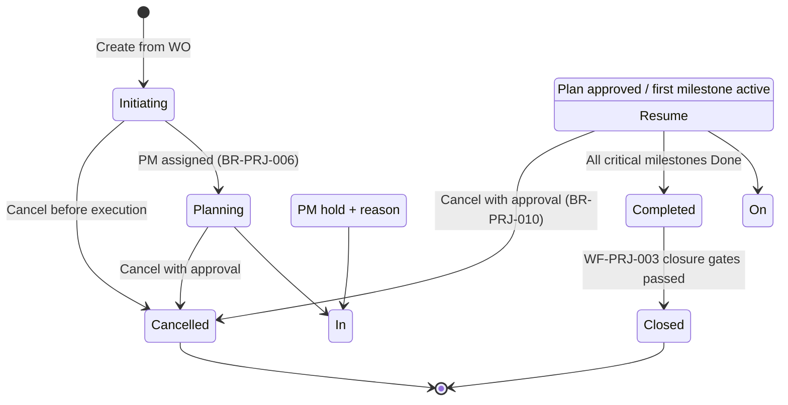
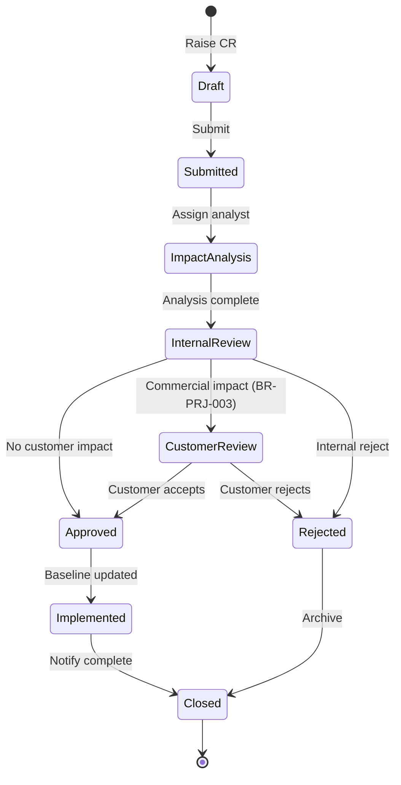
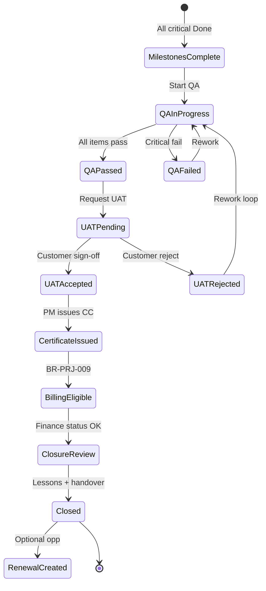
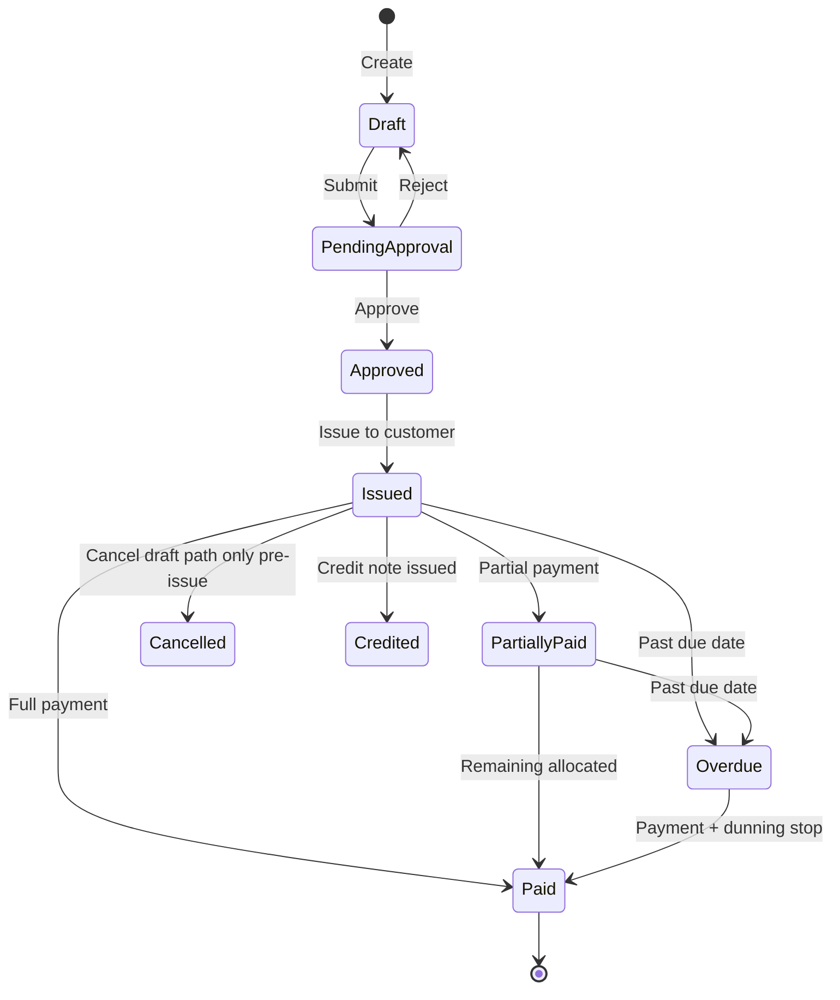
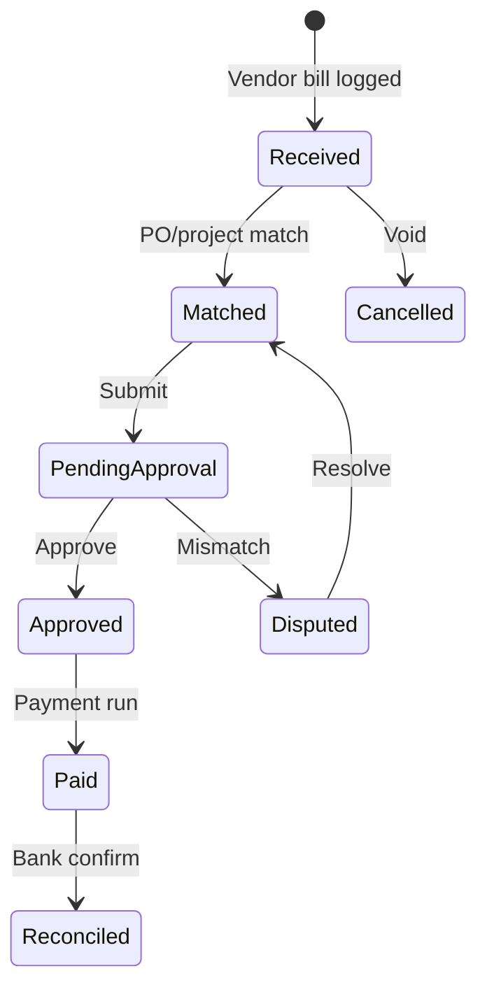
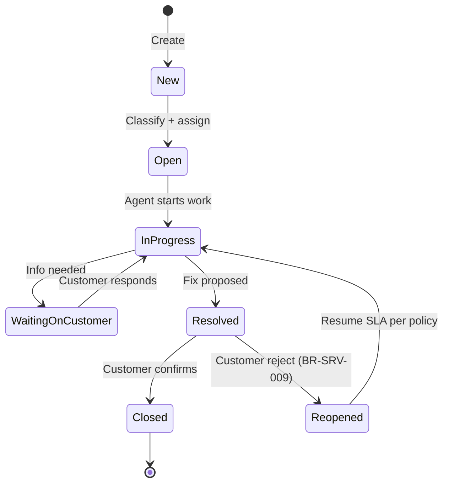
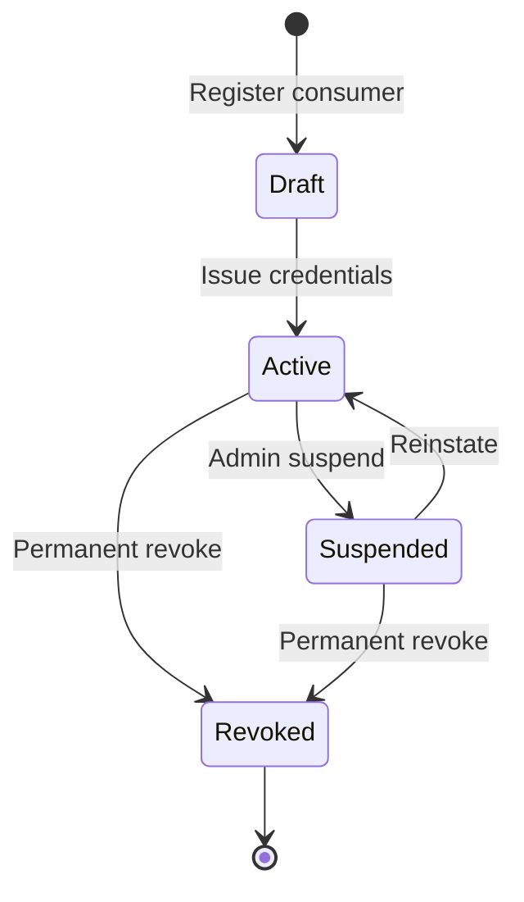
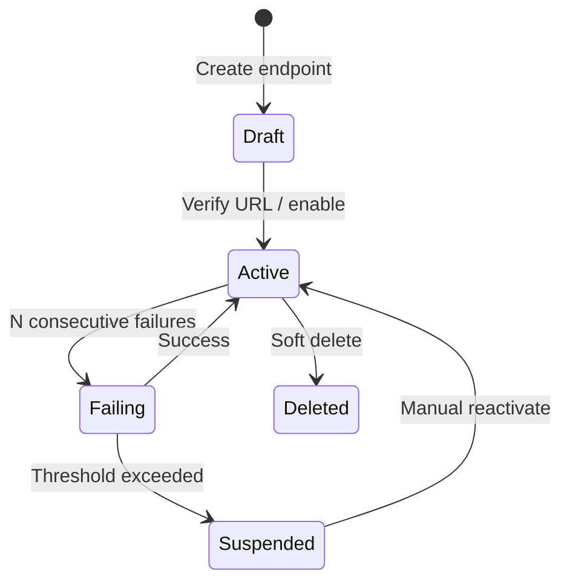
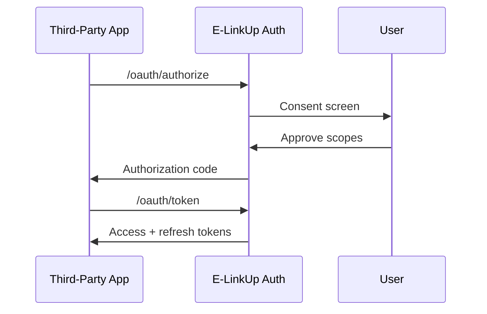
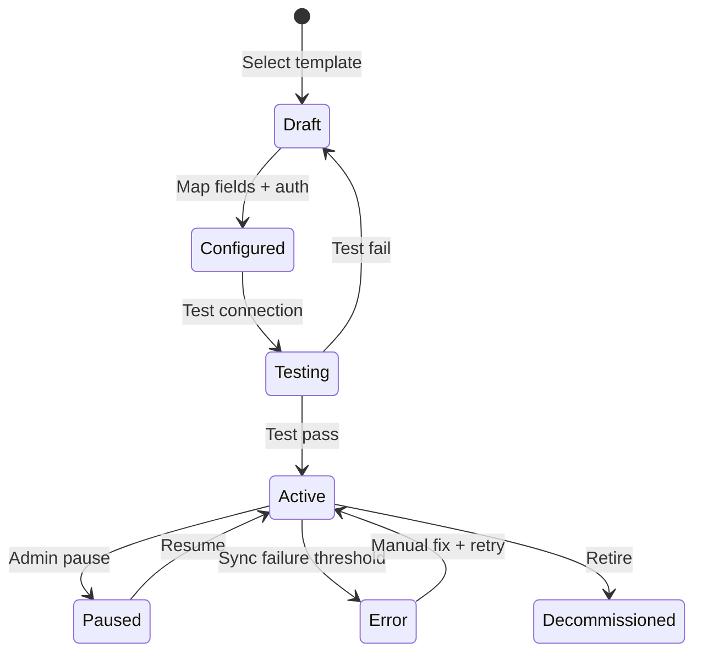

# EFS Enrichment Pack — Projects · Finance · Service · Integration

**Document ID:** EFS-PRJ-FIN-SRV-INT  
**Document Name:** E-LinkUp EFS Workflow Enrichment Blocks (PRJ · FIN · SRV · INT)  
**Version:** 1.0  
**Classification:** Internal Confidential  
**Project:** E-LinkUp (By Euphoria Infotech)  
**Prepared By:** Enterprise Solution Architecture · Senior Business Analyst  
**Document Owner:** PMO  
**Example Tenant:** Euphoria  
**Stack:** Flutter (Web + Android) · Python FastAPI · PostgreSQL · JWT + Refresh Token · Docker  
**Parent Document:** ELU-EFS-001-Enterprise-Functional-Specification.md  
**Related BFS Packs:** ELU-BFS-PRJ · ELU-BFS-FIN · ELU-BFS-SRV · ELU-BFS-INT  
**Related Documents:** ELU-DF-001, ELU-SAD-001, ELU-WF-001

---

## Purpose

This document supplies **implementation-ready EFS enrichment blocks** that extend the base workflow narratives in ELU-EFS-001 §§6–8 and §10. Each workflow includes fifteen mandatory enrichment sections (Traceability through Future Enhancement).

**Enrichment section convention:**

| Code | Section |
|------|---------|
| A1 / `.1` | Workflow Traceability |
| A2 / `.2` | Inputs & Outputs |
| A3 / `.3` | State Machine & Transitions |
| A4 / `.4` | Ownership & RACI |
| A5 / `.5` | Exception Handling |
| A6 / `.6` | Timing & SLAs |
| A7 / `.7` | Database Objects |
| A8 / `.8` | API Contracts |
| A9 / `.9` | Flutter UI Surfaces |
| A10 / `.10` | Notifications |
| A11 / `.11` | Reporting & Analytics |
| A12 / `.12` | Security & Permissions |
| A13 / `.13` | Audit Requirements |
| A14 / `.14` | Acceptance Criteria |
| A15 / `.15` | Future Enhancements |

**HTML markers** (`<!-- EFS:WF-* -->`) enable automated merge into ELU-EFS-001.

**API prefixes:** `/api/v1/projects/` · `/api/v1/finance/` · `/api/v1/service/` · `/api/v1/integration/`

---

## 6. Project Workflows — EFS Enrichments

### 6.1 WF-PRJ-001 — Project Planning & Execution

<!-- EFS:WF-PRJ-001 -->

#### 6.1.A1 Workflow Traceability

| Trace Item | Reference |
|------------|-----------|
| **Workflow ID** | WF-PRJ-001 |
| **EFS Parent** | ELU-EFS-001 §6.1 |
| **BFS Pack** | ELU-BFS-PRJ |
| **Modules** | PRJ-001 Project · PRJ-002 Milestone · PRJ-003 Task · PRJ-004 Timesheet · PRJ-005 Issue |
| **Upstream** | SAL-004 Work Order (approved) → Project creation (BR-PRJ-004) |
| **Downstream** | WF-PRJ-003 Completion → WF-FIN-001 Billing eligibility (BR-PRJ-009) |
| **Business Rules** | BR-PRJ-004–007, BR-PRJ-011–020 |
| **Engines** | CPS-001 Workflow · CPS-002 Rule · CPS-003 Notification · CPS-004 Reporting · CPS-005 Audit |
| **Act** | Act III — Deliver |
| **Phase / Release** | Phase 2 · v1.0 |
| **Tenant** | Euphoria (Enterprise) |

#### 6.1.A2 Inputs & Outputs

| Direction | Object / Event | Source | Consumer | Validation |
|-----------|----------------|--------|----------|------------|
| **In** | Approved Work Order | SAL-004 | PRJ-001 | WO status = Approved; customer linked |
| **In** | Sales Order reference | SAL-003 | PRJ-001 | Optional; inherited from WO |
| **In** | PM assignment | Tenant User | PRJ-001 | Active user with `project.assign` |
| **In** | Milestone plan | PRJ-002 | Workflow Engine | Dates within project range (BR-PRJ-011) |
| **In** | Task WBS | PRJ-003 | PRJ-002 | Parent milestone exists |
| **In** | Timesheet entries | PRJ-004 | Finance (billable flag) | Hours > 0; project In Progress |
| **In** | Issues | PRJ-005 | PM / Team | Linked to project |
| **Out** | Project record | PRJ-001 | Dashboards, FIN | `project` row + status history |
| **Out** | RAG status | Rule Engine | CPS-004 | Green/Amber/Red per variance rules |
| **Out** | Billable hours export | PRJ-004 | WF-FIN-001 | Optional milestone billing trigger |
| **Out** | `billing_eligible` flag | BR-PRJ-009 | WF-FIN-001 | Set only via WF-PRJ-003 |

#### 6.1.A3 State Machine & Transitions

**Primary states:** `Initiating → Planning → In Progress → On Hold → Completed → Closed → Cancelled`

| Transition | Actor | Guard | Side Effect |
|------------|-------|-------|-------------|
| → Planning | PM / System | `project_manager_id` set | Notify team roster |
| → In Progress | PM | ≥1 milestone planned | Lock baseline v1 (BR-PRJ-007) |
| → On Hold | PM | Reason mandatory | Pause timesheet billing |
| → Completed | System / PM | Critical milestones = Done | Enable QA gate (WF-PRJ-003) |
| → Closed | PM / Tenant Admin | QA + UAT + certificate + finance check | Archive, renewal opp |
| → Cancelled | PM + Sales Mgr | Approval if In Progress | No certificate allowed |

#### 6.1.A4 Ownership & RACI

| Activity | PM | Team Member | Sales Mgr | Finance User | Customer Contact | System |
|----------|:--:|:-----------:|:---------:|:------------:|:----------------:|:------:|
| Create project | R | I | C | I | — | A (WO link) |
| Plan milestones/tasks | A/R | R | I | I | — | C |
| Execute / update progress | A | R | — | — | — | C |
| Timesheet approve | A | C | — | I | — | — |
| Issue management | A | R | I | — | C | — |
| RAG / health review | A/R | I | C | I | — | C |
| Hold / resume | A/R | I | C | — | — | — |
| Cancel project | A | I | A | I | C | — |

*R = Responsible · A = Accountable · C = Consulted · I = Informed*

#### 6.1.A5 Exception Handling

| Exception | Trigger | System Response | Recovery |
|-----------|---------|-----------------|----------|
| E-PRJ-001 | WO not approved | Block create; HTTP 422 | Approve WO in SAL-004 |
| E-PRJ-002 | Duplicate active project per WO (BR-PRJ-005) | Block; policy message | Close/cancel existing or override (Tenant Admin) |
| E-PRJ-003 | PM not assigned before Planning | Block transition | Assign PM |
| E-PRJ-004 | Milestone date outside project range | Validation error | Adjust dates |
| E-PRJ-005 | Baseline change without CR | Block schedule/cost edit | Raise WF-PRJ-002 CR |
| E-PRJ-006 | Timesheet on On Hold project | Warning or block per tenant | Resume project |
| E-PRJ-007 | Cancel with open critical milestones | Require approval + reason | Workflow approval path |

#### 6.1.A6 Timing & SLAs

| Timer | Default (Euphoria) | Owner | Escalation |
|-------|-------------------|-------|------------|
| Project initiation after WO approval | 5 business days | Sales Mgr → PM | Notification day 3 |
| Planning completion | 10 business days from Initiating | PM | Amber RAG at day 8 |
| Milestone overdue | Per milestone `due_date` | PM | Daily digest to PM + Sales Mgr |
| Timesheet submission | Weekly (Mon cutoff) | Team Member | Manager reminder Fri |
| Timesheet approval | 2 business days | PM | Escalate to Sales Mgr day 3 |
| Issue resolution (critical) | 48 hours | Assignee | Escalate to PM at breach |

#### 6.1.A7 Database Objects

| Table | Role | WF-PRJ-001 Usage |
|-------|------|------------------|
| `project` | Master | Lifecycle header; links WO, SO, customer |
| `project_baseline` | Versioned snapshot | Locked at plan approval |
| `project_team_member` | Roster | PM + team assignments |
| `project_status_history` | Audit | All state transitions |
| `milestone` | Child | Planning & execution tracking |
| `task` | Child | WBS execution |
| `timesheet` / `timesheet_line` | Child | Effort capture |
| `issue` | Child | Delivery impediments |
| `work_order` | FK (SAL) | Creation source |

**Key columns on `project`:** `status`, `rag_status`, `project_manager_id`, `work_order_id`, `billing_eligible`, `planned_start`, `planned_end`, `actual_start`, `actual_end`.

#### 6.1.A8 API Contracts

**Base path:** `/api/v1/projects`

| Method | Endpoint | Purpose | Permission |
|--------|----------|---------|------------|
| POST | `/projects` | Create project | `project.create` |
| POST | `/projects/from-work-order/{wo_id}` | Create from WO | `project.create` |
| GET | `/projects` | List / filter | `project.read` |
| GET | `/projects/{id}` | Detail | `project.read` |
| PATCH | `/projects/{id}/status` | State transition | `project.submit` |
| POST | `/projects/{id}/team` | Add team member | `project.assign` |
| GET | `/projects/{id}/milestones` | List milestones | `milestone.read` |
| POST | `/projects/{id}/milestones` | Create milestone | `milestone.create` |
| GET | `/projects/{id}/tasks` | List tasks | `task.read` |
| POST | `/projects/{id}/timesheets` | Submit timesheet | `timesheet.create` |
| POST | `/projects/{id}/issues` | Raise issue | `issue.create` |
| GET | `/projects/{id}/health` | RAG + variance | `project.read` |

**Event payloads (internal bus):** `project.created`, `project.status_changed`, `milestone.completed`, `timesheet.approved`, `issue.resolved`.

#### 6.1.A9 Flutter UI Surfaces

| Route | Screen | Primary Actor | Key Actions |
|-------|--------|---------------|-------------|
| `/projects` | Project List | PM, Team | Filter, create, export |
| `/projects/{id}` | Project Detail | PM | Status, RAG, tabs |
| `/projects/{id}/plan` | Planning Board | PM | Milestones, Gantt-lite |
| `/projects/{id}/tasks` | Task Board | PM, Team | Kanban / list |
| `/projects/{id}/timesheets` | Timesheets | Team, PM | Log, submit, approve |
| `/projects/{id}/issues` | Issues | All | Create, assign, resolve |
| `/projects/new` | Create Wizard | PM | WO picker, PM assign |
| `/projects/dashboard` | Portfolio Dashboard | Sales Mgr, PM | RAG summary |

**Mobile (Android):** Timesheet entry, task update, issue photo attach — offline queue with sync.

#### 6.1.A10 Notifications

| Event | Recipients | Channel | Template ID |
|-------|------------|---------|-------------|
| `project.created` | PM, Team | In-app, Email | NTF-PRJ-001 |
| `project.assigned` | Team Member | In-app | NTF-PRJ-002 |
| `milestone.overdue` | PM, Sales Mgr | In-app, Email | NTF-PRJ-003 |
| `timesheet.submitted` | PM | In-app | NTF-PRJ-004 |
| `timesheet.rejected` | Team Member | In-app, Email | NTF-PRJ-005 |
| `issue.critical` | PM, Assignee | In-app, Email | NTF-PRJ-006 |
| `project.on_hold` | Team, Sales Mgr | In-app | NTF-PRJ-007 |
| `rag.amber_red` | PM, Sales Mgr | In-app, Email | NTF-PRJ-008 |

#### 6.1.A11 Reporting & Analytics

| Report ID | Name | Dimensions | WF Hook |
|-----------|------|------------|---------|
| RPT-PRJ-001 | Project Portfolio Health | Status, RAG, PM | Live |
| RPT-PRJ-002 | Milestone Variance | Planned vs actual | Milestone complete |
| RPT-PRJ-003 | Resource Utilisation | User, project, billable % | Timesheet approved |
| RPT-PRJ-004 | Issue Aging | Priority, age | Issue open |
| RPT-PRJ-005 | WO-to-Project Cycle Time | WO approve → project start | Project created |

#### 6.1.A12 Security & Permissions

| Permission | Scope | Roles (Euphoria) |
|------------|-------|------------------|
| `project.create` | Tenant | PM, Sales Mgr, Tenant Admin |
| `project.read` | Tenant / own team | PM, Team, Sales, Finance |
| `project.update` | Assigned projects | PM |
| `project.submit` | Status transitions | PM |
| `project.assign` | Team roster | PM |
| `project.delete` | Soft delete Draft only | Tenant Admin |
| `project.export` | CSV/XLSX | PM, Sales Mgr |
| `milestone.*` | Child of project | PM (create), Team (read) |
| `timesheet.approve` | Project team | PM |

**Row-level security:** Team members see assigned projects only; Finance sees billing-related fields on permitted projects.

#### 6.1.A13 Audit Requirements

| Action | Audit Fields | Retention |
|--------|--------------|-----------|
| Project create/update | old/new JSON, actor, WO link | `tenant_security.audit_log_retention_days` |
| Status transition | from_status, to_status, reason | Permanent for Closed/Cancelled |
| Baseline lock | baseline_version, snapshot hash | Permanent |
| Team assignment | user_id, role, action | Standard |
| Timesheet approval | hours, billable flag, approver | 7 years (finance link) |

#### 6.1.A14 Acceptance Criteria

1. PM creates Project from approved WO; duplicate WO blocked per BR-PRJ-005.  
2. State machine enforces PM assignment before Planning.  
3. Milestones and tasks roll up % complete to project health.  
4. Timesheet submit → approve flow updates billable hours.  
5. Critical milestone completion enables WF-PRJ-003 QA path.  
6. RAG dashboard reflects schedule/cost variance within 5 min of update.  
7. All transitions appear in `project_status_history` and audit log.  
8. API returns 422 with rule ID on BR-PRJ violations.

#### 6.1.A15 Future Enhancements

| ID | Enhancement | Phase |
|----|-------------|-------|
| FE-PRJ-001 | Full Gantt + critical path (CPM) | v1.5 |
| FE-PRJ-002 | Resource levelling across portfolio | v2.0 |
| FE-PRJ-003 | Earned Value Management (EVM) | v2.0 |
| FE-PRJ-004 | MS Project / Primavera import | v2.0 |
| FE-PRJ-005 | AI risk prediction from issue patterns | v3.0 |

---

### 6.2 WF-PRJ-002 — Change Request Control

<!-- EFS:WF-PRJ-002 -->

#### 6.2.A1 Workflow Traceability

| Trace Item | Reference |
|------------|-----------|
| **Workflow ID** | WF-PRJ-002 |
| **EFS Parent** | ELU-EFS-001 §6.2 |
| **BFS Pack** | ELU-BFS-PRJ § PRJ-006 |
| **Module** | PRJ-006 Change Request Management |
| **Upstream** | WF-PRJ-001 (active project, locked baseline) |
| **Downstream** | Baseline revision · optional SAL variation · WF-FIN-001 cost impact |
| **Business Rules** | BR-PRJ-001–003, BR-PRJ-007 |
| **Engines** | CPS-001 Workflow · CPS-002 Rule · CPS-003 Notification · CPS-005 Audit |
| **Tenant** | Euphoria |

#### 6.2.A2 Inputs & Outputs

| Direction | Object | Source | Consumer |
|-----------|--------|--------|----------|
| **In** | Change trigger (scope/schedule/cost) | PM, Team, Customer | CR form |
| **In** | Impact analysis | PM, Pre-Sales | CR record |
| **In** | Internal approval | Sales Mgr, Finance | Workflow |
| **In** | Customer acceptance | Customer Contact | Portal / document |
| **Out** | Approved CR | PRJ-006 | Baseline service |
| **Out** | `project_baseline` vN+1 | System | PRJ-001 schedule/cost |
| **Out** | Variation quotation (optional) | SAL | New SO line / WO amendment |
| **Out** | Stakeholder notifications | CPS-003 | PM, Sales, Finance, Customer |

#### 6.2.A3 State Machine & Transitions

**CR states:** `Draft → Submitted → Impact Analysis → Internal Review → Customer Review → Approved → Implemented → Rejected → Closed`

#### 6.2.A4 Ownership & RACI

| Activity | PM | Sales Mgr | Finance | Customer | Pre-Sales | System |
|----------|:--:|:---------:|:-------:|:--------:|:---------:|:------:|
| Raise CR | R | I | I | C | — | — |
| Impact analysis | A/R | C | C | — | R | — |
| Internal approval | C | A/R | R (cost) | — | C | — |
| Customer approval | C | R | I | A/R | — | — |
| Baseline update | I | I | I | — | — | A/R |
| Variation quote | C | A | R | C | R | — |

#### 6.2.A5 Exception Handling

| Exception | Response |
|-----------|----------|
| CR on Cancelled/Closed project | Block; HTTP 409 |
| Baseline edit without approved CR | Block per BR-PRJ-001 |
| Cost impact without Finance ack | Hold at Internal Review (BR-PRJ-002) |
| Customer impact without signed doc | Block approval (BR-PRJ-003) |
| Concurrent CRs on same baseline | Optimistic lock; second submit retries |

#### 6.2.A6 Timing & SLAs

| Stage | SLA (Euphoria) | Escalation |
|-------|----------------|------------|
| Impact analysis | 3 business days | PM → Sales Mgr |
| Internal review | 2 business days | Pending approval digest |
| Customer review | 10 business days | Reminder day 5, 9 |
| Implementation after approval | 1 business day | Auto-job |

#### 6.2.A7 Database Objects

| Table | Role |
|-------|------|
| `change_request` | CR header: type, impact, status |
| `change_request_impact` | Effort, cost, schedule delta |
| `change_request_approval` | Approval chain decisions |
| `change_request_document` | Customer sign-off evidence |
| `project_baseline` | New version on Implemented |

#### 6.2.A8 API Contracts

**Base path:** `/api/v1/projects`

| Method | Endpoint | Permission |
|--------|----------|------------|
| POST | `/projects/{id}/change-requests` | `change_request.create` |
| GET | `/projects/{id}/change-requests` | `change_request.read` |
| GET | `/change-requests/{cr_id}` | `change_request.read` |
| PATCH | `/change-requests/{cr_id}` | `change_request.update` |
| POST | `/change-requests/{cr_id}/submit` | `change_request.submit` |
| POST | `/change-requests/{cr_id}/approve` | `change_request.approve` |
| POST | `/change-requests/{cr_id}/reject` | `change_request.reject` |
| POST | `/change-requests/{cr_id}/implement` | `change_request.implement` |

#### 6.2.A9 Flutter UI Surfaces

| Route | Screen |
|-------|--------|
| `/projects/{id}/change-requests` | CR list |
| `/projects/{id}/change-requests/new` | Raise CR wizard |
| `/change-requests/{cr_id}` | CR detail + approval timeline |
| `/portal/change-requests/{cr_id}` | Customer acceptance (external) |

#### 6.2.A10 Notifications

| Event | Recipients |
|-------|------------|
| `change_request.submitted` | Sales Mgr, Finance (if cost) |
| `change_request.pending_customer` | Customer Contact |
| `change_request.approved` | PM, Team, Finance |
| `change_request.rejected` | PM, requester |
| `change_request.implemented` | All stakeholders |

#### 6.2.A11 Reporting & Analytics

| Report | Purpose |
|--------|---------|
| RPT-PRJ-010 | CR volume by project/month |
| RPT-PRJ-011 | CR approval cycle time |
| RPT-PRJ-012 | Cost impact summary (Finance) |

#### 6.2.A12 Security & Permissions

`change_request.create`, `.read`, `.update`, `.submit`, `.approve`, `.implement` — PM creates; Sales Mgr approves; Finance ack on cost; Customer portal scoped to own CRs.

#### 6.2.A13 Audit Requirements

Immutable approval decisions; customer acceptance document hash stored; baseline version linked to `change_request_id`.

#### 6.2.A14 Acceptance Criteria

1. No baseline mutation without Approved → Implemented CR.  
2. Cost-impacting CR requires Finance acknowledgement before final approval.  
3. Customer-facing CR captures signed evidence.  
4. Implemented CR creates `project_baseline` version increment.  
5. Rejected CR does not alter baseline.

#### 6.2.A15 Future Enhancements

- FE-PRJ-010: CR template library by project type  
- FE-PRJ-011: Auto impact estimate from historical similar CRs  
- FE-PRJ-012: Integration with e-signature provider (INT-004)

---

### 6.3 WF-PRJ-003 — Completion, Closure & Renewal

<!-- EFS:WF-PRJ-003 -->

#### 6.3.A1 Workflow Traceability

| Trace Item | Reference |
|------------|-----------|
| **Workflow ID** | WF-PRJ-003 |
| **EFS Parent** | ELU-EFS-001 §6.3 |
| **BFS Pack** | ELU-BFS-PRJ (PRJ-001 completion artefacts) |
| **Upstream** | WF-PRJ-001 (critical milestones Done) |
| **Downstream** | WF-FIN-001 (`billing_eligible`), WF-SRV-001 (AMC handover), CRM renewal opportunity |
| **Business Rules** | BR-PRJ-008–010, BR-PRJ-009 |
| **Tenant** | Euphoria |

#### 6.3.A2 Inputs & Outputs

| Direction | Object | Notes |
|-----------|--------|-------|
| **In** | Critical milestones complete | System gate |
| **In** | QA checklist results | `project_qa_checklist` |
| **In** | UAT sign-off | `project_uat_signoff` |
| **In** | Lessons learned | Optional text |
| **Out** | Completion Certificate | `project_completion_certificate` |
| **Out** | `billing_eligible = true` | BR-PRJ-009 |
| **Out** | Project status Closed | After finance check |
| **Out** | Renewal Opportunity | CRM-002 |
| **Out** | Support handover record | WF-SRV-001 entitlement |

#### 6.3.A3 State Machine & Transitions

#### 6.3.A4 Ownership & RACI

| Gate | PM | Customer | Finance | Support | System |
|------|:--:|:--------:|:-------:|:-------:|:------:|
| QA checklist | A/R | — | — | — | — |
| UAT sign-off | C | A/R | — | — | — |
| Completion Certificate | A/R | C | I | — | R (number) |
| Billing eligibility | I | — | R | — | A |
| Closure | A/R | — | C | C | — |
| Renewal opp | C | — | — | — | R |

#### 6.3.A5 Exception Handling

| Exception | Response |
|-----------|----------|
| QA fail on critical item | Block UAT; notify PM |
| UAT rejected | Return to execution; optional CR (WF-PRJ-002) |
| Certificate on cancelled project | Block BR-PRJ-010 |
| Close with open invoices | Warning; configurable block |
| Missing lessons learned | Warning only (tenant policy) |

#### 6.3.A6 Timing & SLAs

| Stage | SLA |
|-------|-----|
| QA after milestone complete | 3 business days |
| UAT window | 10 business days |
| Certificate issuance after UAT | 2 business days |
| Billing eligibility visibility | Immediate (async < 30s) |
| Closure after final invoice | 30 days (configurable) |

#### 6.3.A7 Database Objects

| Table | Role |
|-------|------|
| `project_qa_checklist` | QA gate |
| `project_qa_checklist_item` | Line items |
| `project_uat_signoff` | Customer acceptance |
| `project_completion_certificate` | Formal CC record |
| `project` | `billing_eligible`, `closed_at` |
| `opportunity` (CRM) | Renewal record |

#### 6.3.A8 API Contracts

| Method | Endpoint | Permission |
|--------|----------|------------|
| POST | `/projects/{id}/qa-checklist` | `project.submit` |
| PATCH | `/projects/{id}/qa-checklist` | `project.update` |
| POST | `/projects/{id}/uat-signoff` | `project.submit` |
| POST | `/projects/{id}/completion-certificate` | `project.submit` |
| GET | `/projects/{id}/completion-certificate/pdf` | `project.read` |
| POST | `/projects/{id}/close` | `project.submit` |
| POST | `/projects/{id}/renewal-opportunity` | `project.create` |

#### 6.3.A9 Flutter UI Surfaces

| Route | Screen |
|-------|--------|
| `/projects/{id}/qa` | QA checklist |
| `/projects/{id}/uat` | UAT request & status |
| `/projects/{id}/certificate` | CC preview & issue |
| `/projects/{id}/closure` | Closure wizard |
| `/portal/projects/{id}/uat` | Customer UAT sign-off |

#### 6.3.A10 Notifications

| Event | Recipients |
|-------|------------|
| `qa.ready` | PM |
| `uat.requested` | Customer Contact |
| `uat.accepted` / `uat.rejected` | PM, Sales Mgr |
| `completion_certificate.issued` | Customer, Finance |
| `billing_eligible` | Finance User |
| `project.closed` | Team, Support |

#### 6.3.A11 Reporting & Analytics

| Report | Purpose |
|--------|---------|
| RPT-PRJ-020 | Delivery-to-billing cycle time |
| RPT-PRJ-021 | UAT pass rate |
| RPT-PRJ-022 | Renewal conversion from closed projects |

#### 6.3.A12 Security & Permissions

QA/UAT: PM executes QA; Customer portal for UAT only on assigned projects. Certificate issuance: PM + `project.submit`. Finance reads `billing_eligible` queue via `invoice.read`.

#### 6.3.A13 Audit Requirements

Certificate PDF hash stored; UAT sign-off captures IP, timestamp, user; `billing_eligible` transition audited with BR-PRJ-009 reference.

#### 6.3.A14 Acceptance Criteria

1. Certificate blocked until QA passed and UAT accepted.  
2. `billing_eligible` set only after certificate issued.  
3. Finance workbench shows project within 30s.  
4. Closed project cannot reopen without Tenant Admin override.  
5. Renewal opportunity created with project/customer linkage.

#### 6.3.A15 Future Enhancements

- FE-PRJ-020: Automated QA from test case integration  
- FE-PRJ-021: Customer portal video walkthrough for UAT  
- FE-PRJ-022: Auto AMC ticket queue creation on handover

---

## 7. Finance Workflows — EFS Enrichments

### 7.1 WF-FIN-001 — Customer Invoicing & Collections

<!-- EFS:WF-FIN-001 -->

#### 7.1.A1 Workflow Traceability

| Trace Item | Reference |
|------------|-----------|
| **Workflow ID** | WF-FIN-001 |
| **EFS Parent** | ELU-EFS-001 §7.1 |
| **BFS Pack** | ELU-BFS-FIN (FIN-001, FIN-002, FIN-004) |
| **Upstream** | WF-PRJ-003 billing eligibility · SAL-003 SO schedule · manual |
| **Business Rules** | BR-FIN-001–035, BR-FIN-040–048 |
| **Tenant** | Euphoria |

#### 7.1.A2 Inputs & Outputs

| Direction | Object | Source |
|-----------|--------|--------|
| **In** | Billing trigger | Milestone, SO, project, manual |
| **In** | Customer / tax masters | CRM, FIN-004 |
| **In** | Payment receipt | Bank, manual entry |
| **Out** | Invoice (Draft → Issued) | Customer |
| **Out** | Credit Note | Adjustment |
| **Out** | Payment allocation | Invoice balance |
| **Out** | Dunning notices | Overdue invoices |

#### 7.1.A3 State Machine & Transitions

**Invoice states:** `Draft → Pending Approval → Approved → Issued → Partially Paid → Paid → Overdue → Cancelled / Credited`

#### 7.1.A4 Ownership & RACI

| Activity | Finance User | Sales Mgr | Customer | System |
|----------|:------------:|:---------:|:--------:|:------:|
| Create draft | R | — | — | C |
| Approve invoice | R/A | A (threshold) | — | — |
| Issue invoice | R | — | I | R (PDF/email) |
| Record payment | R | — | — | — |
| Allocate payment | R | — | — | C |
| Dunning | R | I | R (recipient) | A |
| Credit note | R | C | I | — |

#### 7.1.A5 Exception Handling

| Exception | Rule | Response |
|-----------|------|----------|
| Missing billing source | BR-FIN-001 | 422 validation |
| Tax override | BR-FIN-002 | Audit + approval |
| Edit issued invoice | BR-FIN-003 | Block; credit note path |
| Unallocated payment | BR-FIN-004 | Hold in unallocated queue |
| GST invalid | BR-FIN-040+ | Block issue |

#### 7.1.A6 Timing & SLAs

| Timer | Default |
|-------|---------|
| Draft → submit after billing trigger | 2 business days |
| Approval pending | 1 business day |
| Issue after approval | Same day |
| Dunning reminder 1 | Due + 7 days |
| Dunning escalation | Due + 21 days → Sales Mgr |

#### 7.1.A7 Database Objects

`invoice`, `invoice_line`, `invoice_tax_line`, `invoice_billing_source`, `invoice_status_history`, `payment_receipt`, `payment_allocation`, `credit_note`, `dunning_log`, `invoice_number_sequence`.

#### 7.1.A8 API Contracts

**Base path:** `/api/v1/finance`

| Method | Endpoint | Permission |
|--------|----------|------------|
| GET | `/billing-eligibility` | `invoice.read` |
| POST | `/invoices` | `invoice.create` |
| POST | `/invoices/from-milestone/{id}` | `invoice.create` |
| POST | `/invoices/{id}/submit` | `invoice.submit` |
| POST | `/invoices/{id}/approve` | `invoice.approve` |
| POST | `/invoices/{id}/issue` | `invoice.issue` |
| GET | `/invoices/{id}/pdf` | `invoice.print` |
| POST | `/payments` | `payment.create` |
| POST | `/payments/{id}/allocate` | `payment.allocate` |
| GET | `/invoices/ageing` | `invoice.read` |

#### 7.1.A9 Flutter UI Surfaces

| Route | Screen |
|-------|--------|
| `/finance/billing-workbench` | Eligible projects/milestones |
| `/finance/invoices` | Invoice register |
| `/finance/invoices/{id}` | Invoice detail |
| `/finance/payments` | Receipt entry |
| `/finance/payments/allocate` | Allocation UI |
| `/finance/dunning` | Overdue queue |
| `/portal/invoices` | Customer invoice view |

#### 7.1.A10 Notifications

`invoice.pending_approval`, `invoice.issued`, `payment.received`, `invoice.overdue`, `dunning.reminder`, `dunning.escalation` — Finance, Customer, Sales Mgr per event matrix in ELU-NTF-FIN.

#### 7.1.A11 Reporting & Analytics

RPT-FIN-001 Invoice Register · RPT-FIN-002 Ageing · RPT-FIN-003 Collections · RPT-FIN-004 GST Summary · RPT-FIN-005 Dunning Effectiveness.

#### 7.1.A12 Security & Permissions

Segregation: creator ≠ approver on same invoice (configurable). `invoice.approve` threshold routing to Sales Mgr. Customer portal read-only on own invoices.

#### 7.1.A13 Audit Requirements

Issued invoice immutability; tax override reason; payment allocation reversals; dunning send log with template version.

#### 7.1.A14 Acceptance Criteria

1. Invoice from billing-eligible project pre-fills customer and lines.  
2. GST computed per FIN-004; issue blocked on validation fail.  
3. Payment allocation updates status to Paid/Partially Paid.  
4. Dunning fires per BR-FIN-031 schedule.  
5. Credit note reduces open balance correctly.

#### 7.1.A15 Future Enhancements

- FE-FIN-001: Payment gateway integration (Razorpay/Stripe)  
- FE-FIN-002: E-invoice IRN (India GST portal via INT-004)  
- FE-FIN-003: AI cash-flow prediction

---

### 7.2 WF-FIN-002 — Vendor Settlement

<!-- EFS:WF-FIN-002 -->

#### 7.2.A1 Workflow Traceability

| Trace Item | Reference |
|------------|-----------|
| **Workflow ID** | WF-FIN-002 |
| **EFS Parent** | ELU-EFS-001 §7.2 |
| **BFS Pack** | ELU-BFS-FIN (FIN-003, FIN-004 TDS) |
| **Business Rules** | BR-FIN-036–039, BR-FIN-049–055 |
| **Tenant** | Euphoria (Enterprise) |

#### 7.2.A2 Inputs & Outputs

| **In** | Vendor invoice, PO/WO match, approval |
| **Out** | Vendor payment, TDS certificate, reconciled ledger entry |

#### 7.2.A3 State Machine & Transitions

`Received → Matched → Pending Approval → Approved → Paid → Reconciled → Disputed → Cancelled`

#### 7.2.A4 Ownership & RACI

Finance User (R), Project Manager (C — match), Procurement (C), Tenant Admin (A on threshold).

#### 7.2.A5 Exception Handling

Mismatch PO amount → Disputed; missing TDS PAN → block payment; duplicate vendor invoice number → warning.

#### 7.2.A6 Timing & SLAs

Match within 2 days; approval 1 day; payment per vendor terms (default Net 30).

#### 7.2.A7 Database Objects

`vendor_invoice`, `vendor_payment`, `vendor_payment_line`, `tds_deduction`, `purchase_order` (link), `project_cost_allocation`.

#### 7.2.A8 API Contracts

**Base path:** `/api/v1/finance`

| Method | Endpoint |
|--------|----------|
| POST | `/vendor-invoices` |
| POST | `/vendor-invoices/{id}/match` |
| POST | `/vendor-invoices/{id}/approve` |
| POST | `/vendor-payments` |
| POST | `/vendor-payments/{id}/execute` |
| GET | `/vendor-payments/liability` |

#### 7.2.A9 Flutter UI Surfaces

`/finance/vendor-invoices`, `/finance/vendor-payments`, `/finance/tds-summary`.

#### 7.2.A10 Notifications

`vendor_invoice.received`, `vendor_payment.approved`, `vendor_payment.paid`, `tds.certificate_ready`.

#### 7.2.A11 Reporting & Analytics

RPT-FIN-010 Vendor Liability · RPT-FIN-011 TDS Register · RPT-FIN-012 PO vs actual.

#### 7.2.A12 Security & Permissions

`vendor_invoice.*`, `vendor_payment.approve`, `vendor_payment.execute` — Finance only; PM read on matched projects.

#### 7.2.A13 Audit Requirements

TDS rate snapshot; payment bank reference; match audit trail to PO line.

#### 7.2.A14 Acceptance Criteria

1. Three-way match (PO, receipt, invoice) when PO exists.  
2. TDS deducted per FIN-004 before payment.  
3. Project cost updated on payment allocation.  
4. Paid vendor invoice immutable.

#### 7.2.A15 Future Enhancements

- FE-FIN-010: Vendor portal for invoice upload  
- FE-FIN-011: Bank payment file (NEFT/RTGS batch)  
- FE-FIN-012: OCR invoice capture

---

## 8. Service Workflows — EFS Enrichments

### 8.1 WF-SRV-001 — Ticket Lifecycle & SLA

<!-- EFS:WF-SRV-001 -->

#### 8.1.A1 Workflow Traceability

| Trace Item | Reference |
|------------|-----------|
| **Workflow ID** | WF-SRV-001 |
| **EFS Parent** | ELU-EFS-001 §8.1 |
| **BFS Pack** | ELU-BFS-SRV (SRV-001–003) |
| **Upstream** | WF-PRJ-003 handover, CRM Customer |
| **Business Rules** | BR-SRV-001–020 |
| **Phase** | Phase 3 · v1.5 |
| **Tenant** | Euphoria |

#### 8.1.A2 Inputs & Outputs

| **In** | Ticket (portal/email/phone/internal), classification, SLA policy |
| **Out** | Resolved/closed ticket, SLA outcome, KB link, escalation events |

#### 8.1.A3 State Machine & Transitions

`New → Open → In Progress → Waiting on Customer → Resolved → Closed → Reopened`

#### 8.1.A4 Ownership & RACI

Support Agent (R), Support Manager (A on escalation), Customer Contact (UAT equivalent on confirm), SLA Monitor (System).

#### 8.1.A5 Exception Handling

SLA breach → escalation WF-SRV-001-E1; invalid category → default queue; merge duplicate tickets; entitlement fail → warn + allow override.

#### 8.1.A6 Timing & SLAs

Per `sla_policy`: response target (e.g. 4h P1), resolution target (e.g. 24h P1). Business hours calendar per tenant. Pause timer in Waiting on Customer.

#### 8.1.A7 Database Objects

`ticket`, `ticket_comment`, `ticket_assignment`, `ticket_link`, `ticket_status_history`, `ticket_sla_instance`, `sla_policy`, `sla_breach_log`.

#### 8.1.A8 API Contracts

**Base path:** `/api/v1/service`

| Method | Endpoint | Permission |
|--------|----------|------------|
| POST | `/tickets` | `ticket.create` |
| PATCH | `/tickets/{id}/status` | `ticket.update` |
| PATCH | `/tickets/{id}/assign` | `ticket.assign` |
| POST | `/tickets/{id}/comments` | `ticket.update` |
| GET | `/tickets/my` | `ticket.read` (portal) |
| GET | `/sla/policies` | `sla.read` |

#### 8.1.A9 Flutter UI Surfaces

`/service/tickets`, `/service/tickets/{id}`, `/service/queues`, `/service/sla-dashboard`, `/portal/tickets`, `/portal/tickets/new`.

#### 8.1.A10 Notifications

`ticket.created`, `ticket.assigned`, `ticket.comment`, `sla.warning` (80%), `sla.breached`, `ticket.resolved`, `ticket.closed`.

#### 8.1.A11 Reporting & Analytics

RPT-SRV-001 Ticket Volume · RPT-SRV-002 SLA Compliance · RPT-SRV-003 Agent Performance · RPT-SRV-004 CSAT.

#### 8.1.A12 Security & Permissions

Agent sees queue tickets; Customer portal scoped to own contact; internal comments hidden from portal (`is_public = false`).

#### 8.1.A13 Audit Requirements

Assignment history preserved; SLA clock snapshots; reopen within `ticket_reopen_days` audited.

#### 8.1.A14 Acceptance Criteria

1. SLA timers start on Open with correct policy.  
2. Breach triggers escalation notification within 60s.  
3. Customer confirm closes ticket; reopen within 30 days.  
4. Ticket links to Project/SO when provided.  
5. KB article link optional on resolve.

#### 8.1.A15 Future Enhancements

- FE-SRV-001: Email-to-ticket ingestion  
- FE-SRV-002: AI suggested responses from KB  
- FE-SRV-003: Omnichannel (WhatsApp) via INT-004

---

## 10. Integration Workflows — EFS Enrichments

### 10.1 WF-INT-001 — REST API Consumer Lifecycle

<!-- EFS:WF-INT-001 -->

#### 10.1.1 Workflow Traceability

| Trace Item | Reference |
|------------|-----------|
| **Workflow ID** | WF-INT-001 |
| **Module** | INT-001 REST API Management |
| **BFS Pack** | ELU-BFS-INT § INT-001 |
| **Business Rules** | BR-INT-001–011 |
| **Phase** | Phase 4 · v2.0 |
| **Tenant** | Euphoria (Enterprise) |

#### 10.1.2 Inputs & Outputs

| **In** | Consumer registration, scopes, IP allowlist, rate limit tier |
| **Out** | API key / client credentials, usage metrics, OpenAPI catalogue access |

#### 10.1.3 State Machine & Transitions

`Draft → Active → Suspended → Revoked`

#### 10.1.4 Ownership & RACI

Tenant Admin (A/R), Platform Admin (C on platform limits), System (rate limit enforce, usage collect).

#### 10.1.5 Exception Handling

Scope exceeds edition → 403; rate limit exceeded → 429 with Retry-After; invalid IP → 403; revoked key → 401.

#### 10.1.6 Timing & SLAs

Credential issuance immediate; usage stats lag < 5 min; secret rotation grace period 24h (dual-key).

#### 10.1.7 Database Objects

`api_consumer`, `api_consumer_scope`, `api_consumer_key`, `api_usage_log`, `api_rate_limit_policy`.

#### 10.1.8 API Contracts

**Base path:** `/api/v1/integration`

| Method | Endpoint |
|--------|----------|
| POST | `/api-consumers` |
| GET | `/api-consumers` |
| POST | `/api-consumers/{id}/rotate-secret` |
| PATCH | `/api-consumers/{id}/status` |
| GET | `/api-consumers/{id}/usage` |
| GET | `/openapi` |

External callers use domain APIs (`/api/v1/crm|sales|projects|finance|service/...`) with `X-API-Key` or OAuth bearer per WF-INT-003.

#### 10.1.9 Flutter UI Surfaces

`/admin/integration/api-consumers`, `/admin/integration/api-consumers/{id}`, `/admin/integration/usage-dashboard`, `/admin/integration/openapi-docs`.

#### 10.1.10 Notifications

`api_consumer.created`, `api_consumer.revoked`, `api_usage.threshold_exceeded`, `api_rate_limit.violation`.

#### 10.1.11 Reporting & Analytics

RPT-INT-001 API Usage by Consumer · RPT-INT-002 Error Rate · RPT-INT-003 Top Endpoints.

#### 10.1.12 Security & Permissions

`api_consumer.create|read|update` — Tenant Admin; keys shown once on create; scopes least-privilege per domain object.

#### 10.1.13 Audit Requirements

Key rotation, scope change, suspend/revoke logged with actor; usage logs retained per tenant policy (default 90 days).

#### 10.1.14 Acceptance Criteria

1. Consumer receives scoped key; out-of-scope call returns 403.  
2. Rate limit returns 429.  
3. Revoked key rejected within 60s globally.  
4. Usage dashboard reflects calls within 5 min.  
5. OpenAPI filtered to granted scopes.

#### 10.1.15 Future Enhancements

- FE-INT-001: API marketplace / partner tier billing  
- FE-INT-002: GraphQL gateway  
- FE-INT-003: mTLS client certificates

---

### 10.2 WF-INT-002 — Webhook Subscription & Delivery

<!-- EFS:WF-INT-002 -->

#### 10.2.1 Workflow Traceability

| **Workflow ID** | WF-INT-002 |
| **Module** | INT-002 Webhook Management |
| **Business Rules** | BR-INT-012–019 |
| **BFS** | ELU-BFS-INT § INT-002 |

#### 10.2.2 Inputs & Outputs

| **In** | Endpoint URL, event subscriptions, signing secret |
| **Out** | Signed HTTP POST payloads, delivery logs, dead-letter queue |

#### 10.2.3 State Machine & Transitions

`Draft → Active → Failing → Suspended → Deleted`

#### 10.2.4 Ownership & RACI

Tenant Admin registers; System delivers; Integration ops monitors dead-letter.

#### 10.2.5 Exception Handling

Delivery fail → exponential backoff (1m, 5m, 30m, 2h); max 8 attempts → dead-letter; invalid SSL → suspend; payload > 256KB → split or reject per policy.

#### 10.2.6 Timing & SLAs

Event to first delivery attempt < 60s; retry window 24h; replay API for manual recovery.

#### 10.2.7 Database Objects

`webhook_endpoint`, `webhook_event_subscription`, `webhook_delivery_log`, `webhook_dead_letter`.

#### 10.2.8 API Contracts

| Method | Endpoint |
|--------|----------|
| POST | `/webhooks` |
| POST | `/webhooks/{id}/test` |
| GET | `/webhooks/{id}/deliveries` |
| POST | `/webhooks/{id}/replay/{delivery_id}` |
| GET | `/webhooks/events` |

#### 10.2.9 Flutter UI Surfaces

`/admin/integration/webhooks`, `/admin/integration/webhooks/{id}/deliveries`, `/admin/integration/webhooks/event-catalogue`.

#### 10.2.10 Notifications

`webhook.delivery_failed`, `webhook.endpoint_suspended`, `webhook.dead_letter` → Tenant Admin.

#### 10.2.11 Reporting & Analytics

RPT-INT-010 Delivery Success Rate · RPT-INT-011 Event Volume by Type.

#### 10.2.12 Security & Permissions

HMAC-SHA256 signature header `X-ELU-Signature`; PII masking per BR-INT-019; HTTPS only.

#### 10.2.13 Audit Requirements

Full payload hash stored; replay audited; subscription changes immutable log.

#### 10.2.14 Acceptance Criteria

1. `ticket.created` delivered within 60s with valid signature.  
2. Failed endpoint suspends after configured threshold.  
3. Replay succeeds for idempotent consumers.  
4. Max 20 active webhooks per tenant (BR-INT-012).

#### 10.2.15 Future Enhancements

- FE-INT-010: Event filtering expressions  
- FE-INT-011: Webhook batching  
- FE-INT-012: SNS/SQS bridge connector

---

### 10.3 WF-INT-003 — OAuth 2.0 Delegated Authorization

<!-- EFS:WF-INT-003 -->

#### 10.3.1 Workflow Traceability

| **Workflow ID** | WF-INT-003 |
| **Module** | INT-003 OAuth Management |
| **Business Rules** | BR-INT-020–028 |
| **Flows** | Authorization Code + PKCE, Client Credentials |

#### 10.3.2 Inputs & Outputs

| **In** | Client registration, redirect URIs, scopes, user consent |
| **Out** | Authorization code, access token, refresh token |

#### 10.3.3 State Machine & Transitions

**Client:** `Draft → Active → Rotated → Revoked`  
**Token:** `Issued → Refreshed → Expired → Revoked`

#### 10.3.4 Ownership & RACI

Tenant Admin manages clients; User grants consent; System issues tokens.

#### 10.3.5 Exception Handling

Invalid redirect → 400; expired code → 401; scope downgrade requires re-consent; brute force → rate limit.

#### 10.3.6 Timing & SLAs

Access token TTL 1h; refresh token 30d; auth code 10 min.

#### 10.3.7 Database Objects

`oauth_client`, `oauth_redirect_uri`, `oauth_authorization_code`, `oauth_access_token`, `oauth_refresh_token`, `oauth_consent`.

#### 10.3.8 API Contracts

| Method | Endpoint |
|--------|----------|
| POST | `/oauth/clients` |
| GET | `/oauth/authorize` | (browser) |
| POST | `/oauth/token` |
| POST | `/oauth/revoke` |
| GET | `/oauth/clients/{id}/tokens` |

#### 10.3.9 Flutter UI Surfaces

`/admin/integration/oauth-clients`, `/admin/integration/oauth-clients/{id}`, `/oauth/consent` (user consent page).

#### 10.3.10 Notifications

`oauth.client_created`, `oauth.consent_granted`, `oauth.token_revoked`, suspicious login on OAuth app.

#### 10.3.11 Reporting & Analytics

RPT-INT-020 Active OAuth Clients · RPT-INT-021 Token Issuance Volume.

#### 10.3.12 Security & Permissions

PKCE required for public clients; confidential clients use client_secret; refresh token rotation enabled.

#### 10.3.13 Audit Requirements

Consent screen version captured; token grant per `client_id` + `user_id`; revoke propagates within 60s.

#### 10.3.14 Acceptance Criteria

1. Authorization Code + PKCE flow completes for mobile partner app.  
2. Client Credentials flow works for server-to-server.  
3. Revoked refresh token cannot obtain access token.  
4. Consent records scopes granted.

#### 10.3.15 Future Enhancements

- FE-INT-020: OIDC ID token support  
- FE-INT-021: Social login (Google/Microsoft) as upstream IdP  
- FE-INT-022: Fine-grained consent per resource

---

### 10.4 WF-INT-004 — Connector Provisioning & Sync

<!-- EFS:WF-INT-004 -->

#### 10.4.1 Workflow Traceability

| **Workflow ID** | WF-INT-004 |
| **Module** | INT-004 Connector Management |
| **Business Rules** | BR-INT-029–040 |
| **Connectors (v2.0)** | Tally, Zoho Books, Microsoft 365, Generic REST |

#### 10.4.2 Inputs & Outputs

| **In** | Connector template, credentials vault ref, field mapping, sync schedule |
| **Out** | Bidirectional sync jobs, conflict queue, connector health status |

#### 10.4.3 State Machine & Transitions

`Draft → Configured → Testing → Active → Paused → Error → Decommissioned`

#### 10.4.4 Ownership & RACI

Tenant Admin (configure), System (CPS-008 execute), Finance/CRM admin (validate mapping).

#### 10.4.5 Exception Handling

Auth fail → Error state + notify; mapping conflict → conflict queue; partial batch fail → checkpoint resume; circuit breaker after 5 failures.

#### 10.4.6 Timing & SLAs

Scheduled sync default 15 min (configurable); manual sync on-demand < 2 min start; conflict resolution SLA 24h (ops).

#### 10.4.7 Database Objects

`connector_instance`, `connector_mapping`, `connector_sync_job`, `connector_sync_log`, `connector_conflict`, `connector_credential_ref` (vault).

#### 10.4.8 API Contracts

| Method | Endpoint |
|--------|----------|
| POST | `/connectors` |
| GET | `/connectors` |
| POST | `/connectors/{id}/test` |
| POST | `/connectors/{id}/sync` |
| GET | `/connectors/{id}/jobs` |
| GET | `/connectors/{id}/conflicts` |
| POST | `/connectors/{id}/conflicts/{cid}/resolve` |
| PATCH | `/connectors/{id}/status` |

#### 10.4.9 Flutter UI Surfaces

`/admin/integration/connectors`, `/admin/integration/connectors/new`, `/admin/integration/connectors/{id}/mapping`, `/admin/integration/connectors/{id}/logs`, `/admin/integration/connectors/{id}/conflicts`.

#### 10.4.10 Notifications

`connector.sync_failed`, `connector.error_state`, `connector.conflict_pending`, `connector.sync_completed`.

#### 10.4.11 Reporting & Analytics

RPT-INT-030 Connector Health · RPT-INT-031 Sync Volume · RPT-INT-032 Conflict Rate.

#### 10.4.12 Security & Permissions

Credentials in vault only (never returned in API); connector scopes mirror WF-INT-001; sync runs under service principal.

#### 10.4.13 Audit Requirements

Every sync job: records processed, errors, duration; conflict resolution records actor decision; credential access logged.

#### 10.4.14 Acceptance Criteria

1. Tally connector exports issued invoices daily.  
2. Test connection validates auth without persisting plaintext secret.  
3. Conflict queue presents field-level diff.  
4. Pause stops scheduler within 1 min.  
5. Circuit breaker prevents runaway retries.

#### 10.4.15 Future Enhancements

- FE-INT-030: Connector marketplace  
- FE-INT-031: Real-time CDC streaming  
- FE-INT-032: AI-assisted field mapping

---

## Appendix A — Cross-Workflow Event Matrix (Euphoria)

| Event | Publisher | Subscribers |
|-------|-----------|-------------|
| `project.billing_eligible` | WF-PRJ-003 | WF-FIN-001, CPS-003 |
| `invoice.issued` | WF-FIN-001 | WF-INT-002, CPS-003 |
| `payment.received` | WF-FIN-001 | CPS-004, WF-INT-002 |
| `ticket.created` | WF-SRV-001 | WF-INT-002, CPS-003 |
| `change_request.approved` | WF-PRJ-002 | WF-PRJ-001 baseline, SAL |
| `connector.sync_completed` | WF-INT-004 | FIN, CRM (domain handlers) |

## Appendix B — Document Control

| Version | Date | Author | Changes |
|---------|------|--------|---------|
| 1.0 | 2026-07-31 | Enterprise SA | Initial EFS enrichment pack for PRJ, FIN, SRV, INT workflows |

---

*End of EFS-PRJ-FIN-SRV-INT*
