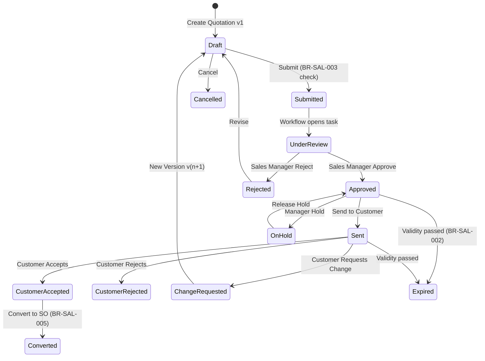
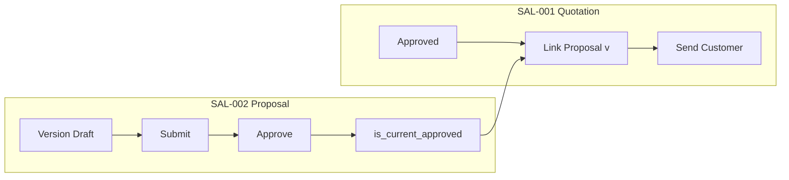
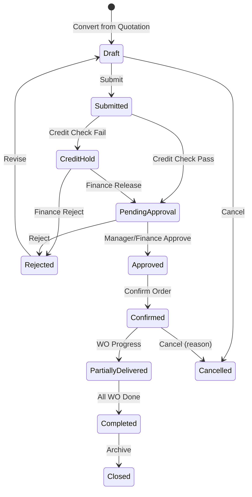
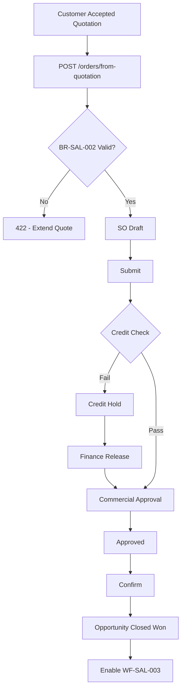
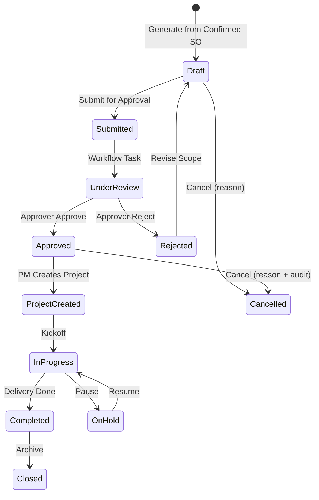
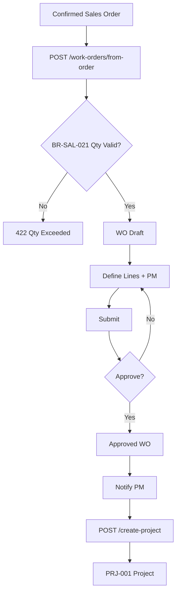

# E-LinkUp — EFS Sales Workflow Enrichment Pack
**Document ID:** EFS-SAL  
**Document Name:** Enterprise Functional Specification — Sales Workflow Enrichments  
**Version:** 1.0  
**Classification:** Internal Confidential  
**Project:** E-LinkUp (By Euphoria Infotech)  
**Example Tenant:** Euphoria  
**Parent Document:** ELU-EFS-001 (§5 Sales Workflows)  
**Related Documents:** ELU-BFS-SAL, ELU-SAD-001, ELU-WF-001, ELU-DF-001  
**Technology Stack:** Flutter (Web + Android) · Python FastAPI · PostgreSQL · JWT + Refresh Token · Docker · Linux VPS / Azure  
**API Namespace:** `/api/v1/sales/`

---

## Purpose

This pack contains **implementation-ready EFS enrichment blocks** for Sales domain workflows. Each block is designed to be merged into `ELU-EFS-001` after the corresponding base workflow section (§5.1.1–5.1.3, §5.2, §5.3). Blocks are delimited by HTML comment markers for automated tooling and manual merge.

**Business Rules in scope:** BR-SAL-001 … BR-SAL-005 (Quotation & Proposal) · BR-SAL-020 … BR-SAL-022 (Work Order)

**Conversion spine:**

```text
Opportunity (CRM-002) → Quotation (SAL-001) + Proposal (SAL-002)
    → Sales Order (SAL-003) → Work Order (SAL-004) → Project (PRJ-001)
```

---

<!-- EFS:WF-SAL-001 -->

## WF-SAL-001 — Quotation & Proposal

**Modules:** SAL-001 Quotation Management · SAL-002 Proposal Management  
**Actors:** Sales Executive, Pre-Sales, Sales Manager, Finance User (advisory), Customer Contact (external)  
**Business Rules:** BR-SAL-001, BR-SAL-002, BR-SAL-003, BR-SAL-004, BR-SAL-005

#### 5.1.4 Workflow Traceability

| Attribute | Value |
|-----------|-------|
| **Workflow ID** | WF-SAL-001 |
| **Domain** | SAL (Sales) |
| **Modules** | SAL-001 Quotation · SAL-002 Proposal |
| **Sub Modules** | SAL-001-001 Quotation · SAL-002-001 Proposal |
| **Features** | SAL-001-001-001 Quotation Creation · SAL-002-001-001 Proposal Versioning |
| **Business Process** | Quote-to-Proposal — internal approval, customer release, acceptance |
| **Priority / Phase / Release** | Critical · Phase 2 · v1.0 |
| **Example Tenant** | Euphoria |
| **Upstream Workflows** | WF-CRM-002 Opportunity Pipeline |
| **Downstream Workflows** | WF-SAL-002 Negotiation & Sales Order |
| **Related Modules** | CRM-002 Opportunity · CRM-003 Customer · FIN-004 Tax · CPS-001 Workflow · CPS-002 Rules · CPS-003 Notifications · CPS-006 Documents |
| **Related Documents** | ELU-BFS-SAL § SAL-001, § SAL-002 · ELU-ERD-SAL · ELU-API-SAL · ELU-UI-SAL |
| **Related Database Tables** | `quotation`, `quotation_line`, `quotation_version`, `quotation_approval`, `quotation_customer_response`, `quotation_tax_line`, `quotation_status_history`, `proposal`, `proposal_version`, `proposal_section`, `quotation_proposal_link` |
| **BRD Feature IDs** | SAL-001, SAL-002 |
| **Story Act** | Act II — Find & Win (ELU-STORY-001) |

| Rule ID | Statement | Workflow Step |
|---------|-----------|---------------|
| BR-SAL-001 | Quotation must reference Opportunity and Customer | Create / validate |
| BR-SAL-002 | Validity date mandatory; expired quotes cannot convert | Send / convert |
| BR-SAL-003 | Discount above threshold requires manager approval | Submit / approve |
| BR-SAL-004 | Tax calculation uses tenant tax configuration (FIN-004) | Line save / totals |
| BR-SAL-005 | Only approved quotation version can create Sales Order | Convert |

#### 5.1.5 Workflow Inputs & Outputs

| Direction | Object / Event | Source | Consumer | Payload Summary |
|-----------|----------------|--------|----------|-----------------|
| **Input** | Qualified Opportunity | CRM-002 | SAL-001 | `opportunity_id`, `customer_id`, `contact_id`, stage = Proposal/Quotation |
| **Input** | Customer & Contact master | CRM-003 | SAL-001 | Billing/shipping, payment terms, credit visibility |
| **Input** | Price list / catalog | FIN / Product master | SAL-001 | `price_list_id`, SKU, UOM, base price |
| **Input** | Tax configuration | FIN-004 | SAL-001 | Tax codes, rates per tenant |
| **Input** | Proposal template | Tenant config | SAL-002 | Section schema, mandatory fields |
| **Input** | Approval matrix | CPS-001 / tenant config | Both | Discount threshold, approver roles |
| **Output** | Quotation (approved + sent) | SAL-001 | Customer Contact | PDF, commercial terms, validity |
| **Output** | Proposal version (approved) | SAL-002 | SAL-001 | `proposal_version_id`, `is_current_approved` |
| **Output** | Customer acceptance record | SAL-001 | WF-SAL-002 | `customer_response = ACCEPTED` |
| **Output** | Opportunity stage sync | SAL-001 | CRM-002 | Stage update, forecast value |
| **Output** | Workflow tasks | CPS-001 | Approvers | Approval inbox items |
| **Output** | Audit events | SAL-001/002 | CPS-005 | Immutable lifecycle log |
| **Output** | Notifications | CPS-003 | Sales roles | Submit, approve, reject, expire, accept |

**I/O Validation Gates**

| Gate | Condition | Error Code |
|------|-----------|------------|
| G-Q-01 | `opportunity_id` and `customer_id` present and same tenant | `SAL_Q_001` (BR-SAL-001) |
| G-Q-02 | `validity_end_date` ≥ today on convert | `SAL_Q_002` (BR-SAL-002) |
| G-Q-03 | Discount ≤ threshold OR approval complete | `SAL_Q_003` (BR-SAL-003) |
| G-Q-04 | Tax lines reconciled to FIN-004 | `SAL_Q_004` (BR-SAL-004) |
| G-Q-05 | State ∈ {APPROVED, CUSTOMER_ACCEPTED} + current version flag | `SAL_Q_005` (BR-SAL-005) |
| G-P-01 | Linked proposal version `is_current_approved = true` before customer send | `SAL_P_026` |

#### 5.1.6 State Machine & Mermaid

**Quotation States**

| State Code | Label | Entry Trigger | Exit Guards |
|------------|-------|---------------|-------------|
| `DRAFT` | Draft | Create / reject / new version | Lines valid |
| `SUBMITTED` | Submitted | Submit for approval | — |
| `UNDER_REVIEW` | Under Review | Workflow task opened | — |
| `APPROVED` | Approved | Manager approve | BR-SAL-003 satisfied |
| `REJECTED` | Rejected | Manager reject | Reason required |
| `SENT` | Sent to Customer | Mark sent | State was APPROVED |
| `CUSTOMER_ACCEPTED` | Customer Accepted | Record acceptance | — |
| `CUSTOMER_REJECTED` | Customer Rejected | Record rejection | — |
| `CHANGE_REQUESTED` | Change Requested | Customer change | Triggers new version |
| `ON_HOLD` | On Hold | Manager pause | — |
| `EXPIRED` | Expired | Scheduler / validity | Blocks convert |
| `CONVERTED` | Converted | SO created | Terminal |
| `CANCELLED` | Cancelled | Cancel action | Reason required |

**Proposal Version States**

| State Code | Label | Notes |
|------------|-------|-------|
| `DRAFT` | Draft | Editable sections |
| `SUBMITTED` | Submitted | Awaiting approval |
| `APPROVED` | Approved | May set `is_current_approved` |
| `REJECTED` | Rejected | Returns to Draft or new version |
| `LOCKED` | Locked | Superseded by newer version |
| `CANCELLED` | Cancelled | Terminal |





#### 5.1.7 Ownership Matrix

| Object / Task | Primary Owner | Secondary | Escalation | SLA Owner |
|---------------|---------------|-----------|------------|-----------|
| Quotation authoring | Sales Executive | Pre-Sales (advisory) | Sales Manager | Sales Manager |
| Proposal versioning | Pre-Sales | Sales Executive | Sales Manager | Pre-Sales Lead |
| Internal quotation approval | Sales Manager | Tenant Admin | Delivery Head | Sales Manager |
| Proposal version approval | Sales Manager | — | Tenant Admin | Sales Manager |
| Customer send | Sales Executive | — | Sales Manager | Sales Executive |
| Customer response recording | Sales Executive | — | Sales Manager | Sales Executive |
| Validity extension | Sales Manager | Finance User | Tenant Admin | Sales Manager |
| Quotation conversion | Sales Executive | Sales Manager | Finance User | Sales Executive |
| Discount exception review | Sales Manager | Finance User | CFO delegate | Finance User |

| Role | quotation.* | proposal.* |
|------|:-------------:|:------------:|
| Sales Executive | create, read, update, submit, convert, send | create, read |
| Sales Manager | approve, reject, hold, cancel | approve, reject, read |
| Pre-Sales | read | create, update, version, submit |
| Finance User | read | read |
| Tenant Admin | configure, all | configure, all |

#### 5.1.8 Exception Handling

| Exception ID | Scenario | Detection | System Response | Recovery Path | Actor |
|--------------|----------|-----------|-----------------|---------------|-------|
| EX-SAL-001-01 | Missing Opportunity/Customer link | API validation | HTTP 422 `SAL_Q_001` | Fix links in Draft | Sales Executive |
| EX-SAL-001-02 | Quote expired at convert | Rule Engine | HTTP 422 `SAL_Q_002` | Extend validity + re-approve | Sales Manager |
| EX-SAL-001-03 | Discount over threshold, no approval | Rule Engine | Block submit | Submit → approve path | Sales Manager |
| EX-SAL-001-04 | Tax calc failure (FIN-004) | Rule Engine | HTTP 422 `SAL_Q_004` | Fix tax config / lines | Tenant Admin |
| EX-SAL-001-05 | Convert from non-approved state | API guard | HTTP 422 `SAL_Q_005` | Complete approval + acceptance | Sales Executive |
| EX-SAL-001-06 | Send without approved proposal link | API guard | HTTP 422 `SAL_P_026` | Approve proposal version | Pre-Sales |
| EX-SAL-001-07 | Concurrent version edit | Optimistic lock | HTTP 409 | Refresh and retry | Pre-Sales |
| EX-SAL-001-08 | Customer reject | User action | State → CUSTOMER_REJECTED | New version or close Opp | Sales Executive |
| EX-SAL-001-09 | Approval timeout | Scheduler | Escalation notification | Reassign approver | System |
| EX-SAL-001-10 | Tenant suspended | Platform guard | Read-only | Platform Admin | Platform Admin |

#### 5.1.9 Timing & SLA

| Event / Timer | Trigger | Default SLA (Euphoria) | Escalation | Job / Engine |
|---------------|---------|------------------------|------------|--------------|
| Internal approval task | Quotation submitted | 2 business days | +1 day → Sales Manager manager | CPS-001 Workflow |
| Proposal version approval | Version submitted | 2 business days | +1 day → escalate | CPS-001 Workflow |
| Expiry warning | `validity_end_date - 3 days` | — | Email + push to owner | Scheduler (Celery) |
| Auto-expire | `validity_end_date` EOD | — | State → EXPIRED; notify | Scheduler |
| Customer response follow-up | Sent + 7 days no response | 7 calendar days | Reminder to owner | Scheduler |
| Approval escalation | Pending > SLA | Per tenant config | NTF-SAL-Q-009 | Workflow Engine |
| PDF generation | Send to customer | < 30 seconds | Retry ×3 | Document Engine |
| Opportunity sync | Quotation state change | < 5 seconds async | Dead-letter queue | Integration hook |

**Business Calendar:** Tenant timezone `Asia/Kolkata`; business days Mon–Fri per Euphoria org calendar.

#### 5.1.10 Database Impact

| Table | Operation | When | Indexes Required |
|-------|-----------|------|------------------|
| `quotation` | INSERT | Create | `(tenant_id, quotation_no)` UNIQUE |
| `quotation` | UPDATE | State change, totals | `(tenant_id, status)`, `(tenant_id, opportunity_id)` |
| `quotation_line` | INSERT/UPDATE/DELETE | Draft edits | `(tenant_id, quotation_id)` |
| `quotation_version` | INSERT | New version | `(quotation_id, version_no)` UNIQUE |
| `quotation_approval` | INSERT | Approve/reject | `(tenant_id, quotation_id)` |
| `quotation_customer_response` | INSERT | Customer response | `(tenant_id, quotation_id)` |
| `quotation_status_history` | INSERT | Every transition | `(tenant_id, quotation_id, created_at)` |
| `quotation_tax_line` | INSERT/UPDATE | Tax recalc | `(quotation_id)` |
| `proposal` | INSERT | Create proposal | `(tenant_id, opportunity_id)` |
| `proposal_version` | INSERT/UPDATE | Version lifecycle | `(proposal_id, version_no)` UNIQUE |
| `proposal_section` | INSERT/UPDATE | Section edit | `(proposal_version_id)` |
| `quotation_proposal_link` | INSERT | Link | `(quotation_id, proposal_version_id)` |

**Transactional Boundaries**

| Transaction | Tables | Isolation |
|-------------|--------|-----------|
| TX-Q-SUBMIT | `quotation`, `quotation_approval`, workflow task | SERIALIZABLE per quotation_id |
| TX-Q-VERSION | `quotation_version`, prior version lock | SERIALIZABLE |
| TX-Q-CONVERT | `quotation`, `sales_order` (handoff) | 2-phase; rollback on SO fail |
| TX-P-APPROVE | `proposal_version`, `is_current_approved` flag clear/set | SERIALIZABLE |

**Row-Level Security:** All tables filtered by `tenant_id` from JWT claim; no client-supplied tenant override.

#### 5.1.11 API Mapping

**Quotation Endpoints** (`/api/v1/sales/quotations`)

| Method | Path | Workflow Step | Permission | Request Body (key fields) | Response |
|--------|------|---------------|------------|---------------------------|----------|
| POST | `/api/v1/sales/quotations` | Create Draft | `quotation.create` | `opportunity_id`, `customer_id`, `validity_end_date`, `lines[]` | `201` + quotation |
| GET | `/api/v1/sales/quotations` | List | `quotation.read` | Query: `status`, `owner_id`, `opportunity_id` | Paginated list |
| GET | `/api/v1/sales/quotations/{id}` | Detail | `quotation.read` | — | Header + lines + version |
| PUT | `/api/v1/sales/quotations/{id}` | Update Draft | `quotation.update` | Full header + lines | `200` |
| POST | `/api/v1/sales/quotations/{id}/submit` | Submit | `quotation.submit` | — | `200` SUBMITTED |
| POST | `/api/v1/sales/quotations/{id}/approve` | Approve | `quotation.approve` | `comment` | `200` APPROVED |
| POST | `/api/v1/sales/quotations/{id}/reject` | Reject | `quotation.reject` | `reason_code`, `comment` | `200` REJECTED |
| POST | `/api/v1/sales/quotations/{id}/send` | Send customer | `quotation.update` | `channel`, `contact_id`, `message` | `200` SENT |
| POST | `/api/v1/sales/quotations/{id}/customer-response` | Record response | `quotation.update` | `response_type`, `notes` | `200` |
| POST | `/api/v1/sales/quotations/{id}/versions` | New version | `quotation.update` | `change_reason` | `201` new version |
| POST | `/api/v1/sales/quotations/{id}/convert` | Convert to SO | `quotation.convert` | — | `201` sales_order_id |
| POST | `/api/v1/sales/quotations/{id}/cancel` | Cancel | `quotation.cancel` | `reason` | `200` |
| GET | `/api/v1/sales/quotations/{id}/export` | PDF export | `quotation.export` | `format=pdf` | File stream |

**Proposal Endpoints** (`/api/v1/sales/proposals`)

| Method | Path | Workflow Step | Permission | Notes |
|--------|------|---------------|------------|-------|
| POST | `/api/v1/sales/proposals` | Create | `proposal.create` | Link `opportunity_id` |
| POST | `/api/v1/sales/proposals/{id}/versions` | New version | `proposal.version` | Locks prior |
| PUT | `/api/v1/sales/proposals/{id}/versions/{vid}` | Edit Draft | `proposal.update` | Sections |
| POST | `/api/v1/sales/proposals/{id}/versions/{vid}/submit` | Submit | `proposal.submit` | Workflow task |
| POST | `/api/v1/sales/proposals/{id}/versions/{vid}/approve` | Approve | `proposal.approve` | Sets current approved |
| POST | `/api/v1/sales/proposals/{id}/link-quotation` | Link | `proposal.update` | `quotation_id` |
| GET | `/api/v1/sales/proposals/{id}/versions/compare` | Compare | `proposal.read` | `v1`, `v2` query params |

**Standard Error Envelope:** `{ "code": "SAL_Q_00n", "message": "...", "rule_id": "BR-SAL-00n", "details": {} }`

#### 5.1.12 Flutter Mapping

| Screen ID | Route | Widget / Feature | Workflow Binding | Offline |
|-----------|-------|------------------|------------------|---------|
| SAL-UI-Q-001 | `/sales/quotations` | QuotationListPage | List by status | Read cache |
| SAL-UI-Q-002 | `/sales/quotations/new` | QuotationCreatePage | Create from Opp | — |
| SAL-UI-Q-003 | `/sales/quotations/{id}/edit` | QuotationEditPage | Draft edit; BR-SAL-004 tax | — |
| SAL-UI-Q-004 | `/sales/quotations/{id}` | QuotationDetailPage | Tabs: lines, versions, approval | Read cache |
| SAL-UI-Q-006 | `/sales/quotations/approvals` | ApprovalInboxPage | CPS-001 tasks | — |
| SAL-UI-Q-007 | `/sales/quotations/{id}/versions` | VersionHistoryPage | Version compare | — |
| SAL-UI-Q-008 | modal | SendQuotationDialog | Send + PDF preview | — |
| SAL-UI-Q-009 | `/sales/quotations/{id}/convert` | ConvertWizardPage | BR-SAL-005 gate | — |
| SAL-UI-P-003 | `/sales/proposals/{id}/versions/{vid}/edit` | ProposalEditorPage | Section tabs | — |
| SAL-UI-P-004 | `/sales/proposals/{id}` | ProposalDetailPage | Version timeline | — |
| SAL-UI-P-006 | `/sales/proposals/approvals` | ProposalApprovalInbox | Manager approve | — |

**State Management:** Riverpod providers `quotationProvider`, `proposalProvider`; optimistic lock via `etag` header.

**Navigation Triggers:** CRM Opportunity detail → "Create Quotation" deep-link with `opportunity_id` query param.

#### 5.1.13 Notification Matrix

| Event | Template Key | Channels | Recipients | Payload Tokens |
|-------|--------------|----------|------------|----------------|
| Quotation submitted | NTF-SAL-Q-001 | Email, In-app | Sales Manager | `{quotation_no}`, `{owner}`, `{amount}` |
| Quotation approved | NTF-SAL-Q-002 | Email, In-app, Push | Sales Executive | `{quotation_no}`, `{approver}` |
| Quotation rejected | NTF-SAL-Q-003 | Email, In-app, Push | Sales Executive | `{reason}`, `{comment}` |
| Quotation sent | NTF-SAL-Q-004 | Email, In-app | Sales Manager | `{contact}`, `{channel}` |
| Expiring in 3 days | NTF-SAL-Q-005 | Email, Push | Sales Executive | `{validity_end_date}` |
| Quotation expired | NTF-SAL-Q-006 | Email, In-app | Sales Executive, Sales Manager | `{quotation_no}` |
| Customer accepted | NTF-SAL-Q-007 | Email, In-app | Sales Manager, Finance User | `{quotation_no}`, `{amount}` |
| Converted to SO | NTF-SAL-Q-008 | Email, In-app | Sales Executive, Finance User | `{sales_order_no}` |
| Approval escalation | NTF-SAL-Q-009 | Email, In-app | Escalation role | `{pending_days}` |
| Proposal version submitted | NTF-SAL-P-001 | Email, In-app | Sales Manager | `{proposal_no}`, `{version_no}` |
| Proposal version approved | NTF-SAL-P-002 | Email, In-app | Pre-Sales, Sales Executive | `{version_no}` |
| Proposal version rejected | NTF-SAL-P-003 | Email, In-app | Pre-Sales | `{comment}` |

**Idempotency:** Notification dispatch keyed by `(tenant_id, entity_id, event_type, transition_id)`.

#### 5.1.14 Reporting

| Report ID | Name | Grain | Key Dimensions | Metrics | Audience |
|-----------|------|-------|----------------|---------|----------|
| RPT-SAL-Q-001 | Open Quotations by Status | Quotation | status, owner, BU | count, value | Sales Executive |
| RPT-SAL-Q-002 | Quotation Ageing | Quotation | days open | avg age | Sales Manager |
| RPT-SAL-Q-003 | Expiring Quotations | Quotation | 7/30 day window | count | Sales Executive |
| RPT-SAL-Q-010 | Quotation Pipeline Value | Opportunity | stage, period | pipeline ₹ | Sales Manager |
| RPT-SAL-Q-011 | Win/Loss on Quotations | Quotation | outcome | win rate % | Sales Manager |
| RPT-SAL-Q-012 | Discount Exception Report | Line | threshold breach | exception count | Finance User |
| RPT-SAL-P-001 | Open Proposals by Status | Proposal | status | count | Pre-Sales |
| RPT-SAL-P-002 | Proposal Approval Cycle | Version | version | cycle days | Sales Manager |
| KPI-SAL-Q-001 | Quote-to-Order Conversion | Quotation | period | converted / accepted | Executive |
| KPI-SAL-Q-002 | Avg Approval Cycle Time | Quotation | period | hours | Sales Manager |

**Data Source:** Materialized view `mv_sales_quotation_pipeline` refreshed hourly; real-time status from `quotation` + `quotation_status_history`.

#### 5.1.15 Security

| Control | Implementation |
|---------|----------------|
| Authentication | JWT Bearer; refresh token rotation |
| Authorization | RBAC permissions per §5.1.7; server-side on every endpoint |
| Tenant isolation | `tenant_id` from JWT; RLS on all SAL tables |
| Field-level | Discount override hidden without `quotation.approve`; margin visible to Manager+ |
| Document ACL | Proposal attachments via CPS-006; signed MinIO URLs, 15 min TTL |
| API rate limit | 100 req/min per user on write endpoints |
| PII | Customer contact email/phone masked in list views for non-owner roles |
| Export control | `quotation.export` permission; watermark PDF with user + timestamp |
| CSRF | N/A (Bearer token API); Flutter uses secure storage for tokens |

**Threat Mitigations**

| Threat | Mitigation |
|--------|------------|
| Cross-tenant IDOR | UUID + tenant_id composite FK validation |
| Price tampering post-submit | Field lock in SUBMITTED+ states |
| Unauthorized convert | BR-SAL-005 server guard + permission check |

#### 5.1.16 Audit Trail

| Event Type | Entity | Captured Fields | Storage |
|------------|--------|-----------------|---------|
| `quotation.created` | quotation | Full header snapshot | `audit_log` + `quotation_status_history` |
| `quotation.updated` | quotation | Field-level diff | `audit_log` |
| `quotation.status_changed` | quotation | old_state, new_state, actor, reason | `quotation_status_history` |
| `quotation.submitted` | quotation | approver_routing | `quotation_approval` |
| `quotation.approved` / `rejected` | quotation | approver_id, comment | `quotation_approval` |
| `quotation.sent` | quotation | channel, contact_id, pdf_doc_id | `audit_log` |
| `quotation.customer_response` | quotation | response_type, notes | `quotation_customer_response` |
| `quotation.version_created` | quotation_version | parent_version_id, version_no | `audit_log` |
| `quotation.converted` | quotation | sales_order_id | `audit_log` |
| `proposal.version_approved` | proposal_version | is_current_approved change | `audit_log` |

**Retention:** 7 years default per Euphoria tenant policy (`tenant_security.audit_log_retention_days`).

#### 5.1.17 Acceptance Criteria

| Category | Criterion | Verification |
|----------|-----------|--------------|
| **Functional** | Create quotation from Opportunity enforces BR-SAL-001 | API test: missing opp → 422 |
| **Functional** | Expired quotation blocked from convert (BR-SAL-002) | API test: past validity → 422 |
| **Functional** | Over-threshold discount requires approval (BR-SAL-003) | Submit blocked until approved |
| **Functional** | Tax matches FIN-004 config (BR-SAL-004) | Line tax assertion |
| **Functional** | Convert only from approved/accepted current version (BR-SAL-005) | State matrix test |
| **Functional** | New version locks prior; monotonic version_no | Version integration test |
| **Functional** | Customer send blocked without approved proposal link | API test → 422 |
| **Technical** | All endpoints return tenant-scoped data only | Multi-tenant isolation test |
| **Technical** | Approval workflow tasks created in CPS-001 | Workflow integration test |
| **Technical** | PDF generated < 30s P95 | Performance test |
| **Performance** | Quotation list < 500ms P95 for 10k records | Load test with indexes |
| **Security** | IDOR attempt across tenants returns 404 | Security test |
| **Security** | Submitted quotation price fields immutable via PATCH | API tamper test |

#### 5.1.18 Future Enhancements

| Version | Enhancement | Workflow Impact |
|---------|-------------|-----------------|
| **v2.0** | Customer self-service quote portal | New actor: Customer Contact (authenticated); async acceptance webhook |
| **v2.0** | E-sign on quotation/proposal (DocuSign connector) | New state `PENDING_SIGNATURE`; INT-004 integration |
| **v2.0** | CPQ configurator / bundle pricing | Rule Engine extension; new line types |
| **v2.5** | Multi-currency quotations | FX rate table; recalc on convert |
| **v3.0** | AI-assisted proposal drafting | Pre-Sales copilot; section suggestions from Opp notes |
| **v3.0** | Competitive pricing intelligence | External data feed; advisory discount flags |
| **v3.0** | WhatsApp / SMS customer send | CPS-003 channel expansion |

<!-- /EFS:WF-SAL-001 -->

---

<!-- EFS:WF-SAL-002 -->

## WF-SAL-002 — Negotiation, Sales Order & Commercial Approval

**Module:** SAL-003 Sales Order Management  
**Actors:** Sales Executive, Sales Manager, Finance User, Legal (advisory v1.0), Project Manager (notify)  
**Upstream:** WF-SAL-001 (customer-accepted quotation)  
**Downstream:** WF-SAL-003 Work Order Generation  
**Cross-Reference Rules:** BR-SAL-001…005 apply at quotation source; SO enforces quotation eligibility at convert

#### 5.2.1 Workflow Traceability

| Attribute | Value |
|-----------|-------|
| **Workflow ID** | WF-SAL-002 |
| **Domain** | SAL |
| **Module** | SAL-003 Sales Order Management |
| **Sub Module** | SAL-003-001 Sales Order |
| **Feature** | SAL-003-001-001 Sales Order Processing |
| **Business Process** | Negotiation closure — credit validation, commercial approval, order confirmation |
| **Priority / Phase / Release** | Critical · Phase 2 · v1.0 |
| **Example Tenant** | Euphoria |
| **Upstream Workflows** | WF-SAL-001 Quotation & Proposal |
| **Downstream Workflows** | WF-SAL-003 Work Order Generation |
| **Related Modules** | SAL-001, SAL-002, CRM-002, CRM-003, FIN (credit/AR), CPS-001, CPS-002 |
| **Related Documents** | ELU-BFS-SAL § SAL-003 · ELU-ERD-SAL · ELU-API-SAL |
| **Related Database Tables** | `sales_order`, `sales_order_line`, `sales_order_approval`, `sales_order_credit_check`, `sales_order_status_history`, `sales_order_tax_line` |
| **BRD Feature ID** | SAL-003 |
| **Story Act** | Act II — Find & Win |

| Prerequisite Rule | Enforcement Point |
|-------------------|-------------------|
| BR-SAL-005 | SO created only from eligible quotation |
| BR-SAL-002 | Quotation validity checked at convert time |

#### 5.2.2 Workflow Inputs & Outputs

| Direction | Object / Event | Source | Consumer | Payload Summary |
|-----------|----------------|--------|----------|-----------------|
| **Input** | Customer-accepted Quotation | SAL-001 | SAL-003 | Header, lines, tax, `proposal_version_id` |
| **Input** | Customer credit profile | CRM-003 / FIN AR | SAL-003 | Credit limit, outstanding balance |
| **Input** | Payment terms | Customer master | SAL-003 | Net days, advance % |
| **Input** | Approval matrix | Tenant config | SAL-003 | Order value thresholds |
| **Input** | Legal/compliance checklist | Tenant config (optional) | SAL-003 | Contract template flags |
| **Output** | Sales Order (Confirmed) | SAL-003 | SAL-004, PRJ-001 | Binding commitment record |
| **Output** | Opportunity Closed Won | SAL-003 | CRM-002 | Stage + actual revenue |
| **Output** | Credit check result | SAL-003 | Finance dashboard | Pass/hold/release audit |
| **Output** | Delivery notification | SAL-003 | Project Manager | SO confirmed event |
| **Output** | Workflow / audit trail | SAL-003 | CPS-005 | Full approval history |

#### 5.2.3 State Machine & Mermaid

| State Code | Label | Description | Allowed Next |
|------------|-------|-------------|--------------|
| `DRAFT` | Draft | Editable; from quotation convert | SUBMITTED, CANCELLED |
| `SUBMITTED` | Submitted | Processing started | CREDIT_HOLD, PENDING_APPROVAL |
| `CREDIT_HOLD` | Credit Hold | Finance review required | PENDING_APPROVAL, REJECTED |
| `PENDING_APPROVAL` | Pending Approval | Commercial workflow active | APPROVED, REJECTED |
| `APPROVED` | Approved | Commercially approved | CONFIRMED, CANCELLED |
| `REJECTED` | Rejected | Failed validation/approval | DRAFT, CANCELLED |
| `CONFIRMED` | Confirmed | Binding order | PARTIALLY_DELIVERED, COMPLETED |
| `PARTIALLY_DELIVERED` | Partially Delivered | Some WO complete | COMPLETED |
| `COMPLETED` | Completed | Fully delivered | CLOSED |
| `ON_HOLD` | On Hold | Manual pause | Prior state resume |
| `CANCELLED` | Cancelled | Voided | — |
| `CLOSED` | Closed | Archived | ARCHIVED |





#### 5.2.4 Ownership Matrix

| Object / Task | Primary Owner | Secondary | Escalation |
|---------------|---------------|-----------|------------|
| SO creation from quotation | Sales Executive | Sales Manager | — |
| Credit validation / release | Finance User | — | CFO delegate |
| Commercial approval | Sales Manager | Finance User (above threshold) | Tenant Admin |
| Order confirmation | Sales Manager | Finance User | Delivery Head |
| Negotiation / hold | Sales Manager | Finance User | — |
| SO cancellation (confirmed) | Sales Manager | Finance User | Tenant Admin |
| Delivery handoff | Project Manager | Sales Manager | — |

| Permission | Sales Executive | Sales Manager | Finance User | Project Manager |
|------------|:---------------:|:-------------:|:------------:|:---------------:|
| sales_order.create | ✓ | ✓ | — | — |
| sales_order.submit | ✓ | ✓ | — | — |
| sales_order.credit_release | — | — | ✓ | — |
| sales_order.approve | — | ✓ | ✓ | — |
| sales_order.confirm | — | ✓ | ✓ | — |
| sales_order.cancel | — | ✓ | ✓ | — |
| sales_order.read | ✓ | ✓ | ✓ | ✓ |

#### 5.2.5 Exception Handling

| Exception ID | Scenario | Detection | System Response | Recovery |
|--------------|----------|-----------|-----------------|----------|
| EX-SAL-002-01 | Convert from ineligible quotation | API | HTTP 422 BR-SAL-005 | Complete quote acceptance |
| EX-SAL-002-02 | Quotation expired at convert | Rule Engine | HTTP 422 BR-SAL-002 | Extend + re-approve quote |
| EX-SAL-002-03 | Credit limit exceeded | Rule Engine on submit | State → CREDIT_HOLD | Finance release or advance |
| EX-SAL-002-04 | Finance rejects credit release | User action | State → REJECTED | Revise terms or cancel |
| EX-SAL-002-05 | Order above approval threshold | Workflow | Route to Finance | Finance approve |
| EX-SAL-002-06 | SO edit after WO exists | API guard | HTTP 422 | Change request path (PRJ-006) |
| EX-SAL-002-07 | Tax variance vs quotation | Rule Engine | Warning / block | Finance override with audit |
| EX-SAL-002-08 | Duplicate SO from same quotation | DB constraint | HTTP 409 | One SO per quote v1.0 |
| EX-SAL-002-09 | Cancel confirmed SO | User action | Reason + Finance notify | Manual unwind WO |
| EX-SAL-002-10 | Payment terms override | Workflow | Finance approval task | Approve or revert |

#### 5.2.6 Timing & SLA

| Event / Timer | Default SLA (Euphoria) | Escalation | Engine |
|---------------|--------------------------|------------|--------|
| Credit check (automated) | < 5 seconds | Retry ×3 | Rule Engine |
| Credit hold resolution | 1 business day | +1 day → Finance manager | Workflow |
| Commercial approval | 2 business days | +1 day → escalate | CPS-001 |
| Finance secondary approval (large orders) | 2 business days | +1 day → CFO delegate | CPS-001 |
| Confirm order after approval | User-driven | Reminder at 3 days | Scheduler |
| Opportunity sync on confirm | < 5 seconds async | DLQ retry | CRM hook |
| SO list/dashboard refresh | Real-time | — | WebSocket (v2) |

#### 5.2.7 Database Impact

| Table | Operation | When | Constraints |
|-------|-----------|------|-------------|
| `sales_order` | INSERT | Convert from quotation | `quotation_id` UNIQUE per tenant |
| `sales_order` | UPDATE | State transitions | Status enum check |
| `sales_order_line` | INSERT | Convert (copy from quote) | FK `quotation_line_id` |
| `sales_order_credit_check` | INSERT | On submit | Result enum PASS/FAIL/HOLD |
| `sales_order_approval` | INSERT | Approve/reject steps | Sequential/parallel per config |
| `sales_order_status_history` | INSERT | Every transition | Append-only |
| `sales_order_tax_line` | INSERT/UPDATE | Tax recalc | Match quote unless approved variance |
| `opportunity` | UPDATE | On CONFIRMED | Stage = Closed Won (CRM hook) |

**Transactional Boundary — Confirm Order**

```text
BEGIN
  UPDATE sales_order SET status = 'CONFIRMED'
  INSERT sales_order_status_history
  UPDATE opportunity SET stage = 'CLOSED_WON'  -- CRM-002
  EMIT notification SO_CONFIRMED
COMMIT
```

#### 5.2.8 API Mapping

| Method | Path | Workflow Step | Permission | Notes |
|--------|------|---------------|------------|-------|
| POST | `/api/v1/sales/orders/from-quotation/{quotation_id}` | Convert | `sales_order.create` | BR-SAL-005 guard |
| GET | `/api/v1/sales/orders` | List | `sales_order.read` | Filters: status, customer |
| GET | `/api/v1/sales/orders/{id}` | Detail | `sales_order.read` | Lines + credit check |
| PUT | `/api/v1/sales/orders/{id}` | Update Draft | `sales_order.update` | Draft only |
| POST | `/api/v1/sales/orders/{id}/submit` | Submit | `sales_order.submit` | Triggers credit check |
| POST | `/api/v1/sales/orders/{id}/credit-release` | Release hold | `sales_order.credit_release` | Finance only |
| POST | `/api/v1/sales/orders/{id}/approve` | Approve | `sales_order.approve` | Manager/Finance |
| POST | `/api/v1/sales/orders/{id}/reject` | Reject | `sales_order.reject` | Reason required |
| POST | `/api/v1/sales/orders/{id}/confirm` | Confirm | `sales_order.confirm` | Sets CONFIRMED |
| POST | `/api/v1/sales/orders/{id}/cancel` | Cancel | `sales_order.cancel` | Reason required |
| POST | `/api/v1/sales/orders/{id}/hold` | Hold | `sales_order.hold` | Manager |
| GET | `/api/v1/sales/orders/{id}/credit-check` | Credit detail | `sales_order.read` | Finance |
| GET | `/api/v1/sales/orders/{id}/history` | Audit history | `sales_order.read` | — |
| GET | `/api/v1/sales/orders/{id}/export` | Export PDF | `sales_order.export` | — |

#### 5.2.9 Flutter Mapping

| Screen ID | Route | Feature | Binding |
|-----------|-------|---------|---------|
| SAL-UI-SO-001 | `/sales/orders` | SalesOrderListPage | Status filters |
| SAL-UI-SO-002 | `/sales/orders/{id}` | SalesOrderDetailPage | Credit + approval tabs |
| SAL-UI-SO-003 | wizard | ConvertFromQuotationWizard | From SAL-UI-Q-009 |
| SAL-UI-SO-004 | `/sales/orders/credit-holds` | CreditHoldQueuePage | Finance inbox |
| SAL-UI-SO-005 | `/sales/orders/approvals` | CommercialApprovalInbox | Manager/Finance |
| SAL-UI-SO-006 | modal | ConfirmOrderDialog | Confirm action |
| SAL-UI-SO-007 | `/sales/orders/{id}/history` | OrderHistoryPage | Audit timeline |

**UX Guards:** Confirm button disabled unless state = APPROVED; credit hold banner on detail page.

#### 5.2.10 Notification Matrix

| Event | Template Key | Channels | Recipients |
|-------|--------------|----------|------------|
| SO submitted | NTF-SAL-SO-001 | In-app | Sales Manager, Finance |
| Credit hold placed | NTF-SAL-SO-002 | Email, In-app | Finance User |
| Credit released | NTF-SAL-SO-003 | In-app | Sales Executive |
| SO approved | NTF-SAL-SO-004 | In-app | Sales Executive |
| SO rejected | NTF-SAL-SO-007 | Email, In-app | Sales Executive |
| SO confirmed | NTF-SAL-SO-005 | Email, In-app | Project Manager, Sales Executive |
| SO cancelled | NTF-SAL-SO-006 | Email, In-app | Finance, Project Manager |
| Approval escalation | NTF-SAL-SO-008 | Email | Escalation role |

#### 5.2.11 Reporting

| Report ID | Name | Grain | Audience |
|-----------|------|-------|----------|
| RPT-SAL-SO-001 | Open Sales Orders | SO | Sales Manager |
| RPT-SAL-SO-002 | Credit Hold Register | SO | Finance User |
| RPT-SAL-SO-003 | SO Confirmation Log | SO | Finance User |
| RPT-SAL-SO-004 | Quote-to-Order Cycle Time | SO | Sales Manager |
| KPI-SAL-SO-001 | Confirmed Order Value (MTD) | SO | Executive |
| KPI-SAL-SO-002 | Credit Hold Resolution Time | Credit check | Finance User |

#### 5.2.12 Security

| Control | Implementation |
|---------|----------------|
| Credit data visibility | `sales_order.credit_release` for exposure details; masked for Sales Executive |
| Confirm authority | `sales_order.confirm` — Manager + Finance only |
| Quotation link integrity | Server validates quotation_id not tampered on SO |
| Cancellation audit | Confirmed SO cancel requires elevated permission + reason |
| Tenant isolation | RLS on all `sales_order*` tables |

#### 5.2.13 Audit Trail

| Event | Captured Fields |
|-------|-----------------|
| `sales_order.created` | quotation_id, lines snapshot |
| `sales_order.submitted` | credit_check_id |
| `sales_order.credit_check` | exposure, limit, result |
| `sales_order.credit_released` | finance_user_id, comment |
| `sales_order.approved` / `rejected` | approver, comment |
| `sales_order.confirmed` | timestamp, opportunity_sync |
| `sales_order.cancelled` | reason, prior_state |
| `sales_order.line_changed` | field diff (Draft only) |

#### 5.2.14 Acceptance Criteria

| Category | Criterion |
|----------|-----------|
| **Functional** | Convert from valid quotation creates SO with matching lines and links |
| **Functional** | Credit failure → CREDIT_HOLD; WO generation blocked |
| **Functional** | Finance credit release → PENDING_APPROVAL with audit |
| **Functional** | Confirm sets Opportunity Closed Won and notifies PM |
| **Functional** | WO API returns 422 if SO not CONFIRMED |
| **Technical** | Multi-tenant isolation on all SO endpoints |
| **Technical** | One SO per quotation enforced at DB level |
| **Performance** | Credit check < 5s P95 |
| **Security** | Sales Executive cannot credit-release or confirm |

#### 5.2.15 Future Enhancements

| Version | Enhancement |
|---------|-------------|
| **v2.0** | Legal review workflow step (mandatory flag per tenant) |
| **v2.0** | Revenue schedule / billing plan on SO |
| **v2.0** | ERP SO sync (INT-004) |
| **v2.5** | Automated credit scoring from external bureau |
| **v3.0** | AI negotiation insights — payment term recommendations |
| **v3.0** | Dynamic discount approval matrix by customer segment |

<!-- /EFS:WF-SAL-002 -->

---

<!-- EFS:WF-SAL-003 -->

## WF-SAL-003 — Work Order Generation

**Module:** SAL-004 Work Order Management  
**Actors:** Sales Manager, Project Manager, Finance User (read), Pre-Sales (scope reference)  
**Business Rules:** BR-SAL-020, BR-SAL-021, BR-SAL-022  
**Upstream:** WF-SAL-002 (Confirmed Sales Order)  
**Downstream:** WF-PRJ-001 Project Planning & Execution

#### 5.3.1 Workflow Traceability

| Attribute | Value |
|-----------|-------|
| **Workflow ID** | WF-SAL-003 |
| **Domain** | SAL |
| **Module** | SAL-004 Work Order Management |
| **Sub Module** | SAL-004-001 Work Order |
| **Feature** | SAL-004-001-001 Work Order Generation |
| **Business Process** | Delivery handoff — scope decomposition, approval, project initiation |
| **Priority / Phase / Release** | Critical · Phase 2 · v1.0 |
| **Example Tenant** | Euphoria |
| **Upstream Workflows** | WF-SAL-002 Sales Order |
| **Downstream Workflows** | WF-PRJ-001 Project Planning |
| **Related Modules** | SAL-003, SAL-002, PRJ-001, CPS-001, CPS-003 |
| **Related Documents** | ELU-BFS-SAL § SAL-004 · ELU-BFS-PRJ · ELU-ERD-SAL |
| **Related Database Tables** | `work_order`, `work_order_line`, `work_order_approval`, `work_order_status_history`, `work_order_project_link` |
| **BRD Feature ID** | SAL-004 |
| **Story Act** | Act III — Deliver |

| Rule ID | Statement | Enforcement |
|---------|-----------|-------------|
| BR-SAL-020 | Work Order requires approved Sales Order | API — SO status = CONFIRMED |
| BR-SAL-021 | Multiple Work Orders allowed for phased delivery | Rule Engine — qty sum ≤ SO line qty |
| BR-SAL-022 | Cancellation of Work Order requires reason + audit | API + audit_log |

#### 5.3.2 Workflow Inputs & Outputs

| Direction | Object / Event | Source | Consumer | Payload Summary |
|-----------|----------------|--------|----------|-----------------|
| **Input** | Confirmed Sales Order | SAL-003 | SAL-004 | Header, lines, customer, dates |
| **Input** | Approved Proposal version | SAL-002 | SAL-004 | Technical scope baseline |
| **Input** | PM assignment | User master | SAL-004 | `project_manager_id` |
| **Input** | Phase / delivery template | Tenant config (optional) | SAL-004 | WO split pattern |
| **Output** | Work Order (Approved) | SAL-004 | PRJ-001 | Executable scope unit |
| **Output** | Project draft | SAL-004 → PRJ-001 | Project Manager | `project_id` linked |
| **Output** | SO delivery progress | SAL-004 | SAL-003 | Partial delivery % |
| **Output** | Procurement flags | SAL-004 | Future procurement | Advisory in v1.0 |
| **Output** | Notifications | SAL-004 | PM, Sales Manager | Approval, project created |

#### 5.3.3 State Machine & Mermaid

| State Code | Label | Description | Allowed Next |
|------------|-------|-------------|--------------|
| `DRAFT` | Draft | Scope being defined | SUBMITTED, CANCELLED |
| `SUBMITTED` | Submitted | Awaiting approval | UNDER_REVIEW, APPROVED, REJECTED |
| `UNDER_REVIEW` | Under Review | Approval task open | APPROVED, REJECTED |
| `APPROVED` | Approved | Ready for project | PROJECT_CREATED, CANCELLED |
| `REJECTED` | Rejected | Sent back | DRAFT |
| `PROJECT_CREATED` | Project Created | PRJ linked | IN_PROGRESS |
| `IN_PROGRESS` | In Progress | Delivery active | COMPLETED, ON_HOLD, CANCELLED |
| `ON_HOLD` | On Hold | Paused | IN_PROGRESS, CANCELLED |
| `COMPLETED` | Completed | Delivery done | CLOSED |
| `CANCELLED` | Cancelled | Voided (BR-SAL-022) | — |
| `CLOSED` | Closed | Archived | ARCHIVED |





#### 5.3.4 Ownership Matrix

| Object / Task | Primary Owner | Secondary | Escalation |
|---------------|---------------|-----------|------------|
| WO generation from SO | Sales Manager | — | Delivery Head |
| Scope definition / line split | Sales Manager | Project Manager | — |
| WO approval | Sales Manager / Delivery Head | Tenant Admin | — |
| PM assignment | Sales Manager | Project Manager (accept) | — |
| Project creation | Project Manager | — | Delivery Head |
| WO execution status | Project Manager | Team Member | Sales Manager |
| WO cancellation | Sales Manager | Project Manager | Tenant Admin |

| Permission | Sales Manager | Project Manager | Finance User | Pre-Sales |
|------------|:-------------:|:---------------:|:------------:|:---------:|
| work_order.create | ✓ | — | — | — |
| work_order.update | ✓ | ✓ | — | — |
| work_order.approve | ✓ | — | — | — |
| work_order.convert | — | ✓ | — | — |
| work_order.cancel | ✓ | ✓ | — | — |
| work_order.read | ✓ | ✓ | ✓ | ✓ |

#### 5.3.5 Exception Handling

| Exception ID | Scenario | Detection | System Response | Recovery |
|--------------|----------|-----------|-----------------|----------|
| EX-SAL-003-01 | WO from non-Confirmed SO | API | HTTP 422 BR-SAL-020 | Confirm SO first |
| EX-SAL-003-02 | Line qty sum exceeds SO line | Rule Engine | HTTP 422 BR-SAL-021 | Adjust WO lines |
| EX-SAL-003-03 | Cancel without reason | API validation | HTTP 422 BR-SAL-022 | Provide reason |
| EX-SAL-003-04 | Create project from unapproved WO | API | HTTP 422 | Complete approval |
| EX-SAL-003-05 | PM not assigned before project create | API | HTTP 422 | Assign PM |
| EX-SAL-003-06 | Duplicate project per WO | DB constraint | HTTP 409 | One project per WO v1.0 |
| EX-SAL-003-07 | Cancel WO with active project | API guard | Warning + manual PRJ handling | PRJ module cancel |
| EX-SAL-003-08 | Hard delete WO with project link | API | HTTP 403 | Soft delete only |
| EX-SAL-003-09 | SO cancelled after WO approved | Event hook | Notify PM; WO ON_HOLD | Manual resolution |
| EX-SAL-003-10 | Missing proposal link | Warning | Allow with advisory flag | Link proposal version |

#### 5.3.6 Timing & SLA

| Event / Timer | Default SLA (Euphoria) | Escalation | Engine |
|---------------|------------------------|------------|--------|
| WO generation from SO | User-initiated; < 3s API | — | API |
| WO approval | 2 business days | +1 day → Delivery Head | CPS-001 |
| PM notification on approval | < 1 minute | Retry ×3 | CPS-003 |
| Project creation after approval | User-driven; target 1 business day | Reminder at 2 days | Scheduler |
| WO completion → SO delivery % update | < 5 seconds async | DLQ | Event hook |
| Phased WO #2 creation | User-driven near Phase 1 end | — | — |

#### 5.3.7 Database Impact

| Table | Operation | When | Constraints |
|-------|-----------|------|-------------|
| `work_order` | INSERT | Generate from SO | FK `sales_order_id`; BR-SAL-020 |
| `work_order` | UPDATE | State, PM assign | Status enum |
| `work_order_line` | INSERT/UPDATE | Scope edit | FK `sales_order_line_id`; qty check |
| `work_order_approval` | INSERT | Approve/reject | Append-only |
| `work_order_status_history` | INSERT | Transitions | Append-only |
| `work_order_project_link` | INSERT | Create project | WO:Project 1:1 v1.0 |
| `sales_order` | UPDATE | WO completed | `delivery_percent` recalc |

**Phased Delivery Constraint (BR-SAL-021)**

```sql
-- Enforced via trigger or application check
SUM(work_order_line.quantity) OVER (sales_order_line_id) <= sales_order_line.quantity
```

#### 5.3.8 API Mapping

| Method | Path | Workflow Step | Permission | Notes |
|--------|------|---------------|------------|-------|
| POST | `/api/v1/sales/work-orders/from-order/{sales_order_id}` | Generate WO | `work_order.create` | BR-SAL-020 |
| GET | `/api/v1/sales/work-orders` | List | `work_order.read` | Filter: SO, PM, status |
| GET | `/api/v1/sales/work-orders/{id}` | Detail | `work_order.read` | Lines + project link |
| PUT | `/api/v1/sales/work-orders/{id}` | Update Draft | `work_order.update` | Scope + PM |
| POST | `/api/v1/sales/work-orders/{id}/submit` | Submit | `work_order.submit` | Workflow task |
| POST | `/api/v1/sales/work-orders/{id}/approve` | Approve | `work_order.approve` | — |
| POST | `/api/v1/sales/work-orders/{id}/reject` | Reject | `work_order.reject` | Comment required |
| POST | `/api/v1/sales/work-orders/{id}/create-project` | Create PRJ | `work_order.convert` | PM only; → PRJ-001 |
| POST | `/api/v1/sales/work-orders/{id}/cancel` | Cancel | `work_order.cancel` | BR-SAL-022 reason |
| POST | `/api/v1/sales/work-orders/{id}/hold` | Hold | `work_order.hold` | PM/Manager |
| GET | `/api/v1/sales/work-orders/{id}/history` | History | `work_order.read` | — |
| GET | `/api/v1/sales/work-orders/{id}/export` | Export | `work_order.export` | PDF |

**Cross-Domain API (Project Creation)**

| Method | Path | Notes |
|--------|------|-------|
| POST | `/api/v1/projects/from-work-order/{work_order_id}` | Invoked by `create-project`; links Customer, SO, WO, Proposal |

#### 5.3.9 Flutter Mapping

| Screen ID | Route | Feature | Binding |
|-----------|-------|---------|---------|
| SAL-UI-WO-001 | `/sales/work-orders` | WorkOrderListPage | PM primary view |
| SAL-UI-WO-002 | `/sales/work-orders/{id}` | WorkOrderDetailPage | Scope + project link |
| SAL-UI-WO-003 | `/sales/orders/{id}/work-orders/new` | GenerateWOWizard | Phase split UI |
| SAL-UI-WO-004 | `/sales/work-orders/approvals` | WOApprovalInbox | Sales Manager |
| SAL-UI-WO-005 | modal | CreateProjectAction | PM from approved WO |
| SAL-UI-WO-006 | `/sales/work-orders/{id}/edit` | WOScopeEditor | Line qty validation |

**Validation UX:** Real-time qty sum indicator vs SO line remaining (BR-SAL-021).

#### 5.3.10 Notification Matrix

| Event | Template Key | Channels | Recipients |
|-------|--------------|----------|------------|
| WO submitted | NTF-SAL-WO-001 | In-app | Approver |
| WO approved | NTF-SAL-WO-002 | Email, In-app | Project Manager |
| WO rejected | NTF-SAL-WO-003 | In-app | Sales Manager |
| Project created from WO | NTF-SAL-WO-004 | Email, In-app | Sales Manager, Finance |
| WO completed | NTF-SAL-WO-005 | In-app | Sales Manager, Finance |
| WO cancelled | NTF-SAL-WO-006 | Email, In-app | Project Manager, Finance |
| Phased WO reminder | NTF-SAL-WO-007 | In-app | Sales Manager | Phase 1 nearing complete |

#### 5.3.11 Reporting

| Report ID | Name | Grain | Audience |
|-----------|------|-------|----------|
| RPT-SAL-WO-001 | Open Work Orders | WO | Project Manager |
| RPT-SAL-WO-002 | WO to Project Conversion Lag | WO → PRJ | Delivery Head |
| RPT-SAL-WO-003 | Phased Delivery Status by SO | SO / WO | Sales Manager |
| KPI-SAL-WO-001 | WO Approval Cycle Time | WO | Delivery Head |
| KPI-SAL-WO-002 | SO Delivery % Complete | SO | Finance User |

#### 5.3.12 Security

| Control | Implementation |
|---------|----------------|
| WO creation | `work_order.create` — Sales Manager only |
| Project creation | `work_order.convert` — Project Manager only |
| Cancel authority | Manager + PM; reason mandatory (BR-SAL-022) |
| Scope visibility | Pre-Sales read-only; no financial fields edit |
| SO link integrity | `sales_order_id` validated CONFIRMED server-side |
| Tenant isolation | RLS on all `work_order*` tables |

#### 5.3.13 Audit Trail

| Event | Captured Fields |
|-------|-----------------|
| `work_order.generated` | sales_order_id, proposal_version_id |
| `work_order.updated` | scope diff (Draft) |
| `work_order.submitted` | approver routing |
| `work_order.approved` / `rejected` | approver, comment |
| `work_order.pm_assigned` | project_manager_id |
| `work_order.project_created` | project_id |
| `work_order.completed` | delivery_percent impact on SO |
| `work_order.cancelled` | reason (BR-SAL-022), actor |
| `work_order.line_split` | so_line_id, qty allocated |

#### 5.3.14 Acceptance Criteria

| Category | Criterion |
|----------|-----------|
| **Functional** | Cannot generate WO from non-Confirmed SO (BR-SAL-020) |
| **Functional** | Multiple WOs allowed; line qty validation enforced (BR-SAL-021) |
| **Functional** | Cancel requires reason; audit entry written (BR-SAL-022) |
| **Functional** | Approved WO → Create Project succeeds and links PRJ-001 |
| **Functional** | PM notified on approval within 1 minute |
| **Functional** | SO partial delivery % updates on WO complete |
| **Technical** | Multi-tenant isolation verified |
| **Technical** | One active project per WO (v1.0) |
| **Security** | PM cannot approve own WO submission |
| **Performance** | WO list < 500ms P95 |

#### 5.3.15 Future Enhancements

| Version | Enhancement |
|---------|-------------|
| **v2.0** | Procurement PO auto-generation from WO lines with `procurement_required` flag |
| **v2.0** | Resource capacity check before PM assignment |
| **v2.0** | Gantt preview on WO scope editor |
| **v2.5** | Auto WO split templates by SO type |
| **v3.0** | Field service / dispatch integration for service-type WOs |
| **v3.0** | AI scope risk scoring from proposal content |

<!-- /EFS:WF-SAL-003 -->

---

## Document Control

| Field | Value |
|-------|-------|
| **Status** | Ready for SA / Engineering review |
| **Version** | 1.0 |
| **Merge Target** | ELU-EFS-001 §5.1 (after §5.1.3), §5.2, §5.3 |
| **Markers** | `<!-- EFS:WF-SAL-00n -->` … `<!-- /EFS:WF-SAL-00n -->` |
| **Open Questions** | Credit limit source: Customer master vs FIN AR ledger (confirm in FIN BFS); Legal review step optional flag per tenant |
| **Next Artefacts** | ELU-WF-SAL workflow JSON definitions · ELU-API-SAL OpenAPI · ELU-TC-SAL automation pack |

---

*© Euphoria Infotech (I) Limited — E-LinkUp EFS Sales Workflow Enrichment Pack v1.0*
