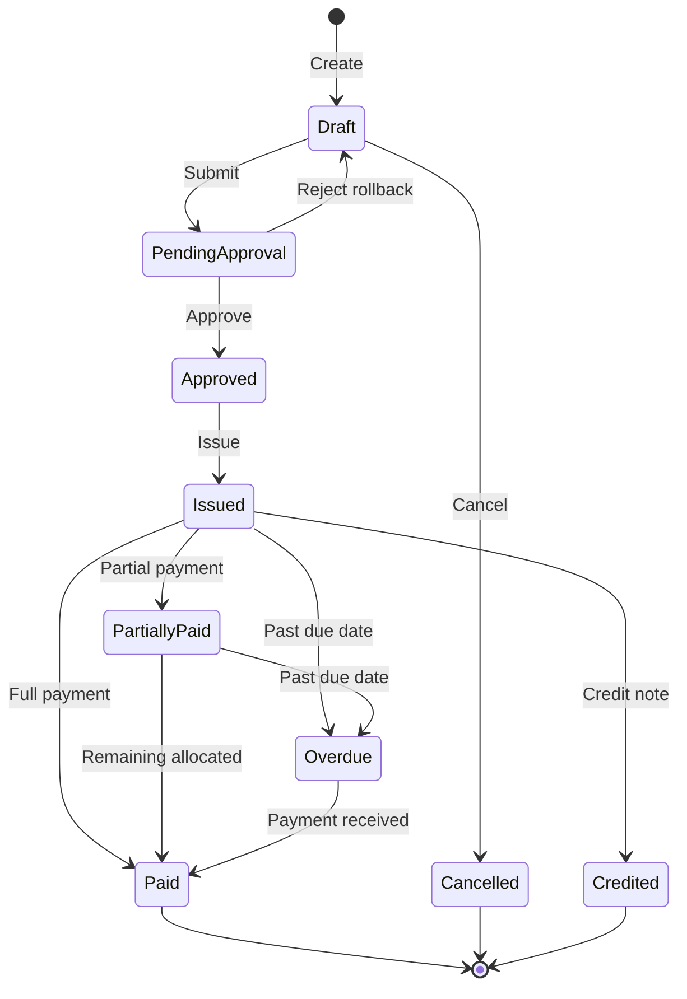
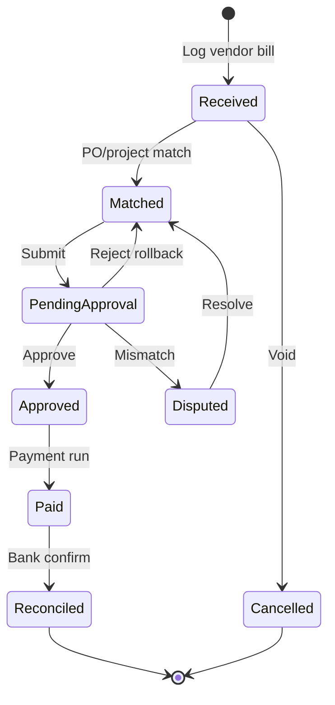
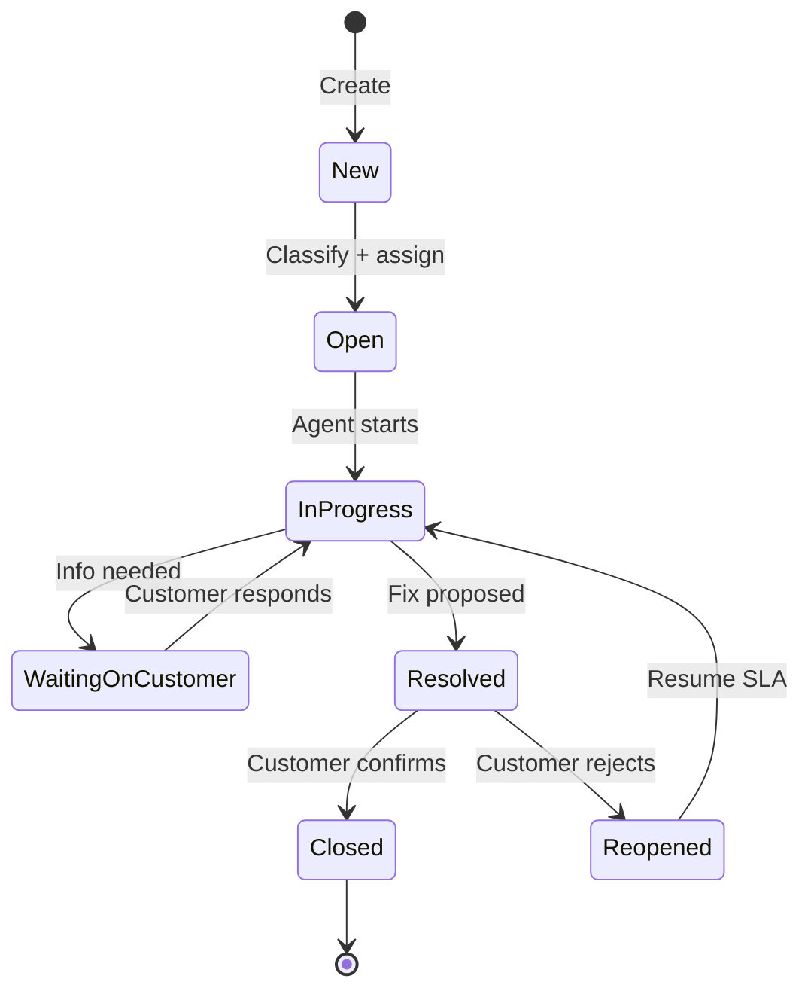
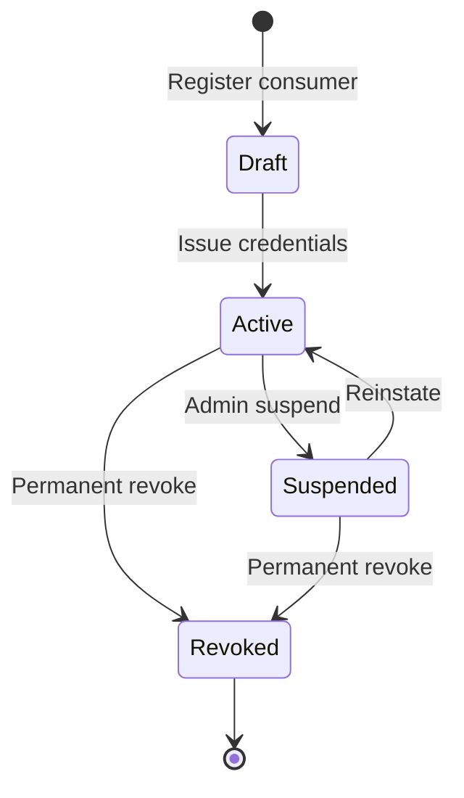
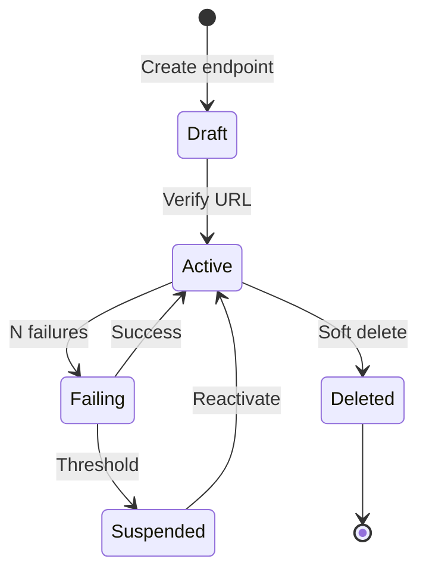
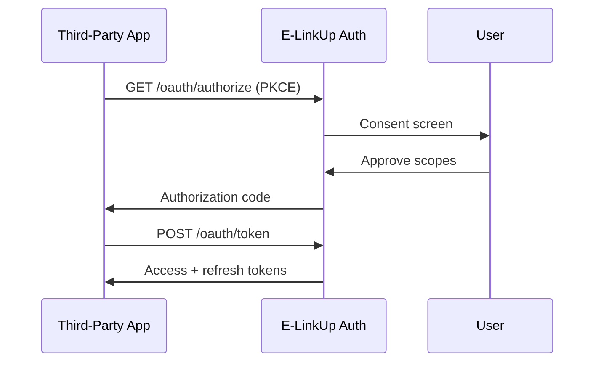
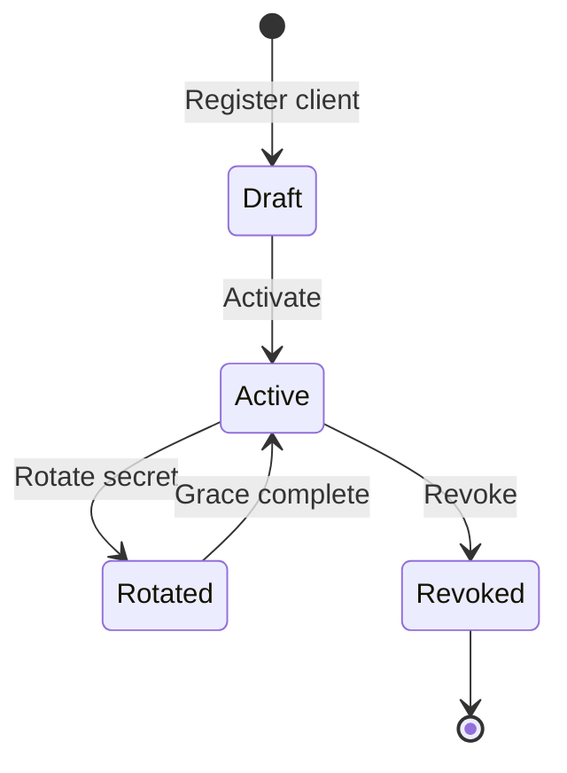
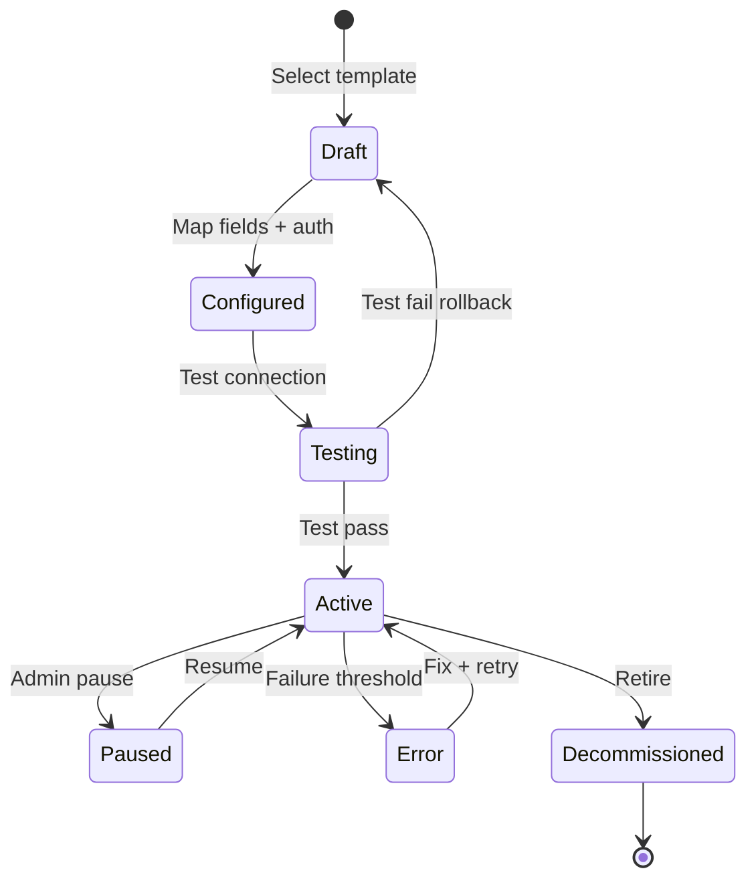

# E-LinkUp — Version 1.0 Enterprise Ready Packs (Finance · Service · Integration)

**Document ID:** ELU-EFS-V1-FIN-SRV-INT  
**Document Name:** V1.0 Enterprise Ready Workflow Packs — FIN · SRV · INT  
**Version:** 1.0 Enterprise Ready  
**Classification:** Internal Confidential  
**Project:** E-LinkUp (By Euphoria Infotech)  
**Example Tenant:** Euphoria  
**Technology Stack:** Flutter (Web + Android) · Python FastAPI · PostgreSQL · JWT + Refresh Token · Docker · Linux VPS / Azure  
**Related Documents:** ELU-EFS-001, ELU-DF-001, ELU-BFS-FIN, ELU-BFS-SRV, ELU-BFS-INT, EFS-PRJ-FIN-SRV-INT  
**Status:** Implementation-ready — satisfies EFS §1.5 V1.0 Definition of Done (artefacts §16–§22)

---

## Pack Index

| Workflow ID | Name | Domain | BFS Module | Phase |
|-------------|------|--------|------------|-------|
| WF-FIN-001 | Customer Invoicing & Collections | FIN | FIN-001, FIN-002, FIN-004 | Phase 2 · v1.0 |
| WF-FIN-002 | Vendor Settlement | FIN | FIN-003, FIN-004 | Phase 2 · v1.0 |
| WF-SRV-001 | Ticket Lifecycle & SLA | SRV | SRV-001–003 | Phase 3 · v1.5 |
| WF-INT-001 | REST API Consumer Lifecycle | INT | INT-001 | Phase 4 · v2.0 |
| WF-INT-002 | Webhook Subscription & Delivery | INT | INT-002 | Phase 4 · v2.0 |
| WF-INT-003 | OAuth 2.0 Delegated Authorization | INT | INT-003 | Phase 4 · v2.0 |
| WF-INT-004 | Connector Provisioning & Sync | INT | INT-004 | Phase 4 · v2.0 |

Each pack below is bounded by `<!-- V1:WF-XXX -->` … `<!-- /V1:WF-XXX -->` markers for selective extraction into ELU-EFS-001 or downstream engineering specs.

---

<!-- V1:WF-FIN-001 -->

## WF-FIN-001 — Customer Invoicing & Collections

| Attribute | Value |
|-----------|-------|
| **Workflow ID** | WF-FIN-001 |
| **Domain** | FIN |
| **Modules** | FIN-001 Invoice · FIN-002 Payment · FIN-004 Tax |
| **Upstream** | WF-PRJ-003 billing eligibility · WF-SAL-003 SO schedule · manual |
| **Downstream** | WF-INT-002 (`invoice.issued`, `payment.received`) · CPS-003 · CPS-004 |
| **Business Rules** | BR-FIN-001–035, BR-FIN-040–048 |
| **Tenant** | Euphoria (Enterprise) |

### 1. Requirement IDs

| Req ID | Title | Priority | BR Ref |
|--------|-------|----------|--------|
| **REQ-FIN-001** | Create Invoice (draft from billing source or manual) | Critical | BR-FIN-001, BR-FIN-004 |
| REQ-FIN-002 | Submit invoice for approval when amount exceeds threshold | Critical | BR-FIN-006, BR-FIN-007 |
| REQ-FIN-003 | Approve or reject invoice (segregation of duties) | Critical | BR-FIN-006–008 |
| REQ-FIN-004 | Issue invoice to customer (PDF + email) with GST validation | Critical | BR-FIN-003, BR-FIN-040–048 |
| REQ-FIN-005 | Record payment receipt against customer | Critical | BR-FIN-016–020 |
| REQ-FIN-006 | Allocate payment to one or more open invoices | Critical | BR-FIN-021–025 |
| REQ-FIN-007 | Issue credit note against issued invoice | High | BR-FIN-009–011 |
| REQ-FIN-008 | Execute dunning reminders on overdue invoices | High | BR-FIN-031–035 |
| REQ-FIN-009 | View billing workbench (eligible projects/milestones) | High | BR-FIN-001 |
| REQ-FIN-010 | Cancel invoice (pre-issue only) | Medium | BR-FIN-003 |
| REQ-FIN-011 | Export invoice register and ageing report | Medium | — |
| REQ-FIN-012 | Customer portal read-only invoice view | Medium | BR-FIN-015 |

### 2. Requirements Traceability Matrix (RTM)

| Requirement | Workflow | Table | API | Flutter Screen | Test Case |
|-------------|----------|-------|-----|----------------|-----------|
| REQ-FIN-001 | WF-FIN-001 | `invoice`, `invoice_line`, `invoice_billing_source` | `POST /api/v1/finance/invoices` | UI-FIN-INV-002 `/finance/invoices/new` | TC-FIN-001 |
| REQ-FIN-001 | WF-FIN-001 | `invoice`, `invoice_line` | `POST /api/v1/finance/invoices/from-milestone/{id}` | UI-FIN-BW-001 `/finance/billing-workbench` | TC-FIN-002 |
| REQ-FIN-002 | WF-FIN-001 | `invoice`, `invoice_status_history` | `POST /api/v1/finance/invoices/{id}/submit` | UI-FIN-INV-003 `/finance/invoices/{id}` | TC-FIN-003 |
| REQ-FIN-003 | WF-FIN-001 | `invoice`, `invoice_status_history` | `POST /api/v1/finance/invoices/{id}/approve` | UI-FIN-INV-004 `/finance/invoices/{id}/approve` | TC-FIN-004 |
| REQ-FIN-004 | WF-FIN-001 | `invoice`, `invoice_tax_line` | `POST /api/v1/finance/invoices/{id}/issue` | UI-FIN-INV-003 | TC-FIN-005 |
| REQ-FIN-004 | WF-FIN-001 | `invoice` | `GET /api/v1/finance/invoices/{id}/pdf` | UI-FIN-INV-003 | TC-FIN-006 |
| REQ-FIN-005 | WF-FIN-001 | `payment_receipt` | `POST /api/v1/finance/payments` | UI-FIN-PAY-002 `/finance/payments/new` | TC-FIN-007 |
| REQ-FIN-006 | WF-FIN-001 | `payment_allocation`, `invoice` | `POST /api/v1/finance/payments/{id}/allocate` | UI-FIN-PAY-003 `/finance/payments/allocate` | TC-FIN-008 |
| REQ-FIN-007 | WF-FIN-001 | `credit_note`, `credit_note_line` | `POST /api/v1/finance/credit-notes` | UI-FIN-CN-002 `/finance/credit-notes/new` | TC-FIN-009 |
| REQ-FIN-008 | WF-FIN-001 | `dunning_log`, `invoice` | `GET /api/v1/finance/dunning/queue` | UI-FIN-DUN-001 `/finance/dunning` | TC-FIN-010 |
| REQ-FIN-009 | WF-FIN-001 | `project`, `milestone` | `GET /api/v1/finance/billing-eligibility` | UI-FIN-BW-001 | TC-FIN-011 |
| REQ-FIN-010 | WF-FIN-001 | `invoice` | `POST /api/v1/finance/invoices/{id}/cancel` | UI-FIN-INV-003 | TC-FIN-012 |
| REQ-FIN-011 | WF-FIN-001 | `invoice` | `GET /api/v1/finance/invoices/export` | UI-FIN-INV-001 `/finance/invoices` | TC-FIN-013 |
| REQ-FIN-012 | WF-FIN-001 | `invoice` | `GET /api/v1/finance/portal/invoices` | UI-FIN-PTL-001 `/portal/invoices` | TC-FIN-014 |

### 3. State Transition Diagram

**Invoice states:** `Draft` → `Pending Approval` → `Approved` → `Issued` → `Partially Paid` / `Paid` / `Overdue` → `Cancelled` / `Credited`

```text
                              ┌─────────────┐
                              │   [Start]   │
                              └──────┬──────┘
                                     │ Create (REQ-FIN-001)
                                     ▼
                              ┌─────────────┐
                         ┌───►│    Draft    │◄─── Reject (rollback)
                         │    └──────┬──────┘
                         │           │ Submit (REQ-FIN-002)
                         │           ▼
                         │    ┌──────────────────┐
                         │    │ Pending Approval │
                         │    └────────┬─────────┘
                         │             │ Approve (REQ-FIN-003)
                         │             ▼
                         │    ┌─────────────┐
                         │    │  Approved   │
                         │    └──────┬──────┘
                         │           │ Issue (REQ-FIN-004)
                         │           ▼
                         │    ┌─────────────┐     Cancel (pre-issue only)
                         │    │   Issued    │────────────────────────────► Cancelled
                         │    └──────┬──────┘
                         │      ┌────┴────┐
                         │      ▼         ▼
                         │ Partially    Paid (full allocation)
                         │   Paid          │
                         │      │            ▼
                         │      └──────► [End]
                         │
                         │    Overdue ◄── past due date (from Issued / Partially Paid)
                         │      │
                         │      └──► Paid (payment + dunning stop)
                         │
                         └── Credit Note path: Issued ──► Credited
```

| Category | Transition | Actor | Guard |
|----------|------------|-------|-------|
| **Allowed** | Draft → Pending Approval | Finance User | Lines + customer valid |
| **Allowed** | Pending Approval → Approved | Sales Manager / Finance User | BR-FIN-007 threshold |
| **Allowed** | Approved → Issued | Finance User | GST valid (BR-FIN-040+) |
| **Allowed** | Issued → Partially Paid / Paid | Finance User | Payment allocated |
| **Allowed** | Issued / Partially Paid → Overdue | System | Past `due_date` |
| **Allowed** | Issued → Credited | Finance User | Credit note issued |
| **Invalid** | Issued → Draft | — | BR-FIN-003 immutable |
| **Invalid** | Paid → Draft | — | Use credit note only |
| **Invalid** | Cancelled → Issued | — | Create new invoice |
| **Rollback** | Pending Approval → Draft | Approver reject | Reason required |
| **Rollback** | Payment allocation reversal | Finance User | Audit + manager approval |
| **Re-open** | N/A | — | Issued invoices not re-opened; credit note path |



### 4. CRUD Responsibility Matrix

| Entity / Action | Finance User | Sales Manager | Customer Contact | Tenant Admin | System |
|-----------------|:------------:|:-------------:|:----------------:|:------------:|:------:|
| Invoice — Create | C | — | — | — | — |
| Invoice — Read | R | R (team) | R (own) | R | R |
| Invoice — Update (draft) | U | — | — | — | — |
| Invoice — Approve | R/A | A (threshold) | — | A (override) | — |
| Invoice — Issue | C/U | — | — | — | C (PDF/email) |
| Invoice — Delete/Cancel | D (draft) | — | — | D | — |
| Payment Receipt — Create | C | — | — | — | — |
| Payment — Allocate | C/U | — | — | — | C (balance calc) |
| Credit Note — Create | C | C | — | — | — |
| Dunning — Execute | R | I | R (recipient) | C (config) | A (scheduler) |
| Billing Workbench — Read | R | R | — | R | — |

**Legend:** C = Create · R = Read · U = Update · D = Delete · A = Approve · I = Informed

### 5. Non-Functional Requirements

| NFR ID | Category | Requirement | Target (Euphoria) |
|--------|----------|-------------|---------------------|
| NFR-FIN-001 | Performance | Invoice create API p95 latency | < 800 ms |
| NFR-FIN-002 | Performance | Issue invoice (PDF generation) p95 | < 3 s |
| NFR-FIN-003 | Performance | Payment allocation transaction | < 1 s p95 |
| NFR-FIN-004 | Performance | Billing workbench list (50 rows) | < 500 ms p95 |
| NFR-FIN-005 | Security | Tenant isolation on all FIN tables | `tenant_id` enforced JWT + RLS |
| NFR-FIN-006 | Security | Creator ≠ approver on same invoice | Configurable SoD |
| NFR-FIN-007 | Security | Customer portal scoped to own `customer_id` | Row-level filter |
| NFR-FIN-008 | Audit | Issued invoice immutability | Append-only status history |
| NFR-FIN-009 | Audit | Tax override reason mandatory | Stored in `invoice_tax_line` |
| NFR-FIN-010 | Scalability | Concurrent invoice issue per tenant | 50/min sustained |
| NFR-FIN-011 | Availability | Finance API uptime | 99.5% monthly |
| NFR-FIN-012 | Data Retention | Invoice + payment records | 7 years (statutory) |
| NFR-FIN-013 | Data Retention | Dunning log | 3 years |
| NFR-FIN-014 | Data Retention | Draft invoices unconverted | Auto-archive after 365 days |

### 6. UI Navigation — Flutter Flow

```text
/finance
 ├── /billing-workbench          [UI-FIN-BW-001]  Eligible projects/milestones → Create Invoice
 ├── /invoices                   [UI-FIN-INV-001]  Invoice register (filter: status, customer, date)
 │    ├── /new                   [UI-FIN-INV-002]  Manual / SO / milestone invoice create
 │    └── /{id}                  [UI-FIN-INV-003]  Detail · lines · tax · timeline · actions
 │         └── /approve          [UI-FIN-INV-004]  Approval panel (Sales Manager)
 ├── /payments                   [UI-FIN-PAY-001]  Receipt register
 │    ├── /new                   [UI-FIN-PAY-002]  Record payment
 │    └── /allocate              [UI-FIN-PAY-003]  Allocation wizard
 ├── /credit-notes               [UI-FIN-CN-001]
 │    └── /new                   [UI-FIN-CN-002]
 ├── /dunning                    [UI-FIN-DUN-001]  Overdue queue + send reminder
 └── /ageing                     [UI-FIN-AGE-001]  Ageing dashboard

/portal/invoices                [UI-FIN-PTL-001]  Customer read-only list + PDF download
```

**Primary user journeys:**

1. **Billing → Invoice:** Billing Workbench → select milestone → pre-filled Create Invoice → Submit → Approve → Issue.  
2. **Collections:** Payments → New Receipt → Allocate → invoice status updates to Paid/Partially Paid.  
3. **Overdue:** Dunning queue → select invoice → send reminder → escalate at Day 21 to Sales Manager.

### 7. API Contract Summary

**Base path:** `/api/v1/finance` · **Auth:** Bearer JWT · **Tenant:** JWT claim `tenant_id` (Euphoria)

| Method | Endpoint | Purpose | Permission | REQ |
|--------|----------|---------|------------|-----|
| GET | `/billing-eligibility` | List billable projects/milestones | `invoice.read` | REQ-FIN-009 |
| POST | `/invoices` | Create draft invoice | `invoice.create` | REQ-FIN-001 |
| POST | `/invoices/from-milestone/{id}` | Create from milestone | `invoice.create` | REQ-FIN-001 |
| POST | `/invoices/from-sales-order/{id}` | Create from SO schedule | `invoice.create` | REQ-FIN-001 |
| GET | `/invoices` | List invoices (paginated) | `invoice.read` | REQ-FIN-011 |
| GET | `/invoices/{id}` | Invoice detail | `invoice.read` | REQ-FIN-001 |
| PUT | `/invoices/{id}` | Update draft | `invoice.update` | REQ-FIN-001 |
| POST | `/invoices/{id}/submit` | Submit for approval | `invoice.submit` | REQ-FIN-002 |
| POST | `/invoices/{id}/approve` | Approve invoice | `invoice.approve` | REQ-FIN-003 |
| POST | `/invoices/{id}/reject` | Reject to draft | `invoice.approve` | REQ-FIN-003 |
| POST | `/invoices/{id}/issue` | Issue to customer | `invoice.issue` | REQ-FIN-004 |
| POST | `/invoices/{id}/cancel` | Cancel (draft/pre-issue) | `invoice.cancel` | REQ-FIN-010 |
| GET | `/invoices/{id}/pdf` | Download PDF | `invoice.print` | REQ-FIN-004 |
| GET | `/invoices/ageing` | Ageing summary | `invoice.read` | REQ-FIN-011 |
| GET | `/invoices/export` | Export CSV/XLSX | `invoice.export` | REQ-FIN-011 |
| POST | `/payments` | Record payment receipt | `payment.create` | REQ-FIN-005 |
| GET | `/payments` | List payments | `payment.read` | REQ-FIN-005 |
| POST | `/payments/{id}/allocate` | Allocate to invoices | `payment.allocate` | REQ-FIN-006 |
| POST | `/credit-notes` | Issue credit note | `credit_note.create` | REQ-FIN-007 |
| GET | `/dunning/queue` | Overdue invoice queue | `dunning.read` | REQ-FIN-008 |
| POST | `/dunning/{invoice_id}/send` | Send dunning notice | `dunning.execute` | REQ-FIN-008 |
| GET | `/portal/invoices` | Customer portal list | `portal.invoice.read` | REQ-FIN-012 |

**Standard response codes:** 200, 201, 400, 401, 403, 404, 422 (BR violation), 409 (duplicate invoice number).

<!-- /V1:WF-FIN-001 -->

---

<!-- V1:WF-FIN-002 -->

## WF-FIN-002 — Vendor Settlement

| Attribute | Value |
|-----------|-------|
| **Workflow ID** | WF-FIN-002 |
| **Domain** | FIN |
| **Modules** | FIN-003 Vendor Settlement · FIN-004 TDS |
| **Upstream** | Purchase Order · Project cost · vendor bill upload |
| **Downstream** | CPS-004 vendor liability reports · WF-INT-004 (Tally sync) |
| **Business Rules** | BR-FIN-036–039, BR-FIN-049–055 |
| **Tenant** | Euphoria (Enterprise) |

### 1. Requirement IDs

| Req ID | Title | Priority | BR Ref |
|--------|-------|----------|--------|
| REQ-FIN-013 | Log vendor invoice (received bill) | Critical | BR-FIN-036 |
| REQ-FIN-014 | Match vendor invoice to PO / project / WO | Critical | BR-FIN-037 |
| REQ-FIN-015 | Submit vendor invoice for approval | Critical | BR-FIN-038 |
| REQ-FIN-016 | Approve vendor invoice for payment | Critical | BR-FIN-038 |
| REQ-FIN-017 | Execute vendor payment with TDS deduction | Critical | BR-FIN-049–055 |
| REQ-FIN-018 | Reconcile vendor payment against bank statement | High | BR-FIN-039 |
| REQ-FIN-019 | Dispute vendor invoice on mismatch | High | BR-FIN-037 |
| REQ-FIN-020 | Generate TDS certificate for vendor | High | BR-FIN-052 |
| REQ-FIN-021 | View vendor liability dashboard | Medium | — |
| REQ-FIN-022 | Cancel void vendor invoice (pre-approval) | Medium | BR-FIN-036 |

### 2. Requirements Traceability Matrix (RTM)

| Requirement | Workflow | Table | API | Flutter Screen | Test Case |
|-------------|----------|-------|-----|----------------|-----------|
| REQ-FIN-013 | WF-FIN-002 | `vendor_invoice`, `vendor_invoice_line` | `POST /api/v1/finance/vendor-invoices` | UI-FIN-VI-002 `/finance/vendor-invoices/new` | TC-FIN-015 |
| REQ-FIN-014 | WF-FIN-002 | `vendor_invoice`, `purchase_order` | `POST /api/v1/finance/vendor-invoices/{id}/match` | UI-FIN-VI-003 `/finance/vendor-invoices/{id}` | TC-FIN-016 |
| REQ-FIN-015 | WF-FIN-002 | `vendor_invoice` | `POST /api/v1/finance/vendor-invoices/{id}/submit` | UI-FIN-VI-003 | TC-FIN-017 |
| REQ-FIN-016 | WF-FIN-002 | `vendor_invoice` | `POST /api/v1/finance/vendor-invoices/{id}/approve` | UI-FIN-VI-004 `/finance/vendor-invoices/{id}/approve` | TC-FIN-018 |
| REQ-FIN-017 | WF-FIN-002 | `vendor_payment`, `tds_deduction` | `POST /api/v1/finance/vendor-payments` | UI-FIN-VP-002 `/finance/vendor-payments/new` | TC-FIN-019 |
| REQ-FIN-017 | WF-FIN-002 | `vendor_payment` | `POST /api/v1/finance/vendor-payments/{id}/execute` | UI-FIN-VP-003 | TC-FIN-020 |
| REQ-FIN-018 | WF-FIN-002 | `vendor_payment`, `bank_reconciliation` | `POST /api/v1/finance/vendor-payments/{id}/reconcile` | UI-FIN-VP-004 | TC-FIN-021 |
| REQ-FIN-019 | WF-FIN-002 | `vendor_invoice` | `POST /api/v1/finance/vendor-invoices/{id}/dispute` | UI-FIN-VI-003 | TC-FIN-022 |
| REQ-FIN-020 | WF-FIN-002 | `tds_deduction` | `GET /api/v1/finance/tds/certificates/{id}` | UI-FIN-TDS-001 `/finance/tds-summary` | TC-FIN-023 |
| REQ-FIN-021 | WF-FIN-002 | `vendor_invoice`, `vendor_payment` | `GET /api/v1/finance/vendor-payments/liability` | UI-FIN-VP-001 `/finance/vendor-payments` | TC-FIN-024 |
| REQ-FIN-022 | WF-FIN-002 | `vendor_invoice` | `POST /api/v1/finance/vendor-invoices/{id}/cancel` | UI-FIN-VI-003 | TC-FIN-025 |

### 3. State Transition Diagram

**Vendor invoice states:** `Received` → `Matched` → `Pending Approval` → `Approved` → `Paid` → `Reconciled` · branch: `Disputed` · terminal: `Cancelled`

```text
[Start] ──► Received ──► Matched ──► Pending Approval ──► Approved ──► Paid ──► Reconciled ──► [End]
                │              │              │                  │
                │              │              └──► Disputed ◄───┘ (mismatch)
                │              │                      │
                │              │                      └──► Matched (resolve)
                └──► Cancelled (void, pre-approval)
```

| Category | Transition | Actor | Guard |
|----------|------------|-------|-------|
| **Allowed** | Received → Matched | Finance User | PO/project link valid |
| **Allowed** | Matched → Pending Approval | Finance User | Three-way match when PO exists |
| **Allowed** | Pending Approval → Approved | Tenant Admin / Finance User | BR-FIN-038 threshold |
| **Allowed** | Approved → Paid | Finance User | TDS computed; PAN valid |
| **Allowed** | Paid → Reconciled | Finance User | Bank reference matched |
| **Allowed** | Pending Approval → Disputed | Finance User / PM | Amount mismatch |
| **Allowed** | Disputed → Matched | Finance User | Resolution documented |
| **Invalid** | Paid → Received | — | Immutable post-payment |
| **Invalid** | Reconciled → Disputed | — | Use adjustment entry |
| **Rollback** | Pending Approval → Matched | Approver reject | Reason required |
| **Re-open** | Disputed → Matched | Finance User | Within 90 days |



### 4. CRUD Responsibility Matrix

| Entity / Action | Finance User | Project Manager | Procurement | Tenant Admin | System |
|-----------------|:------------:|:---------------:|:-----------:|:------------:|:------:|
| Vendor Invoice — Create | C | — | C (upload) | — | — |
| Vendor Invoice — Read | R | R (project) | R | R | R |
| Vendor Invoice — Match | U | C (confirm) | C | — | — |
| Vendor Invoice — Approve | R/A | — | — | A (threshold) | — |
| Vendor Invoice — Dispute | U | C | C | — | — |
| Vendor Payment — Create | C | — | — | — | — |
| Vendor Payment — Execute | C | — | — | A (above limit) | — |
| TDS Certificate — Read | R | — | — | R | C (generate) |
| Vendor Liability — Read | R | R (project) | R | R | — |

### 5. Non-Functional Requirements

| NFR ID | Category | Requirement | Target (Euphoria) |
|--------|----------|-------------|---------------------|
| NFR-FIN-015 | Performance | Vendor invoice match API p95 | < 1 s |
| NFR-FIN-016 | Performance | Payment execution batch (20 vendors) | < 30 s |
| NFR-FIN-017 | Security | Vendor PAN/TDS data encrypted at rest | AES-256 |
| NFR-FIN-018 | Security | Payment execute requires dual approval above ₹5L | Configurable |
| NFR-FIN-019 | Audit | TDS rate snapshot at payment time | Immutable |
| NFR-FIN-020 | Audit | PO match audit trail | `vendor_invoice_match_log` |
| NFR-FIN-021 | Scalability | Vendor invoices per tenant | 10,000 active |
| NFR-FIN-022 | Availability | Vendor payment API | 99.5% monthly |
| NFR-FIN-023 | Data Retention | Vendor invoice + payment | 7 years |
| NFR-FIN-024 | Data Retention | TDS certificates | 7 years |

### 6. UI Navigation — Flutter Flow

```text
/finance
 ├── /vendor-invoices            [UI-FIN-VI-001]  Vendor bill register
 │    ├── /new                   [UI-FIN-VI-002]  Log received bill + attachment
 │    └── /{id}                  [UI-FIN-VI-003]  Match · dispute · submit
 │         └── /approve          [UI-FIN-VI-004]  Approval panel
 ├── /vendor-payments            [UI-FIN-VP-001]  Liability dashboard + payment runs
 │    ├── /new                   [UI-FIN-VP-002]  Create payment batch
 │    ├── /{id}                  [UI-FIN-VP-003]  Execute · TDS preview
 │    └── /{id}/reconcile        [UI-FIN-VP-004]  Bank reconciliation
 └── /tds-summary                [UI-FIN-TDS-001]  TDS register + certificates
```

### 7. API Contract Summary

**Base path:** `/api/v1/finance`

| Method | Endpoint | Purpose | Permission | REQ |
|--------|----------|---------|------------|-----|
| POST | `/vendor-invoices` | Log vendor bill | `vendor_invoice.create` | REQ-FIN-013 |
| GET | `/vendor-invoices` | List vendor invoices | `vendor_invoice.read` | REQ-FIN-013 |
| GET | `/vendor-invoices/{id}` | Detail | `vendor_invoice.read` | REQ-FIN-013 |
| POST | `/vendor-invoices/{id}/match` | Match to PO/project | `vendor_invoice.match` | REQ-FIN-014 |
| POST | `/vendor-invoices/{id}/submit` | Submit for approval | `vendor_invoice.submit` | REQ-FIN-015 |
| POST | `/vendor-invoices/{id}/approve` | Approve | `vendor_invoice.approve` | REQ-FIN-016 |
| POST | `/vendor-invoices/{id}/dispute` | Flag dispute | `vendor_invoice.update` | REQ-FIN-019 |
| POST | `/vendor-invoices/{id}/cancel` | Void | `vendor_invoice.cancel` | REQ-FIN-022 |
| POST | `/vendor-payments` | Create payment run | `vendor_payment.create` | REQ-FIN-017 |
| POST | `/vendor-payments/{id}/execute` | Execute payment | `vendor_payment.execute` | REQ-FIN-017 |
| POST | `/vendor-payments/{id}/reconcile` | Bank reconcile | `vendor_payment.reconcile` | REQ-FIN-018 |
| GET | `/vendor-payments/liability` | Liability dashboard | `vendor_payment.read` | REQ-FIN-021 |
| GET | `/tds/summary` | TDS register | `tds.read` | REQ-FIN-020 |
| GET | `/tds/certificates/{id}` | Download TDS certificate | `tds.read` | REQ-FIN-020 |

<!-- /V1:WF-FIN-002 -->

---

<!-- V1:WF-SRV-001 -->

## WF-SRV-001 — Ticket Lifecycle & SLA

| Attribute | Value |
|-----------|-------|
| **Workflow ID** | WF-SRV-001 |
| **Domain** | SRV |
| **Modules** | SRV-001 Ticket · SRV-002 SLA · SRV-003 Knowledge Base |
| **Upstream** | WF-PRJ-003 handover · CRM Customer · portal/email |
| **Downstream** | WF-INT-002 (`ticket.created`, `ticket.resolved`) · CPS-003 |
| **Business Rules** | BR-SRV-001–020 |
| **Tenant** | Euphoria (Enterprise) |

### 1. Requirement IDs

| Req ID | Title | Priority | BR Ref |
|--------|-------|----------|--------|
| **REQ-SRV-001** | Create Ticket (portal, agent, email, internal) | Critical | BR-SRV-001, BR-SRV-003 |
| REQ-SRV-002 | Classify ticket (category, priority, queue) | Critical | BR-SRV-002, BR-SRV-004 |
| REQ-SRV-003 | Assign ticket to support agent | Critical | BR-SRV-005 |
| REQ-SRV-004 | Transition ticket status through lifecycle | Critical | BR-SRV-006–008 |
| REQ-SRV-005 | Start and pause SLA timers per policy | Critical | BR-SRV-010–014 |
| REQ-SRV-006 | Escalate on SLA breach | Critical | BR-SRV-015, WF-SRV-001-E1 |
| REQ-SRV-007 | Add public and internal comments | High | BR-SRV-016 |
| REQ-SRV-008 | Resolve ticket with resolution notes | High | BR-SRV-007 |
| REQ-SRV-009 | Customer confirm close or reject (re-open) | High | BR-SRV-009 |
| REQ-SRV-010 | Link ticket to Project / Sales Order | Medium | BR-SRV-018 |
| REQ-SRV-011 | Merge duplicate tickets | Medium | BR-SRV-019 |
| REQ-SRV-012 | View SLA dashboard and breach log | Medium | BR-SRV-015 |

### 2. Requirements Traceability Matrix (RTM)

| Requirement | Workflow | Table | API | Flutter Screen | Test Case |
|-------------|----------|-------|-----|----------------|-----------|
| REQ-SRV-001 | WF-SRV-001 | `ticket` | `POST /api/v1/service/tickets` | UI-SRV-TKT-002 `/service/tickets/new` | TC-SRV-001 |
| REQ-SRV-001 | WF-SRV-001 | `ticket` | `POST /api/v1/service/portal/tickets` | UI-SRV-PTL-002 `/portal/tickets/new` | TC-SRV-002 |
| REQ-SRV-002 | WF-SRV-001 | `ticket`, `ticket_category` | `PATCH /api/v1/service/tickets/{id}/classify` | UI-SRV-TKT-003 `/service/tickets/{id}` | TC-SRV-003 |
| REQ-SRV-003 | WF-SRV-001 | `ticket_assignment` | `PATCH /api/v1/service/tickets/{id}/assign` | UI-SRV-TKT-003 | TC-SRV-004 |
| REQ-SRV-004 | WF-SRV-001 | `ticket`, `ticket_status_history` | `PATCH /api/v1/service/tickets/{id}/status` | UI-SRV-TKT-003 | TC-SRV-005 |
| REQ-SRV-005 | WF-SRV-001 | `ticket_sla_instance`, `sla_policy` | `GET /api/v1/service/tickets/{id}/sla` | UI-SRV-TKT-003 | TC-SRV-006 |
| REQ-SRV-006 | WF-SRV-001 | `sla_breach_log` | `POST /api/v1/service/tickets/{id}/escalate` | UI-SRV-SLA-001 `/service/sla-dashboard` | TC-SRV-007 |
| REQ-SRV-007 | WF-SRV-001 | `ticket_comment` | `POST /api/v1/service/tickets/{id}/comments` | UI-SRV-TKT-003 | TC-SRV-008 |
| REQ-SRV-008 | WF-SRV-001 | `ticket` | `PATCH /api/v1/service/tickets/{id}/resolve` | UI-SRV-TKT-003 | TC-SRV-009 |
| REQ-SRV-009 | WF-SRV-001 | `ticket` | `POST /api/v1/service/portal/tickets/{id}/confirm` | UI-SRV-PTL-003 `/portal/tickets/{id}` | TC-SRV-010 |
| REQ-SRV-009 | WF-SRV-001 | `ticket` | `POST /api/v1/service/portal/tickets/{id}/reopen` | UI-SRV-PTL-003 | TC-SRV-011 |
| REQ-SRV-010 | WF-SRV-001 | `ticket_link` | `POST /api/v1/service/tickets/{id}/links` | UI-SRV-TKT-003 | TC-SRV-012 |
| REQ-SRV-011 | WF-SRV-001 | `ticket`, `ticket_link` | `POST /api/v1/service/tickets/{id}/merge` | UI-SRV-TKT-003 | TC-SRV-013 |
| REQ-SRV-012 | WF-SRV-001 | `sla_breach_log`, `ticket_sla_instance` | `GET /api/v1/service/sla/dashboard` | UI-SRV-SLA-001 | TC-SRV-014 |

### 3. State Transition Diagram

**Ticket states:** `New` → `Open` → `In Progress` → `Waiting on Customer` → `Resolved` → `Closed` · branch: `Reopened`

```text
[Start] ──► New ──► Open ──► In Progress ◄──► Waiting on Customer
                              │
                              ├──► Resolved ──► Closed ──► [End]
                              │        │
                              │        └──► Reopened ──► In Progress (resume SLA)
                              │
                              └──► (merge into parent ticket — terminal for child)
```

| Category | Transition | Actor | Guard |
|----------|------------|-------|-------|
| **Allowed** | New → Open | Agent / System | Classified + assigned |
| **Allowed** | Open → In Progress | Support Agent | Work started |
| **Allowed** | In Progress → Waiting on Customer | Support Agent | Info required |
| **Allowed** | Waiting on Customer → In Progress | Customer / Agent | Response received; SLA resumes |
| **Allowed** | In Progress → Resolved | Support Agent | Resolution notes |
| **Allowed** | Resolved → Closed | Customer Contact | Confirm within window |
| **Allowed** | Resolved → Reopened | Customer Contact | Reject within 30 days (BR-SRV-009) |
| **Allowed** | Reopened → In Progress | Support Agent | SLA policy applies |
| **Invalid** | Closed → Open | — | Create new ticket or reopen window expired |
| **Invalid** | New → Resolved | — | Must pass Open |
| **Rollback** | Resolved → In Progress | Support Agent | Premature resolve |
| **Re-open** | Resolved → Reopened → In Progress | Customer | Within `ticket_reopen_days` (30) |



### 4. CRUD Responsibility Matrix

| Entity / Action | Support Agent | Support Manager | Customer Contact | Tenant Admin | System |
|-----------------|:-------------:|:---------------:|:----------------:|:------------:|:------:|
| Ticket — Create | C | C | C (portal) | — | C (email-ingest) |
| Ticket — Read | R (queue) | R (all) | R (own) | R | R |
| Ticket — Update | U | U | — | U (config) | U (SLA clock) |
| Ticket — Assign | U | U | — | — | C (auto-assign) |
| Ticket — Resolve | U | U | — | — | — |
| Ticket — Close | — | U | C (confirm) | — | C (auto-close) |
| Ticket — Reopen | — | U | C (within window) | — | — |
| Comment — Create (public) | C | C | C | — | — |
| Comment — Create (internal) | C | C | — | — | — |
| SLA Policy — Configure | — | R | — | C/U | — |
| Escalation — Trigger | — | A | — | — | A (breach) |

### 5. Non-Functional Requirements

| NFR ID | Category | Requirement | Target (Euphoria) |
|--------|----------|-------------|---------------------|
| NFR-SRV-001 | Performance | Ticket create API p95 | < 500 ms |
| NFR-SRV-002 | Performance | SLA breach notification dispatch | < 60 s from breach |
| NFR-SRV-003 | Performance | Ticket list (100 rows) p95 | < 600 ms |
| NFR-SRV-004 | Security | Internal comments hidden from portal | `is_public = false` filter |
| NFR-SRV-005 | Security | Customer portal scoped to contact | `customer_contact_id` RLS |
| NFR-SRV-006 | Audit | Assignment history immutable | `ticket_assignment` append-only |
| NFR-SRV-007 | Audit | SLA clock snapshots on every transition | `ticket_sla_instance` |
| NFR-SRV-008 | Scalability | Active tickets per tenant | 50,000 |
| NFR-SRV-009 | Availability | Service API uptime | 99.5% monthly |
| NFR-SRV-010 | Data Retention | Closed tickets | 5 years |
| NFR-SRV-011 | Data Retention | SLA breach logs | 3 years |
| NFR-SRV-012 | Data Retention | Ticket attachments | Linked to Document Engine policy |

### 6. UI Navigation — Flutter Flow

```text
/service
 ├── /tickets                    [UI-SRV-TKT-001]  Agent ticket queue (filter: status, priority, SLA)
 │    ├── /new                   [UI-SRV-TKT-002]  Agent create ticket
 │    └── /{id}                  [UI-SRV-TKT-003]  Detail · comments · SLA timer · actions
 ├── /queues                     [UI-SRV-QUE-001]  Queue management by category
 └── /sla-dashboard              [UI-SRV-SLA-001]  Breach warnings · compliance %

/portal
 ├── /tickets                    [UI-SRV-PTL-001]  Customer ticket list
 │    ├── /new                   [UI-SRV-PTL-002]  Customer create ticket
 │    └── /{id}                  [UI-SRV-PTL-003]  View · comment · confirm/reopen
```

### 7. API Contract Summary

**Base path:** `/api/v1/service`

| Method | Endpoint | Purpose | Permission | REQ |
|--------|----------|---------|------------|-----|
| POST | `/tickets` | Create ticket | `ticket.create` | REQ-SRV-001 |
| GET | `/tickets` | List tickets (agent) | `ticket.read` | REQ-SRV-001 |
| GET | `/tickets/{id}` | Ticket detail | `ticket.read` | REQ-SRV-001 |
| PATCH | `/tickets/{id}/classify` | Set category/priority | `ticket.update` | REQ-SRV-002 |
| PATCH | `/tickets/{id}/assign` | Assign agent | `ticket.assign` | REQ-SRV-003 |
| PATCH | `/tickets/{id}/status` | Status transition | `ticket.update` | REQ-SRV-004 |
| PATCH | `/tickets/{id}/resolve` | Resolve with notes | `ticket.resolve` | REQ-SRV-008 |
| POST | `/tickets/{id}/comments` | Add comment | `ticket.update` | REQ-SRV-007 |
| POST | `/tickets/{id}/escalate` | Manual escalation | `ticket.escalate` | REQ-SRV-006 |
| POST | `/tickets/{id}/links` | Link project/SO | `ticket.update` | REQ-SRV-010 |
| POST | `/tickets/{id}/merge` | Merge duplicate | `ticket.merge` | REQ-SRV-011 |
| GET | `/tickets/{id}/sla` | SLA instance detail | `sla.read` | REQ-SRV-005 |
| GET | `/sla/policies` | List SLA policies | `sla.read` | REQ-SRV-005 |
| GET | `/sla/dashboard` | SLA compliance dashboard | `sla.read` | REQ-SRV-012 |
| POST | `/portal/tickets` | Customer create | `portal.ticket.create` | REQ-SRV-001 |
| GET | `/portal/tickets` | Customer list | `portal.ticket.read` | REQ-SRV-001 |
| GET | `/portal/tickets/{id}` | Customer detail | `portal.ticket.read` | REQ-SRV-001 |
| POST | `/portal/tickets/{id}/confirm` | Confirm close | `portal.ticket.update` | REQ-SRV-009 |
| POST | `/portal/tickets/{id}/reopen` | Reject resolution | `portal.ticket.update` | REQ-SRV-009 |

<!-- /V1:WF-SRV-001 -->

---

<!-- V1:WF-INT-001 -->

## WF-INT-001 — REST API Consumer Lifecycle

| Attribute | Value |
|-----------|-------|
| **Workflow ID** | WF-INT-001 |
| **Domain** | INT |
| **Module** | INT-001 REST API Management |
| **Upstream** | Tenant Admin registration |
| **Downstream** | Domain APIs (`/api/v1/crm|sales|finance|service/...`) · WF-INT-003 OAuth |
| **Business Rules** | BR-INT-001–011 |
| **Tenant** | Euphoria (Enterprise) |

### 1. Requirement IDs

| Req ID | Title | Priority | BR Ref |
|--------|-------|----------|--------|
| **REQ-INT-001** | Register API Consumer with name and description | Critical | BR-INT-001 |
| REQ-INT-002 | Assign scopes (least-privilege) to consumer | Critical | BR-INT-002, BR-INT-003 |
| REQ-INT-003 | Issue API key / client credentials (shown once) | Critical | BR-INT-004 |
| REQ-INT-004 | Activate consumer after credential issuance | Critical | BR-INT-005 |
| REQ-INT-005 | Suspend and reinstate consumer | High | BR-INT-006 |
| REQ-INT-006 | Revoke consumer permanently | High | BR-INT-007 |
| REQ-INT-007 | Rotate API secret with dual-key grace period | High | BR-INT-008 |
| REQ-INT-008 | Configure IP allowlist and rate limit tier | High | BR-INT-009, BR-INT-010 |
| REQ-INT-009 | View usage metrics per consumer | Medium | BR-INT-011 |
| REQ-INT-010 | Browse OpenAPI catalogue filtered by granted scopes | Medium | BR-INT-003 |

### 2. Requirements Traceability Matrix (RTM)

| Requirement | Workflow | Table | API | Flutter Screen | Test Case |
|-------------|----------|-------|-----|----------------|-----------|
| REQ-INT-001 | WF-INT-001 | `api_consumer` | `POST /api/v1/integration/api-consumers` | UI-INT-AC-002 `/admin/integration/api-consumers/new` | TC-INT-001 |
| REQ-INT-002 | WF-INT-001 | `api_consumer_scope` | `PUT /api/v1/integration/api-consumers/{id}/scopes` | UI-INT-AC-003 `/admin/integration/api-consumers/{id}` | TC-INT-002 |
| REQ-INT-003 | WF-INT-001 | `api_consumer_key` | `POST /api/v1/integration/api-consumers/{id}/issue-credentials` | UI-INT-AC-003 | TC-INT-003 |
| REQ-INT-004 | WF-INT-001 | `api_consumer` | `PATCH /api/v1/integration/api-consumers/{id}/status` | UI-INT-AC-003 | TC-INT-004 |
| REQ-INT-005 | WF-INT-001 | `api_consumer` | `PATCH /api/v1/integration/api-consumers/{id}/status` | UI-INT-AC-003 | TC-INT-005 |
| REQ-INT-006 | WF-INT-001 | `api_consumer` | `PATCH /api/v1/integration/api-consumers/{id}/status` | UI-INT-AC-003 | TC-INT-006 |
| REQ-INT-007 | WF-INT-001 | `api_consumer_key` | `POST /api/v1/integration/api-consumers/{id}/rotate-secret` | UI-INT-AC-003 | TC-INT-007 |
| REQ-INT-008 | WF-INT-001 | `api_rate_limit_policy` | `PUT /api/v1/integration/api-consumers/{id}/policy` | UI-INT-AC-003 | TC-INT-008 |
| REQ-INT-009 | WF-INT-001 | `api_usage_log` | `GET /api/v1/integration/api-consumers/{id}/usage` | UI-INT-USG-001 `/admin/integration/usage-dashboard` | TC-INT-009 |
| REQ-INT-010 | WF-INT-001 | — | `GET /api/v1/integration/openapi` | UI-INT-OAPI-001 `/admin/integration/openapi-docs` | TC-INT-010 |

### 3. State Transition Diagram

**Consumer states:** `Draft` → `Active` → `Suspended` → `Revoked`

```text
[Start] ──► Draft ──► Active ◄──► Suspended ──► Revoked ──► [End]
              │          │              │
              │          │              └──► Revoked (permanent)
              │          └──► Revoked
              └──► (delete draft — no credentials issued)
```

| Category | Transition | Actor | Guard |
|----------|------------|-------|-------|
| **Allowed** | Draft → Active | Tenant Admin | Credentials issued; ≥1 scope |
| **Allowed** | Active → Suspended | Tenant Admin | Immediate 403 on API calls |
| **Allowed** | Suspended → Active | Tenant Admin | Reinstate |
| **Allowed** | Active → Revoked | Tenant Admin | Permanent; keys invalidated |
| **Allowed** | Suspended → Revoked | Tenant Admin | Permanent |
| **Invalid** | Revoked → Active | — | Register new consumer |
| **Invalid** | Draft → Suspended | — | Must activate first |
| **Rollback** | Draft scope change | Tenant Admin | Before credential issue |
| **Re-open** | N/A | — | Revoked is terminal |



### 4. CRUD Responsibility Matrix

| Entity / Action | Tenant Admin | Platform Admin | API Consumer (external) | System |
|-----------------|:------------:|:--------------:|:-----------------------:|:------:|
| API Consumer — Create | C | — | — | — |
| API Consumer — Read | R | R (limits) | R (own metadata via token) | R |
| API Consumer — Update (scopes) | U | — | — | — |
| API Consumer — Activate/Suspend/Revoke | U/A | C (platform limits) | — | A (rate enforce) |
| API Key — Issue | C | — | — | C |
| API Key — Rotate | U | — | — | — |
| API Key — Read (secret) | R (once on create) | — | — | — |
| Usage Log — Read | R | R | R (own) | C (collect) |
| Rate Limit Policy — Configure | C/U | C (ceiling) | — | A (enforce) |

### 5. Non-Functional Requirements

| NFR ID | Category | Requirement | Target (Euphoria) |
|--------|----------|-------------|---------------------|
| NFR-INT-001 | Performance | Credential issuance | < 2 s |
| NFR-INT-002 | Performance | Revoked key rejection propagation | < 60 s globally |
| NFR-INT-003 | Performance | Usage stats lag | < 5 min |
| NFR-INT-004 | Security | API secret shown once on create | Never returned in GET |
| NFR-INT-005 | Security | Scopes least-privilege enforced | 403 on out-of-scope |
| NFR-INT-006 | Security | Rate limit 429 with Retry-After | Per tier policy |
| NFR-INT-007 | Audit | Key rotation, scope change, revoke logged | Actor + timestamp |
| NFR-INT-008 | Scalability | API consumers per tenant | 100 active |
| NFR-INT-009 | Availability | Integration admin API | 99.5% monthly |
| NFR-INT-010 | Data Retention | Usage logs | 90 days default |
| NFR-INT-011 | Data Retention | Revoked consumer metadata | 2 years |

### 6. UI Navigation — Flutter Flow

```text
/admin/integration
 ├── /api-consumers              [UI-INT-AC-001]  Consumer register
 │    ├── /new                   [UI-INT-AC-002]  Register + scope selection
 │    └── /{id}                  [UI-INT-AC-003]  Detail · credentials · suspend/revoke · rotate
 ├── /usage-dashboard            [UI-INT-USG-001]  Usage by consumer / endpoint
 └── /openapi-docs               [UI-INT-OAPI-001]  Filtered OpenAPI catalogue
```

### 7. API Contract Summary

**Base path:** `/api/v1/integration`

| Method | Endpoint | Purpose | Permission | REQ |
|--------|----------|---------|------------|-----|
| POST | `/api-consumers` | Register consumer | `api_consumer.create` | REQ-INT-001 |
| GET | `/api-consumers` | List consumers | `api_consumer.read` | REQ-INT-001 |
| GET | `/api-consumers/{id}` | Consumer detail | `api_consumer.read` | REQ-INT-001 |
| PUT | `/api-consumers/{id}/scopes` | Assign scopes | `api_consumer.update` | REQ-INT-002 |
| PUT | `/api-consumers/{id}/policy` | IP allowlist + rate tier | `api_consumer.update` | REQ-INT-008 |
| POST | `/api-consumers/{id}/issue-credentials` | Issue API key | `api_consumer.create` | REQ-INT-003 |
| POST | `/api-consumers/{id}/rotate-secret` | Rotate secret (24h grace) | `api_consumer.update` | REQ-INT-007 |
| PATCH | `/api-consumers/{id}/status` | Active/Suspended/Revoked | `api_consumer.update` | REQ-INT-004–006 |
| GET | `/api-consumers/{id}/usage` | Usage metrics | `api_consumer.read` | REQ-INT-009 |
| GET | `/openapi` | Scoped OpenAPI spec | `api_consumer.read` | REQ-INT-010 |

**External callers** authenticate to domain APIs via `X-API-Key` or OAuth bearer (WF-INT-003).

<!-- /V1:WF-INT-001 -->

---

<!-- V1:WF-INT-002 -->

## WF-INT-002 — Webhook Subscription & Delivery

| Attribute | Value |
|-----------|-------|
| **Workflow ID** | WF-INT-002 |
| **Domain** | INT |
| **Module** | INT-002 Webhook Management |
| **Upstream** | Domain events (WF-FIN-001, WF-SRV-001, etc.) |
| **Downstream** | External subscriber HTTPS endpoints |
| **Business Rules** | BR-INT-012–019 |
| **Tenant** | Euphoria (Enterprise) |

### 1. Requirement IDs

| Req ID | Title | Priority | BR Ref |
|--------|-------|----------|--------|
| REQ-INT-011 | Create webhook endpoint with HTTPS URL | Critical | BR-INT-012 |
| REQ-INT-012 | Subscribe endpoint to domain events | Critical | BR-INT-013 |
| REQ-INT-013 | Verify endpoint URL (challenge handshake) | Critical | BR-INT-014 |
| REQ-INT-014 | Deliver signed event payload (HMAC-SHA256) | Critical | BR-INT-015, BR-INT-018 |
| REQ-INT-015 | Retry failed deliveries with exponential backoff | Critical | BR-INT-016 |
| REQ-INT-016 | Suspend endpoint after consecutive failures | High | BR-INT-017 |
| REQ-INT-017 | Replay delivery from dead-letter queue | High | BR-INT-016 |
| REQ-INT-018 | View delivery log and payload hash | High | BR-INT-019 |
| REQ-INT-019 | Test webhook with sample event | Medium | BR-INT-014 |
| REQ-INT-020 | Soft-delete webhook endpoint | Medium | BR-INT-012 |

### 2. Requirements Traceability Matrix (RTM)

| Requirement | Workflow | Table | API | Flutter Screen | Test Case |
|-------------|----------|-------|-----|----------------|-----------|
| REQ-INT-011 | WF-INT-002 | `webhook_endpoint` | `POST /api/v1/integration/webhooks` | UI-INT-WH-002 `/admin/integration/webhooks/new` | TC-INT-011 |
| REQ-INT-012 | WF-INT-002 | `webhook_event_subscription` | `PUT /api/v1/integration/webhooks/{id}/subscriptions` | UI-INT-WH-003 `/admin/integration/webhooks/{id}` | TC-INT-012 |
| REQ-INT-013 | WF-INT-002 | `webhook_endpoint` | `POST /api/v1/integration/webhooks/{id}/verify` | UI-INT-WH-003 | TC-INT-013 |
| REQ-INT-014 | WF-INT-002 | `webhook_delivery_log` | (internal dispatcher) | UI-INT-WH-004 `/admin/integration/webhooks/{id}/deliveries` | TC-INT-014 |
| REQ-INT-015 | WF-INT-002 | `webhook_delivery_log` | (scheduler retry) | UI-INT-WH-004 | TC-INT-015 |
| REQ-INT-016 | WF-INT-002 | `webhook_endpoint` | `PATCH /api/v1/integration/webhooks/{id}/status` | UI-INT-WH-003 | TC-INT-016 |
| REQ-INT-017 | WF-INT-002 | `webhook_dead_letter` | `POST /api/v1/integration/webhooks/{id}/replay/{delivery_id}` | UI-INT-WH-005 `/admin/integration/webhooks/dead-letter` | TC-INT-017 |
| REQ-INT-018 | WF-INT-002 | `webhook_delivery_log` | `GET /api/v1/integration/webhooks/{id}/deliveries` | UI-INT-WH-004 | TC-INT-018 |
| REQ-INT-019 | WF-INT-002 | `webhook_delivery_log` | `POST /api/v1/integration/webhooks/{id}/test` | UI-INT-WH-003 | TC-INT-019 |
| REQ-INT-020 | WF-INT-002 | `webhook_endpoint` | `DELETE /api/v1/integration/webhooks/{id}` | UI-INT-WH-003 | TC-INT-020 |

### 3. State Transition Diagram

**Endpoint states:** `Draft` → `Active` → `Failing` → `Suspended` → `Deleted`

```text
[Start] ──► Draft ──► Active ──► Failing ──► Suspended
                         ▲          │              │
                         │          └── success ───┘
                         │                         │
                         └──── reactivate ─────────┘
Active / Suspended ──► Deleted (soft)
```

| Category | Transition | Actor | Guard |
|----------|------------|-------|-------|
| **Allowed** | Draft → Active | Tenant Admin | URL verified |
| **Allowed** | Active → Failing | System | N consecutive failures |
| **Allowed** | Failing → Active | System | Next delivery succeeds |
| **Allowed** | Failing → Suspended | System | Threshold exceeded |
| **Allowed** | Suspended → Active | Tenant Admin | Manual reactivate |
| **Allowed** | Active → Deleted | Tenant Admin | Soft delete |
| **Invalid** | Deleted → Active | — | Create new endpoint |
| **Invalid** | Draft → Failing | — | Must activate first |
| **Rollback** | Replay from dead-letter | Tenant Admin | Idempotent consumer |
| **Re-open** | Suspended → Active | Tenant Admin | After fixing subscriber |



### 4. CRUD Responsibility Matrix

| Entity / Action | Tenant Admin | Integration Ops | System (Dispatcher) | External Subscriber |
|-----------------|:------------:|:---------------:|:-------------------:|:-------------------:|
| Webhook Endpoint — Create | C | C | — | — |
| Webhook Endpoint — Read | R | R | R | — |
| Webhook Endpoint — Update | U | U | — | — |
| Webhook Endpoint — Delete | D | D | — | — |
| Event Subscription — Configure | C/U | C/U | — | — |
| Delivery — Execute | — | — | C | R (receive) |
| Delivery — Replay | C | C | C | — |
| Dead Letter — Read | R | R | R | — |
| Signing Secret — Rotate | U | U | — | — |

### 5. Non-Functional Requirements

| NFR ID | Category | Requirement | Target (Euphoria) |
|--------|----------|-------------|---------------------|
| NFR-INT-012 | Performance | Event to first delivery attempt | < 60 s |
| NFR-INT-013 | Performance | Retry schedule | 1m, 5m, 30m, 2h (max 8 attempts) |
| NFR-INT-014 | Security | HMAC-SHA256 `X-ELU-Signature` header | Mandatory |
| NFR-INT-015 | Security | HTTPS only; invalid SSL → suspend | Enforced |
| NFR-INT-016 | Security | PII masking per event type | BR-INT-019 |
| NFR-INT-017 | Audit | Payload hash stored; replay audited | Immutable log |
| NFR-INT-018 | Scalability | Max active webhooks per tenant | 20 |
| NFR-INT-019 | Availability | Dispatcher service | 99.5% monthly |
| NFR-INT-020 | Data Retention | Delivery logs | 90 days |
| NFR-INT-021 | Data Retention | Dead-letter queue | 30 days |

### 6. UI Navigation — Flutter Flow

```text
/admin/integration
 ├── /webhooks                   [UI-INT-WH-001]  Endpoint register
 │    ├── /new                   [UI-INT-WH-002]  Create + event selection
 │    └── /{id}                  [UI-INT-WH-003]  Verify · test · suspend · delete
 │         └── /deliveries       [UI-INT-WH-004]  Delivery log + status
 ├── /webhooks/event-catalogue   [UI-INT-WH-006]  Available domain events
 └── /webhooks/dead-letter       [UI-INT-WH-005]  Failed deliveries + replay
```

### 7. API Contract Summary

**Base path:** `/api/v1/integration`

| Method | Endpoint | Purpose | Permission | REQ |
|--------|----------|---------|------------|-----|
| POST | `/webhooks` | Create endpoint | `webhook.create` | REQ-INT-011 |
| GET | `/webhooks` | List endpoints | `webhook.read` | REQ-INT-011 |
| GET | `/webhooks/{id}` | Endpoint detail | `webhook.read` | REQ-INT-011 |
| PUT | `/webhooks/{id}/subscriptions` | Event subscriptions | `webhook.update` | REQ-INT-012 |
| POST | `/webhooks/{id}/verify` | URL verification handshake | `webhook.update` | REQ-INT-013 |
| POST | `/webhooks/{id}/test` | Send test event | `webhook.update` | REQ-INT-019 |
| PATCH | `/webhooks/{id}/status` | Active/Suspended | `webhook.update` | REQ-INT-016 |
| DELETE | `/webhooks/{id}` | Soft delete | `webhook.delete` | REQ-INT-020 |
| GET | `/webhooks/{id}/deliveries` | Delivery log | `webhook.read` | REQ-INT-018 |
| POST | `/webhooks/{id}/replay/{delivery_id}` | Replay delivery | `webhook.replay` | REQ-INT-017 |
| GET | `/webhooks/events` | Event catalogue | `webhook.read` | REQ-INT-012 |

**Subscribed events (Euphoria v1):** `invoice.issued`, `payment.received`, `ticket.created`, `ticket.resolved`, `project.billing_eligible`.

<!-- /V1:WF-INT-002 -->

---

<!-- V1:WF-INT-003 -->

## WF-INT-003 — OAuth 2.0 Delegated Authorization

| Attribute | Value |
|-----------|-------|
| **Workflow ID** | WF-INT-003 |
| **Domain** | INT |
| **Module** | INT-003 OAuth Management |
| **Upstream** | WF-INT-001 consumer registry · user identity (PF-003) |
| **Downstream** | Domain APIs with bearer token |
| **Business Rules** | BR-INT-020–028 |
| **Flows** | Authorization Code + PKCE · Client Credentials |
| **Tenant** | Euphoria (Enterprise) |

### 1. Requirement IDs

| Req ID | Title | Priority | BR Ref |
|--------|-------|----------|--------|
| REQ-INT-021 | Register OAuth client with redirect URIs | Critical | BR-INT-020 |
| REQ-INT-022 | Configure client scopes and type (public/confidential) | Critical | BR-INT-021 |
| REQ-INT-023 | Execute Authorization Code + PKCE flow | Critical | BR-INT-022, BR-INT-024 |
| REQ-INT-024 | Execute Client Credentials flow (server-to-server) | Critical | BR-INT-023 |
| REQ-INT-025 | Display user consent screen with scope list | Critical | BR-INT-025 |
| REQ-INT-026 | Issue and refresh access tokens | Critical | BR-INT-026 |
| REQ-INT-027 | Revoke access and refresh tokens | High | BR-INT-027 |
| REQ-INT-028 | Rotate client secret (confidential clients) | High | BR-INT-028 |
| REQ-INT-029 | List active tokens per client | Medium | BR-INT-027 |
| REQ-INT-030 | Enforce rate limit on token endpoint | Medium | BR-INT-028 |

### 2. Requirements Traceability Matrix (RTM)

| Requirement | Workflow | Table | API | Flutter Screen | Test Case |
|-------------|----------|-------|-----|----------------|-----------|
| REQ-INT-021 | WF-INT-003 | `oauth_client`, `oauth_redirect_uri` | `POST /api/v1/integration/oauth/clients` | UI-INT-OA-002 `/admin/integration/oauth-clients/new` | TC-INT-021 |
| REQ-INT-022 | WF-INT-003 | `oauth_client` | `PUT /api/v1/integration/oauth/clients/{id}` | UI-INT-OA-003 `/admin/integration/oauth-clients/{id}` | TC-INT-022 |
| REQ-INT-023 | WF-INT-003 | `oauth_authorization_code` | `GET /api/v1/integration/oauth/authorize` | UI-INT-OA-004 `/oauth/consent` | TC-INT-023 |
| REQ-INT-023 | WF-INT-003 | `oauth_access_token` | `POST /api/v1/integration/oauth/token` | — (server-side) | TC-INT-024 |
| REQ-INT-024 | WF-INT-003 | `oauth_access_token` | `POST /api/v1/integration/oauth/token` | — | TC-INT-025 |
| REQ-INT-025 | WF-INT-003 | `oauth_consent` | `POST /api/v1/integration/oauth/consent` | UI-INT-OA-004 | TC-INT-026 |
| REQ-INT-026 | WF-INT-003 | `oauth_access_token`, `oauth_refresh_token` | `POST /api/v1/integration/oauth/token` | — | TC-INT-027 |
| REQ-INT-027 | WF-INT-003 | `oauth_access_token`, `oauth_refresh_token` | `POST /api/v1/integration/oauth/revoke` | UI-INT-OA-003 | TC-INT-028 |
| REQ-INT-028 | WF-INT-003 | `oauth_client` | `POST /api/v1/integration/oauth/clients/{id}/rotate-secret` | UI-INT-OA-003 | TC-INT-029 |
| REQ-INT-029 | WF-INT-003 | `oauth_access_token` | `GET /api/v1/integration/oauth/clients/{id}/tokens` | UI-INT-OA-003 | TC-INT-030 |

### 3. State Transition Diagram

**OAuth Client:** `Draft` → `Active` → `Rotated` → `Revoked`  
**Token:** `Issued` → `Refreshed` → `Expired` → `Revoked`

```text
CLIENT LIFECYCLE:
[Start] ──► Draft ──► Active ──► Rotated (secret rotated, old valid 24h) ──► Active
                │         │
                │         └──► Revoked ──► [End]
                └──► (delete draft)

TOKEN LIFECYCLE:
Issued ──► Refreshed (rotation) ──► Expired
   │                                    │
   └──► Revoked ◄──────────────────────┘
```

| Category | Transition | Actor | Guard |
|----------|------------|-------|-------|
| **Allowed** | Draft → Active | Tenant Admin | Redirect URIs valid |
| **Allowed** | Active → Rotated | Tenant Admin | New secret issued |
| **Allowed** | Rotated → Active | System | Grace period elapsed |
| **Allowed** | Active → Revoked | Tenant Admin | All tokens invalidated |
| **Allowed** | Issued → Refreshed | Client app | Valid refresh token |
| **Allowed** | Issued → Revoked | User / Admin | Revoke endpoint |
| **Invalid** | Revoked → Active | — | New client registration |
| **Invalid** | Expired → Refreshed | — | Re-authorize |
| **Rollback** | Consent denied | User | No token issued |
| **Re-open** | Scope downgrade | User | Requires re-consent |





### 4. CRUD Responsibility Matrix

| Entity / Action | Tenant Admin | End User | OAuth Client App | System |
|-----------------|:------------:|:--------:|:----------------:|:------:|
| OAuth Client — Create | C | — | — | — |
| OAuth Client — Read | R | — | R (own client_id) | R |
| OAuth Client — Update | U | — | — | — |
| OAuth Client — Revoke | D/A | — | — | — |
| Redirect URI — Configure | C/U | — | — | — |
| Consent — Grant | — | C | — | — |
| Consent — Revoke | U | U | — | — |
| Access Token — Issue | — | — | — | C |
| Access Token — Refresh | — | — | C | C |
| Access Token — Revoke | U | U | C | C |

### 5. Non-Functional Requirements

| NFR ID | Category | Requirement | Target (Euphoria) |
|--------|----------|-------------|---------------------|
| NFR-INT-022 | Performance | Token endpoint p95 | < 300 ms |
| NFR-INT-023 | Performance | Authorize redirect | < 1 s |
| NFR-INT-024 | Security | PKCE required for public clients | S256 |
| NFR-INT-025 | Security | Refresh token rotation enabled | Single-use refresh |
| NFR-INT-026 | Security | Access token TTL | 1 hour |
| NFR-INT-027 | Security | Auth code TTL | 10 min |
| NFR-INT-028 | Audit | Consent screen version captured | Per grant |
| NFR-INT-029 | Audit | Token grant per client_id + user_id | Immutable |
| NFR-INT-030 | Scalability | Token issuance per tenant | 1,000/hour |
| NFR-INT-031 | Availability | OAuth endpoints | 99.9% monthly |
| NFR-INT-032 | Data Retention | Revoked tokens | 90 days |
| NFR-INT-033 | Data Retention | Consent records | 3 years |

### 6. UI Navigation — Flutter Flow

```text
/admin/integration
 ├── /oauth-clients              [UI-INT-OA-001]  Client register
 │    ├── /new                   [UI-INT-OA-002]  Create client + redirect URIs + scopes
 │    └── /{id}                  [UI-INT-OA-003]  Rotate secret · revoke · token list

/oauth/consent                  [UI-INT-OA-004]  User consent screen (standalone route)
```

### 7. API Contract Summary

**Base path:** `/api/v1/integration`

| Method | Endpoint | Purpose | Permission | REQ |
|--------|----------|---------|------------|-----|
| POST | `/oauth/clients` | Register OAuth client | `oauth_client.create` | REQ-INT-021 |
| GET | `/oauth/clients` | List clients | `oauth_client.read` | REQ-INT-021 |
| GET | `/oauth/clients/{id}` | Client detail | `oauth_client.read` | REQ-INT-021 |
| PUT | `/oauth/clients/{id}` | Update scopes/URIs | `oauth_client.update` | REQ-INT-022 |
| POST | `/oauth/clients/{id}/rotate-secret` | Rotate client secret | `oauth_client.update` | REQ-INT-028 |
| DELETE | `/oauth/clients/{id}` | Revoke client | `oauth_client.delete` | REQ-INT-027 |
| GET | `/oauth/authorize` | Authorization endpoint (browser) | — (user session) | REQ-INT-023 |
| POST | `/oauth/consent` | User approves/denies | — (user session) | REQ-INT-025 |
| POST | `/oauth/token` | Exchange code / client credentials | — (client auth) | REQ-INT-023–026 |
| POST | `/oauth/revoke` | Revoke token | `oauth_client.update` / user | REQ-INT-027 |
| GET | `/oauth/clients/{id}/tokens` | Active tokens list | `oauth_client.read` | REQ-INT-029 |

<!-- /V1:WF-INT-003 -->

---

<!-- V1:WF-INT-004 -->

## WF-INT-004 — Connector Provisioning & Sync

| Attribute | Value |
|-----------|-------|
| **Workflow ID** | WF-INT-004 |
| **Domain** | INT |
| **Module** | INT-004 Connector Management |
| **Upstream** | WF-INT-001 scopes · vault credentials |
| **Downstream** | FIN (Tally invoice export) · CRM (contact sync) |
| **Business Rules** | BR-INT-029–040 |
| **Connectors (v1)** | Tally · Zoho Books · Microsoft 365 · Generic REST |
| **Tenant** | Euphoria (Enterprise) |

### 1. Requirement IDs

| Req ID | Title | Priority | BR Ref |
|--------|-------|----------|--------|
| REQ-INT-031 | Provision connector instance from template | Critical | BR-INT-029 |
| REQ-INT-032 | Configure field mapping (source ↔ E-LinkUp) | Critical | BR-INT-030 |
| REQ-INT-033 | Store credentials in vault (never plaintext in API) | Critical | BR-INT-031 |
| REQ-INT-034 | Test connection without persisting secret in response | Critical | BR-INT-032 |
| REQ-INT-035 | Activate connector after successful test | Critical | BR-INT-033 |
| REQ-INT-036 | Execute scheduled and on-demand sync jobs | Critical | BR-INT-034 |
| REQ-INT-037 | Queue and resolve field-level sync conflicts | High | BR-INT-035 |
| REQ-INT-038 | Pause and resume connector scheduler | High | BR-INT-036 |
| REQ-INT-039 | Circuit breaker on repeated sync failures | High | BR-INT-037 |
| REQ-INT-040 | Decommission connector instance | Medium | BR-INT-038 |
| REQ-INT-041 | View sync job logs and health status | Medium | BR-INT-039 |

### 2. Requirements Traceability Matrix (RTM)

| Requirement | Workflow | Table | API | Flutter Screen | Test Case |
|-------------|----------|-------|-----|----------------|-----------|
| REQ-INT-031 | WF-INT-004 | `connector_instance` | `POST /api/v1/integration/connectors` | UI-INT-CN-002 `/admin/integration/connectors/new` | TC-INT-031 |
| REQ-INT-032 | WF-INT-004 | `connector_mapping` | `PUT /api/v1/integration/connectors/{id}/mapping` | UI-INT-CN-004 `/admin/integration/connectors/{id}/mapping` | TC-INT-032 |
| REQ-INT-033 | WF-INT-004 | `connector_credential_ref` | `POST /api/v1/integration/connectors/{id}/credentials` | UI-INT-CN-003 `/admin/integration/connectors/{id}` | TC-INT-033 |
| REQ-INT-034 | WF-INT-004 | `connector_instance` | `POST /api/v1/integration/connectors/{id}/test` | UI-INT-CN-003 | TC-INT-034 |
| REQ-INT-035 | WF-INT-004 | `connector_instance` | `PATCH /api/v1/integration/connectors/{id}/status` | UI-INT-CN-003 | TC-INT-035 |
| REQ-INT-036 | WF-INT-004 | `connector_sync_job`, `connector_sync_log` | `POST /api/v1/integration/connectors/{id}/sync` | UI-INT-CN-005 `/admin/integration/connectors/{id}/logs` | TC-INT-036 |
| REQ-INT-037 | WF-INT-004 | `connector_conflict` | `GET /api/v1/integration/connectors/{id}/conflicts` | UI-INT-CN-006 `/admin/integration/connectors/{id}/conflicts` | TC-INT-037 |
| REQ-INT-037 | WF-INT-004 | `connector_conflict` | `POST /api/v1/integration/connectors/{id}/conflicts/{cid}/resolve` | UI-INT-CN-006 | TC-INT-038 |
| REQ-INT-038 | WF-INT-004 | `connector_instance` | `PATCH /api/v1/integration/connectors/{id}/status` | UI-INT-CN-003 | TC-INT-039 |
| REQ-INT-039 | WF-INT-004 | `connector_sync_job` | (internal circuit breaker) | UI-INT-CN-001 `/admin/integration/connectors` | TC-INT-040 |
| REQ-INT-040 | WF-INT-004 | `connector_instance` | `PATCH /api/v1/integration/connectors/{id}/status` | UI-INT-CN-003 | TC-INT-041 |
| REQ-INT-041 | WF-INT-004 | `connector_sync_log` | `GET /api/v1/integration/connectors/{id}/jobs` | UI-INT-CN-005 | TC-INT-042 |

### 3. State Transition Diagram

**Connector states:** `Draft` → `Configured` → `Testing` → `Active` → `Paused` / `Error` → `Decommissioned`

```text
[Start] ──► Draft ──► Configured ──► Testing ──► Active ◄──► Paused
                         ▲              │           │
                         │              │ fail      ├──► Error ──► Active (fix + retry)
                         └──────────────┘           │
                                                    └──► Decommissioned ──► [End]
```

| Category | Transition | Actor | Guard |
|----------|------------|-------|-------|
| **Allowed** | Draft → Configured | Tenant Admin | Template + mapping set |
| **Allowed** | Configured → Testing | Tenant Admin | Credentials in vault |
| **Allowed** | Testing → Active | System | Test pass |
| **Allowed** | Testing → Draft | System | Test fail (rollback) |
| **Allowed** | Active → Paused | Tenant Admin | Scheduler stops < 1 min |
| **Allowed** | Paused → Active | Tenant Admin | Resume |
| **Allowed** | Active → Error | System | 5 consecutive failures (circuit breaker) |
| **Allowed** | Error → Active | Tenant Admin | Manual fix + retry |
| **Allowed** | Active → Decommissioned | Tenant Admin | Retire connector |
| **Invalid** | Decommissioned → Active | — | New instance required |
| **Invalid** | Testing → Active | — | Without test pass |
| **Rollback** | Testing → Draft | System | Auth/mapping failure |
| **Re-open** | Error → Active | Tenant Admin | After conflict/auth resolution |



### 4. CRUD Responsibility Matrix

| Entity / Action | Tenant Admin | Finance Admin | CRM Admin | System (CPS-008) |
|-----------------|:------------:|:-------------:|:---------:|:------------------:|
| Connector — Create | C | — | — | — |
| Connector — Read | R | R (FIN connectors) | R (CRM connectors) | R |
| Connector — Configure Mapping | U | C (FIN fields) | C (CRM fields) | — |
| Connector — Store Credentials | C | — | — | R (vault) |
| Connector — Test | C | — | — | C (execute) |
| Connector — Activate/Pause | U/A | — | — | A (scheduler) |
| Sync Job — Trigger | C | — | — | C (scheduled) |
| Conflict — Resolve | U | C (FIN conflicts) | C (CRM conflicts) | — |
| Connector — Decommission | D | — | — | — |
| Sync Log — Read | R | R | R | C |

### 5. Non-Functional Requirements

| NFR ID | Category | Requirement | Target (Euphoria) |
|--------|----------|-------------|---------------------|
| NFR-INT-034 | Performance | Manual sync job start | < 2 min to first batch |
| NFR-INT-035 | Performance | Scheduled sync interval | 15 min default (configurable) |
| NFR-INT-036 | Security | Credentials in vault only | Never in API response |
| NFR-INT-037 | Security | Connector scopes mirror WF-INT-001 | Least privilege |
| NFR-INT-038 | Security | Sync runs under service principal | Not user JWT |
| NFR-INT-039 | Audit | Every sync job: records, errors, duration | `connector_sync_log` |
| NFR-INT-040 | Audit | Conflict resolution records actor decision | Immutable |
| NFR-INT-041 | Scalability | Concurrent sync jobs per tenant | 5 |
| NFR-INT-042 | Availability | Connector scheduler | 99.5% monthly |
| NFR-INT-043 | Data Retention | Sync logs | 90 days |
| NFR-INT-044 | Data Retention | Conflict queue (resolved) | 1 year |

### 6. UI Navigation — Flutter Flow

```text
/admin/integration
 ├── /connectors                 [UI-INT-CN-001]  Connector health dashboard
 │    ├── /new                   [UI-INT-CN-002]  Select template (Tally/Zoho/M365/REST)
 │    └── /{id}                  [UI-INT-CN-003]  Config · test · pause · decommission
 │         ├── /mapping          [UI-INT-CN-004]  Field mapping editor
 │         ├── /logs             [UI-INT-CN-005]  Sync job history
 │         └── /conflicts        [UI-INT-CN-006]  Conflict queue + resolve
```

### 7. API Contract Summary

**Base path:** `/api/v1/integration`

| Method | Endpoint | Purpose | Permission | REQ |
|--------|----------|---------|------------|-----|
| POST | `/connectors` | Provision connector | `connector.create` | REQ-INT-031 |
| GET | `/connectors` | List connectors | `connector.read` | REQ-INT-031 |
| GET | `/connectors/{id}` | Connector detail | `connector.read` | REQ-INT-031 |
| PUT | `/connectors/{id}/mapping` | Field mapping | `connector.update` | REQ-INT-032 |
| POST | `/connectors/{id}/credentials` | Store vault reference | `connector.update` | REQ-INT-033 |
| POST | `/connectors/{id}/test` | Test connection | `connector.update` | REQ-INT-034 |
| PATCH | `/connectors/{id}/status` | Active/Paused/Error/Decommissioned | `connector.update` | REQ-INT-035, 038, 040 |
| POST | `/connectors/{id}/sync` | On-demand sync | `connector.sync` | REQ-INT-036 |
| GET | `/connectors/{id}/jobs` | Sync job list | `connector.read` | REQ-INT-041 |
| GET | `/connectors/{id}/jobs/{job_id}` | Job detail + log | `connector.read` | REQ-INT-041 |
| GET | `/connectors/{id}/conflicts` | Conflict queue | `connector.read` | REQ-INT-037 |
| POST | `/connectors/{id}/conflicts/{cid}/resolve` | Resolve conflict | `connector.update` | REQ-INT-037 |

**Euphoria v1 connector priority:** Tally — daily export of issued invoices (WF-FIN-001); Generic REST — webhook complement to WF-INT-002.

<!-- /V1:WF-INT-004 -->

---

## Appendix A — Cross-Workflow Event Matrix (Euphoria)

| Event | Publisher | Subscribers |
|-------|-----------|-------------|
| `project.billing_eligible` | WF-PRJ-003 | WF-FIN-001, CPS-003 |
| `invoice.issued` | WF-FIN-001 | WF-INT-002, WF-INT-004, CPS-003 |
| `payment.received` | WF-FIN-001 | WF-INT-002, CPS-004 |
| `ticket.created` | WF-SRV-001 | WF-INT-002, CPS-003 |
| `ticket.resolved` | WF-SRV-001 | WF-INT-002, CPS-003 |
| `connector.sync_completed` | WF-INT-004 | FIN, CRM (domain handlers) |

## Appendix B — Document Control

| Version | Date | Author | Changes |
|---------|------|--------|---------|
| 1.0 | 2026-07-31 | Enterprise SA | Initial V1.0 Enterprise Ready packs for WF-FIN-001, WF-FIN-002, WF-SRV-001, WF-INT-001–004 |

---

*End of V1-FIN-SRV-INT*
