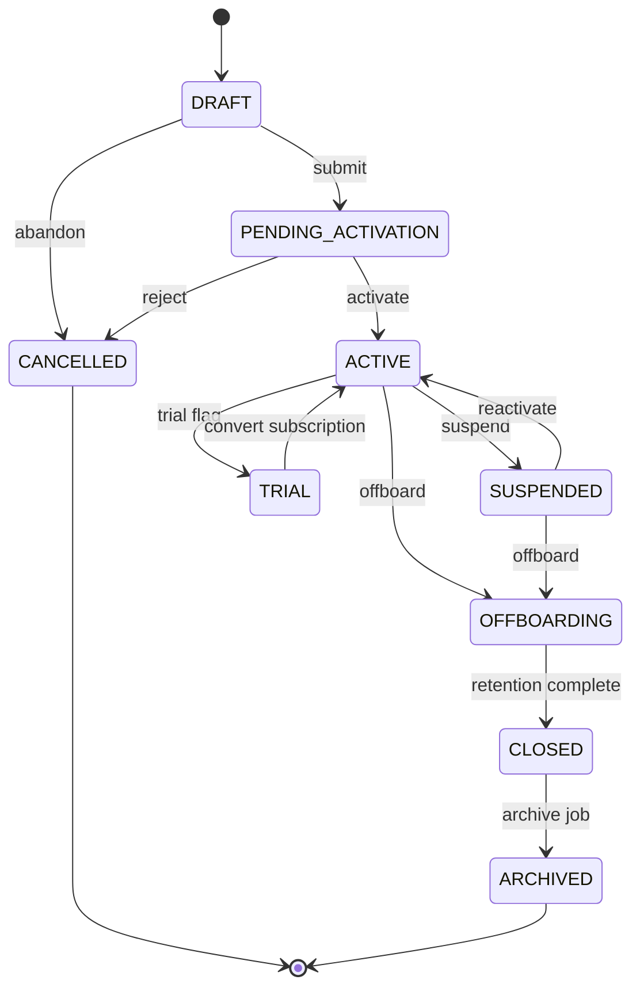
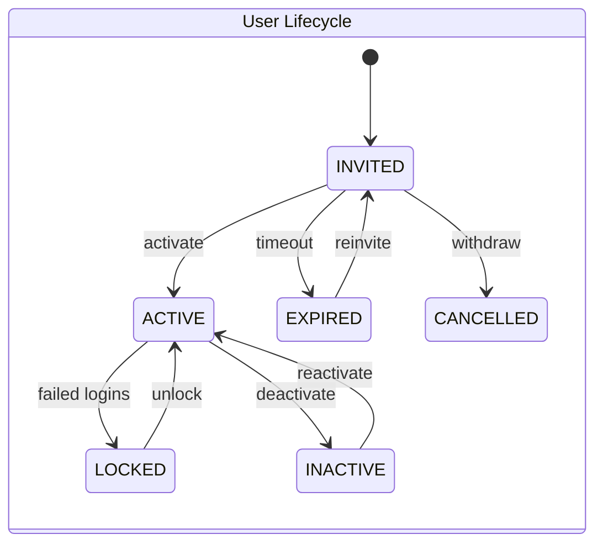
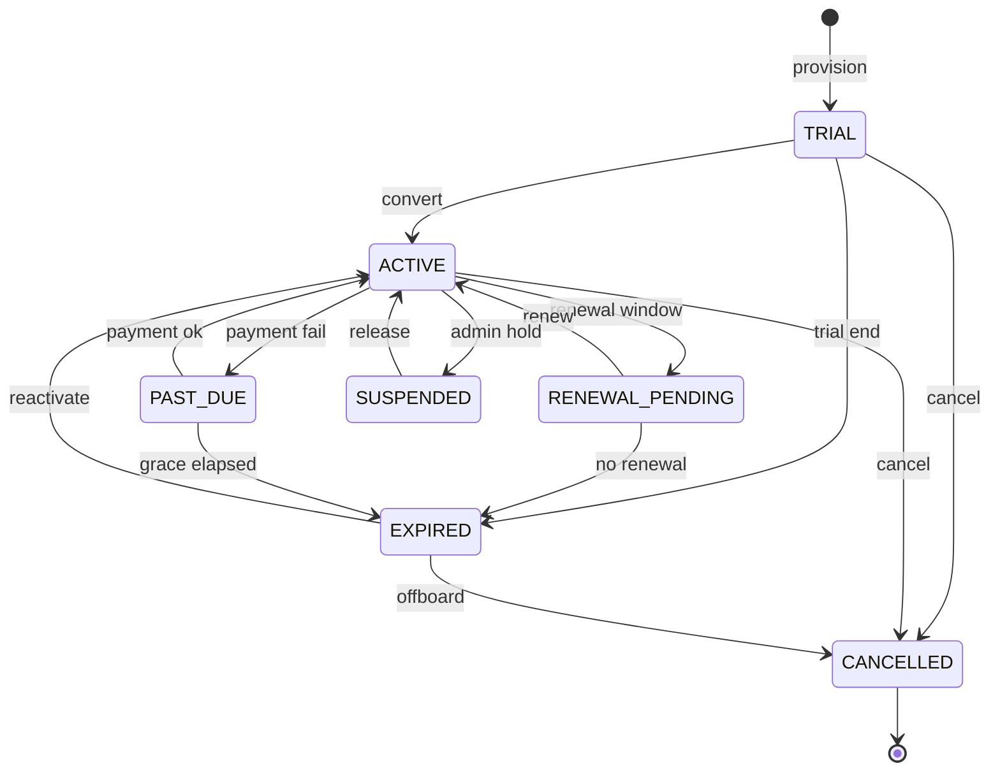
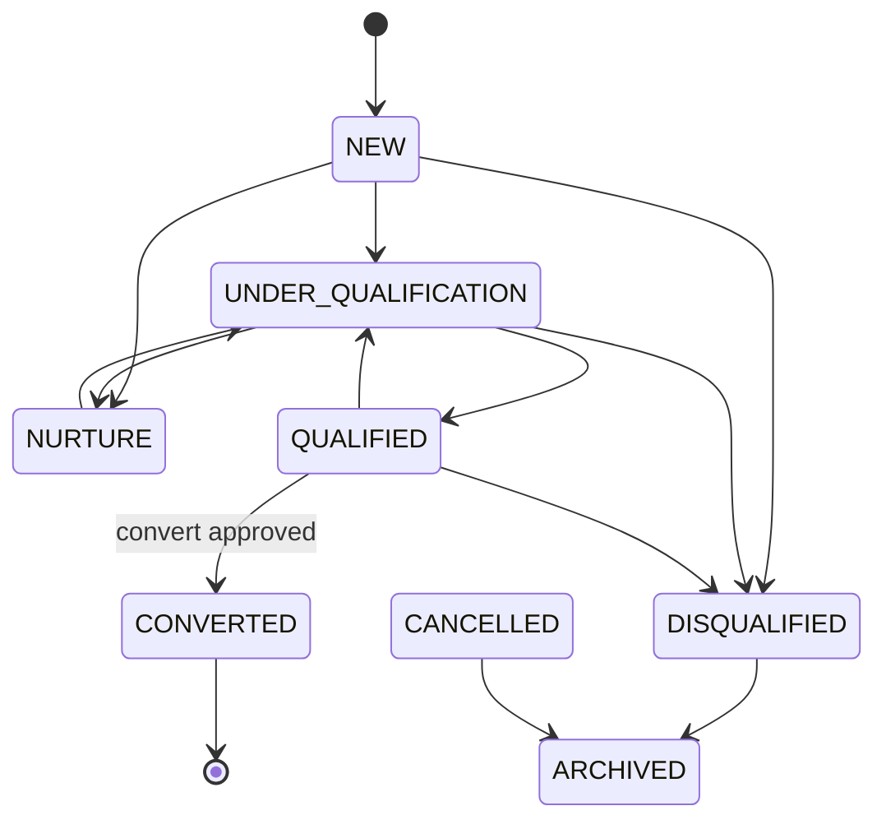
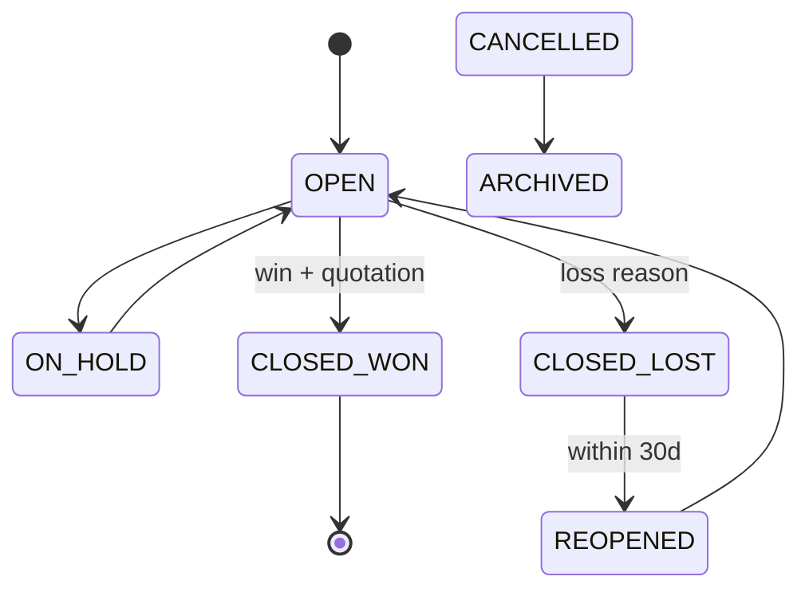
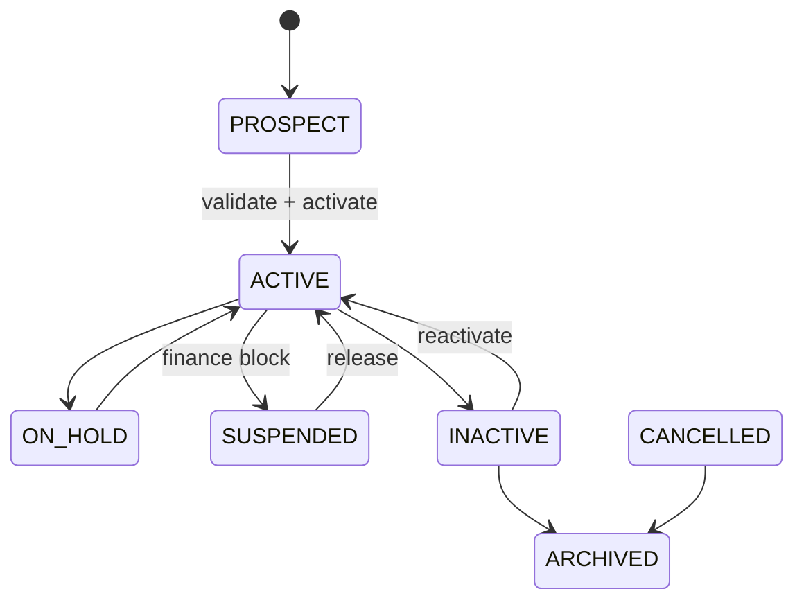
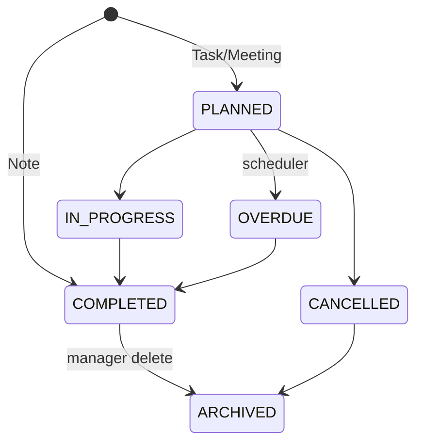

# E-LinkUp — Version 1.0 Enterprise Ready Packs
## Platform Foundation & CRM Workflows

| Attribute | Value |
|-----------|-------|
| **Document ID** | ELU-V1-PF-CRM |
| **Version** | 1.0 |
| **Classification** | Internal Confidential |
| **Project** | E-LinkUp (By Euphoria Infotech) |
| **Example Tenant** | Euphoria |
| **Technology Stack** | Flutter (Web + Android) · Python FastAPI · PostgreSQL · JWT + Refresh Token · Docker · Linux VPS / Azure |
| **Related Documents** | ELU-EFS-PF, ELU-EFS-CRM, ELU-BFS-PF, ELU-BFS-CRM, ELU-SAD-001, ELU-DF-001 |
| **Scope** | WF-PF-001, WF-PF-002, WF-PF-003, WF-CRM-001, WF-CRM-002, WF-CRM-003, WF-CRM-004 |

> **Usage:** Each workflow block is wrapped with `<!-- V1:WF-XXX -->` markers for automated extraction into implementation artefacts (RTM, test plans, API specs, Flutter navigation maps). Aligns with EFS enrichment content in `09-EFS-Enrichments/`.

---

<!-- V1:WF-PF-001 -->

## WF-PF-001 — Tenant Registration & Activation

**Domain:** Platform Foundation · **Module:** PF-002 Tenant Management · **Tenant:** Euphoria

### V1.0 — Requirement IDs

| Requirement ID | Description | Priority | Related BR |
|----------------|-------------|----------|------------|
| REQ-PF-001 | Register a new tenant with unique `code` and `legal_name` via Platform Admin wizard | Critical | BR-PF-001, BR-PF-002 |
| REQ-PF-002 | Provision tenant shell atomically: profile tables, root organisation, TRIAL subscription | Critical | BR-PF-004, BR-PF-008 |
| REQ-PF-003 | Assign ACTIVE edition at registration; reject DEPRECATED editions | High | BR-PF-003, BR-PF-013 |
| REQ-PF-004 | Invite designated Tenant Admin with activation token (72 h expiry) | Critical | BR-PF-005 |
| REQ-PF-005 | Transition tenant `PENDING_ACTIVATION` → `ACTIVE` upon activation token consumption | Critical | BR-PF-006 |
| REQ-PF-006 | Suspend and reactivate tenant; block login when SUSPENDED | Critical | BR-PF-006, BR-PF-007 |
| REQ-PF-007 | Offboard tenant through OFFBOARDING → CLOSED → ARCHIVED lifecycle | High | BR-PF-005 |
| REQ-PF-008 | Enforce idempotent tenant registration via `Idempotency-Key` header | High | BR-PF-008 |
| REQ-PF-009 | Maintain tenant status history with actor, reason, and timestamp | Medium | BR-PF-009 |
| REQ-PF-010 | Export tenant directory to CSV/XLSX for Platform Admin reporting | Medium | BR-PF-010 |
| REQ-PF-011 | Resend activation email when token expires; tenant remains PENDING_ACTIVATION | High | BR-PF-011 |
| REQ-PF-012 | Soft-close tenant; no hard delete of tenant master data | High | BR-PF-005 |

### V1.0 — Requirements Traceability Matrix (RTM)

| Requirement | Workflow | Table | API | Flutter Screen | Test Case |
|-------------|----------|-------|-----|----------------|-----------|
| REQ-PF-001 | WF-PF-001 | `tenant` | `POST /api/v1/platform/tenants` | `TenantRegisterWizard` | TC-PF-001-01 |
| REQ-PF-002 | WF-PF-001 | `tenant`, `organization`, `subscription` | `POST /api/v1/platform/tenants` | `TenantRegisterWizard` | TC-PF-001-02 |
| REQ-PF-003 | WF-PF-001 | `edition` | `POST /api/v1/platform/tenants` | `TenantRegisterWizard` (edition step) | TC-PF-001-03 |
| REQ-PF-004 | WF-PF-001 | `users`, `user_invite` | `POST /api/v1/platform/tenants` | `TenantRegisterWizard` (review step) | TC-PF-001-04 |
| REQ-PF-005 | WF-PF-001 | `tenant`, `tenant_status_history` | `POST /api/v1/platform/tenants/{id}/approve` | `TenantApprovalScreen` | TC-PF-001-05 |
| REQ-PF-006 | WF-PF-001 | `tenant` | `POST /api/v1/platform/tenants/{id}/suspend`, `/reactivate` | `TenantViewScreen` | TC-PF-001-06 |
| REQ-PF-007 | WF-PF-001 | `tenant`, `tenant_status_history` | `PATCH /api/v1/platform/tenants/{id}/status` | `TenantViewScreen` | TC-PF-001-07 |
| REQ-PF-008 | WF-PF-001 | `tenant` | `POST /api/v1/platform/tenants` | `TenantRegisterWizard` | TC-PF-001-08 |
| REQ-PF-009 | WF-PF-001 | `tenant_status_history`, `audit_event` | `GET /api/v1/platform/tenants/{id}` | `TenantHistoryScreen` | TC-PF-001-09 |
| REQ-PF-010 | WF-PF-001 | `tenant` | `GET /api/v1/platform/tenants/export` | `TenantListScreen` | TC-PF-001-10 |
| REQ-PF-011 | WF-PF-001 | `user_invite` | `POST /api/v1/platform/tenants/{id}/resend-activation` | `TenantViewScreen` | TC-PF-001-11 |
| REQ-PF-012 | WF-PF-001 | `tenant` | `DELETE /api/v1/platform/tenants/{id}` | `TenantViewScreen` | TC-PF-001-12 |

### V1.0 — State Transition Diagram

```
                    ┌─────────┐
                    │  DRAFT  │
                    └────┬────┘
           abandon       │ submit
              ┌──────────┼──────────┐
              ▼          ▼          │
        ┌──────────┐  ┌─────────────────────┐
        │CANCELLED │  │ PENDING_ACTIVATION  │
        └──────────┘  └──────────┬──────────┘
                                 │ activate
                    ┌────────────┼────────────┐
                    ▼            ▼            ▼
              ┌─────────┐  ┌─────────┐  ┌────────────┐
              │  TRIAL  │  │ ACTIVE  │  │ SUSPENDED  │
              └────┬────┘  └────┬────┘  └─────┬──────┘
                   │ convert    │ offboard    │ reactivate
                   └──────►ACTIVE│      ▼      └──────►ACTIVE
                                 │ OFFBOARDING │
                                 └──────┬──────┘
                                        ▼
                                   ┌────────┐
                                   │ CLOSED │
                                   └────┬───┘
                                        ▼
                                   ┌──────────┐
                                   │ ARCHIVED │
                                   └──────────┘
```

**Allowed Transitions**

| From | To | Actor | Guard |
|------|-----|-------|-------|
| DRAFT | PENDING_ACTIVATION | Platform Admin | All mandatory fields valid |
| DRAFT | CANCELLED | Platform Admin | Abandon registration |
| PENDING_ACTIVATION | ACTIVE | Tenant Admin + System | Activation token + password policy |
| PENDING_ACTIVATION | CANCELLED | Platform Admin | Pre-activation reject |
| ACTIVE | SUSPENDED | Platform Admin | Policy violation / non-payment |
| ACTIVE | OFFBOARDING | Platform Admin | Offboarding initiated |
| ACTIVE | TRIAL | Platform Admin | Trial flag applied |
| TRIAL | ACTIVE | Platform Admin | Subscription converted (WF-PF-003) |
| SUSPENDED | ACTIVE | Platform Admin | Issue resolved |
| SUSPENDED | OFFBOARDING | Platform Admin | Proceed to close |
| OFFBOARDING | CLOSED | Platform Admin / System | Retention period elapsed |
| CLOSED | ARCHIVED | System | Archive job (90 days post-close) |

**Invalid Transitions**

| From | To | Reason |
|------|-----|--------|
| CLOSED | ACTIVE | Requires new tenant registration |
| ARCHIVED | any | Immutable historical record |
| CANCELLED | ACTIVE | Must re-register |
| SUSPENDED | DRAFT | Not reversible to draft |

**Re-open Rules**

| Scenario | Allowed | Condition |
|----------|---------|-----------|
| SUSPENDED → ACTIVE | Yes | Platform Admin documents reason; JWT re-issued on login |
| CLOSED → ACTIVE | No | New tenant registration required |
| CANCELLED → ACTIVE | No | Re-submit registration |

**Rollback Rules**

| Scenario | Rollback Action |
|----------|-----------------|
| Provision failure mid-transaction | Full DB transaction rollback; no partial tenant |
| Activation email failure | Tenant remains PENDING_ACTIVATION; retry notification (max 3) |
| Approval rejected | Status → CANCELLED; soft-delete draft rows after 30 days |
| Suspend → Reactivate | No data rollback; access restored |



### V1.0 — CRUD Responsibility Matrix

| Role | Create | Read | Update | Approve | Delete |
|------|:------:|:----:|:------:|:-------:|:------:|
| Platform Admin | ✔ | ✔ | ✔ | ✔ | ✔ |
| Tenant Admin | ✘ | ✔ (own tenant) | ✔ (own profile) | ✘ | ✘ |
| Sales Manager | ✘ | ✔ (pipeline view) | ✘ | ✘ | ✘ |
| Sales Executive | ✘ | ✘ | ✘ | ✘ | ✘ |
| Finance User | ✘ | ✘ | ✘ | ✘ | ✘ |
| Pre-Sales | ✘ | ✘ | ✘ | ✘ | ✘ |
| Support Agent | ✘ | ✘ | ✘ | ✘ | ✘ |

### V1.0 — Non-Functional Requirements

| NFR ID | Category | Requirement | Target |
|--------|----------|-------------|--------|
| NFR-PF-001 | Performance | Tenant provision completes end-to-end | P95 < 5 s under 50 concurrent registrations |
| NFR-PF-002 | Performance | Tenant list API (paginated 50 rows) | P95 < 800 ms |
| NFR-PF-003 | Security | All `/api/v1/platform/tenants/*` require Platform Admin or explicit `tenant.*` permission | 100% server-side enforcement |
| NFR-PF-004 | Security | Activation token single-use, 72 h expiry, HS256 signed | Zero reuse tolerance |
| NFR-PF-005 | Security | Tenant Admin of Euphoria cannot access another tenant's profile | Cross-tenant returns 404 |
| NFR-PF-006 | Audit | All provision, status, approve, suspend mutations write `audit_event` | 100% mutation coverage |
| NFR-PF-007 | Audit | Field-level diff on profile updates | JSON patch in audit payload |
| NFR-PF-008 | Scalability | Support 500 active tenants on single VPS tier without provision degradation | P95 provision < 8 s |
| NFR-PF-009 | Availability | Tenant registration API availability | 99.5% monthly uptime |
| NFR-PF-010 | Availability | Idempotent retry on 503 preserves same `tenant_id` | Idempotency-Key honoured |
| NFR-PF-011 | Data Retention | `audit_event` for tenant lifecycle | 7 years (configurable per tenant security policy) |
| NFR-PF-012 | Data Retention | DRAFT auto-cancel after 7 days inactivity | Scheduler JOB-PF-002-01 |

### V1.0 — UI Navigation

```
[Platform Admin Login]
        │
        ▼
┌───────────────────┐
│ TenantListScreen  │  /platform/tenants
│  Filter · Export  │
└─────────┬─────────┘
          │ [+ Register]
          ▼
┌───────────────────────┐
│ TenantRegisterWizard  │  /platform/tenants/register
│  Step 1: Identity     │
│  Step 2: Contacts     │
│  Step 3: Address      │
│  Step 4: Edition      │
│  Step 5: Review       │
└─────────┬─────────────┘
          │ submit
          ▼
┌───────────────────┐     ┌─────────────────────┐
│ TenantViewScreen  │────►│ TenantApprovalScreen │  /platform/tenants/{id}/approve
│  Status badge     │     │  Approve / Reject    │
│  Subscription link│     └─────────────────────┘
└─────────┬─────────┘
          ├──► TenantEditScreen        /platform/tenants/{id}/edit
          ├──► TenantBrandingScreen    (branding tab)
          ├──► TenantSecuritySettings  (security tab)
          ├──► TenantLocalizationScreen
          └──► TenantHistoryScreen     /platform/tenants/{id}/history
```

### V1.0 — API Contract Summary

| Method | Endpoint | Purpose |
|--------|----------|---------|
| POST | `/api/v1/platform/tenants` | Register tenant (atomic provision) |
| GET | `/api/v1/platform/tenants` | List tenants (paginated, filterable) |
| GET | `/api/v1/platform/tenants/{id}` | Tenant detail with child profile |
| PUT | `/api/v1/platform/tenants/{id}` | Full profile update |
| PATCH | `/api/v1/platform/tenants/{id}` | Partial profile update |
| PATCH | `/api/v1/platform/tenants/{id}/status` | Status transition |
| DELETE | `/api/v1/platform/tenants/{id}` | Soft close / archive |
| GET | `/api/v1/platform/tenants/search` | Search by code, name, status, edition |
| GET | `/api/v1/platform/tenants/export` | Export CSV/XLSX |
| POST | `/api/v1/platform/tenants/bulk-import` | Bulk tenant import |
| PATCH | `/api/v1/platform/tenants/bulk-update` | Bulk status update |
| POST | `/api/v1/platform/tenants/{id}/approve` | Approve registration |
| POST | `/api/v1/platform/tenants/{id}/suspend` | Suspend tenant |
| POST | `/api/v1/platform/tenants/{id}/reactivate` | Reactivate tenant |
| POST | `/api/v1/platform/tenants/{id}/resend-activation` | Resend activation email |
| GET | `/api/v1/tenant/profile` | Current tenant profile (JWT scope) |
| PUT | `/api/v1/tenant/profile` | Update own tenant profile |

<!-- /V1:WF-PF-001 -->

---

<!-- V1:WF-PF-002 -->

## WF-PF-002 — Organisation, Users & RBAC Setup

**Domain:** Platform Foundation · **Modules:** PF-004…PF-009 · **Tenant:** Euphoria

### V1.0 — Requirement IDs

| Requirement ID | Description | Priority | Related BR |
|----------------|-------------|----------|------------|
| REQ-PF-013 | Seed system roles and permission catalogue on tenant activation | Critical | BR-PF-061, BR-PF-064 |
| REQ-PF-014 | Define org hierarchy: organisation, branches, departments, business units | Critical | BR-PF-044 |
| REQ-PF-015 | Invite users with email, role, branch, and department assignment | Critical | BR-PF-051, BR-PF-052 |
| REQ-PF-016 | Enforce subscription seat limit on user invite | Critical | BR-PF-022, BR-PF-052 |
| REQ-PF-017 | Activate user account via invite token with password policy compliance | Critical | BR-PF-053, BR-PF-054 |
| REQ-PF-018 | Assign and revoke roles; reflect permissions in JWT within 15 min | Critical | BR-PF-064, BR-PF-066 |
| REQ-PF-019 | Configure role-permission matrix for custom roles (edition limit) | High | BR-PF-061 |
| REQ-PF-020 | Enforce MFA when `tenant_security.mfa_required = true` | High | BR-PF-058 |
| REQ-PF-021 | Lock account after 5 failed login attempts; auto-unlock after 30 min | High | BR-PF-055 |
| REQ-PF-022 | Deactivate and reactivate users; invalidate sessions on deactivation | High | BR-PF-057 |
| REQ-PF-023 | Maintain at least one ACTIVE Tenant Admin at all times | Critical | BR-PF-060 |
| REQ-PF-024 | Export user directory and role-permission matrix | Medium | BR-PF-065 |

### V1.0 — Requirements Traceability Matrix (RTM)

| Requirement | Workflow | Table | API | Flutter Screen | Test Case |
|-------------|----------|-------|-----|----------------|-----------|
| REQ-PF-013 | WF-PF-002 | `role`, `permission`, `role_permission` | (system seed on activation) | — | TC-PF-002-01 |
| REQ-PF-014 | WF-PF-002 | `organization`, `branch`, `department`, `business_unit` | `POST /api/v1/org/organizations`, `/branches`, `/departments`, `/business-units` | `OrgHierarchyScreen` | TC-PF-002-02 |
| REQ-PF-015 | WF-PF-002 | `users`, `user_invite` | `POST /api/v1/users` | `UserInviteScreen` | TC-PF-002-03 |
| REQ-PF-016 | WF-PF-002 | `subscription`, `users` | `POST /api/v1/users` | `UserInviteScreen` | TC-PF-002-04 |
| REQ-PF-017 | WF-PF-002 | `users`, `user_credentials` | `POST /api/v1/auth/register` | `LoginScreen` | TC-PF-002-05 |
| REQ-PF-018 | WF-PF-002 | `user_role`, `role_permission` | `POST /api/v1/rbac/users/{user_id}/roles` | `UserRoleAssignmentScreen` | TC-PF-002-06 |
| REQ-PF-019 | WF-PF-002 | `role`, `role_permission` | `PUT /api/v1/rbac/roles/{id}/permissions` | `RolePermissionMatrixScreen` | TC-PF-002-07 |
| REQ-PF-020 | WF-PF-002 | `user_mfa`, `tenant_security` | `POST /api/v1/auth/login` | `MFASetupScreen` | TC-PF-002-08 |
| REQ-PF-021 | WF-PF-002 | `users` | `POST /api/v1/auth/login` | `LoginScreen` | TC-PF-002-09 |
| REQ-PF-022 | WF-PF-002 | `users`, `user_session` | `PATCH /api/v1/users/{id}` | `UserEditScreen` | TC-PF-002-10 |
| REQ-PF-023 | WF-PF-002 | `users`, `user_role` | `DELETE /api/v1/users/{id}` | `UserViewScreen` | TC-PF-002-11 |
| REQ-PF-024 | WF-PF-002 | `users`, `role` | `GET /api/v1/users/export` | `UserListScreen` | TC-PF-002-12 |

### V1.0 — State Transition Diagram

**User Account Lifecycle**

```
    ┌──────────┐
    │ INVITED  │
    └────┬─────┘
  withdraw│    │activate (72h token)
         │    ▼
    ┌────┴────┐     ┌──────────┐
    │CANCELLED│     │  ACTIVE  │◄──── reactivate
    └─────────┘     └────┬─────┘
         ▲               │ 5 failed logins
    timeout│         ┌───┴───┐
         │          ▼       ▼
    ┌──────────┐  ┌──────┐ ┌──────────┐
    │ EXPIRED  │  │LOCKED│ │ INACTIVE │
    └────┬─────┘  └──┬───┘ └──────────┘
         │ reinvite  │ unlock (30 min / admin)
         └──────────►│
                     └──► ACTIVE
```

**Allowed Transitions (User)**

| From | To | Actor | Guard |
|------|-----|-------|-------|
| INVITED | ACTIVE | User | Valid token + password policy (BR-PF-053) |
| INVITED | EXPIRED | System | 72 h elapsed (BR-PF-054) |
| INVITED | CANCELLED | Tenant Admin | Invite withdrawn |
| ACTIVE | LOCKED | System | 5 failed logins (BR-PF-055) |
| ACTIVE | INACTIVE | Tenant Admin | Deactivation |
| LOCKED | ACTIVE | System / Tenant Admin | 30 min elapsed or admin unlock |
| INACTIVE | ACTIVE | Tenant Admin | Re-activation |
| EXPIRED | INVITED | Tenant Admin | Re-invite |

**Invalid Transitions**

| From | To | Reason |
|------|-----|--------|
| INACTIVE | INVITED | Use reactivate, not re-invite from INACTIVE |
| CANCELLED | ACTIVE | Must create new invite |
| LOCKED | INACTIVE | Must unlock first |

**Re-open Rules**

| Scenario | Allowed | Condition |
|----------|---------|-----------|
| INACTIVE → ACTIVE | Yes | Tenant Admin reactivates; sessions cleared |
| EXPIRED → INVITED | Yes | Tenant Admin re-invites with new token |
| CANCELLED → ACTIVE | No | New invite required |

**Rollback Rules**

| Scenario | Rollback Action |
|----------|-----------------|
| Invite cancelled | `user_invite` revoked; `users` row soft-deleted if never activated |
| Role assignment error | `user_role` row deleted; JWT refreshed on next login |
| Org unit delete blocked | BR-PF-044: cannot delete dept with users — reassign first |



### V1.0 — CRUD Responsibility Matrix

| Role | Create | Read | Update | Approve | Delete |
|------|:------:|:----:|:------:|:-------:|:------:|
| Platform Admin | ✔ (onboarding window) | ✔ | ✔ | ✔ | ✔ |
| Tenant Admin | ✔ | ✔ | ✔ | ✔ | ✔ |
| Sales Manager | ✘ | ✔ (team users) | ✘ | ✘ | ✘ |
| Sales Executive | ✘ | ✔ (self) | ✔ (self profile) | ✘ | ✘ |
| Finance User | ✘ | ✔ (directory) | ✘ | ✘ | ✘ |
| Pre-Sales | ✘ | ✔ (self) | ✔ (self profile) | ✘ | ✘ |
| Support Agent | ✘ | ✔ (self) | ✔ (self profile) | ✘ | ✘ |

### V1.0 — Non-Functional Requirements

| NFR ID | Category | Requirement | Target |
|--------|----------|-------------|--------|
| NFR-PF-013 | Performance | Login API response time | P95 < 500 ms |
| NFR-PF-014 | Performance | Permission check middleware overhead | < 5 ms per request |
| NFR-PF-015 | Performance | System role seed on tenant activation | < 2 s |
| NFR-PF-016 | Security | Server-side `require_permission()` on every mutating endpoint | 100% coverage |
| NFR-PF-017 | Security | Password stored in separate `user_credentials` table; MFA secrets encrypted | AES-256 at rest |
| NFR-PF-018 | Security | Deactivated user cannot obtain new JWT | BR-PF-057 enforced |
| NFR-PF-019 | Audit | Login success/failure, role change, permission denied (403) logged | BR-PF-065 |
| NFR-PF-020 | Audit | Role permission changes emit field-level diff | 7 years retention |
| NFR-PF-021 | Scalability | Support 200 users per tenant with RBAC check < 5 ms | Single VPS tier |
| NFR-PF-022 | Availability | Auth service availability | 99.5% monthly uptime |
| NFR-PF-023 | Availability | Invite email delivery retry on failure | 3 retries with backoff |
| NFR-PF-024 | Data Retention | `user_password_history` | Per tenant security policy (default 12 generations) |
| NFR-PF-025 | Data Retention | Login audit events | 7 years |

### V1.0 — UI Navigation

```
[Tenant Admin Login → JWT issued]
        │
        ▼
┌────────────────────┐
│ OrgHierarchyScreen │  /org/hierarchy
│  Org → Branch → Dept│
└─────────┬──────────┘
          │
    ┌─────┴─────┬──────────────┐
    ▼           ▼              ▼
┌─────────┐ ┌──────────┐ ┌──────────────┐
│UserList │ │RoleList  │ │BranchList /  │
│Screen   │ │Screen    │ │DeptList / BU │
└────┬────┘ └────┬─────┘ └──────────────┘
     │           │
     │ invite    │ permissions
     ▼           ▼
┌─────────────┐ ┌────────────────────────┐
│UserInvite   │ │RolePermissionMatrix    │
│Screen       │ │Screen                  │
└──────┬──────┘ └────────────────────────┘
       │ activate
       ▼
┌─────────────┐     ┌──────────────┐
│LoginScreen  │────►│MFASetupScreen│
└─────────────┘     └──────────────┘
       │
       ▼
┌─────────────┐     ┌──────────────────┐
│UserView     │────►│UserHistoryScreen │
│Screen       │     │ (login audit)    │
└─────────────┘     └──────────────────┘
       │
       └──► WF-CRM-001 Lead Capture (CRM ready)
```

### V1.0 — API Contract Summary

| Method | Endpoint | Purpose |
|--------|----------|---------|
| POST | `/api/v1/org/organizations` | Create organisation |
| GET | `/api/v1/org/organizations` | List organisations |
| PUT | `/api/v1/org/organizations/{id}` | Update organisation |
| PATCH | `/api/v1/org/organizations/{id}` | Partial update |
| DELETE | `/api/v1/org/organizations/{id}` | Soft delete organisation |
| GET | `/api/v1/org/organizations/search` | Search organisations |
| GET | `/api/v1/org/organizations/export` | Export organisations |
| POST | `/api/v1/org/branches` | Create branch |
| GET | `/api/v1/org/branches` | List branches |
| PUT/PATCH/DELETE | `/api/v1/org/branches/{id}` | Branch CRUD |
| GET | `/api/v1/org/branches/search` | Search branches |
| POST | `/api/v1/org/departments` | Create department |
| GET | `/api/v1/org/departments/hierarchy` | Department tree |
| PUT/PATCH/DELETE | `/api/v1/org/departments/{id}` | Department CRUD |
| POST | `/api/v1/org/business-units` | Create business unit |
| GET | `/api/v1/org/business-units` | List business units |
| POST | `/api/v1/users` | Invite user |
| GET | `/api/v1/users` | List users |
| PUT/PATCH/DELETE | `/api/v1/users/{id}` | User CRUD / deactivate |
| GET | `/api/v1/users/search` | Search users |
| GET | `/api/v1/users/export` | Export users |
| POST | `/api/v1/users/bulk-import` | Bulk user import |
| PATCH | `/api/v1/users/bulk-update` | Bulk status update |
| POST | `/api/v1/users/{id}/reinvite` | Resend invite |
| POST | `/api/v1/auth/login` | Login (public) |
| POST | `/api/v1/auth/refresh` | Refresh JWT |
| POST | `/api/v1/auth/register` | Activate invite (public token) |
| POST | `/api/v1/rbac/roles` | Create role |
| GET | `/api/v1/rbac/roles` | List roles |
| PUT | `/api/v1/rbac/roles/{id}/permissions` | Set role permissions |
| POST | `/api/v1/rbac/users/{user_id}/roles` | Assign role to user |
| DELETE | `/api/v1/rbac/users/{user_id}/roles/{role_id}` | Remove role from user |
| GET | `/api/v1/rbac/permissions` | Permission catalogue |
| GET | `/api/v1/rbac/me/permissions` | Current user permissions |

<!-- /V1:WF-PF-002 -->

---

<!-- V1:WF-PF-003 -->

## WF-PF-003 — Subscription Lifecycle

**Domain:** Platform Foundation · **Module:** PF-003 Subscription Management · **Tenant:** Euphoria

### V1.0 — Requirement IDs

| Requirement ID | Description | Priority | Related BR |
|----------------|-------------|----------|------------|
| REQ-PF-025 | Auto-create TRIAL subscription (30 days) on tenant provision | Critical | BR-PF-004 |
| REQ-PF-026 | Convert TRIAL subscription to ACTIVE paid subscription | Critical | BR-PF-019 |
| REQ-PF-027 | Enforce single ACTIVE subscription per tenant | Critical | BR-PF-019 |
| REQ-PF-028 | Validate seat count against edition maximum on create/upgrade | Critical | BR-PF-021 |
| REQ-PF-029 | Block downgrade when active users exceed new seat limit | High | BR-PF-023, BR-PF-027 |
| REQ-PF-030 | Expire subscription and cascade tenant to SUSPENDED within 1 h | Critical | BR-PF-024, BR-PF-007 |
| REQ-PF-031 | Process renewal within renewal window (30 days before expiry) | High | BR-PF-025 |
| REQ-PF-032 | Upgrade/downgrade edition with feature gate recalculation | High | BR-PF-020 |
| REQ-PF-033 | Reactivate EXPIRED subscription with payment confirmation | High | BR-PF-026 |
| REQ-PF-034 | Write `subscription_history` on every status/edition/seat change | High | BR-PF-026 |
| REQ-PF-035 | Expose current subscription and usage vs limits to Tenant Admin | Medium | BR-PF-022 |
| REQ-PF-036 | Send renewal and expiry reminder notifications (30/15/7 days) | Medium | BR-PF-025 |

### V1.0 — Requirements Traceability Matrix (RTM)

| Requirement | Workflow | Table | API | Flutter Screen | Test Case |
|-------------|----------|-------|-----|----------------|-----------|
| REQ-PF-025 | WF-PF-003 | `subscription`, `tenant` | (auto on `POST /api/v1/platform/tenants`) | — | TC-PF-003-01 |
| REQ-PF-026 | WF-PF-003 | `subscription`, `subscription_history` | `POST /api/v1/platform/subscriptions/{id}/convert-trial` | `SubscriptionUpgradeScreen` | TC-PF-003-02 |
| REQ-PF-027 | WF-PF-003 | `subscription` | `POST /api/v1/platform/subscriptions` | `SubscriptionCreateScreen` | TC-PF-003-03 |
| REQ-PF-028 | WF-PF-003 | `subscription`, `edition_limit` | `POST /api/v1/platform/subscriptions` | `SubscriptionCreateScreen` | TC-PF-003-04 |
| REQ-PF-029 | WF-PF-003 | `subscription`, `users` | `POST /api/v1/platform/subscriptions/{id}/downgrade` | `SubscriptionUpgradeScreen` | TC-PF-003-05 |
| REQ-PF-030 | WF-PF-003 | `subscription`, `tenant` | (Scheduler JOB-PF-003-01) | — | TC-PF-003-06 |
| REQ-PF-031 | WF-PF-003 | `subscription`, `subscription_history` | `POST /api/v1/platform/subscriptions/{id}/renew` | `SubscriptionRenewScreen` | TC-PF-003-07 |
| REQ-PF-032 | WF-PF-003 | `subscription`, `edition_feature` | `POST /api/v1/platform/subscriptions/{id}/upgrade` | `SubscriptionUpgradeScreen` | TC-PF-003-08 |
| REQ-PF-033 | WF-PF-003 | `subscription`, `tenant` | `POST /api/v1/platform/subscriptions/{id}/reactivate` | `SubscriptionViewScreen` | TC-PF-003-09 |
| REQ-PF-034 | WF-PF-003 | `subscription_history` | All subscription mutation APIs | `SubscriptionHistoryScreen` | TC-PF-003-10 |
| REQ-PF-035 | WF-PF-003 | `subscription_usage` | `GET /api/v1/tenant/subscription/usage` | `MySubscriptionScreen` | TC-PF-003-11 |
| REQ-PF-036 | WF-PF-003 | — | (Scheduler JOB-PF-003-01) | `MySubscriptionScreen` | TC-PF-003-12 |

### V1.0 — State Transition Diagram

```
    ┌───────┐
    │ TRIAL │──────► EXPIRED ──────► CANCELLED
    └───┬───┘              ▲              ▲
        │ convert          │ grace        │
        ▼                  │              │
    ┌────────┐    renewal   │         offboard
    │ ACTIVE │◄────────────┤              │
    └───┬────┘              │              │
        │                   │              │
   ┌────┼────┐              │              │
   ▼    ▼    ▼              │              │
RENEWAL PAST SUSPENDED      │              │
PENDING DUE                 │              │
   │         │              │              │
   └─renew───┴──grace 15d───┘              │
                                            ▼
                                         [ * ]
```

**Allowed Transitions**

| From | To | Trigger | Actor |
|------|-----|---------|-------|
| TRIAL | ACTIVE | Payment / conversion | Platform Admin |
| TRIAL | EXPIRED | Trial end date reached | Scheduler |
| TRIAL | CANCELLED | Early cancellation | Platform Admin |
| ACTIVE | RENEWAL_PENDING | Enter renewal window (30 d) | Scheduler |
| RENEWAL_PENDING | ACTIVE | Renewal processed | Platform Admin |
| RENEWAL_PENDING | EXPIRED | End date passed without renewal | Scheduler |
| ACTIVE | PAST_DUE | Payment failure flag | Platform Admin |
| PAST_DUE | ACTIVE | Payment resolved | Platform Admin |
| PAST_DUE | EXPIRED | Grace period (15 d) elapsed | Scheduler |
| ACTIVE | SUSPENDED | Admin hold | Platform Admin |
| SUSPENDED | ACTIVE | Admin release | Platform Admin |
| EXPIRED | ACTIVE | Reactivation + payment | Platform Admin |
| Any active | CANCELLED | Explicit cancellation | Platform Admin |

**Invalid Transitions**

| From | To | Reason |
|------|-----|--------|
| CANCELLED | ACTIVE | Requires new subscription row |
| EXPIRED | TRIAL | Trial is one-time per tenant |
| ACTIVE | TRIAL | Cannot revert to trial |

**Re-open Rules**

| Scenario | Allowed | Condition |
|----------|---------|-----------|
| EXPIRED → ACTIVE | Yes | Payment confirmation; tenant status → ACTIVE |
| SUSPENDED → ACTIVE | Yes | Platform Admin release |
| CANCELLED → ACTIVE | No | New subscription row required |

**Rollback Rules**

| Scenario | Rollback Action |
|----------|-----------------|
| Upgrade failure | Revert `tenant.current_subscription_id` to prior subscription; delete draft upgrade row |
| Renewal with invalid seats | Transaction rollback; retain current subscription |
| Expiry cascade failure | Retry job; alert Platform Admin if tenant not SUSPENDED within 1 h (BR-PF-024) |



### V1.0 — CRUD Responsibility Matrix

| Role | Create | Read | Update | Approve | Delete |
|------|:------:|:----:|:------:|:-------:|:------:|
| Platform Admin | ✔ | ✔ | ✔ | ✔ | ✔ (cancel) |
| Tenant Admin | ✘ | ✔ (own) | ✘ | ✘ | ✘ |
| Sales Manager | ✘ | ✔ (pipeline) | ✘ | ✘ | ✘ |
| Sales Executive | ✘ | ✘ | ✘ | ✘ | ✘ |
| Finance User | ✘ | ✔ (commercial terms) | ✘ | ✘ | ✘ |
| Pre-Sales | ✘ | ✘ | ✘ | ✘ | ✘ |
| Support Agent | ✘ | ✘ | ✘ | ✘ | ✘ |

### V1.0 — Non-Functional Requirements

| NFR ID | Category | Requirement | Target |
|--------|----------|-------------|--------|
| NFR-PF-026 | Performance | Subscription status change API | P95 < 2 s |
| NFR-PF-027 | Performance | Feature gate check at API middleware | P95 < 10 ms |
| NFR-PF-028 | Security | Tenant Admin cannot cancel or modify subscription | 403 on mutating calls |
| NFR-PF-029 | Security | `unit_price`, `total_amount` visible to Platform Admin and Finance User only | Field-level RBAC |
| NFR-PF-030 | Security | EXPIRED subscription blocks mutating CRM APIs | Edition gate enforced |
| NFR-PF-031 | Audit | Every status/edition/seat change → `subscription_history` + `audit_event` | 100% coverage |
| NFR-PF-032 | Audit | Trial conversion and renewal approval notes captured | Permanent retention |
| NFR-PF-033 | Scalability | Daily scheduler processes 500 tenant expiry checks | < 5 min batch window |
| NFR-PF-034 | Availability | Scheduler idempotent — re-run does not duplicate EXPIRED transitions | Zero duplicate transitions |
| NFR-PF-035 | Availability | Expiry → tenant SUSPENDED cascade | Within 1 h of expiry (BR-PF-024) |
| NFR-PF-036 | Data Retention | `subscription_history` rows | Platform permanent |
| NFR-PF-037 | Data Retention | `subscription_usage` daily snapshots | 3 years |

### V1.0 — UI Navigation

```
[Platform Admin]
        │
        ▼
┌─────────────────────────┐
│ SubscriptionListScreen  │  /platform/subscriptions
│  Filter: status/edition │
└───────────┬─────────────┘
            │ [+ Create]
            ▼
┌─────────────────────────┐
│ SubscriptionCreateScreen│  /platform/subscriptions/create
└───────────┬─────────────┘
            │
            ▼
┌─────────────────────────┐
│ SubscriptionViewScreen  │  /platform/subscriptions/{id}
│  Usage bar · Features   │
└───────────┬─────────────┘
            ├──► SubscriptionRenewScreen    /platform/subscriptions/{id}/renew
            ├──► SubscriptionUpgradeScreen  /platform/subscriptions/{id}/upgrade
            └──► SubscriptionHistoryScreen  /platform/subscriptions/{id}/history

[Tenant Admin — self-service read]
        │
        ▼
┌─────────────────────────┐
│ MySubscriptionScreen    │  /tenant/subscription
│  Seats used · Renewal   │
└─────────────────────────┘
```

### V1.0 — API Contract Summary

| Method | Endpoint | Purpose |
|--------|----------|---------|
| POST | `/api/v1/platform/subscriptions` | Create subscription |
| GET | `/api/v1/platform/subscriptions` | List subscriptions |
| GET | `/api/v1/platform/subscriptions/{id}` | Subscription detail |
| PUT | `/api/v1/platform/subscriptions/{id}` | Full update |
| PATCH | `/api/v1/platform/subscriptions/{id}` | Status / partial update |
| DELETE | `/api/v1/platform/subscriptions/{id}` | Cancel subscription |
| GET | `/api/v1/platform/subscriptions/search` | Search subscriptions |
| GET | `/api/v1/platform/subscriptions/export` | Export CSV/XLSX |
| POST | `/api/v1/platform/subscriptions/bulk-import` | Bulk import |
| PATCH | `/api/v1/platform/subscriptions/bulk-update` | Bulk status update |
| POST | `/api/v1/platform/subscriptions/{id}/renew` | Process renewal |
| POST | `/api/v1/platform/subscriptions/{id}/upgrade` | Upgrade edition |
| POST | `/api/v1/platform/subscriptions/{id}/downgrade` | Downgrade edition |
| POST | `/api/v1/platform/subscriptions/{id}/reactivate` | Reactivate expired |
| POST | `/api/v1/platform/subscriptions/{id}/convert-trial` | Trial → Active |
| GET | `/api/v1/tenant/subscription` | Current tenant subscription |
| GET | `/api/v1/tenant/subscription/usage` | Usage vs limits |

<!-- /V1:WF-PF-003 -->

---

<!-- V1:WF-CRM-001 -->

## WF-CRM-001 — Lead Capture & Qualification

**Domain:** CRM · **Module:** CRM-001 Lead Management · **Tenant:** Euphoria

### V1.0 — Requirement IDs

| Requirement ID | Description | Priority | Related BR |
|----------------|-------------|----------|------------|
| REQ-CRM-001 | Create a lead with company/contact details, source, and estimated value | Critical | BR-CRM-001, BR-CRM-003, BR-CRM-004 |
| REQ-CRM-002 | Convert lead to opportunity and customer when qualified | Critical | BR-CRM-006, BR-CRM-012, BR-CRM-014 |
| REQ-CRM-003 | Detect duplicate leads by email/phone before create | Critical | BR-CRM-001, BR-CRM-002 |
| REQ-CRM-004 | Auto-assign lead owner based on lead source routing rules | High | BR-CRM-010 |
| REQ-CRM-005 | Qualify lead with complete BANT fields; transition to QUALIFIED | Critical | BR-CRM-006 |
| REQ-CRM-006 | Disqualify lead with mandatory reason code and comment | High | BR-CRM-005 |
| REQ-CRM-007 | Require manager approval for conversion when estimated value > ₹10,00,000 | High | BR-CRM-012 |
| REQ-CRM-008 | Enforce immutable CONVERTED lead (no field updates except notes) | High | BR-CRM-007 |
| REQ-CRM-009 | Restrict Sales Executive to own leads unless `lead.update.all` | High | BR-CRM-011 |
| REQ-CRM-010 | Schedule nurture follow-up with `next_follow_up_date` | Medium | BR-CRM-009 |
| REQ-CRM-011 | Log assignment history on every owner change | Medium | BR-CRM-010 |
| REQ-CRM-012 | Export lead register with PII masking per role | Medium | BR-CRM-020 |

### V1.0 — Requirements Traceability Matrix (RTM)

| Requirement | Workflow | Table | API | Flutter Screen | Test Case |
|-------------|----------|-------|-----|----------------|-----------|
| REQ-CRM-001 | WF-CRM-001 | `lead`, `lead_contact` | `POST /api/v1/crm/leads` | UI-CRM-LD-002 Lead Create | TC-CRM-001-01 |
| REQ-CRM-002 | WF-CRM-001 | `lead`, `customer`, `opportunity`, `lead_conversion_log` | `POST /api/v1/crm/leads/{id}/convert` | UI-CRM-LD-007 Lead Convert Wizard | TC-CRM-001-02 |
| REQ-CRM-003 | WF-CRM-001 | `lead` | `POST /api/v1/crm/leads/duplicate-check` | UI-CRM-LD-012 Duplicate Review | TC-CRM-001-03 |
| REQ-CRM-004 | WF-CRM-001 | `lead`, `lead_assignment_history` | `POST /api/v1/crm/leads` (auto-assign) | UI-CRM-LD-002 Lead Create | TC-CRM-001-04 |
| REQ-CRM-005 | WF-CRM-001 | `lead` | `POST /api/v1/crm/leads/{id}/qualify` | UI-CRM-LD-006 Lead Qualification | TC-CRM-001-05 |
| REQ-CRM-006 | WF-CRM-001 | `lead` | `POST /api/v1/crm/leads/{id}/disqualify` | UI-CRM-LD-008 Disqualify Dialog | TC-CRM-001-06 |
| REQ-CRM-007 | WF-CRM-001 | `lead` | `POST /api/v1/crm/leads/{id}/convert` | UI-CRM-LD-007 Lead Convert Wizard | TC-CRM-001-07 |
| REQ-CRM-008 | WF-CRM-001 | `lead`, `lead_note` | `PUT /api/v1/crm/leads/{id}` | UI-CRM-LD-004 Lead Detail | TC-CRM-001-08 |
| REQ-CRM-009 | WF-CRM-001 | `lead` | `PUT /api/v1/crm/leads/{id}` | UI-CRM-LD-003 Lead Edit | TC-CRM-001-09 |
| REQ-CRM-010 | WF-CRM-001 | `lead` | `PATCH /api/v1/crm/leads/{id}` | UI-CRM-LD-003 Lead Edit | TC-CRM-001-10 |
| REQ-CRM-011 | WF-CRM-001 | `lead_assignment_history` | `POST /api/v1/crm/leads/{id}/assign` | UI-CRM-LD-009 Lead Assignment | TC-CRM-001-11 |
| REQ-CRM-012 | WF-CRM-001 | `lead` | `GET /api/v1/crm/leads/export` | UI-CRM-LD-001 Lead List | TC-CRM-001-12 |

### V1.0 — State Transition Diagram

```
    ┌─────┐
    │ NEW │
    └──┬──┘
       │ qualify path          nurture path
       ▼                       ▼
┌──────────────────┐     ┌─────────┐
│UNDER_QUALIFICATION│     │ NURTURE │
└────────┬─────────┘     └────┬────┘
         │                    │
         ▼                    │
    ┌──────────┐              │
    │QUALIFIED │◄─────────────┘
    └────┬─────┘
         │ convert (approved)
         ▼
    ┌───────────┐     ┌──────────────┐
    │ CONVERTED │     │DISQUALIFIED  │──► ARCHIVED
    └───────────┘     └──────────────┘
         (terminal)         (terminal)
```

**Allowed Transitions**

| From | To | Actor | Guard |
|------|-----|-------|-------|
| NEW | UNDER_QUALIFICATION | Sales Executive | BR-CRM-003 (source + owner) |
| NEW | NURTURE | Sales Executive | BR-CRM-009 (follow-up date) |
| NEW | DISQUALIFIED | Sales Manager | BR-CRM-005 (reason) |
| UNDER_QUALIFICATION | QUALIFIED | Sales Manager | BANT complete |
| UNDER_QUALIFICATION | NURTURE | Sales Executive | Follow-up scheduled |
| UNDER_QUALIFICATION | DISQUALIFIED | Sales Manager | BR-CRM-005 |
| NURTURE | UNDER_QUALIFICATION | Sales Executive | Re-engage |
| QUALIFIED | CONVERTED | System | BR-CRM-006, BR-CRM-012, BR-CRM-014 |
| QUALIFIED | UNDER_QUALIFICATION | Sales Manager | Re-open qualification |
| QUALIFIED | DISQUALIFIED | Sales Manager | BR-CRM-005 |

**Invalid Transitions**

| From | To | Reason |
|------|-----|--------|
| CONVERTED | any | BR-CRM-007 immutable |
| DISQUALIFIED | CONVERTED | Must create new lead |
| DISQUALIFIED | QUALIFIED | Not allowed in Phase 2 |

**Re-open Rules**

| Scenario | Allowed | Condition |
|----------|---------|-----------|
| QUALIFIED → UNDER_QUALIFICATION | Yes | Sales Manager re-opens qualification |
| Conversion approval rejected | Yes | Returns to QUALIFIED; notify requester |
| DISQUALIFIED → re-qualify | No | Create new lead in Phase 2 |

**Rollback Rules**

| Scenario | Rollback Action |
|----------|-----------------|
| Conversion approval rejection | Status remains QUALIFIED; notify requester |
| Failed mid-convert (txn error) | Full DB rollback; lead stays QUALIFIED |
| Assignment rollback | Writes `lead_assignment_history` reversal entry |
| No rollback from CONVERTED | Immutable terminal state |



### V1.0 — CRUD Responsibility Matrix

| Role | Create | Read | Update | Approve | Delete |
|------|:------:|:----:|:------:|:-------:|:------:|
| Sales Executive | ✔ | ✔ (own) | ✔ (own) | ✘ | ✘ |
| Sales Manager | ✔ | ✔ (all) | ✔ (all) | ✔ (convert, qualify) | ✔ |
| Tenant Admin | ✔ | ✔ (all) | ✔ (all) | ✔ (override) | ✔ |
| Platform Admin | ✘ | ✔ (audit) | ✘ | ✘ | ✘ |
| Finance User | ✘ | ✔ (high-value) | ✘ | ✘ (advisory) | ✘ |
| Pre-Sales | ✘ | ✔ (assigned) | ✘ | ✘ | ✘ |
| Support Agent | ✘ | ✔ (read-only) | ✘ | ✘ | ✘ |

### V1.0 — Non-Functional Requirements

| NFR ID | Category | Requirement | Target |
|--------|----------|-------------|--------|
| NFR-CRM-001 | Performance | Lead list API (paginated, 10k records) | P95 < 800 ms |
| NFR-CRM-002 | Performance | Duplicate check API | P95 < 500 ms |
| NFR-CRM-003 | Performance | Convert transaction (customer + opportunity + log) | P95 < 3 s |
| NFR-CRM-004 | Security | Tenant isolation via JWT `tenant_id`; cross-tenant ID returns 404 | BR-CRM-017 |
| NFR-CRM-005 | Security | RBAC enforced server-side on all `lead.*` permissions | 100% coverage |
| NFR-CRM-006 | Security | PII masked in export without `lead.export` + role grant | BR-CRM-020 |
| NFR-CRM-007 | Audit | All mutations → `audit_event` via CPS-005 | 100% mutation coverage |
| NFR-CRM-008 | Audit | Conversion snapshot in `lead_conversion_log` | 7 years retention |
| NFR-CRM-009 | Scalability | Support 50k leads per tenant with indexed queries | `(tenant_id, status)` index |
| NFR-CRM-010 | Availability | Lead capture API availability | 99.5% monthly uptime |
| NFR-CRM-011 | Availability | Convert transaction atomic — failure rolls back all inserts | Zero partial converts |
| NFR-CRM-012 | Data Retention | `audit_event` for lead lifecycle | 7 years |
| NFR-CRM-013 | Data Retention | Soft-deleted leads restorable within 90 days | BR-CRM-016 |

### V1.0 — UI Navigation

```
[CRM Home]
    │
    ▼
┌─────────────────┐
│ UI-CRM-LD-001   │  /crm/leads
│ Lead List       │  Filter · Export
└────────┬────────┘
         │ [+ New Lead]
         ▼
┌─────────────────┐     ┌──────────────────┐
│ UI-CRM-LD-002   │────►│ UI-CRM-LD-012    │
│ Lead Create     │     │ Duplicate Review │ (modal, on 409)
└────────┬────────┘     └──────────────────┘
         │ save
         ▼
┌─────────────────┐
│ UI-CRM-LD-004   │  /crm/leads/{id}
│ Lead Detail     │  Timeline embed (UI-CRM-ACT-001)
└────────┬────────┘
         ├──► UI-CRM-LD-003 Lead Edit       /crm/leads/{id}/edit
         ├──► UI-CRM-LD-006 Qualification   /crm/leads/{id}/qualify
         ├──► UI-CRM-LD-009 Assignment      /crm/leads/{id}/assign
         ├──► UI-CRM-LD-008 Disqualify      (modal)
         ├──► UI-CRM-LD-010 History         /crm/leads/{id}/history
         └──► UI-CRM-LD-007 Convert Wizard  /crm/leads/{id}/convert
                    │
                    ▼ (on success)
              WF-CRM-002 Opportunity
              WF-CRM-003 Customer
```

### V1.0 — API Contract Summary

| Method | Endpoint | Purpose |
|--------|----------|---------|
| POST | `/api/v1/crm/leads` | Create lead |
| GET | `/api/v1/crm/leads` | List leads (paginated) |
| GET | `/api/v1/crm/leads/{id}` | Get lead by ID |
| PUT | `/api/v1/crm/leads/{id}` | Full update |
| PATCH | `/api/v1/crm/leads/{id}` | Partial update |
| PATCH | `/api/v1/crm/leads/{id}/status` | Status transition |
| DELETE | `/api/v1/crm/leads/{id}` | Soft delete |
| POST | `/api/v1/crm/leads/{id}/restore` | Restore soft-deleted lead |
| POST | `/api/v1/crm/leads/{id}/assign` | Assign owner |
| POST | `/api/v1/crm/leads/{id}/qualify` | Mark qualified |
| POST | `/api/v1/crm/leads/{id}/disqualify` | Disqualify with reason |
| POST | `/api/v1/crm/leads/{id}/convert` | Convert to customer + opportunity |
| GET | `/api/v1/crm/leads/search` | Advanced search |
| GET | `/api/v1/crm/leads/export` | Export CSV/XLSX |
| POST | `/api/v1/crm/leads/duplicate-check` | Pre-create duplicate check |
| GET | `/api/v1/crm/leads/{id}/history` | Assignment + status history |
| POST | `/api/v1/crm/leads/{id}/contacts` | Add lead contact |
| POST | `/api/v1/crm/leads/{id}/attachments` | Upload attachment |
| GET | `/api/v1/crm/lead-sources` | List lead sources |

<!-- /V1:WF-CRM-001 -->

---

<!-- V1:WF-CRM-002 -->

## WF-CRM-002 — Opportunity Pipeline

**Domain:** CRM · **Module:** CRM-002 Opportunity Management · **Tenant:** Euphoria

### V1.0 — Requirement IDs

| Requirement ID | Description | Priority | Related BR |
|----------------|-------------|----------|------------|
| REQ-CRM-013 | Create opportunity manually or auto from lead conversion | Critical | BR-CRM-010, BR-CRM-021 |
| REQ-CRM-014 | Advance opportunity through pipeline stages with gate validation | Critical | BR-CRM-024, BR-CRM-032 |
| REQ-CRM-015 | Require manager approval when value > ₹15,00,000 at BUDGET_VALIDATION → PROPOSAL | High | BR-CRM-011 |
| REQ-CRM-016 | Auto-advance to QUOTATION_ISSUED when quotation created (SAL-001) | High | BR-CRM-035 |
| REQ-CRM-017 | Close Won only with approved quotation linked | Critical | BR-CRM-027 |
| REQ-CRM-018 | Close Lost with mandatory `loss_reason_id` and comment | High | BR-CRM-012, BR-CRM-028 |
| REQ-CRM-019 | Reopen Closed Lost within 30 days with justification (≥20 chars) | Medium | BR-CRM-014, BR-CRM-037 |
| REQ-CRM-020 | Calculate weighted forecast value (value × probability) | High | BR-CRM-013, BR-CRM-026 |
| REQ-CRM-021 | Assign Pre-Sales team members to opportunity | Medium | BR-CRM-031 |
| REQ-CRM-022 | Put opportunity ON_HOLD; block quotation create while on hold | Medium | BR-CRM-033 |
| REQ-CRM-023 | Prevent invalid stage skip (sequential pipeline) | High | BR-CRM-024 |
| REQ-CRM-024 | Display pipeline kanban with drag-to-advance stage | High | BR-CRM-030 |

### V1.0 — Requirements Traceability Matrix (RTM)

| Requirement | Workflow | Table | API | Flutter Screen | Test Case |
|-------------|----------|-------|-----|----------------|-----------|
| REQ-CRM-013 | WF-CRM-002 | `opportunity` | `POST /api/v1/crm/opportunities` | UI-CRM-OPP-003 Opportunity Create | TC-CRM-002-01 |
| REQ-CRM-014 | WF-CRM-002 | `opportunity`, `opportunity_stage_history` | `PATCH /api/v1/crm/opportunities/{id}/stage` | UI-CRM-OPP-006 Stage Advance Dialog | TC-CRM-002-02 |
| REQ-CRM-015 | WF-CRM-002 | `opportunity` | `PATCH /api/v1/crm/opportunities/{id}/stage` | UI-CRM-OPP-006 Stage Advance Dialog | TC-CRM-002-03 |
| REQ-CRM-016 | WF-CRM-002 | `opportunity`, `opportunity_stage` | `PATCH /api/v1/crm/opportunities/{id}/stage` | UI-CRM-OPP-002 Pipeline Kanban | TC-CRM-002-04 |
| REQ-CRM-017 | WF-CRM-002 | `opportunity` | `POST /api/v1/crm/opportunities/{id}/close-won` | UI-CRM-OPP-007 Close Won/Lost Wizard | TC-CRM-002-05 |
| REQ-CRM-018 | WF-CRM-002 | `opportunity`, `opportunity_competitor` | `POST /api/v1/crm/opportunities/{id}/close-lost` | UI-CRM-OPP-007 Close Won/Lost Wizard | TC-CRM-002-06 |
| REQ-CRM-019 | WF-CRM-002 | `opportunity` | `POST /api/v1/crm/opportunities/{id}/reopen` | UI-CRM-OPP-005 Opportunity Detail | TC-CRM-002-07 |
| REQ-CRM-020 | WF-CRM-002 | `opportunity_forecast_snapshot` | `GET /api/v1/crm/opportunities/forecast` | UI-CRM-OPP-008 Forecast View | TC-CRM-002-08 |
| REQ-CRM-021 | WF-CRM-002 | `opportunity_team_member` | `POST /api/v1/crm/opportunities/{id}/team-members` | UI-CRM-OPP-009 Opportunity Team | TC-CRM-002-09 |
| REQ-CRM-022 | WF-CRM-002 | `opportunity` | `POST /api/v1/crm/opportunities/{id}/hold` | UI-CRM-OPP-005 Opportunity Detail | TC-CRM-002-10 |
| REQ-CRM-023 | WF-CRM-002 | `opportunity_stage` | `PATCH /api/v1/crm/opportunities/{id}/stage` | UI-CRM-OPP-002 Pipeline Kanban | TC-CRM-002-11 |
| REQ-CRM-024 | WF-CRM-002 | `opportunity`, `opportunity_stage` | `GET /api/v1/crm/opportunities/pipeline` | UI-CRM-OPP-002 Pipeline Kanban | TC-CRM-002-12 |

### V1.0 — State Transition Diagram

**Lifecycle Status (`opportunity.status`)**

```
    ┌──────┐
    │ OPEN │◄──────────────────┐
    └──┬───┘                   │
       │ on hold               │ reopen (30d)
       ▼                       │
  ┌─────────┐            ┌──────────┐
  │ON_HOLD  │            │ REOPENED │
  └────┬────┘            └────┬─────┘
       │ resume               │
       └──────►OPEN────────────┘
              │
       ┌──────┴──────┐
       ▼             ▼
┌────────────┐ ┌────────────┐
│CLOSED_WON  │ │CLOSED_LOST │
└────────────┘ └────────────┘
  (terminal)      (terminal)
```

**Pipeline Stages:** QUALIFICATION → TECHNICAL_EVAL → BUDGET_VALIDATION → PROPOSAL → QUOTATION_ISSUED → NEGOTIATION

**Allowed Transitions**

| From | To | Guard | Valid |
|------|-----|-------|-------|
| QUALIFICATION | TECHNICAL_EVAL | `opportunity_value` > 0 (BR-CRM-022) | ✓ |
| BUDGET_VALIDATION | PROPOSAL | Manager approval if value > ₹15L (BR-CRM-011) | ✓ |
| PROPOSAL | QUOTATION_ISSUED | Quotation created (BR-CRM-035) | ✓ |
| NEGOTIATION | CLOSED_WON | Approved quotation linked (BR-CRM-027) | ✓ |
| Any OPEN | CLOSED_LOST | `loss_reason_id` + comment (BR-CRM-012) | ✓ |
| CLOSED_LOST | REOPENED | Within 30 days + justification (BR-CRM-014) | ✓ |
| OPEN | ON_HOLD | Manager action (BR-CRM-033) | ✓ |
| ON_HOLD | OPEN | Resume | ✓ |

**Invalid Transitions**

| From | To | Reason |
|------|-----|--------|
| CLOSED_WON | edit commercial fields | Locked after close |
| Stage skip (e.g. QUALIFICATION → PROPOSAL) | — | BR-CRM-024 sequential only |
| CLOSED_WON | CLOSED_LOST | Terminal — no reverse |

**Re-open Rules**

| Scenario | Allowed | Condition |
|----------|---------|-----------|
| CLOSED_LOST → REOPENED | Yes | Within 30 days; justification ≥ 20 chars (BR-CRM-014) |
| REOPENED → OPEN | Yes | Returns to pipeline at prior stage |
| CLOSED_WON → reopen | No | Create new opportunity |

**Rollback Rules**

| Scenario | Rollback Action |
|----------|-----------------|
| Stage gate approval denied | Revert to prior stage; `opportunity_stage_history` entry |
| Failed stage transition | Revert `stage_id` + history |
| SAL integration timeout | Retry ×3 idempotent sync |



### V1.0 — CRUD Responsibility Matrix

| Role | Create | Read | Update | Approve | Delete |
|------|:------:|:----:|:------:|:-------:|:------:|
| Sales Executive | ✔ | ✔ (own) | ✔ (own) | ✘ | ✘ |
| Sales Manager | ✔ | ✔ (all) | ✔ (all) | ✔ (gates, close) | ✔ |
| Tenant Admin | ✔ | ✔ (all) | ✔ (all) | ✔ (override) | ✔ |
| Platform Admin | ✘ | ✔ (audit) | ✘ | ✘ | ✘ |
| Finance User | ✘ | ✔ (budget fields) | ✘ | ✘ (advisory) | ✘ |
| Pre-Sales | ✘ | ✔ (assigned) | ✔ (tech fields only) | ✘ | ✘ |
| Support Agent | ✘ | ✔ (read-only) | ✘ | ✘ | ✘ |

### V1.0 — Non-Functional Requirements

| NFR ID | Category | Requirement | Target |
|--------|----------|-------------|--------|
| NFR-CRM-014 | Performance | Pipeline kanban load | P95 < 1.2 s |
| NFR-CRM-015 | Performance | Forecast API (5k opportunities) | P95 < 2 s |
| NFR-CRM-016 | Performance | Stage advance (no approval) | < 2 s |
| NFR-CRM-017 | Security | Tenant isolation (BR-CRM-038) | Cross-tenant returns 404 |
| NFR-CRM-018 | Security | Pre-Sales cannot edit commercial fields | 403 on violation |
| NFR-CRM-019 | Security | Competitor and margin fields restricted to Manager/Finance | Field-level RBAC |
| NFR-CRM-020 | Audit | Stage changes, close, reopen → `audit_event` | 7 years retention |
| NFR-CRM-021 | Audit | `opportunity_stage_history` on every transition | 100% coverage |
| NFR-CRM-022 | Scalability | Kanban view for 5k open opportunities | Paginated per stage column |
| NFR-CRM-023 | Availability | Opportunity API availability | 99.5% monthly uptime |
| NFR-CRM-024 | Availability | Kanban drag updates stage when transition valid | Optimistic UI with server confirm |
| NFR-CRM-025 | Data Retention | Closed opportunity records | 7 years |
| NFR-CRM-026 | Data Retention | Forecast snapshots | 3 years |

### V1.0 — UI Navigation

```
[CRM Home]
    │
    ├──► UI-CRM-OPP-001 Opportunity List    /crm/opportunities
    │
    └──► UI-CRM-OPP-002 Pipeline Kanban     /crm/opportunities/pipeline
              │ drag stage
              ▼
         UI-CRM-OPP-006 Stage Advance Dialog (modal)
              │
    [+ New]   ▼
    UI-CRM-OPP-003 Opportunity Create       /crm/opportunities/new
              │
              ▼
    UI-CRM-OPP-005 Opportunity Detail       /crm/opportunities/{id}
              ├──► UI-CRM-OPP-004 Edit        /crm/opportunities/{id}/edit
              ├──► UI-CRM-OPP-009 Team        /crm/opportunities/{id}/team
              ├──► UI-CRM-OPP-012 Competitor  (tab)
              ├──► UI-CRM-OPP-010 History     /crm/opportunities/{id}/history
              └──► UI-CRM-OPP-007 Close       /crm/opportunities/{id}/close
                        │
                        ▼ (Won)
                   WF-SAL-001 Quotation
                   WF-SAL-002 Sales Order

    UI-CRM-OPP-008 Forecast View              /crm/opportunities/forecast
    UI-CRM-OPP-011 Stage Admin                /crm/settings/opportunity-stages
```

### V1.0 — API Contract Summary

| Method | Endpoint | Purpose |
|--------|----------|---------|
| POST | `/api/v1/crm/opportunities` | Create opportunity |
| GET | `/api/v1/crm/opportunities` | List / filter opportunities |
| GET | `/api/v1/crm/opportunities/{id}` | Get opportunity by ID |
| PUT | `/api/v1/crm/opportunities/{id}` | Full update |
| PATCH | `/api/v1/crm/opportunities/{id}` | Partial update |
| PATCH | `/api/v1/crm/opportunities/{id}/stage` | Advance pipeline stage |
| POST | `/api/v1/crm/opportunities/{id}/close-won` | Close won |
| POST | `/api/v1/crm/opportunities/{id}/close-lost` | Close lost |
| POST | `/api/v1/crm/opportunities/{id}/reopen` | Reopen closed lost |
| POST | `/api/v1/crm/opportunities/{id}/assign` | Assign owner |
| POST | `/api/v1/crm/opportunities/{id}/hold` | Put on hold |
| DELETE | `/api/v1/crm/opportunities/{id}` | Soft delete |
| GET | `/api/v1/crm/opportunities/pipeline` | Kanban pipeline view |
| GET | `/api/v1/crm/opportunities/forecast` | Forecast summary |
| GET | `/api/v1/crm/opportunities/export` | Export |
| GET | `/api/v1/crm/opportunities/{id}/history` | Stage history |
| POST | `/api/v1/crm/opportunities/{id}/team-members` | Add team contributor |
| GET | `/api/v1/crm/opportunity-stages` | List pipeline stages |

<!-- /V1:WF-CRM-002 -->

---

<!-- V1:WF-CRM-003 -->

## WF-CRM-003 — Customer Master Lifecycle

**Domain:** CRM · **Module:** CRM-003 Customer Management · **Tenant:** Euphoria

### V1.0 — Requirement IDs

| Requirement ID | Description | Priority | Related BR |
|----------------|-------------|----------|------------|
| REQ-CRM-025 | Create customer manually or auto from lead conversion as PROSPECT | Critical | BR-CRM-041, BR-CRM-046 |
| REQ-CRM-026 | Activate customer with primary contact and registered/billing address | Critical | BR-CRM-043, BR-CRM-044 |
| REQ-CRM-027 | Detect duplicate customer by GSTIN / trade name | Critical | BR-CRM-045 |
| REQ-CRM-028 | Suspend customer for credit risk; block new SAL transactions | Critical | BR-CRM-047, BR-CRM-049, BR-CRM-055 |
| REQ-CRM-029 | Release suspension and reactivate to ACTIVE | High | BR-CRM-055 |
| REQ-CRM-030 | Merge duplicate customers with manager approval | High | BR-CRM-058 |
| REQ-CRM-031 | Maintain 360 view: linked opportunities, activities, counts | High | BR-CRM-054 |
| REQ-CRM-032 | Auto-promote PROSPECT → ACTIVE at Proposal stage when configured | Medium | BR-CRM-052 |
| REQ-CRM-033 | Deactivate customer only when no open opportunities | High | BR-CRM-050 |
| REQ-CRM-034 | Enforce single-level parent/child account hierarchy | Medium | BR-CRM-048 |
| REQ-CRM-035 | Lock `customer_id` on opportunity after quotation issued | High | BR-CRM-051 |
| REQ-CRM-036 | Export customer register with PII masking per permission | Medium | BR-CRM-053 |

### V1.0 — Requirements Traceability Matrix (RTM)

| Requirement | Workflow | Table | API | Flutter Screen | Test Case |
|-------------|----------|-------|-----|----------------|-----------|
| REQ-CRM-025 | WF-CRM-003 | `customer`, `customer_contact` | `POST /api/v1/crm/customers` | UI-CRM-CUS-002 Customer Create | TC-CRM-003-01 |
| REQ-CRM-026 | WF-CRM-003 | `customer`, `customer_status_history` | `POST /api/v1/crm/customers/{id}/activate` | UI-CRM-CUS-004 Customer Detail | TC-CRM-003-02 |
| REQ-CRM-027 | WF-CRM-003 | `customer`, `customer_tax_registration` | `POST /api/v1/crm/customers/duplicate-check` | UI-CRM-CUS-002 Customer Create | TC-CRM-003-03 |
| REQ-CRM-028 | WF-CRM-003 | `customer`, `customer_credit_class` | `POST /api/v1/crm/customers/{id}/suspend` | UI-CRM-CUS-009 Suspend Dialog | TC-CRM-003-04 |
| REQ-CRM-029 | WF-CRM-003 | `customer` | `PATCH /api/v1/crm/customers/{id}/status` | UI-CRM-CUS-004 Customer Detail | TC-CRM-003-05 |
| REQ-CRM-030 | WF-CRM-003 | `customer`, `customer_relationship` | `POST /api/v1/crm/customers/{id}/merge` | UI-CRM-CUS-010 Merge Preview | TC-CRM-003-06 |
| REQ-CRM-031 | WF-CRM-003 | `customer`, `opportunity`, `activity` | `GET /api/v1/crm/customers/{id}/360` | UI-CRM-CUS-005 Customer 360 | TC-CRM-003-07 |
| REQ-CRM-032 | WF-CRM-003 | `customer` | (system on opp stage change) | — | TC-CRM-003-08 |
| REQ-CRM-033 | WF-CRM-003 | `customer`, `opportunity` | `PATCH /api/v1/crm/customers/{id}/status` | UI-CRM-CUS-004 Customer Detail | TC-CRM-003-09 |
| REQ-CRM-034 | WF-CRM-003 | `customer_relationship` | `PUT /api/v1/crm/customers/{id}` | UI-CRM-CUS-003 Customer Edit | TC-CRM-003-10 |
| REQ-CRM-035 | WF-CRM-003 | `opportunity` | (enforced on SAL-001 link) | — | TC-CRM-003-11 |
| REQ-CRM-036 | WF-CRM-003 | `customer` | `GET /api/v1/crm/customers/export` | UI-CRM-CUS-001 Customer List | TC-CRM-003-12 |

### V1.0 — State Transition Diagram

```
    ┌──────────┐
    │ PROSPECT │
    └────┬─────┘
         │ validate + activate
         ▼
    ┌────────┐     on hold      ┌─────────┐
    │ ACTIVE │◄────────────────►│ ON_HOLD │
    └───┬────┘                  └─────────┘
        │ finance block
        ▼
   ┌───────────┐
   │ SUSPENDED │──── release ────► ACTIVE
   └───────────┘
        │
        ▼ deactivate (no open opps)
   ┌──────────┐
   │ INACTIVE │────► ARCHIVED
   └──────────┘
```

**Allowed Transitions**

| From | To | Actor | Guard |
|------|-----|-------|-------|
| PROSPECT | ACTIVE | Sales Manager / Finance | BR-CRM-043, BR-CRM-044 (contact + address) |
| PROSPECT | ACTIVE | System | Auto-promote at Proposal stage (BR-CRM-052) |
| ACTIVE | ON_HOLD | Sales Manager | — |
| ON_HOLD | ACTIVE | Sales Manager | Resume |
| ACTIVE | SUSPENDED | Finance User | BR-CRM-055 (reason + comment) |
| SUSPENDED | ACTIVE | Finance User | Release with audit |
| ACTIVE | INACTIVE | Sales Manager | No open opps (BR-CRM-050) |
| INACTIVE | ACTIVE | Sales Manager | Manager approval (re-activate) |
| INACTIVE | ARCHIVED | System | Archive job |
| CANCELLED | ARCHIVED | System | — |

**Invalid Transitions**

| From | To | Reason |
|------|-----|--------|
| ARCHIVED | any new opp | BR-CRM-059 blocked |
| ACTIVE | INACTIVE | Open opportunities exist |
| Child assigned as parent | — | BR-CRM-048 hierarchy invalid |

**Re-open Rules**

| Scenario | Allowed | Condition |
|----------|---------|-----------|
| INACTIVE → ACTIVE | Yes | Sales Manager approval with audit |
| SUSPENDED → ACTIVE | Yes | Finance User release with reason |
| ARCHIVED → ACTIVE | No | Historical record only |

**Rollback Rules**

| Scenario | Rollback Action |
|----------|-----------------|
| Failed merge transaction | Revert both records; no partial merge |
| Tax validation service timeout | Retry ×3; flag manual review |
| Activation without primary contact | 422; no status change |



### V1.0 — CRUD Responsibility Matrix

| Role | Create | Read | Update | Approve | Delete |
|------|:------:|:----:|:------:|:-------:|:------:|
| Sales Executive | ✔ | ✔ (own accounts) | ✔ (own) | ✘ | ✘ |
| Sales Manager | ✔ | ✔ (all) | ✔ (all) | ✔ (activate, merge) | ✔ |
| Tenant Admin | ✔ | ✔ (all) | ✔ (all) | ✔ (merge, config) | ✔ |
| Platform Admin | ✘ | ✔ (audit) | ✘ | ✘ | ✘ |
| Finance User | ✘ | ✔ (all) | ✔ (credit, suspend) | ✔ (suspend) | ✘ |
| Pre-Sales | ✘ | ✔ (linked opps) | ✘ | ✘ | ✘ |
| Support Agent | ✘ | ✔ (ticket context) | ✘ | ✘ | ✘ |

### V1.0 — Non-Functional Requirements

| NFR ID | Category | Requirement | Target |
|--------|----------|-------------|--------|
| NFR-CRM-027 | Performance | Customer 360 API (opps + activities + counts) | P95 < 1.5 s |
| NFR-CRM-028 | Performance | Duplicate check API | P95 < 500 ms |
| NFR-CRM-029 | Performance | Customer list (paginated) | P95 < 800 ms |
| NFR-CRM-030 | Security | Tenant isolation (BR-CRM-054) | Cross-tenant returns 404 |
| NFR-CRM-031 | Security | Finance-only for `credit_classification` and suspend | 403 on violation |
| NFR-CRM-032 | Security | PII masked in export without `customer.export.full` | BR-CRM-053 |
| NFR-CRM-033 | Audit | Status, suspend, merge, contact changes → `audit_event` | 7 years retention |
| NFR-CRM-034 | Audit | `customer_status_history` on every transition | 100% coverage |
| NFR-CRM-035 | Scalability | 360 view for accounts with 100+ linked activities | Paginated timeline |
| NFR-CRM-036 | Availability | Customer API availability | 99.5% monthly uptime |
| NFR-CRM-037 | Availability | Suspension blocks quotation within 1 s of status change | BR-CRM-049 |
| NFR-CRM-038 | Data Retention | Customer master and audit events | 7 years |
| NFR-CRM-039 | Data Retention | Soft-deleted customers | 90-day restore window |

### V1.0 — UI Navigation

```
[CRM Home]
    │
    ▼
┌─────────────────┐
│ UI-CRM-CUS-001  │  /crm/customers
│ Customer List   │  Filter · Export
└────────┬────────┘
         │ [+ New]
         ▼
┌─────────────────┐
│ UI-CRM-CUS-002  │  /crm/customers/new
│ Customer Create │  Duplicate check on GSTIN
└────────┬────────┘
         │
         ▼
┌─────────────────┐
│ UI-CRM-CUS-004  │  /crm/customers/{id}
│ Customer Detail │  Timeline embed
└────────┬────────┘
         ├──► UI-CRM-CUS-003 Edit           /crm/customers/{id}/edit
         ├──► UI-CRM-CUS-005 360 View       /crm/customers/{id}/360
         ├──► UI-CRM-CUS-006 Contacts       /crm/customers/{id}/contacts
         ├──► UI-CRM-CUS-007 Addresses     /crm/customers/{id}/addresses
         ├──► UI-CRM-CUS-009 Suspend        (modal, Finance)
         ├──► UI-CRM-CUS-012 History        /crm/customers/{id}/history
         └──► UI-CRM-CUS-010 Merge Preview  /crm/customers/merge

    UI-CRM-CUS-008 Customer Search           /crm/customers/search
    UI-CRM-CUS-011 Segment Admin             /crm/settings/customer-segments
```

### V1.0 — API Contract Summary

| Method | Endpoint | Purpose |
|--------|----------|---------|
| POST | `/api/v1/crm/customers` | Create customer |
| GET | `/api/v1/crm/customers` | List customers |
| GET | `/api/v1/crm/customers/{id}` | Get customer |
| GET | `/api/v1/crm/customers/{id}/360` | 360 aggregated view |
| PUT | `/api/v1/crm/customers/{id}` | Full update |
| PATCH | `/api/v1/crm/customers/{id}` | Partial update |
| PATCH | `/api/v1/crm/customers/{id}/status` | Change status |
| DELETE | `/api/v1/crm/customers/{id}` | Soft delete |
| POST | `/api/v1/crm/customers/{id}/restore` | Restore |
| POST | `/api/v1/crm/customers/{id}/suspend` | Suspend (Finance) |
| POST | `/api/v1/crm/customers/{id}/activate` | Activate |
| GET | `/api/v1/crm/customers/search` | Advanced search |
| GET | `/api/v1/crm/customers/export` | Export |
| POST | `/api/v1/crm/customers/duplicate-check` | Duplicate preview |
| POST | `/api/v1/crm/customers/{id}/merge` | Merge duplicate |
| POST | `/api/v1/crm/customers/{id}/contacts` | Add contact |
| POST | `/api/v1/crm/customers/{id}/addresses` | Add address |
| GET | `/api/v1/crm/customers/{id}/opportunities` | Linked opportunities |
| GET | `/api/v1/crm/customers/{id}/activities` | Activity timeline |

<!-- /V1:WF-CRM-003 -->

---

<!-- V1:WF-CRM-004 -->

## WF-CRM-004 — Activity Timeline

**Domain:** CRM · **Module:** CRM-004 Activity Management · **Tenant:** Euphoria

### V1.0 — Requirement IDs

| Requirement ID | Description | Priority | Related BR |
|----------------|-------------|----------|------------|
| REQ-CRM-037 | Log activity (Call/Email/Meeting/Task/Note) on Lead/Opp/Customer | Critical | BR-CRM-061, BR-CRM-062, BR-CRM-064 |
| REQ-CRM-038 | Display unified timeline on entity detail screens | Critical | BR-CRM-076 |
| REQ-CRM-039 | Require outcome when completing CALL/MEETING/TASK | Critical | BR-CRM-063 |
| REQ-CRM-040 | Schedule meeting with attendees and reminder | High | BR-CRM-072 |
| REQ-CRM-041 | Mark planned activity complete with timestamp | High | BR-CRM-074 |
| REQ-CRM-042 | Detect and flag overdue tasks via daily scheduler | High | BR-CRM-071 |
| REQ-CRM-043 | Send reminder 1 day before due date at 09:00 tenant TZ | Medium | BR-CRM-072 |
| REQ-CRM-044 | Restrict edit to own/assigned activities unless `activity.update.all` | High | BR-CRM-067 |
| REQ-CRM-045 | Link activity to up to 10 entities (polymorphic) | Medium | BR-CRM-069, BR-CRM-070 |
| REQ-CRM-046 | Manager bulk-complete up to 50 overdue team activities | Medium | BR-CRM-067 |
| REQ-CRM-047 | Manager soft-delete completed activity with reason | Medium | BR-CRM-068 |
| REQ-CRM-048 | Support Android offline task draft sync without duplicates | High | BR-CRM-073 |

### V1.0 — Requirements Traceability Matrix (RTM)

| Requirement | Workflow | Table | API | Flutter Screen | Test Case |
|-------------|----------|-------|-----|----------------|-----------|
| REQ-CRM-037 | WF-CRM-004 | `activity`, `activity_link` | `POST /api/v1/crm/activities` | UI-CRM-ACT-002 Log Activity Dialog | TC-CRM-004-01 |
| REQ-CRM-038 | WF-CRM-004 | `activity`, `activity_link` | `GET /api/v1/crm/activities/timeline` | UI-CRM-ACT-001 Timeline Widget | TC-CRM-004-02 |
| REQ-CRM-039 | WF-CRM-004 | `activity`, `activity_outcome` | `PATCH /api/v1/crm/activities/{id}/complete` | UI-CRM-ACT-013 Complete Dialog | TC-CRM-004-03 |
| REQ-CRM-040 | WF-CRM-004 | `activity`, `activity_attendee`, `activity_reminder` | `POST /api/v1/crm/activities` | UI-CRM-ACT-003 Schedule Meeting | TC-CRM-004-04 |
| REQ-CRM-041 | WF-CRM-004 | `activity` | `PATCH /api/v1/crm/activities/{id}/complete` | UI-CRM-ACT-013 Complete Dialog | TC-CRM-004-05 |
| REQ-CRM-042 | WF-CRM-004 | `activity` | (Scheduler daily 00:05) | UI-CRM-ACT-009 Overdue Activities | TC-CRM-004-06 |
| REQ-CRM-043 | WF-CRM-004 | `activity_reminder` | (Scheduler 09:00 Asia/Kolkata) | UI-CRM-ACT-010 Upcoming List | TC-CRM-004-07 |
| REQ-CRM-044 | WF-CRM-004 | `activity` | `PUT /api/v1/crm/activities/{id}` | UI-CRM-ACT-006 Activity Edit | TC-CRM-004-08 |
| REQ-CRM-045 | WF-CRM-004 | `activity_link` | `POST /api/v1/crm/activities/{id}/links` | UI-CRM-ACT-005 Activity Detail | TC-CRM-004-09 |
| REQ-CRM-046 | WF-CRM-004 | `activity` | `POST /api/v1/crm/activities/bulk-complete` | UI-CRM-ACT-008 Team Activities | TC-CRM-004-10 |
| REQ-CRM-047 | WF-CRM-004 | `activity` | `DELETE /api/v1/crm/activities/{id}` | UI-CRM-ACT-008 Team Activities | TC-CRM-004-11 |
| REQ-CRM-048 | WF-CRM-004 | `activity` | `POST /api/v1/crm/activities` | UI-CRM-ACT-004 Create Task | TC-CRM-004-12 |

### V1.0 — State Transition Diagram

```
  Note on create                Task / Meeting on create
       │                              │
       ▼                              ▼
  ┌───────────┐                 ┌──────────┐
  │ COMPLETED │                 │ PLANNED  │
  └───────────┘                 └────┬─────┘
       │                             │ start
       │                             ▼
       │                       ┌─────────────┐
       │                       │ IN_PROGRESS │
       │                       └──────┬──────┘
       │                              │
       │         due_date passed      │ complete (outcome required)
       │              ▼               ▼
       │         ┌─────────┐    ┌───────────┐
       │         │ OVERDUE │───►│ COMPLETED │
       │         └─────────┘    └─────┬─────┘
       │                              │ manager delete (reason)
       │                              ▼
       │                         ┌──────────┐
       └────────────────────────►│ ARCHIVED │
                                 └──────────┘

  PLANNED ──cancel──► CANCELLED ──► ARCHIVED
```

**Allowed Transitions**

| From | To | Actor | Guard |
|------|-----|-------|-------|
| — | PLANNED | User | Task/Meeting created |
| — | COMPLETED | User | Note created (immediate) |
| PLANNED | IN_PROGRESS | Assignee | — |
| PLANNED | COMPLETED | Assignee | Outcome required for CALL/MEETING/TASK (BR-CRM-063) |
| PLANNED | OVERDUE | System | `due_date` < today (BR-CRM-071) |
| PLANNED | CANCELLED | Creator/Manager | Cancel reason for TASK/MEETING (BR-CRM-079) |
| IN_PROGRESS | COMPLETED | Assignee | Outcome required |
| OVERDUE | COMPLETED | Assignee | Outcome required |
| COMPLETED | ARCHIVED | Sales Manager | Reason required (BR-CRM-068) |
| CANCELLED | ARCHIVED | System | — |

**Invalid Transitions**

| From | To | Reason |
|------|-----|--------|
| COMPLETED | PLANNED | Create new activity instead |
| COMPLETED | delete (Sales Executive) | Manager only with reason |
| Link to other-tenant entity | — | 404 BR-CRM-069 |

**Re-open Rules**

| Scenario | Allowed | Condition |
|----------|---------|-----------|
| COMPLETED → edit | No | Create new activity |
| CANCELLED → PLANNED | No | Create new activity |
| OVERDUE → COMPLETED | Yes | Assignee completes with outcome |

**Rollback Rules**

| Scenario | Rollback Action |
|----------|-----------------|
| Failed multi-link insert | Rollback activity + all links |
| Offline sync duplicate (Android) | Idempotent key dedup (BR-CRM-073) |
| Notification delivery failure | Retry ×3 via CPS-003 |



### V1.0 — CRUD Responsibility Matrix

| Role | Create | Read | Update | Approve | Delete |
|------|:------:|:----:|:------:|:-------:|:------:|
| Sales Executive | ✔ | ✔ (own/assigned) | ✔ (own/assigned) | ✘ | ✘ |
| Sales Manager | ✔ | ✔ (team/all) | ✔ (all) | ✔ (bulk complete) | ✔ (completed, with reason) |
| Tenant Admin | ✔ | ✔ (all) | ✔ (all) | ✔ | ✔ |
| Platform Admin | ✘ | ✔ (audit) | ✘ | ✘ | ✘ |
| Finance User | ✘ | ✔ (customer-linked, read-only) | ✘ | ✘ | ✘ |
| Pre-Sales | ✔ (assigned opps) | ✔ (assigned opps) | ✔ (assigned) | ✘ | ✘ |
| Support Agent | ✔ (ticket-linked) | ✔ (ticket-linked) | ✔ (assigned) | ✘ | ✘ |

### V1.0 — Non-Functional Requirements

| NFR ID | Category | Requirement | Target |
|--------|----------|-------------|--------|
| NFR-CRM-040 | Performance | Activity create → timeline visible | < 2 s |
| NFR-CRM-041 | Performance | Timeline API (100 items/page) | P95 < 600 ms |
| NFR-CRM-042 | Performance | Bulk complete (50 items) | < 5 s |
| NFR-CRM-043 | Security | Tenant isolation; linked entity same tenant (BR-CRM-069, BR-CRM-075) | Cross-tenant link returns 404 |
| NFR-CRM-044 | Security | Pre-Sales cannot create on unassigned opportunity | 403 |
| NFR-CRM-045 | Security | PII in description masked for non-manager export (BR-CRM-077) | Role-based masking |
| NFR-CRM-046 | Audit | Create, complete, cancel, delete, link changes → `audit_event` | 7 years retention |
| NFR-CRM-047 | Audit | Reminder sent events logged | 3 years retention |
| NFR-CRM-048 | Scalability | Timeline for entity with 5k activities | Cursor-based pagination |
| NFR-CRM-049 | Availability | Activity API availability | 99.5% monthly uptime |
| NFR-CRM-050 | Availability | Reminder delivery window | 09:00 tenant TZ ± 15 min |
| NFR-CRM-051 | Data Retention | Activity records and audit | 7 years |
| NFR-CRM-052 | Data Retention | Reminder delivery logs | 3 years |

### V1.0 — UI Navigation

```
[Embedded on entity detail screens]
    UI-CRM-LD-004  Lead Detail
    UI-CRM-OPP-005 Opportunity Detail
    UI-CRM-CUS-004 Customer Detail
    UI-CRM-CUS-005 Customer 360
         │
         ▼
┌─────────────────────┐
│ UI-CRM-ACT-001      │  (embedded widget)
│ Timeline Widget     │  Chronological feed
└─────────┬───────────┘
          │ [Log Activity]
          ▼
┌─────────────────────┐
│ UI-CRM-ACT-002      │  (modal)
│ Log Activity Dialog │  Call · Email · Note
└─────────────────────┘

[Standalone activity module]
    UI-CRM-ACT-007 My Activities        /crm/activities/my
         ├──► UI-CRM-ACT-010 Upcoming   /crm/activities/upcoming
         ├──► UI-CRM-ACT-009 Overdue    /crm/activities/overdue
         └──► UI-CRM-ACT-011 Search     /crm/activities/search

    UI-CRM-ACT-008 Team Activities      /crm/activities/team (Manager)
         └──► UI-CRM-ACT-013 Complete   (modal)

    UI-CRM-ACT-003 Schedule Meeting     /crm/activities/meeting/new
    UI-CRM-ACT-004 Create Task          /crm/activities/task/new
    UI-CRM-ACT-005 Activity Detail      /crm/activities/{id}
         └──► UI-CRM-ACT-006 Edit       /crm/activities/{id}/edit

    UI-CRM-ACT-012 Type Admin           /crm/settings/activity-types
```

### V1.0 — API Contract Summary

| Method | Endpoint | Purpose |
|--------|----------|---------|
| POST | `/api/v1/crm/activities` | Create activity |
| GET | `/api/v1/crm/activities` | Global activity list |
| GET | `/api/v1/crm/activities/{id}` | Get activity by ID |
| PUT | `/api/v1/crm/activities/{id}` | Full update |
| PATCH | `/api/v1/crm/activities/{id}` | Partial update |
| PATCH | `/api/v1/crm/activities/{id}/complete` | Mark complete |
| PATCH | `/api/v1/crm/activities/{id}/cancel` | Cancel planned activity |
| DELETE | `/api/v1/crm/activities/{id}` | Soft delete (Manager, with reason) |
| POST | `/api/v1/crm/activities/{id}/assign` | Reassign activity |
| POST | `/api/v1/crm/activities/{id}/links` | Add entity link |
| GET | `/api/v1/crm/activities/timeline` | Timeline by entity |
| GET | `/api/v1/crm/leads/{id}/activities` | Lead activity shortcut |
| GET | `/api/v1/crm/opportunities/{id}/activities` | Opportunity activity shortcut |
| GET | `/api/v1/crm/customers/{id}/activities` | Customer activity shortcut |
| GET | `/api/v1/crm/activities/upcoming` | User upcoming activities |
| GET | `/api/v1/crm/activities/overdue` | Overdue tasks |
| GET | `/api/v1/crm/activities/search` | Advanced search |
| GET | `/api/v1/crm/activities/export` | Export |
| POST | `/api/v1/crm/activities/bulk-complete` | Manager bulk complete |
| GET | `/api/v1/crm/activity-types` | List activity types |
| GET | `/api/v1/crm/activity-outcomes` | List outcomes per type |

<!-- /V1:WF-CRM-004 -->

---

## Document Control

| Field | Value |
|-------|-------|
| Document ID | ELU-V1-PF-CRM |
| Version | 1.0 |
| Status | Approved for Development (Phase 1 PF · Phase 2 CRM) |
| Author | Senior BA / Enterprise Solution Architect |
| Example Tenant | Euphoria |
| Workflows Covered | WF-PF-001, WF-PF-002, WF-PF-003, WF-CRM-001, WF-CRM-002, WF-CRM-003, WF-CRM-004 |
| Source EFS | ELU-EFS-PF, ELU-EFS-CRM |

### Revision History

| Version | Date | Author | Changes |
|---------|------|--------|---------|
| 1.0 | 2026-07-31 | PO / BA / SA | Initial V1.0 Enterprise Ready packs for PF-001…003 and CRM-001…004 |

---

*© Euphoria Infotech (I) Limited — E-LinkUp V1.0 Enterprise Ready Packs (Platform Foundation & CRM)*
