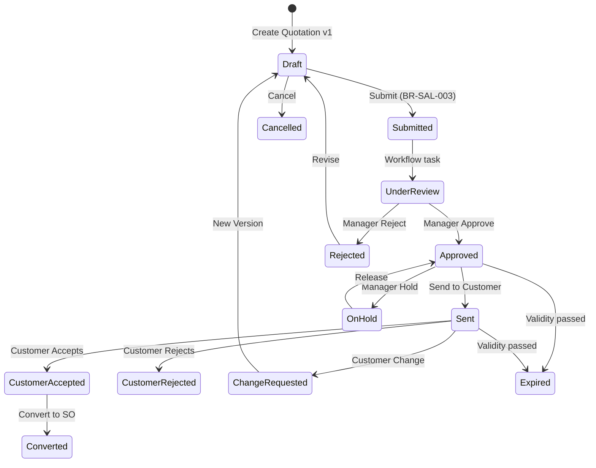
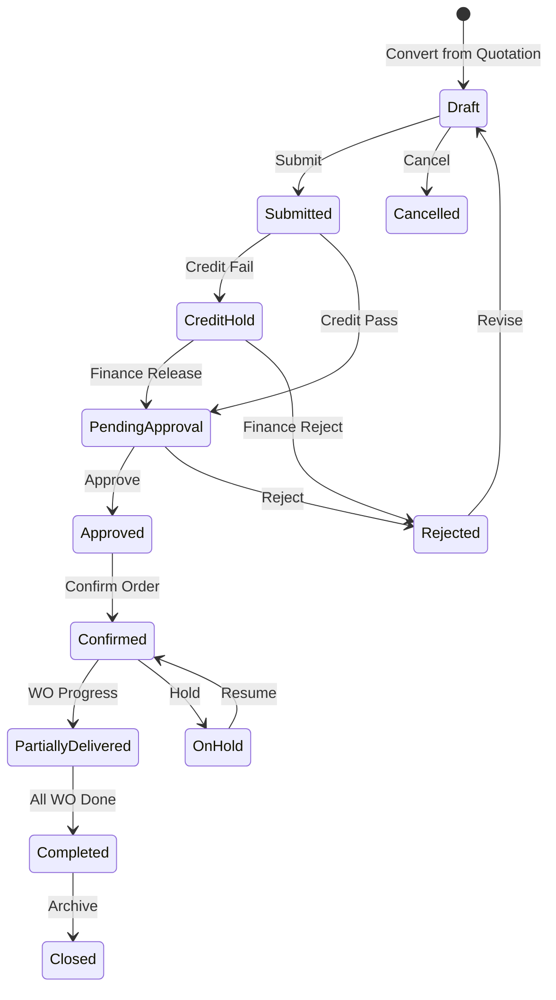
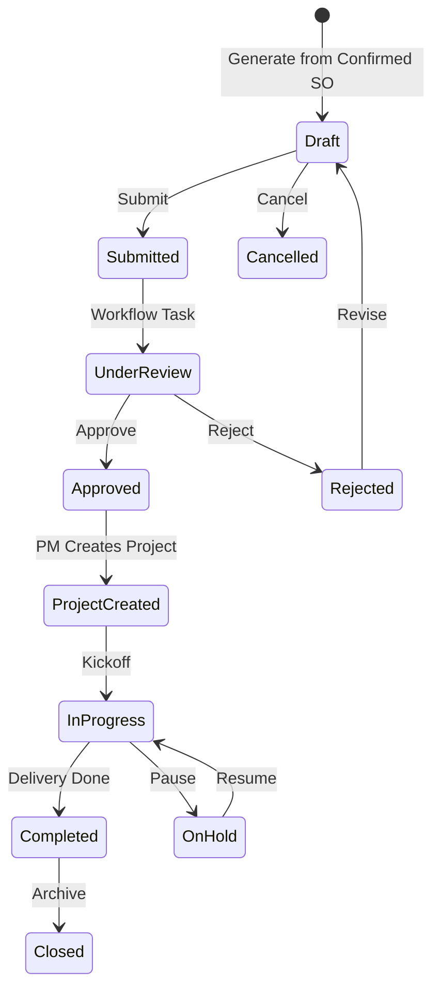
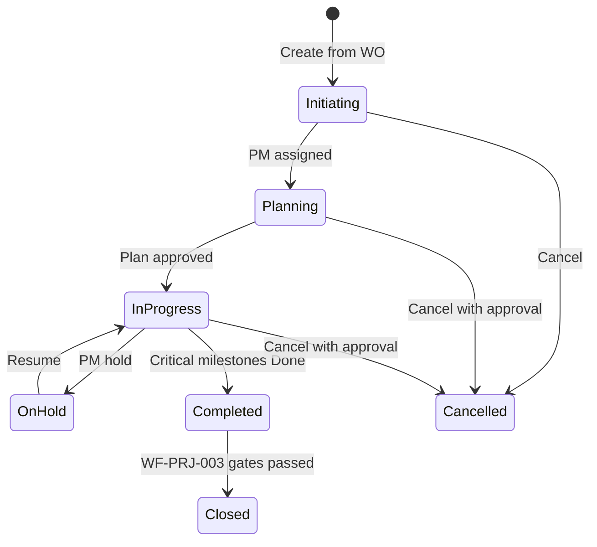
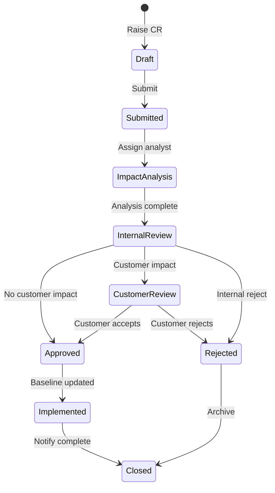
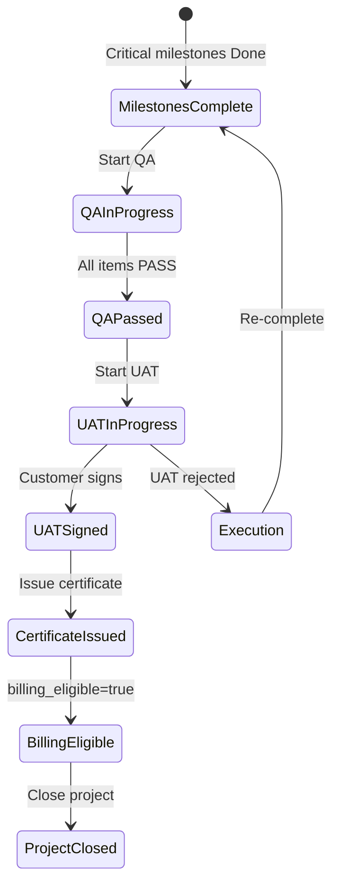

# E-LinkUp — Version 1.0 Enterprise Ready Packs (Sales & Projects)

**Document ID:** V1-SAL-PRJ  
**Document Name:** V1.0 Enterprise Ready — Sales & Projects Workflow Packs  
**Version:** 1.0  
**Classification:** Internal Confidential  
**Project:** E-LinkUp (By Euphoria Infotech)  
**Example Tenant:** Euphoria  
**Status:** Implementation Ready — DB · FastAPI · Flutter · QA  
**Parent Document:** ELU-EFS-001-Enterprise-Functional-Specification.md (§1.5 V1.0 Mandatory Completeness)  
**Related BFS Packs:** ELU-BFS-SAL · ELU-BFS-PRJ  
**Related EFS Enrichments:** EFS-SAL · EFS-PRJ-FIN-SRV-INT  
**Technology Stack:** Flutter (Web + Android) · Python FastAPI · PostgreSQL · JWT + Refresh Token · Docker · Linux VPS / Azure  
**API Namespaces:** `/api/v1/sales/` · `/api/v1/projects/`

---

## Purpose

This document supplies **Version 1.0 Enterprise Ready** artefact packs for six workflows in the Sales and Projects domains. Each pack contains the seven mandatory V1.0 sections defined in ELU-EFS-001 §1.5 (Requirement IDs through API Contract Summary).

**HTML markers** (`<!-- V1:WF-* -->`) enable automated merge into ELU-EFS-001 and downstream engineering artefacts (ELU-API-*, ELU-UI-*, ELU-TC-*).

### Pack Index

| # | Workflow ID | Name | Modules | API Prefix |
|---|-------------|------|---------|------------|
| 1 | WF-SAL-001 | Quotation & Proposal | SAL-001, SAL-002 | `/api/v1/sales/` |
| 2 | WF-SAL-002 | Negotiation & Sales Order | SAL-003 | `/api/v1/sales/` |
| 3 | WF-SAL-003 | Work Order Generation | SAL-004 | `/api/v1/sales/` |
| 4 | WF-PRJ-001 | Project Planning & Execution | PRJ-001 … PRJ-005 | `/api/v1/projects/` |
| 5 | WF-PRJ-002 | Change Request Control | PRJ-006 | `/api/v1/projects/` |
| 6 | WF-PRJ-003 | Completion, Closure & Renewal | PRJ-001 (completion artefacts) | `/api/v1/projects/` |

### Lead-to-Delivery Spine (Tenant: Euphoria)

```text
Opportunity (CRM-002)
    │
    ▼
WF-SAL-001  Quotation + Proposal  (REQ-SAL-001 … REQ-SAL-008)
    │
    ▼
WF-SAL-002  Sales Order           (REQ-SAL-009 … REQ-SAL-015)
    │
    ▼
WF-SAL-003  Work Order            (REQ-SAL-016 … REQ-SAL-021)
    │
    ▼
WF-PRJ-001  Project Execution     (REQ-PRJ-001 … REQ-PRJ-008)
    │
    ├── WF-PRJ-002  Change Request (REQ-PRJ-009 … REQ-PRJ-014)
    │
    ▼
WF-PRJ-003  Completion & Closure  (REQ-PRJ-015 … REQ-PRJ-020)
    │
    ▼
WF-FIN-001  Invoicing (billing_eligible flag)
```

---

<!-- V1:WF-SAL-001 -->

## WF-SAL-001 — Quotation & Proposal

**Modules:** SAL-001 Quotation Management · SAL-002 Proposal Management  
**Actors:** Sales Executive, Pre-Sales, Sales Manager, Finance User (advisory), Customer Contact (external)  
**Business Rules:** BR-SAL-001 … BR-SAL-005  
**Upstream:** WF-CRM-002 Opportunity Pipeline  
**Downstream:** WF-SAL-002 Negotiation & Sales Order

### §1 Requirement IDs

| REQ ID | Requirement Statement | Priority | BR Reference |
|--------|---------------------|----------|--------------|
| **REQ-SAL-001** | **Generate Quotation** from a qualified Opportunity with mandatory Customer and Contact linkage | Critical | BR-SAL-001 |
| REQ-SAL-002 | Maintain quotation line items with catalog pricing, UOM, discount, and FIN-004 tax calculation | Critical | BR-SAL-004 |
| REQ-SAL-003 | Enforce quotation validity period; block conversion when expired | Critical | BR-SAL-002 |
| REQ-SAL-004 | Route quotations exceeding discount threshold through internal approval workflow | Critical | BR-SAL-003 |
| REQ-SAL-005 | Create and version Proposal documents linked to Quotation with section-based content | High | — |
| REQ-SAL-006 | Approve Proposal version and set `is_current_approved` before customer send | Critical | — |
| REQ-SAL-007 | Send approved Quotation to Customer Contact with channel and date tracking | High | — |
| REQ-SAL-008 | Record customer response (Accept / Reject / Change Request) and enable SO conversion on acceptance | Critical | BR-SAL-005 |

### §2 Requirements Traceability Matrix (RTM)

| Requirement | Workflow | Table | API | Flutter Screen | Test Case |
|-------------|----------|-------|-----|----------------|-----------|
| REQ-SAL-001 | WF-SAL-001 | `quotation`, `quotation_line` | `POST /api/v1/sales/quotations` | SAL-UI-Q-002 QuotationCreatePage | TC-SAL-001 |
| REQ-SAL-002 | WF-SAL-001 | `quotation_line`, `quotation_tax_line` | `PUT /api/v1/sales/quotations/{id}` | SAL-UI-Q-003 QuotationEditPage | TC-SAL-002 |
| REQ-SAL-003 | WF-SAL-001 | `quotation`, `quotation_status_history` | `POST /api/v1/sales/quotations/{id}/convert` | SAL-UI-Q-009 ConvertWizardPage | TC-SAL-003 |
| REQ-SAL-004 | WF-SAL-001 | `quotation_approval`, `quotation` | `POST /api/v1/sales/quotations/{id}/submit` | SAL-UI-Q-006 ApprovalInboxPage | TC-SAL-004 |
| REQ-SAL-005 | WF-SAL-001 | `proposal`, `proposal_version`, `proposal_section` | `POST /api/v1/sales/proposals` | SAL-UI-P-003 ProposalEditorPage | TC-SAL-005 |
| REQ-SAL-006 | WF-SAL-001 | `proposal_version`, `quotation_proposal_link` | `POST /api/v1/sales/proposals/{id}/versions/{vid}/approve` | SAL-UI-P-006 ProposalApprovalInbox | TC-SAL-006 |
| REQ-SAL-007 | WF-SAL-001 | `quotation`, `quotation_customer_response` | `POST /api/v1/sales/quotations/{id}/send` | SAL-UI-Q-008 SendQuotationDialog | TC-SAL-007 |
| REQ-SAL-008 | WF-SAL-001 | `quotation_customer_response`, `quotation_status_history` | `POST /api/v1/sales/quotations/{id}/customer-response` | SAL-UI-Q-004 QuotationDetailPage | TC-SAL-008 |

### §3 State Transition Diagram

**Primary Entity:** `quotation.status` · **Secondary Entity:** `proposal_version.status`

#### ASCII — Quotation Lifecycle

```text
                    ┌─────────────┐
                    │   DRAFT     │◄──────────────────────────┐
                    └──────┬──────┘                           │
                           │ submit                           │ reject / new version
                           ▼                                  │
                    ┌─────────────┐                           │
                    │  SUBMITTED  │                           │
                    └──────┬──────┘                           │
                           ▼                                  │
                    ┌─────────────┐      reject               │
                    │UNDER_REVIEW │───────────────────────────┘
                    └──────┬──────┘
                           │ approve
                           ▼
                    ┌─────────────┐     hold/release    ┌──────────┐
         ┌─────────│  APPROVED   │◄───────────────────►│ ON_HOLD  │
         │         └──────┬──────┘                     └──────────┘
         │ expiry         │ send
         ▼                ▼
    ┌──────────┐    ┌─────────────┐
    │ EXPIRED  │    │    SENT     │
    └──────────┘    └──────┬──────┘
                           │ customer response
              ┌────────────┼────────────┐
              ▼            ▼            ▼
    ┌──────────────┐ ┌───────────┐ ┌─────────────────┐
    │CUSTOMER_     │ │CUSTOMER_  │ │CHANGE_REQUESTED │
    │ACCEPTED      │ │REJECTED   │ └────────┬────────┘
    └──────┬───────┘ └───────────┘          │ new version
           │ convert                        ▼
           ▼                           [DRAFT v(n+1)]
    ┌─────────────┐
    │ CONVERTED   │  (terminal — SO created)
    └─────────────┘

    DRAFT / APPROVED ──cancel(reason)──► CANCELLED
```

#### Allowed Transitions

| From | To | Actor | Guard |
|------|-----|-------|-------|
| `DRAFT` | `SUBMITTED` | Sales Executive | Lines valid; BR-SAL-003 check |
| `SUBMITTED` | `UNDER_REVIEW` | System | Workflow task opened |
| `UNDER_REVIEW` | `APPROVED` | Sales Manager | Approval complete |
| `UNDER_REVIEW` | `REJECTED` | Sales Manager | Reason required |
| `REJECTED` | `DRAFT` | Sales Executive | Revise |
| `APPROVED` | `SENT` | Sales Executive | Approved proposal linked (G-P-01) |
| `SENT` | `CUSTOMER_ACCEPTED` | Sales Executive | Response recorded |
| `SENT` | `CUSTOMER_REJECTED` | Sales Executive | Response recorded |
| `SENT` | `CHANGE_REQUESTED` | Sales Executive | Triggers new version |
| `CHANGE_REQUESTED` | `DRAFT` | System | New version created; prior locked |
| `CUSTOMER_ACCEPTED` | `CONVERTED` | Sales Executive | BR-SAL-002, BR-SAL-005 |
| `APPROVED` / `SENT` | `EXPIRED` | Scheduler | `validity_end_date` passed |
| `APPROVED` | `ON_HOLD` | Sales Manager | Reason |
| `ON_HOLD` | `APPROVED` | Sales Manager | Release |

#### Invalid Transitions

| From | To | Reason |
|------|-----|--------|
| `DRAFT` | `SENT` | Must pass internal approval |
| `DRAFT` | `CONVERTED` | BR-SAL-005 — not approved/accepted |
| `EXPIRED` | `CONVERTED` | BR-SAL-002 — validity extension required |
| `CONVERTED` | any | Terminal state |
| `CANCELLED` | any (except read) | Terminal state |
| `SUBMITTED` | `CUSTOMER_ACCEPTED` | Customer path requires SENT |

#### Re-open Rules

| Scenario | Action | Result State |
|----------|--------|--------------|
| Customer requests change after SENT | Create new quotation version | `DRAFT` (v+1); prior version `LOCKED` |
| Manager rejects internal approval | Return to author | `REJECTED` → `DRAFT` |
| Expired quotation | Extend validity + re-approve | `EXPIRED` → `APPROVED` (with audit) |
| On Hold release | Manager releases | `ON_HOLD` → `APPROVED` |

#### Rollback Rules

| Trigger | Rollback Scope | Compensation |
|---------|----------------|--------------|
| SO convert fails (TX-Q-CONVERT) | Quotation remains `CUSTOMER_ACCEPTED` | No state change; error returned |
| Approval withdrawn (pre-SENT only) | `APPROVED` → `DRAFT` | Tenant Admin only; audit mandatory |
| Send cancelled before customer view | `SENT` → `APPROVED` | Rare; Manager + audit |



### §4 CRUD Responsibility Matrix

| Role | Create | Read | Update | Approve | Delete |
|------|:------:|:----:|:------:|:-------:|:------:|
| Sales Executive | ✓ | ✓ | ✓ (Draft) | — | — (soft cancel) |
| Sales Manager | ✓ | ✓ | ✓ (hold/validity) | ✓ | ✓ (cancel) |
| Pre-Sales | — | ✓ | ✓ (proposal) | — | — |
| Finance User | — | ✓ | — | — (advisory) | — |
| Customer Contact | — | ✓ (shared doc) | — | — (accept via Sales) | — |
| Tenant Admin | ✓ | ✓ | ✓ | ✓ | ✓ (archive) |
| System | — | ✓ | ✓ (expire) | — | — |

*Delete = soft delete / cancel with reason; hard delete prohibited when transactions exist.*

### §5 Non-Functional Requirements

| NFR ID | Category | Requirement | Target (Euphoria) |
|--------|----------|-------------|-------------------|
| NFR-SAL-001 | Performance | Quotation list API P95 latency | < 500 ms (10k records, indexed) |
| NFR-SAL-002 | Performance | PDF generation on customer send | < 30 s P95 |
| NFR-SAL-003 | Performance | Tax recalculation per line save | < 200 ms P95 |
| NFR-SAL-004 | Security | Tenant isolation via JWT `tenant_id` + RLS on all `quotation*`, `proposal*` tables | 100% enforcement |
| NFR-SAL-005 | Security | Submitted+ quotation price fields immutable without approval | Server-side field lock |
| NFR-SAL-006 | Audit | Every state transition logged to `quotation_status_history` + `audit_log` | Append-only; 7-year retention |
| NFR-SAL-007 | Scalability | Horizontal API scaling; stateless FastAPI workers | 500 concurrent users/tenant |
| NFR-SAL-008 | Availability | Quotation read endpoints during business hours | 99.5% monthly uptime |
| NFR-SAL-009 | Data Retention | Quotation, proposal, approval artefacts | 7 years (`tenant_security.audit_log_retention_days`) |
| NFR-SAL-010 | Availability | Approval workflow task creation | < 5 s async; DLQ retry ×3 |

### §6 UI Navigation (Flutter Screen Flow)

```text
CRM Opportunity Detail (CRM-UI-O-004)
    │
    └── [Create Quotation] ──► SAL-UI-Q-002 QuotationCreatePage
                                  │
                                  ▼
                             SAL-UI-Q-003 QuotationEditPage (Draft)
                                  │
                    ┌─────────────┼─────────────┐
                    ▼             ▼             ▼
            SAL-UI-P-003    SAL-UI-Q-006   SAL-UI-Q-004
            ProposalEditor  ApprovalInbox    QuotationDetail
                    │             │             │
                    └─────────────┼─────────────┘
                                  ▼
                          SAL-UI-Q-008 SendQuotationDialog
                                  │
                                  ▼
                          SAL-UI-Q-004 (Customer Response tab)
                                  │
                                  ▼
                          SAL-UI-Q-009 ConvertWizardPage
                                  │
                                  ▼
                          SAL-UI-SO-003 ConvertFromQuotationWizard
                                  (handoff to WF-SAL-002)

Sidebar: /sales/quotations ──► SAL-UI-Q-001 QuotationListPage
Sidebar: /sales/proposals  ──► SAL-UI-P-004 ProposalDetailPage
```

### §7 API Contract Summary

**Base path:** `/api/v1/sales/` · **Auth:** Bearer JWT · **Tenant:** from token claim

| Method | Endpoint | Purpose | Permission |
|--------|----------|---------|------------|
| POST | `/quotations` | Create quotation (REQ-SAL-001) | `quotation.create` |
| GET | `/quotations` | List quotations | `quotation.read` |
| GET | `/quotations/{id}` | Quotation detail + lines + versions | `quotation.read` |
| PUT | `/quotations/{id}` | Update draft quotation + lines | `quotation.update` |
| POST | `/quotations/{id}/submit` | Submit for internal approval | `quotation.submit` |
| POST | `/quotations/{id}/approve` | Approve quotation | `quotation.approve` |
| POST | `/quotations/{id}/reject` | Reject with reason | `quotation.reject` |
| POST | `/quotations/{id}/send` | Mark sent to customer | `quotation.update` |
| POST | `/quotations/{id}/customer-response` | Record accept/reject/change | `quotation.update` |
| POST | `/quotations/{id}/versions` | Create new version | `quotation.update` |
| POST | `/quotations/{id}/convert` | Convert to Sales Order | `quotation.convert` |
| POST | `/quotations/{id}/cancel` | Cancel with reason | `quotation.cancel` |
| GET | `/quotations/{id}/export` | Export PDF | `quotation.export` |
| POST | `/proposals` | Create proposal | `proposal.create` |
| POST | `/proposals/{id}/versions` | New proposal version | `proposal.version` |
| PUT | `/proposals/{id}/versions/{vid}` | Edit draft sections | `proposal.update` |
| POST | `/proposals/{id}/versions/{vid}/submit` | Submit proposal version | `proposal.submit` |
| POST | `/proposals/{id}/versions/{vid}/approve` | Approve proposal version | `proposal.approve` |
| POST | `/proposals/{id}/link-quotation` | Link to quotation | `proposal.update` |

**Error envelope:** `{ "code": "SAL_Q_00n", "message": "...", "rule_id": "BR-SAL-00n" }`

<!-- /V1:WF-SAL-001 -->

---

<!-- V1:WF-SAL-002 -->

## WF-SAL-002 — Negotiation, Sales Order & Commercial Approval

**Module:** SAL-003 Sales Order Management  
**Actors:** Sales Executive, Sales Manager, Finance User, Project Manager (notify)  
**Business Rules:** BR-SAL-005 (at source), BR-SAL-002 (validity at convert)  
**Upstream:** WF-SAL-001 (customer-accepted quotation)  
**Downstream:** WF-SAL-003 Work Order Generation

### §1 Requirement IDs

| REQ ID | Requirement Statement | Priority | BR Reference |
|--------|---------------------|----------|--------------|
| REQ-SAL-009 | **Convert accepted Quotation to Sales Order** with line-for-line copy and tax reconciliation | Critical | BR-SAL-005 |
| REQ-SAL-010 | Enforce one active Sales Order per Quotation version per tenant | Critical | — |
| REQ-SAL-011 | Execute automated credit check on SO submit; route to CREDIT_HOLD on failure | Critical | — |
| REQ-SAL-012 | Finance User may release or reject credit hold with mandatory comment | Critical | — |
| REQ-SAL-013 | Route Sales Orders above value threshold through commercial approval workflow | Critical | — |
| REQ-SAL-014 | Confirm Sales Order as binding commitment; sync Opportunity to Closed Won | Critical | — |
| REQ-SAL-015 | Block SO line edits after Work Order exists; enforce change via PRJ-006 | High | — |

### §2 Requirements Traceability Matrix (RTM)

| Requirement | Workflow | Table | API | Flutter Screen | Test Case |
|-------------|----------|-------|-----|----------------|-----------|
| REQ-SAL-009 | WF-SAL-002 | `sales_order`, `sales_order_line` | `POST /api/v1/sales/orders/from-quotation/{quotation_id}` | SAL-UI-SO-003 ConvertFromQuotationWizard | TC-SAL-009 |
| REQ-SAL-010 | WF-SAL-002 | `sales_order` | `POST /api/v1/sales/orders/from-quotation/{quotation_id}` | SAL-UI-SO-003 | TC-SAL-010 |
| REQ-SAL-011 | WF-SAL-002 | `sales_order_credit_check` | `POST /api/v1/sales/orders/{id}/submit` | SAL-UI-SO-002 SalesOrderDetailPage | TC-SAL-011 |
| REQ-SAL-012 | WF-SAL-002 | `sales_order_credit_check`, `sales_order_approval` | `POST /api/v1/sales/orders/{id}/credit-release` | SAL-UI-SO-004 CreditHoldQueuePage | TC-SAL-012 |
| REQ-SAL-013 | WF-SAL-002 | `sales_order_approval` | `POST /api/v1/sales/orders/{id}/approve` | SAL-UI-SO-005 CommercialApprovalInbox | TC-SAL-013 |
| REQ-SAL-014 | WF-SAL-002 | `sales_order`, `sales_order_status_history` | `POST /api/v1/sales/orders/{id}/confirm` | SAL-UI-SO-006 ConfirmOrderDialog | TC-SAL-014 |
| REQ-SAL-015 | WF-SAL-002 | `sales_order`, `sales_order_line` | `PUT /api/v1/sales/orders/{id}` | SAL-UI-SO-002 | TC-SAL-015 |

### §3 State Transition Diagram

**Primary Entity:** `sales_order.status`

#### ASCII — Sales Order Lifecycle

```text
    [Customer Accepted Quotation]
              │
              ▼
         ┌─────────┐
         │  DRAFT  │◄──────── reject ────────┐
         └────┬────┘                          │
              │ submit                        │
              ▼                               │
         ┌─────────┐     credit fail    ┌─────────────┐
         │SUBMITTED│───────────────────►│ CREDIT_HOLD │
         └────┬────┘                    └──────┬──────┘
              │ credit pass              release│reject
              ▼                               ▼
    ┌──────────────────┐              ┌──────────┐
    │PENDING_APPROVAL  │              │ REJECTED │
    └────────┬─────────┘              └──────────┘
              │ approve
              ▼
         ┌─────────┐
         │APPROVED │
         └────┬────┘
              │ confirm
              ▼
         ┌──────────┐     WO progress    ┌────────────────────┐
         │CONFIRMED │───────────────────►│PARTIALLY_DELIVERED │
         └────┬─────┘                    └─────────┬──────────┘
              │                                    │ all WO done
              │ cancel (reason)                    ▼
              ▼                              ┌───────────┐
         ┌───────────┐                        │ COMPLETED │
         │ CANCELLED │                        └─────┬─────┘
         └───────────┘                              │ archive
                                                    ▼
                                               ┌────────┐
                                               │ CLOSED │
                                               └────────┘

    CONFIRMED ──hold──► ON_HOLD ──resume──► CONFIRMED
```

#### Allowed Transitions

| From | To | Actor | Guard |
|------|-----|-------|-------|
| — | `DRAFT` | Sales Executive | Convert from eligible quotation (BR-SAL-005, BR-SAL-002) |
| `DRAFT` | `SUBMITTED` | Sales Executive | Lines valid |
| `SUBMITTED` | `CREDIT_HOLD` | System | Credit check fail |
| `SUBMITTED` | `PENDING_APPROVAL` | System | Credit check pass |
| `CREDIT_HOLD` | `PENDING_APPROVAL` | Finance User | Credit release |
| `CREDIT_HOLD` | `REJECTED` | Finance User | Reject with reason |
| `PENDING_APPROVAL` | `APPROVED` | Sales Manager / Finance | Approval complete |
| `PENDING_APPROVAL` | `REJECTED` | Approver | Reason required |
| `REJECTED` | `DRAFT` | Sales Executive | Revise |
| `APPROVED` | `CONFIRMED` | Sales Manager / Finance | Confirm action |
| `CONFIRMED` | `PARTIALLY_DELIVERED` | System | WO in progress |
| `PARTIALLY_DELIVERED` | `COMPLETED` | System | All WO complete |
| `COMPLETED` | `CLOSED` | Sales Manager | Archive |
| `CONFIRMED` | `ON_HOLD` | Sales Manager | Reason |
| `ON_HOLD` | `CONFIRMED` | Sales Manager | Resume |
| `DRAFT` / `APPROVED` / `CONFIRMED` | `CANCELLED` | Sales Manager | Reason + audit |

#### Invalid Transitions

| From | To | Reason |
|------|-----|--------|
| `DRAFT` | `CONFIRMED` | Must pass credit + approval |
| `CREDIT_HOLD` | `CONFIRMED` | Finance release required |
| `CONFIRMED` | `DRAFT` | No rollback to draft after confirm |
| `CLOSED` | any | Terminal |
| `CANCELLED` | any | Terminal |
| `CONFIRMED` | `APPROVED` | Cannot un-confirm without cancel workflow |

#### Re-open Rules

| Scenario | Action | Result |
|----------|--------|--------|
| Commercial rejection | Revise SO in Draft | `REJECTED` → `DRAFT` |
| Credit hold released | Finance releases | `CREDIT_HOLD` → `PENDING_APPROVAL` |
| On Hold release | Manager resumes | `ON_HOLD` → `CONFIRMED` |
| Confirmed SO cancel | Elevated cancel with Finance notify | `CONFIRMED` → `CANCELLED` (manual WO unwind) |

#### Rollback Rules

| Trigger | Rollback Scope | Compensation |
|---------|----------------|--------------|
| Confirm transaction failure | SO stays `APPROVED` | CRM Opportunity not updated |
| Credit release rejected | `CREDIT_HOLD` → `REJECTED` | Sales Executive notified |
| Duplicate convert attempt | HTTP 409 | No SO created |



### §4 CRUD Responsibility Matrix

| Role | Create | Read | Update | Approve | Delete |
|------|:------:|:----:|:------:|:-------:|:------:|
| Sales Executive | ✓ | ✓ | ✓ (Draft) | — | — |
| Sales Manager | ✓ | ✓ | ✓ (hold) | ✓ | ✓ (cancel) |
| Finance User | — | ✓ | — | ✓ (credit/commercial) | — |
| Project Manager | — | ✓ | — | — | — |
| Tenant Admin | ✓ | ✓ | ✓ | ✓ | ✓ (archive) |
| System | ✓ (from quote) | ✓ | ✓ (delivery %) | — | — |

### §5 Non-Functional Requirements

| NFR ID | Category | Requirement | Target (Euphoria) |
|--------|----------|-------------|-------------------|
| NFR-SAL-011 | Performance | Automated credit check on submit | < 5 s P95 |
| NFR-SAL-012 | Performance | SO list API P95 latency | < 500 ms |
| NFR-SAL-013 | Security | Credit exposure visible only to Finance + Manager | Field-level RBAC |
| NFR-SAL-014 | Security | `quotation_id` integrity validated server-side on SO | Tamper-proof link |
| NFR-SAL-015 | Audit | Credit check, approval, confirm events immutable | `sales_order_status_history` |
| NFR-SAL-016 | Scalability | Confirm + CRM sync async with DLQ | 1000 confirms/hour/tenant |
| NFR-SAL-017 | Availability | SO read during business hours | 99.5% monthly |
| NFR-SAL-018 | Data Retention | SO, credit check, approval records | 7 years |

### §6 UI Navigation (Flutter Screen Flow)

```text
SAL-UI-Q-009 ConvertWizardPage (from WF-SAL-001)
    │
    └──► SAL-UI-SO-003 ConvertFromQuotationWizard
              │
              ▼
         SAL-UI-SO-002 SalesOrderDetailPage (Draft)
              │
              ├── [Submit] ──► credit check banner
              │         │
              │         ├── fail ──► SAL-UI-SO-004 CreditHoldQueuePage (Finance)
              │         │
              │         └── pass ──► SAL-UI-SO-005 CommercialApprovalInbox
              │
              ├── [Approve] ──► state APPROVED
              │
              └── [Confirm] ──► SAL-UI-SO-006 ConfirmOrderDialog
                        │
                        ▼
                   SAL-UI-SO-002 (CONFIRMED — WO actions enabled)
                        │
                        ▼
                   SAL-UI-WO-003 GenerateWOWizard (WF-SAL-003)

Sidebar: /sales/orders ──► SAL-UI-SO-001 SalesOrderListPage
Finance: /sales/orders/credit-holds ──► SAL-UI-SO-004
```

### §7 API Contract Summary

**Base path:** `/api/v1/sales/orders`

| Method | Endpoint | Purpose | Permission |
|--------|----------|---------|------------|
| POST | `/from-quotation/{quotation_id}` | Convert quotation to SO (REQ-SAL-009) | `sales_order.create` |
| GET | `/` | List sales orders | `sales_order.read` |
| GET | `/{id}` | SO detail + lines + credit check | `sales_order.read` |
| PUT | `/{id}` | Update draft SO | `sales_order.update` |
| POST | `/{id}/submit` | Submit + trigger credit check | `sales_order.submit` |
| POST | `/{id}/credit-release` | Finance release credit hold | `sales_order.credit_release` |
| POST | `/{id}/approve` | Commercial approval | `sales_order.approve` |
| POST | `/{id}/reject` | Reject with reason | `sales_order.reject` |
| POST | `/{id}/confirm` | Confirm binding order (REQ-SAL-014) | `sales_order.confirm` |
| POST | `/{id}/cancel` | Cancel with reason | `sales_order.cancel` |
| POST | `/{id}/hold` | Place on hold | `sales_order.hold` |
| GET | `/{id}/credit-check` | Credit check detail | `sales_order.read` |
| GET | `/{id}/history` | Status history / audit | `sales_order.read` |
| GET | `/{id}/export` | Export PDF | `sales_order.export` |

<!-- /V1:WF-SAL-002 -->

---

<!-- V1:WF-SAL-003 -->

## WF-SAL-003 — Work Order Generation

**Module:** SAL-004 Work Order Management  
**Actors:** Sales Manager, Project Manager, Finance User (read), Pre-Sales (scope reference)  
**Business Rules:** BR-SAL-020, BR-SAL-021, BR-SAL-022  
**Upstream:** WF-SAL-002 (Confirmed Sales Order)  
**Downstream:** WF-PRJ-001 Project Planning & Execution

### §1 Requirement IDs

| REQ ID | Requirement Statement | Priority | BR Reference |
|--------|---------------------|----------|--------------|
| REQ-SAL-016 | **Generate Work Order** from Confirmed Sales Order with scope line decomposition | Critical | BR-SAL-020 |
| REQ-SAL-017 | Allow phased delivery via multiple WOs; enforce line qty sum ≤ SO line qty | Critical | BR-SAL-021 |
| REQ-SAL-018 | Submit Work Order for approval; notify Project Manager on approval | Critical | — |
| REQ-SAL-019 | Assign Project Manager before project creation from approved WO | Critical | — |
| REQ-SAL-020 | Create Project from approved WO via cross-domain API (handoff to PRJ-001) | Critical | BR-PRJ-004 |
| REQ-SAL-021 | Cancel Work Order with mandatory reason and audit trail | High | BR-SAL-022 |

### §2 Requirements Traceability Matrix (RTM)

| Requirement | Workflow | Table | API | Flutter Screen | Test Case |
|-------------|----------|-------|-----|----------------|-----------|
| REQ-SAL-016 | WF-SAL-003 | `work_order`, `work_order_line` | `POST /api/v1/sales/work-orders/from-order/{sales_order_id}` | SAL-UI-WO-003 GenerateWOWizard | TC-SAL-016 |
| REQ-SAL-017 | WF-SAL-003 | `work_order_line` | `PUT /api/v1/sales/work-orders/{id}` | SAL-UI-WO-006 WOScopeEditor | TC-SAL-017 |
| REQ-SAL-018 | WF-SAL-003 | `work_order_approval`, `work_order_status_history` | `POST /api/v1/sales/work-orders/{id}/submit` | SAL-UI-WO-004 WOApprovalInbox | TC-SAL-018 |
| REQ-SAL-019 | WF-SAL-003 | `work_order` | `PUT /api/v1/sales/work-orders/{id}` | SAL-UI-WO-002 WorkOrderDetailPage | TC-SAL-019 |
| REQ-SAL-020 | WF-SAL-003 | `work_order_project_link`, `project` | `POST /api/v1/sales/work-orders/{id}/create-project` | SAL-UI-WO-005 CreateProjectAction | TC-SAL-020 |
| REQ-SAL-021 | WF-SAL-003 | `work_order`, `work_order_status_history` | `POST /api/v1/sales/work-orders/{id}/cancel` | SAL-UI-WO-002 | TC-SAL-021 |

### §3 State Transition Diagram

**Primary Entity:** `work_order.status`

#### ASCII — Work Order Lifecycle

```text
    [Confirmed Sales Order]
              │
              ▼
         ┌─────────┐
         │  DRAFT  │◄──── reject ────┐
         └────┬────┘                 │
              │ submit               │
              ▼                      │
         ┌──────────┐                │
         │SUBMITTED │                │
         └────┬─────┘                │
              ▼                      │
         ┌─────────────┐   reject   │
         │UNDER_REVIEW │────────────┘
         └──────┬──────┘
                │ approve
                ▼
         ┌──────────┐
         │ APPROVED │
         └────┬─────┘
              │ PM creates project
              ▼
    ┌──────────────────┐
    │ PROJECT_CREATED  │
    └────────┬─────────┘
              │ kickoff
              ▼
    ┌──────────────────┐     hold     ┌─────────┐
    │   IN_PROGRESS    │◄────────────►│ ON_HOLD │
    └────────┬─────────┘              └─────────┘
              │ delivery complete
              ▼
         ┌───────────┐
         │ COMPLETED │──► updates SO delivery_percent
         └─────┬─────┘
               │ archive
               ▼
          ┌────────┐
          │ CLOSED │
          └────────┘

    DRAFT / APPROVED ──cancel(reason)──► CANCELLED
```

#### Allowed Transitions

| From | To | Actor | Guard |
|------|-----|-------|-------|
| — | `DRAFT` | Sales Manager | SO status = CONFIRMED (BR-SAL-020) |
| `DRAFT` | `SUBMITTED` | Sales Manager | Scope + qty valid (BR-SAL-021) |
| `SUBMITTED` | `UNDER_REVIEW` | System | Workflow task |
| `UNDER_REVIEW` | `APPROVED` | Sales Manager | Approval |
| `UNDER_REVIEW` | `REJECTED` | Approver | Comment required |
| `REJECTED` | `DRAFT` | Sales Manager | Revise scope |
| `APPROVED` | `PROJECT_CREATED` | Project Manager | PM assigned; WO approved |
| `PROJECT_CREATED` | `IN_PROGRESS` | Project Manager | Kickoff |
| `IN_PROGRESS` | `ON_HOLD` | PM / Sales Manager | Reason |
| `ON_HOLD` | `IN_PROGRESS` | PM / Sales Manager | Resume |
| `IN_PROGRESS` | `COMPLETED` | Project Manager | Delivery done |
| `COMPLETED` | `CLOSED` | Sales Manager | Archive |
| `DRAFT` / `APPROVED` | `CANCELLED` | Sales Manager / PM | BR-SAL-022 reason |

#### Invalid Transitions

| From | To | Reason |
|------|-----|--------|
| — | `DRAFT` | SO not CONFIRMED (BR-SAL-020) |
| `DRAFT` | `PROJECT_CREATED` | Approval required |
| `APPROVED` | `IN_PROGRESS` | Project must be created first |
| `COMPLETED` | `IN_PROGRESS` | No rollback without CR (PRJ-006) |
| `CANCELLED` | any | Terminal |
| `CLOSED` | any | Terminal |

#### Re-open Rules

| Scenario | Action | Result |
|----------|--------|--------|
| WO rejected at approval | Revise scope | `REJECTED` → `DRAFT` |
| WO on hold | Resume delivery | `ON_HOLD` → `IN_PROGRESS` |
| SO cancelled after WO approved | Event hook | WO → `ON_HOLD`; manual resolution |

#### Rollback Rules

| Trigger | Rollback Scope | Compensation |
|---------|----------------|--------------|
| Project create fails | WO stays `APPROVED` | No `work_order_project_link` |
| Qty validation fail | Block submit | HTTP 422 BR-SAL-021 |
| Cancel WO with active project | Warning + manual PRJ handling | PRJ cancel separate workflow |



### §4 CRUD Responsibility Matrix

| Role | Create | Read | Update | Approve | Delete |
|------|:------:|:----:|:------:|:-------:|:------:|
| Sales Manager | ✓ | ✓ | ✓ (Draft) | ✓ | ✓ (cancel) |
| Project Manager | — | ✓ | ✓ (execution status) | — | ✓ (cancel w/ Mgr) |
| Finance User | — | ✓ | — | — | — |
| Pre-Sales | — | ✓ | — | — | — |
| Tenant Admin | ✓ | ✓ | ✓ | ✓ | ✓ (archive) |
| System | — | ✓ | ✓ (SO delivery %) | — | — |

### §5 Non-Functional Requirements

| NFR ID | Category | Requirement | Target (Euphoria) |
|--------|----------|-------------|-------------------|
| NFR-SAL-019 | Performance | WO generation from SO API | < 3 s P95 |
| NFR-SAL-020 | Performance | WO list API P95 | < 500 ms |
| NFR-SAL-021 | Security | WO creation restricted to Sales Manager | RBAC `work_order.create` |
| NFR-SAL-022 | Security | Project creation restricted to PM | RBAC `work_order.convert` |
| NFR-SAL-023 | Audit | Cancel requires reason (BR-SAL-022) | Immutable audit entry |
| NFR-SAL-024 | Scalability | Phased WO qty validation at scale | DB trigger or app check |
| NFR-SAL-025 | Availability | PM notification on approval | < 1 min; retry ×3 |
| NFR-SAL-026 | Data Retention | WO, approval, project link records | 7 years |

### §6 UI Navigation (Flutter Screen Flow)

```text
SAL-UI-SO-002 SalesOrderDetailPage (CONFIRMED)
    │
    └── [Generate Work Order] ──► SAL-UI-WO-003 GenerateWOWizard
                                      │
                                      ▼
                                 SAL-UI-WO-006 WOScopeEditor (qty validation)
                                      │
                                      ▼
                                 SAL-UI-WO-002 WorkOrderDetailPage
                                      │
                                      ├── [Submit] ──► SAL-UI-WO-004 WOApprovalInbox
                                      │
                                      └── [Approve] ──► state APPROVED
                                                │
                                                ▼
                                          SAL-UI-WO-005 CreateProjectAction (PM)
                                                │
                                                ▼
                                          PRJ-UI-002 ProjectCreateFromWO (WF-PRJ-001)

Sidebar: /sales/work-orders ──► SAL-UI-WO-001 WorkOrderListPage
```

### §7 API Contract Summary

**Base path:** `/api/v1/sales/work-orders`

| Method | Endpoint | Purpose | Permission |
|--------|----------|---------|------------|
| POST | `/from-order/{sales_order_id}` | Generate WO from SO (REQ-SAL-016) | `work_order.create` |
| GET | `/` | List work orders | `work_order.read` |
| GET | `/{id}` | WO detail + lines + project link | `work_order.read` |
| PUT | `/{id}` | Update draft scope + PM | `work_order.update` |
| POST | `/{id}/submit` | Submit for approval | `work_order.submit` |
| POST | `/{id}/approve` | Approve WO | `work_order.approve` |
| POST | `/{id}/reject` | Reject with comment | `work_order.reject` |
| POST | `/{id}/create-project` | Create project (REQ-SAL-020) | `work_order.convert` |
| POST | `/{id}/cancel` | Cancel with reason (REQ-SAL-021) | `work_order.cancel` |
| POST | `/{id}/hold` | Place on hold | `work_order.hold` |
| GET | `/{id}/history` | Status history | `work_order.read` |
| GET | `/{id}/export` | Export PDF | `work_order.export` |

**Cross-domain:** `POST /api/v1/projects/from-work-order/{work_order_id}` — invoked by `create-project`; links Customer, SO, WO, Proposal.

<!-- /V1:WF-SAL-003 -->

---

<!-- V1:WF-PRJ-001 -->

## WF-PRJ-001 — Project Planning & Execution

**Modules:** PRJ-001 Project · PRJ-002 Milestone · PRJ-003 Task · PRJ-004 Timesheet · PRJ-005 Issue  
**Actors:** Project Manager, Team Member, Sales Manager, Finance User, Customer Contact  
**Business Rules:** BR-PRJ-004 … BR-PRJ-007, BR-PRJ-011 … BR-PRJ-020  
**Upstream:** WF-SAL-003 (approved Work Order)  
**Downstream:** WF-PRJ-002 Change Request · WF-PRJ-003 Completion

### §1 Requirement IDs

| REQ ID | Requirement Statement | Priority | BR Reference |
|--------|---------------------|----------|--------------|
| **REQ-PRJ-001** | **Create Project** from approved Work Order with Customer, SO, WO linkage | Critical | BR-PRJ-004 |
| REQ-PRJ-002 | Enforce one active Project per Work Order per tenant policy | Critical | BR-PRJ-005 |
| REQ-PRJ-003 | Assign Project Manager before transition to Planning state | Critical | BR-PRJ-006 |
| REQ-PRJ-004 | Plan milestones within project date range; flag critical milestones | High | BR-PRJ-011, BR-PRJ-012 |
| REQ-PRJ-005 | Create and assign tasks to team members on project roster | Critical | BR-PRJ-015, BR-PRJ-016 |
| REQ-PRJ-006 | Lock project baseline after first approved milestone plan | High | BR-PRJ-007 |
| REQ-PRJ-007 | Log timesheets against tasks; PM approves billable hours | High | BR-PRJ-019 … BR-PRJ-021 |
| REQ-PRJ-008 | Track issues; open critical issues block completion gate | Medium | BR-PRJ-023 |

### §2 Requirements Traceability Matrix (RTM)

| Requirement | Workflow | Table | API | Flutter Screen | Test Case |
|-------------|----------|-------|-----|----------------|-----------|
| REQ-PRJ-001 | WF-PRJ-001 | `project`, `work_order_project_link` | `POST /api/v1/projects/from-work-order/{work_order_id}` | PRJ-UI-002 ProjectCreateFromWO | TC-PRJ-001 |
| REQ-PRJ-002 | WF-PRJ-001 | `project` | `POST /api/v1/projects/from-work-order/{work_order_id}` | PRJ-UI-002 | TC-PRJ-002 |
| REQ-PRJ-003 | WF-PRJ-001 | `project`, `project_team_member` | `PATCH /api/v1/projects/{id}/status` | PRJ-UI-003 ProjectDetailPage | TC-PRJ-003 |
| REQ-PRJ-004 | WF-PRJ-001 | `project_milestone` | `POST /api/v1/projects/{id}/milestones` | PRJ-UI-010 MilestonePlanPage | TC-PRJ-004 |
| REQ-PRJ-005 | WF-PRJ-001 | `project_task`, `project_task_assignment` | `POST /api/v1/projects/{id}/tasks` | PRJ-UI-020 TaskBoardPage | TC-PRJ-005 |
| REQ-PRJ-006 | WF-PRJ-001 | `project_baseline` | `POST /api/v1/projects/{id}/baseline/lock` | PRJ-UI-003 | TC-PRJ-006 |
| REQ-PRJ-007 | WF-PRJ-001 | `timesheet_entry`, `timesheet` | `POST /api/v1/projects/{id}/timesheets` | PRJ-UI-040 TimesheetEntryPage | TC-PRJ-007 |
| REQ-PRJ-008 | WF-PRJ-001 | `project_issue` | `POST /api/v1/projects/{id}/issues` | PRJ-UI-050 IssueListPage | TC-PRJ-008 |

### §3 State Transition Diagram

**Primary Entity:** `project.status`

#### ASCII — Project Lifecycle

```text
    [Approved Work Order]
              │
              ▼
       ┌─────────────┐
       │ INITIATING  │
       └──────┬──────┘
              │ PM assigned (BR-PRJ-006)
              ▼
       ┌─────────────┐
       │  PLANNING   │──── baseline lock (BR-PRJ-007)
       └──────┬──────┘
              │ plan approved / first milestone active
              ▼
       ┌─────────────┐      hold      ┌─────────┐
       │ IN_PROGRESS │◄──────────────►│ ON_HOLD │
       └──────┬──────┘                └─────────┘
              │ all critical milestones Done
              ▼
       ┌─────────────┐
       │  COMPLETED  │──── enables WF-PRJ-003 QA gate
       └──────┬──────┘
              │ QA + UAT + certificate (WF-PRJ-003)
              ▼
       ┌─────────────┐
       │   CLOSED    │
       └─────────────┘

    INITIATING / PLANNING / IN_PROGRESS ──cancel(approval)──► CANCELLED
```

#### Allowed Transitions

| From | To | Actor | Guard |
|------|-----|-------|-------|
| — | `INITIATING` | PM / System | WO approved (BR-PRJ-004) |
| `INITIATING` | `PLANNING` | PM / System | `project_manager_id` set (BR-PRJ-006) |
| `PLANNING` | `IN_PROGRESS` | PM | ≥1 milestone planned |
| `IN_PROGRESS` | `ON_HOLD` | PM | Reason mandatory |
| `ON_HOLD` | `IN_PROGRESS` | PM | Resume |
| `IN_PROGRESS` | `COMPLETED` | PM / System | Critical milestones = Done |
| `COMPLETED` | `CLOSED` | PM / Tenant Admin | WF-PRJ-003 gates passed |
| `INITIATING` / `PLANNING` | `CANCELLED` | PM + Sales Mgr | Approval |
| `IN_PROGRESS` | `CANCELLED` | PM + Sales Mgr | Approval (BR-PRJ-010) |

#### Invalid Transitions

| From | To | Reason |
|------|-----|--------|
| — | `INITIATING` | WO not approved |
| `INITIATING` | `PLANNING` | PM not assigned (BR-PRJ-006) |
| `PLANNING` | `COMPLETED` | Must pass through IN_PROGRESS |
| `CANCELLED` | any | Terminal (BR-PRJ-010 — no certificate) |
| `CLOSED` | `IN_PROGRESS` | Re-open requires Tenant Admin + audit |
| `IN_PROGRESS` | `PLANNING` | Baseline locked; use WF-PRJ-002 CR |

#### Re-open Rules

| Scenario | Action | Result |
|----------|--------|--------|
| Project on hold | PM resumes | `ON_HOLD` → `IN_PROGRESS` |
| Closed project re-open | Tenant Admin exceptional action | `CLOSED` → `IN_PROGRESS` (audit) |
| Schedule/cost change | Approved CR (WF-PRJ-002) | Baseline revision; status unchanged |

#### Rollback Rules

| Trigger | Rollback Scope | Compensation |
|---------|----------------|--------------|
| Baseline edit without CR | Block edit | HTTP 422 BR-PRJ-001 |
| Timesheet on On Hold project | Warning or block per tenant | Resume project |
| Cancel with open critical milestones | Workflow approval required | BR-PRJ-007 |



### §4 CRUD Responsibility Matrix

| Role | Create | Read | Update | Approve | Delete |
|------|:------:|:----:|:------:|:-------:|:------:|
| Project Manager | ✓ | ✓ | ✓ | ✓ (timesheets) | ✓ (cancel w/ Sales) |
| Team Member | — | ✓ | ✓ (assigned tasks, time) | — | — |
| Sales Manager | — | ✓ | — | ✓ (cancel) | — |
| Finance User | — | ✓ | — | — | — |
| Customer Contact | — | ✓ (portal) | — | — (UAT in WF-PRJ-003) | — |
| Tenant Admin | ✓ | ✓ | ✓ | ✓ | ✓ (archive) |
| System | ✓ (from WO) | ✓ | ✓ (RAG, gates) | — | — |

### §5 Non-Functional Requirements

| NFR ID | Category | Requirement | Target (Euphoria) |
|--------|----------|-------------|-------------------|
| NFR-PRJ-001 | Performance | Project list API P95 | < 500 ms |
| NFR-PRJ-002 | Performance | Milestone/task board load | < 1 s P95 (500 tasks) |
| NFR-PRJ-003 | Security | Project data scoped by team membership + PM role | RBAC + RLS |
| NFR-PRJ-004 | Security | Baseline mutation blocked without CR | Server guard BR-PRJ-001 |
| NFR-PRJ-005 | Audit | All status changes in `project_status_history` | Append-only |
| NFR-PRJ-006 | Scalability | Timesheet batch submission | 200 entries/min/tenant |
| NFR-PRJ-007 | Availability | Project dashboard during business hours | 99.5% monthly |
| NFR-PRJ-008 | Data Retention | Project, milestone, task, timesheet, issue records | 7 years |

### §6 UI Navigation (Flutter Screen Flow)

```text
SAL-UI-WO-005 CreateProjectAction
    │
    └──► PRJ-UI-002 ProjectCreateFromWO
              │
              ▼
         PRJ-UI-003 ProjectDetailPage (Initiating → Planning)
              │
              ├──► PRJ-UI-010 MilestonePlanPage
              │         │
              │         ▼
              ├──► PRJ-UI-020 TaskBoardPage
              │         │
              │         ▼
              ├──► PRJ-UI-040 TimesheetEntryPage
              │         │
              │         ▼
              ├──► PRJ-UI-041 TimesheetApprovalPage (PM)
              │
              └──► PRJ-UI-050 IssueListPage
                        │
                        ▼ (critical milestones Done)
                   PRJ-UI-060 CompletionGatePage (WF-PRJ-003)

Sidebar: /projects ──► PRJ-UI-001 ProjectListPage
Dashboard: /projects/{id}/health ──► PRJ-UI-005 ProjectHealthDashboard
```

### §7 API Contract Summary

**Base path:** `/api/v1/projects/`

| Method | Endpoint | Purpose | Permission |
|--------|----------|---------|------------|
| POST | `/from-work-order/{work_order_id}` | Create project (REQ-PRJ-001) | `project.create` |
| GET | `/` | List projects | `project.read` |
| GET | `/{id}` | Project detail | `project.read` |
| PUT | `/{id}` | Update project header | `project.update` |
| PATCH | `/{id}/status` | State transition | `project.update` |
| POST | `/{id}/team-members` | Add team member | `project.team_manage` |
| POST | `/{id}/milestones` | Create milestone | `milestone.create` |
| GET | `/{id}/milestones` | List milestones | `milestone.read` |
| PATCH | `/milestones/{mid}` | Update milestone | `milestone.update` |
| POST | `/{id}/tasks` | Create task | `task.create` |
| GET | `/{id}/tasks` | List tasks | `task.read` |
| PATCH | `/tasks/{tid}` | Update task | `task.update` |
| POST | `/{id}/timesheets` | Submit timesheet | `timesheet.create` |
| POST | `/timesheets/{tsid}/approve` | Approve timesheet | `timesheet.approve` |
| POST | `/{id}/issues` | Raise issue | `issue.create` |
| PATCH | `/issues/{iid}` | Update/resolve issue | `issue.update` |
| POST | `/{id}/baseline/lock` | Lock baseline v1 | `project.baseline_lock` |
| GET | `/{id}/history` | Status history | `project.read` |

<!-- /V1:WF-PRJ-001 -->

---

<!-- V1:WF-PRJ-002 -->

## WF-PRJ-002 — Change Request Control

**Module:** PRJ-006 Change Request Management  
**Actors:** Project Manager, Sales Manager, Finance User, Customer Contact, Pre-Sales  
**Business Rules:** BR-PRJ-001 … BR-PRJ-003, BR-PRJ-007, BR-PRJ-026 … BR-PRJ-028  
**Upstream:** WF-PRJ-001 (active project, locked baseline)  
**Downstream:** Baseline revision · optional SAL variation · WF-FIN-001 cost impact

### §1 Requirement IDs

| REQ ID | Requirement Statement | Priority | BR Reference |
|--------|---------------------|----------|--------------|
| REQ-PRJ-009 | **Raise Change Request** on active project for scope, schedule, or cost impact | Critical | BR-PRJ-026 |
| REQ-PRJ-010 | Block baseline schedule/cost edits without approved CR | Critical | BR-PRJ-001 |
| REQ-PRJ-011 | Require impact analysis (effort, cost, schedule delta) before internal review | High | — |
| REQ-PRJ-012 | Route cost-impacting CR through Finance acknowledgement | Critical | BR-PRJ-002 |
| REQ-PRJ-013 | Require customer acceptance evidence for customer-facing CR | Critical | BR-PRJ-003 |
| REQ-PRJ-014 | On CR implementation, create new `project_baseline` version and optionally SAL variation | Critical | BR-PRJ-007, BR-PRJ-027 |

### §2 Requirements Traceability Matrix (RTM)

| Requirement | Workflow | Table | API | Flutter Screen | Test Case |
|-------------|----------|-------|-----|----------------|-----------|
| REQ-PRJ-009 | WF-PRJ-002 | `change_request` | `POST /api/v1/projects/{id}/change-requests` | PRJ-UI-070 CRRaiseWizard | TC-PRJ-009 |
| REQ-PRJ-010 | WF-PRJ-002 | `project_baseline`, `project_milestone` | `PATCH /api/v1/projects/milestones/{mid}` | PRJ-UI-010 MilestonePlanPage | TC-PRJ-010 |
| REQ-PRJ-011 | WF-PRJ-002 | `change_request_impact` | `PATCH /api/v1/change-requests/{cr_id}` | PRJ-UI-071 CRDetailPage | TC-PRJ-011 |
| REQ-PRJ-012 | WF-PRJ-002 | `change_request_approval` | `POST /api/v1/change-requests/{cr_id}/approve` | PRJ-UI-072 CRApprovalInbox | TC-PRJ-012 |
| REQ-PRJ-013 | WF-PRJ-002 | `change_request_document` | `POST /api/v1/change-requests/{cr_id}/customer-accept` | PRJ-UI-073 CustomerCRPortal | TC-PRJ-013 |
| REQ-PRJ-014 | WF-PRJ-002 | `project_baseline`, `change_request` | `POST /api/v1/change-requests/{cr_id}/implement` | PRJ-UI-071 CRDetailPage | TC-PRJ-014 |

### §3 State Transition Diagram

**Primary Entity:** `change_request.status`

#### ASCII — Change Request Lifecycle

```text
         ┌─────────┐
         │  DRAFT  │
         └────┬────┘
              │ submit
              ▼
         ┌───────────┐
         │ SUBMITTED │
         └─────┬─────┘
               ▼
    ┌─────────────────────┐
    │  IMPACT_ANALYSIS    │
    └──────────┬──────────┘
               │ analysis complete
               ▼
    ┌─────────────────────┐
    │  INTERNAL_REVIEW    │
    └──────────┬──────────┘
               │
       ┌───────┴────────┐
       │ no customer    │ customer impact (BR-PRJ-003)
       ▼                ▼
  ┌──────────┐   ┌─────────────────┐
  │ APPROVED │   │ CUSTOMER_REVIEW │
  └────┬─────┘   └────────┬────────┘
       │                  │ accept / reject
       │                  ▼
       │            ┌──────────┐     reject    ┌──────────┐
       │            │ APPROVED │──────────────►│ REJECTED │
       │            └────┬─────┘               └────┬─────┘
       │                 │                          │
       └────────┬────────┘                          ▼
                │ implement                    ┌─────────┐
                ▼                              │ CLOSED  │
         ┌─────────────┐                       └─────────┘
         │ IMPLEMENTED │
         └──────┬──────┘
                ▼
           ┌─────────┐
           │ CLOSED  │
           └─────────┘
```

#### Allowed Transitions

| From | To | Actor | Guard |
|------|-----|-------|-------|
| — | `DRAFT` | PM | Project active; baseline locked |
| `DRAFT` | `SUBMITTED` | PM | Mandatory fields |
| `SUBMITTED` | `IMPACT_ANALYSIS` | System / PM | Assign analyst |
| `IMPACT_ANALYSIS` | `INTERNAL_REVIEW` | PM / Pre-Sales | Impact record complete |
| `INTERNAL_REVIEW` | `CUSTOMER_REVIEW` | Sales Manager | Customer impact (BR-PRJ-003) |
| `INTERNAL_REVIEW` | `APPROVED` | Sales Manager / Finance | No customer impact |
| `CUSTOMER_REVIEW` | `APPROVED` | Customer Contact | Signed evidence |
| `CUSTOMER_REVIEW` | `REJECTED` | Customer Contact | Rejection reason |
| `INTERNAL_REVIEW` | `REJECTED` | Approver | Reason |
| `APPROVED` | `IMPLEMENTED` | System / PM | Finance ack if cost (BR-PRJ-002) |
| `IMPLEMENTED` | `CLOSED` | System | Notifications sent |
| `REJECTED` | `CLOSED` | System | Archive (BR-PRJ-028) |

#### Invalid Transitions

| From | To | Reason |
|------|-----|--------|
| — | `DRAFT` | Project Cancelled/Closed |
| `DRAFT` | `IMPLEMENTED` | Approval chain required |
| `DRAFT` | `APPROVED` | Must pass review |
| `REJECTED` | `IMPLEMENTED` | No baseline change (BR-PRJ-028) |
| `CLOSED` | any | Terminal |

#### Re-open Rules

| Scenario | Action | Result |
|----------|--------|--------|
| Rejected CR | New CR required | Prior CR → `CLOSED` archived |
| Customer negotiation | Revise CR in Draft before submit | Stay in `DRAFT` |

#### Rollback Rules

| Trigger | Rollback Scope | Compensation |
|---------|----------------|--------------|
| Implement fails | CR stays `APPROVED` | No baseline version created |
| Concurrent CR on baseline | Optimistic lock | HTTP 409; retry |
| Cost impact without Finance | Hold at Internal Review | BR-PRJ-002 |



### §4 CRUD Responsibility Matrix

| Role | Create | Read | Update | Approve | Delete |
|------|:------:|:----:|:------:|:-------:|:------:|
| Project Manager | ✓ | ✓ | ✓ (Draft/Impact) | — | — |
| Sales Manager | — | ✓ | — | ✓ | — |
| Finance User | — | ✓ | — | ✓ (cost ack) | — |
| Customer Contact | — | ✓ (own CR) | — | ✓ (accept) | — |
| Pre-Sales | — | ✓ | ✓ (impact analysis) | — | — |
| Tenant Admin | ✓ | ✓ | ✓ | ✓ | ✓ (archive) |
| System | — | ✓ | ✓ (implement) | — | — |

### §5 Non-Functional Requirements

| NFR ID | Category | Requirement | Target (Euphoria) |
|--------|----------|-------------|-------------------|
| NFR-PRJ-009 | Performance | CR list/detail API P95 | < 500 ms |
| NFR-PRJ-010 | Performance | Baseline implement transaction | < 5 s |
| NFR-PRJ-011 | Security | Customer portal scoped to own CRs only | Portal JWT scope |
| NFR-PRJ-012 | Security | Baseline mutation server-enforced | BR-PRJ-001 guard |
| NFR-PRJ-013 | Audit | Approval decisions + customer doc hash immutable | `change_request_approval` |
| NFR-PRJ-014 | Scalability | Concurrent CR submissions | Optimistic locking |
| NFR-PRJ-015 | Availability | Customer review portal | 99.5% monthly |
| NFR-PRJ-016 | Data Retention | CR, impact, approval, customer evidence | 7 years |

### §6 UI Navigation (Flutter Screen Flow)

```text
PRJ-UI-003 ProjectDetailPage
    │
    └── [Raise Change Request] ──► PRJ-UI-070 CRRaiseWizard
                                      │
                                      ▼
                                 PRJ-UI-071 CRDetailPage
                                      │
                    ┌─────────────────┼─────────────────┐
                    ▼                 ▼                 ▼
            Impact tab        PRJ-UI-072          PRJ-UI-073
            (Pre-Sales)       CRApprovalInbox     CustomerCRPortal
                              (Sales/Finance)     (external)
                                      │
                                      ▼
                                 [Implement] ──► baseline v(N+1)
                                      │
                                      ▼
                                 PRJ-UI-010 MilestonePlanPage (revised)

Sidebar: /projects/{id}/change-requests ──► PRJ-UI-069 CRListPage
```

### §7 API Contract Summary

**Base path:** `/api/v1/projects/`

| Method | Endpoint | Purpose | Permission |
|--------|----------|---------|------------|
| POST | `/{id}/change-requests` | Raise CR (REQ-PRJ-009) | `change_request.create` |
| GET | `/{id}/change-requests` | List CRs for project | `change_request.read` |
| GET | `/change-requests/{cr_id}` | CR detail + impact | `change_request.read` |
| PATCH | `/change-requests/{cr_id}` | Update draft / impact | `change_request.update` |
| POST | `/change-requests/{cr_id}/submit` | Submit CR | `change_request.submit` |
| POST | `/change-requests/{cr_id}/approve` | Internal approve | `change_request.approve` |
| POST | `/change-requests/{cr_id}/reject` | Reject with reason | `change_request.reject` |
| POST | `/change-requests/{cr_id}/customer-accept` | Customer acceptance (REQ-PRJ-013) | `change_request.customer_accept` |
| POST | `/change-requests/{cr_id}/implement` | Implement + baseline v+1 (REQ-PRJ-014) | `change_request.implement` |
| GET | `/change-requests/{cr_id}/documents` | List evidence docs | `change_request.read` |

<!-- /V1:WF-PRJ-002 -->

---

<!-- V1:WF-PRJ-003 -->

## WF-PRJ-003 — Completion, Closure & Renewal

**Module:** PRJ-001 Project Management (completion artefacts)  
**Actors:** Project Manager, Finance User, Sales Manager, Customer Contact, Tenant Admin  
**Business Rules:** BR-PRJ-008 … BR-PRJ-010, BR-PRJ-009  
**Upstream:** WF-PRJ-001 (critical milestones Done)  
**Downstream:** WF-FIN-001 (`billing_eligible`) · WF-SRV-001 · CRM renewal opportunity

### §1 Requirement IDs

| REQ ID | Requirement Statement | Priority | BR Reference |
|--------|---------------------|----------|--------------|
| REQ-PRJ-015 | Gate project completion on all critical milestones marked Done | Critical | BR-PRJ-012 |
| REQ-PRJ-016 | Execute QA checklist; all mandatory items must pass | Critical | BR-PRJ-008 |
| REQ-PRJ-017 | Capture UAT sign-off from Customer Contact with evidence | Critical | BR-PRJ-008 |
| REQ-PRJ-018 | **Issue Completion Certificate** after QA + UAT gates passed | Critical | BR-PRJ-008 |
| REQ-PRJ-019 | Set `billing_eligible = true` on project after certificate issued | Critical | BR-PRJ-009 |
| REQ-PRJ-020 | Close project; block certificate on cancelled project; optional CRM renewal opportunity | High | BR-PRJ-010 |

### §2 Requirements Traceability Matrix (RTM)

| Requirement | Workflow | Table | API | Flutter Screen | Test Case |
|-------------|----------|-------|-----|----------------|-----------|
| REQ-PRJ-015 | WF-PRJ-003 | `project_milestone`, `project` | `PATCH /api/v1/projects/{id}/status` | PRJ-UI-060 CompletionGatePage | TC-PRJ-015 |
| REQ-PRJ-016 | WF-PRJ-003 | `project_qa_checklist` | `POST /api/v1/projects/{id}/qa-checklist` | PRJ-UI-061 QAChecklistPage | TC-PRJ-016 |
| REQ-PRJ-017 | WF-PRJ-003 | `project_uat_signoff` | `POST /api/v1/projects/{id}/uat-signoff` | PRJ-UI-062 UATSignoffPage | TC-PRJ-017 |
| REQ-PRJ-018 | WF-PRJ-003 | `project_completion_certificate` | `POST /api/v1/projects/{id}/completion-certificate` | PRJ-UI-063 CertificatePage | TC-PRJ-018 |
| REQ-PRJ-019 | WF-PRJ-003 | `project` | `POST /api/v1/projects/{id}/completion-certificate` | PRJ-UI-063 | TC-PRJ-019 |
| REQ-PRJ-020 | WF-PRJ-003 | `project`, `project_status_history` | `PATCH /api/v1/projects/{id}/status` | PRJ-UI-064 ProjectClosurePage | TC-PRJ-020 |

### §3 State Transition Diagram

**Primary Entity:** Completion gate sub-states on `project` (status `COMPLETED` → `CLOSED`)

#### ASCII — Completion & Closure Gate

```text
    [All critical milestones Done]
              │
              ▼
    ┌─────────────────────┐
    │ MILESTONES_COMPLETE │  (project.status = COMPLETED)
    └──────────┬──────────┘
               │
               ▼
    ┌─────────────────────┐
    │   QA_IN_PROGRESS    │
    └──────────┬──────────┘
               │ all mandatory items PASS
               ▼
    ┌─────────────────────┐
    │   QA_PASSED           │
    └──────────┬──────────┘
               │
               ▼
    ┌─────────────────────┐
    │   UAT_IN_PROGRESS     │
    └──────────┬──────────┘
               │ customer sign-off
               ▼
    ┌─────────────────────┐
    │   UAT_SIGNED          │
    └──────────┬──────────┘
               │
               ▼
    ┌─────────────────────┐
    │ CERTIFICATE_ISSUED  │──► billing_eligible = true (BR-PRJ-009)
    └──────────┬──────────┘
               │ finance check + closure
               ▼
    ┌─────────────────────┐
    │   PROJECT_CLOSED    │──► renewal opportunity (CRM-002)
    └─────────────────────┘

    Open critical issue (BR-PRJ-023) ──blocks──► QA gate
    UAT rejected ──► return to IN_PROGRESS (optional CR via WF-PRJ-002)
    Cancelled project (BR-PRJ-010) ──blocks──► CERTIFICATE_ISSUED
```

#### Allowed Transitions

| From | To | Actor | Guard |
|------|-----|-------|-------|
| `IN_PROGRESS` | `COMPLETED` | PM / System | Critical milestones Done (REQ-PRJ-015) |
| `COMPLETED` | QA passed | PM | `project_qa_checklist` all mandatory PASS (REQ-PRJ-016) |
| QA passed | UAT signed | Customer Contact | `project_uat_signoff` recorded (REQ-PRJ-017) |
| UAT signed | Certificate issued | PM | BR-PRJ-008 (REQ-PRJ-018) |
| Certificate issued | `billing_eligible` | System | BR-PRJ-009 (REQ-PRJ-019) |
| Certificate issued | `CLOSED` | PM / Tenant Admin | Finance check (REQ-PRJ-020) |
| UAT rejected | `IN_PROGRESS` | PM | Documented reason; optional CR |

#### Invalid Transitions

| From | To | Reason |
|------|-----|--------|
| `IN_PROGRESS` | Certificate | Milestones + QA + UAT required |
| `CANCELLED` | Certificate | BR-PRJ-010 |
| Open critical issue | QA pass | BR-PRJ-023 |
| `CLOSED` | Certificate re-issue | Requires Tenant Admin exception |
| `COMPLETED` | `CLOSED` | Certificate + billing flag required |

#### Re-open Rules

| Scenario | Action | Result |
|----------|--------|--------|
| UAT rejected | Return to execution | `COMPLETED` → `IN_PROGRESS`; optional WF-PRJ-002 CR |
| QA failure | Remediate and re-run checklist | Stay in QA_IN_PROGRESS |
| Closed project exception | Tenant Admin re-open | `CLOSED` → `IN_PROGRESS` (audit) |

#### Rollback Rules

| Trigger | Rollback Scope | Compensation |
|---------|----------------|--------------|
| Certificate issue fails | No `billing_eligible` flag | Transaction rollback |
| UAT reject | Clear UAT sign-off | Notify stakeholders |
| Finance block on close | Project stays COMPLETED + certificate | Manual resolution |



### §4 CRUD Responsibility Matrix

| Role | Create | Read | Update | Approve | Delete |
|------|:------:|:----:|:------:|:-------:|:------:|
| Project Manager | ✓ | ✓ | ✓ | ✓ (QA) | — |
| Team Member | — | ✓ | ✓ (QA items) | — | — |
| Finance User | — | ✓ | — | ✓ (close check) | — |
| Sales Manager | — | ✓ | — | — | — |
| Customer Contact | — | ✓ | — | ✓ (UAT sign) | — |
| Tenant Admin | ✓ | ✓ | ✓ | ✓ | ✓ (archive) |
| System | ✓ (billing flag) | ✓ | ✓ (gates) | — | — |

### §5 Non-Functional Requirements

| NFR ID | Category | Requirement | Target (Euphoria) |
|--------|----------|-------------|-------------------|
| NFR-PRJ-017 | Performance | QA checklist save P95 | < 300 ms |
| NFR-PRJ-018 | Performance | Certificate PDF generation | < 30 s P95 |
| NFR-PRJ-019 | Security | UAT sign-off requires authenticated Customer Contact | Portal JWT |
| NFR-PRJ-020 | Security | `billing_eligible` set only via certificate workflow | Server guard BR-PRJ-009 |
| NFR-PRJ-021 | Audit | Certificate, UAT, QA events immutable with document hash | CPS-005 + CPS-006 |
| NFR-PRJ-022 | Scalability | Async billing_eligible event to Finance | DLQ retry ×3 |
| NFR-PRJ-023 | Availability | Completion gate APIs during business hours | 99.5% monthly |
| NFR-PRJ-024 | Data Retention | QA, UAT, certificate artefacts | 7 years |

### §6 UI Navigation (Flutter Screen Flow)

```text
PRJ-UI-003 ProjectDetailPage (COMPLETED)
    │
    └──► PRJ-UI-060 CompletionGatePage (gate status dashboard)
              │
              ├──► PRJ-UI-061 QAChecklistPage
              │         │
              │         ▼ (all PASS)
              ├──► PRJ-UI-062 UATSignoffPage
              │         │
              │         ├── customer portal: PRJ-UI-073-UAT CustomerUATPortal
              │         │
              │         ▼ (signed)
              └──► PRJ-UI-063 CertificatePage
                        │
                        ▼ (certificate issued → billing_eligible)
                   PRJ-UI-064 ProjectClosurePage
                        │
                        ├──► FIN-UI-001 InvoiceEligibilityView (WF-FIN-001)
                        │
                        └──► CRM-UI-O-002 CreateRenewalOpportunity (optional)

Blocked path: PRJ-UI-050 IssueListPage (open critical) ──► blocks PRJ-UI-061
```

### §7 API Contract Summary

**Base path:** `/api/v1/projects/`

| Method | Endpoint | Purpose | Permission |
|--------|----------|---------|------------|
| PATCH | `/{id}/status` | Transition to COMPLETED (REQ-PRJ-015) | `project.update` |
| GET | `/{id}/completion-gate` | Gate status summary | `project.read` |
| POST | `/{id}/qa-checklist` | Submit QA checklist (REQ-PRJ-016) | `project.qa_manage` |
| GET | `/{id}/qa-checklist` | Get QA results | `project.read` |
| POST | `/{id}/uat-signoff` | Record UAT sign-off (REQ-PRJ-017) | `project.uat_manage` |
| POST | `/{id}/uat-signoff/customer` | Customer portal sign | `portal.uat_sign` |
| POST | `/{id}/completion-certificate` | Issue certificate (REQ-PRJ-018, REQ-PRJ-019) | `project.certificate_issue` |
| GET | `/{id}/completion-certificate` | Get certificate PDF | `project.read` |
| PATCH | `/{id}/status` | Close project (REQ-PRJ-020) | `project.close` |
| POST | `/{id}/renewal-opportunity` | Create CRM renewal opp | `project.renewal_create` |
| GET | `/{id}/history` | Completion audit timeline | `project.read` |

<!-- /V1:WF-PRJ-003 -->

---

## Document Control

| Version | Date | Author | Changes |
|---------|------|--------|---------|
| 1.0 | 2026-07-31 | Enterprise Solution Architecture | Initial V1.0 Enterprise Ready packs for WF-SAL-001…003, WF-PRJ-001…003 |

## Related Implementation Tables (Consolidated)

| Domain | Master / Transaction Tables |
|--------|----------------------------|
| SAL-001 | `quotation`, `quotation_line`, `quotation_version`, `quotation_approval`, `quotation_customer_response`, `quotation_tax_line`, `quotation_status_history` |
| SAL-002 | `proposal`, `proposal_version`, `proposal_section`, `quotation_proposal_link` |
| SAL-003 | `sales_order`, `sales_order_line`, `sales_order_approval`, `sales_order_credit_check`, `sales_order_status_history`, `sales_order_tax_line` |
| SAL-004 | `work_order`, `work_order_line`, `work_order_approval`, `work_order_status_history`, `work_order_project_link` |
| PRJ-001 | `project`, `project_team_member`, `project_status_history`, `project_baseline` |
| PRJ-002 | `project_milestone` |
| PRJ-003 | `project_task`, `project_task_assignment` |
| PRJ-004 | `timesheet`, `timesheet_entry` |
| PRJ-005 | `project_issue` |
| PRJ-006 | `change_request`, `change_request_impact`, `change_request_approval`, `change_request_document` |
| PRJ Completion | `project_qa_checklist`, `project_uat_signoff`, `project_completion_certificate` |

*All tables include `tenant_id` (UUID, indexed) with PostgreSQL RLS enforced from JWT claim.*

---

*© Euphoria Infotech (I) Limited — E-LinkUp V1.0 Enterprise Ready Documentation*
