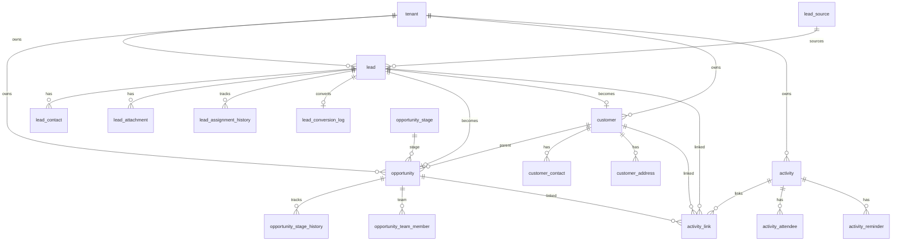

# E-LinkUp Entity Relationship Diagram — CRM
**Document ID:** ELU-ERD-CRM  
**Version:** 1.0  
**Status:** Approved  
**Related Documents:** ELU-DDD-CRM, ELU-BFS-CRM, ELU-ERD-PF, ELU-ADR-015, ELU-DOC-001  

---

## Version History

| Version | Date | Author | Change |
|---------|------|--------|--------|
| 1.0 | 2026-08-06 | EIIP / Data Architect | Initial CRM logical ERD |

---

## 1. Logical ERD



---

## 2. Conversion Spine

```text
lead ──convert──► customer (find or create)
              └──► opportunity (source_lead_id, customer_id)
```

On convert: write `lead_conversion_log`; set lead.status = CONVERTED; lock lead for commercial edits.

---

## 3. Cardinality & Delete Policy

| Parent | Child | Card | On Delete |
|--------|-------|------|-----------|
| tenant | lead / opportunity / customer / activity | 1:N | Restrict |
| lead | lead_contact | 1:N | Cascade |
| lead | opportunity | 0..1 | Restrict |
| customer | opportunity | 1:N | Restrict |
| opportunity | opportunity_stage_history | 1:N | Cascade |
| activity | activity_link | 1:N | Cascade |
| customer | customer_contact | 1:N | Cascade |

Polymorphic `activity_link`: enforce same `tenant_id` as parent activity and target entity in service layer.

---

## 4. RLS

All CRM tables: RLS + repository filters (**ADR-015**).

---

*© Euphoria Infotech (I) Limited — ELU-ERD-CRM*
