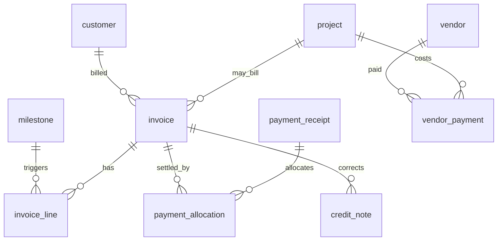

# E-LinkUp ERD — Finance
**Document ID:** ELU-ERD-FIN  
**Version:** 1.0  
**Status:** Approved  
**Related Documents:** ELU-DDD-FIN, ELU-BFS-FIN, ELU-ERD-PRJ, ELU-ADR-015  

---

## Version History

| Version | Date | Author | Change |
|---------|------|--------|--------|
| 1.0 | 2026-08-06 | EIIP / Data Architect | FIN logical ERD |

---

## 1. Logical ERD

---

## 2. Immutability

ISSUED/PAID invoices: Restrict updates to non-financial metadata; corrections via credit_note. Payments: soft-void only with audit.

---

*© Euphoria Infotech (I) Limited — ELU-ERD-FIN*
