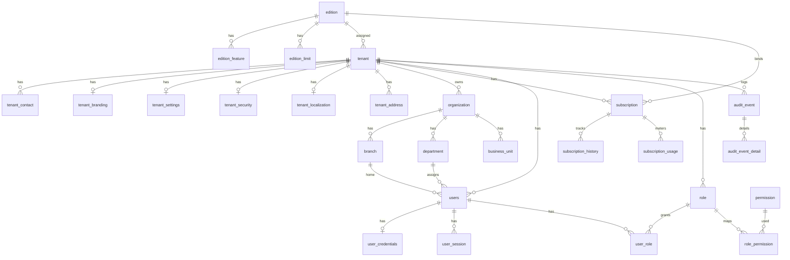

# E-LinkUp Entity Relationship Diagram — Platform Foundation
**Document ID:** ELU-ERD-PF  
**Version:** 1.0  
**Status:** Approved  
**Related Documents:** ELU-DDD-PF, ELU-BFS-PF, ELU-ADR-001 (ADR-001, ADR-015), ELU-DOC-001  

---

## Version History

| Version | Date | Author | Change |
|---------|------|--------|--------|
| 1.0 | 2026-08-06 | EIIP / Data Architect | Initial PF logical ERD |

---

## 1. Logical ERD

---

## 2. Physical Notes

| Rule | Implementation |
|------|----------------|
| Tenant scope | All business tables except edition/permission/feature_catalogue/platform_* |
| FK delete | Restrict on masters with children; Cascade on owned children (contacts, sessions) |
| Soft delete | `is_deleted`; unique constraints are partial |
| RLS | All tenant-scoped tables — **ADR-015** |
| Special | `tenant` table RLS: `id = current_setting('app.tenant_id')::uuid` OR platform context |

---

## 3. Cardinality Summary

| Parent | Child | Card | On Delete |
|--------|-------|------|-----------|
| edition | tenant | 1:N | Restrict |
| tenant | organization | 1:N | Restrict |
| organization | branch | 1:N | Restrict |
| organization | department | 1:N | Restrict |
| tenant | users | 1:N | Restrict |
| users | user_credentials | 1:1 | Cascade |
| role | role_permission | 1:N | Cascade |
| tenant | subscription | 1:N | Restrict |
| tenant | audit_event | 1:N | Restrict (purge via retention job) |

---

*© Euphoria Infotech (I) Limited — ELU-ERD-PF*
