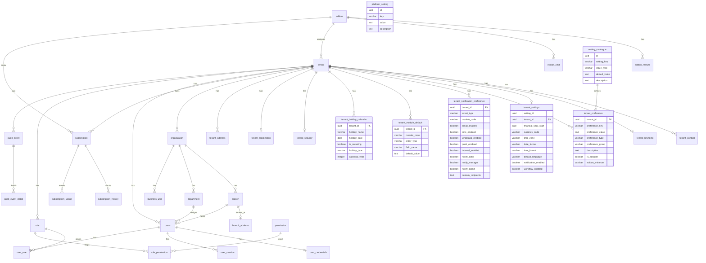

# E-LinkUp Entity Relationship Diagram — Platform Foundation
**Document ID:** ELU-ERD-PF  
**Version:** 1.1
**Status:** Approved  
**Related Documents:** ELU-DDD-PF, ELU-BFS-PF, ELU-ADR-001 (ADR-001, ADR-015), ELU-DOC-001  

---

## Version History

| Version | Date | Author | Change |
|---------|------|--------|--------|
| 1.0 | 2026-08-06 | EIIP / Data Architect | Initial PF logical ERD |
| 1.1 | 2026-09-29 | EIIP / Engineering | PF-011 governed specification reconciliation |

---

## 1. Logical ERD

```mermaid
erDiagram
    edition ||--o{ edition_feature : has
    edition ||--o{ edition_limit : has
    edition ||--o{ tenant : assigned
    edition ||--o{ subscription : binds
    tenant ||--o{ tenant_contact : has
    tenant ||--o| tenant_branding : has
    tenant ||--o| tenant_settings : has
    tenant ||--o{ tenant_preference : has
    tenant ||--o{ tenant_notification_preference : has
    tenant ||--o{ tenant_module_default : has
    tenant ||--o{ tenant_holiday_calendar : has
    setting_catalogue ||--o{ tenant_preference : defines
    tenant ||--o| tenant_security : has
    tenant ||--o| tenant_localization : has
    tenant ||--o{ tenant_address : has
    tenant ||--o{ organization : owns
    tenant ||--o{ subscription : has
    tenant ||--o{ users : has
    tenant ||--o{ role : has
    tenant ||--o{ audit_event : logs
    organization ||--o{ branch : has
    branch ||--o| branch_address : located_at
    organization ||--o{ department : has
    organization ||--o{ business_unit : has
    branch ||--o{ users : home
    department ||--o{ users : assigns
    users ||--o| user_credentials : has
    users ||--o{ user_session : has
    users ||--o{ user_role : has
    role ||--o{ user_role : grants
    role ||--o{ role_permission : maps
    permission ||--o{ role_permission : used
    subscription ||--o{ subscription_history : tracks
    subscription ||--o{ subscription_usage : meters
    audit_event ||--o{ audit_event_detail : details

    tenant_settings {
        uuid setting_id
        uuid tenant_id FK
        date financial_year_start
        varchar currency_code
        varchar time_zone
        varchar date_format
        varchar time_format
        varchar default_language
        boolean notification_enabled
        boolean workflow_enabled
    }
    tenant_preference {
        uuid tenant_id FK
        varchar preference_key
        text preference_value
        varchar preference_type
        varchar preference_group
        text description
        boolean is_editable
        varchar edition_minimum
    }
    tenant_notification_preference {
        uuid tenant_id FK
        varchar event_type
        varchar module_code
        boolean email_enabled
        boolean sms_enabled
        boolean whatsapp_enabled
        boolean push_enabled
        boolean internal_enabled
        boolean notify_actor
        boolean notify_manager
        boolean notify_admin
        text custom_recipients
    }
    tenant_module_default {
        uuid tenant_id FK
        varchar module_code
        varchar entity_type
        varchar field_name
        text default_value
    }
    tenant_holiday_calendar {
        uuid tenant_id FK
        varchar holiday_name
        date holiday_date
        boolean is_recurring
        varchar holiday_type
        integer calendar_year
    }
    platform_setting {
        uuid id
        varchar key
        text value
        text description
    }
    setting_catalogue {
        uuid id
        varchar setting_key
        varchar value_type
        text default_value
        text description
    }
```

---

## 2. Physical Notes

| Rule | Implementation |
|------|----------------|
| Tenant scope | All business tables except edition/permission/feature_catalogue/platform_* |
| FK delete | Restrict on masters with children; Cascade on owned children (contacts, sessions) |
| Soft delete | `is_deleted`; unique constraints are partial |
| RLS | All tenant-scoped tables — **ADR-015** |
| Special | `tenant` table RLS: `id = current_setting('app.tenant_id')::uuid` OR platform context |

### 2.1 PF-011 configuration tables

- `tenant_preference`, `tenant_notification_preference`, `tenant_module_default` and `tenant_holiday_calendar` are tenant-scoped and use RLS.
- `tenant_settings` remains tenant-scoped and uses the existing RLS.
- `platform_setting` and `setting_catalogue` are platform-global: no `tenant_id` and no RLS.
- `setting_catalogue -> tenant_preference` is **restrictive**: a preference key cannot exist without a catalogue entry.

---

## 3. Cardinality Summary

| Parent | Child | Card | On Delete |
|--------|-------|------|-----------|
| edition | tenant | 1:N | Restrict |
| tenant | organization | 1:N | Restrict |
| organization | branch | 1:N | Restrict |
| branch | branch | 1:N | Restrict (hierarchy) |
| branch | branch_address | 1:1 | Cascade |
| organization | department | 1:N | Restrict |
| tenant | users | 1:N | Restrict |
| users | user_credentials | 1:1 | Cascade |
| role | role_permission | 1:N | Cascade |
| tenant | subscription | 1:N | Restrict |
| tenant | audit_event | 1:N | Restrict (purge via retention job) |
| tenant | tenant_settings | 1:1 | Cascade |
| tenant | tenant_preference | 1:N | Cascade |
| tenant | tenant_notification_preference | 1:N | Cascade |
| tenant | tenant_module_default | 1:N | Cascade |
| tenant | tenant_holiday_calendar | 1:N | Cascade |
| setting_catalogue | tenant_preference | 1:N | Restrict |

**PF-005 groundwork (2026-09-12):** `branch` and `branch_address` are specified and schema-prepared (`014_branch_pf005.sql`, `branch.branch_address_id` → `core.branch_address` ON DELETE **SET NULL**; `branch_address.branch_id` → `core.branch` ON DELETE **CASCADE**). The `organization →|| department`, `branch ||--o{ users : home` and `department → users` relationships remain **documentary only** — PF-006 (department) and PF-008 (users / `users.branch_id`) are not implemented and must not be created now.

---

*© Euphoria Infotech (I) Limited — ELU-ERD-PF*
