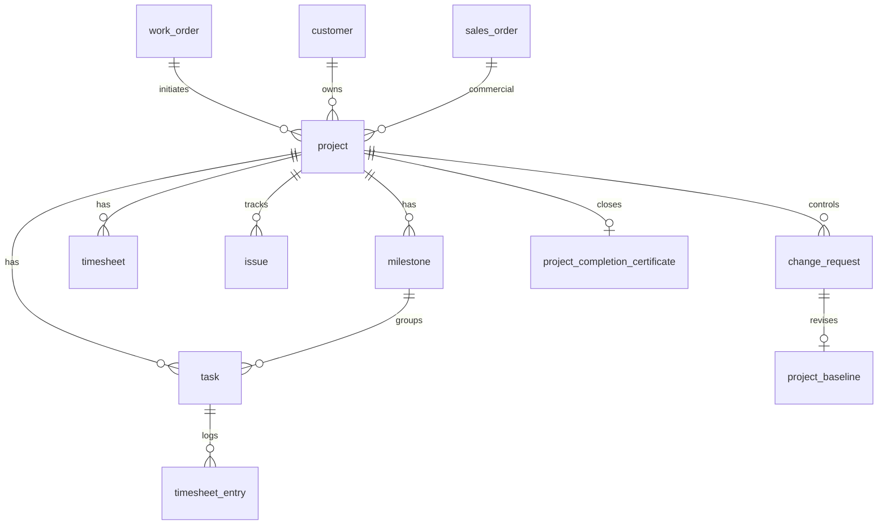

# E-LinkUp ERD — Projects
**Document ID:** ELU-ERD-PRJ  
**Version:** 1.0  
**Status:** Approved  
**Related Documents:** ELU-DDD-PRJ, ELU-BFS-PRJ, ELU-ERD-SAL, ELU-ADR-015  

---

## Version History

| Version | Date | Author | Change |
|---------|------|--------|--------|
| 1.0 | 2026-08-06 | EIIP / Data Architect | PRJ logical ERD |

---

## 1. Logical ERD

---

## 2. Delete policy

Restrict from commercial parents (WO/SO/Customer); Cascade team/checklist children; Restrict milestones/tasks with timesheets.

---

*© Euphoria Infotech (I) Limited — ELU-ERD-PRJ*
