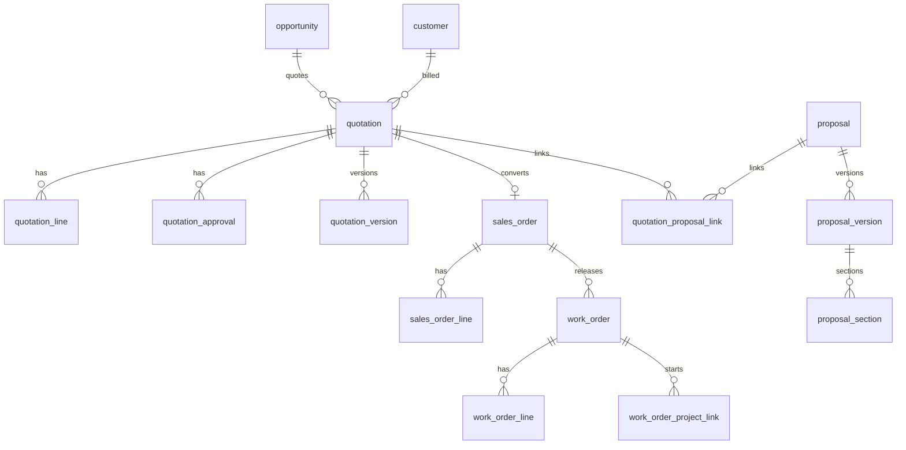

# E-LinkUp ERD — Sales
**Document ID:** ELU-ERD-SAL  
**Version:** 1.0  
**Status:** Approved  
**Related Documents:** ELU-DDD-SAL, ELU-BFS-SAL, ELU-ERD-CRM, ELU-ADR-015, ELU-L2C-001  

---

## Version History

| Version | Date | Author | Change |
|---------|------|--------|--------|
| 1.0 | 2026-08-06 | EIIP / Data Architect | SAL logical ERD |

---

## 1. Logical ERD



---

## 2. Spine

```text
Opportunity → Quotation (+ Proposal) → Sales Order → Work Order → Project (PRJ)
```

On Delete: Restrict across commercial spine; Cascade on owned lines/approvals.

---

## 3. RLS

All SAL tables: dual isolation **ADR-015**. Professional+ only.

---

*© Euphoria Infotech (I) Limited — ELU-ERD-SAL*
