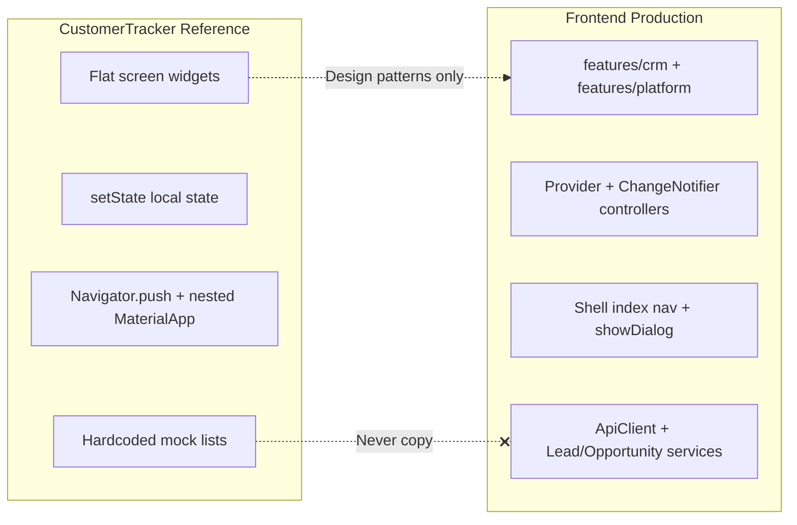
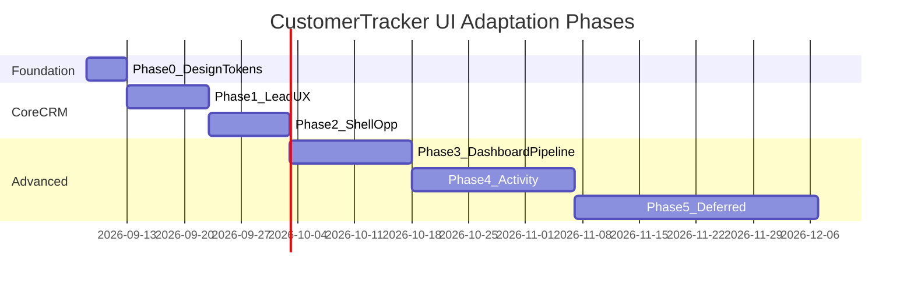

# CustomerTracker UI Reuse Assessment

**Document:** `customertracker-ui-reuse-assessment.md`  
**Status:** Approved for planning (documentation only — no code changes in this deliverable)  
**Date:** 2026-09-01  
**Authority order:** ELU-CON-001 → ELU-ADR-001 → ELU-EFS-001 → ELU-BFS-CRM → ELU-UI-CRM → ELU-DEV-001

---

## 1. Purpose

This document is the **single authoritative reuse assessment** for adapting CustomerTracker UI/UX patterns into the E-LinkUp CRM Flutter client (`Frontend/`).

| Application | Path | Role |
|-------------|------|------|
| **CustomerTracker** | `customertracker/` | UI/UX reference prototype ("Lead Tracking System"). **Not** architectural authority. |
| **CRM Frontend** | `Frontend/` (`elinkup_app`) | Production CRM client. **Implementation authority.** |

### Architectural principle

> CustomerTracker is a UI/reference source, not the architectural authority for the CRM.

The CRM requirements, database model, API contracts, tenant isolation, security model, and established Frontend architecture take precedence. Reuse CustomerTracker where it improves the CRM; adapt it to the CRM rather than adapting the CRM to CustomerTracker.

### Constraints (non-negotiable)

- Do **not** treat `customertracker` as a Git submodule or package dependency.
- Do **not** move or delete the `customertracker` folder.
- Do **not** blindly copy the entire CustomerTracker application into `Frontend`.
- Do **not** replace CRM architecture to make CustomerTracker work.
- Do **not** introduce CustomerTracker packages without explicit compatibility review.

### Related documents

| Document | Role |
|----------|------|
| [customertracker-integration-analysis.md](customertracker-integration-analysis.md) | Historical integration analysis |
| [customertracker-crm-gap-analysis.md](customertracker-crm-gap-analysis.md) | Historical gap analysis by domain |
| [customertracker-ui-migration-plan.md](customertracker-ui-migration-plan.md) | Historical migration tables |
| [ELU-UI-CRM](11-Engineering/ELU-UI-CRM.md) | Authoritative CRM screen routes and RBAC |
| [ELU-BFS-CRM](02-BFS-CRM/ELU-BFS-CRM.md) | Authoritative CRM business requirements |

This assessment **supersedes** the three CustomerTracker-specific docs above for **implementation decisions**. Those docs remain as historical context.

---

## 2. Classification legend (A–E)

| Class | Label | Meaning |
|-------|-------|---------|
| **A** | Reuse as-is | Copy widget/code with minimal change. Rare in production; palette constants as reference only. |
| **B** | Adapt with minor changes | Visual/interaction pattern restyled to Material 3 and wired to existing CRM controllers. |
| **C** | Adapt with significant changes | Substantial UI port: new screens, routing, API integration, shared widgets in `Frontend/`. |
| **D** | CRM-specific implementation required | No CustomerTracker equivalent, or CRM spec/API/RBAC overrides reference patterns. |
| **E** | Do not reuse | Anti-patterns, out-of-scope features, unused stubs, or incompatible architecture. |

---

## 3. Executive summary

CustomerTracker is a **lead-centric UI prototype** (74 Dart files, flat `lib/` structure) with rich mock screens but no API layer, no tenant model, and no opportunity module. The CRM Frontend is an **early MVP** (26 Dart files, feature-based architecture) with API-backed leads and opportunities, Provider auth, and platform administration.

**High-value reuse targets:** lead list/detail layout, section-card profile hub, tabbed create form, search/filter styling, dashboard KPI cards, activity timeline and follow-up patterns, navigation grouping.

**Do not reuse:** nested `MaterialApp`, mock data flows, OTP/register flows, Syncfusion stack, camera demo, quotes/invoices stubs, flat file structure, `setState`-only state.

**Opportunity area:** CustomerTracker has **no opportunity screens**. All opportunity UI is **D (CRM-specific)**, with optional **B/C** visual patterns borrowed from lead cards and dashboard widgets.

---

## 4. Architecture comparison

| Dimension | CustomerTracker | CRM Frontend | Class |
|-----------|-----------------|--------------|-------|
| Structure | 74 flat `lib/*.dart` files | `features/*/data\|presentation` | **E** |
| State | `setState`, local hardcoded lists | `Provider` + `LeadsController` / `OpportunitiesController` | **E** |
| Navigation | `Navigator.push`, nested `MaterialApp` | `NavigationRail` / `NavigationBar` shell, dialogs | **C** (layout ideas only) |
| Theme | Inline colors + `LightColors`; empty `theme.dart` | M3 seed `0xFF0B3D91` in `app.dart` | **C** (spacing/rhythm, not palette) |
| Data | Mock `List<Map>` | `ApiClient` → FastAPI | **D** |
| Auth | Demo login, no tenant | JWT + `tenant_code`, `AuthController` | **D** |
| Dependencies | 20+ UI packages (many unused) | `http`, `provider`, `shared_preferences` | **E** (bulk); per-package gate below |

### Backend API surface (CRM authority)

Leads (`Backend/app/api/v1/crm/leads.py`): list, create, get, put, patch, convert, delete.  
Opportunities (`Backend/app/api/v1/crm/opportunities.py`): list, pipeline, create, get, put, patch, stage, delete.

UI work for list/detail/create can proceed on these endpoints without waiting for CustomerTracker alignment.

---

## 5. Application inventories

### 5.1 CustomerTracker (`customertracker/lib/`)

**Entry:** `main.dart` → login → `screens/home_page.dart`

| Area | Key files |
|------|-----------|
| Auth | `main.dart`, `login_otp.dart`, `forgot_password.dart`, `register.dart`, `register_details.dart` |
| Shell / nav | `side_menu_app.dart`, `settings.dart`, `screens/home_page.dart` |
| Lead hub | `lead_state.dart`, `lead_contacts.dart`, `lead_contact_norms.dart`, `add_lead.dart`, `lead_search.dart`, `lead_filter.dart` |
| Lead profile | `lead_profile.dart`, `lead_edit_profile.dart`, `lead_profile_qualifiers.dart`, `lead_profile_add_followup.dart`, `lead_profile_recent_activity.dart`, `lead_profile_attchments.dart`, `lead_profile_quotesinvoices.dart` |
| Follow-up / calendar | `lead_add_followup.dart`, `set_follow_ups.dart`, `lead_table_event_calendar.dart`, `screens/calendar_page.dart`, `screens/create_new_task_page.dart` |
| Reports / misc | `lead_report.dart`, `lead_notification.dart`, `lead_map.dart`, `lead_category.dart` |
| Users | `user.dart`, `user_add.dart`, `my_profile.dart`, `edit_profile.dart` |
| Reusable widgets | `widgets/top_container.dart`, `active_project_card.dart`, `task_column.dart`, `task_container.dart`, `my_text_field.dart`, `back_button.dart` |
| Theme | `theme/colors/light_colors.dart` (only active theme artifact) |

**Not present:** Opportunity module, tenant isolation, API services, repositories.

### 5.2 CRM Frontend (`Frontend/lib/`)

**Entry:** `main.dart` → `app.dart` → auth gate → `home_page.dart` shell

| Area | Key files |
|------|-----------|
| Core | `core/auth/`, `core/network/api_client.dart`, `app.dart` |
| Platform | `features/platform/presentation/` — login, home, tenants, organizations, subscriptions, editions |
| CRM | `features/crm/presentation/leads_page.dart`, `lead_form_dialog.dart`, `leads_controller.dart`, `opportunities_page.dart`, `opportunity_form_dialog.dart`, `opportunities_controller.dart` |
| Data | `features/crm/data/lead_model.dart`, `lead_service.dart`, `opportunity_model.dart`, `opportunity_service.dart` |

**Missing vs ELU-UI-CRM:** Lead detail, opportunity detail, pipeline kanban, customer module, activity timeline, routed pages (`/crm/leads/:id`, etc.).

---

## 6. UI/UX element taxonomy

| Element | CustomerTracker pattern | CRM Frontend today | Reuse guidance |
|---------|-------------------------|-------------------|----------------|
| **Screens** | One file per screen, often standalone `main()` | Feature pages + dialog modals | **C** — new routed pages, not file-per-screen copy |
| **Widgets** | 7 files under `widgets/` | Private `_`-prefixed widgets in pages | **B/C** — extract to `Frontend/lib/core/widgets/` or `features/crm/widgets/` |
| **Layouts** | Full-bleed background image + overlay container | Plain `Padding` + `Column` | **E** backgrounds; **B** card section rhythm |
| **Navigation** | Drawer + tab hub (`lead_state.dart`) | Index-based rail/bar | **C** — CRM nav grouping, keep rail/bar |
| **Forms** | `TextField`, sparse validators, `dropdown_button2` | `Form` + `TextFormField`, API submit | **B** field grouping; **D** validation rules from EFS |
| **Lists** | `ListView.builder` + `Card` + `ListTile` | `DataTable` with horizontal scroll | **C** — hybrid card (mobile) / table (desktop) |
| **Search** | Rounded `TextField`, client-side filter | API `search` param | **B** styling; **D** server search logic |
| **Filters** | Stub `AlertDialog` | None beyond search | **C** when API supports facets |
| **Dialogs** | `AlertDialog` with stub forms | `AlertDialog` create/edit | **B** layout polish |
| **Cards** | High elevation, section navigation cards | Minimal card usage | **B/C** `CrmSectionCard` pattern |
| **Typography** | Ad hoc 10–25px, no custom font | Material 3 default | **B** — standardize via theme extension |
| **Colors** | Gray/green app bar, `LightColors` yellow palette | Navy M3 seed | **A** reference tokens only; **D** CRM brand |
| **Spacing** | `EdgeInsets.only(left:20, top:20, right:20)` | 12/16/24 ad hoc | **B** — tokenize in `core/theme/` |
| **Responsive** | `MediaQuery` width in 2 screens; fixed `height:1000` | 700/900px breakpoints | **D** — extend CRM breakpoints, not CT fixed heights |
| **Icons** | Material + Font Awesome | Material only | **B** optional FA in Phase 2 |
| **Assets** | `assets/Images/` cover photos, avatars | No custom assets | **E** — do not copy demo images |
| **Validation** | Mostly absent | Login + dialog validators | **D** — EFS-driven transitions |
| **State** | `setState`, `ValueNotifier`, `AnimationController` | `ChangeNotifier` + `AnimatedBuilder` | **E** — keep CRM pattern |

---

## 7. Lead and Opportunity focus analysis

Per ELU-UI-CRM routes and ELU-BFS-CRM module spine (Lead → Opportunity → Customer → Activity).

| Capability | CustomerTracker reference | CRM today | Class | Recommendation |
|------------|---------------------------|-----------|-------|----------------|
| **Lead list** | `lead_contacts.dart`, `lead_contact_norms.dart` | `leads_page.dart` (`DataTable`) | **C** | Responsive card list (narrow) + table (wide); keep `LeadsController` |
| **Lead creation** | `add_lead.dart` (3-tab: Profile / Qualifiers / Follow-up) | `lead_form_dialog.dart` | **C** | Route `/crm/leads/new` as tabbed page; Profile tab first; wire POST API |
| **Lead profile** | `lead_profile.dart` + sub-pages | Missing | **C** | New `LeadDetailPage` at `/crm/leads/:id`; section cards → sub-routes |
| **Lead search** | `lead_search.dart` | API search in `leads_page.dart` | **B** | Rounded search field styling; keep server-side search |
| **Lead qualification** | `lead_profile_qualifiers.dart`, `lead_add_qualifiers.dart` | Status dropdown on create only | **C** | Defer until qualify/disqualify APIs + EFS transitions exist |
| **Lead follow-up** | `lead_add_followup.dart`, `lead_profile_add_followup.dart` | Not implemented | **C** | Defer until CRM-004 activity API |
| **Lead distribution** | "Assigned To" dropdown in follow-up only | Not implemented | **D** | CRM-specific; Rule Engine (CPS-002) assignment — no CT screen |
| **Opportunity list** | *None* | `opportunities_page.dart` | **D** | Keep API table; apply CT card visual hierarchy (**B**) |
| **Opportunity creation** | *None* | `opportunity_form_dialog.dart` | **B** | Field grouping from CT forms; keep dialog or route per ELU-UI |
| **Opportunity profile** | *None* | Missing | **D/C** | New `OpportunityDetailPage`; borrow CT profile card layout |
| **Opportunity pipeline** | *None* (dashboard cards only as KPI inspiration) | `FilterChip` buckets + table | **D** | Kanban at `/crm/opportunities/pipeline` per ELU-UI-CRM |
| **Opportunity stages** | *None* | Hardcoded in `opportunities_controller.dart` | **D** | EFS-driven stages; future stage admin |
| **Filters / search** | `lead_filter.dart` (stub) | Text search only | **C** | Filter bottom sheet when API supports facets |
| **Dashboards** | `screens/home_page.dart`, `active_project_card.dart` | Profile tiles in `_DashboardView` | **C** | KPI rings/cards fed by pipeline + lead counts |
| **Forms / detail pages** | Profile tabs, edit flows | Dialog-only | **C** | Migrate to routed pages per ELU-UI-CRM |

---

## 8. Master compatibility / reuse matrix

Effort: **S** = small (≤2 days), **M** = medium (3–5 days), **L** = large (1+ sprint).  
Risk: **Low** / **Med** / **High**.

### 8.1 Authentication and onboarding

| CT Component | CT Path | CRM Equivalent | Class | Decision | Reason | Dependencies | Effort | Risk |
|--------------|---------|----------------|-------|----------|--------|--------------|--------|------|
| Login form layout | `main.dart` | `login_page.dart` | **B** | Adapt | Card layout and field grouping useful; keep tenant+JWT flow | Auth API | S | Low |
| OTP login | `login_otp.dart` | — | **E** | Do not reuse | Not in CRM auth spec | — | — | — |
| Forgot password | `forgot_password.dart` | — | **E** | Do not reuse | Backend flow not implemented | Future auth API | — | — |
| Register / signup | `register.dart`, `register_details.dart` | — | **E** | Do not reuse | Tenant onboarding is platform admin function | PF APIs | — | — |
| Google sign-in shell | `home.dart` | — | **E** | Do not reuse | CRM uses tenant code + password | — | — | — |

### 8.2 App shell and navigation

| CT Component | CT Path | CRM Equivalent | Class | Decision | Reason | Dependencies | Effort | Risk |
|--------------|---------|----------------|-------|----------|--------|--------------|--------|------|
| Navigation drawer | `side_menu_app.dart` | `home_page.dart` | **C** | Adapt | Section grouping and icons useful; keep rail/bar responsive shell | RBAC, edition gating | M | Med |
| Settings shell | `settings.dart` | Future settings | **C** | Adapt | Grouped settings layout reference | CRM admin routes | M | Med |
| Nested MaterialApp | Multiple screens | — | **E** | Do not reuse | Anti-pattern; breaks shell auth context | — | — | — |
| Search lead shell | `search_lead.dart` | `leads_page.dart` | **B** | Adapt | Decorative search layout only | — | S | Low |

### 8.3 Dashboard and landing

| CT Component | CT Path | CRM Equivalent | Class | Decision | Reason | Dependencies | Effort | Risk |
|--------------|---------|----------------|-------|----------|--------|--------------|--------|------|
| Home dashboard | `screens/home_page.dart` | `_DashboardView` in `home_page.dart` | **C** | Adapt | Task columns + project cards → CRM KPI widgets | Pipeline/lead count APIs | M | Low |
| TopContainer header | `widgets/top_container.dart` | New `core/theme` | **B** | Adapt | Rounded header container pattern | Theme tokens | S | Low |
| ActiveProjectsCard | `widgets/active_project_card.dart` | Dashboard KPI cards | **C** | Adapt | Percent ring cards for pipeline/lead stats | `GET /opportunities/pipeline` | M | Low |
| TaskColumn | `widgets/task_column.dart` | Dashboard task summary | **C** | Adapt | To-do / in-progress / done layout | Activity API (Phase 4) | M | Med |
| TaskContainer | `widgets/task_container.dart` | Activity list items | **B** | Adapt | Rounded task info box | Activity API | S | Med |
| Background cover images | `assets/Images/cover.jpg` | — | **E** | Do not reuse | Not appropriate for enterprise CRM shell | — | — | — |

### 8.4 Lead management

| CT Component | CT Path | CRM Equivalent | Class | Decision | Reason | Dependencies | Effort | Risk |
|--------------|---------|----------------|-------|----------|--------|--------------|--------|------|
| Lead hub tabs | `lead_state.dart` | `leads_page.dart` | **C** | Adapt | Tab hub (list/calendar/notifications) inspires CRM sub-nav | Routes, RBAC | M | Med |
| Lead list (cards) | `lead_contacts.dart` | `leads_page.dart` | **C** | Adapt | Card+ListTile mobile pattern vs DataTable | `LeadsController` | M | Low |
| Lead list FAB menu | `lead_contact_norms.dart` | `leads_page.dart` FAB | **B** | Adapt | Expandable action menu for quick create | — | S | Low |
| Legacy contacts list | `lead_contacts_old.dart` | — | **E** | Do not reuse | Superseded by `lead_contacts.dart` | — | — | — |
| Add lead (3-tab) | `add_lead.dart` | `lead_form_dialog.dart` | **C** | Adapt | Tab structure for `/crm/leads/new`; tabs 2–3 gated on APIs | POST `/crm/leads` | M | Med |
| Lead profile hub | `lead_profile.dart` | *New* `LeadDetailPage` | **C** | Adapt | Section cards for follow-up, activity, qualifiers | GET `/crm/leads/{id}` | L | Med |
| Lead edit profile | `lead_edit_profile.dart` | Lead edit on detail page | **C** | Adapt | Form layout for PUT/PATCH lead | PUT/PATCH API | M | Med |
| Lead search UI | `lead_search.dart` | `leads_page.dart` search | **B** | Adapt | Rounded search bar; keep API search | `LeadsController.search` | S | Low |
| Lead filter dialog | `lead_filter.dart` | Future filter sheet | **C** | Adapt | Filter UX stub; needs API facets | Lead list query params | M | Med |
| Lead category list | `lead_category.dart` | Lead source admin | **D** | CRM-specific | Maps to CRM admin, not CT categories | Lead source API | M | Med |
| Lead select list dialog | `lead_select_list.dart` | Entity pickers | **B** | Adapt | Picker dialog pattern | — | S | Low |
| Lead map | `lead_map.dart` | — | **E** | Do not reuse | Stub only; no map widget | — | — | — |
| Lead notifications | `lead_notification.dart` | Notification center | **D** | CRM-specific | CPS-003 notification engine | Notification API | L | High |
| Lead report tabs | `lead_report.dart` | CRM reports | **D** | CRM-specific | CPS-004 reporting; CT tabs are placeholders | Reporting API | L | High |
| Lead report pyramid | `lead_report_pyramid.dart` | — | **E** | Do not reuse | Orphan Syncfusion snippet, not integrated | — | — | — |
| Lead invoice (empty) | `lead_invoice.dart` | — | **E** | Do not reuse | Empty file | — | — | — |

### 8.5 Lead profile sub-modules

| CT Component | CT Path | CRM Equivalent | Class | Decision | Reason | Dependencies | Effort | Risk |
|--------------|---------|----------------|-------|----------|--------|--------------|--------|------|
| Qualifiers panel | `lead_profile_qualifiers.dart` | Qualification UI on detail | **C** | Adapt | Product/customer group layout reference | Qualify API, EFS | M | High |
| Add qualifiers | `lead_add_qualifiers.dart` | Qualification form | **C** | Adapt | Same as above | Qualify API | M | High |
| Profile follow-up | `lead_profile_add_followup.dart` | Activity on detail | **C** | Adapt | Follow-up card + form layout | CRM-004 activity API | M | High |
| Add follow-up | `lead_add_followup.dart` | Log activity dialog | **C** | Adapt | Assigned-to + date/time fields | CRM-004 | M | High |
| Set follow-ups list | `set_follow_ups.dart` | My activities / overdue | **C** | Adapt | Follow-up list page | Activity API | M | High |
| Follow-up search | `lead_set_followup_search.dart` | Activity search | **C** | Adapt | Contact search for scheduling | Activity API | S | Med |
| Recent activity timeline | `lead_profile_recent_activity.dart` | `ActivityTimeline` widget | **C** | Adapt | Timeline cards on detail pages | CRM-004 | L | High |
| Attachments | `lead_profile_attchments.dart` | Document attachments | **C** | Adapt | Tabbed attachment UI | CPS-006 DMS API | L | High |
| Quotes / invoices | `lead_profile_quotesinvoices.dart` | SAL quotation links | **E** | Do not reuse | Downstream SAL module; not CRM-only | SAL API | — | — |
| Quote settings | `lead_quotesinvoices_settings.dart` | — | **E** | Do not reuse | Same as above | — | — | — |

### 8.6 Calendar and tasks

| CT Component | CT Path | CRM Equivalent | Class | Decision | Reason | Dependencies | Effort | Risk |
|--------------|---------|----------------|-------|----------|--------|--------------|--------|------|
| Table event calendar | `lead_table_event_calendar.dart` | Activity calendar tab | **C** | Adapt | Month grid for follow-ups | `table_calendar` pkg, activity API | M | Med |
| Home table calendar | `home_table_event_calendar.dart` | Dashboard calendar widget | **C** | Adapt | Calendar on home or activities route | Activity API | M | Med |
| Calendar page | `screens/calendar_page.dart` | `/crm/activities` calendar view | **C** | Adapt | Week view + task list | ELU-UI-CRM routes | M | Med |
| Create new task | `screens/create_new_task_page.dart` | `/crm/activities/new` | **C** | Adapt | Task form with `MyTextField` rhythm | Activity API | M | Med |
| Syncfusion calendar | `lead_google_calendar.dart` | — | **E** | Do not reuse | Orphan snippet; licensing weight | — | — | — |
| Vendored table_calendar src | `lib/src/` | Use pub package | **E** | Do not reuse | Use official `table_calendar` from pub.dev if needed | — | — | — |
| CalendarDates widget | `widgets/calendar_dates.dart` | Activity date picker | **B** | Adapt | Small helper widget | — | S | Low |

### 8.7 User and profile

| CT Component | CT Path | CRM Equivalent | Class | Decision | Reason | Dependencies | Effort | Risk |
|--------------|---------|----------------|-------|----------|--------|--------------|--------|------|
| User list | `user.dart` | Platform user admin | **D** | CRM-specific | Platform RBAC, not sales user list | PF user APIs | L | Med |
| Add user | `user_add.dart` | Platform user invite | **D** | CRM-specific | Tenant user provisioning | PF APIs | M | Med |
| User dropdown demo | `user_list.dart` | Assignment pickers | **B** | Adapt | Dropdown pattern for owner assignment | User list API | S | Med |
| My profile | `my_profile.dart` | Shell profile header | **B** | Adapt | Avatar + account card | `GET /auth/me` | S | Low |
| Edit profile | `edit_profile.dart` | User settings | **B** | Adapt | Form field layout | Profile API | S | Low |
| Edit profile copy | `edit_profile copy.dart` | — | **E** | Do not reuse | Duplicate file | — | — | — |

### 8.8 Opportunity (no CustomerTracker equivalent)

| CT Component | CT Path | CRM Equivalent | Class | Decision | Reason | Dependencies | Effort | Risk |
|--------------|---------|----------------|-------|----------|--------|--------------|--------|------|
| Opportunity list | *N/A* | `opportunities_page.dart` | **D** | CRM-specific | No CT module; enhance with card patterns (**B** styling) | Opportunity API | M | Low |
| Opportunity create | *N/A* | `opportunity_form_dialog.dart` | **B** | Adapt | CT form grouping conventions | POST `/crm/opportunities` | S | Low |
| Opportunity detail | *N/A* | *New* `OpportunityDetailPage` | **D/C** | CRM-specific + layout borrow | Profile card layout from `lead_profile.dart` | GET opportunity API | L | Med |
| Pipeline / kanban | *N/A* | `opportunities_page.dart` chips | **D** | CRM-specific | ELU-UI `/crm/opportunities/pipeline` | Pipeline API | L | High |
| Stage advance | *N/A* | Row "Advance" action | **D** | Keep CRM logic | EFS stage order in controller | PATCH `/stage` | S | Low |
| Close won / lost | *N/A* | — | **D** | CRM-specific | Wizard per ELU-BFS-CRM | Close APIs | L | High |
| Forecast view | *N/A* | — | **D** | CRM-specific | No CT reference | Reporting API | L | High |

### 8.9 Theme, widgets, and anti-patterns

| CT Component | CT Path | CRM Equivalent | Class | Decision | Reason | Dependencies | Effort | Risk |
|--------------|---------|----------------|-------|----------|--------|--------------|--------|------|
| LightColors palette | `theme/colors/light_colors.dart` | `core/theme/` tokens | **A** | Reference only | Optional spacing/color reference; do not replace CRM navy brand | — | S | Low |
| Empty theme.dart | `theme/theme.dart` | `app.dart` ThemeData | **E** | Do not reuse | File is empty; CRM has M3 theme | — | — | — |
| MyTextField | `widgets/my_text_field.dart` | Form fields | **B** | Adapt | Underline labeled field → M3 `InputDecoration` | — | S | Low |
| MyBackButton | `widgets/back_button.dart` | Detail page back | **B** | Adapt | Hero back arrow pattern | — | S | Low |
| StyledSwitch | `buttontoggleswitch.dart` | Settings toggles | **E** | Do not reuse | Commented out / demo only | — | — | — |
| Mock data lists | Throughout `lib/` | `*_service.dart` | **E** | Do not reuse | All data must be API-backed | — | — | — |
| Duplicate main() entries | `lead_event_calendar.dart`, etc. | Single `main.dart` | **E** | Do not reuse | Isolated dev entries | — | — | — |
| Camera demo | `active_cemera_tab.dart` | — | **E** | Do not reuse | Unrelated to CRM MVP | — | — | — |

---

## 9. Package compatibility gate

Do **not** import CustomerTracker dependencies into `Frontend/pubspec.yaml` without passing this gate.

| Package | Used in CT? | CRM need? | Verdict |
|---------|-------------|-----------|---------|
| `http` | No (CT has no API) | Yes (already in CRM) | **Keep** — CRM only |
| `provider` | No | Yes (already in CRM) | **Keep** — CRM only |
| `shared_preferences` | Declared, unused in CT | Yes (already in CRM) | **Keep** — CRM only |
| `dropdown_button2` | `add_lead.dart` | Low | **Defer** — use native `DropdownButtonFormField` |
| `percent_indicator` | Dashboard cards | Medium (Phase 3) | **Optional** — KPI rings on dashboard |
| `table_calendar` | Calendar tabs | Medium (Phase 4) | **Add later** — after activity API |
| `intl` | Date formatting | Likely needed | **Add when** calendar ships |
| `font_awesome_flutter` | Drawer, icons | Low | **Optional Phase 2** — nav icons only |
| `syncfusion_flutter_calendar` | Orphan snippet | None | **E — do not introduce** |
| `syncfusion_flutter_charts` | Orphan snippet | None | **E — do not introduce** |
| `getwidget` | Declared, unused | None | **E** |
| `mb_button`, `mb_contact_form` | Unused | None | **E** |
| `contacts_service`, `camera` | Unused/stub | None | **E** |
| `flutter_signin_button` | Commented out | None | **E** |
| `animation_list`, `group_list_view`, `scrollable_list_tab_scroller` | Unused | None | **E** |
| `flutter_calendar_week`, `flutter_neat_and_clean_calendar` | Unused | None | **E** |
| `invoiceninja`, `tuple` | Unused | None | **E** |
| `flutter_switch` | Commented out | None | **E** |

**Rule:** Prefer Material 3 built-ins. Add a package only when a CRM feature is approved and the built-in alternative is insufficient.

---

## 10. Safe adaptation boundaries

| Boundary | Rule |
|----------|------|
| **Package import** | Never add `customertracker` as a dependency in `Frontend/pubspec.yaml`. Copy/adapt patterns into `Frontend/lib/`. |
| **Auth / tenant** | Keep `AuthController`, JWT flow, `tenant_code` on login. Do not copy CT demo auth. |
| **API contracts** | UI fields must map to `Lead` / `Opportunity` models and Backend schemas. No invented columns. |
| **Tenant isolation** | Never send client-supplied `tenant_id`. Server derives from JWT (ADR-001). |
| **State management** | Keep `Provider` + `ChangeNotifier` controllers. No CT `setState` architecture port. |
| **Navigation** | Incremental route addition per ELU-UI-CRM. `go_router` only if separately approved. Phase 1 can use `Navigator.push` to detail pages without full router migration. |
| **RBAC / edition** | Hide/disable actions per ELU-UI-CRM permission table and ELU-EDM-001 edition matrix. |
| **File placement** | New UI under `Frontend/lib/features/crm/presentation/` and shared widgets under `Frontend/lib/core/widgets/` or `features/crm/widgets/`. |
| **Business logic** | Qualification, distribution, conversion rules come from EFS/BFS, not CT mock flows. |

---

## 11. Features not auto-introduced from CustomerTracker

Require explicit CRM requirement approval before any UI work:

| CT feature | Path | Why gated |
|------------|------|-----------|
| Quotes / invoices | `lead_profile_quotesinvoices.dart` | SAL module (downstream of opportunity) |
| Lead map | `lead_map.dart` | Stub only; no geo requirement in CRM MVP |
| User admin screens | `user.dart`, `user_add.dart` | Platform RBAC, not sales CT screens |
| Lead categories | `lead_category.dart` | Maps to lead-source admin (CRM settings) |
| Camera capture | `active_cemera_tab.dart` | CPS-006 document management, later phase |
| OTP / self-registration | `login_otp.dart`, `register.dart` | Out of CRM client scope |
| Invoice Ninja integration | `invoiceninja` package | Finance domain |

---

## 12. Phased implementation plan

Ordered by **highest value, lowest risk** first. Flutter implementation requires separate human approval per ELU-GOV-VAL-001.

### Phase 0 — Design tokens and shared widgets (Low risk)

**Goal:** Establish CRM-native building blocks inspired by CT rhythm, without CT imports.

| Deliverable | CT inspiration | CRM target | Class |
|-------------|----------------|------------|-------|
| Spacing, radii, card elevation tokens | CT padding conventions | `Frontend/lib/core/theme/` | **B** |
| `CrmSearchField` | `lead_search.dart` | Shared widget | **B** |
| `CrmStatusChip` | Status badges in lists | Shared widget | **B** |
| `CrmSectionCard` | `lead_profile.dart` section cards | Shared widget | **C** |

**Packages:** None new.  
**ELU-UI-CRM routes:** None (foundation only).

### Phase 1 — Core Lead UX (High value, Low–Med risk)

| Deliverable | CT inspiration | CRM target | API | Class |
|-------------|----------------|------------|-----|-------|
| Lead list hybrid view | `lead_contacts.dart` | `leads_page.dart` | GET `/crm/leads` | **C** |
| Search bar polish | `lead_search.dart` | `leads_page.dart` | search param | **B** |
| Lead create page | `add_lead.dart` tabs | `/crm/leads/new` `LeadFormPage` | POST `/crm/leads` | **C** |
| Lead detail skeleton | `lead_profile.dart` | `/crm/leads/:id` `LeadDetailPage` | GET `/crm/leads/{id}` | **C** |
| Lead edit section | `lead_edit_profile.dart` | Detail edit tab | PUT/PATCH | **C** |

**Preserve:** `LeadsController`, `LeadService`, convert action.  
**Do not build yet:** Qualifiers tab, follow-up tab (API gated).

### Phase 2 — Shell and Opportunity polish (Med risk)

| Deliverable | CT inspiration | CRM target | API | Class |
|-------------|----------------|------------|-----|-------|
| CRM nav grouping | `side_menu_app.dart` | `home_page.dart` | RBAC profile | **C** |
| Profile header card | `my_profile.dart` | Shell header | GET `/auth/me` | **B** |
| Opportunity list polish | Card patterns from lead list | `opportunities_page.dart` | GET `/crm/opportunities` | **B/D** |
| Opportunity detail page | `lead_profile.dart` layout | `/crm/opportunities/:id` | GET opportunity | **D/C** |
| Opportunity form polish | CT form grouping | `opportunity_form_dialog.dart` | POST | **B** |

**Optional package:** `font_awesome_flutter` for nav icons only.

### Phase 3 — Dashboard and pipeline (Med–High risk)

| Deliverable | CT inspiration | CRM target | API | Class |
|-------------|----------------|------------|-----|-------|
| CRM dashboard KPIs | `active_project_card.dart` | `_DashboardView` | Pipeline + lead counts | **C** |
| Pipeline kanban page | *None* | `/crm/opportunities/pipeline` | GET `/pipeline` | **D** |
| Lead convert wizard | CT guided action pattern | `/crm/leads/:id/convert` | POST convert | **D/C** |

**Optional package:** `percent_indicator` for KPI rings.

### Phase 4 — Activity and follow-up (High risk, API-dependent)

**Gate:** CRM-004 activity module backend must exist (per ELU-BFS-CRM).

| Deliverable | CT inspiration | CRM target | Class |
|-------------|----------------|------------|-------|
| Activity timeline embed | `lead_profile_recent_activity.dart` | Detail page widget | **C** |
| Log follow-up / activity | `lead_add_followup.dart` | Activity form dialog | **C** |
| My activities / overdue | `set_follow_ups.dart` | `/crm/activities` | **C** |
| Calendar view | `lead_table_event_calendar.dart` | Calendar route | **C** |

**Package:** `table_calendar` + `intl` when calendar ships.

### Phase 5 — Deferred / requirement-gated

- Lead qualification workflows (`lead_profile_qualifiers.dart`) — qualify/disqualify APIs + EFS
- Lead distribution / assignment — CPS-002 Rule Engine
- CRM reports (`lead_report.dart`) — CPS-004
- Attachments (`lead_profile_attchments.dart`) — CPS-006
- CRM admin settings (lead sources, stages, segments, activity types)
- Quotes/invoices — SAL module integration
- Close won/lost wizard, forecast view — opportunity lifecycle APIs

---

## 13. Summary by classification

### A — Reuse as-is

| Item | Notes |
|------|-------|
| `LightColors` constants | Reference tokens for spacing/color study only; CRM keeps navy M3 brand |

*No production widget code recommended for verbatim copy.*

### B — Adapt with minor changes

Login card layout, search field styling, `MyTextField`/`MyBackButton` patterns, status chips, opportunity form grouping, profile header card, `TaskContainer`, entity picker dialogs, FAB quick actions.

### C — Adapt with significant changes

Lead list hybrid, lead detail hub, tabbed lead create, nav drawer grouping, dashboard KPI cards, activity timeline, follow-up forms, calendar views, filter sheets, attachment tabs, shell settings layout.

### D — CRM-specific implementation required

All opportunity module screens (list logic, pipeline kanban, stages, close wizard), tenant auth, lead distribution, customer module, notifications, reports, platform user admin, API-backed validation, RBAC/edition gating.

### E — Do not reuse

Nested `MaterialApp`, mock data, OTP/register flows, Syncfusion, camera demo, quotes/invoices stubs, cover image backgrounds, duplicate files, unused packages, flat monolithic structure, `setState` architecture, vendored `lib/src/` calendar fork.

---

## 14. Risks and mitigations

| Risk | Impact | Mitigation |
|------|--------|------------|
| Over-copying CT anti-patterns | Fragmented navigation, untestable UI | Code review checklist: no nested MaterialApp, no mock lists |
| Building activity UI before API | Wasted effort, rework | Gate Phase 4 on CRM-004 backend delivery |
| Theme clash (CT yellow/green vs CRM navy) | Inconsistent product identity | Token layer in `core/theme/`; never replace M3 seed |
| Scope creep from CT-only features | Delays core lead→opportunity journey | Section 11 requirement gate |
| Package bloat from CT `pubspec.yaml` | Maintenance burden | Section 9 compatibility gate |
| Skipping ELU-UI-CRM routes | Navigation debt | Map each phase deliverable to route table |

---

## 15. Final recommendation

1. **Keep** `Frontend/` as the sole implementation codebase.
2. **Keep** `customertracker/` in-repo as a read-only design reference; never import it as a package.
3. **Start** with Phase 0–1: shared CRM widgets + lead list/detail/create — highest visual impact, APIs already exist.
4. **Treat opportunity UI** as CRM-native (Class **D**), borrowing only card/layout patterns from lead screens.
5. **Defer** activity, qualification, distribution, and reporting until backend modules and EFS workflows are available.
6. **Use** ELU-UI-CRM routes and ELU-BFS-CRM workflows as the functional spec for every adapted screen.

---

*© Euphoria Infotech (I) Limited — CustomerTracker UI Reuse Assessment*
