# E-LinkUp Enterprise Functional Specification (EFS)
**Document ID:** ELU-EFS-001  
**Document Name:** Enterprise Functional Specification — Workflow Domain  
**Version:** 1.0 Enterprise Ready  
**Classification:** Internal Confidential  
**Status:** Approved
**Project:** E-LinkUp (By Euphoria Infotech)  
**Prepared By:** Enterprise Solution Architecture / Business Analysis / Product Ownership  
**Document Owner:** PMO  
**Example Tenant:** Euphoria  
**Supersedes / Extends:** ELU-WF-001 (all base workflow content retained and enriched)  
**Related Documents:** ELU-DOC-001, ELU-DF-001, ELU-CHR-001, ELU-BRD-001, ELU-HLD-001, ELU-SAD-001, ELU-STORY-001, ELU-WF-001, ELU-BFS-*, ELU-RTM-001
**Technology Stack:** Flutter (Web + Android) · Python FastAPI · PostgreSQL · JWT + Refresh Token · Docker · Azure / Linux VPS  

> **Document Intent:** This EFS upgrades the Enterprise Workflow Specification into Dynamics 365 / SAP / Oracle / Salesforce–grade functional specification depth. Existing workflow content is preserved; Enterprise Functional enrichment is inserted after every business workflow.  
> **Version 1.0 Enterprise Ready** additionally mandates Requirement IDs, Requirements Traceability Matrix, State Transition definitions, CRUD Responsibility Matrix, Non-Functional Requirements, UI Navigation, and API Contract Summary on every workflow — so developers, testers, and business analysts share one specification.

---

## Version History

| Version | Date | Author | Change |
|---------|------|--------|--------|
| 1.0 | 2026-07-31 | EIIP | EFS upgrade of ELU-WF-001 with 15 enrichment sections per workflow |
| 1.0 | 2026-07-31 | EIIP | V1.0 Enterprise Ready packs: REQ IDs, RTM, State Transitions, CRUD, NFR, UI Nav, API Contracts |
| 1.0a | 2026-07-31 | EIIP / PMO | Status Approved; registered in ELU-DOC-001; cross-reference standard applied |

> Authoritative catalogue: **ELU-DOC-001 – Documentation Master Index**. Base narrative retained from **ELU-WF-001 – Business Workflow Documentation** (Deprecated for implementation).

## 1. Purpose

This document defines the **end-to-end operational workflows** of E-LinkUp for tenant **Euphoria** — from tenant onboarding through lead-to-cash, project delivery, service, and closure.

Workflows are described **user-to-user** using CRM roles (Sales Executive, Sales Manager, Pre-Sales, Project Manager, Finance User, Support Agent, Customer Contact) and CRM object names (Lead, Contact, Customer, Opportunity, Activity, Quotation, Proposal, Sales Order, Work Order, Project, Invoice, Ticket).

It is the process companion to **ELU-STORY-001 – CRM Business Story**, **ELU-BRD-001 – Business Requirements Document**, and **ELU-SAD-001 – Software Architecture Document**.

### 1.1 Scope

| In Scope | Out of Scope (this version) |
|----------|-----------------------------|
| Platform Foundation workflows | Detailed screen wireframes |
| CRM Lead → Opportunity → Customer | Low-level API payloads |
| Sales Quotation → Order → Work Order | Database DDL scripts |
| Project execution & change control | Celery job schedules |
| Finance invoice → payment → settlement | Third-party connector mapping |
| Service ticket & SLA flows | AI model training specs |
| Cross-cutting engines (workflow, rules, audit, notifications) | |

### 1.2 Conventions

| Term | Meaning |
|------|---------|
| **Actor** | CRM user role or system service that performs a step |
| **CRM Object** | Named business entity (Lead, Opportunity, Customer, etc.) |
| **Trigger** | Event that starts or advances a workflow |
| **State** | Lifecycle status of a CRM / business record |
| **BR-*** | Business rule identifier |
| **WF-*** | Workflow identifier |
| **Tenant** | Example operating tenant: **Euphoria** |
| **Tenant isolation** | Every transaction must carry and enforce `tenant_id` |

### 1.3 Shared Engine Contract

Every module workflow may invoke:

| Engine | Responsibility |
|--------|----------------|
| Workflow Engine (CPS-001) | State transitions & multi-step approvals |
| Rule Engine (CPS-002) | Configurable validations and routing |
| Notification Engine (CPS-003) | Alerts, reminders, escalations |
| Document Engine (CPS-006) | Attachments & version control |
| Audit Service (CPS-005 / PF-010) | Immutable activity trail |
| Reporting & Analytics (CPS-004) | Operational MIS |

---


### 1.4 EFS Enrichment Contract (Mandatory per Workflow)

After every Business Workflow, this EFS adds fifteen enterprise sections:

| # | Section | Purpose |
|---|---------|---------|
| 1 | Workflow Traceability | Cross-reference Domain/Module/Tables/APIs/Screens/Rules/Roles |
| 2 | Input / Output Definition | Input → Trigger → Processing → Output → Next Workflow |
| 3 | State Machine | States, allowed/invalid transitions, rollback, Mermaid |
| 4 | Ownership Matrix | Owner / Reviewer / Approver / Executor / Watcher / Escalation |
| 5 | Exception Handling | Reject / Expire / Cancel / Duplicate / Rollback / Retry / Re-open |
| 6 | Workflow Timing | SLA, escalation, reminders, auto-close |
| 7 | Database Impact | Master / Transaction / Audit / Attachment / History tables |
| 8 | API Mapping | POST/GET/PUT/PATCH/DELETE/Search/Export/Bulk |
| 9 | Flutter Mapping | List/Create/Edit/Details/Approval/History/Attachments/Timeline |
| 10 | Notification Matrix | Email/SMS/WhatsApp/Push/Internal |
| 11 | Reporting Impact | Operational / MIS / Executive / KPIs / Analytics |
| 12 | Security | RBAC, tenant isolation, sensitive fields |
| 13 | Audit Trail | Mandatory auditable actions |
| 14 | Acceptance Criteria | Functional / Technical / Performance / Security |
| 15 | Future Enhancement | v2 / v3 / AI / Automation |

### 1.5 Version 1.0 Enterprise Ready — Mandatory Completeness Criteria

**Before a workflow is considered V1.0 Enterprise Ready**, the following seven artefacts are **mandatory**. They are the shared contract for BA, Development, and QA.

| # | Artefact | ID Pattern | Purpose |
|---|----------|------------|---------|
| 16 | **Requirement IDs** | `REQ-{DOM}-{nnn}` | Unique functional requirements (anchor for all traceability) |
| 17 | **Requirements Traceability Matrix (RTM)** | maps REQ → WF → Table → API → Screen → TC | End-to-end impact map |
| 18 | **State Transition Diagram** | Allowed / Invalid / Re-open / Rollback | Executable state control |
| 19 | **CRUD Responsibility Matrix** | Role × Create/Read/Update/Approve/Delete | Direct RBAC input |
| 20 | **Non-Functional Requirements** | `NFR-{DOM}-{nnn}` | Performance, Security, Audit, Scalability, Availability, Retention |
| 21 | **UI Navigation** | Flutter screen flow | Frontend roadmap |
| 22 | **API Contract Summary** | Method × Endpoint × Purpose | Backend contract snapshot |

**Requirement ID convention**

| Domain | Prefix | Example |
|--------|--------|---------|
| Platform Foundation | `REQ-PF-` | `REQ-PF-001` Create Tenant |
| CRM | `REQ-CRM-` | `REQ-CRM-001` Create Lead |
| Sales | `REQ-SAL-` | `REQ-SAL-001` Generate Quotation |
| Projects | `REQ-PRJ-` | `REQ-PRJ-001` Create Project |
| Finance | `REQ-FIN-` | `REQ-FIN-001` Create Invoice |
| Service | `REQ-SRV-` | `REQ-SRV-001` Create Ticket |
| Integration | `REQ-INT-` | `REQ-INT-001` Register API Consumer |

**Test Case ID convention:** `TC-{DOM}-{nnn}` aligned 1:1 where practical with `REQ-{DOM}-{nnn}`.

**Definition of Done (Workflow V1.0):** §§1–15 EFS enrichment complete **and** §§16–22 V1.0 artefacts complete.

---
## 2. Master Lifecycle Overview

```text
WF-PF-001 Tenant Onboarding
    └─► WF-PF-002 Org & User Setup
            └─► WF-CRM-001 Lead Capture & Qualification
                    └─► WF-CRM-002 Opportunity Pipeline
                            └─► WF-SAL-001 Quotation / Proposal
                                    └─► WF-SAL-002 Negotiation & Sales Order
                                            └─► WF-SAL-003 Work Order Release
                                                    └─► WF-PRJ-001 Project Execution
                                                            └─► WF-PRJ-002 Completion & Acceptance
                                                                    └─► WF-FIN-001 Invoicing & Collections
                                                                            └─► WF-FIN-002 Vendor Settlement
                                                                                    └─► WF-PRJ-003 Project Closure & Renewal
                                                                                            └─► WF-SRV-001 Service & Support (ongoing)
```

---

## 3. Platform Foundation Workflows

### 3.1 WF-PF-001 — Tenant Registration & Activation

| Attribute | Detail |
|-----------|--------|
| **Module** | PF-002 Tenant Management |
| **Feature** | PF-002-001-001 Tenant Registration |
| **Priority** | Critical \| v1.0 \| Phase 1 |
| **Primary Actors** | Platform Admin, System |
| **Secondary Actors** | Notification Engine, Audit Service |

#### 3.1.1 Objective

Establish a fully isolated tenant with edition, subscription, default organisation, administrator, and baseline settings.

#### 3.1.2 Process Flow

```text
[Start]
   │
   ▼
Create Tenant Record
   │
   ▼
Validate Company Information ──fail──► Return validation errors
   │ pass
   ▼
Assign Edition (Community / Professional / Enterprise)
   │
   ▼
Assign Subscription (Trial / Paid plan)
   │
   ▼
Create Default Organization (Head Office)
   │
   ▼
Create Administrator User + Assign Admin Role
   │
   ▼
Initialize Defaults
   • Tenant Settings (FY, currency, timezone)
   • Security Policy
   • Localization
   • Branding placeholders
   │
   ▼
Activate Tenant (status = Active / Trial)
   │
   ▼
Notify Admin (welcome + login)
Audit: Tenant Created / Activated
   │
   ▼
[End]
```

#### 3.1.3 Business Rules

| Rule ID | Rule |
|---------|------|
| BR-PF-001 | Every tenant shall have one unique Tenant Code |
| BR-PF-002 | Tenant Name must be unique within the platform |
| BR-PF-003 | Every tenant must belong to one Edition |
| BR-PF-004 | Every tenant must have one active Subscription |
| BR-PF-005 | Tenant cannot be deleted once transactions exist (soft delete / archive only) |
| BR-PF-006 | Suspended tenants cannot access the system |
| BR-PF-007 | Expired subscriptions automatically restrict licensed features |
| BR-PF-008 | All business data must include the tenant identifier |

#### 3.1.4 States

| State | Description |
|-------|-------------|
| Draft | Record created, not ready |
| Trial | Active trial period |
| Active | Fully licensed and operational |
| Suspended | Access blocked by admin / policy |
| Expired | Subscription ended |
| Closed | Permanently closed / archived |

#### 3.1.5 APIs (Initial)

| Method | Endpoint | Purpose |
|--------|----------|---------|
| POST | `/api/v1/platform/tenants` | Create tenant |
| GET | `/api/v1/platform/tenants` | List tenants |
| GET | `/api/v1/platform/tenants/{id}` | Tenant details |
| PUT | `/api/v1/platform/tenants/{id}` | Update tenant |
| PATCH | `/api/v1/platform/tenants/{id}/status` | Change status |
| DELETE | `/api/v1/platform/tenants/{id}` | Archive (logical delete) |

#### 3.1.6 Notifications

- Tenant Created  
- Tenant Activated  
- Trial Expiring  
- Subscription Renewal Reminder  
- Subscription Expired  
- Tenant Suspended  

#### 3.1.7 Acceptance Criteria

- [ ] Tenant code uniqueness enforced  
- [ ] Duplicate tenant name rejected  
- [ ] Default organisation + administrator auto-created  
- [ ] Default settings initialised  
- [ ] Audit records written for lifecycle events  
- [ ] Tenant isolation enforced on all business data  


---

#### EFS Enrichment — WF-PF-001

#### 3.1.8 Workflow Traceability

| Traceability Element | Value |
|----------------------|-------|
| **Workflow ID** | WF-PF-001 |
| **Workflow Name** | Tenant Registration & Activation |
| **Domain** | PF — Platform Foundation |
| **Module** | PF-002 — Tenant Management |
| **Sub Module** | PF-002-001 — Tenant Profile |
| **Business Process** | Multi-tenant SaaS onboarding — provision isolated tenant shell with edition, subscription, default organisation, administrator, and baseline configuration |
| **Priority** | P0 · Critical · Phase 1 · Release R1.0 |
| **Related Modules** | PF-001 (Edition), PF-003 (Subscription), PF-004 (Organization), PF-008 (Users), PF-011 (Configuration), CPS-001 (Workflow Engine), CPS-003 (Notification Engine), CPS-005 (Audit Service) |
| **Dependent Workflows** | None (root workflow) |
| **Downstream Workflows** | WF-PF-002 (Org & Users RBAC), WF-PF-003 (Subscription Lifecycle) |
| **Related Documents** | ELU-BFS-PF § PF-002, ELU-SAD-001 § 5.2, ELU-DF-001, ELU-WF-001 § 3.1 |
| **Related Database Tables** | `tenant`, `tenant_contact`, `tenant_address`, `tenant_branding`, `tenant_settings`, `tenant_security`, `tenant_localization`, `edition`, `subscription`, `organization`, `users`, `audit_event` |
| **Related Flutter Screens** | `TenantListScreen`, `TenantRegisterWizard`, `TenantEditScreen`, `TenantViewScreen`, `TenantApprovalScreen`, `TenantBrandingScreen`, `TenantSecuritySettingsScreen`, `TenantLocalizationScreen`, `TenantHistoryScreen` |
| **Related REST APIs** | `/api/v1/platform/tenants/*`, `/api/v1/tenant/profile`, `/api/v1/tenant/contacts`, `/api/v1/tenant/addresses`, `/api/v1/tenant/branding`, `/api/v1/tenant/settings`, `/api/v1/tenant/security`, `/api/v1/tenant/localization` |
| **Related Reports** | RPT-PF-002-01 Tenant Directory, RPT-PF-002-02 Tenant Onboarding Pipeline, RPT-PF-002-03 Suspended Tenants, RPT-PF-002-04 Tenant Growth Dashboard |
| **Related Business Rules** | BR-PF-001 (unique tenant code), BR-PF-002 (unique tenant name), BR-PF-003 (edition required), BR-PF-004 (active subscription required), BR-PF-005 (no hard delete), BR-PF-006 (suspended = no access), BR-PF-007 (expired subscription restricts features), BR-PF-008 (tenant_id on all data); also BR-PF-009…018 from ELU-BFS-PF § PF-002 |
| **Related Notifications** | NTF-PF-002-01…06 (registered, approved, activated, suspended, reactivated, closing) |
| **Related Roles** | Platform Admin, Tenant Admin (designate), Sales Manager, System (Provisioning Engine, Notification Engine, Audit Service) |
| **Related Permissions** | `tenant.create`, `tenant.read`, `tenant.update`, `tenant.delete`, `tenant.approve`, `tenant.suspend`, `tenant.reactivate`, `tenant.export`, `tenant_contact.*`, `tenant_branding.update`, `tenant_security.configure` |

---

#### 3.1.9 Input / Output Definition

| Element | Specification |
|---------|---------------|
| **Input** | Tenant registration payload: `code`, `legal_name`, `trade_name`, `edition_id`, primary contact (name, email, mobile), registered address, optional billing/technical contacts, `provision_source` (MANUAL / SALES_DEAL), industry and company size metadata |
| **Trigger** | Platform Admin submits Tenant Registration wizard **or** Sales Manager raises onboarding request approved by Platform Admin |
| **Processing** | Validate uniqueness (BR-PF-001, BR-PF-002) → validate edition ACTIVE (BR-PF-003) → transactional provision: `tenant` + child profile tables → root `organization` → TRIAL `subscription` (BR-PF-004) → seed `tenant_settings`, `tenant_security`, `tenant_localization` → create INVITED Tenant Admin user → set status `PENDING_ACTIVATION` → emit audit + notifications → await approval/activation |
| **Output** | Fully provisioned tenant record (status `ACTIVE` or `TRIAL`), `current_subscription_id` populated, root organisation, Tenant Admin account (ACTIVE after activation), welcome/activation notifications dispatched, audit trail complete |
| **Next Workflow** | WF-PF-002 (Organisation Users RBAC) upon `ACTIVE`; WF-PF-003 manages subscription conversion Trial → Active |

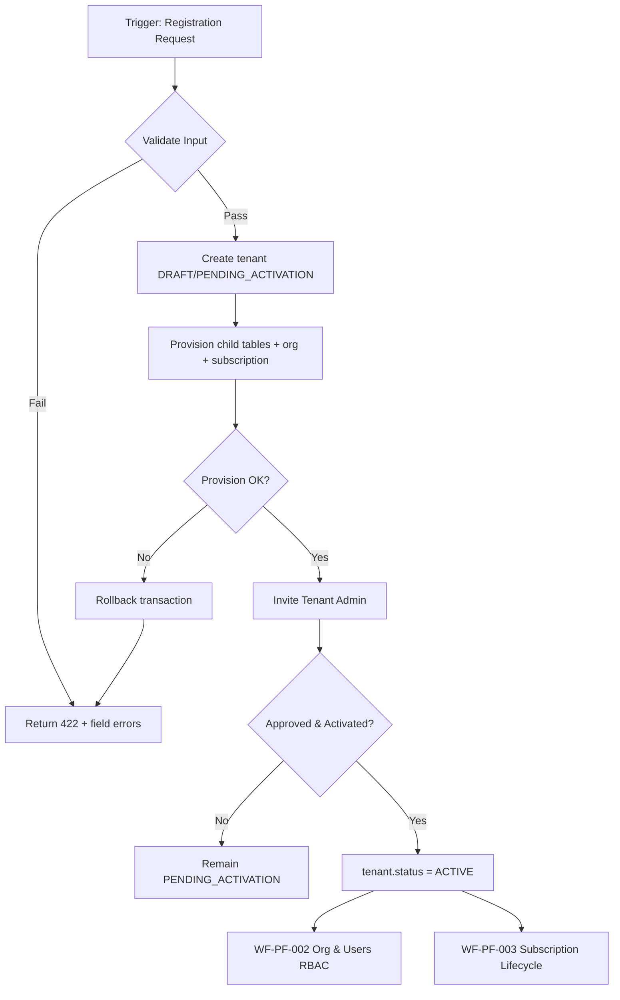

---

#### 3.1.10 State Machine

| State Category | State Codes | Description |
|----------------|-------------|-------------|
| **Initial** | `DRAFT` | Registration wizard in progress; no users provisioned |
| **Intermediate** | `PENDING_ACTIVATION`, `TRIAL`, `SUSPENDED`, `OFFBOARDING` | Awaiting activation, trial period, access blocked, or retention countdown |
| **Terminal** | `ACTIVE`, `CLOSED` | Operational tenant or permanently terminated |
| **Cancelled** | `CANCELLED` | Registration abandoned before go-live |
| **Archived** | `ARCHIVED` | Historical record; platform read-only view |

**Allowed Transitions**

| From | To | Actor | Condition |
|------|----|-------|-----------|
| `DRAFT` | `PENDING_ACTIVATION` | Platform Admin | All mandatory fields valid |
| `DRAFT` | `CANCELLED` | Platform Admin | Abandon registration |
| `PENDING_ACTIVATION` | `ACTIVE` | Tenant Admin + System | Activation token consumed; password policy met |
| `PENDING_ACTIVATION` | `CANCELLED` | Platform Admin | Pre-activation cancel |
| `ACTIVE` | `SUSPENDED` | Platform Admin | Policy violation / non-payment flag |
| `ACTIVE` | `OFFBOARDING` | Platform Admin | Offboarding initiated |
| `SUSPENDED` | `ACTIVE` | Platform Admin | Issue resolved |
| `SUSPENDED` | `OFFBOARDING` | Platform Admin | Proceed to close |
| `OFFBOARDING` | `CLOSED` | Platform Admin / System | Retention period elapsed |
| `CLOSED` | `ARCHIVED` | System | Archive job (90 days post-close) |
| `TRIAL` | `ACTIVE` | Platform Admin | Subscription converted (WF-PF-003) |

**Invalid Transitions**

| From | To | Reason |
|------|----|--------|
| `CLOSED` | `ACTIVE` | Requires new tenant registration |
| `ARCHIVED` | any | Immutable |
| `CANCELLED` | `ACTIVE` | Must re-register |
| `SUSPENDED` | `DRAFT` | Not reversible to draft |

**Rollback Rules**

| Scenario | Rollback Action |
|----------|-----------------|
| Provision failure mid-transaction | Full DB transaction rollback; no partial tenant |
| Activation email failure | Tenant remains `PENDING_ACTIVATION`; retry notification (max 3) |
| Approval rejected | Status → `CANCELLED`; soft-delete draft rows after 30 days |
| Suspend → Reactivate | No data rollback; JWT re-issued on login |

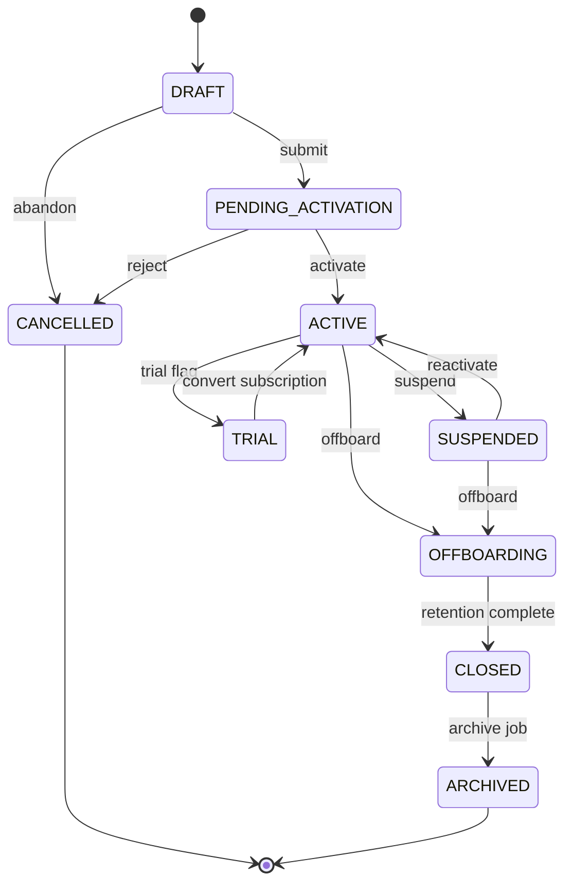

---

#### 3.1.11 Ownership Matrix

| RACI Role | Actor | Responsibility |
|-----------|-------|----------------|
| **Owner** | Platform Admin (Provisioning) | End-to-end tenant lifecycle accountability |
| **Reviewer** | Sales Manager | Validates commercial terms before registration |
| **Approver** | Platform Admin | Approves `PENDING_ACTIVATION` → `ACTIVE` |
| **Executor** | System — Provisioning Engine | Creates tenant shell, child tables, subscription, org |
| **Watcher** | Tenant Admin (designate) | Monitors activation email; completes setup |
| **Notification Recipients** | Platform Admin, Tenant Admin designate, Sales Manager (on create) | Per notification matrix § 3.1.17 |
| **Escalation Owner** | Head of Platform Operations | Unresolved provisioning failures > 4 hours |

---

#### 3.1.12 Exception Handling

| Exception Type | Detection | System Response | User Action | Recovery |
|----------------|-----------|-----------------|-------------|----------|
| **Rejected** | Platform Admin rejects registration | Status → `CANCELLED`; NTF-PF-002-01 variant | Sales Manager notified with reason | Re-submit new registration |
| **Expired** | Activation token > 72 h | Invite `EXPIRED`; tenant stays `PENDING_ACTIVATION` | Platform Admin re-sends activation | `POST /tenants/{id}/resend-activation` |
| **Cancelled** | Admin abandons draft | `CANCELLED`; cleanup job scheduled | — | None |
| **Duplicate** | Duplicate `code` or `legal_name` (BR-PF-001, BR-PF-002) | HTTP 409; no DB write | Correct input | Retry with unique values |
| **Rollback** | DB constraint / provision error | Transaction rolled back; error logged | Platform Admin reviews logs | Retry provision |
| **Retry** | Notification delivery failure | Exponential backoff: 1m, 5m, 15m | — | Auto-retry max 3 |
| **Re-open** | `SUSPENDED` → `ACTIVE` | JWT invalidation reversed; access restored | Platform Admin documents reason | `POST /tenants/{id}/reactivate` |
| **Escalation** | Provision SLA breach > 4 h | Alert to Escalation Owner | Manual intervention | CPS-003 escalation template |
| **Business Exception** | DEPRECATED edition selected | HTTP 422 BR-PF-005 (BFS) / BR-PF-013 | Select ACTIVE edition | Choose valid edition |
| **System Exception** | PostgreSQL connection / Docker service down | HTTP 503; idempotency key preserved | DevOps alert | Retry with same `Idempotency-Key` header |

---

#### 3.1.13 Workflow Timing

| Timing Parameter | Value | Notes |
|------------------|-------|-------|
| **Expected Processing Time** | 2–5 minutes (automated provision) | Excludes human approval wait |
| **Max SLA** | 24 hours (registration → ACTIVE) | Business hours; Platform Admin approval |
| **Escalation Time** | 4 hours | Pending activation without admin action |
| **Reminder Frequency** | Activation reminder: 24 h, 48 h, 72 h | To Tenant Admin designate |
| **Auto Close Policy** | `DRAFT` auto-cancel after 7 days inactivity; `PENDING_ACTIVATION` escalate at 72 h | Scheduler job `JOB-PF-002-01` |

---

#### 3.1.14 Database Impact

| Impact Category | Tables | Operation | Notes |
|-----------------|--------|-----------|-------|
| **Master** | `tenant`, `tenant_contact`, `tenant_address`, `tenant_branding`, `tenant_settings`, `tenant_security`, `tenant_localization`, `edition`, `organization` | INSERT on provision; UPDATE on profile edit | `tenant` is root; not tenant-scoped |
| **Transaction** | `subscription` (initial TRIAL row), `user_invite` | INSERT | Links via `tenant.current_subscription_id` |
| **Audit** | `audit_event` | INSERT | `tenant.created`, `tenant.status_changed`, `tenant.approved` |
| **Attachments** | `document_attachment` (via CPS-006) | INSERT optional | Logo upload on branding step |
| **History** | `tenant_status_history` | INSERT on every status change | old_status, new_status, reason, actor_id |

**Transactional Boundary:** Single PostgreSQL transaction for steps: `tenant` → all child profile tables → `organization` → `subscription` → `users` (INVITED). Commit only on full success.

---

#### 3.1.15 API Mapping

| HTTP Method | Path | Purpose | Permission | Idempotent |
|-------------|------|---------|------------|------------|
| **POST** | `/api/v1/platform/tenants` | Register tenant (provision) | `tenant.create` | Yes (`Idempotency-Key`) |
| **GET** | `/api/v1/platform/tenants` | List tenants (paginated) | `tenant.read` | — |
| **GET** | `/api/v1/platform/tenants/{id}` | Tenant detail + children | `tenant.read` | — |
| **PUT** | `/api/v1/platform/tenants/{id}` | Full profile update | `tenant.update` | — |
| **PATCH** | `/api/v1/platform/tenants/{id}` | Partial update | `tenant.update` | — |
| **PATCH** | `/api/v1/platform/tenants/{id}/status` | Status transition | `tenant.approve` / `tenant.suspend` | — |
| **DELETE** | `/api/v1/platform/tenants/{id}` | Soft close / archive | `tenant.delete` | — |
| **GET** | `/api/v1/platform/tenants/search` | Search by code, name, status, edition | `tenant.read` | — |
| **GET** | `/api/v1/platform/tenants/export` | Export XLSX/CSV | `tenant.export` | — |
| **POST** | `/api/v1/platform/tenants/bulk-import` | Bulk tenant import | `tenant.create` | Yes |
| **PATCH** | `/api/v1/platform/tenants/bulk-update` | Bulk status update | `tenant.update` | — |
| **POST** | `/api/v1/platform/tenants/{id}/approve` | Approve registration | `tenant.approve` | — |
| **POST** | `/api/v1/platform/tenants/{id}/suspend` | Suspend tenant | `tenant.suspend` | — |
| **POST** | `/api/v1/platform/tenants/{id}/reactivate` | Reactivate tenant | `tenant.reactivate` | — |
| **POST** | `/api/v1/platform/tenants/{id}/resend-activation` | Resend activation email | `tenant.approve` | Rate-limited |
| **GET** | `/api/v1/tenant/profile` | Current tenant profile (JWT scope) | `tenant.read` | — |
| **PUT** | `/api/v1/tenant/profile` | Update own tenant profile | `tenant.update` | — |

---

#### 3.1.16 Flutter Mapping

| Screen Type | Route / Widget | Actor | Key Actions | State Binding |
|-------------|----------------|-------|-------------|---------------|
| **List** | `/platform/tenants` → `TenantListScreen` | Platform Admin | Filter by status/edition; bulk actions | `TenantListProvider` |
| **Create** | `/platform/tenants/register` → `TenantRegisterWizard` | Platform Admin | 5-step wizard: identity, contacts, address, edition, review | `TenantRegisterNotifier` |
| **Edit** | `/platform/tenants/{id}/edit` → `TenantEditScreen` | Platform Admin, Tenant Admin | Tabbed edit: profile, contacts, addresses | `TenantEditProvider` |
| **Details** | `/platform/tenants/{id}` → `TenantViewScreen` | Platform Admin, Tenant Admin | Summary cards, status badge, subscription link | `TenantDetailProvider` |
| **Approval** | `/platform/tenants/{id}/approve` → `TenantApprovalScreen` | Platform Admin | Approve / reject with reason | Workflow action API |
| **History** | `/platform/tenants/{id}/history` → `TenantHistoryScreen` | Platform Admin | Status timeline, audit events | `AuditTimelineWidget` |
| **Attachments** | Branding tab → logo upload | Tenant Admin | Logo/favicon upload (max 2 MB) | `DocumentUploadWidget` |
| **Timeline** | Embedded in Details/History | Platform Admin | Provisioning milestones | CPS-005 feed |

---

#### 3.1.17 Notification Matrix

| Trigger Event | Email | SMS | WhatsApp | Push | Internal | Recipients | Template Key |
|---------------|:-----:|:---:|:--------:|:----:|:--------:|------------|--------------|
| Tenant registered | ✓ | — | — | — | ✓ | Platform Admin | NTF-PF-002-01 |
| Tenant approved | ✓ | ✓ | — | — | — | Tenant Admin designate | NTF-PF-002-02 |
| Tenant activated | ✓ | — | — | ✓ | — | Tenant Admin | NTF-PF-002-03 |
| Activation reminder (24/48/72 h) | ✓ | ✓ | — | — | — | Tenant Admin designate | NTF-PF-002-02-R |
| Tenant suspended | ✓ | ✓ | — | ✓ | ✓ | All Tenant Admins | NTF-PF-002-04 |
| Tenant reactivated | ✓ | — | — | ✓ | — | All Tenant Admins | NTF-PF-002-05 |
| Tenant closing / offboarding | ✓ | — | — | — | ✓ | Tenant Admin, Platform Admin | NTF-PF-002-06 |
| Provision failure | — | — | — | — | ✓ | Platform Admin, DevOps | NTF-PF-002-07 |
| Trial expiring (via subscription) | ✓ | — | — | ✓ | — | Tenant Admin | NTF-PF-003-02 |

---

#### 3.1.18 Reporting Impact

| Report Category | Report ID | Name | Audience | KPIs / Metrics |
|-----------------|-----------|------|----------|----------------|
| **Operational** | RPT-PF-002-01 | Tenant Directory | Platform Admin | Count by status, edition |
| **Operational** | RPT-PF-002-03 | Suspended Tenants | Platform Admin | Suspension reason, duration |
| **MIS** | RPT-PF-002-02 | Tenant Onboarding Pipeline | Sales Manager | Avg days DRAFT → ACTIVE, stage funnel |
| **Executive** | RPT-PF-002-04 | Tenant Growth Dashboard | Leadership | New tenants/month, edition mix, churn |
| **Charts** | CHART-PF-002-01 | Onboarding Funnel | Sales Manager | DRAFT → PENDING → ACTIVE conversion |
| **Analytics** | ANA-PF-002-01 | Time-to-Activate | Platform Admin | P50/P95 activation duration |

---

#### 3.1.19 Security

| Security Control | Implementation |
|------------------|----------------|
| **RBAC** | All `/api/v1/platform/tenants/*` require Platform Admin role or explicit `tenant.*` permissions; tenant-scoped endpoints use JWT `tenant_id` |
| **Approval** | `PENDING_ACTIVATION` → `ACTIVE` requires `tenant.approve`; dual-control optional (v2) |
| **Permissions** | See § 3.1.8; enforced server-side via FastAPI dependency `require_permission()` |
| **Tenant Isolation** | BR-PF-008: middleware injects `tenant_id` from JWT; row-level filter on all queries; `tenant_id` in body rejected if mismatched (BR-PF-016) |
| **Audit** | All mutations emit `audit_event`; sensitive field changes diff-logged |
| **Sensitive Fields** | `tax_id`, `registration_number`, primary contact email/phone — masked in list views; encrypted at rest (AES-256) |
| **Auth** | Platform Admin: JWT (15 min) + refresh (7 d); activation token: single-use, 72 h, signed HS256 |
| **Transport** | TLS 1.2+; HSTS on Azure/VPS reverse proxy |

---

#### 3.1.20 Audit Trail

| Event | Actor | Captured Data | Retention |
|-------|-------|---------------|-----------|
| **Create** | Platform Admin / System | tenant_id, code, legal_name, edition_id, provision_source | Per tenant security policy (90 d – 7 yr) |
| **Update** | Platform Admin, Tenant Admin | Field-level diff (JSON patch) | Per policy |
| **Delete** | Platform Admin | Soft delete flag, reason | Permanent |
| **Approve** | Platform Admin | old_status, new_status, approval_notes | Permanent |
| **Reject** | Platform Admin | rejection_reason | Permanent |
| **Export** | Platform Admin | export_format, row_count, filter_criteria | 1 year |
| **Print** | Platform Admin | report_id, timestamp | 1 year |
| **Login** | Tenant Admin (post-activation) | IP, device, user_agent | Per policy |

---

#### 3.1.21 Acceptance Criteria

| Category | ID | Criterion |
|----------|-----|-----------|
| **Functional** | AC-WF-PF-001-F01 | Given valid registration for tenant **Euphoria**, when approved and activated, then all child tables exist and Tenant Admin can log in |
| **Functional** | AC-WF-PF-001-F02 | Given duplicate tenant `code`, when POST `/platform/tenants`, then HTTP 409 (BR-PF-001) |
| **Functional** | AC-WF-PF-001-F03 | Given duplicate `legal_name`, when POST, then HTTP 409 (BR-PF-002) |
| **Functional** | AC-WF-PF-001-F04 | Given provision completes, when queried, then exactly one root `organization` and one TRIAL `subscription` exist (BR-PF-004) |
| **Functional** | AC-WF-PF-001-F05 | Given SUSPENDED tenant, when user login attempted, then auth fails (BR-PF-006) |
| **Technical** | AC-WF-PF-001-T01 | Provision is atomic — simulated failure on step 4 rolls back all prior inserts |
| **Technical** | AC-WF-PF-001-T02 | Idempotent POST with same `Idempotency-Key` returns same tenant_id |
| **Performance** | AC-WF-PF-001-P01 | Provision completes within 5 s at P95 under 50 concurrent registrations |
| **Security** | AC-WF-PF-001-S01 | Tenant Admin of Euphoria cannot GET another tenant's profile (tenant isolation) |
| **Security** | AC-WF-PF-001-S02 | All provision steps write `audit_event` rows |

---

#### 3.1.22 Future Enhancement

| Version | Enhancement | Description |
|---------|-------------|-------------|
| **v2** | Self-registration portal | Professional+ tenants register via public form with email domain verification (BR-PF-018) |
| **v2** | Custom domain mapping | `crm.euphoria.co.in` CNAME to tenant instance |
| **v2** | GDPR data export | Full tenant data portability package on OFFBOARDING |
| **v3** | Multi-region residency | Tenant selects data region at registration (EU, IN, US) |
| **v3** | Parent-child tenant hierarchy | Conglomerate structure with shared billing |
| **AI** | Onboarding assistant | AI-guided wizard pre-fills from company website / GSTIN lookup |
| **Automation** | Deal-to-tenant pipeline | Salesforce/CRM deal closure auto-triggers WF-PF-001 via INT-001 |
---


---

#### V1.0 Enterprise Ready Pack — WF-PF-001

## WF-PF-001 — Tenant Registration & Activation

**Domain:** Platform Foundation · **Module:** PF-002 Tenant Management · **Tenant:** Euphoria

### V1.0 — Requirement IDs

| Requirement ID | Description | Priority | Related BR |
|----------------|-------------|----------|------------|
| REQ-PF-001 | Register a new tenant with unique `code` and `legal_name` via Platform Admin wizard | Critical | BR-PF-001, BR-PF-002 |
| REQ-PF-002 | Provision tenant shell atomically: profile tables, root organisation, TRIAL subscription | Critical | BR-PF-004, BR-PF-008 |
| REQ-PF-003 | Assign ACTIVE edition at registration; reject DEPRECATED editions | High | BR-PF-003, BR-PF-013 |
| REQ-PF-004 | Invite designated Tenant Admin with activation token (72 h expiry) | Critical | BR-PF-005 |
| REQ-PF-005 | Transition tenant `PENDING_ACTIVATION` → `ACTIVE` upon activation token consumption | Critical | BR-PF-006 |
| REQ-PF-006 | Suspend and reactivate tenant; block login when SUSPENDED | Critical | BR-PF-006, BR-PF-007 |
| REQ-PF-007 | Offboard tenant through OFFBOARDING → CLOSED → ARCHIVED lifecycle | High | BR-PF-005 |
| REQ-PF-008 | Enforce idempotent tenant registration via `Idempotency-Key` header | High | BR-PF-008 |
| REQ-PF-009 | Maintain tenant status history with actor, reason, and timestamp | Medium | BR-PF-009 |
| REQ-PF-010 | Export tenant directory to CSV/XLSX for Platform Admin reporting | Medium | BR-PF-010 |
| REQ-PF-011 | Resend activation email when token expires; tenant remains PENDING_ACTIVATION | High | BR-PF-011 |
| REQ-PF-012 | Soft-close tenant; no hard delete of tenant master data | High | BR-PF-005 |

### V1.0 — Requirements Traceability Matrix (RTM)

| Requirement | Workflow | Table | API | Flutter Screen | Test Case |
|-------------|----------|-------|-----|----------------|-----------|
| REQ-PF-001 | WF-PF-001 | `tenant` | `POST /api/v1/platform/tenants` | `TenantRegisterWizard` | TC-PF-001-01 |
| REQ-PF-002 | WF-PF-001 | `tenant`, `organization`, `subscription` | `POST /api/v1/platform/tenants` | `TenantRegisterWizard` | TC-PF-001-02 |
| REQ-PF-003 | WF-PF-001 | `edition` | `POST /api/v1/platform/tenants` | `TenantRegisterWizard` (edition step) | TC-PF-001-03 |
| REQ-PF-004 | WF-PF-001 | `users`, `user_invite` | `POST /api/v1/platform/tenants` | `TenantRegisterWizard` (review step) | TC-PF-001-04 |
| REQ-PF-005 | WF-PF-001 | `tenant`, `tenant_status_history` | `POST /api/v1/platform/tenants/{id}/approve` | `TenantApprovalScreen` | TC-PF-001-05 |
| REQ-PF-006 | WF-PF-001 | `tenant` | `POST /api/v1/platform/tenants/{id}/suspend`, `/reactivate` | `TenantViewScreen` | TC-PF-001-06 |
| REQ-PF-007 | WF-PF-001 | `tenant`, `tenant_status_history` | `PATCH /api/v1/platform/tenants/{id}/status` | `TenantViewScreen` | TC-PF-001-07 |
| REQ-PF-008 | WF-PF-001 | `tenant` | `POST /api/v1/platform/tenants` | `TenantRegisterWizard` | TC-PF-001-08 |
| REQ-PF-009 | WF-PF-001 | `tenant_status_history`, `audit_event` | `GET /api/v1/platform/tenants/{id}` | `TenantHistoryScreen` | TC-PF-001-09 |
| REQ-PF-010 | WF-PF-001 | `tenant` | `GET /api/v1/platform/tenants/export` | `TenantListScreen` | TC-PF-001-10 |
| REQ-PF-011 | WF-PF-001 | `user_invite` | `POST /api/v1/platform/tenants/{id}/resend-activation` | `TenantViewScreen` | TC-PF-001-11 |
| REQ-PF-012 | WF-PF-001 | `tenant` | `DELETE /api/v1/platform/tenants/{id}` | `TenantViewScreen` | TC-PF-001-12 |

### V1.0 — State Transition Diagram

```
                    ┌─────────┐
                    │  DRAFT  │
                    └────┬────┘
           abandon       │ submit
              ┌──────────┼──────────┐
              ▼          ▼          │
        ┌──────────┐  ┌─────────────────────┐
        │CANCELLED │  │ PENDING_ACTIVATION  │
        └──────────┘  └──────────┬──────────┘
                                 │ activate
                    ┌────────────┼────────────┐
                    ▼            ▼            ▼
              ┌─────────┐  ┌─────────┐  ┌────────────┐
              │  TRIAL  │  │ ACTIVE  │  │ SUSPENDED  │
              └────┬────┘  └────┬────┘  └─────┬──────┘
                   │ convert    │ offboard    │ reactivate
                   └──────►ACTIVE│      ▼      └──────►ACTIVE
                                 │ OFFBOARDING │
                                 └──────┬──────┘
                                        ▼
                                   ┌────────┐
                                   │ CLOSED │
                                   └────┬───┘
                                        ▼
                                   ┌──────────┐
                                   │ ARCHIVED │
                                   └──────────┘
```

**Allowed Transitions**

| From | To | Actor | Guard |
|------|-----|-------|-------|
| DRAFT | PENDING_ACTIVATION | Platform Admin | All mandatory fields valid |
| DRAFT | CANCELLED | Platform Admin | Abandon registration |
| PENDING_ACTIVATION | ACTIVE | Tenant Admin + System | Activation token + password policy |
| PENDING_ACTIVATION | CANCELLED | Platform Admin | Pre-activation reject |
| ACTIVE | SUSPENDED | Platform Admin | Policy violation / non-payment |
| ACTIVE | OFFBOARDING | Platform Admin | Offboarding initiated |
| ACTIVE | TRIAL | Platform Admin | Trial flag applied |
| TRIAL | ACTIVE | Platform Admin | Subscription converted (WF-PF-003) |
| SUSPENDED | ACTIVE | Platform Admin | Issue resolved |
| SUSPENDED | OFFBOARDING | Platform Admin | Proceed to close |
| OFFBOARDING | CLOSED | Platform Admin / System | Retention period elapsed |
| CLOSED | ARCHIVED | System | Archive job (90 days post-close) |

**Invalid Transitions**

| From | To | Reason |
|------|-----|--------|
| CLOSED | ACTIVE | Requires new tenant registration |
| ARCHIVED | any | Immutable historical record |
| CANCELLED | ACTIVE | Must re-register |
| SUSPENDED | DRAFT | Not reversible to draft |

**Re-open Rules**

| Scenario | Allowed | Condition |
|----------|---------|-----------|
| SUSPENDED → ACTIVE | Yes | Platform Admin documents reason; JWT re-issued on login |
| CLOSED → ACTIVE | No | New tenant registration required |
| CANCELLED → ACTIVE | No | Re-submit registration |

**Rollback Rules**

| Scenario | Rollback Action |
|----------|-----------------|
| Provision failure mid-transaction | Full DB transaction rollback; no partial tenant |
| Activation email failure | Tenant remains PENDING_ACTIVATION; retry notification (max 3) |
| Approval rejected | Status → CANCELLED; soft-delete draft rows after 30 days |
| Suspend → Reactivate | No data rollback; access restored |


### V1.0 — CRUD Responsibility Matrix

| Role | Create | Read | Update | Approve | Delete |
|------|:------:|:----:|:------:|:-------:|:------:|
| Platform Admin | ✔ | ✔ | ✔ | ✔ | ✔ |
| Tenant Admin | ✘ | ✔ (own tenant) | ✔ (own profile) | ✘ | ✘ |
| Sales Manager | ✘ | ✔ (pipeline view) | ✘ | ✘ | ✘ |
| Sales Executive | ✘ | ✘ | ✘ | ✘ | ✘ |
| Finance User | ✘ | ✘ | ✘ | ✘ | ✘ |
| Pre-Sales | ✘ | ✘ | ✘ | ✘ | ✘ |
| Support Agent | ✘ | ✘ | ✘ | ✘ | ✘ |

### V1.0 — Non-Functional Requirements

| NFR ID | Category | Requirement | Target |
|--------|----------|-------------|--------|
| NFR-PF-001 | Performance | Tenant provision completes end-to-end | P95 < 5 s under 50 concurrent registrations |
| NFR-PF-002 | Performance | Tenant list API (paginated 50 rows) | P95 < 800 ms |
| NFR-PF-003 | Security | All `/api/v1/platform/tenants/*` require Platform Admin or explicit `tenant.*` permission | 100% server-side enforcement |
| NFR-PF-004 | Security | Activation token single-use, 72 h expiry, HS256 signed | Zero reuse tolerance |
| NFR-PF-005 | Security | Tenant Admin of Euphoria cannot access another tenant's profile | Cross-tenant returns 404 |
| NFR-PF-006 | Audit | All provision, status, approve, suspend mutations write `audit_event` | 100% mutation coverage |
| NFR-PF-007 | Audit | Field-level diff on profile updates | JSON patch in audit payload |
| NFR-PF-008 | Scalability | Support 500 active tenants on single VPS tier without provision degradation | P95 provision < 8 s |
| NFR-PF-009 | Availability | Tenant registration API availability | 99.5% monthly uptime |
| NFR-PF-010 | Availability | Idempotent retry on 503 preserves same `tenant_id` | Idempotency-Key honoured |
| NFR-PF-011 | Data Retention | `audit_event` for tenant lifecycle | 7 years (configurable per tenant security policy) |
| NFR-PF-012 | Data Retention | DRAFT auto-cancel after 7 days inactivity | Scheduler JOB-PF-002-01 |

### V1.0 — UI Navigation

```
[Platform Admin Login]
        │
        ▼
┌───────────────────┐
│ TenantListScreen  │  /platform/tenants
│  Filter · Export  │
└─────────┬─────────┘
          │ [+ Register]
          ▼
┌───────────────────────┐
│ TenantRegisterWizard  │  /platform/tenants/register
│  Step 1: Identity     │
│  Step 2: Contacts     │
│  Step 3: Address      │
│  Step 4: Edition      │
│  Step 5: Review       │
└─────────┬─────────────┘
          │ submit
          ▼
┌───────────────────┐     ┌─────────────────────┐
│ TenantViewScreen  │────►│ TenantApprovalScreen │  /platform/tenants/{id}/approve
│  Status badge     │     │  Approve / Reject    │
│  Subscription link│     └─────────────────────┘
└─────────┬─────────┘
          ├──► TenantEditScreen        /platform/tenants/{id}/edit
          ├──► TenantBrandingScreen    (branding tab)
          ├──► TenantSecuritySettings  (security tab)
          ├──► TenantLocalizationScreen
          └──► TenantHistoryScreen     /platform/tenants/{id}/history
```

### V1.0 — API Contract Summary

| Method | Endpoint | Purpose |
|--------|----------|---------|
| POST | `/api/v1/platform/tenants` | Register tenant (atomic provision) |
| GET | `/api/v1/platform/tenants` | List tenants (paginated, filterable) |
| GET | `/api/v1/platform/tenants/{id}` | Tenant detail with child profile |
| PUT | `/api/v1/platform/tenants/{id}` | Full profile update |
| PATCH | `/api/v1/platform/tenants/{id}` | Partial profile update |
| PATCH | `/api/v1/platform/tenants/{id}/status` | Status transition |
| DELETE | `/api/v1/platform/tenants/{id}` | Soft close / archive |
| GET | `/api/v1/platform/tenants/search` | Search by code, name, status, edition |
| GET | `/api/v1/platform/tenants/export` | Export CSV/XLSX |
| POST | `/api/v1/platform/tenants/bulk-import` | Bulk tenant import |
| PATCH | `/api/v1/platform/tenants/bulk-update` | Bulk status update |
| POST | `/api/v1/platform/tenants/{id}/approve` | Approve registration |
| POST | `/api/v1/platform/tenants/{id}/suspend` | Suspend tenant |
| POST | `/api/v1/platform/tenants/{id}/reactivate` | Reactivate tenant |
| POST | `/api/v1/platform/tenants/{id}/resend-activation` | Resend activation email |
| GET | `/api/v1/tenant/profile` | Current tenant profile (JWT scope) |
| PUT | `/api/v1/tenant/profile` | Update own tenant profile |

### 3.2 WF-PF-002 — Organisation, Users & RBAC Setup

| Attribute | Detail |
|-----------|--------|
| **Modules** | PF-004 Organization, PF-005 Branch, PF-006 Department, PF-007 Business Unit, PF-008 Users, PF-009 RBAC |
| **Actors** | Tenant Admin, System |

#### 3.2.1 Process Flow

```text
Tenant Activated
   │
   ▼
Define Org Hierarchy
  Head Office → Branch → Department / Business Unit
   │
   ▼
Create Users (invite / register)
   │
   ▼
Assign Roles & Permissions
   │
   ▼
Apply Security Policy (password, MFA, session, lockout)
   │
   ▼
Users Login (JWT auth)
   │
   ▼
[Ready for CRM Operations]
```

#### 3.2.2 Key Rules

- User email unique per tenancy policy  
- Every user belongs to one tenant and one organisation unit  
- Permissions are role-based; no direct module access without RBAC grant  
- Soft delete only for users; historical ownership retained  


---

#### EFS Enrichment — WF-PF-002

#### 3.2.3 Workflow Traceability

| Traceability Element | Value |
|----------------------|-------|
| **Workflow ID** | WF-PF-002 |
| **Workflow Name** | Organisation, Users & RBAC Setup |
| **Domain** | PF — Platform Foundation |
| **Module** | PF-004 (Organization), PF-005 (Branch), PF-006 (Department), PF-007 (Business Unit), PF-008 (Users), PF-009 (RBAC) |
| **Sub Module** | PF-004-001, PF-005-001, PF-006-001, PF-007-001, PF-008-001, PF-009-001 |
| **Business Process** | Post-activation structural setup — define org hierarchy, invite users, assign roles/permissions, enforce security policy, enable CRM operations |
| **Priority** | P0 · Critical · Phase 1 · Release R1.0 |
| **Related Modules** | PF-002 (Tenant), PF-003 (Subscription), PF-010 (Audit), PF-011 (Configuration), CPS-001, CPS-003, CPS-005 |
| **Dependent Workflows** | WF-PF-001 (tenant must be ACTIVE or TRIAL) |
| **Downstream Workflows** | WF-CRM-001 (Lead Capture), all domain workflows requiring authenticated users |
| **Related Documents** | ELU-BFS-PF §§ PF-004…009, ELU-SAD-001 § 5.3, ELU-DF-001 |
| **Related Database Tables** | `organization`, `branch`, `department`, `business_unit`, `users`, `user_credentials`, `user_session`, `user_invite`, `user_mfa`, `role`, `permission`, `role_permission`, `user_role`, `tenant_security`, `subscription` |
| **Related Flutter Screens** | `OrgHierarchyScreen`, `BranchListScreen`, `DepartmentListScreen`, `BusinessUnitListScreen`, `UserListScreen`, `UserInviteScreen`, `RoleListScreen`, `RolePermissionMatrixScreen`, `UserRoleAssignmentScreen`, `LoginScreen`, `MFASetupScreen` |
| **Related REST APIs** | `/api/v1/org/*`, `/api/v1/users/*`, `/api/v1/rbac/*`, `/api/v1/auth/*` |
| **Related Reports** | RPT-PF-004-01…04, RPT-PF-008-01…04, RPT-PF-009-01…04 |
| **Related Business Rules** | BR-PF-001…008 (tenant isolation, subscription limits), BR-PF-022 (seat limit), BR-PF-051…060 (users), BR-PF-061…068 (RBAC) |
| **Related Notifications** | NTF-PF-004-01…03, NTF-PF-008-01…08, NTF-PF-009-01…04 |
| **Related Roles** | Tenant Admin, Platform Admin, Sales Manager, Sales Executive, Finance User, Project Manager, Support Agent, Team Member |
| **Related Permissions** | `organization.*`, `branch.*`, `department.*`, `business_unit.*`, `user.*`, `role.*`, `permission.read`, `role.configure`, `role.assign` |

---

#### 3.2.4 Input / Output Definition

| Element | Specification |
|---------|---------------|
| **Input** | Active tenant (WF-PF-001); org hierarchy definition (branches, departments, BUs); user invite payloads (email, name, role_ids, branch_id, department_id); role-permission mappings; security policy configuration |
| **Trigger** | Tenant reaches `ACTIVE` status **or** Tenant Admin first login after activation |
| **Processing** | Seed system roles + permission catalogue → Tenant Admin defines org tree → invite users (seat check BR-PF-022) → assign roles (BR-PF-064) → apply `tenant_security` policy → users activate via invite → login issues JWT with `tenant_id`, `roles[]`, `permissions[]` → API middleware enforces RBAC |
| **Output** | Complete org hierarchy, ACTIVE users with role assignments, enforced security policy, JWT-authenticated sessions, tenant ready for CRM operations |
| **Next Workflow** | WF-CRM-001 Lead Capture & Qualification |

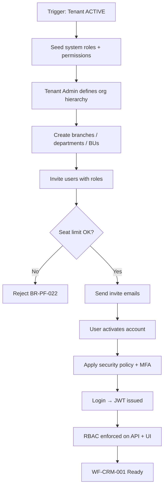

---

#### 3.2.5 State Machine

**Organisation Entity States**

| State Category | States | Notes |
|----------------|--------|-------|
| Initial | `DRAFT` (org auto-created at provision) | Root org from WF-PF-001 |
| Intermediate | `ACTIVE`, `INACTIVE` | Branches, departments, BUs |
| Terminal | `ACTIVE` (org) | Operational |
| Archived | `ARCHIVED` | Historical org units |

**User Account States**

| State Category | States |
|----------------|--------|
| Initial | `INVITED` |
| Intermediate | `ACTIVE`, `LOCKED` |
| Terminal | `INACTIVE` (deactivated) |
| Cancelled | `CANCELLED` (invite withdrawn) |
| Archived | `EXPIRED` (invite token expired) |

**Role States**

| State Category | States |
|----------------|--------|
| Initial | `ACTIVE` (system roles seeded) |
| Intermediate | `ACTIVE`, `INACTIVE` |
| Archived | `ARCHIVED` (custom roles only) |

**Allowed Transitions (User)**

| From | To | Actor | Condition |
|------|----|-------|-----------|
| `INVITED` | `ACTIVE` | User | Valid token + password policy |
| `INVITED` | `EXPIRED` | System | 72 h elapsed |
| `INVITED` | `CANCELLED` | Tenant Admin | Invite withdrawn |
| `ACTIVE` | `LOCKED` | System | 5 failed logins (BR-PF-055) |
| `ACTIVE` | `INACTIVE` | Tenant Admin | Deactivation |
| `LOCKED` | `ACTIVE` | System / Tenant Admin | 30 min elapsed or admin unlock |
| `INACTIVE` | `ACTIVE` | Tenant Admin | Re-activation |
| `EXPIRED` | `INVITED` | Tenant Admin | Re-invite |

**Rollback Rules**

| Scenario | Action |
|----------|--------|
| Invite cancelled | `user_invite` revoked; `users` row soft-deleted if never activated |
| Role assignment error | `user_role` row deleted; JWT refreshed on next login |
| Org unit delete blocked | BR-PF-044: cannot delete dept with users — reassign first |

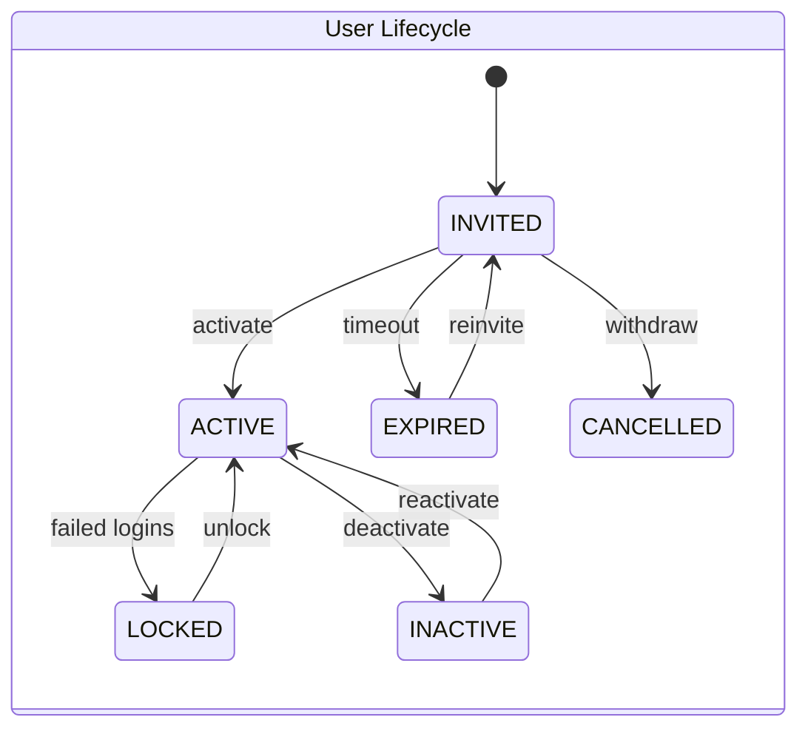

---

#### 3.2.6 Ownership Matrix

| RACI Role | Actor | Responsibility |
|-----------|-------|----------------|
| **Owner** | Tenant Admin | Org structure, user lifecycle, RBAC configuration |
| **Reviewer** | Platform Admin | Validates initial setup during onboarding window (first 14 days) |
| **Approver** | Tenant Admin | User invite approval (optional workflow v2); role permission changes |
| **Executor** | Tenant Admin, System (Provisioning, Auth Service) | Creates org units, invites users, seeds roles |
| **Watcher** | Sales Manager, Department Heads | Notified on new user assignments |
| **Notification Recipients** | Invited users, Tenant Admin, department heads | Per § 3.2.13 |
| **Escalation Owner** | Platform Admin | Seat limit disputes; RBAC lockout issues |

---

#### 3.2.7 Exception Handling

| Exception Type | Detection | System Response | Recovery |
|----------------|-----------|-----------------|----------|
| **Rejected** | Invalid email format / duplicate email (BR-PF-051) | HTTP 422/409 | Correct email |
| **Expired** | Invite token > 72 h (BR-PF-054) | Status `EXPIRED` | `POST /users/{id}/reinvite` |
| **Cancelled** | Tenant Admin withdraws invite | Status `CANCELLED` | New invite if needed |
| **Duplicate** | Email exists in tenant | HTTP 409 | Use different email or reactivate existing |
| **Rollback** | Role assignment fails mid-batch | Transaction rollback on `user_role` batch | Retry assignment |
| **Retry** | Invite email bounce | Mark `invite_delivery_failed`; alert Tenant Admin | Update email, reinvite |
| **Re-open** | `INACTIVE` → `ACTIVE` | Sessions cleared; new invite if credentials expired | Tenant Admin reactivates |
| **Escalation** | Seat limit exceeded (BR-PF-052) | HTTP 403 + upgrade prompt | Upgrade subscription (WF-PF-003) |
| **Business Exception** | Custom role limit exceeded (BR-PF-061) | HTTP 403 | Upgrade edition or delete unused role |
| **System Exception** | Auth service unavailable | HTTP 503; queued invite processing | Auto-retry via Celery |

---

#### 3.2.8 Workflow Timing

| Timing Parameter | Value | Notes |
|------------------|-------|-------|
| **Expected Processing Time** | 30–60 min (Tenant Admin manual setup) | Typical Euphoria onboarding |
| **Max SLA** | 5 business days | Tenant ACTIVE → first CRM user operational |
| **Escalation Time** | 48 h | No users invited after tenant activation |
| **Reminder Frequency** | Invite reminder: 24 h, 48 h before expiry | To invited user |
| **Auto Close Policy** | `INVITED` → `EXPIRED` at 72 h; `LOCKED` auto-unlock at 30 min | Scheduler `JOB-PF-008-01` |

---

#### 3.2.9 Database Impact

| Impact Category | Tables | Operation |
|-----------------|--------|-----------|
| **Master** | `organization`, `branch`, `department`, `business_unit`, `users`, `role`, `permission` | INSERT, UPDATE |
| **Transaction** | `user_invite`, `user_session`, `user_role`, `role_permission` | INSERT, UPDATE, DELETE |
| **Audit** | `audit_event`, `user_password_history` | INSERT |
| **Attachments** | `users.avatar_url` → `document_attachment` | INSERT optional |
| **History** | `role_permission` changes logged in `audit_event`; `user_role` effective dating (v2) | INSERT |

---

#### 3.2.10 API Mapping

| HTTP Method | Path | Purpose | Permission |
|-------------|------|---------|------------|
| **POST** | `/api/v1/org/organizations` | Create organisation | `organization.create` |
| **GET** | `/api/v1/org/organizations` | List organisations | `organization.read` |
| **PUT** | `/api/v1/org/organizations/{id}` | Update organisation | `organization.update` |
| **PATCH** | `/api/v1/org/organizations/{id}` | Partial update | `organization.update` |
| **DELETE** | `/api/v1/org/organizations/{id}` | Soft delete | `organization.delete` |
| **GET** | `/api/v1/org/organizations/search` | Search | `organization.read` |
| **GET** | `/api/v1/org/organizations/export` | Export | `organization.export` |
| **POST** | `/api/v1/org/branches` | Create branch | `branch.create` |
| **GET** | `/api/v1/org/branches` | List branches | `branch.read` |
| **PUT/PATCH/DELETE** | `/api/v1/org/branches/{id}` | Branch CRUD | `branch.*` |
| **GET** | `/api/v1/org/branches/search` | Search branches | `branch.read` |
| **POST** | `/api/v1/org/departments` | Create department | `department.create` |
| **GET** | `/api/v1/org/departments/hierarchy` | Department tree | `department.read` |
| **PUT/PATCH/DELETE** | `/api/v1/org/departments/{id}` | Department CRUD | `department.*` |
| **POST** | `/api/v1/org/business-units` | Create BU | `business_unit.create` |
| **GET** | `/api/v1/org/business-units` | List BUs | `business_unit.read` |
| **POST** | `/api/v1/users` | Invite user | `user.create` |
| **GET** | `/api/v1/users` | List users | `user.read` |
| **PUT/PATCH/DELETE** | `/api/v1/users/{id}` | User CRUD / deactivate | `user.*` |
| **GET** | `/api/v1/users/search` | Search users | `user.read` |
| **GET** | `/api/v1/users/export` | Export users | `user.export` |
| **POST** | `/api/v1/users/bulk-import` | Bulk user import | `user.create` |
| **PATCH** | `/api/v1/users/bulk-update` | Bulk status update | `user.update` |
| **POST** | `/api/v1/users/{id}/reinvite` | Resend invite | `user.create` |
| **POST** | `/api/v1/auth/login` | Login | Public |
| **POST** | `/api/v1/auth/refresh` | Refresh JWT | Refresh token |
| **POST** | `/api/v1/auth/register` | Activate invite | Public (token) |
| **POST** | `/api/v1/rbac/roles` | Create role | `role.create` |
| **GET** | `/api/v1/rbac/roles` | List roles | `role.read` |
| **PUT** | `/api/v1/rbac/roles/{id}/permissions` | Set permissions | `role.configure` |
| **POST** | `/api/v1/rbac/users/{user_id}/roles` | Assign role | `role.assign` |
| **DELETE** | `/api/v1/rbac/users/{user_id}/roles/{role_id}` | Remove role | `role.assign` |
| **GET** | `/api/v1/rbac/permissions` | Permission catalogue | `permission.read` |
| **GET** | `/api/v1/rbac/me/permissions` | Current user permissions | Authenticated |

---

#### 3.2.11 Flutter Mapping

| Screen Type | Route / Widget | Actor | Key Actions |
|-------------|----------------|-------|-------------|
| **List** | `/org/hierarchy` → `OrgHierarchyScreen` | Tenant Admin | Tree view: org → branch → dept |
| **List** | `/users` → `UserListScreen` | Tenant Admin | Filter status, role, branch |
| **List** | `/rbac/roles` → `RoleListScreen` | Tenant Admin | System vs custom filter |
| **Create** | `/users/invite` → `UserInviteScreen` | Tenant Admin | Email, role, branch, dept |
| **Create** | `/rbac/roles/create` → `RoleCreateScreen` | Tenant Admin | Clone from template |
| **Edit** | `/rbac/roles/{id}/permissions` → `RolePermissionMatrixScreen` | Tenant Admin | Checkbox grid |
| **Edit** | `/users/{id}/edit` → `UserEditScreen` | Tenant Admin | Profile, org assignment |
| **Details** | `/users/{id}` → `UserViewScreen` | Tenant Admin, Self | Profile, roles, sessions |
| **Approval** | Role permission change confirmation dialog | Tenant Admin | Confirm privilege elevation |
| **History** | `/users/{id}/history` → `UserHistoryScreen` | Tenant Admin | Login audit, changes |
| **Attachments** | Avatar upload on profile | All users | Profile photo |
| **Timeline** | `/org/timeline` → org change feed | Tenant Admin | Structure changes |

---

#### 3.2.12 Notification Matrix

| Trigger Event | Email | SMS | WhatsApp | Push | Internal | Recipients | Template |
|---------------|:-----:|:---:|:--------:|:----:|:--------:|------------|----------|
| User invited | ✓ | — | — | — | — | Invited user | NTF-PF-008-01 |
| Account activated | ✓ | — | — | ✓ | ✓ | User, Tenant Admin | NTF-PF-008-02 |
| Invite reminder (24 h) | ✓ | — | — | — | — | Invited user | NTF-PF-008-01-R |
| Password reset requested | ✓ | — | — | — | — | User | NTF-PF-008-03 |
| Account locked | ✓ | ✓ | — | — | ✓ | User, Tenant Admin | NTF-PF-008-05 |
| User deactivated | ✓ | — | — | — | ✓ | User, Tenant Admin | NTF-PF-008-06 |
| MFA enrolled | ✓ | — | — | — | — | User | NTF-PF-008-07 |
| Role assigned | ✓ | — | — | — | ✓ | User, Tenant Admin | NTF-PF-009-01 |
| Role permissions changed | — | — | — | — | ✓ | Affected users | NTF-PF-009-02 |
| Department head assigned | ✓ | — | — | ✓ | — | New head | NTF-PF-006-02 |
| Seat limit approaching (90%) | ✓ | — | — | — | ✓ | Tenant Admin | NTF-PF-003-07 |
| New login unknown device | ✓ | — | — | ✓ | — | User | NTF-PF-008-08 |

---

#### 3.2.13 Reporting Impact

| Report Category | Report ID | Name | Audience |
|-----------------|-----------|------|----------|
| **Operational** | RPT-PF-008-01 | User Directory | Tenant Admin |
| **Operational** | RPT-PF-009-01 | Role-Permission Matrix | Tenant Admin |
| **Operational** | RPT-PF-009-02 | User-Role Assignment | Tenant Admin |
| **MIS** | RPT-PF-008-03 | Seat Utilisation | Tenant Admin |
| **MIS** | RPT-PF-006-02 | Headcount by Department | Tenant Admin |
| **Executive** | RPT-PF-008-04 | Inactive Users (30+ days) | Tenant Admin |
| **Compliance** | RPT-PF-009-04 | Segregation of Duties Violations | Tenant Admin |
| **Charts** | CHART-PF-008-01 | Users by Role (pie) | Tenant Admin |
| **Analytics** | ANA-PF-008-01 | Onboarding funnel (invited → active) | Platform Admin |

---

#### 3.2.14 Security

| Security Control | Implementation |
|------------------|----------------|
| **RBAC** | Server-side `require_permission()` on every mutating endpoint; Flutter `PermissionGate` widget hides unauthorized UI |
| **Approval** | Privilege elevation (admin permissions) requires Tenant Admin confirmation; v2: dual approval |
| **Permissions** | JWT embeds `permissions[]`; refreshed every 15 min (BR-PF-066) |
| **Tenant Isolation** | BR-PF-008, BR-PF-059: all queries filtered by JWT `tenant_id`; cross-tenant access returns 404 |
| **Audit** | Login, role change, permission denied (403) logged (BR-PF-065) |
| **Sensitive Fields** | `password_hash` in separate `user_credentials` table; MFA secrets encrypted |
| **Password Policy** | Enforced from `tenant_security`: min 12 chars, complexity, history (BR-PF-053) |
| **Session** | Max concurrent sessions from `tenant_security`; refresh token httpOnly cookie |
| **MFA** | TOTP required when `tenant_security.mfa_required = true` (BR-PF-058) |

---

#### 3.2.15 Audit Trail

| Event | Actor | Captured Data |
|-------|-------|---------------|
| **Create** | Tenant Admin | Org unit / user / role created; initial field values |
| **Update** | Tenant Admin | Field diff for user profile, role permissions |
| **Delete** | Tenant Admin | Soft delete flag, reason |
| **Approve** | Tenant Admin | Role permission elevation approval |
| **Reject** | Tenant Admin | Invite rejection reason |
| **Export** | Tenant Admin | User list / role matrix export metadata |
| **Login** | User | IP, device, success/failure |
| **Login** | System | Failed login count increment; lock event |

---

#### 3.2.16 Acceptance Criteria

| Category | ID | Criterion |
|----------|-----|-----------|
| **Functional** | AC-WF-PF-002-F01 | Given ACTIVE tenant Euphoria, when Tenant Admin invites user within seat limit, then invite email sent with 72 h token |
| **Functional** | AC-WF-PF-002-F02 | Given seat limit reached, when invite attempted, then HTTP 403 (BR-PF-052) |
| **Functional** | AC-WF-PF-002-F03 | Given Sales Executive role without `quotation.approve`, when approve API called, then HTTP 403 |
| **Functional** | AC-WF-PF-002-F04 | Given user activated, when login, then JWT contains correct `tenant_id`, `roles[]`, `permissions[]` |
| **Functional** | AC-WF-PF-002-F05 | Given Community edition with 5 custom roles, when 6th created, then rejected (BR-PF-061) |
| **Technical** | AC-WF-PF-002-T01 | System roles seeded within 2 s of tenant activation |
| **Technical** | AC-WF-PF-002-T02 | Permission change reflected in JWT within 15 min |
| **Performance** | AC-WF-PF-002-P01 | Login P95 < 500 ms; permission check overhead < 5 ms |
| **Security** | AC-WF-PF-002-S01 | Deactivated user cannot obtain new JWT (BR-PF-057) |
| **Security** | AC-WF-PF-002-S02 | At least one ACTIVE Tenant Admin always exists (BR-PF-060) |

---

#### 3.2.17 Future Enhancement

| Version | Enhancement | Description |
|---------|-------------|-------------|
| **v2** | SSO (SAML/OIDC) | Enterprise edition JIT provisioning |
| **v2** | Row-level security | Own / team / all record visibility |
| **v2** | Time-bound role assignments | `effective_from` / `effective_to` on `user_role` |
| **v2** | Bulk user import from AD/LDAP | CSV + SCIM preview |
| **v3** | ABAC (Attribute-Based Access Control) | Dynamic policies by dept, BU, territory |
| **v3** | SCIM 2.0 provisioning | Automated user lifecycle from IdP |
| **AI** | Role recommendation | AI suggests role based on job title / department |
| **Automation** | Auto-deactivate inactive users | Scheduler disables users with 90+ days no login |
---


---

#### V1.0 Enterprise Ready Pack — WF-PF-002

## WF-PF-002 — Organisation, Users & RBAC Setup

**Domain:** Platform Foundation · **Modules:** PF-004…PF-009 · **Tenant:** Euphoria

### V1.0 — Requirement IDs

| Requirement ID | Description | Priority | Related BR |
|----------------|-------------|----------|------------|
| REQ-PF-013 | Seed system roles and permission catalogue on tenant activation | Critical | BR-PF-061, BR-PF-064 |
| REQ-PF-014 | Define org hierarchy: organisation, branches, departments, business units | Critical | BR-PF-044 |
| REQ-PF-015 | Invite users with email, role, branch, and department assignment | Critical | BR-PF-051, BR-PF-052 |
| REQ-PF-016 | Enforce subscription seat limit on user invite | Critical | BR-PF-022, BR-PF-052 |
| REQ-PF-017 | Activate user account via invite token with password policy compliance | Critical | BR-PF-053, BR-PF-054 |
| REQ-PF-018 | Assign and revoke roles; reflect permissions in JWT within 15 min | Critical | BR-PF-064, BR-PF-066 |
| REQ-PF-019 | Configure role-permission matrix for custom roles (edition limit) | High | BR-PF-061 |
| REQ-PF-020 | Enforce MFA when `tenant_security.mfa_required = true` | High | BR-PF-058 |
| REQ-PF-021 | Lock account after 5 failed login attempts; auto-unlock after 30 min | High | BR-PF-055 |
| REQ-PF-022 | Deactivate and reactivate users; invalidate sessions on deactivation | High | BR-PF-057 |
| REQ-PF-023 | Maintain at least one ACTIVE Tenant Admin at all times | Critical | BR-PF-060 |
| REQ-PF-024 | Export user directory and role-permission matrix | Medium | BR-PF-065 |

### V1.0 — Requirements Traceability Matrix (RTM)

| Requirement | Workflow | Table | API | Flutter Screen | Test Case |
|-------------|----------|-------|-----|----------------|-----------|
| REQ-PF-013 | WF-PF-002 | `role`, `permission`, `role_permission` | (system seed on activation) | — | TC-PF-002-01 |
| REQ-PF-014 | WF-PF-002 | `organization`, `branch`, `department`, `business_unit` | `POST /api/v1/org/organizations`, `/branches`, `/departments`, `/business-units` | `OrgHierarchyScreen` | TC-PF-002-02 |
| REQ-PF-015 | WF-PF-002 | `users`, `user_invite` | `POST /api/v1/users` | `UserInviteScreen` | TC-PF-002-03 |
| REQ-PF-016 | WF-PF-002 | `subscription`, `users` | `POST /api/v1/users` | `UserInviteScreen` | TC-PF-002-04 |
| REQ-PF-017 | WF-PF-002 | `users`, `user_credentials` | `POST /api/v1/auth/register` | `LoginScreen` | TC-PF-002-05 |
| REQ-PF-018 | WF-PF-002 | `user_role`, `role_permission` | `POST /api/v1/rbac/users/{user_id}/roles` | `UserRoleAssignmentScreen` | TC-PF-002-06 |
| REQ-PF-019 | WF-PF-002 | `role`, `role_permission` | `PUT /api/v1/rbac/roles/{id}/permissions` | `RolePermissionMatrixScreen` | TC-PF-002-07 |
| REQ-PF-020 | WF-PF-002 | `user_mfa`, `tenant_security` | `POST /api/v1/auth/login` | `MFASetupScreen` | TC-PF-002-08 |
| REQ-PF-021 | WF-PF-002 | `users` | `POST /api/v1/auth/login` | `LoginScreen` | TC-PF-002-09 |
| REQ-PF-022 | WF-PF-002 | `users`, `user_session` | `PATCH /api/v1/users/{id}` | `UserEditScreen` | TC-PF-002-10 |
| REQ-PF-023 | WF-PF-002 | `users`, `user_role` | `DELETE /api/v1/users/{id}` | `UserViewScreen` | TC-PF-002-11 |
| REQ-PF-024 | WF-PF-002 | `users`, `role` | `GET /api/v1/users/export` | `UserListScreen` | TC-PF-002-12 |

### V1.0 — State Transition Diagram

**User Account Lifecycle**

```
    ┌──────────┐
    │ INVITED  │
    └────┬─────┘
  withdraw│    │activate (72h token)
         │    ▼
    ┌────┴────┐     ┌──────────┐
    │CANCELLED│     │  ACTIVE  │◄──── reactivate
    └─────────┘     └────┬─────┘
         ▲               │ 5 failed logins
    timeout│         ┌───┴───┐
         │          ▼       ▼
    ┌──────────┐  ┌──────┐ ┌──────────┐
    │ EXPIRED  │  │LOCKED│ │ INACTIVE │
    └────┬─────┘  └──┬───┘ └──────────┘
         │ reinvite  │ unlock (30 min / admin)
         └──────────►│
                     └──► ACTIVE
```

**Allowed Transitions (User)**

| From | To | Actor | Guard |
|------|-----|-------|-------|
| INVITED | ACTIVE | User | Valid token + password policy (BR-PF-053) |
| INVITED | EXPIRED | System | 72 h elapsed (BR-PF-054) |
| INVITED | CANCELLED | Tenant Admin | Invite withdrawn |
| ACTIVE | LOCKED | System | 5 failed logins (BR-PF-055) |
| ACTIVE | INACTIVE | Tenant Admin | Deactivation |
| LOCKED | ACTIVE | System / Tenant Admin | 30 min elapsed or admin unlock |
| INACTIVE | ACTIVE | Tenant Admin | Re-activation |
| EXPIRED | INVITED | Tenant Admin | Re-invite |

**Invalid Transitions**

| From | To | Reason |
|------|-----|--------|
| INACTIVE | INVITED | Use reactivate, not re-invite from INACTIVE |
| CANCELLED | ACTIVE | Must create new invite |
| LOCKED | INACTIVE | Must unlock first |

**Re-open Rules**

| Scenario | Allowed | Condition |
|----------|---------|-----------|
| INACTIVE → ACTIVE | Yes | Tenant Admin reactivates; sessions cleared |
| EXPIRED → INVITED | Yes | Tenant Admin re-invites with new token |
| CANCELLED → ACTIVE | No | New invite required |

**Rollback Rules**

| Scenario | Rollback Action |
|----------|-----------------|
| Invite cancelled | `user_invite` revoked; `users` row soft-deleted if never activated |
| Role assignment error | `user_role` row deleted; JWT refreshed on next login |
| Org unit delete blocked | BR-PF-044: cannot delete dept with users — reassign first |


### V1.0 — CRUD Responsibility Matrix

| Role | Create | Read | Update | Approve | Delete |
|------|:------:|:----:|:------:|:-------:|:------:|
| Platform Admin | ✔ (onboarding window) | ✔ | ✔ | ✔ | ✔ |
| Tenant Admin | ✔ | ✔ | ✔ | ✔ | ✔ |
| Sales Manager | ✘ | ✔ (team users) | ✘ | ✘ | ✘ |
| Sales Executive | ✘ | ✔ (self) | ✔ (self profile) | ✘ | ✘ |
| Finance User | ✘ | ✔ (directory) | ✘ | ✘ | ✘ |
| Pre-Sales | ✘ | ✔ (self) | ✔ (self profile) | ✘ | ✘ |
| Support Agent | ✘ | ✔ (self) | ✔ (self profile) | ✘ | ✘ |

### V1.0 — Non-Functional Requirements

| NFR ID | Category | Requirement | Target |
|--------|----------|-------------|--------|
| NFR-PF-013 | Performance | Login API response time | P95 < 500 ms |
| NFR-PF-014 | Performance | Permission check middleware overhead | < 5 ms per request |
| NFR-PF-015 | Performance | System role seed on tenant activation | < 2 s |
| NFR-PF-016 | Security | Server-side `require_permission()` on every mutating endpoint | 100% coverage |
| NFR-PF-017 | Security | Password stored in separate `user_credentials` table; MFA secrets encrypted | AES-256 at rest |
| NFR-PF-018 | Security | Deactivated user cannot obtain new JWT | BR-PF-057 enforced |
| NFR-PF-019 | Audit | Login success/failure, role change, permission denied (403) logged | BR-PF-065 |
| NFR-PF-020 | Audit | Role permission changes emit field-level diff | 7 years retention |
| NFR-PF-021 | Scalability | Support 200 users per tenant with RBAC check < 5 ms | Single VPS tier |
| NFR-PF-022 | Availability | Auth service availability | 99.5% monthly uptime |
| NFR-PF-023 | Availability | Invite email delivery retry on failure | 3 retries with backoff |
| NFR-PF-024 | Data Retention | `user_password_history` | Per tenant security policy (default 12 generations) |
| NFR-PF-025 | Data Retention | Login audit events | 7 years |

### V1.0 — UI Navigation

```
[Tenant Admin Login → JWT issued]
        │
        ▼
┌────────────────────┐
│ OrgHierarchyScreen │  /org/hierarchy
│  Org → Branch → Dept│
└─────────┬──────────┘
          │
    ┌─────┴─────┬──────────────┐
    ▼           ▼              ▼
┌─────────┐ ┌──────────┐ ┌──────────────┐
│UserList │ │RoleList  │ │BranchList /  │
│Screen   │ │Screen    │ │DeptList / BU │
└────┬────┘ └────┬─────┘ └──────────────┘
     │           │
     │ invite    │ permissions
     ▼           ▼
┌─────────────┐ ┌────────────────────────┐
│UserInvite   │ │RolePermissionMatrix    │
│Screen       │ │Screen                  │
└──────┬──────┘ └────────────────────────┘
       │ activate
       ▼
┌─────────────┐     ┌──────────────┐
│LoginScreen  │────►│MFASetupScreen│
└─────────────┘     └──────────────┘
       │
       ▼
┌─────────────┐     ┌──────────────────┐
│UserView     │────►│UserHistoryScreen │
│Screen       │     │ (login audit)    │
└─────────────┘     └──────────────────┘
       │
       └──► WF-CRM-001 Lead Capture (CRM ready)
```

### V1.0 — API Contract Summary

| Method | Endpoint | Purpose |
|--------|----------|---------|
| POST | `/api/v1/org/organizations` | Create organisation |
| GET | `/api/v1/org/organizations` | List organisations |
| PUT | `/api/v1/org/organizations/{id}` | Update organisation |
| PATCH | `/api/v1/org/organizations/{id}` | Partial update |
| DELETE | `/api/v1/org/organizations/{id}` | Soft delete organisation |
| GET | `/api/v1/org/organizations/search` | Search organisations |
| GET | `/api/v1/org/organizations/export` | Export organisations |
| POST | `/api/v1/org/branches` | Create branch |
| GET | `/api/v1/org/branches` | List branches |
| PUT/PATCH/DELETE | `/api/v1/org/branches/{id}` | Branch CRUD |
| GET | `/api/v1/org/branches/search` | Search branches |
| POST | `/api/v1/org/departments` | Create department |
| GET | `/api/v1/org/departments/hierarchy` | Department tree |
| PUT/PATCH/DELETE | `/api/v1/org/departments/{id}` | Department CRUD |
| POST | `/api/v1/org/business-units` | Create business unit |
| GET | `/api/v1/org/business-units` | List business units |
| POST | `/api/v1/users` | Invite user |
| GET | `/api/v1/users` | List users |
| PUT/PATCH/DELETE | `/api/v1/users/{id}` | User CRUD / deactivate |
| GET | `/api/v1/users/search` | Search users |
| GET | `/api/v1/users/export` | Export users |
| POST | `/api/v1/users/bulk-import` | Bulk user import |
| PATCH | `/api/v1/users/bulk-update` | Bulk status update |
| POST | `/api/v1/users/{id}/reinvite` | Resend invite |
| POST | `/api/v1/auth/login` | Login (public) |
| POST | `/api/v1/auth/refresh` | Refresh JWT |
| POST | `/api/v1/auth/register` | Activate invite (public token) |
| POST | `/api/v1/rbac/roles` | Create role |
| GET | `/api/v1/rbac/roles` | List roles |
| PUT | `/api/v1/rbac/roles/{id}/permissions` | Set role permissions |
| POST | `/api/v1/rbac/users/{user_id}/roles` | Assign role to user |
| DELETE | `/api/v1/rbac/users/{user_id}/roles/{role_id}` | Remove role from user |
| GET | `/api/v1/rbac/permissions` | Permission catalogue |
| GET | `/api/v1/rbac/me/permissions` | Current user permissions |

### 3.3 WF-PF-003 — Subscription Lifecycle

| Attribute | Detail |
|-----------|--------|
| **Module** | PF-003 Subscription Management |
| **Actors** | Platform Admin, Billing System, Rule Engine |

#### States

`Trial → Active → Suspended → Expired → Cancelled` (historical rows retained)

#### Key Transitions

| From | To | Trigger |
|------|----|---------|
| Trial | Active | Payment / conversion |
| Active | Suspended | Non-payment / admin action |
| Active / Trial | Expired | End date reached |
| Any active | Cancelled | Explicit cancellation |

Edition feature matrix (Community / Professional / Enterprise) gates module visibility at runtime.


---

#### EFS Enrichment — WF-PF-003

#### 3.3.1 Workflow Traceability

| Traceability Element | Value |
|----------------------|-------|
| **Workflow ID** | WF-PF-003 |
| **Workflow Name** | Subscription Lifecycle |
| **Domain** | PF — Platform Foundation |
| **Module** | PF-003 — Subscription Management |
| **Sub Module** | PF-003-001 — Subscription |
| **Business Process** | Manage commercial entitlement lifecycle — trial, activation, renewal, upgrade/downgrade, expiry, cancellation — driving feature gates and seat limits |
| **Priority** | P0 · Critical · Phase 1 · Release R1.0 |
| **Related Modules** | PF-001 (Edition), PF-002 (Tenant), PF-008 (Users — seat enforcement), CPS-002 (Rule Engine), CPS-003 (Notification), CPS-004 (Reporting) |
| **Dependent Workflows** | WF-PF-001 (tenant provision creates initial subscription) |
| **Downstream Workflows** | All module workflows (edition feature gating at runtime) |
| **Related Documents** | ELU-BFS-PF § PF-003, ELU-SAD-001, ELU-DF-001, ELU-WF-001 § 3.3 |
| **Related Database Tables** | `subscription`, `subscription_history`, `subscription_usage`, `tenant`, `edition`, `edition_feature`, `edition_limit` |
| **Related Flutter Screens** | `SubscriptionListScreen`, `SubscriptionCreateScreen`, `SubscriptionViewScreen`, `SubscriptionRenewScreen`, `SubscriptionUpgradeScreen`, `SubscriptionHistoryScreen`, `MySubscriptionScreen` |
| **Related REST APIs** | `/api/v1/platform/subscriptions/*`, `/api/v1/tenant/subscription`, `/api/v1/tenant/subscription/usage` |
| **Related Reports** | RPT-PF-003-01…04 |
| **Related Business Rules** | BR-PF-004 (active subscription required), BR-PF-007 (expired restricts features), BR-PF-019…027 |
| **Related Notifications** | NTF-PF-003-01…07 |
| **Related Roles** | Platform Admin, Tenant Admin, Finance User, System (Scheduler, Subscription Engine) |
| **Related Permissions** | `subscription.create`, `subscription.read`, `subscription.update`, `subscription.cancel`, `subscription.renew`, `subscription.upgrade`, `subscription.reactivate`, `subscription.export` |

---

#### 3.3.2 Input / Output Definition

| Element | Specification |
|---------|---------------|
| **Input** | Tenant id + edition id + commercial terms: `billing_cycle`, `seat_count`, `start_date`, `end_date`, `auto_renew`, payment confirmation flag (manual v1) |
| **Trigger** | Auto-create TRIAL on WF-PF-001 provision **or** Platform Admin converts trial / creates paid subscription **or** Scheduler detects expiry window |
| **Processing** | Validate edition ACTIVE → validate seat limits (BR-PF-021) → create/update `subscription` → update `tenant.current_subscription_id` → write `subscription_history` → apply feature gates → schedule renewal/expiry jobs → notify stakeholders |
| **Output** | Subscription in target state (TRIAL/ACTIVE/EXPIRED/etc.); `subscription_usage` snapshot; tenant status cascaded if EXPIRED; notifications dispatched |
| **Next Workflow** | Continues in parallel with all domain workflows; re-activation loops back to WF-PF-001 tenant status if suspended |

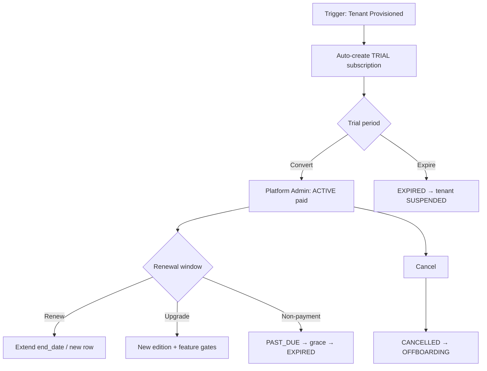

---

#### 3.3.3 State Machine

| State Category | State Codes | Description |
|----------------|-------------|-------------|
| **Initial** | `TRIAL` | Auto-created at tenant provision (30 days default) |
| **Intermediate** | `ACTIVE`, `RENEWAL_PENDING`, `PAST_DUE`, `SUSPENDED` | Paid, in renewal window, overdue, admin hold |
| **Terminal** | `ACTIVE` (ongoing paid), `RENEWED` (historical row) | Operational entitlement |
| **Cancelled** | `CANCELLED` | Explicit termination |
| **Archived** | Historical `subscription` rows superseded by renewal/upgrade | `is_current = false` |

**Allowed Transitions**

| From | To | Trigger | Actor |
|------|----|---------|-------|
| `TRIAL` | `ACTIVE` | Payment / conversion | Platform Admin |
| `TRIAL` | `EXPIRED` | Trial end date reached | Scheduler |
| `TRIAL` | `CANCELLED` | Early cancellation | Platform Admin |
| `ACTIVE` | `RENEWAL_PENDING` | Enter renewal window (30 d) | Scheduler |
| `RENEWAL_PENDING` | `ACTIVE` | Renewal processed | Platform Admin |
| `RENEWAL_PENDING` | `EXPIRED` | End date passed without renewal | Scheduler |
| `ACTIVE` | `PAST_DUE` | Payment failure flag | Platform Admin |
| `PAST_DUE` | `ACTIVE` | Payment resolved | Platform Admin |
| `PAST_DUE` | `EXPIRED` | Grace period (15 d) elapsed | Scheduler |
| `ACTIVE` | `SUSPENDED` | Admin hold | Platform Admin |
| `SUSPENDED` | `ACTIVE` | Admin release | Platform Admin |
| `EXPIRED` | `ACTIVE` | Reactivation + payment | Platform Admin |
| Any active | `CANCELLED` | Explicit cancellation | Platform Admin |

**Invalid Transitions**

| From | To | Reason |
|------|----|--------|
| `CANCELLED` | `ACTIVE` | Requires new subscription row |
| `EXPIRED` | `TRIAL` | Trial is one-time per tenant |
| `ACTIVE` | `TRIAL` | Cannot revert to trial |

**Rollback Rules**

| Scenario | Action |
|----------|--------|
| Upgrade failure | Revert `tenant.current_subscription_id` to prior subscription; delete draft upgrade row |
| Renewal with invalid seats | Transaction rollback; retain current subscription |
| Expiry cascade failure | Retry job; alert Platform Admin if tenant not SUSPENDED within 1 h (BR-PF-024) |

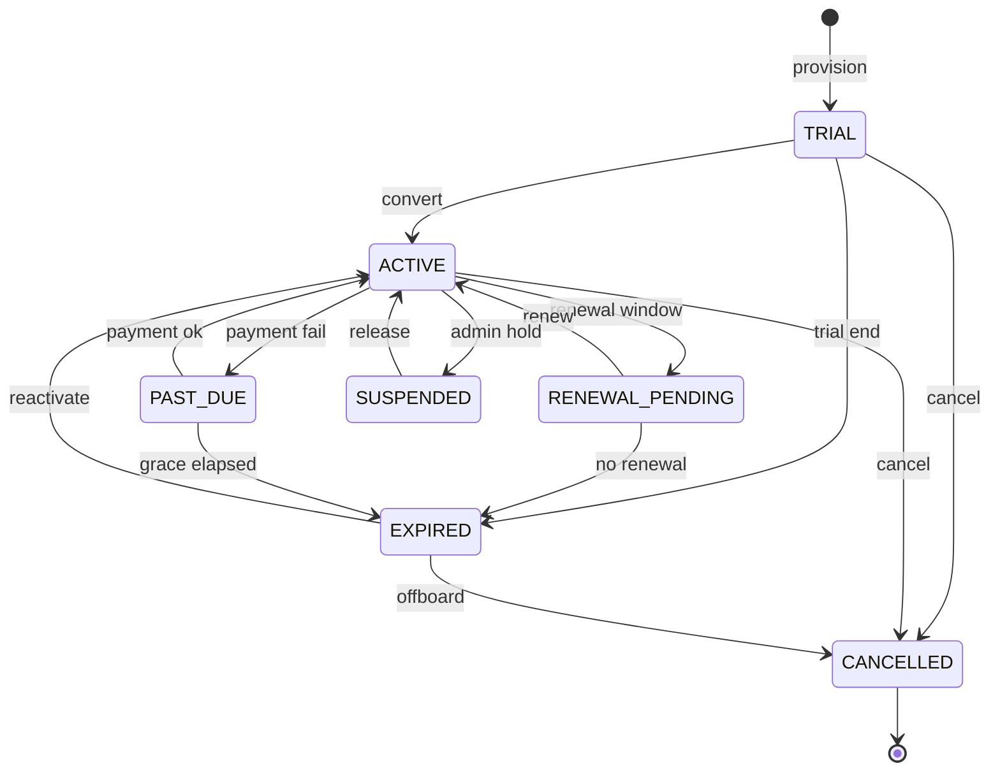

---

#### 3.3.4 Ownership Matrix

| RACI Role | Actor | Responsibility |
|-----------|-------|----------------|
| **Owner** | Platform Admin (Billing Ops) | Subscription lifecycle accountability |
| **Reviewer** | Finance User | Validates commercial terms, renewal amounts |
| **Approver** | Platform Admin | Trial conversion, upgrade, cancellation |
| **Executor** | System — Subscription Engine, Scheduler | Auto-create trial, expiry checks, usage snapshots |
| **Watcher** | Tenant Admin | Monitors usage vs limits, renewal dates |
| **Notification Recipients** | Tenant Admin, Finance User, Platform Admin | Per § 3.3.10 |
| **Escalation Owner** | Head of Revenue Operations | EXPIRED tenant not actioned within 24 h |

---

#### 3.3.5 Exception Handling

| Exception Type | Detection | System Response | Recovery |
|----------------|-----------|-----------------|----------|
| **Rejected** | Seat count > edition max (BR-PF-021) | HTTP 422 | Reduce seats or upgrade edition |
| **Expired** | `end_date` < today | Status → `EXPIRED`; tenant → `SUSPENDED` (BR-PF-024) | `POST /subscriptions/{id}/reactivate` |
| **Cancelled** | Admin cancellation | `CANCELLED`; tenant → `OFFBOARDING` | New subscription if re-engagement |
| **Duplicate** | Second ACTIVE subscription (BR-PF-019) | HTTP 409 | Cancel duplicate or supersede |
| **Rollback** | Upgrade transaction failure | Revert to prior subscription pointer | Retry upgrade |
| **Retry** | Scheduler expiry job failure | Retry 3x with backoff | Manual trigger |
| **Re-open** | `EXPIRED` → `ACTIVE` | Reactivation; tenant status → `ACTIVE` | Payment confirmation required |
| **Escalation** | PAST_DUE > 15 d | Auto-EXPIRED + exec alert | Revenue Ops intervention |
| **Business Exception** | Downgrade with excess users (BR-PF-023) | HTTP 422 | Deactivate users first |
| **System Exception** | Scheduler down | Missed expiry; catch-up on restart | Backfill job |

---

#### 3.3.6 Workflow Timing

| Timing Parameter | Value | Notes |
|------------------|-------|-------|
| **Expected Processing Time** | < 2 s (status change) | Synchronous API |
| **Max SLA** | 1 hour (expiry → tenant SUSPENDED) | BR-PF-024 |
| **Escalation Time** | 24 h (PAST_DUE without resolution) | Revenue Ops alert |
| **Reminder Frequency** | Trial: day 25; Renewal: 30, 15, 7 days before expiry | Scheduler `JOB-PF-003-01` |
| **Auto Close Policy** | `PAST_DUE` → `EXPIRED` after 15-day grace; `TRIAL` → `EXPIRED` at `trial_end_date` | Daily scheduler 00:00 UTC |

---

#### 3.3.7 Database Impact

| Impact Category | Tables | Operation |
|-----------------|--------|-----------|
| **Master** | `edition`, `edition_feature`, `edition_limit`, `tenant` | READ; UPDATE `tenant.current_subscription_id` |
| **Transaction** | `subscription` | INSERT (new/renewal/upgrade), UPDATE (status) |
| **Audit** | `subscription_history` | INSERT on every status/edition/seat change (BR-PF-026) |
| **Attachments** | — | N/A for v1 |
| **History** | `subscription_history`, `subscription_usage` | INSERT; usage snapshot daily |

---

#### 3.3.8 API Mapping

| HTTP Method | Path | Purpose | Permission |
|-------------|------|---------|------------|
| **POST** | `/api/v1/platform/subscriptions` | Create subscription | `subscription.create` |
| **GET** | `/api/v1/platform/subscriptions` | List subscriptions | `subscription.read` |
| **GET** | `/api/v1/platform/subscriptions/{id}` | Subscription detail | `subscription.read` |
| **PUT** | `/api/v1/platform/subscriptions/{id}` | Full update | `subscription.update` |
| **PATCH** | `/api/v1/platform/subscriptions/{id}` | Status / partial update | `subscription.update` |
| **DELETE** | `/api/v1/platform/subscriptions/{id}` | Cancel subscription | `subscription.cancel` |
| **GET** | `/api/v1/platform/subscriptions/search` | Search | `subscription.read` |
| **GET** | `/api/v1/platform/subscriptions/export` | Export XLSX/CSV | `subscription.export` |
| **POST** | `/api/v1/platform/subscriptions/bulk-import` | Bulk import | `subscription.create` |
| **PATCH** | `/api/v1/platform/subscriptions/bulk-update` | Bulk status update | `subscription.update` |
| **POST** | `/api/v1/platform/subscriptions/{id}/renew` | Process renewal | `subscription.renew` |
| **POST** | `/api/v1/platform/subscriptions/{id}/upgrade` | Upgrade edition | `subscription.upgrade` |
| **POST** | `/api/v1/platform/subscriptions/{id}/downgrade` | Downgrade edition | `subscription.upgrade` |
| **POST** | `/api/v1/platform/subscriptions/{id}/reactivate` | Reactivate expired | `subscription.reactivate` |
| **POST** | `/api/v1/platform/subscriptions/{id}/convert-trial` | Trial → Active | `subscription.update` |
| **GET** | `/api/v1/tenant/subscription` | Current tenant subscription | `subscription.read` |
| **GET** | `/api/v1/tenant/subscription/usage` | Usage vs limits | `subscription.read` |

---

#### 3.3.9 Flutter Mapping

| Screen Type | Route / Widget | Actor | Key Actions |
|-------------|----------------|-------|-------------|
| **List** | `/platform/subscriptions` → `SubscriptionListScreen` | Platform Admin | Filter status, edition, expiry |
| **Create** | `/platform/subscriptions/create` → `SubscriptionCreateScreen` | Platform Admin | Tenant, edition, seats, dates |
| **Edit** | `/platform/subscriptions/{id}/edit` → `SubscriptionEditScreen` | Platform Admin | Seats, dates, auto_renew |
| **Details** | `/platform/subscriptions/{id}` → `SubscriptionViewScreen` | Platform Admin, Tenant Admin | Usage bar, edition features |
| **Approval** | `/platform/subscriptions/{id}/renew` → `SubscriptionRenewScreen` | Platform Admin | Confirm renewal terms |
| **Approval** | `/platform/subscriptions/{id}/upgrade` → `SubscriptionUpgradeScreen` | Platform Admin | Edition comparison matrix |
| **History** | `/platform/subscriptions/{id}/history` → `SubscriptionHistoryScreen` | Platform Admin, Tenant Admin | Change timeline |
| **Details** | `/tenant/subscription` → `MySubscriptionScreen` | Tenant Admin | Self-service view, usage |
| **Timeline** | Embedded in SubscriptionView | All | Status transitions, renewals |
| **Attachments** | — | — | N/A v1 (invoice docs in FIN v2) |

---

#### 3.3.10 Notification Matrix

| Trigger Event | Email | SMS | WhatsApp | Push | Internal | Recipients | Template |
|---------------|:-----:|:---:|:--------:|:----:|:--------:|------------|----------|
| Trial started | ✓ | — | — | — | — | Tenant Admin | NTF-PF-003-01 |
| Trial expiring (5 d) | ✓ | — | — | ✓ | — | Tenant Admin | NTF-PF-003-02 |
| Subscription activated | ✓ | — | — | — | ✓ | Tenant Admin, Finance User | NTF-PF-003-03 |
| Renewal reminder (30/15/7 d) | ✓ | ✓ | — | — | — | Tenant Admin, Finance User | NTF-PF-003-04 |
| Subscription expired | ✓ | ✓ | — | ✓ | ✓ | Tenant Admin, Platform Admin | NTF-PF-003-05 |
| Edition upgraded | ✓ | — | — | ✓ | — | Tenant Admin | NTF-PF-003-06 |
| Seat limit approaching (90%) | ✓ | — | — | — | ✓ | Tenant Admin | NTF-PF-003-07 |
| PAST_DUE warning | ✓ | ✓ | — | ✓ | ✓ | Tenant Admin, Finance User | NTF-PF-003-08 |
| Subscription cancelled | ✓ | — | — | — | ✓ | Tenant Admin, Platform Admin | NTF-PF-003-09 |

---

#### 3.3.11 Reporting Impact

| Report Category | Report ID | Name | Audience | KPIs |
|-----------------|-----------|------|----------|------|
| **Operational** | RPT-PF-003-01 | Subscription Register | Platform Admin | Active/trial/expired counts |
| **MIS** | RPT-PF-003-02 | Renewal Pipeline | Sales Manager | Expiring in 30/60/90 days |
| **Operational** | RPT-PF-003-03 | Seat Utilisation | Tenant Admin | `seat_count_used` / `seat_count` |
| **Executive** | RPT-PF-003-04 | MRR/ARR Dashboard | Leadership | MRR, ARR, edition mix |
| **Charts** | CHART-PF-003-01 | Subscription Status Donut | Platform Admin | TRIAL/ACTIVE/EXPIRED split |
| **Analytics** | ANA-PF-003-01 | Trial Conversion Rate | Sales Manager | TRIAL → ACTIVE % |
| **Analytics** | ANA-PF-003-02 | Churn Rate | Leadership | CANCELLED / ACTIVE monthly |

---

#### 3.3.12 Security

| Security Control | Implementation |
|------------------|----------------|
| **RBAC** | Platform Admin full access; Tenant Admin read-only on own subscription; Finance User read |
| **Approval** | Upgrade, cancel, reactivate require `subscription.upgrade` / `subscription.cancel` / `subscription.reactivate` |
| **Permissions** | Feature gates checked via Rule Engine on every API call: `edition_feature` matrix |
| **Tenant Isolation** | Tenant Admin sees only own subscription via JWT scope; platform routes require Platform Admin |
| **Audit** | Every status/edition/seat change → `subscription_history` + `audit_event` |
| **Sensitive Fields** | `unit_price`, `total_amount` visible to Platform Admin and Finance User only |

---

#### 3.3.13 Audit Trail

| Event | Actor | Captured Data | Retention |
|-------|-------|---------------|-----------|
| **Create** | System / Platform Admin | subscription_id, tenant_id, edition_id, seats, dates | Platform permanent |
| **Update** | Platform Admin | Field diff (seats, dates, auto_renew) | Platform permanent |
| **Delete** | — | Subscriptions not hard-deleted; cancel only | — |
| **Approve** | Platform Admin | Trial conversion, renewal approval notes | Platform permanent |
| **Reject** | Platform Admin | Upgrade/reject reason | Platform permanent |
| **Export** | Platform Admin | Export format, filters | 1 year |
| **Status change** | System / Platform Admin | old_status, new_status, reason (BR-PF-026) | Platform permanent |

---

#### 3.3.14 Acceptance Criteria

| Category | ID | Criterion |
|----------|-----|-----------|
| **Functional** | AC-WF-PF-003-F01 | Given new tenant Euphoria provisioned, when complete, then TRIAL subscription exists with 30-day `trial_end_date` |
| **Functional** | AC-WF-PF-003-F02 | Given ACTIVE subscription 50 seats / 50 users, when seats reduced to 40, then HTTP 422 (BR-PF-027) |
| **Functional** | AC-WF-PF-003-F03 | Given subscription expires, when Scheduler runs, then tenant SUSPENDED within 1 h (BR-PF-024) |
| **Functional** | AC-WF-PF-003-F04 | Given upgrade Professional → Enterprise, when effective, then SSO screens visible (feature gate) |
| **Functional** | AC-WF-PF-003-F05 | Given status change, when complete, then `subscription_history` row created (BR-PF-026) |
| **Technical** | AC-WF-PF-003-T01 | `tenant.current_subscription_id` always points to valid current row |
| **Technical** | AC-WF-PF-003-T02 | Daily scheduler idempotent — re-run does not duplicate EXPIRED transitions |
| **Performance** | AC-WF-PF-003-P01 | Feature gate check < 10 ms P95 at API middleware |
| **Security** | AC-WF-PF-003-S01 | Tenant Admin cannot cancel subscription (403) |
| **Security** | AC-WF-PF-003-S02 | EXPIRED subscription blocks mutating CRM APIs (edition gate) |

---

#### 3.3.15 Future Enhancement

| Version | Enhancement | Description |
|---------|-------------|-------------|
| **v2** | Payment gateway integration | Razorpay/Stripe auto-convert trial |
| **v2** | Automated dunning | PAST_DUE escalation emails, grace extension rules |
| **v2** | Self-service upgrade | Tenant Admin initiates upgrade; Platform Admin approves |
| **v2** | Usage-based billing | API call and storage overage metering |
| **v3** | Multi-year subscriptions | Milestone billing, amortisation |
| **v3** | Partner/reseller model | White-label reseller subscription management |
| **AI** | Churn prediction | ML model flags at-risk tenants from usage patterns |
| **Automation** | Auto-renewal | Payment capture + renewal without manual Platform Admin step |
---


---

#### V1.0 Enterprise Ready Pack — WF-PF-003

## WF-PF-003 — Subscription Lifecycle

**Domain:** Platform Foundation · **Module:** PF-003 Subscription Management · **Tenant:** Euphoria

### V1.0 — Requirement IDs

| Requirement ID | Description | Priority | Related BR |
|----------------|-------------|----------|------------|
| REQ-PF-025 | Auto-create TRIAL subscription (30 days) on tenant provision | Critical | BR-PF-004 |
| REQ-PF-026 | Convert TRIAL subscription to ACTIVE paid subscription | Critical | BR-PF-019 |
| REQ-PF-027 | Enforce single ACTIVE subscription per tenant | Critical | BR-PF-019 |
| REQ-PF-028 | Validate seat count against edition maximum on create/upgrade | Critical | BR-PF-021 |
| REQ-PF-029 | Block downgrade when active users exceed new seat limit | High | BR-PF-023, BR-PF-027 |
| REQ-PF-030 | Expire subscription and cascade tenant to SUSPENDED within 1 h | Critical | BR-PF-024, BR-PF-007 |
| REQ-PF-031 | Process renewal within renewal window (30 days before expiry) | High | BR-PF-025 |
| REQ-PF-032 | Upgrade/downgrade edition with feature gate recalculation | High | BR-PF-020 |
| REQ-PF-033 | Reactivate EXPIRED subscription with payment confirmation | High | BR-PF-026 |
| REQ-PF-034 | Write `subscription_history` on every status/edition/seat change | High | BR-PF-026 |
| REQ-PF-035 | Expose current subscription and usage vs limits to Tenant Admin | Medium | BR-PF-022 |
| REQ-PF-036 | Send renewal and expiry reminder notifications (30/15/7 days) | Medium | BR-PF-025 |

### V1.0 — Requirements Traceability Matrix (RTM)

| Requirement | Workflow | Table | API | Flutter Screen | Test Case |
|-------------|----------|-------|-----|----------------|-----------|
| REQ-PF-025 | WF-PF-003 | `subscription`, `tenant` | (auto on `POST /api/v1/platform/tenants`) | — | TC-PF-003-01 |
| REQ-PF-026 | WF-PF-003 | `subscription`, `subscription_history` | `POST /api/v1/platform/subscriptions/{id}/convert-trial` | `SubscriptionUpgradeScreen` | TC-PF-003-02 |
| REQ-PF-027 | WF-PF-003 | `subscription` | `POST /api/v1/platform/subscriptions` | `SubscriptionCreateScreen` | TC-PF-003-03 |
| REQ-PF-028 | WF-PF-003 | `subscription`, `edition_limit` | `POST /api/v1/platform/subscriptions` | `SubscriptionCreateScreen` | TC-PF-003-04 |
| REQ-PF-029 | WF-PF-003 | `subscription`, `users` | `POST /api/v1/platform/subscriptions/{id}/downgrade` | `SubscriptionUpgradeScreen` | TC-PF-003-05 |
| REQ-PF-030 | WF-PF-003 | `subscription`, `tenant` | (Scheduler JOB-PF-003-01) | — | TC-PF-003-06 |
| REQ-PF-031 | WF-PF-003 | `subscription`, `subscription_history` | `POST /api/v1/platform/subscriptions/{id}/renew` | `SubscriptionRenewScreen` | TC-PF-003-07 |
| REQ-PF-032 | WF-PF-003 | `subscription`, `edition_feature` | `POST /api/v1/platform/subscriptions/{id}/upgrade` | `SubscriptionUpgradeScreen` | TC-PF-003-08 |
| REQ-PF-033 | WF-PF-003 | `subscription`, `tenant` | `POST /api/v1/platform/subscriptions/{id}/reactivate` | `SubscriptionViewScreen` | TC-PF-003-09 |
| REQ-PF-034 | WF-PF-003 | `subscription_history` | All subscription mutation APIs | `SubscriptionHistoryScreen` | TC-PF-003-10 |
| REQ-PF-035 | WF-PF-003 | `subscription_usage` | `GET /api/v1/tenant/subscription/usage` | `MySubscriptionScreen` | TC-PF-003-11 |
| REQ-PF-036 | WF-PF-003 | — | (Scheduler JOB-PF-003-01) | `MySubscriptionScreen` | TC-PF-003-12 |

### V1.0 — State Transition Diagram

```
    ┌───────┐
    │ TRIAL │──────► EXPIRED ──────► CANCELLED
    └───┬───┘              ▲              ▲
        │ convert          │ grace        │
        ▼                  │              │
    ┌────────┐    renewal   │         offboard
    │ ACTIVE │◄────────────┤              │
    └───┬────┘              │              │
        │                   │              │
   ┌────┼────┐              │              │
   ▼    ▼    ▼              │              │
RENEWAL PAST SUSPENDED      │              │
PENDING DUE                 │              │
   │         │              │              │
   └─renew───┴──grace 15d───┘              │
                                            ▼
                                         [ * ]
```

**Allowed Transitions**

| From | To | Trigger | Actor |
|------|-----|---------|-------|
| TRIAL | ACTIVE | Payment / conversion | Platform Admin |
| TRIAL | EXPIRED | Trial end date reached | Scheduler |
| TRIAL | CANCELLED | Early cancellation | Platform Admin |
| ACTIVE | RENEWAL_PENDING | Enter renewal window (30 d) | Scheduler |
| RENEWAL_PENDING | ACTIVE | Renewal processed | Platform Admin |
| RENEWAL_PENDING | EXPIRED | End date passed without renewal | Scheduler |
| ACTIVE | PAST_DUE | Payment failure flag | Platform Admin |
| PAST_DUE | ACTIVE | Payment resolved | Platform Admin |
| PAST_DUE | EXPIRED | Grace period (15 d) elapsed | Scheduler |
| ACTIVE | SUSPENDED | Admin hold | Platform Admin |
| SUSPENDED | ACTIVE | Admin release | Platform Admin |
| EXPIRED | ACTIVE | Reactivation + payment | Platform Admin |
| Any active | CANCELLED | Explicit cancellation | Platform Admin |

**Invalid Transitions**

| From | To | Reason |
|------|-----|--------|
| CANCELLED | ACTIVE | Requires new subscription row |
| EXPIRED | TRIAL | Trial is one-time per tenant |
| ACTIVE | TRIAL | Cannot revert to trial |

**Re-open Rules**

| Scenario | Allowed | Condition |
|----------|---------|-----------|
| EXPIRED → ACTIVE | Yes | Payment confirmation; tenant status → ACTIVE |
| SUSPENDED → ACTIVE | Yes | Platform Admin release |
| CANCELLED → ACTIVE | No | New subscription row required |

**Rollback Rules**

| Scenario | Rollback Action |
|----------|-----------------|
| Upgrade failure | Revert `tenant.current_subscription_id` to prior subscription; delete draft upgrade row |
| Renewal with invalid seats | Transaction rollback; retain current subscription |
| Expiry cascade failure | Retry job; alert Platform Admin if tenant not SUSPENDED within 1 h (BR-PF-024) |


### V1.0 — CRUD Responsibility Matrix

| Role | Create | Read | Update | Approve | Delete |
|------|:------:|:----:|:------:|:-------:|:------:|
| Platform Admin | ✔ | ✔ | ✔ | ✔ | ✔ (cancel) |
| Tenant Admin | ✘ | ✔ (own) | ✘ | ✘ | ✘ |
| Sales Manager | ✘ | ✔ (pipeline) | ✘ | ✘ | ✘ |
| Sales Executive | ✘ | ✘ | ✘ | ✘ | ✘ |
| Finance User | ✘ | ✔ (commercial terms) | ✘ | ✘ | ✘ |
| Pre-Sales | ✘ | ✘ | ✘ | ✘ | ✘ |
| Support Agent | ✘ | ✘ | ✘ | ✘ | ✘ |

### V1.0 — Non-Functional Requirements

| NFR ID | Category | Requirement | Target |
|--------|----------|-------------|--------|
| NFR-PF-026 | Performance | Subscription status change API | P95 < 2 s |
| NFR-PF-027 | Performance | Feature gate check at API middleware | P95 < 10 ms |
| NFR-PF-028 | Security | Tenant Admin cannot cancel or modify subscription | 403 on mutating calls |
| NFR-PF-029 | Security | `unit_price`, `total_amount` visible to Platform Admin and Finance User only | Field-level RBAC |
| NFR-PF-030 | Security | EXPIRED subscription blocks mutating CRM APIs | Edition gate enforced |
| NFR-PF-031 | Audit | Every status/edition/seat change → `subscription_history` + `audit_event` | 100% coverage |
| NFR-PF-032 | Audit | Trial conversion and renewal approval notes captured | Permanent retention |
| NFR-PF-033 | Scalability | Daily scheduler processes 500 tenant expiry checks | < 5 min batch window |
| NFR-PF-034 | Availability | Scheduler idempotent — re-run does not duplicate EXPIRED transitions | Zero duplicate transitions |
| NFR-PF-035 | Availability | Expiry → tenant SUSPENDED cascade | Within 1 h of expiry (BR-PF-024) |
| NFR-PF-036 | Data Retention | `subscription_history` rows | Platform permanent |
| NFR-PF-037 | Data Retention | `subscription_usage` daily snapshots | 3 years |

### V1.0 — UI Navigation

```
[Platform Admin]
        │
        ▼
┌─────────────────────────┐
│ SubscriptionListScreen  │  /platform/subscriptions
│  Filter: status/edition │
└───────────┬─────────────┘
            │ [+ Create]
            ▼
┌─────────────────────────┐
│ SubscriptionCreateScreen│  /platform/subscriptions/create
└───────────┬─────────────┘
            │
            ▼
┌─────────────────────────┐
│ SubscriptionViewScreen  │  /platform/subscriptions/{id}
│  Usage bar · Features   │
└───────────┬─────────────┘
            ├──► SubscriptionRenewScreen    /platform/subscriptions/{id}/renew
            ├──► SubscriptionUpgradeScreen  /platform/subscriptions/{id}/upgrade
            └──► SubscriptionHistoryScreen  /platform/subscriptions/{id}/history

[Tenant Admin — self-service read]
        │
        ▼
┌─────────────────────────┐
│ MySubscriptionScreen    │  /tenant/subscription
│  Seats used · Renewal   │
└─────────────────────────┘
```

### V1.0 — API Contract Summary

| Method | Endpoint | Purpose |
|--------|----------|---------|
| POST | `/api/v1/platform/subscriptions` | Create subscription |
| GET | `/api/v1/platform/subscriptions` | List subscriptions |
| GET | `/api/v1/platform/subscriptions/{id}` | Subscription detail |
| PUT | `/api/v1/platform/subscriptions/{id}` | Full update |
| PATCH | `/api/v1/platform/subscriptions/{id}` | Status / partial update |
| DELETE | `/api/v1/platform/subscriptions/{id}` | Cancel subscription |
| GET | `/api/v1/platform/subscriptions/search` | Search subscriptions |
| GET | `/api/v1/platform/subscriptions/export` | Export CSV/XLSX |
| POST | `/api/v1/platform/subscriptions/bulk-import` | Bulk import |
| PATCH | `/api/v1/platform/subscriptions/bulk-update` | Bulk status update |
| POST | `/api/v1/platform/subscriptions/{id}/renew` | Process renewal |
| POST | `/api/v1/platform/subscriptions/{id}/upgrade` | Upgrade edition |
| POST | `/api/v1/platform/subscriptions/{id}/downgrade` | Downgrade edition |
| POST | `/api/v1/platform/subscriptions/{id}/reactivate` | Reactivate expired |
| POST | `/api/v1/platform/subscriptions/{id}/convert-trial` | Trial → Active |
| GET | `/api/v1/tenant/subscription` | Current tenant subscription |
| GET | `/api/v1/tenant/subscription/usage` | Usage vs limits |

## 4. CRM Workflows

### 4.1 WF-CRM-001 — Lead Capture & Qualification

| Attribute | Detail |
|-----------|--------|
| **Module** | CRM-001 Lead Management |
| **Feature** | CRM-001-001-001 Lead Capture |
| **Priority** | Critical \| Phase 2 |
| **Actors** | Sales Executive, Sales Manager, System |

#### 4.1.1 Objective

Capture every potential enquiry, prevent duplicates, qualify fit, and decide convert / nurture / reject.

#### 4.1.2 Process Flow

```text
[Trigger: Web form / Manual / Import / Referral / Tender]
   │
   ▼
Create Lead
   │
   ▼
Duplicate Check (email / phone / company)
   │
   ├── Duplicate found ──► Link to existing Lead/Customer + alert owner
   │
   └── Unique
         │
         ▼
Assign Owner (manual or rule-based)
         │
         ▼
Log Activities (call / email / meeting) ──► Activity Timeline
         │
         ▼
Qualification (BANT / custom score)
         │
         ├── Unqualified ──► Nurture / Disqualified (reason mandatory)
         │
         └── Qualified
               │
               ▼
Optional NDA Workflow (send → sign → attach)
               │
               ▼
Convert to Opportunity (+ optional Customer Master)
               │
               ▼
[End → WF-CRM-002]
```

#### 4.1.3 Suggested States

| State | Meaning |
|-------|---------|
| New | Just captured |
| Contacted | First outreach done |
| Qualifying | Under evaluation |
| Nurture | Not ready now |
| Qualified | Ready to convert |
| Converted | Opportunity created |
| Disqualified | Closed with reason |
| Duplicate | Merged / linked |

#### 4.1.4 Business Rules (Recommended)

| Rule ID | Rule |
|---------|------|
| BR-CRM-001 | Lead must have tenant_id, source, and owner |
| BR-CRM-002 | Duplicate detection required before save/convert |
| BR-CRM-003 | Disqualification requires reason code |
| BR-CRM-004 | Converted leads are read-only except audit fields |
| BR-CRM-005 | All lead communications logged as Activities |

#### 4.1.5 Permissions (Illustrative)

`lead.create`, `lead.read`, `lead.update`, `lead.convert`, `lead.assign`, `lead.disqualify`


---

#### EFS Enrichment — WF-CRM-001

### WF-CRM-001 — Lead Capture & Qualification (EFS Enrichment)

#### 4.1.6 Workflow Traceability

| Attribute | Value |
|-----------|-------|
| **Workflow ID** | WF-CRM-001 |
| **Domain** | CRM |
| **Module** | CRM-001 Lead Management |
| **Sub Module** | CRM-001-001 Lead |
| **Feature** | CRM-001-001-001 Lead Capture |
| **Business Process** | Lead Capture & Qualification |
| **Priority** | Critical \| Phase 2 \| v2.0 |
| **Related Modules** | CRM-002 Opportunity, CRM-003 Customer, CRM-004 Activity, CPS-001 Workflow, CPS-002 Rule Engine, CPS-003 Notification, CPS-005 Audit |
| **Dependent Workflows** | WF-PF-002 (Org & RBAC Setup) |
| **Downstream Workflows** | WF-CRM-002 Opportunity Pipeline |
| **Related Documents** | ELU-BFS-CRM-001, ELU-API-CRM, ELU-UI-CRM, ELU-WF-CRM-001 |
| **Primary Table** | `lead` |
| **Related Tables** | `lead_contact`, `lead_source`, `lead_attachment`, `lead_assignment_history`, `lead_conversion_log`, `lead_note`, `activity`, `activity_link`, `audit_event` |
| **Related Flutter Screens** | UI-CRM-LD-001 … UI-CRM-LD-012 |
| **Related REST APIs** | `/api/v1/crm/leads/*`, `/api/v1/crm/lead-sources/*` |
| **Related Reports** | RPT-CRM-LD-001 … RPT-CRM-LD-007 |
| **Business Rules** | BR-CRM-001, BR-CRM-002, BR-CRM-003, BR-CRM-004, BR-CRM-005, BR-CRM-006, BR-CRM-007, BR-CRM-008, BR-CRM-009, BR-CRM-010, BR-CRM-011, BR-CRM-012, BR-CRM-013, BR-CRM-014 |
| **Notifications** | NTF-CRM-LD-001 … NTF-CRM-LD-009 |
| **Roles** | Sales Executive, Sales Manager, Pre-Sales, Finance User, Support Agent, Tenant Admin |
| **Permissions** | `lead.create`, `lead.read`, `lead.update`, `lead.update.all`, `lead.assign`, `lead.qualify`, `lead.disqualify`, `lead.convert`, `lead.approve`, `lead.export`, `lead.configure` |

#### 4.1.7 Input / Output Definition

| Element | Definition |
|---------|------------|
| **Input** | Lead intake payload: company/contact details, `lead_source_id`, estimated value, BANT fields, optional attachments; JWT with `tenant_id` (Euphoria) |
| **Trigger** | Manual create (Web/Android), referral intake, future web-to-lead (INT-001), duplicate-check pre-submit |
| **Processing** | Duplicate check (BR-CRM-001/002) → auto-assign owner → qualification state transitions → optional conversion approval (BR-CRM-012) → convert to Customer + Opportunity |
| **Output** | `lead` record with `lead_number` (EUP-LD-YYYY-NNNNN); linked `lead_contact`; `activity` entries via CRM-004; on convert: `customer`, `opportunity`, `lead_conversion_log` |
| **Next Workflow** | WF-CRM-002 Opportunity Pipeline |

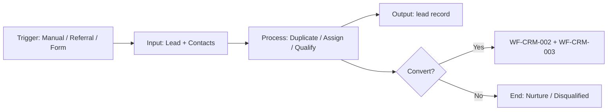

#### 4.1.8 State Machine

| Category | States |
|----------|--------|
| **Initial** | NEW |
| **Intermediate** | UNDER_QUALIFICATION, NURTURE, ON_HOLD, QUALIFIED |
| **Terminal** | CONVERTED, DISQUALIFIED |
| **Cancelled** | CANCELLED |
| **Archived** | ARCHIVED |

| From State | To State | Actor | Guard (BR-*) | Valid |
|------------|----------|-------|--------------|-------|
| NEW | UNDER_QUALIFICATION | Sales Executive | BR-CRM-003 (source + owner) | ✓ |
| NEW | NURTURE | Sales Executive | BR-CRM-009 (follow-up date) | ✓ |
| NEW | DISQUALIFIED | Sales Manager | BR-CRM-005 (reason) | ✓ |
| UNDER_QUALIFICATION | QUALIFIED | Sales Manager | BANT complete | ✓ |
| QUALIFIED | CONVERTED | System | BR-CRM-006, BR-CRM-012, BR-CRM-014 | ✓ |
| QUALIFIED | UNDER_QUALIFICATION | Sales Manager | — | ✓ |
| CONVERTED | *any* | — | BR-CRM-007 immutable | ✗ |
| DISQUALIFIED | CONVERTED | — | — | ✗ |

**Rollback Rules:** Conversion approval rejection returns lead to QUALIFIED; assignment rollback writes `lead_assignment_history`; no rollback from CONVERTED.

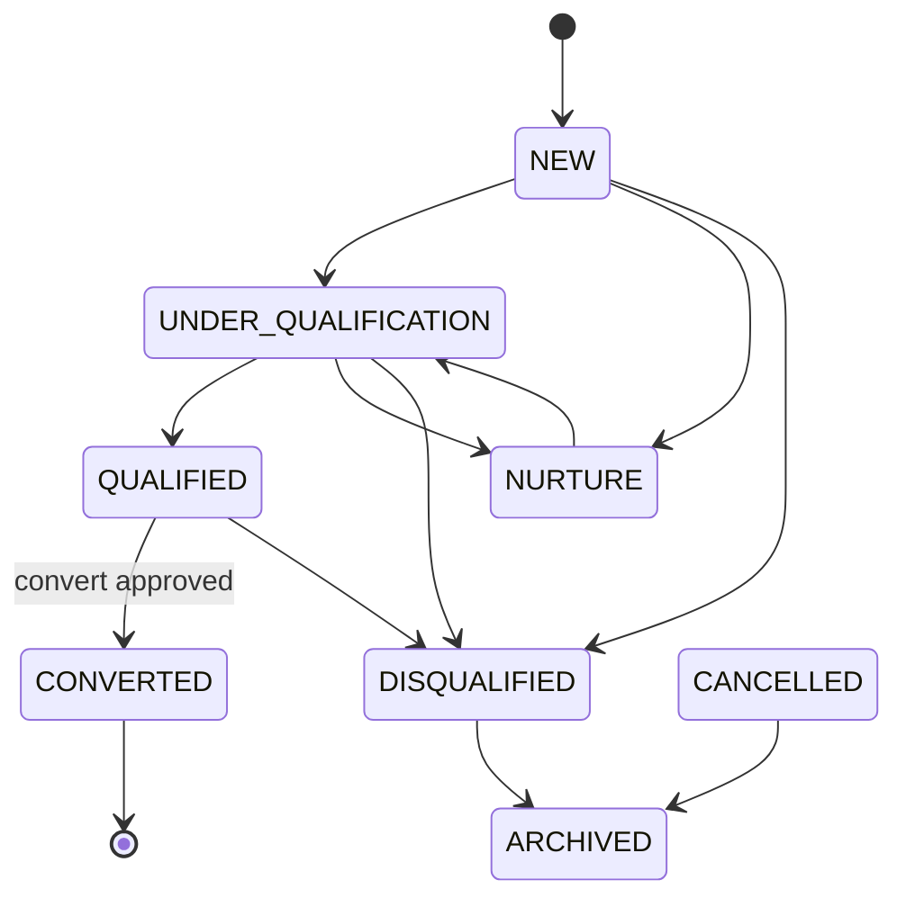

#### 4.1.9 Ownership Matrix

| Role | Owner | Reviewer | Approver | Executor | Watcher | Notification Recipient | Escalation Owner |
|------|:-----:|:--------:|:--------:|:--------:|:-------:|:----------------------:|:----------------:|
| Sales Executive | ● | — | — | ● | — | On assign / qualify | Sales Manager |
| Sales Manager | — | ● | ● (convert threshold) | ● | ● | Team queue / conversion | Tenant Admin |
| Pre-Sales | — | ● (tech fit) | — | ○ | ● | On convert | Sales Manager |
| Finance User | — | ○ (value advisory) | — | — | ● | High-value convert | Sales Manager |
| Support Agent | — | — | — | — | ○ | — | — |
| Tenant Admin | — | — | ● (override) | ○ | ● | Config changes | Platform Admin |
| Rule Engine | — | — | — | ● | — | Duplicate / assign | — |
| Workflow Engine | — | — | ● | ● | — | Approval pending | Sales Manager |

#### 4.1.10 Exception Handling

| Exception Type | Condition | System Behaviour | User Action | Audit Event |
|----------------|-----------|------------------|-------------|-------------|
| **Rejected** | Conversion approval denied | Status remains QUALIFIED; notify requester | Revise value/BANT or re-request | `lead.conversion.rejected` |
| **Expired** | Nurture follow-up past due | NTF-CRM-LD-007; flag stale | Log activity or reschedule | `lead.followup.overdue` |
| **Cancelled** | Lead created in error | State CANCELLED; soft-delete eligible | Manager confirms cancel | `lead.status_changed` |
| **Duplicate** | Email/phone match (BR-CRM-001) | 409 Conflict; link to existing | Manager override with reason (BR-CRM-002) | `lead.duplicate_override` |
| **Rollback** | Failed mid-convert (txn error) | Full DB rollback; lead stays QUALIFIED | Retry convert | `lead.conversion.failed` |
| **Retry** | Transient API / Rule Engine timeout | Idempotent retry on convert | Auto-retry ×3 | `lead.conversion.retry` |
| **Re-open** | Disqualified → re-qualify | Not allowed in Phase 2; create new lead | — | — |
| **Escalation** | No activity N days (default 7) | NTF-CRM-LD-008 to owner + manager | Manager reassign | `lead.stale.escalated` |
| **Business Exception** | Convert without primary contact | 422 BR-CRM-014 | Add primary `lead_contact` | `lead.validation.failed` |
| **System Exception** | DB constraint / storage failure | 500; no partial write | Support ticket | `system.error` |

#### 4.1.11 Workflow Timing / SLA

| Metric | Target (Euphoria) | Max SLA | Escalation | Reminder | Auto-Close |
|--------|-------------------|---------|------------|----------|------------|
| Lead creation → first contact | 4 business hours | 1 business day | +4h → Manager | Daily digest | — |
| NEW → UNDER_QUALIFICATION | 2 business days | 5 business days | Day 5 → Manager | NTF-CRM-LD-008 | — |
| Qualification cycle | 10 business days | 21 business days | Day 14 → Manager | Weekly | — |
| Conversion approval | 8 business hours | 2 business days | +1 day → Tenant Admin | NTF-CRM-LD-004 | Reject after 5 days idle |
| Nurture follow-up | Per `next_follow_up_date` | +1 day overdue | +3 days → Manager | NTF-CRM-LD-007 | — |
| Duplicate check API | < 500 ms p95 | 2 s | — | — | — |
| Convert transaction | < 3 s p95 | 10 s | — | — | — |

**Tenant timezone:** Asia/Kolkata · **Business calendar:** Euphoria Mon–Sat (configurable).

#### 4.1.12 Database Impact

| Table | Type | Operation | Notes |
|-------|------|-----------|-------|
| `lead` | Transaction | INSERT, UPDATE | Primary workflow entity; `tenant_id` from JWT |
| `lead_contact` | Transaction | INSERT, UPDATE, DELETE | Cascade; ≥1 `is_primary` before convert |
| `lead_source` | Master | READ | Assignment routing |
| `lead_attachment` | Transaction | INSERT, DELETE | Metadata; binary in Document Engine |
| `lead_assignment_history` | Audit | INSERT | Every owner change |
| `lead_conversion_log` | Audit | INSERT | Snapshot on convert |
| `lead_note` | Transaction | INSERT | Allowed on converted (BR-CRM-007) |
| `activity` | Transaction | INSERT | Via WF-CRM-004 |
| `activity_link` | Link | INSERT | `entity_type=LEAD` |
| `customer` | Master | INSERT (on convert) | WF-CRM-003 handoff |
| `opportunity` | Transaction | INSERT (on convert) | WF-CRM-002 handoff |
| `audit_event` | Audit | INSERT | All mutations |

**Indexes used:** `(tenant_id, status)`, `(tenant_id, owner_id)`, `(tenant_id, primary_email)`, `(tenant_id, lead_number)`.

#### 4.1.13 API Mapping

Base: `/api/v1/crm` · Auth: Bearer JWT · Tenant: JWT claim (Euphoria)

| Method | Path | Purpose | Permission | BR Ref |
|--------|------|---------|------------|--------|
| POST | `/api/v1/crm/leads` | Create lead | `lead.create` | BR-CRM-001, 003, 004, 010, 017 |
| GET | `/api/v1/crm/leads` | List (paginated) | `lead.read` | BR-CRM-011 |
| GET | `/api/v1/crm/leads/{id}` | Get by ID | `lead.read` | — |
| PUT | `/api/v1/crm/leads/{id}` | Full update | `lead.update` | BR-CRM-007, 011 |
| PATCH | `/api/v1/crm/leads/{id}` | Partial update | `lead.update` | BR-CRM-008, 009 |
| PATCH | `/api/v1/crm/leads/{id}/status` | Status transition | `lead.update` | BR-CRM-005, 006 |
| DELETE | `/api/v1/crm/leads/{id}` | Soft delete | `lead.delete` | BR-CRM-016 |
| POST | `/api/v1/crm/leads/{id}/restore` | Restore | `lead.restore` | — |
| POST | `/api/v1/crm/leads/{id}/assign` | Assign owner | `lead.assign` | BR-CRM-010 |
| POST | `/api/v1/crm/leads/{id}/qualify` | Mark qualified | `lead.qualify` | BR-CRM-006 |
| POST | `/api/v1/crm/leads/{id}/disqualify` | Disqualify | `lead.disqualify` | BR-CRM-005 |
| POST | `/api/v1/crm/leads/{id}/convert` | Convert | `lead.convert` | BR-CRM-006, 012, 013, 014 |
| GET | `/api/v1/crm/leads/search` | Advanced search | `lead.read` | — |
| GET | `/api/v1/crm/leads/export` | Export CSV/XLSX | `lead.export` | BR-CRM-020 |
| POST | `/api/v1/crm/leads/duplicate-check` | Pre-create check | `lead.create` | BR-CRM-001, 002 |
| GET | `/api/v1/crm/leads/{id}/history` | Assignment + status history | `lead.read` | — |
| POST | `/api/v1/crm/leads/{id}/contacts` | Add contact | `lead.update` | BR-CRM-014 |
| POST | `/api/v1/crm/leads/{id}/attachments` | Upload attachment | `lead.update` | BR-CRM-019 |
| GET | `/api/v1/crm/lead-sources` | List sources | `lead.read` | — |

**Response codes:** 200, 201, 400, 401, 403, 404, 409 (duplicate), 422 (BR violation).

#### 4.1.14 Flutter Mapping

| Screen ID | Screen | Route | Workflow Step | Offline |
|-----------|--------|-------|---------------|---------|
| UI-CRM-LD-001 | Lead List | `/crm/leads` | Browse / filter queue | Read cache |
| UI-CRM-LD-002 | Lead Create | `/crm/leads/new` | Capture + duplicate check | Draft sync |
| UI-CRM-LD-003 | Lead Edit | `/crm/leads/{id}/edit` | Update BANT / fields | — |
| UI-CRM-LD-004 | Lead Detail | `/crm/leads/{id}` | View + timeline embed | Read cache |
| UI-CRM-LD-005 | Lead Search | `/crm/leads/search` | Manager advanced search | — |
| UI-CRM-LD-006 | Lead Qualification | `/crm/leads/{id}/qualify` | Qualify action | — |
| UI-CRM-LD-007 | Lead Convert Wizard | `/crm/leads/{id}/convert` | Convert + approval | — |
| UI-CRM-LD-008 | Disqualify Dialog | Modal | Disqualify with reason | — |
| UI-CRM-LD-009 | Lead Assignment | `/crm/leads/{id}/assign` | Reassign owner | — |
| UI-CRM-LD-010 | Lead History | `/crm/leads/{id}/history` | Audit trail view | — |
| UI-CRM-LD-011 | Lead Source Admin | `/crm/settings/lead-sources` | Configure sources | — |
| UI-CRM-LD-012 | Duplicate Review | Modal | BR-CRM-001/002 handling | — |
| UI-CRM-ACT-001 | Activity Timeline | Embedded | WF-CRM-004 integration | Partial |

#### 4.1.15 Notification Matrix

| Event ID | Trigger | Email | SMS | WhatsApp | Push | Internal | Recipients | Template Key |
|----------|---------|:-----:|:---:|:--------:|:----:|:--------:|------------|--------------|
| NTF-CRM-LD-001 | Lead assigned | — | — | — | ✓ | ✓ | Owner | `lead.assigned` |
| NTF-CRM-LD-002 | Lead qualified | — | — | — | ✓ | ✓ | Owner, Manager | `lead.qualified` |
| NTF-CRM-LD-003 | Lead disqualified | — | — | — | — | ✓ | Owner | `lead.disqualified` |
| NTF-CRM-LD-004 | Conversion approval pending | ✓ | — | — | ✓ | ✓ | Sales Manager | `lead.conversion.pending` |
| NTF-CRM-LD-005 | Conversion approved/rejected | — | — | — | ✓ | ✓ | Requester | `lead.conversion.approved` / `.rejected` |
| NTF-CRM-LD-006 | Lead converted | — | — | — | ✓ | ✓ | Owner, Manager, Pre-Sales | `lead.converted` |
| NTF-CRM-LD-007 | Nurture follow-up due | — | — | — | ✓ | ✓ | Owner | `lead.followup.due` |
| NTF-CRM-LD-008 | Lead stale (no activity) | ✓ | — | — | — | ✓ | Owner, Manager | `lead.stale` |
| NTF-CRM-LD-009 | Duplicate override | — | — | — | — | ✓ | Manager | `lead.duplicate.override` |

#### 4.1.16 Reporting Impact

| Report ID | Name | Type | Workflow Touchpoint | KPI |
|-----------|------|------|---------------------|-----|
| RPT-CRM-LD-001 | Lead Register | Operational | All states | Volume by status |
| RPT-CRM-LD-002 | Lead Funnel | Management | State transitions | Conversion funnel |
| RPT-CRM-LD-003 | Lead Source Performance | Management | Create + convert | Source ROI |
| RPT-CRM-LD-004 | Conversion Rate | KPI | QUALIFIED → CONVERTED | % convert |
| RPT-CRM-LD-005 | Disqualification Analysis | Management | DISQUALIFIED | Reason breakdown |
| RPT-CRM-LD-006 | Lead Aging | Operational | Days in status | SLA compliance |
| RPT-CRM-LD-007 | Executive Lead Summary | Executive Dashboard | Aggregated | Pipeline intake |

**Analytics events:** `lead.created`, `lead.qualified`, `lead.converted`, `lead.disqualified` → CPS-004 warehouse.

#### 4.1.17 Security

| Control | Implementation |
|---------|----------------|
| **RBAC** | All endpoints enforce `lead.*` permissions server-side; UI hides actions per role matrix |
| **Tenant isolation** | `tenant_id` from JWT only (BR-CRM-017); cross-tenant ID returns 404 |
| **Approval** | BR-CRM-012: Workflow Engine gate when `estimated_value` > ₹10,00,000 |
| **Ownership** | BR-CRM-011: Sales Executive edits own leads only unless `lead.update.all` |
| **Sensitive fields** | PII (email, phone) masked in export per BR-CRM-020 / role |
| **Immutable states** | BR-CRM-007: CONVERTED leads reject field updates (403) except notes |
| **Audit** | All mutations → `audit_event` via CPS-005 |
| **Attachments** | BR-CRM-019: disqualified/converted attachment add restricted to Manager |

#### 4.1.18 Audit Trail

| Event | Payload | Retention | Actor |
|-------|---------|-----------|-------|
| `lead.created` | Full snapshot, IP, `tenant_id` | 7 years | Creator |
| `lead.updated` | Field-level diff | 7 years | Editor |
| `lead.status_changed` | Old/new status, reason | 7 years | Actor |
| `lead.assigned` | Old/new `owner_id` | 7 years | Assigner |
| `lead.qualified` | Qualifier, timestamp | 7 years | Manager |
| `lead.disqualified` | Reason code, comment | 7 years | Manager |
| `lead.conversion_requested` | Workflow instance id | 7 years | Requester |
| `lead.converted` | `opportunity_id`, `customer_id` | 7 years | System |
| `lead.deleted` / `lead.restored` | Actor, timestamp | 7 years | Manager/Admin |
| `lead.exported` | Filter criteria, row count | 7 years | Exporter |
| `lead.duplicate_override` | Matched record id, reason | 7 years | Manager |

#### 4.1.19 Acceptance Criteria

| Category | ID | Criterion |
|----------|-----|-----------|
| **Functional** | AC-CRM-LD-001 | Valid lead creates in NEW with auto `lead_number` EUP-LD-YYYY-NNNNN |
| **Functional** | AC-CRM-LD-002 | Duplicate email returns 409 per BR-CRM-001 |
| **Functional** | AC-CRM-LD-003 | Convert creates Customer + Opportunity; lead = CONVERTED |
| **Functional** | AC-CRM-LD-004 | Value > threshold triggers approval before convert (BR-CRM-012) |
| **Functional** | AC-CRM-LD-005 | CONVERTED lead update rejected (403) except notes |
| **Technical** | AC-CRM-LD-006 | Tenant A JWT returns zero Tenant B leads |
| **Technical** | AC-CRM-LD-007 | Convert is atomic; failure rolls back all inserts |
| **Performance** | AC-CRM-LD-008 | Lead list p95 < 800 ms for 10k records (paginated) |
| **Performance** | AC-CRM-LD-009 | Duplicate check p95 < 500 ms |
| **Security** | AC-CRM-LD-010 | Export masks PII without `lead.export` + role grant |
| **Security** | AC-CRM-LD-011 | Sales Executive cannot qualify without `lead.qualify` |

#### 4.1.20 Future Enhancement (v2 / v3 / AI)

| Version | Enhancement | Engine |
|---------|-------------|--------|
| v2.1 | Bulk import wizard; web-to-lead public form (INT-001) | CPS-008 |
| v2.2 | Lead scoring rules; territory auto-assignment | CPS-002 |
| v3.0 | AI lead enrichment and predictive conversion score | CPS-007 |
| v3.0 | Multi-touch campaign attribution | INT-002 |
| v3.1 | Lead merge tool with survivorship rules | CPS-001 |
---


---

#### V1.0 Enterprise Ready Pack — WF-CRM-001

## WF-CRM-001 — Lead Capture & Qualification

**Domain:** CRM · **Module:** CRM-001 Lead Management · **Tenant:** Euphoria

### V1.0 — Requirement IDs

| Requirement ID | Description | Priority | Related BR |
|----------------|-------------|----------|------------|
| REQ-CRM-001 | Create a lead with company/contact details, source, and estimated value | Critical | BR-CRM-001, BR-CRM-003, BR-CRM-004 |
| REQ-CRM-002 | Convert lead to opportunity and customer when qualified | Critical | BR-CRM-006, BR-CRM-012, BR-CRM-014 |
| REQ-CRM-003 | Detect duplicate leads by email/phone before create | Critical | BR-CRM-001, BR-CRM-002 |
| REQ-CRM-004 | Auto-assign lead owner based on lead source routing rules | High | BR-CRM-010 |
| REQ-CRM-005 | Qualify lead with complete BANT fields; transition to QUALIFIED | Critical | BR-CRM-006 |
| REQ-CRM-006 | Disqualify lead with mandatory reason code and comment | High | BR-CRM-005 |
| REQ-CRM-007 | Require manager approval for conversion when estimated value > ₹10,00,000 | High | BR-CRM-012 |
| REQ-CRM-008 | Enforce immutable CONVERTED lead (no field updates except notes) | High | BR-CRM-007 |
| REQ-CRM-009 | Restrict Sales Executive to own leads unless `lead.update.all` | High | BR-CRM-011 |
| REQ-CRM-010 | Schedule nurture follow-up with `next_follow_up_date` | Medium | BR-CRM-009 |
| REQ-CRM-011 | Log assignment history on every owner change | Medium | BR-CRM-010 |
| REQ-CRM-012 | Export lead register with PII masking per role | Medium | BR-CRM-020 |

### V1.0 — Requirements Traceability Matrix (RTM)

| Requirement | Workflow | Table | API | Flutter Screen | Test Case |
|-------------|----------|-------|-----|----------------|-----------|
| REQ-CRM-001 | WF-CRM-001 | `lead`, `lead_contact` | `POST /api/v1/crm/leads` | UI-CRM-LD-002 Lead Create | TC-CRM-001-01 |
| REQ-CRM-002 | WF-CRM-001 | `lead`, `customer`, `opportunity`, `lead_conversion_log` | `POST /api/v1/crm/leads/{id}/convert` | UI-CRM-LD-007 Lead Convert Wizard | TC-CRM-001-02 |
| REQ-CRM-003 | WF-CRM-001 | `lead` | `POST /api/v1/crm/leads/duplicate-check` | UI-CRM-LD-012 Duplicate Review | TC-CRM-001-03 |
| REQ-CRM-004 | WF-CRM-001 | `lead`, `lead_assignment_history` | `POST /api/v1/crm/leads` (auto-assign) | UI-CRM-LD-002 Lead Create | TC-CRM-001-04 |
| REQ-CRM-005 | WF-CRM-001 | `lead` | `POST /api/v1/crm/leads/{id}/qualify` | UI-CRM-LD-006 Lead Qualification | TC-CRM-001-05 |
| REQ-CRM-006 | WF-CRM-001 | `lead` | `POST /api/v1/crm/leads/{id}/disqualify` | UI-CRM-LD-008 Disqualify Dialog | TC-CRM-001-06 |
| REQ-CRM-007 | WF-CRM-001 | `lead` | `POST /api/v1/crm/leads/{id}/convert` | UI-CRM-LD-007 Lead Convert Wizard | TC-CRM-001-07 |
| REQ-CRM-008 | WF-CRM-001 | `lead`, `lead_note` | `PUT /api/v1/crm/leads/{id}` | UI-CRM-LD-004 Lead Detail | TC-CRM-001-08 |
| REQ-CRM-009 | WF-CRM-001 | `lead` | `PUT /api/v1/crm/leads/{id}` | UI-CRM-LD-003 Lead Edit | TC-CRM-001-09 |
| REQ-CRM-010 | WF-CRM-001 | `lead` | `PATCH /api/v1/crm/leads/{id}` | UI-CRM-LD-003 Lead Edit | TC-CRM-001-10 |
| REQ-CRM-011 | WF-CRM-001 | `lead_assignment_history` | `POST /api/v1/crm/leads/{id}/assign` | UI-CRM-LD-009 Lead Assignment | TC-CRM-001-11 |
| REQ-CRM-012 | WF-CRM-001 | `lead` | `GET /api/v1/crm/leads/export` | UI-CRM-LD-001 Lead List | TC-CRM-001-12 |

### V1.0 — State Transition Diagram

```
    ┌─────┐
    │ NEW │
    └──┬──┘
       │ qualify path          nurture path
       ▼                       ▼
┌──────────────────┐     ┌─────────┐
│UNDER_QUALIFICATION│     │ NURTURE │
└────────┬─────────┘     └────┬────┘
         │                    │
         ▼                    │
    ┌──────────┐              │
    │QUALIFIED │◄─────────────┘
    └────┬─────┘
         │ convert (approved)
         ▼
    ┌───────────┐     ┌──────────────┐
    │ CONVERTED │     │DISQUALIFIED  │──► ARCHIVED
    └───────────┘     └──────────────┘
         (terminal)         (terminal)
```

**Allowed Transitions**

| From | To | Actor | Guard |
|------|-----|-------|-------|
| NEW | UNDER_QUALIFICATION | Sales Executive | BR-CRM-003 (source + owner) |
| NEW | NURTURE | Sales Executive | BR-CRM-009 (follow-up date) |
| NEW | DISQUALIFIED | Sales Manager | BR-CRM-005 (reason) |
| UNDER_QUALIFICATION | QUALIFIED | Sales Manager | BANT complete |
| UNDER_QUALIFICATION | NURTURE | Sales Executive | Follow-up scheduled |
| UNDER_QUALIFICATION | DISQUALIFIED | Sales Manager | BR-CRM-005 |
| NURTURE | UNDER_QUALIFICATION | Sales Executive | Re-engage |
| QUALIFIED | CONVERTED | System | BR-CRM-006, BR-CRM-012, BR-CRM-014 |
| QUALIFIED | UNDER_QUALIFICATION | Sales Manager | Re-open qualification |
| QUALIFIED | DISQUALIFIED | Sales Manager | BR-CRM-005 |

**Invalid Transitions**

| From | To | Reason |
|------|-----|--------|
| CONVERTED | any | BR-CRM-007 immutable |
| DISQUALIFIED | CONVERTED | Must create new lead |
| DISQUALIFIED | QUALIFIED | Not allowed in Phase 2 |

**Re-open Rules**

| Scenario | Allowed | Condition |
|----------|---------|-----------|
| QUALIFIED → UNDER_QUALIFICATION | Yes | Sales Manager re-opens qualification |
| Conversion approval rejected | Yes | Returns to QUALIFIED; notify requester |
| DISQUALIFIED → re-qualify | No | Create new lead in Phase 2 |

**Rollback Rules**

| Scenario | Rollback Action |
|----------|-----------------|
| Conversion approval rejection | Status remains QUALIFIED; notify requester |
| Failed mid-convert (txn error) | Full DB rollback; lead stays QUALIFIED |
| Assignment rollback | Writes `lead_assignment_history` reversal entry |
| No rollback from CONVERTED | Immutable terminal state |

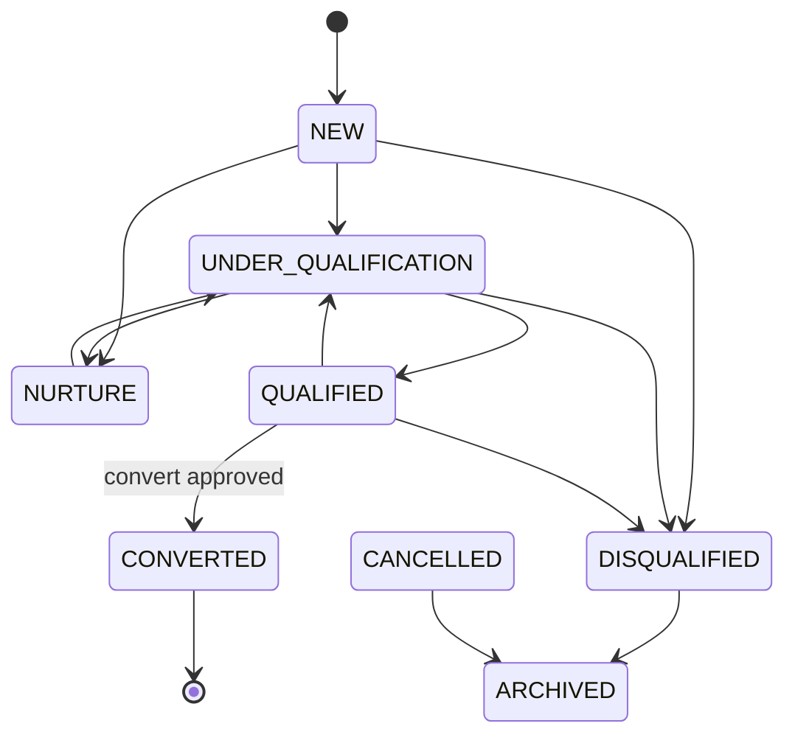

### V1.0 — CRUD Responsibility Matrix

| Role | Create | Read | Update | Approve | Delete |
|------|:------:|:----:|:------:|:-------:|:------:|
| Sales Executive | ✔ | ✔ (own) | ✔ (own) | ✘ | ✘ |
| Sales Manager | ✔ | ✔ (all) | ✔ (all) | ✔ (convert, qualify) | ✔ |
| Tenant Admin | ✔ | ✔ (all) | ✔ (all) | ✔ (override) | ✔ |
| Platform Admin | ✘ | ✔ (audit) | ✘ | ✘ | ✘ |
| Finance User | ✘ | ✔ (high-value) | ✘ | ✘ (advisory) | ✘ |
| Pre-Sales | ✘ | ✔ (assigned) | ✘ | ✘ | ✘ |
| Support Agent | ✘ | ✔ (read-only) | ✘ | ✘ | ✘ |

### V1.0 — Non-Functional Requirements

| NFR ID | Category | Requirement | Target |
|--------|----------|-------------|--------|
| NFR-CRM-001 | Performance | Lead list API (paginated, 10k records) | P95 < 800 ms |
| NFR-CRM-002 | Performance | Duplicate check API | P95 < 500 ms |
| NFR-CRM-003 | Performance | Convert transaction (customer + opportunity + log) | P95 < 3 s |
| NFR-CRM-004 | Security | Tenant isolation via JWT `tenant_id`; cross-tenant ID returns 404 | BR-CRM-017 |
| NFR-CRM-005 | Security | RBAC enforced server-side on all `lead.*` permissions | 100% coverage |
| NFR-CRM-006 | Security | PII masked in export without `lead.export` + role grant | BR-CRM-020 |
| NFR-CRM-007 | Audit | All mutations → `audit_event` via CPS-005 | 100% mutation coverage |
| NFR-CRM-008 | Audit | Conversion snapshot in `lead_conversion_log` | 7 years retention |
| NFR-CRM-009 | Scalability | Support 50k leads per tenant with indexed queries | `(tenant_id, status)` index |
| NFR-CRM-010 | Availability | Lead capture API availability | 99.5% monthly uptime |
| NFR-CRM-011 | Availability | Convert transaction atomic — failure rolls back all inserts | Zero partial converts |
| NFR-CRM-012 | Data Retention | `audit_event` for lead lifecycle | 7 years |
| NFR-CRM-013 | Data Retention | Soft-deleted leads restorable within 90 days | BR-CRM-016 |

### V1.0 — UI Navigation

```
[CRM Home]
    │
    ▼
┌─────────────────┐
│ UI-CRM-LD-001   │  /crm/leads
│ Lead List       │  Filter · Export
└────────┬────────┘
         │ [+ New Lead]
         ▼
┌─────────────────┐     ┌──────────────────┐
│ UI-CRM-LD-002   │────►│ UI-CRM-LD-012    │
│ Lead Create     │     │ Duplicate Review │ (modal, on 409)
└────────┬────────┘     └──────────────────┘
         │ save
         ▼
┌─────────────────┐
│ UI-CRM-LD-004   │  /crm/leads/{id}
│ Lead Detail     │  Timeline embed (UI-CRM-ACT-001)
└────────┬────────┘
         ├──► UI-CRM-LD-003 Lead Edit       /crm/leads/{id}/edit
         ├──► UI-CRM-LD-006 Qualification   /crm/leads/{id}/qualify
         ├──► UI-CRM-LD-009 Assignment      /crm/leads/{id}/assign
         ├──► UI-CRM-LD-008 Disqualify      (modal)
         ├──► UI-CRM-LD-010 History         /crm/leads/{id}/history
         └──► UI-CRM-LD-007 Convert Wizard  /crm/leads/{id}/convert
                    │
                    ▼ (on success)
              WF-CRM-002 Opportunity
              WF-CRM-003 Customer
```

### V1.0 — API Contract Summary

| Method | Endpoint | Purpose |
|--------|----------|---------|
| POST | `/api/v1/crm/leads` | Create lead |
| GET | `/api/v1/crm/leads` | List leads (paginated) |
| GET | `/api/v1/crm/leads/{id}` | Get lead by ID |
| PUT | `/api/v1/crm/leads/{id}` | Full update |
| PATCH | `/api/v1/crm/leads/{id}` | Partial update |
| PATCH | `/api/v1/crm/leads/{id}/status` | Status transition |
| DELETE | `/api/v1/crm/leads/{id}` | Soft delete |
| POST | `/api/v1/crm/leads/{id}/restore` | Restore soft-deleted lead |
| POST | `/api/v1/crm/leads/{id}/assign` | Assign owner |
| POST | `/api/v1/crm/leads/{id}/qualify` | Mark qualified |
| POST | `/api/v1/crm/leads/{id}/disqualify` | Disqualify with reason |
| POST | `/api/v1/crm/leads/{id}/convert` | Convert to customer + opportunity |
| GET | `/api/v1/crm/leads/search` | Advanced search |
| GET | `/api/v1/crm/leads/export` | Export CSV/XLSX |
| POST | `/api/v1/crm/leads/duplicate-check` | Pre-create duplicate check |
| GET | `/api/v1/crm/leads/{id}/history` | Assignment + status history |
| POST | `/api/v1/crm/leads/{id}/contacts` | Add lead contact |
| POST | `/api/v1/crm/leads/{id}/attachments` | Upload attachment |
| GET | `/api/v1/crm/lead-sources` | List lead sources |

### 4.2 WF-CRM-002 — Opportunity Pipeline

| Attribute | Detail |
|-----------|--------|
| **Module** | CRM-002 Opportunity Management |
| **Feature** | CRM-002-001-001 Opportunity Pipeline |
| **Actors** | Sales Executive, Sales Manager, Pre-Sales, Finance |

#### 4.2.1 Pipeline Stages

```text
Qualification
   → Technical Evaluation
   → Budget Validation
   → Proposal / Quotation
   → Negotiation
   → Verbal Commitment
   → Closed Won
   → Closed Lost
```

#### 4.2.2 Process Flow

```text
Lead Converted / Manual Opportunity Create
   │
   ▼
Create Opportunity (value, close date, probability, customer)
   │
   ▼
Technical Evaluation ──fail──► Closed Lost (reason) or back to Qualification
   │ pass
   ▼
Budget Validation ──fail──► Negotiate scope / Closed Lost
   │ pass
   ▼
Trigger Quotation/Proposal (WF-SAL-001)
   │
   ▼
Negotiation (commercial + legal + compliance)
   │
   ├── Lost ──► Closed Lost + competitor/reason
   │
   └── Won
         │
         ▼
Closed Won → Create Sales Order (WF-SAL-002)
```

#### 4.2.3 Business Rules

| Rule ID | Rule |
|---------|------|
| BR-CRM-010 | Opportunity must link to a Customer (or create one on convert) |
| BR-CRM-011 | Stage changes may require manager approval above threshold amount |
| BR-CRM-012 | Closed Lost requires reason and optional competitor |
| BR-CRM-013 | Probability auto-updates by stage (configurable via Rule Engine) |
| BR-CRM-014 | Only one primary open opportunity per lead conversion |


---

#### EFS Enrichment — WF-CRM-002

### WF-CRM-002 — Opportunity Pipeline (EFS Enrichment)

#### 4.2.4 Workflow Traceability

| Attribute | Value |
|-----------|-------|
| **Workflow ID** | WF-CRM-002 |
| **Domain** | CRM |
| **Module** | CRM-002 Opportunity Management |
| **Sub Module** | CRM-002-001 Opportunity |
| **Feature** | CRM-002-001-001 Opportunity Pipeline |
| **Business Process** | Opportunity Pipeline Management |
| **Priority** | Critical \| Phase 2 \| v2.0 |
| **Related Modules** | CRM-001 Lead, CRM-003 Customer, CRM-004 Activity, SAL-001 Quotation, CPS-001 Workflow, CPS-002 Rule Engine |
| **Dependent Workflows** | WF-CRM-001 Lead Capture (conversion), WF-CRM-003 Customer Master |
| **Downstream Workflows** | WF-SAL-001 Quotation & Proposal, WF-SAL-002 Sales Order |
| **Related Documents** | ELU-BFS-CRM-002, ELU-API-CRM, ELU-UI-CRM |
| **Primary Table** | `opportunity` |
| **Related Tables** | `opportunity_stage`, `opportunity_stage_history`, `opportunity_contact`, `opportunity_competitor`, `opportunity_team_member`, `opportunity_note`, `customer`, `activity`, `activity_link` |
| **Related Flutter Screens** | UI-CRM-OPP-001 … UI-CRM-OPP-012 |
| **Related REST APIs** | `/api/v1/crm/opportunities/*`, `/api/v1/crm/opportunity-stages/*` |
| **Related Reports** | RPT-CRM-OPP-001 … RPT-CRM-OPP-007 |
| **Business Rules** | BR-CRM-010, BR-CRM-011, BR-CRM-012, BR-CRM-013, BR-CRM-014 (workflow); BR-CRM-021 … BR-CRM-040 (BFS extended) |
| **Notifications** | NTF-CRM-OPP-001 … NTF-CRM-OPP-010 |
| **Roles** | Sales Executive, Sales Manager, Pre-Sales, Finance User, Support Agent, Tenant Admin |
| **Permissions** | `opportunity.create`, `opportunity.read`, `opportunity.update`, `opportunity.stage`, `opportunity.approve`, `opportunity.close`, `opportunity.reopen`, `opportunity.forecast`, `opportunity.export` |

#### 4.2.5 Input / Output Definition

| Element | Definition |
|---------|------------|
| **Input** | Opportunity header: `customer_id`, `opportunity_value`, `expected_close_date`, `stage_id`, contacts, team; or auto-created from lead conversion |
| **Trigger** | Lead conversion (WF-CRM-001), manual create, stage advance, quotation link (SAL-001) |
| **Processing** | Stage gate validation → manager approval (BR-CRM-011/032) → probability calc (BR-CRM-013) → weighted value → close won/lost |
| **Output** | `opportunity` with `opportunity_number` (EUP-OPP-YYYY-NNNNN); `opportunity_stage_history`; linked quotation; forecast contribution |
| **Next Workflow** | WF-SAL-001 (Proposal stage) → WF-SAL-002 (Closed Won) |

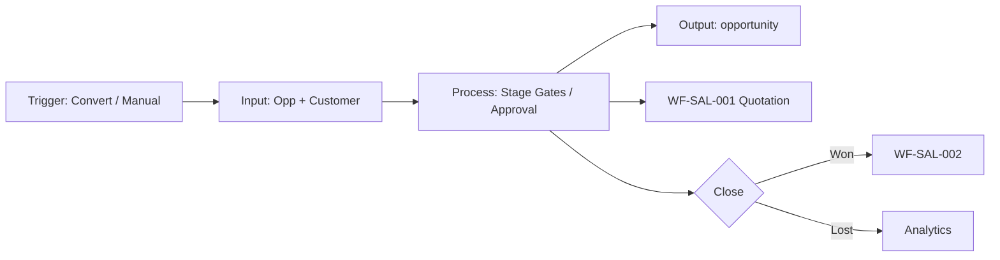

#### 4.2.6 State Machine

**Lifecycle Status (`opportunity.status`):**

| Category | States |
|----------|--------|
| **Initial** | OPEN (stage: QUALIFICATION) |
| **Intermediate** | OPEN (all pipeline stages), ON_HOLD, REOPENED |
| **Terminal** | CLOSED_WON, CLOSED_LOST |
| **Cancelled** | CANCELLED |
| **Archived** | ARCHIVED |

**Pipeline Stages (`opportunity_stage`):** QUALIFICATION → TECHNICAL_EVAL → BUDGET_VALIDATION → PROPOSAL → QUOTATION_ISSUED → NEGOTIATION

| From | To | Guard | Valid |
|------|-----|-------|-------|
| QUALIFICATION | TECHNICAL_EVAL | `opportunity_value` > 0 (BR-CRM-022) | ✓ |
| BUDGET_VALIDATION | PROPOSAL | Manager approval if value > ₹15L (BR-CRM-011) | ✓ |
| PROPOSAL | QUOTATION_ISSUED | Quotation created (BR-CRM-035) | ✓ |
| NEGOTIATION | CLOSED_WON | Approved quotation linked (BR-CRM-027) | ✓ |
| Any OPEN | CLOSED_LOST | `loss_reason_id` + comment (BR-CRM-012) | ✓ |
| CLOSED_LOST | REOPENED | Within 30 days + justification (BR-CRM-014) | ✓ |
| CLOSED_WON | *edit commercial* | Locked | ✗ |

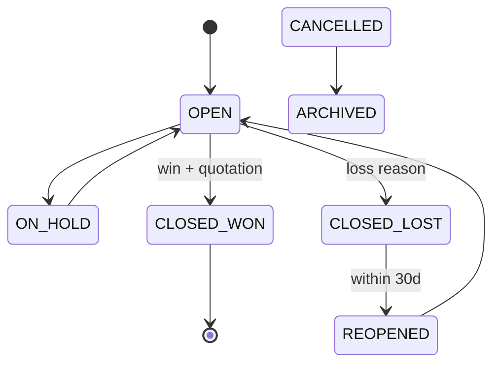

#### 4.2.7 Ownership Matrix

| Role | Owner | Reviewer | Approver | Executor | Watcher | Notification | Escalation |
|------|:-----:|:--------:|:--------:|:--------:|:-------:|:------------:|:----------:|
| Sales Executive | ● | — | — | ● | — | Stage change | Sales Manager |
| Sales Manager | — | ● | ● (gates, close) | ● | ● | Pipeline digest | Tenant Admin |
| Pre-Sales | ○ | ● (tech eval) | — | ● | ● | Team add | Sales Manager |
| Finance User | — | ● (budget) | — | — | ● | Closed Won | Finance Head |
| Support Agent | — | — | — | — | ○ | — | — |
| Workflow Engine | — | — | ● | ● | — | Approval pending | Sales Manager |

#### 4.2.8 Exception Handling

| Exception Type | Condition | System Behaviour | Audit |
|----------------|-----------|------------------|-------|
| **Rejected** | Stage gate approval denied | Revert to prior stage | `opportunity.approval.rejected` |
| **Expired** | `expected_close_date` passed | NTF-CRM-OPP-008 reminder | `opportunity.closedate.overdue` |
| **Cancelled** | Created in error | CANCELLED; soft-delete | `opportunity.cancelled` |
| **Duplicate** | Second opp from same lead | BR-CRM-014: warn / block | `opportunity.duplicate.warning` |
| **Rollback** | Failed stage transition | Revert `stage_id` + history | `opportunity.stage.rollback` |
| **Retry** | SAL integration timeout on stage sync | Retry ×3 idempotent | `opportunity.sync.retry` |
| **Re-open** | Closed Lost within 30 days | REOPENED → OPEN (BR-CRM-014) | `opportunity.reopened` |
| **Escalation** | Stalled > 14 days in stage | NTF-CRM-OPP-009 | `opportunity.stalled` |
| **Business Exception** | Close Won without quotation | 422 BR-CRM-027 | `opportunity.validation.failed` |
| **System Exception** | DB failure on close | 500; no partial close | `system.error` |

#### 4.2.9 Workflow Timing / SLA

| Metric | Target | Max SLA | Escalation | Reminder |
|--------|--------|---------|------------|----------|
| Lead convert → opp created | < 3 s | 10 s | — | NTF-CRM-OPP-001 |
| Stage advance (no approval) | Immediate | 2 s | — | NTF-CRM-OPP-002 |
| Manager gate approval | 8 business hours | 2 business days | +1 day → Admin | NTF-CRM-OPP-003 |
| Technical Evaluation | 5 business days | 10 business days | Day 10 → Manager | Weekly |
| Close date approaching | 7 days before | — | Day 0 → Owner | NTF-CRM-OPP-008 |
| Stalled in stage | — | 14 calendar days | NTF-CRM-OPP-009 | — |
| Pipeline kanban load | < 1.2 s p95 | 3 s | — | — |
| Forecast API | < 2 s p95 | 5 s | — | — |

#### 4.2.10 Database Impact

| Table | Type | Operation | Notes |
|-------|------|-----------|-------|
| `opportunity` | Transaction | INSERT, UPDATE | Core entity; `customer_id` FK required |
| `opportunity_stage` | Master | READ | Tenant-configurable pipeline |
| `opportunity_stage_history` | Audit | INSERT | Every stage transition |
| `opportunity_contact` | Link | INSERT, UPDATE | Links `customer_contact` |
| `opportunity_competitor` | Transaction | INSERT | Loss analysis |
| `opportunity_team_member` | Link | INSERT, DELETE | Pre-Sales contributors |
| `opportunity_note` | Transaction | INSERT | Internal notes |
| `opportunity_forecast_snapshot` | Transaction | INSERT | Period commits |
| `customer` | Master | READ | BR-CRM-010 parent |
| `activity` / `activity_link` | Transaction/Link | INSERT | WF-CRM-004 |
| `audit_event` | Audit | INSERT | All mutations |

#### 4.2.11 API Mapping

| Method | Path | Purpose | Permission | BR Ref |
|--------|------|---------|------------|--------|
| POST | `/api/v1/crm/opportunities` | Create | `opportunity.create` | BR-CRM-010, 021 |
| GET | `/api/v1/crm/opportunities` | List / filter | `opportunity.read` | BR-CRM-030 |
| GET | `/api/v1/crm/opportunities/{id}` | Get by ID | `opportunity.read` | — |
| PUT | `/api/v1/crm/opportunities/{id}` | Full update | `opportunity.update` | BR-CRM-022, 030 |
| PATCH | `/api/v1/crm/opportunities/{id}` | Partial update | `opportunity.update` | — |
| PATCH | `/api/v1/crm/opportunities/{id}/stage` | Advance stage | `opportunity.stage` | BR-CRM-011, 024, 032 |
| POST | `/api/v1/crm/opportunities/{id}/close-won` | Close won | `opportunity.close` | BR-CRM-027 |
| POST | `/api/v1/crm/opportunities/{id}/close-lost` | Close lost | `opportunity.close` | BR-CRM-012, 028, 034 |
| POST | `/api/v1/crm/opportunities/{id}/reopen` | Reopen | `opportunity.reopen` | BR-CRM-014, 037, 040 |
| POST | `/api/v1/crm/opportunities/{id}/assign` | Assign owner | `opportunity.assign` | — |
| POST | `/api/v1/crm/opportunities/{id}/hold` | Put on hold | `opportunity.update` | BR-CRM-033 |
| DELETE | `/api/v1/crm/opportunities/{id}` | Soft delete | `opportunity.delete` | — |
| GET | `/api/v1/crm/opportunities/pipeline` | Kanban view | `opportunity.read` | — |
| GET | `/api/v1/crm/opportunities/forecast` | Forecast summary | `opportunity.forecast` | BR-CRM-013, 026 |
| GET | `/api/v1/crm/opportunities/export` | Export | `opportunity.export` | — |
| GET | `/api/v1/crm/opportunities/{id}/history` | Stage history | `opportunity.read` | — |
| POST | `/api/v1/crm/opportunities/{id}/team-members` | Add contributor | `opportunity.assign` | BR-CRM-031 |
| GET | `/api/v1/crm/opportunity-stages` | List stages | `opportunity.read` | — |

#### 4.2.12 Flutter Mapping

| Screen ID | Screen | Route | Workflow Step |
|-----------|--------|-------|---------------|
| UI-CRM-OPP-001 | Opportunity List | `/crm/opportunities` | Browse pipeline |
| UI-CRM-OPP-002 | Pipeline Kanban | `/crm/opportunities/pipeline` | Drag stage advance |
| UI-CRM-OPP-003 | Opportunity Create | `/crm/opportunities/new` | Manual create |
| UI-CRM-OPP-004 | Opportunity Edit | `/crm/opportunities/{id}/edit` | Update fields |
| UI-CRM-OPP-005 | Opportunity Detail | `/crm/opportunities/{id}` | View + timeline |
| UI-CRM-OPP-006 | Stage Advance Dialog | Modal | Stage transition |
| UI-CRM-OPP-007 | Close Won/Lost Wizard | `/crm/opportunities/{id}/close` | Terminal states |
| UI-CRM-OPP-008 | Forecast View | `/crm/opportunities/forecast` | Weighted pipeline |
| UI-CRM-OPP-009 | Opportunity Team | `/crm/opportunities/{id}/team` | Pre-Sales assign |
| UI-CRM-OPP-010 | Stage History | `/crm/opportunities/{id}/history` | Audit trail |
| UI-CRM-OPP-011 | Stage Admin | `/crm/settings/opportunity-stages` | Tenant config |
| UI-CRM-OPP-012 | Competitor Tracker | Tab on detail | Loss tracking |

#### 4.2.13 Notification Matrix

| Event ID | Trigger | Email | Push | Internal | Recipients | Template |
|----------|---------|:-----:|:----:|:--------:|------------|----------|
| NTF-CRM-OPP-001 | Opp assigned | — | ✓ | ✓ | Owner | `opportunity.assigned` |
| NTF-CRM-OPP-002 | Stage changed | — | ✓ | ✓ | Owner, Manager, Team | `opportunity.stage.changed` |
| NTF-CRM-OPP-003 | Gate approval pending | ✓ | ✓ | ✓ | Sales Manager | `opportunity.approval.pending` |
| NTF-CRM-OPP-004 | Gate approved/rejected | — | — | ✓ | Owner | `opportunity.approval.result` |
| NTF-CRM-OPP-005 | Pre-Sales added | — | — | ✓ | Pre-Sales | `opportunity.team.added` |
| NTF-CRM-OPP-006 | Closed Won | ✓ | ✓ | ✓ | Owner, Manager, Finance | `opportunity.closed.won` |
| NTF-CRM-OPP-007 | Closed Lost | — | — | ✓ | Owner, Manager | `opportunity.closed.lost` |
| NTF-CRM-OPP-008 | Close date in 7 days | ✓ | ✓ | ✓ | Owner | `opportunity.closedate.reminder` |
| NTF-CRM-OPP-009 | Stalled > 14 days | ✓ | — | ✓ | Owner, Manager | `opportunity.stalled` |
| NTF-CRM-OPP-010 | Weekly pipeline digest | ✓ | — | — | Sales Manager | `opportunity.pipeline.weekly` |

#### 4.2.14 Reporting Impact

| Report ID | Name | Type | KPI |
|-----------|------|------|-----|
| RPT-CRM-OPP-001 | Pipeline by Stage | Operational | Count × stage |
| RPT-CRM-OPP-002 | Weighted Forecast | Management | Σ(value × probability) |
| RPT-CRM-OPP-003 | Win/Loss Analysis | Management | Win rate, loss reasons |
| RPT-CRM-OPP-004 | Stage Aging | Operational | Days in stage |
| RPT-CRM-OPP-005 | Opportunity Register | Operational | Full register |
| RPT-CRM-OPP-006 | Pre-Sales Utilisation | Management | Opps per Pre-Sales |
| RPT-CRM-OPP-007 | Executive Revenue Pipeline | Executive | FY forecast |

#### 4.2.15 Security

| Control | Implementation |
|---------|----------------|
| **RBAC** | `opportunity.*` enforced per role; Pre-Sales limited to tech fields (BR-CRM-031) |
| **Tenant isolation** | BR-CRM-038: JWT `tenant_id` only |
| **Stage gates** | BR-CRM-011/032: Workflow approval above ₹15,00,000 |
| **Close controls** | BR-CRM-027: Won requires quotation or manager exception |
| **Probability override** | BR-CRM-025: Manager permission required |
| **ON_HOLD** | BR-CRM-033: blocks quotation create |
| **Sensitive data** | Competitor and margin fields restricted to Manager/Finance |

#### 4.2.16 Audit Trail

| Event | Payload | Retention |
|-------|---------|-----------|
| `opportunity.created` | Snapshot, `source_lead_id` | 7 years |
| `opportunity.updated` | Field diff | 7 years |
| `opportunity.stage_changed` | Old/new stage, probability | 7 years |
| `opportunity.assigned` | Old/new owner | 7 years |
| `opportunity.approval_requested` / `completed` | Workflow instance | 7 years |
| `opportunity.closed_won` / `closed_lost` | Reason, value, quotation id | 7 years |
| `opportunity.reopened` | Justification (≥20 chars) | 7 years |
| `opportunity.team_changed` | Member add/remove | 7 years |
| `opportunity.forecast_committed` | Category change | 7 years |

#### 4.2.17 Acceptance Criteria

| Category | ID | Criterion |
|----------|-----|-----------|
| **Functional** | AC-CRM-OPP-001 | Lead convert creates opp in QUALIFICATION with customer link |
| **Functional** | AC-CRM-OPP-002 | Invalid stage skip returns 422 (BR-CRM-024) |
| **Functional** | AC-CRM-OPP-003 | Value > ₹15L to PROPOSAL triggers approval (BR-CRM-011) |
| **Functional** | AC-CRM-OPP-004 | Quotation link auto-advances to QUOTATION_ISSUED (BR-CRM-035) |
| **Functional** | AC-CRM-OPP-005 | Close Won blocked without quotation (BR-CRM-027) |
| **Technical** | AC-CRM-OPP-006 | Cross-tenant opp id returns 404 |
| **Technical** | AC-CRM-OPP-007 | Kanban drag updates stage when transition valid |
| **Performance** | AC-CRM-OPP-008 | Forecast API p95 < 2 s for 5k opps |
| **Security** | AC-CRM-OPP-009 | Pre-Sales editing commercial fields returns 403 |
| **Security** | AC-CRM-OPP-010 | Reopen without justification returns 422 (BR-CRM-014) |

#### 4.2.18 Future Enhancement (v2 / v3 / AI)

| Version | Enhancement | Engine |
|---------|-------------|--------|
| v2.1 | Split opportunities; parent/child hierarchy | — |
| v2.2 | Customisable pipeline per business unit | CPS-002 |
| v3.0 | AI win-probability and next-best-action | CPS-007 |
| v3.0 | Integrated CPQ from opportunity detail | SAL + CPS |
| v3.1 | Partner/co-sell opportunity sharing | INT-004 |
---


---

#### V1.0 Enterprise Ready Pack — WF-CRM-002

## WF-CRM-002 — Opportunity Pipeline

**Domain:** CRM · **Module:** CRM-002 Opportunity Management · **Tenant:** Euphoria

### V1.0 — Requirement IDs

| Requirement ID | Description | Priority | Related BR |
|----------------|-------------|----------|------------|
| REQ-CRM-013 | Create opportunity manually or auto from lead conversion | Critical | BR-CRM-010, BR-CRM-021 |
| REQ-CRM-014 | Advance opportunity through pipeline stages with gate validation | Critical | BR-CRM-024, BR-CRM-032 |
| REQ-CRM-015 | Require manager approval when value > ₹15,00,000 at BUDGET_VALIDATION → PROPOSAL | High | BR-CRM-011 |
| REQ-CRM-016 | Auto-advance to QUOTATION_ISSUED when quotation created (SAL-001) | High | BR-CRM-035 |
| REQ-CRM-017 | Close Won only with approved quotation linked | Critical | BR-CRM-027 |
| REQ-CRM-018 | Close Lost with mandatory `loss_reason_id` and comment | High | BR-CRM-012, BR-CRM-028 |
| REQ-CRM-019 | Reopen Closed Lost within 30 days with justification (≥20 chars) | Medium | BR-CRM-014, BR-CRM-037 |
| REQ-CRM-020 | Calculate weighted forecast value (value × probability) | High | BR-CRM-013, BR-CRM-026 |
| REQ-CRM-021 | Assign Pre-Sales team members to opportunity | Medium | BR-CRM-031 |
| REQ-CRM-022 | Put opportunity ON_HOLD; block quotation create while on hold | Medium | BR-CRM-033 |
| REQ-CRM-023 | Prevent invalid stage skip (sequential pipeline) | High | BR-CRM-024 |
| REQ-CRM-024 | Display pipeline kanban with drag-to-advance stage | High | BR-CRM-030 |

### V1.0 — Requirements Traceability Matrix (RTM)

| Requirement | Workflow | Table | API | Flutter Screen | Test Case |
|-------------|----------|-------|-----|----------------|-----------|
| REQ-CRM-013 | WF-CRM-002 | `opportunity` | `POST /api/v1/crm/opportunities` | UI-CRM-OPP-003 Opportunity Create | TC-CRM-002-01 |
| REQ-CRM-014 | WF-CRM-002 | `opportunity`, `opportunity_stage_history` | `PATCH /api/v1/crm/opportunities/{id}/stage` | UI-CRM-OPP-006 Stage Advance Dialog | TC-CRM-002-02 |
| REQ-CRM-015 | WF-CRM-002 | `opportunity` | `PATCH /api/v1/crm/opportunities/{id}/stage` | UI-CRM-OPP-006 Stage Advance Dialog | TC-CRM-002-03 |
| REQ-CRM-016 | WF-CRM-002 | `opportunity`, `opportunity_stage` | `PATCH /api/v1/crm/opportunities/{id}/stage` | UI-CRM-OPP-002 Pipeline Kanban | TC-CRM-002-04 |
| REQ-CRM-017 | WF-CRM-002 | `opportunity` | `POST /api/v1/crm/opportunities/{id}/close-won` | UI-CRM-OPP-007 Close Won/Lost Wizard | TC-CRM-002-05 |
| REQ-CRM-018 | WF-CRM-002 | `opportunity`, `opportunity_competitor` | `POST /api/v1/crm/opportunities/{id}/close-lost` | UI-CRM-OPP-007 Close Won/Lost Wizard | TC-CRM-002-06 |
| REQ-CRM-019 | WF-CRM-002 | `opportunity` | `POST /api/v1/crm/opportunities/{id}/reopen` | UI-CRM-OPP-005 Opportunity Detail | TC-CRM-002-07 |
| REQ-CRM-020 | WF-CRM-002 | `opportunity_forecast_snapshot` | `GET /api/v1/crm/opportunities/forecast` | UI-CRM-OPP-008 Forecast View | TC-CRM-002-08 |
| REQ-CRM-021 | WF-CRM-002 | `opportunity_team_member` | `POST /api/v1/crm/opportunities/{id}/team-members` | UI-CRM-OPP-009 Opportunity Team | TC-CRM-002-09 |
| REQ-CRM-022 | WF-CRM-002 | `opportunity` | `POST /api/v1/crm/opportunities/{id}/hold` | UI-CRM-OPP-005 Opportunity Detail | TC-CRM-002-10 |
| REQ-CRM-023 | WF-CRM-002 | `opportunity_stage` | `PATCH /api/v1/crm/opportunities/{id}/stage` | UI-CRM-OPP-002 Pipeline Kanban | TC-CRM-002-11 |
| REQ-CRM-024 | WF-CRM-002 | `opportunity`, `opportunity_stage` | `GET /api/v1/crm/opportunities/pipeline` | UI-CRM-OPP-002 Pipeline Kanban | TC-CRM-002-12 |

### V1.0 — State Transition Diagram

**Lifecycle Status (`opportunity.status`)**

```
    ┌──────┐
    │ OPEN │◄──────────────────┐
    └──┬───┘                   │
       │ on hold               │ reopen (30d)
       ▼                       │
  ┌─────────┐            ┌──────────┐
  │ON_HOLD  │            │ REOPENED │
  └────┬────┘            └────┬─────┘
       │ resume               │
       └──────►OPEN────────────┘
              │
       ┌──────┴──────┐
       ▼             ▼
┌────────────┐ ┌────────────┐
│CLOSED_WON  │ │CLOSED_LOST │
└────────────┘ └────────────┘
  (terminal)      (terminal)
```

**Pipeline Stages:** QUALIFICATION → TECHNICAL_EVAL → BUDGET_VALIDATION → PROPOSAL → QUOTATION_ISSUED → NEGOTIATION

**Allowed Transitions**

| From | To | Guard | Valid |
|------|-----|-------|-------|
| QUALIFICATION | TECHNICAL_EVAL | `opportunity_value` > 0 (BR-CRM-022) | ✓ |
| BUDGET_VALIDATION | PROPOSAL | Manager approval if value > ₹15L (BR-CRM-011) | ✓ |
| PROPOSAL | QUOTATION_ISSUED | Quotation created (BR-CRM-035) | ✓ |
| NEGOTIATION | CLOSED_WON | Approved quotation linked (BR-CRM-027) | ✓ |
| Any OPEN | CLOSED_LOST | `loss_reason_id` + comment (BR-CRM-012) | ✓ |
| CLOSED_LOST | REOPENED | Within 30 days + justification (BR-CRM-014) | ✓ |
| OPEN | ON_HOLD | Manager action (BR-CRM-033) | ✓ |
| ON_HOLD | OPEN | Resume | ✓ |

**Invalid Transitions**

| From | To | Reason |
|------|-----|--------|
| CLOSED_WON | edit commercial fields | Locked after close |
| Stage skip (e.g. QUALIFICATION → PROPOSAL) | — | BR-CRM-024 sequential only |
| CLOSED_WON | CLOSED_LOST | Terminal — no reverse |

**Re-open Rules**

| Scenario | Allowed | Condition |
|----------|---------|-----------|
| CLOSED_LOST → REOPENED | Yes | Within 30 days; justification ≥ 20 chars (BR-CRM-014) |
| REOPENED → OPEN | Yes | Returns to pipeline at prior stage |
| CLOSED_WON → reopen | No | Create new opportunity |

**Rollback Rules**

| Scenario | Rollback Action |
|----------|-----------------|
| Stage gate approval denied | Revert to prior stage; `opportunity_stage_history` entry |
| Failed stage transition | Revert `stage_id` + history |
| SAL integration timeout | Retry ×3 idempotent sync |


### V1.0 — CRUD Responsibility Matrix

| Role | Create | Read | Update | Approve | Delete |
|------|:------:|:----:|:------:|:-------:|:------:|
| Sales Executive | ✔ | ✔ (own) | ✔ (own) | ✘ | ✘ |
| Sales Manager | ✔ | ✔ (all) | ✔ (all) | ✔ (gates, close) | ✔ |
| Tenant Admin | ✔ | ✔ (all) | ✔ (all) | ✔ (override) | ✔ |
| Platform Admin | ✘ | ✔ (audit) | ✘ | ✘ | ✘ |
| Finance User | ✘ | ✔ (budget fields) | ✘ | ✘ (advisory) | ✘ |
| Pre-Sales | ✘ | ✔ (assigned) | ✔ (tech fields only) | ✘ | ✘ |
| Support Agent | ✘ | ✔ (read-only) | ✘ | ✘ | ✘ |

### V1.0 — Non-Functional Requirements

| NFR ID | Category | Requirement | Target |
|--------|----------|-------------|--------|
| NFR-CRM-014 | Performance | Pipeline kanban load | P95 < 1.2 s |
| NFR-CRM-015 | Performance | Forecast API (5k opportunities) | P95 < 2 s |
| NFR-CRM-016 | Performance | Stage advance (no approval) | < 2 s |
| NFR-CRM-017 | Security | Tenant isolation (BR-CRM-038) | Cross-tenant returns 404 |
| NFR-CRM-018 | Security | Pre-Sales cannot edit commercial fields | 403 on violation |
| NFR-CRM-019 | Security | Competitor and margin fields restricted to Manager/Finance | Field-level RBAC |
| NFR-CRM-020 | Audit | Stage changes, close, reopen → `audit_event` | 7 years retention |
| NFR-CRM-021 | Audit | `opportunity_stage_history` on every transition | 100% coverage |
| NFR-CRM-022 | Scalability | Kanban view for 5k open opportunities | Paginated per stage column |
| NFR-CRM-023 | Availability | Opportunity API availability | 99.5% monthly uptime |
| NFR-CRM-024 | Availability | Kanban drag updates stage when transition valid | Optimistic UI with server confirm |
| NFR-CRM-025 | Data Retention | Closed opportunity records | 7 years |
| NFR-CRM-026 | Data Retention | Forecast snapshots | 3 years |

### V1.0 — UI Navigation

```
[CRM Home]
    │
    ├──► UI-CRM-OPP-001 Opportunity List    /crm/opportunities
    │
    └──► UI-CRM-OPP-002 Pipeline Kanban     /crm/opportunities/pipeline
              │ drag stage
              ▼
         UI-CRM-OPP-006 Stage Advance Dialog (modal)
              │
    [+ New]   ▼
    UI-CRM-OPP-003 Opportunity Create       /crm/opportunities/new
              │
              ▼
    UI-CRM-OPP-005 Opportunity Detail       /crm/opportunities/{id}
              ├──► UI-CRM-OPP-004 Edit        /crm/opportunities/{id}/edit
              ├──► UI-CRM-OPP-009 Team        /crm/opportunities/{id}/team
              ├──► UI-CRM-OPP-012 Competitor  (tab)
              ├──► UI-CRM-OPP-010 History     /crm/opportunities/{id}/history
              └──► UI-CRM-OPP-007 Close       /crm/opportunities/{id}/close
                        │
                        ▼ (Won)
                   WF-SAL-001 Quotation
                   WF-SAL-002 Sales Order

    UI-CRM-OPP-008 Forecast View              /crm/opportunities/forecast
    UI-CRM-OPP-011 Stage Admin                /crm/settings/opportunity-stages
```

### V1.0 — API Contract Summary

| Method | Endpoint | Purpose |
|--------|----------|---------|
| POST | `/api/v1/crm/opportunities` | Create opportunity |
| GET | `/api/v1/crm/opportunities` | List / filter opportunities |
| GET | `/api/v1/crm/opportunities/{id}` | Get opportunity by ID |
| PUT | `/api/v1/crm/opportunities/{id}` | Full update |
| PATCH | `/api/v1/crm/opportunities/{id}` | Partial update |
| PATCH | `/api/v1/crm/opportunities/{id}/stage` | Advance pipeline stage |
| POST | `/api/v1/crm/opportunities/{id}/close-won` | Close won |
| POST | `/api/v1/crm/opportunities/{id}/close-lost` | Close lost |
| POST | `/api/v1/crm/opportunities/{id}/reopen` | Reopen closed lost |
| POST | `/api/v1/crm/opportunities/{id}/assign` | Assign owner |
| POST | `/api/v1/crm/opportunities/{id}/hold` | Put on hold |
| DELETE | `/api/v1/crm/opportunities/{id}` | Soft delete |
| GET | `/api/v1/crm/opportunities/pipeline` | Kanban pipeline view |
| GET | `/api/v1/crm/opportunities/forecast` | Forecast summary |
| GET | `/api/v1/crm/opportunities/export` | Export |
| GET | `/api/v1/crm/opportunities/{id}/history` | Stage history |
| POST | `/api/v1/crm/opportunities/{id}/team-members` | Add team contributor |
| GET | `/api/v1/crm/opportunity-stages` | List pipeline stages |

### 4.3 WF-CRM-003 — Customer Master Lifecycle

| Attribute | Detail |
|-----------|--------|
| **Module** | CRM-003 Customer Management |
| **Actors** | Sales, Finance, Support |

#### Flow

```text
Prospect created from Lead/Opportunity
   → Enrich profile (contacts, addresses, tax IDs)
   → Mark Active Customer on first Sales Order / Invoice
   → Maintain relationship history (activities, deals, projects, tickets)
   → Optional Inactive / Blacklisted with reason
```

#### Rules

- Customer code unique within tenant  
- GSTIN/PAN validated by format where country = India  
- Soft delete only; financial history retained  


---

#### EFS Enrichment — WF-CRM-003

### WF-CRM-003 — Customer Master Lifecycle (EFS Enrichment)

#### 4.3.1 Workflow Traceability

| Attribute | Value |
|-----------|-------|
| **Workflow ID** | WF-CRM-003 |
| **Domain** | CRM |
| **Module** | CRM-003 Customer Management |
| **Sub Module** | CRM-003-001 Customer Master |
| **Feature** | CRM-003-001-001 Customer Profile |
| **Business Process** | Customer Master Lifecycle |
| **Priority** | Critical \| Phase 2 \| v2.0 |
| **Related Modules** | CRM-001 Lead, CRM-002 Opportunity, CRM-004 Activity, SAL-001, FIN-001, SRV-001, PRJ-001 |
| **Dependent Workflows** | WF-CRM-001 (lead conversion creates Prospect) |
| **Downstream Workflows** | WF-SAL-001, WF-FIN-001, WF-SRV-001 |
| **Related Documents** | ELU-BFS-CRM-003, ELU-API-CRM, ELU-UI-CRM |
| **Primary Table** | `customer` |
| **Related Tables** | `customer_contact`, `customer_address`, `customer_segment`, `customer_industry`, `customer_credit_class`, `customer_note`, `customer_relationship`, `customer_tax_registration`, `customer_status_history`, `activity`, `activity_link` |
| **Related Flutter Screens** | UI-CRM-CUS-001 … UI-CRM-CUS-012 |
| **Related REST APIs** | `/api/v1/crm/customers/*`, `/api/v1/crm/customer-segments/*` |
| **Related Reports** | RPT-CRM-CUS-001 … RPT-CRM-CUS-007 |
| **Business Rules** | BR-CRM-010 (customer link on opp), BR-CRM-014 (single primary opp per lead); BR-CRM-041 … BR-CRM-060 (BFS extended) |
| **Notifications** | NTF-CRM-CUS-001 … NTF-CRM-CUS-009 |
| **Roles** | Sales Executive, Sales Manager, Pre-Sales, Finance User, Support Agent, Tenant Admin |
| **Permissions** | `customer.create`, `customer.read`, `customer.update`, `customer.activate`, `customer.suspend`, `customer.merge`, `customer.export`, `customer.configure` |

#### 4.3.2 Input / Output Definition

| Element | Definition |
|---------|------------|
| **Input** | Customer profile: legal/trade name, tax IDs (GSTIN), contacts, addresses, segment, credit class; or auto from lead conversion |
| **Trigger** | Lead conversion, manual create, opportunity link, finance review, suspension event |
| **Processing** | Duplicate check → enrich profile → finance validation → activate → 360 relationship maintenance → suspend/release |
| **Output** | `customer` with `customer_number` (EUP-CUS-YYYY-NNNNN); linked contacts/addresses; 360 aggregated view |
| **Next Workflow** | WF-CRM-002 (opportunities), WF-SAL-001 (quotations), WF-FIN-001 (invoicing) |

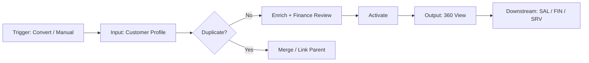

#### 4.3.3 State Machine

| Category | States |
|----------|--------|
| **Initial** | PROSPECT |
| **Intermediate** | ON_HOLD |
| **Terminal** | INACTIVE, ARCHIVED |
| **Active commercial** | ACTIVE |
| **Blocked** | SUSPENDED |
| **Cancelled** | CANCELLED |

| From | To | Actor | Guard | Valid |
|------|-----|-------|-------|-------|
| PROSPECT | ACTIVE | Sales Manager / Finance | BR-CRM-043, 044 (contact + address) | ✓ |
| PROSPECT | ACTIVE | System | Auto-promote at Proposal stage (BR-CRM-052) | ✓ |
| ACTIVE | SUSPENDED | Finance User | BR-CRM-055 (reason + comment) | ✓ |
| SUSPENDED | ACTIVE | Finance User | Release with audit | ✓ |
| ACTIVE | INACTIVE | Sales Manager | No open opps (BR-CRM-050) | ✓ |
| ARCHIVED | *new opp* | — | BR-CRM-059 blocked | ✗ |

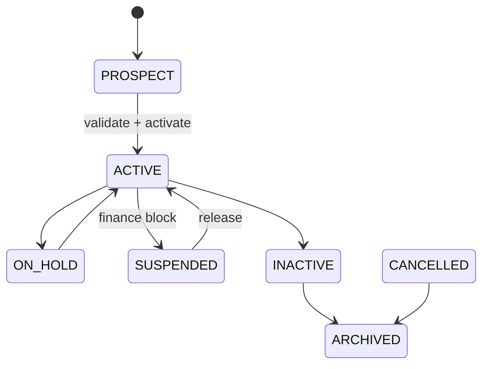

#### 4.3.4 Ownership Matrix

| Role | Owner | Reviewer | Approver | Executor | Watcher | Notification | Escalation |
|------|:-----:|:--------:|:--------:|:--------:|:-------:|:------------:|:----------:|
| Sales Executive | ● (account) | — | — | ● | — | Created / assigned | Sales Manager |
| Sales Manager | — | ● | ● (activate, merge) | ● | ● | Activation | Tenant Admin |
| Pre-Sales | — | ○ | — | — | ● | — | Sales Manager |
| Finance User | — | ● | ● (suspend, credit) | ● | ● | Suspension | Finance Head |
| Support Agent | — | ○ | — | ○ | ● | Ticket link | Support Manager |
| Tenant Admin | — | — | ● (merge, config) | ○ | ● | Merge complete | — |

#### 4.3.5 Exception Handling

| Exception Type | Condition | System Behaviour | Audit |
|----------------|-----------|------------------|-------|
| **Rejected** | Activation without primary contact | 422 BR-CRM-043 | `customer.validation.failed` |
| **Expired** | Prospect inactive > 180 days | Warning to owner | `customer.prospect.stale` |
| **Cancelled** | Created in error | CANCELLED | `customer.cancelled` |
| **Duplicate** | Matching GSTIN / name (BR-CRM-045) | Block or warning + merge preview | `customer.duplicate.warning` |
| **Rollback** | Failed merge transaction | Revert both records | `customer.merge.rollback` |
| **Retry** | Tax validation service timeout | Retry ×3; flag manual review | `customer.tax.retry` |
| **Re-open** | INACTIVE → ACTIVE | Allowed with manager approval | `customer.reactivated` |
| **Escalation** | Suspended customer quotation attempt | Block + notify owner (BR-CRM-049) | `customer.suspension.blocked` |
| **Business Exception** | Child assigned as parent | 422 BR-CRM-048 | `customer.hierarchy.invalid` |
| **System Exception** | DB failure on activate | 500; no partial write | `system.error` |

#### 4.3.6 Workflow Timing / SLA

| Metric | Target | Max SLA | Escalation | Reminder |
|--------|--------|---------|------------|----------|
| Lead convert → customer created | < 3 s (part of convert txn) | 10 s | — | NTF-CRM-CUS-001 |
| Prospect → profile enriched | 3 business days | 10 business days | Day 10 → Manager | — |
| Finance tax validation | 2 business days | 5 business days | Day 5 → Finance Head | NTF-CRM-CUS-005 |
| Activation after validation | 1 business day | 3 business days | — | NTF-CRM-CUS-002 |
| Suspension notification | Immediate | 1 hour | — | NTF-CRM-CUS-006 |
| Customer 360 API | < 1.5 s p95 | 4 s | — | — |
| Duplicate check | < 500 ms p95 | 2 s | — | — |

#### 4.3.7 Database Impact

| Table | Type | Operation | Notes |
|-------|------|-----------|-------|
| `customer` | Master | INSERT, UPDATE | Core account; unique name per tenant |
| `customer_contact` | Transaction | INSERT, UPDATE, DELETE | ≥1 primary for Active |
| `customer_address` | Transaction | INSERT, UPDATE, DELETE | Registered/Billing required |
| `customer_segment` | Lookup | READ | Classification |
| `customer_industry` | Lookup | READ | — |
| `customer_credit_class` | Lookup | READ/UPDATE | Finance only |
| `customer_tax_registration` | Transaction | INSERT, UPDATE | GSTIN validation |
| `customer_relationship` | Link | INSERT | Parent/child (1 level) |
| `customer_status_history` | Audit | INSERT | Status transitions |
| `customer_note` | Transaction | INSERT | Internal notes |
| `opportunity` | Transaction | READ | 360 view; FK restrict |
| `activity` / `activity_link` | Transaction/Link | READ/INSERT | WF-CRM-004 |
| `audit_event` | Audit | INSERT | All mutations |

#### 4.3.8 API Mapping

| Method | Path | Purpose | Permission | BR Ref |
|--------|------|---------|------------|--------|
| POST | `/api/v1/crm/customers` | Create | `customer.create` | BR-CRM-041, 045, 046 |
| GET | `/api/v1/crm/customers` | List | `customer.read` | — |
| GET | `/api/v1/crm/customers/{id}` | Get | `customer.read` | — |
| GET | `/api/v1/crm/customers/{id}/360` | 360 view | `customer.read` | — |
| PUT | `/api/v1/crm/customers/{id}` | Full update | `customer.update` | BR-CRM-047, 051 |
| PATCH | `/api/v1/crm/customers/{id}` | Partial update | `customer.update` | — |
| PATCH | `/api/v1/crm/customers/{id}/status` | Change status | `customer.update` | BR-CRM-050, 055 |
| DELETE | `/api/v1/crm/customers/{id}` | Soft delete | `customer.delete` | BR-CRM-060 |
| POST | `/api/v1/crm/customers/{id}/restore` | Restore | `customer.restore` | — |
| POST | `/api/v1/crm/customers/{id}/suspend` | Suspend | `customer.suspend` | BR-CRM-047, 055 |
| POST | `/api/v1/crm/customers/{id}/activate` | Activate | `customer.activate` | BR-CRM-043, 044 |
| GET | `/api/v1/crm/customers/search` | Advanced search | `customer.read` | — |
| GET | `/api/v1/crm/customers/export` | Export | `customer.export` | BR-CRM-053 |
| POST | `/api/v1/crm/customers/duplicate-check` | Duplicate preview | `customer.create` | BR-CRM-045 |
| POST | `/api/v1/crm/customers/{id}/merge` | Merge duplicate | `customer.merge` | BR-CRM-058 |
| POST | `/api/v1/crm/customers/{id}/contacts` | Add contact | `customer.update` | BR-CRM-056 |
| POST | `/api/v1/crm/customers/{id}/addresses` | Add address | `customer.update` | BR-CRM-057 |
| GET | `/api/v1/crm/customers/{id}/opportunities` | Linked opps | `customer.read` | — |
| GET | `/api/v1/crm/customers/{id}/activities` | Timeline | `customer.read` | — |

#### 4.3.9 Flutter Mapping

| Screen ID | Screen | Route | Workflow Step |
|-----------|--------|-------|---------------|
| UI-CRM-CUS-001 | Customer List | `/crm/customers` | Browse accounts |
| UI-CRM-CUS-002 | Customer Create | `/crm/customers/new` | Manual create |
| UI-CRM-CUS-003 | Customer Edit | `/crm/customers/{id}/edit` | Enrich profile |
| UI-CRM-CUS-004 | Customer Detail | `/crm/customers/{id}` | View + timeline |
| UI-CRM-CUS-005 | Customer 360 | `/crm/customers/{id}/360` | Aggregated view |
| UI-CRM-CUS-006 | Contact Manager | `/crm/customers/{id}/contacts` | Manage contacts |
| UI-CRM-CUS-007 | Address Manager | `/crm/customers/{id}/addresses` | Manage addresses |
| UI-CRM-CUS-008 | Customer Search | `/crm/customers/search` | Advanced search |
| UI-CRM-CUS-009 | Suspend Dialog | Modal | Finance suspend |
| UI-CRM-CUS-010 | Merge Preview | `/crm/customers/merge` | Duplicate merge |
| UI-CRM-CUS-011 | Segment Admin | `/crm/settings/customer-segments` | Config |
| UI-CRM-CUS-012 | Customer History | `/crm/customers/{id}/history` | Status audit |

#### 4.3.10 Notification Matrix

| Event ID | Trigger | Email | Push | Internal | Recipients | Template |
|----------|---------|:-----:|:----:|:--------:|------------|----------|
| NTF-CRM-CUS-001 | New customer created | — | — | ✓ | Owner, Manager | `customer.created` |
| NTF-CRM-CUS-002 | Customer activated | — | — | ✓ | Owner, Finance | `customer.activated` |
| NTF-CRM-CUS-003 | Primary contact changed | — | — | ✓ | Owner | `customer.contact.changed` |
| NTF-CRM-CUS-004 | Duplicate detected | — | — | ✓ | Creator, Manager | `customer.duplicate.warning` |
| NTF-CRM-CUS-005 | Tax ID validation failed | — | — | ✓ | Creator, Finance | `customer.tax.invalid` |
| NTF-CRM-CUS-006 | Customer suspended | ✓ | — | ✓ | Owner, Manager, Sales | `customer.suspended` |
| NTF-CRM-CUS-007 | Suspension released | — | — | ✓ | Owner, Finance | `customer.reactivated` |
| NTF-CRM-CUS-008 | Account owner assigned | — | ✓ | ✓ | New owner | `customer.assigned` |
| NTF-CRM-CUS-009 | Merge completed | — | — | ✓ | Manager, Owner | `customer.merged` |

#### 4.3.11 Reporting Impact

| Report ID | Name | Type | KPI |
|-----------|------|------|-----|
| RPT-CRM-CUS-001 | Customer Register | Operational | Accounts by status |
| RPT-CRM-CUS-002 | New Customers by Period | Management | Acquisition rate |
| RPT-CRM-CUS-003 | Customer by Segment | Management | Segment distribution |
| RPT-CRM-CUS-004 | Account Owner Workload | Operational | Customers per owner |
| RPT-CRM-CUS-005 | Suspended Accounts | Operational | Credit risk |
| RPT-CRM-CUS-006 | Customer 360 Summary | Executive | Revenue per account |
| RPT-CRM-CUS-007 | Duplicate Candidate List | Operational | Data quality |

#### 4.3.12 Security

| Control | Implementation |
|---------|----------------|
| **RBAC** | Finance-only for `credit_classification`, suspend (BR-CRM-047) |
| **Tenant isolation** | BR-CRM-054: JWT `tenant_id` enforced |
| **PII masking** | BR-CRM-053: export masks PII without `customer.export.full` |
| **Suspension gate** | BR-CRM-049: blocks new SAL transactions |
| **Hierarchy** | BR-CRM-048: 1-level parent/child only |
| **Immutability** | BR-CRM-051: `customer_id` on opp locked after quotation |
| **Merge** | BR-CRM-058: requires `customer.merge` + manager approval |
| **Support read** | Support Agent read-only on customer for ticket context |

#### 4.3.13 Audit Trail

| Event | Payload | Retention |
|-------|---------|-----------|
| `customer.created` | Snapshot, source (lead/manual) | 7 years |
| `customer.updated` | Field diff | 7 years |
| `customer.status_changed` | Old/new status, reason | 7 years |
| `customer.suspended` / `reactivated` | Finance user, reason code | 7 years |
| `customer.contact_added` / `updated` / `removed` | Contact id | 7 years |
| `customer.address_added` / `updated` / `removed` | Address id | 7 years |
| `customer.assigned` | Old/new `account_owner_id` | 7 years |
| `customer.merged` | Source/target ids | 7 years |
| `customer.exported` | Criteria, row count | 7 years |

#### 4.3.14 Acceptance Criteria

| Category | ID | Criterion |
|----------|-----|-----------|
| **Functional** | AC-CRM-CUS-001 | Lead convert creates Prospect with contacts copied |
| **Functional** | AC-CRM-CUS-002 | Duplicate GSTIN blocks create (BR-CRM-045) |
| **Functional** | AC-CRM-CUS-003 | Activate without primary contact fails (BR-CRM-043) |
| **Functional** | AC-CRM-CUS-004 | Suspended customer blocks quotation (BR-CRM-049) |
| **Functional** | AC-CRM-CUS-005 | 360 API returns linked opps, activities, counts |
| **Technical** | AC-CRM-CUS-006 | Cross-tenant customer id returns 404 |
| **Technical** | AC-CRM-CUS-007 | Auto-promote at Proposal stage when configured (BR-CRM-052) |
| **Performance** | AC-CRM-CUS-008 | Customer 360 p95 < 1.5 s |
| **Security** | AC-CRM-CUS-009 | Sales Executive editing credit class returns 403 |
| **Security** | AC-CRM-CUS-010 | Export masks PII without full export permission |

#### 4.3.15 Future Enhancement (v2 / v3 / AI)

| Version | Enhancement | Engine |
|---------|-------------|--------|
| v2.1 | Customer merge wizard with field survivorship | CPS-001 |
| v2.2 | DUNS / external enrichment (INT-003) | CPS-008 |
| v3.0 | Customer self-service portal | PF + CRM |
| v3.0 | Multi-level account hierarchy | — |
| v3.1 | KYC document vault integration | CPS-006 |
---


---

#### V1.0 Enterprise Ready Pack — WF-CRM-003

## WF-CRM-003 — Customer Master Lifecycle

**Domain:** CRM · **Module:** CRM-003 Customer Management · **Tenant:** Euphoria

### V1.0 — Requirement IDs

| Requirement ID | Description | Priority | Related BR |
|----------------|-------------|----------|------------|
| REQ-CRM-025 | Create customer manually or auto from lead conversion as PROSPECT | Critical | BR-CRM-041, BR-CRM-046 |
| REQ-CRM-026 | Activate customer with primary contact and registered/billing address | Critical | BR-CRM-043, BR-CRM-044 |
| REQ-CRM-027 | Detect duplicate customer by GSTIN / trade name | Critical | BR-CRM-045 |
| REQ-CRM-028 | Suspend customer for credit risk; block new SAL transactions | Critical | BR-CRM-047, BR-CRM-049, BR-CRM-055 |
| REQ-CRM-029 | Release suspension and reactivate to ACTIVE | High | BR-CRM-055 |
| REQ-CRM-030 | Merge duplicate customers with manager approval | High | BR-CRM-058 |
| REQ-CRM-031 | Maintain 360 view: linked opportunities, activities, counts | High | BR-CRM-054 |
| REQ-CRM-032 | Auto-promote PROSPECT → ACTIVE at Proposal stage when configured | Medium | BR-CRM-052 |
| REQ-CRM-033 | Deactivate customer only when no open opportunities | High | BR-CRM-050 |
| REQ-CRM-034 | Enforce single-level parent/child account hierarchy | Medium | BR-CRM-048 |
| REQ-CRM-035 | Lock `customer_id` on opportunity after quotation issued | High | BR-CRM-051 |
| REQ-CRM-036 | Export customer register with PII masking per permission | Medium | BR-CRM-053 |

### V1.0 — Requirements Traceability Matrix (RTM)

| Requirement | Workflow | Table | API | Flutter Screen | Test Case |
|-------------|----------|-------|-----|----------------|-----------|
| REQ-CRM-025 | WF-CRM-003 | `customer`, `customer_contact` | `POST /api/v1/crm/customers` | UI-CRM-CUS-002 Customer Create | TC-CRM-003-01 |
| REQ-CRM-026 | WF-CRM-003 | `customer`, `customer_status_history` | `POST /api/v1/crm/customers/{id}/activate` | UI-CRM-CUS-004 Customer Detail | TC-CRM-003-02 |
| REQ-CRM-027 | WF-CRM-003 | `customer`, `customer_tax_registration` | `POST /api/v1/crm/customers/duplicate-check` | UI-CRM-CUS-002 Customer Create | TC-CRM-003-03 |
| REQ-CRM-028 | WF-CRM-003 | `customer`, `customer_credit_class` | `POST /api/v1/crm/customers/{id}/suspend` | UI-CRM-CUS-009 Suspend Dialog | TC-CRM-003-04 |
| REQ-CRM-029 | WF-CRM-003 | `customer` | `PATCH /api/v1/crm/customers/{id}/status` | UI-CRM-CUS-004 Customer Detail | TC-CRM-003-05 |
| REQ-CRM-030 | WF-CRM-003 | `customer`, `customer_relationship` | `POST /api/v1/crm/customers/{id}/merge` | UI-CRM-CUS-010 Merge Preview | TC-CRM-003-06 |
| REQ-CRM-031 | WF-CRM-003 | `customer`, `opportunity`, `activity` | `GET /api/v1/crm/customers/{id}/360` | UI-CRM-CUS-005 Customer 360 | TC-CRM-003-07 |
| REQ-CRM-032 | WF-CRM-003 | `customer` | (system on opp stage change) | — | TC-CRM-003-08 |
| REQ-CRM-033 | WF-CRM-003 | `customer`, `opportunity` | `PATCH /api/v1/crm/customers/{id}/status` | UI-CRM-CUS-004 Customer Detail | TC-CRM-003-09 |
| REQ-CRM-034 | WF-CRM-003 | `customer_relationship` | `PUT /api/v1/crm/customers/{id}` | UI-CRM-CUS-003 Customer Edit | TC-CRM-003-10 |
| REQ-CRM-035 | WF-CRM-003 | `opportunity` | (enforced on SAL-001 link) | — | TC-CRM-003-11 |
| REQ-CRM-036 | WF-CRM-003 | `customer` | `GET /api/v1/crm/customers/export` | UI-CRM-CUS-001 Customer List | TC-CRM-003-12 |

### V1.0 — State Transition Diagram

```
    ┌──────────┐
    │ PROSPECT │
    └────┬─────┘
         │ validate + activate
         ▼
    ┌────────┐     on hold      ┌─────────┐
    │ ACTIVE │◄────────────────►│ ON_HOLD │
    └───┬────┘                  └─────────┘
        │ finance block
        ▼
   ┌───────────┐
   │ SUSPENDED │──── release ────► ACTIVE
   └───────────┘
        │
        ▼ deactivate (no open opps)
   ┌──────────┐
   │ INACTIVE │────► ARCHIVED
   └──────────┘
```

**Allowed Transitions**

| From | To | Actor | Guard |
|------|-----|-------|-------|
| PROSPECT | ACTIVE | Sales Manager / Finance | BR-CRM-043, BR-CRM-044 (contact + address) |
| PROSPECT | ACTIVE | System | Auto-promote at Proposal stage (BR-CRM-052) |
| ACTIVE | ON_HOLD | Sales Manager | — |
| ON_HOLD | ACTIVE | Sales Manager | Resume |
| ACTIVE | SUSPENDED | Finance User | BR-CRM-055 (reason + comment) |
| SUSPENDED | ACTIVE | Finance User | Release with audit |
| ACTIVE | INACTIVE | Sales Manager | No open opps (BR-CRM-050) |
| INACTIVE | ACTIVE | Sales Manager | Manager approval (re-activate) |
| INACTIVE | ARCHIVED | System | Archive job |
| CANCELLED | ARCHIVED | System | — |

**Invalid Transitions**

| From | To | Reason |
|------|-----|--------|
| ARCHIVED | any new opp | BR-CRM-059 blocked |
| ACTIVE | INACTIVE | Open opportunities exist |
| Child assigned as parent | — | BR-CRM-048 hierarchy invalid |

**Re-open Rules**

| Scenario | Allowed | Condition |
|----------|---------|-----------|
| INACTIVE → ACTIVE | Yes | Sales Manager approval with audit |
| SUSPENDED → ACTIVE | Yes | Finance User release with reason |
| ARCHIVED → ACTIVE | No | Historical record only |

**Rollback Rules**

| Scenario | Rollback Action |
|----------|-----------------|
| Failed merge transaction | Revert both records; no partial merge |
| Tax validation service timeout | Retry ×3; flag manual review |
| Activation without primary contact | 422; no status change |

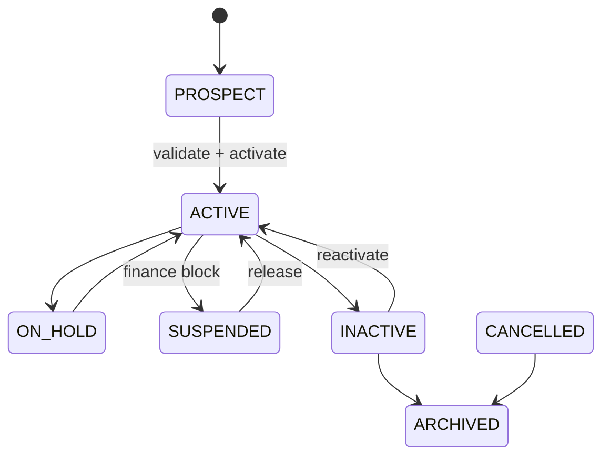

### V1.0 — CRUD Responsibility Matrix

| Role | Create | Read | Update | Approve | Delete |
|------|:------:|:----:|:------:|:-------:|:------:|
| Sales Executive | ✔ | ✔ (own accounts) | ✔ (own) | ✘ | ✘ |
| Sales Manager | ✔ | ✔ (all) | ✔ (all) | ✔ (activate, merge) | ✔ |
| Tenant Admin | ✔ | ✔ (all) | ✔ (all) | ✔ (merge, config) | ✔ |
| Platform Admin | ✘ | ✔ (audit) | ✘ | ✘ | ✘ |
| Finance User | ✘ | ✔ (all) | ✔ (credit, suspend) | ✔ (suspend) | ✘ |
| Pre-Sales | ✘ | ✔ (linked opps) | ✘ | ✘ | ✘ |
| Support Agent | ✘ | ✔ (ticket context) | ✘ | ✘ | ✘ |

### V1.0 — Non-Functional Requirements

| NFR ID | Category | Requirement | Target |
|--------|----------|-------------|--------|
| NFR-CRM-027 | Performance | Customer 360 API (opps + activities + counts) | P95 < 1.5 s |
| NFR-CRM-028 | Performance | Duplicate check API | P95 < 500 ms |
| NFR-CRM-029 | Performance | Customer list (paginated) | P95 < 800 ms |
| NFR-CRM-030 | Security | Tenant isolation (BR-CRM-054) | Cross-tenant returns 404 |
| NFR-CRM-031 | Security | Finance-only for `credit_classification` and suspend | 403 on violation |
| NFR-CRM-032 | Security | PII masked in export without `customer.export.full` | BR-CRM-053 |
| NFR-CRM-033 | Audit | Status, suspend, merge, contact changes → `audit_event` | 7 years retention |
| NFR-CRM-034 | Audit | `customer_status_history` on every transition | 100% coverage |
| NFR-CRM-035 | Scalability | 360 view for accounts with 100+ linked activities | Paginated timeline |
| NFR-CRM-036 | Availability | Customer API availability | 99.5% monthly uptime |
| NFR-CRM-037 | Availability | Suspension blocks quotation within 1 s of status change | BR-CRM-049 |
| NFR-CRM-038 | Data Retention | Customer master and audit events | 7 years |
| NFR-CRM-039 | Data Retention | Soft-deleted customers | 90-day restore window |

### V1.0 — UI Navigation

```
[CRM Home]
    │
    ▼
┌─────────────────┐
│ UI-CRM-CUS-001  │  /crm/customers
│ Customer List   │  Filter · Export
└────────┬────────┘
         │ [+ New]
         ▼
┌─────────────────┐
│ UI-CRM-CUS-002  │  /crm/customers/new
│ Customer Create │  Duplicate check on GSTIN
└────────┬────────┘
         │
         ▼
┌─────────────────┐
│ UI-CRM-CUS-004  │  /crm/customers/{id}
│ Customer Detail │  Timeline embed
└────────┬────────┘
         ├──► UI-CRM-CUS-003 Edit           /crm/customers/{id}/edit
         ├──► UI-CRM-CUS-005 360 View       /crm/customers/{id}/360
         ├──► UI-CRM-CUS-006 Contacts       /crm/customers/{id}/contacts
         ├──► UI-CRM-CUS-007 Addresses     /crm/customers/{id}/addresses
         ├──► UI-CRM-CUS-009 Suspend        (modal, Finance)
         ├──► UI-CRM-CUS-012 History        /crm/customers/{id}/history
         └──► UI-CRM-CUS-010 Merge Preview  /crm/customers/merge

    UI-CRM-CUS-008 Customer Search           /crm/customers/search
    UI-CRM-CUS-011 Segment Admin             /crm/settings/customer-segments
```

### V1.0 — API Contract Summary

| Method | Endpoint | Purpose |
|--------|----------|---------|
| POST | `/api/v1/crm/customers` | Create customer |
| GET | `/api/v1/crm/customers` | List customers |
| GET | `/api/v1/crm/customers/{id}` | Get customer |
| GET | `/api/v1/crm/customers/{id}/360` | 360 aggregated view |
| PUT | `/api/v1/crm/customers/{id}` | Full update |
| PATCH | `/api/v1/crm/customers/{id}` | Partial update |
| PATCH | `/api/v1/crm/customers/{id}/status` | Change status |
| DELETE | `/api/v1/crm/customers/{id}` | Soft delete |
| POST | `/api/v1/crm/customers/{id}/restore` | Restore |
| POST | `/api/v1/crm/customers/{id}/suspend` | Suspend (Finance) |
| POST | `/api/v1/crm/customers/{id}/activate` | Activate |
| GET | `/api/v1/crm/customers/search` | Advanced search |
| GET | `/api/v1/crm/customers/export` | Export |
| POST | `/api/v1/crm/customers/duplicate-check` | Duplicate preview |
| POST | `/api/v1/crm/customers/{id}/merge` | Merge duplicate |
| POST | `/api/v1/crm/customers/{id}/contacts` | Add contact |
| POST | `/api/v1/crm/customers/{id}/addresses` | Add address |
| GET | `/api/v1/crm/customers/{id}/opportunities` | Linked opportunities |
| GET | `/api/v1/crm/customers/{id}/activities` | Activity timeline |

### 4.4 WF-CRM-004 — Activity Timeline

| Attribute | Detail |
|-----------|--------|
| **Module** | CRM-004 Activity Management |
| **Actors** | Any authorised user |

#### Flow

```text
Create Activity (Call / Email / Meeting / Task / Note)
   → Link to Lead / Opportunity / Customer / Project / Ticket
   → Set due date & assignee
   → Complete / Reschedule / Cancel
   → Appear on unified timeline & reminders
```

Notifications fire for due/overdue activities via Notification Engine.


---

#### EFS Enrichment — WF-CRM-004

### WF-CRM-004 — Activity Timeline (EFS Enrichment)

#### 4.4.1 Workflow Traceability

| Attribute | Value |
|-----------|-------|
| **Workflow ID** | WF-CRM-004 |
| **Domain** | CRM |
| **Module** | CRM-004 Activity Management |
| **Sub Module** | CRM-004-001 Activities |
| **Feature** | CRM-004-001-001 Activity Timeline |
| **Business Process** | Unified Activity Timeline |
| **Priority** | High \| Phase 2 \| v2.0 |
| **Related Modules** | CRM-001 Lead, CRM-002 Opportunity, CRM-003 Customer, CPS-003 Notification, CPS-005 Audit |
| **Dependent Workflows** | WF-PF-002 (users), WF-CRM-001/002/003 (link targets) |
| **Downstream Workflows** | SAL, PRJ, SRV modules reuse `activity_link` pattern |
| **Related Documents** | ELU-BFS-CRM-004, ELU-API-CRM, ELU-UI-CRM |
| **Primary Table** | `activity` |
| **Related Tables** | `activity_link`, `activity_type`, `activity_outcome`, `activity_attendee`, `activity_reminder`, `activity_attachment`, `lead`, `opportunity`, `customer` |
| **Related Flutter Screens** | UI-CRM-ACT-001 … UI-CRM-ACT-013 (embedded + standalone) |
| **Related REST APIs** | `/api/v1/crm/activities/*`, `/api/v1/crm/activity-types/*`, entity shortcuts |
| **Related Reports** | RPT-CRM-ACT-001 … RPT-CRM-ACT-007 |
| **Business Rules** | BR-CRM-005 (communications logged); BR-CRM-061 … BR-CRM-080 (BFS activity rules) |
| **Notifications** | NTF-CRM-ACT-001 … NTF-CRM-ACT-009 |
| **Roles** | Sales Executive, Sales Manager, Pre-Sales, Finance User, Support Agent, Tenant Admin |
| **Permissions** | `activity.create`, `activity.read`, `activity.update`, `activity.update.all`, `activity.delete`, `activity.assign`, `activity.complete`, `activity.export`, `activity.configure` |

#### 4.4.2 Input / Output Definition

| Element | Definition |
|---------|------------|
| **Input** | Activity payload: type (Call/Email/Meeting/Task/Note), subject, description, `activity_at`, `due_date`, assignee, outcome, entity links |
| **Trigger** | User logs activity on Lead/Opp/Customer detail; scheduler fires reminders; manager bulk-complete |
| **Processing** | Validate type rules → create `activity` + `activity_link` → schedule reminders → complete/cancel → compliance roll-up |
| **Output** | `activity` record; polymorphic `activity_link`; timeline API response; reminder jobs |
| **Next Workflow** | Feeds qualification (WF-CRM-001), pipeline discipline (WF-CRM-002), 360 view (WF-CRM-003) |

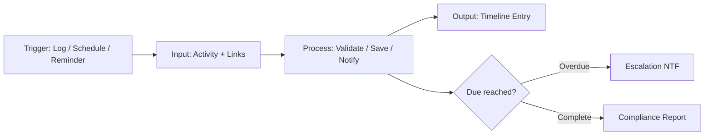

#### 4.4.3 State Machine

| Category | States |
|----------|--------|
| **Initial** | PLANNED (Task/Meeting), COMPLETED (Note on create) |
| **Intermediate** | IN_PROGRESS, OVERDUE (system flag) |
| **Terminal** | COMPLETED |
| **Cancelled** | CANCELLED |
| **Archived** | ARCHIVED (soft-deleted) |

| From | To | Actor | Guard | Valid |
|------|-----|-------|-------|-------|
| PLANNED | COMPLETED | Assignee | Outcome required for CALL/MEETING/TASK (BR-CRM-063) | ✓ |
| PLANNED | OVERDUE | System | `due_date` < today (BR-CRM-071) | ✓ |
| OVERDUE | COMPLETED | Assignee | Outcome required | ✓ |
| COMPLETED | *delete* | Sales Executive | — | ✗ |
| COMPLETED | ARCHIVED | Sales Manager | Reason required (BR-CRM-068) | ✓ |
| PLANNED | CANCELLED | Creator/Manager | Cancel reason for TASK/MEETING (BR-CRM-079) | ✓ |

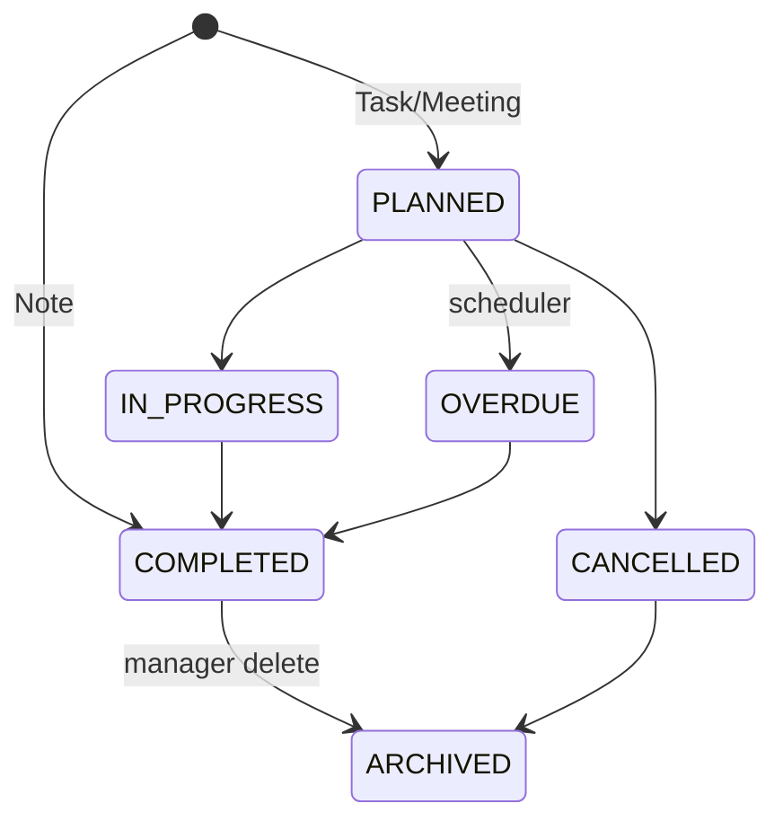

#### 4.4.4 Ownership Matrix

| Role | Owner | Reviewer | Approver | Executor | Watcher | Notification | Escalation |
|------|:-----:|:--------:|:--------:|:--------:|:-------:|:------------:|:----------:|
| Sales Executive | ● | — | — | ● | — | Assigned / overdue | Sales Manager |
| Sales Manager | — | ● | ● (bulk complete, delete) | ● | ● | Team compliance | Tenant Admin |
| Pre-Sales | ● (assigned) | — | — | ● | — | Meeting scheduled | Sales Manager |
| Finance User | — | ○ | — | — | ● (read) | — | — |
| Support Agent | ● (ticket-linked) | — | — | ● | — | Task assigned | Support Manager |
| Scheduler | — | — | — | ● | — | Reminder / overdue | — |

#### 4.4.5 Exception Handling

| Exception Type | Condition | System Behaviour | Audit |
|----------------|-----------|------------------|-------|
| **Rejected** | Complete without outcome (CALL) | 422 BR-CRM-063 | `activity.validation.failed` |
| **Expired** | Reminder job missed | Catch-up on next scheduler run | `activity.reminder.missed` |
| **Cancelled** | User cancels meeting/task | CANCELLED; reminders cancelled | `activity.cancelled` |
| **Duplicate** | Offline sync duplicate (Android) | Idempotent key dedup | `activity.sync.deduped` |
| **Rollback** | Failed multi-link insert | Rollback activity + links | `activity.rollback` |
| **Retry** | Notification delivery failure | Retry ×3 via CPS-003 | `activity.notification.retry` |
| **Re-open** | Completed → edit | Blocked; create new activity | — |
| **Escalation** | Overdue > 3 days | NTF-CRM-ACT-009 to Manager | `activity.escalation` |
| **Business Exception** | Link to other-tenant entity | 404 BR-CRM-069 | `activity.security.violation` |
| **System Exception** | Scheduler failure | Alert ops; manual catch-up | `system.error` |

#### 4.4.6 Workflow Timing / SLA

| Metric | Target | Max SLA | Escalation | Reminder |
|--------|--------|---------|------------|----------|
| Activity create → timeline visible | < 2 s | 5 s | — | — |
| Reminder delivery | 09:00 tenant TZ, 1 day before due (BR-CRM-072) | ±15 min | — | NTF-CRM-ACT-003 |
| Overdue detection | Daily 00:05 Asia/Kolkata | — | Day 3 → Manager | NTF-CRM-ACT-004 |
| Manager compliance digest | Weekly Monday 08:00 | — | — | NTF-CRM-ACT-008 |
| Daily user digest | Daily 07:30 | — | — | NTF-CRM-ACT-007 |
| Timeline API (100/page) | < 600 ms p95 | 2 s | — | — |
| Bulk complete (50 items) | < 5 s | 15 s | — | — |

#### 4.4.7 Database Impact

| Table | Type | Operation | Notes |
|-------|------|-----------|-------|
| `activity` | Transaction | INSERT, UPDATE | Core record; `tenant_id` from JWT |
| `activity_link` | Link | INSERT, DELETE | Polymorphic: LEAD, OPPORTUNITY, CUSTOMER |
| `activity_type` | Lookup | READ | Call, Email, Meeting, Task, Note |
| `activity_outcome` | Lookup | READ | Per-type outcomes |
| `activity_attendee` | Transaction | INSERT | Meeting attendees |
| `activity_reminder` | Transaction | INSERT, UPDATE | Scheduled reminders |
| `activity_attachment` | Link | INSERT | Optional files |
| `lead` / `opportunity` / `customer` | Master/Txn | READ | Link target validation |
| `audit_event` | Audit | INSERT | All mutations |

**Index:** `(tenant_id, entity_type, entity_id, activity_id)` on `activity_link`.

#### 4.4.8 API Mapping

| Method | Path | Purpose | Permission | BR Ref |
|--------|------|---------|------------|--------|
| POST | `/api/v1/crm/activities` | Create | `activity.create` | BR-CRM-061, 062, 064, 073 |
| GET | `/api/v1/crm/activities` | Global list | `activity.read` | — |
| GET | `/api/v1/crm/activities/{id}` | Get by ID | `activity.read` | — |
| PUT | `/api/v1/crm/activities/{id}` | Full update | `activity.update` | BR-CRM-067 |
| PATCH | `/api/v1/crm/activities/{id}` | Partial update | `activity.update` | — |
| PATCH | `/api/v1/crm/activities/{id}/complete` | Complete | `activity.complete` | BR-CRM-063, 074 |
| PATCH | `/api/v1/crm/activities/{id}/cancel` | Cancel | `activity.update` | BR-CRM-079 |
| DELETE | `/api/v1/crm/activities/{id}` | Soft delete | `activity.delete` | BR-CRM-068 |
| POST | `/api/v1/crm/activities/{id}/assign` | Reassign | `activity.assign` | BR-CRM-066 |
| POST | `/api/v1/crm/activities/{id}/links` | Add entity link | `activity.update` | BR-CRM-069, 070 |
| GET | `/api/v1/crm/activities/timeline` | Timeline by entity | `activity.read` | BR-CRM-076 |
| GET | `/api/v1/crm/leads/{id}/activities` | Lead shortcut | `activity.read` | — |
| GET | `/api/v1/crm/opportunities/{id}/activities` | Opp shortcut | `activity.read` | — |
| GET | `/api/v1/crm/customers/{id}/activities` | Customer shortcut | `activity.read` | — |
| GET | `/api/v1/crm/activities/upcoming` | User upcoming | `activity.read` | — |
| GET | `/api/v1/crm/activities/overdue` | Overdue tasks | `activity.read` | — |
| GET | `/api/v1/crm/activities/search` | Search | `activity.read` | — |
| GET | `/api/v1/crm/activities/export` | Export | `activity.export` | BR-CRM-077 |
| POST | `/api/v1/crm/activities/bulk-complete` | Manager bulk | `activity.update.all` | — |
| GET | `/api/v1/crm/activity-types` | List types | `activity.read` | — |
| GET | `/api/v1/crm/activity-outcomes` | List outcomes | `activity.read` | — |

#### 4.4.9 Flutter Mapping

| Screen ID | Screen | Route | Workflow Step | Offline |
|-----------|--------|-------|---------------|---------|
| UI-CRM-ACT-001 | Timeline Widget | Embedded on detail | View timeline | Read cache |
| UI-CRM-ACT-002 | Log Activity Dialog | Modal | Quick log call/note | — |
| UI-CRM-ACT-003 | Schedule Meeting | `/crm/activities/meeting/new` | Plan meeting | — |
| UI-CRM-ACT-004 | Create Task | `/crm/activities/task/new` | Plan task | Draft sync |
| UI-CRM-ACT-005 | Activity Detail | `/crm/activities/{id}` | View single | — |
| UI-CRM-ACT-006 | Activity Edit | `/crm/activities/{id}/edit` | Edit planned | — |
| UI-CRM-ACT-007 | My Activities | `/crm/activities/my` | Personal queue | Read cache |
| UI-CRM-ACT-008 | Team Activities | `/crm/activities/team` | Manager view | — |
| UI-CRM-ACT-009 | Overdue Activities | `/crm/activities/overdue` | Escalation queue | — |
| UI-CRM-ACT-010 | Upcoming List | `/crm/activities/upcoming` | Calendar list | — |
| UI-CRM-ACT-011 | Activity Search | `/crm/activities/search` | Advanced search | — |
| UI-CRM-ACT-012 | Type Admin | `/crm/settings/activity-types` | Config | — |
| UI-CRM-ACT-013 | Complete Dialog | Modal | Mark complete | — |

**Embed points:** UI-CRM-LD-004, UI-CRM-OPP-005, UI-CRM-CUS-004/005.

#### 4.4.10 Notification Matrix

| Event ID | Trigger | Email | Push | Internal | Recipients | Template |
|----------|---------|:-----:|:----:|:--------:|------------|----------|
| NTF-CRM-ACT-001 | Activity assigned | — | ✓ | ✓ | Assignee | `activity.assigned` |
| NTF-CRM-ACT-002 | Activity completed | — | — | ✓ | Record owner | `activity.completed` |
| NTF-CRM-ACT-003 | Upcoming reminder | ✓ | ✓ | ✓ | Assignee | `activity.reminder.upcoming` |
| NTF-CRM-ACT-004 | Task overdue | ✓ | ✓ | ✓ | Assignee, Manager | `activity.overdue` |
| NTF-CRM-ACT-005 | Meeting scheduled | ✓ | — | ✓ | Attendees | `activity.meeting.scheduled` |
| NTF-CRM-ACT-006 | Activity cancelled | — | — | ✓ | Assignee, Creator | `activity.cancelled` |
| NTF-CRM-ACT-007 | Daily digest | ✓ | — | — | Sales Executive | `activity.daily.digest` |
| NTF-CRM-ACT-008 | Weekly compliance | ✓ | — | — | Sales Manager | `activity.compliance.weekly` |
| NTF-CRM-ACT-009 | Escalation > 3 days | ✓ | — | ✓ | Sales Manager | `activity.escalation` |

#### 4.4.11 Reporting Impact

| Report ID | Name | Type | KPI |
|-----------|------|------|-----|
| RPT-CRM-ACT-001 | Activity Log | Operational | Volume by type |
| RPT-CRM-ACT-002 | Activity by Owner | Management | Owner × type count |
| RPT-CRM-ACT-003 | Overdue Task Report | Operational | Overdue count |
| RPT-CRM-ACT-004 | Meeting Summary | Management | Outcomes × quarter |
| RPT-CRM-ACT-005 | Call Outcome Analysis | Management | Positive/negative ratio |
| RPT-CRM-ACT-006 | Activity Compliance Score | KPI | % on-time completion |
| RPT-CRM-ACT-007 | Entity Engagement Depth | Executive | Activities per lead/opp |

#### 4.4.12 Security

| Control | Implementation |
|---------|----------------|
| **RBAC** | BR-CRM-067: edit own/assigned only unless `activity.update.all` |
| **Tenant isolation** | BR-CRM-075: JWT `tenant_id`; linked entity same tenant (BR-CRM-069) |
| **Delete** | BR-CRM-068: completed activities — Manager only with reason |
| **Finance read** | Read-only on customer-linked activities; no create |
| **Support** | Create/read on ticket-linked activities (SRV integration) |
| **PII export** | BR-CRM-077: description masked for non-manager export |
| **Pre-Sales scope** | Activities on assigned opportunities only |
| **Max links** | BR-CRM-070: 10 entity links per activity (warning) |

#### 4.4.13 Audit Trail

| Event | Payload | Retention |
|-------|---------|-----------|
| `activity.created` | Snapshot, linked entities | 7 years |
| `activity.updated` | Field diff | 7 years |
| `activity.completed` | `outcome_id`, `completed_at` | 7 years |
| `activity.cancelled` | `cancel_reason` | 7 years |
| `activity.assigned` | Old/new assignee | 7 years |
| `activity.deleted` | Actor, reason (manager) | 7 years |
| `activity.link_added` / `removed` | `entity_type`, `entity_id` | 7 years |
| `activity.reminder_sent` | Channel, timestamp | 3 years |
| `activity.exported` | Filter criteria | 7 years |

#### 4.4.14 Acceptance Criteria

| Category | ID | Criterion |
|----------|-----|-----------|
| **Functional** | AC-CRM-ACT-001 | Log call with outcome appears on timeline < 2 s |
| **Functional** | AC-CRM-ACT-002 | Overdue task triggers NTF-CRM-ACT-004 via scheduler |
| **Functional** | AC-CRM-ACT-003 | Complete CALL without outcome returns 422 (BR-CRM-063) |
| **Functional** | AC-CRM-ACT-004 | Customer timeline returns linked + child opp activities |
| **Functional** | AC-CRM-ACT-005 | Pre-Sales on unassigned opp cannot create (403) |
| **Technical** | AC-CRM-ACT-006 | Reminder fires at configured tenant timezone |
| **Technical** | AC-CRM-ACT-007 | Android offline task syncs without duplicate |
| **Performance** | AC-CRM-ACT-008 | Timeline API p95 < 600 ms (100 items/page) |
| **Security** | AC-CRM-ACT-009 | Executive cannot delete completed; Manager can with reason |
| **Security** | AC-CRM-ACT-010 | Cross-tenant entity link returns 404 |

#### 4.4.15 Future Enhancement (v2 / v3 / AI)

| Version | Enhancement | Engine |
|---------|-------------|--------|
| v2.1 | Email sync via INT-002; auto-log inbound | CPS-008 |
| v2.2 | Google / Outlook calendar bi-directional sync | INT-004 |
| v3.0 | AI suggested next activity (CPS-007) | CPS-007 |
| v3.0 | Voice note transcription on Android | CPS-007 |
| v3.1 | Customer portal: contact logs support activities | SRV + CRM |
---


---

#### V1.0 Enterprise Ready Pack — WF-CRM-004

## WF-CRM-004 — Activity Timeline

**Domain:** CRM · **Module:** CRM-004 Activity Management · **Tenant:** Euphoria

### V1.0 — Requirement IDs

| Requirement ID | Description | Priority | Related BR |
|----------------|-------------|----------|------------|
| REQ-CRM-037 | Log activity (Call/Email/Meeting/Task/Note) on Lead/Opp/Customer | Critical | BR-CRM-061, BR-CRM-062, BR-CRM-064 |
| REQ-CRM-038 | Display unified timeline on entity detail screens | Critical | BR-CRM-076 |
| REQ-CRM-039 | Require outcome when completing CALL/MEETING/TASK | Critical | BR-CRM-063 |
| REQ-CRM-040 | Schedule meeting with attendees and reminder | High | BR-CRM-072 |
| REQ-CRM-041 | Mark planned activity complete with timestamp | High | BR-CRM-074 |
| REQ-CRM-042 | Detect and flag overdue tasks via daily scheduler | High | BR-CRM-071 |
| REQ-CRM-043 | Send reminder 1 day before due date at 09:00 tenant TZ | Medium | BR-CRM-072 |
| REQ-CRM-044 | Restrict edit to own/assigned activities unless `activity.update.all` | High | BR-CRM-067 |
| REQ-CRM-045 | Link activity to up to 10 entities (polymorphic) | Medium | BR-CRM-069, BR-CRM-070 |
| REQ-CRM-046 | Manager bulk-complete up to 50 overdue team activities | Medium | BR-CRM-067 |
| REQ-CRM-047 | Manager soft-delete completed activity with reason | Medium | BR-CRM-068 |
| REQ-CRM-048 | Support Android offline task draft sync without duplicates | High | BR-CRM-073 |

### V1.0 — Requirements Traceability Matrix (RTM)

| Requirement | Workflow | Table | API | Flutter Screen | Test Case |
|-------------|----------|-------|-----|----------------|-----------|
| REQ-CRM-037 | WF-CRM-004 | `activity`, `activity_link` | `POST /api/v1/crm/activities` | UI-CRM-ACT-002 Log Activity Dialog | TC-CRM-004-01 |
| REQ-CRM-038 | WF-CRM-004 | `activity`, `activity_link` | `GET /api/v1/crm/activities/timeline` | UI-CRM-ACT-001 Timeline Widget | TC-CRM-004-02 |
| REQ-CRM-039 | WF-CRM-004 | `activity`, `activity_outcome` | `PATCH /api/v1/crm/activities/{id}/complete` | UI-CRM-ACT-013 Complete Dialog | TC-CRM-004-03 |
| REQ-CRM-040 | WF-CRM-004 | `activity`, `activity_attendee`, `activity_reminder` | `POST /api/v1/crm/activities` | UI-CRM-ACT-003 Schedule Meeting | TC-CRM-004-04 |
| REQ-CRM-041 | WF-CRM-004 | `activity` | `PATCH /api/v1/crm/activities/{id}/complete` | UI-CRM-ACT-013 Complete Dialog | TC-CRM-004-05 |
| REQ-CRM-042 | WF-CRM-004 | `activity` | (Scheduler daily 00:05) | UI-CRM-ACT-009 Overdue Activities | TC-CRM-004-06 |
| REQ-CRM-043 | WF-CRM-004 | `activity_reminder` | (Scheduler 09:00 Asia/Kolkata) | UI-CRM-ACT-010 Upcoming List | TC-CRM-004-07 |
| REQ-CRM-044 | WF-CRM-004 | `activity` | `PUT /api/v1/crm/activities/{id}` | UI-CRM-ACT-006 Activity Edit | TC-CRM-004-08 |
| REQ-CRM-045 | WF-CRM-004 | `activity_link` | `POST /api/v1/crm/activities/{id}/links` | UI-CRM-ACT-005 Activity Detail | TC-CRM-004-09 |
| REQ-CRM-046 | WF-CRM-004 | `activity` | `POST /api/v1/crm/activities/bulk-complete` | UI-CRM-ACT-008 Team Activities | TC-CRM-004-10 |
| REQ-CRM-047 | WF-CRM-004 | `activity` | `DELETE /api/v1/crm/activities/{id}` | UI-CRM-ACT-008 Team Activities | TC-CRM-004-11 |
| REQ-CRM-048 | WF-CRM-004 | `activity` | `POST /api/v1/crm/activities` | UI-CRM-ACT-004 Create Task | TC-CRM-004-12 |

### V1.0 — State Transition Diagram

```
  Note on create                Task / Meeting on create
       │                              │
       ▼                              ▼
  ┌───────────┐                 ┌──────────┐
  │ COMPLETED │                 │ PLANNED  │
  └───────────┘                 └────┬─────┘
       │                             │ start
       │                             ▼
       │                       ┌─────────────┐
       │                       │ IN_PROGRESS │
       │                       └──────┬──────┘
       │                              │
       │         due_date passed      │ complete (outcome required)
       │              ▼               ▼
       │         ┌─────────┐    ┌───────────┐
       │         │ OVERDUE │───►│ COMPLETED │
       │         └─────────┘    └─────┬─────┘
       │                              │ manager delete (reason)
       │                              ▼
       │                         ┌──────────┐
       └────────────────────────►│ ARCHIVED │
                                 └──────────┘

  PLANNED ──cancel──► CANCELLED ──► ARCHIVED
```

**Allowed Transitions**

| From | To | Actor | Guard |
|------|-----|-------|-------|
| — | PLANNED | User | Task/Meeting created |
| — | COMPLETED | User | Note created (immediate) |
| PLANNED | IN_PROGRESS | Assignee | — |
| PLANNED | COMPLETED | Assignee | Outcome required for CALL/MEETING/TASK (BR-CRM-063) |
| PLANNED | OVERDUE | System | `due_date` < today (BR-CRM-071) |
| PLANNED | CANCELLED | Creator/Manager | Cancel reason for TASK/MEETING (BR-CRM-079) |
| IN_PROGRESS | COMPLETED | Assignee | Outcome required |
| OVERDUE | COMPLETED | Assignee | Outcome required |
| COMPLETED | ARCHIVED | Sales Manager | Reason required (BR-CRM-068) |
| CANCELLED | ARCHIVED | System | — |

**Invalid Transitions**

| From | To | Reason |
|------|-----|--------|
| COMPLETED | PLANNED | Create new activity instead |
| COMPLETED | delete (Sales Executive) | Manager only with reason |
| Link to other-tenant entity | — | 404 BR-CRM-069 |

**Re-open Rules**

| Scenario | Allowed | Condition |
|----------|---------|-----------|
| COMPLETED → edit | No | Create new activity |
| CANCELLED → PLANNED | No | Create new activity |
| OVERDUE → COMPLETED | Yes | Assignee completes with outcome |

**Rollback Rules**

| Scenario | Rollback Action |
|----------|-----------------|
| Failed multi-link insert | Rollback activity + all links |
| Offline sync duplicate (Android) | Idempotent key dedup (BR-CRM-073) |
| Notification delivery failure | Retry ×3 via CPS-003 |

```mermaid
stateDiagram-v2
    [*] --> PLANNED: Task/Meeting
    [*] --> COMPLETED: Note
    PLANNED --> IN_PROGRESS
    IN_PROGRESS --> COMPLETED
    PLANNED --> OVERDUE: scheduler
    OVERDUE --> COMPLETED
    PLANNED --> CANCELLED
    COMPLETED --> ARCHIVED: manager delete
    CANCELLED --> ARCHIVED
```

### V1.0 — CRUD Responsibility Matrix

| Role | Create | Read | Update | Approve | Delete |
|------|:------:|:----:|:------:|:-------:|:------:|
| Sales Executive | ✔ | ✔ (own/assigned) | ✔ (own/assigned) | ✘ | ✘ |
| Sales Manager | ✔ | ✔ (team/all) | ✔ (all) | ✔ (bulk complete) | ✔ (completed, with reason) |
| Tenant Admin | ✔ | ✔ (all) | ✔ (all) | ✔ | ✔ |
| Platform Admin | ✘ | ✔ (audit) | ✘ | ✘ | ✘ |
| Finance User | ✘ | ✔ (customer-linked, read-only) | ✘ | ✘ | ✘ |
| Pre-Sales | ✔ (assigned opps) | ✔ (assigned opps) | ✔ (assigned) | ✘ | ✘ |
| Support Agent | ✔ (ticket-linked) | ✔ (ticket-linked) | ✔ (assigned) | ✘ | ✘ |

### V1.0 — Non-Functional Requirements

| NFR ID | Category | Requirement | Target |
|--------|----------|-------------|--------|
| NFR-CRM-040 | Performance | Activity create → timeline visible | < 2 s |
| NFR-CRM-041 | Performance | Timeline API (100 items/page) | P95 < 600 ms |
| NFR-CRM-042 | Performance | Bulk complete (50 items) | < 5 s |
| NFR-CRM-043 | Security | Tenant isolation; linked entity same tenant (BR-CRM-069, BR-CRM-075) | Cross-tenant link returns 404 |
| NFR-CRM-044 | Security | Pre-Sales cannot create on unassigned opportunity | 403 |
| NFR-CRM-045 | Security | PII in description masked for non-manager export (BR-CRM-077) | Role-based masking |
| NFR-CRM-046 | Audit | Create, complete, cancel, delete, link changes → `audit_event` | 7 years retention |
| NFR-CRM-047 | Audit | Reminder sent events logged | 3 years retention |
| NFR-CRM-048 | Scalability | Timeline for entity with 5k activities | Cursor-based pagination |
| NFR-CRM-049 | Availability | Activity API availability | 99.5% monthly uptime |
| NFR-CRM-050 | Availability | Reminder delivery window | 09:00 tenant TZ ± 15 min |
| NFR-CRM-051 | Data Retention | Activity records and audit | 7 years |
| NFR-CRM-052 | Data Retention | Reminder delivery logs | 3 years |

### V1.0 — UI Navigation

```
[Embedded on entity detail screens]
    UI-CRM-LD-004  Lead Detail
    UI-CRM-OPP-005 Opportunity Detail
    UI-CRM-CUS-004 Customer Detail
    UI-CRM-CUS-005 Customer 360
         │
         ▼
┌─────────────────────┐
│ UI-CRM-ACT-001      │  (embedded widget)
│ Timeline Widget     │  Chronological feed
└─────────┬───────────┘
          │ [Log Activity]
          ▼
┌─────────────────────┐
│ UI-CRM-ACT-002      │  (modal)
│ Log Activity Dialog │  Call · Email · Note
└─────────────────────┘

[Standalone activity module]
    UI-CRM-ACT-007 My Activities        /crm/activities/my
         ├──► UI-CRM-ACT-010 Upcoming   /crm/activities/upcoming
         ├──► UI-CRM-ACT-009 Overdue    /crm/activities/overdue
         └──► UI-CRM-ACT-011 Search     /crm/activities/search

    UI-CRM-ACT-008 Team Activities      /crm/activities/team (Manager)
         └──► UI-CRM-ACT-013 Complete   (modal)

    UI-CRM-ACT-003 Schedule Meeting     /crm/activities/meeting/new
    UI-CRM-ACT-004 Create Task          /crm/activities/task/new
    UI-CRM-ACT-005 Activity Detail      /crm/activities/{id}
         └──► UI-CRM-ACT-006 Edit       /crm/activities/{id}/edit

    UI-CRM-ACT-012 Type Admin           /crm/settings/activity-types
```

### V1.0 — API Contract Summary

| Method | Endpoint | Purpose |
|--------|----------|---------|
| POST | `/api/v1/crm/activities` | Create activity |
| GET | `/api/v1/crm/activities` | Global activity list |
| GET | `/api/v1/crm/activities/{id}` | Get activity by ID |
| PUT | `/api/v1/crm/activities/{id}` | Full update |
| PATCH | `/api/v1/crm/activities/{id}` | Partial update |
| PATCH | `/api/v1/crm/activities/{id}/complete` | Mark complete |
| PATCH | `/api/v1/crm/activities/{id}/cancel` | Cancel planned activity |
| DELETE | `/api/v1/crm/activities/{id}` | Soft delete (Manager, with reason) |
| POST | `/api/v1/crm/activities/{id}/assign` | Reassign activity |
| POST | `/api/v1/crm/activities/{id}/links` | Add entity link |
| GET | `/api/v1/crm/activities/timeline` | Timeline by entity |
| GET | `/api/v1/crm/leads/{id}/activities` | Lead activity shortcut |
| GET | `/api/v1/crm/opportunities/{id}/activities` | Opportunity activity shortcut |
| GET | `/api/v1/crm/customers/{id}/activities` | Customer activity shortcut |
| GET | `/api/v1/crm/activities/upcoming` | User upcoming activities |
| GET | `/api/v1/crm/activities/overdue` | Overdue tasks |
| GET | `/api/v1/crm/activities/search` | Advanced search |
| GET | `/api/v1/crm/activities/export` | Export |
| POST | `/api/v1/crm/activities/bulk-complete` | Manager bulk complete |
| GET | `/api/v1/crm/activity-types` | List activity types |
| GET | `/api/v1/crm/activity-outcomes` | List outcomes per type |

## 5. Sales Workflows

### 5.1 WF-SAL-001 — Quotation & Proposal

| Attribute | Detail |
|-----------|--------|
| **Modules** | SAL-001 Quotation, SAL-002 Proposal |
| **Actors** | Sales Executive, Pre-Sales, Sales Manager, Approvers |

#### 5.1.1 Process Flow

```text
Opportunity at Proposal stage
   │
   ▼
Create Quotation (line items, tax, validity)
   │
   ▼
Create / Attach Proposal Document (scope + commercials)
   │
   ▼
Internal Approval Workflow
   │
   ├── Rejected ──► Revise (new version) ──► Re-submit
   │
   └── Approved
         │
         ▼
Send to Customer (Document Engine + Notification)
         │
         ▼
Customer Response
   ├── Accept ──► Proceed to Sales Order
   ├── Request Changes ──► New Version + Revision Workflow
   └── Reject ──► Update Opportunity (Closed Lost / re-negotiate)
```

#### 5.1.2 Version Control

| Version Event | Behaviour |
|---------------|-----------|
| Create v1 | Baseline |
| Internal revise | Increment version; previous locked |
| Customer change request | New version; link to parent |
| Approved version | Marked as current commercial baseline |

#### 5.1.3 Business Rules

| Rule ID | Rule |
|---------|------|
| BR-SAL-001 | Quotation must reference Opportunity and Customer |
| BR-SAL-002 | Validity date mandatory; expired quotes cannot convert |
| BR-SAL-003 | Discount above threshold requires manager approval |
| BR-SAL-004 | Tax calculation uses tenant tax configuration (FIN-004) |
| BR-SAL-005 | Only approved quotation version can create Sales Order |


---

#### EFS Enrichment — WF-SAL-001

## WF-SAL-001 — Quotation & Proposal

**Modules:** SAL-001 Quotation Management · SAL-002 Proposal Management  
**Actors:** Sales Executive, Pre-Sales, Sales Manager, Finance User (advisory), Customer Contact (external)  
**Business Rules:** BR-SAL-001, BR-SAL-002, BR-SAL-003, BR-SAL-004, BR-SAL-005

#### 5.1.4 Workflow Traceability

| Attribute | Value |
|-----------|-------|
| **Workflow ID** | WF-SAL-001 |
| **Domain** | SAL (Sales) |
| **Modules** | SAL-001 Quotation · SAL-002 Proposal |
| **Sub Modules** | SAL-001-001 Quotation · SAL-002-001 Proposal |
| **Features** | SAL-001-001-001 Quotation Creation · SAL-002-001-001 Proposal Versioning |
| **Business Process** | Quote-to-Proposal — internal approval, customer release, acceptance |
| **Priority / Phase / Release** | Critical · Phase 2 · v1.0 |
| **Example Tenant** | Euphoria |
| **Upstream Workflows** | WF-CRM-002 Opportunity Pipeline |
| **Downstream Workflows** | WF-SAL-002 Negotiation & Sales Order |
| **Related Modules** | CRM-002 Opportunity · CRM-003 Customer · FIN-004 Tax · CPS-001 Workflow · CPS-002 Rules · CPS-003 Notifications · CPS-006 Documents |
| **Related Documents** | ELU-BFS-SAL § SAL-001, § SAL-002 · ELU-ERD-SAL · ELU-API-SAL · ELU-UI-SAL |
| **Related Database Tables** | `quotation`, `quotation_line`, `quotation_version`, `quotation_approval`, `quotation_customer_response`, `quotation_tax_line`, `quotation_status_history`, `proposal`, `proposal_version`, `proposal_section`, `quotation_proposal_link` |
| **BRD Feature IDs** | SAL-001, SAL-002 |
| **Story Act** | Act II — Find & Win (ELU-STORY-001) |

| Rule ID | Statement | Workflow Step |
|---------|-----------|---------------|
| BR-SAL-001 | Quotation must reference Opportunity and Customer | Create / validate |
| BR-SAL-002 | Validity date mandatory; expired quotes cannot convert | Send / convert |
| BR-SAL-003 | Discount above threshold requires manager approval | Submit / approve |
| BR-SAL-004 | Tax calculation uses tenant tax configuration (FIN-004) | Line save / totals |
| BR-SAL-005 | Only approved quotation version can create Sales Order | Convert |

#### 5.1.5 Workflow Inputs & Outputs

| Direction | Object / Event | Source | Consumer | Payload Summary |
|-----------|----------------|--------|----------|-----------------|
| **Input** | Qualified Opportunity | CRM-002 | SAL-001 | `opportunity_id`, `customer_id`, `contact_id`, stage = Proposal/Quotation |
| **Input** | Customer & Contact master | CRM-003 | SAL-001 | Billing/shipping, payment terms, credit visibility |
| **Input** | Price list / catalog | FIN / Product master | SAL-001 | `price_list_id`, SKU, UOM, base price |
| **Input** | Tax configuration | FIN-004 | SAL-001 | Tax codes, rates per tenant |
| **Input** | Proposal template | Tenant config | SAL-002 | Section schema, mandatory fields |
| **Input** | Approval matrix | CPS-001 / tenant config | Both | Discount threshold, approver roles |
| **Output** | Quotation (approved + sent) | SAL-001 | Customer Contact | PDF, commercial terms, validity |
| **Output** | Proposal version (approved) | SAL-002 | SAL-001 | `proposal_version_id`, `is_current_approved` |
| **Output** | Customer acceptance record | SAL-001 | WF-SAL-002 | `customer_response = ACCEPTED` |
| **Output** | Opportunity stage sync | SAL-001 | CRM-002 | Stage update, forecast value |
| **Output** | Workflow tasks | CPS-001 | Approvers | Approval inbox items |
| **Output** | Audit events | SAL-001/002 | CPS-005 | Immutable lifecycle log |
| **Output** | Notifications | CPS-003 | Sales roles | Submit, approve, reject, expire, accept |

**I/O Validation Gates**

| Gate | Condition | Error Code |
|------|-----------|------------|
| G-Q-01 | `opportunity_id` and `customer_id` present and same tenant | `SAL_Q_001` (BR-SAL-001) |
| G-Q-02 | `validity_end_date` ≥ today on convert | `SAL_Q_002` (BR-SAL-002) |
| G-Q-03 | Discount ≤ threshold OR approval complete | `SAL_Q_003` (BR-SAL-003) |
| G-Q-04 | Tax lines reconciled to FIN-004 | `SAL_Q_004` (BR-SAL-004) |
| G-Q-05 | State ∈ {APPROVED, CUSTOMER_ACCEPTED} + current version flag | `SAL_Q_005` (BR-SAL-005) |
| G-P-01 | Linked proposal version `is_current_approved = true` before customer send | `SAL_P_026` |

#### 5.1.6 State Machine & Mermaid

**Quotation States**

| State Code | Label | Entry Trigger | Exit Guards |
|------------|-------|---------------|-------------|
| `DRAFT` | Draft | Create / reject / new version | Lines valid |
| `SUBMITTED` | Submitted | Submit for approval | — |
| `UNDER_REVIEW` | Under Review | Workflow task opened | — |
| `APPROVED` | Approved | Manager approve | BR-SAL-003 satisfied |
| `REJECTED` | Rejected | Manager reject | Reason required |
| `SENT` | Sent to Customer | Mark sent | State was APPROVED |
| `CUSTOMER_ACCEPTED` | Customer Accepted | Record acceptance | — |
| `CUSTOMER_REJECTED` | Customer Rejected | Record rejection | — |
| `CHANGE_REQUESTED` | Change Requested | Customer change | Triggers new version |
| `ON_HOLD` | On Hold | Manager pause | — |
| `EXPIRED` | Expired | Scheduler / validity | Blocks convert |
| `CONVERTED` | Converted | SO created | Terminal |
| `CANCELLED` | Cancelled | Cancel action | Reason required |

**Proposal Version States**

| State Code | Label | Notes |
|------------|-------|-------|
| `DRAFT` | Draft | Editable sections |
| `SUBMITTED` | Submitted | Awaiting approval |
| `APPROVED` | Approved | May set `is_current_approved` |
| `REJECTED` | Rejected | Returns to Draft or new version |
| `LOCKED` | Locked | Superseded by newer version |
| `CANCELLED` | Cancelled | Terminal |

```mermaid
stateDiagram-v2
    [*] --> Draft: Create Quotation v1
    Draft --> Submitted: Submit (BR-SAL-003 check)
    Submitted --> UnderReview: Workflow opens task
    UnderReview --> Approved: Sales Manager Approve
    UnderReview --> Rejected: Sales Manager Reject
    Rejected --> Draft: Revise
    Approved --> Sent: Send to Customer
    Sent --> CustomerAccepted: Customer Accepts
    Sent --> CustomerRejected: Customer Rejects
    Sent --> ChangeRequested: Customer Requests Change
    ChangeRequested --> Draft: New Version v(n+1)
    CustomerAccepted --> Converted: Convert to SO (BR-SAL-005)
    Approved --> Expired: Validity passed (BR-SAL-002)
    Sent --> Expired: Validity passed
    Draft --> Cancelled: Cancel
    Approved --> OnHold: Manager Hold
    OnHold --> Approved: Release Hold
```

```mermaid
flowchart LR
    subgraph Proposal["SAL-002 Proposal"]
        PV1[Version Draft] --> PV2[Submit]
        PV2 --> PV3[Approve]
        PV3 --> PV4[is_current_approved]
    end
    subgraph Quotation["SAL-001 Quotation"]
        Q1[Approved] --> Q2[Link Proposal v]
        Q2 --> Q3[Send Customer]
    end
    PV4 --> Q2
```

#### 5.1.7 Ownership Matrix

| Object / Task | Primary Owner | Secondary | Escalation | SLA Owner |
|---------------|---------------|-----------|------------|-----------|
| Quotation authoring | Sales Executive | Pre-Sales (advisory) | Sales Manager | Sales Manager |
| Proposal versioning | Pre-Sales | Sales Executive | Sales Manager | Pre-Sales Lead |
| Internal quotation approval | Sales Manager | Tenant Admin | Delivery Head | Sales Manager |
| Proposal version approval | Sales Manager | — | Tenant Admin | Sales Manager |
| Customer send | Sales Executive | — | Sales Manager | Sales Executive |
| Customer response recording | Sales Executive | — | Sales Manager | Sales Executive |
| Validity extension | Sales Manager | Finance User | Tenant Admin | Sales Manager |
| Quotation conversion | Sales Executive | Sales Manager | Finance User | Sales Executive |
| Discount exception review | Sales Manager | Finance User | CFO delegate | Finance User |

| Role | quotation.* | proposal.* |
|------|:-------------:|:------------:|
| Sales Executive | create, read, update, submit, convert, send | create, read |
| Sales Manager | approve, reject, hold, cancel | approve, reject, read |
| Pre-Sales | read | create, update, version, submit |
| Finance User | read | read |
| Tenant Admin | configure, all | configure, all |

#### 5.1.8 Exception Handling

| Exception ID | Scenario | Detection | System Response | Recovery Path | Actor |
|--------------|----------|-----------|-----------------|---------------|-------|
| EX-SAL-001-01 | Missing Opportunity/Customer link | API validation | HTTP 422 `SAL_Q_001` | Fix links in Draft | Sales Executive |
| EX-SAL-001-02 | Quote expired at convert | Rule Engine | HTTP 422 `SAL_Q_002` | Extend validity + re-approve | Sales Manager |
| EX-SAL-001-03 | Discount over threshold, no approval | Rule Engine | Block submit | Submit → approve path | Sales Manager |
| EX-SAL-001-04 | Tax calc failure (FIN-004) | Rule Engine | HTTP 422 `SAL_Q_004` | Fix tax config / lines | Tenant Admin |
| EX-SAL-001-05 | Convert from non-approved state | API guard | HTTP 422 `SAL_Q_005` | Complete approval + acceptance | Sales Executive |
| EX-SAL-001-06 | Send without approved proposal link | API guard | HTTP 422 `SAL_P_026` | Approve proposal version | Pre-Sales |
| EX-SAL-001-07 | Concurrent version edit | Optimistic lock | HTTP 409 | Refresh and retry | Pre-Sales |
| EX-SAL-001-08 | Customer reject | User action | State → CUSTOMER_REJECTED | New version or close Opp | Sales Executive |
| EX-SAL-001-09 | Approval timeout | Scheduler | Escalation notification | Reassign approver | System |
| EX-SAL-001-10 | Tenant suspended | Platform guard | Read-only | Platform Admin | Platform Admin |

#### 5.1.9 Timing & SLA

| Event / Timer | Trigger | Default SLA (Euphoria) | Escalation | Job / Engine |
|---------------|---------|------------------------|------------|--------------|
| Internal approval task | Quotation submitted | 2 business days | +1 day → Sales Manager manager | CPS-001 Workflow |
| Proposal version approval | Version submitted | 2 business days | +1 day → escalate | CPS-001 Workflow |
| Expiry warning | `validity_end_date - 3 days` | — | Email + push to owner | Scheduler (Celery) |
| Auto-expire | `validity_end_date` EOD | — | State → EXPIRED; notify | Scheduler |
| Customer response follow-up | Sent + 7 days no response | 7 calendar days | Reminder to owner | Scheduler |
| Approval escalation | Pending > SLA | Per tenant config | NTF-SAL-Q-009 | Workflow Engine |
| PDF generation | Send to customer | < 30 seconds | Retry ×3 | Document Engine |
| Opportunity sync | Quotation state change | < 5 seconds async | Dead-letter queue | Integration hook |

**Business Calendar:** Tenant timezone `Asia/Kolkata`; business days Mon–Fri per Euphoria org calendar.

#### 5.1.10 Database Impact

| Table | Operation | When | Indexes Required |
|-------|-----------|------|------------------|
| `quotation` | INSERT | Create | `(tenant_id, quotation_no)` UNIQUE |
| `quotation` | UPDATE | State change, totals | `(tenant_id, status)`, `(tenant_id, opportunity_id)` |
| `quotation_line` | INSERT/UPDATE/DELETE | Draft edits | `(tenant_id, quotation_id)` |
| `quotation_version` | INSERT | New version | `(quotation_id, version_no)` UNIQUE |
| `quotation_approval` | INSERT | Approve/reject | `(tenant_id, quotation_id)` |
| `quotation_customer_response` | INSERT | Customer response | `(tenant_id, quotation_id)` |
| `quotation_status_history` | INSERT | Every transition | `(tenant_id, quotation_id, created_at)` |
| `quotation_tax_line` | INSERT/UPDATE | Tax recalc | `(quotation_id)` |
| `proposal` | INSERT | Create proposal | `(tenant_id, opportunity_id)` |
| `proposal_version` | INSERT/UPDATE | Version lifecycle | `(proposal_id, version_no)` UNIQUE |
| `proposal_section` | INSERT/UPDATE | Section edit | `(proposal_version_id)` |
| `quotation_proposal_link` | INSERT | Link | `(quotation_id, proposal_version_id)` |

**Transactional Boundaries**

| Transaction | Tables | Isolation |
|-------------|--------|-----------|
| TX-Q-SUBMIT | `quotation`, `quotation_approval`, workflow task | SERIALIZABLE per quotation_id |
| TX-Q-VERSION | `quotation_version`, prior version lock | SERIALIZABLE |
| TX-Q-CONVERT | `quotation`, `sales_order` (handoff) | 2-phase; rollback on SO fail |
| TX-P-APPROVE | `proposal_version`, `is_current_approved` flag clear/set | SERIALIZABLE |

**Row-Level Security:** All tables filtered by `tenant_id` from JWT claim; no client-supplied tenant override.

#### 5.1.11 API Mapping

**Quotation Endpoints** (`/api/v1/sales/quotations`)

| Method | Path | Workflow Step | Permission | Request Body (key fields) | Response |
|--------|------|---------------|------------|---------------------------|----------|
| POST | `/api/v1/sales/quotations` | Create Draft | `quotation.create` | `opportunity_id`, `customer_id`, `validity_end_date`, `lines[]` | `201` + quotation |
| GET | `/api/v1/sales/quotations` | List | `quotation.read` | Query: `status`, `owner_id`, `opportunity_id` | Paginated list |
| GET | `/api/v1/sales/quotations/{id}` | Detail | `quotation.read` | — | Header + lines + version |
| PUT | `/api/v1/sales/quotations/{id}` | Update Draft | `quotation.update` | Full header + lines | `200` |
| POST | `/api/v1/sales/quotations/{id}/submit` | Submit | `quotation.submit` | — | `200` SUBMITTED |
| POST | `/api/v1/sales/quotations/{id}/approve` | Approve | `quotation.approve` | `comment` | `200` APPROVED |
| POST | `/api/v1/sales/quotations/{id}/reject` | Reject | `quotation.reject` | `reason_code`, `comment` | `200` REJECTED |
| POST | `/api/v1/sales/quotations/{id}/send` | Send customer | `quotation.update` | `channel`, `contact_id`, `message` | `200` SENT |
| POST | `/api/v1/sales/quotations/{id}/customer-response` | Record response | `quotation.update` | `response_type`, `notes` | `200` |
| POST | `/api/v1/sales/quotations/{id}/versions` | New version | `quotation.update` | `change_reason` | `201` new version |
| POST | `/api/v1/sales/quotations/{id}/convert` | Convert to SO | `quotation.convert` | — | `201` sales_order_id |
| POST | `/api/v1/sales/quotations/{id}/cancel` | Cancel | `quotation.cancel` | `reason` | `200` |
| GET | `/api/v1/sales/quotations/{id}/export` | PDF export | `quotation.export` | `format=pdf` | File stream |

**Proposal Endpoints** (`/api/v1/sales/proposals`)

| Method | Path | Workflow Step | Permission | Notes |
|--------|------|---------------|------------|-------|
| POST | `/api/v1/sales/proposals` | Create | `proposal.create` | Link `opportunity_id` |
| POST | `/api/v1/sales/proposals/{id}/versions` | New version | `proposal.version` | Locks prior |
| PUT | `/api/v1/sales/proposals/{id}/versions/{vid}` | Edit Draft | `proposal.update` | Sections |
| POST | `/api/v1/sales/proposals/{id}/versions/{vid}/submit` | Submit | `proposal.submit` | Workflow task |
| POST | `/api/v1/sales/proposals/{id}/versions/{vid}/approve` | Approve | `proposal.approve` | Sets current approved |
| POST | `/api/v1/sales/proposals/{id}/link-quotation` | Link | `proposal.update` | `quotation_id` |
| GET | `/api/v1/sales/proposals/{id}/versions/compare` | Compare | `proposal.read` | `v1`, `v2` query params |

**Standard Error Envelope:** `{ "code": "SAL_Q_00n", "message": "...", "rule_id": "BR-SAL-00n", "details": {} }`

#### 5.1.12 Flutter Mapping

| Screen ID | Route | Widget / Feature | Workflow Binding | Offline |
|-----------|-------|------------------|------------------|---------|
| SAL-UI-Q-001 | `/sales/quotations` | QuotationListPage | List by status | Read cache |
| SAL-UI-Q-002 | `/sales/quotations/new` | QuotationCreatePage | Create from Opp | — |
| SAL-UI-Q-003 | `/sales/quotations/{id}/edit` | QuotationEditPage | Draft edit; BR-SAL-004 tax | — |
| SAL-UI-Q-004 | `/sales/quotations/{id}` | QuotationDetailPage | Tabs: lines, versions, approval | Read cache |
| SAL-UI-Q-006 | `/sales/quotations/approvals` | ApprovalInboxPage | CPS-001 tasks | — |
| SAL-UI-Q-007 | `/sales/quotations/{id}/versions` | VersionHistoryPage | Version compare | — |
| SAL-UI-Q-008 | modal | SendQuotationDialog | Send + PDF preview | — |
| SAL-UI-Q-009 | `/sales/quotations/{id}/convert` | ConvertWizardPage | BR-SAL-005 gate | — |
| SAL-UI-P-003 | `/sales/proposals/{id}/versions/{vid}/edit` | ProposalEditorPage | Section tabs | — |
| SAL-UI-P-004 | `/sales/proposals/{id}` | ProposalDetailPage | Version timeline | — |
| SAL-UI-P-006 | `/sales/proposals/approvals` | ProposalApprovalInbox | Manager approve | — |

**State Management:** Riverpod providers `quotationProvider`, `proposalProvider`; optimistic lock via `etag` header.

**Navigation Triggers:** CRM Opportunity detail → "Create Quotation" deep-link with `opportunity_id` query param.

#### 5.1.13 Notification Matrix

| Event | Template Key | Channels | Recipients | Payload Tokens |
|-------|--------------|----------|------------|----------------|
| Quotation submitted | NTF-SAL-Q-001 | Email, In-app | Sales Manager | `{quotation_no}`, `{owner}`, `{amount}` |
| Quotation approved | NTF-SAL-Q-002 | Email, In-app, Push | Sales Executive | `{quotation_no}`, `{approver}` |
| Quotation rejected | NTF-SAL-Q-003 | Email, In-app, Push | Sales Executive | `{reason}`, `{comment}` |
| Quotation sent | NTF-SAL-Q-004 | Email, In-app | Sales Manager | `{contact}`, `{channel}` |
| Expiring in 3 days | NTF-SAL-Q-005 | Email, Push | Sales Executive | `{validity_end_date}` |
| Quotation expired | NTF-SAL-Q-006 | Email, In-app | Sales Executive, Sales Manager | `{quotation_no}` |
| Customer accepted | NTF-SAL-Q-007 | Email, In-app | Sales Manager, Finance User | `{quotation_no}`, `{amount}` |
| Converted to SO | NTF-SAL-Q-008 | Email, In-app | Sales Executive, Finance User | `{sales_order_no}` |
| Approval escalation | NTF-SAL-Q-009 | Email, In-app | Escalation role | `{pending_days}` |
| Proposal version submitted | NTF-SAL-P-001 | Email, In-app | Sales Manager | `{proposal_no}`, `{version_no}` |
| Proposal version approved | NTF-SAL-P-002 | Email, In-app | Pre-Sales, Sales Executive | `{version_no}` |
| Proposal version rejected | NTF-SAL-P-003 | Email, In-app | Pre-Sales | `{comment}` |

**Idempotency:** Notification dispatch keyed by `(tenant_id, entity_id, event_type, transition_id)`.

#### 5.1.14 Reporting

| Report ID | Name | Grain | Key Dimensions | Metrics | Audience |
|-----------|------|-------|----------------|---------|----------|
| RPT-SAL-Q-001 | Open Quotations by Status | Quotation | status, owner, BU | count, value | Sales Executive |
| RPT-SAL-Q-002 | Quotation Ageing | Quotation | days open | avg age | Sales Manager |
| RPT-SAL-Q-003 | Expiring Quotations | Quotation | 7/30 day window | count | Sales Executive |
| RPT-SAL-Q-010 | Quotation Pipeline Value | Opportunity | stage, period | pipeline ₹ | Sales Manager |
| RPT-SAL-Q-011 | Win/Loss on Quotations | Quotation | outcome | win rate % | Sales Manager |
| RPT-SAL-Q-012 | Discount Exception Report | Line | threshold breach | exception count | Finance User |
| RPT-SAL-P-001 | Open Proposals by Status | Proposal | status | count | Pre-Sales |
| RPT-SAL-P-002 | Proposal Approval Cycle | Version | version | cycle days | Sales Manager |
| KPI-SAL-Q-001 | Quote-to-Order Conversion | Quotation | period | converted / accepted | Executive |
| KPI-SAL-Q-002 | Avg Approval Cycle Time | Quotation | period | hours | Sales Manager |

**Data Source:** Materialized view `mv_sales_quotation_pipeline` refreshed hourly; real-time status from `quotation` + `quotation_status_history`.

#### 5.1.15 Security

| Control | Implementation |
|---------|----------------|
| Authentication | JWT Bearer; refresh token rotation |
| Authorization | RBAC permissions per §5.1.7; server-side on every endpoint |
| Tenant isolation | `tenant_id` from JWT; RLS on all SAL tables |
| Field-level | Discount override hidden without `quotation.approve`; margin visible to Manager+ |
| Document ACL | Proposal attachments via CPS-006; signed MinIO URLs, 15 min TTL |
| API rate limit | 100 req/min per user on write endpoints |
| PII | Customer contact email/phone masked in list views for non-owner roles |
| Export control | `quotation.export` permission; watermark PDF with user + timestamp |
| CSRF | N/A (Bearer token API); Flutter uses secure storage for tokens |

**Threat Mitigations**

| Threat | Mitigation |
|--------|------------|
| Cross-tenant IDOR | UUID + tenant_id composite FK validation |
| Price tampering post-submit | Field lock in SUBMITTED+ states |
| Unauthorized convert | BR-SAL-005 server guard + permission check |

#### 5.1.16 Audit Trail

| Event Type | Entity | Captured Fields | Storage |
|------------|--------|-----------------|---------|
| `quotation.created` | quotation | Full header snapshot | `audit_log` + `quotation_status_history` |
| `quotation.updated` | quotation | Field-level diff | `audit_log` |
| `quotation.status_changed` | quotation | old_state, new_state, actor, reason | `quotation_status_history` |
| `quotation.submitted` | quotation | approver_routing | `quotation_approval` |
| `quotation.approved` / `rejected` | quotation | approver_id, comment | `quotation_approval` |
| `quotation.sent` | quotation | channel, contact_id, pdf_doc_id | `audit_log` |
| `quotation.customer_response` | quotation | response_type, notes | `quotation_customer_response` |
| `quotation.version_created` | quotation_version | parent_version_id, version_no | `audit_log` |
| `quotation.converted` | quotation | sales_order_id | `audit_log` |
| `proposal.version_approved` | proposal_version | is_current_approved change | `audit_log` |

**Retention:** 7 years default per Euphoria tenant policy (`tenant_security.audit_log_retention_days`).

#### 5.1.17 Acceptance Criteria

| Category | Criterion | Verification |
|----------|-----------|--------------|
| **Functional** | Create quotation from Opportunity enforces BR-SAL-001 | API test: missing opp → 422 |
| **Functional** | Expired quotation blocked from convert (BR-SAL-002) | API test: past validity → 422 |
| **Functional** | Over-threshold discount requires approval (BR-SAL-003) | Submit blocked until approved |
| **Functional** | Tax matches FIN-004 config (BR-SAL-004) | Line tax assertion |
| **Functional** | Convert only from approved/accepted current version (BR-SAL-005) | State matrix test |
| **Functional** | New version locks prior; monotonic version_no | Version integration test |
| **Functional** | Customer send blocked without approved proposal link | API test → 422 |
| **Technical** | All endpoints return tenant-scoped data only | Multi-tenant isolation test |
| **Technical** | Approval workflow tasks created in CPS-001 | Workflow integration test |
| **Technical** | PDF generated < 30s P95 | Performance test |
| **Performance** | Quotation list < 500ms P95 for 10k records | Load test with indexes |
| **Security** | IDOR attempt across tenants returns 404 | Security test |
| **Security** | Submitted quotation price fields immutable via PATCH | API tamper test |

#### 5.1.18 Future Enhancements

| Version | Enhancement | Workflow Impact |
|---------|-------------|-----------------|
| **v2.0** | Customer self-service quote portal | New actor: Customer Contact (authenticated); async acceptance webhook |
| **v2.0** | E-sign on quotation/proposal (DocuSign connector) | New state `PENDING_SIGNATURE`; INT-004 integration |
| **v2.0** | CPQ configurator / bundle pricing | Rule Engine extension; new line types |
| **v2.5** | Multi-currency quotations | FX rate table; recalc on convert |
| **v3.0** | AI-assisted proposal drafting | Pre-Sales copilot; section suggestions from Opp notes |
| **v3.0** | Competitive pricing intelligence | External data feed; advisory discount flags |
| **v3.0** | WhatsApp / SMS customer send | CPS-003 channel expansion |
---


---

#### V1.0 Enterprise Ready Pack — WF-SAL-001

## WF-SAL-001 — Quotation & Proposal

**Modules:** SAL-001 Quotation Management · SAL-002 Proposal Management  
**Actors:** Sales Executive, Pre-Sales, Sales Manager, Finance User (advisory), Customer Contact (external)  
**Business Rules:** BR-SAL-001 … BR-SAL-005  
**Upstream:** WF-CRM-002 Opportunity Pipeline  
**Downstream:** WF-SAL-002 Negotiation & Sales Order

### §1 Requirement IDs

| REQ ID | Requirement Statement | Priority | BR Reference |
|--------|---------------------|----------|--------------|
| **REQ-SAL-001** | **Generate Quotation** from a qualified Opportunity with mandatory Customer and Contact linkage | Critical | BR-SAL-001 |
| REQ-SAL-002 | Maintain quotation line items with catalog pricing, UOM, discount, and FIN-004 tax calculation | Critical | BR-SAL-004 |
| REQ-SAL-003 | Enforce quotation validity period; block conversion when expired | Critical | BR-SAL-002 |
| REQ-SAL-004 | Route quotations exceeding discount threshold through internal approval workflow | Critical | BR-SAL-003 |
| REQ-SAL-005 | Create and version Proposal documents linked to Quotation with section-based content | High | — |
| REQ-SAL-006 | Approve Proposal version and set `is_current_approved` before customer send | Critical | — |
| REQ-SAL-007 | Send approved Quotation to Customer Contact with channel and date tracking | High | — |
| REQ-SAL-008 | Record customer response (Accept / Reject / Change Request) and enable SO conversion on acceptance | Critical | BR-SAL-005 |

### §2 Requirements Traceability Matrix (RTM)

| Requirement | Workflow | Table | API | Flutter Screen | Test Case |
|-------------|----------|-------|-----|----------------|-----------|
| REQ-SAL-001 | WF-SAL-001 | `quotation`, `quotation_line` | `POST /api/v1/sales/quotations` | SAL-UI-Q-002 QuotationCreatePage | TC-SAL-001 |
| REQ-SAL-002 | WF-SAL-001 | `quotation_line`, `quotation_tax_line` | `PUT /api/v1/sales/quotations/{id}` | SAL-UI-Q-003 QuotationEditPage | TC-SAL-002 |
| REQ-SAL-003 | WF-SAL-001 | `quotation`, `quotation_status_history` | `POST /api/v1/sales/quotations/{id}/convert` | SAL-UI-Q-009 ConvertWizardPage | TC-SAL-003 |
| REQ-SAL-004 | WF-SAL-001 | `quotation_approval`, `quotation` | `POST /api/v1/sales/quotations/{id}/submit` | SAL-UI-Q-006 ApprovalInboxPage | TC-SAL-004 |
| REQ-SAL-005 | WF-SAL-001 | `proposal`, `proposal_version`, `proposal_section` | `POST /api/v1/sales/proposals` | SAL-UI-P-003 ProposalEditorPage | TC-SAL-005 |
| REQ-SAL-006 | WF-SAL-001 | `proposal_version`, `quotation_proposal_link` | `POST /api/v1/sales/proposals/{id}/versions/{vid}/approve` | SAL-UI-P-006 ProposalApprovalInbox | TC-SAL-006 |
| REQ-SAL-007 | WF-SAL-001 | `quotation`, `quotation_customer_response` | `POST /api/v1/sales/quotations/{id}/send` | SAL-UI-Q-008 SendQuotationDialog | TC-SAL-007 |
| REQ-SAL-008 | WF-SAL-001 | `quotation_customer_response`, `quotation_status_history` | `POST /api/v1/sales/quotations/{id}/customer-response` | SAL-UI-Q-004 QuotationDetailPage | TC-SAL-008 |

### §3 State Transition Diagram

**Primary Entity:** `quotation.status` · **Secondary Entity:** `proposal_version.status`

#### ASCII — Quotation Lifecycle

```text
                    ┌─────────────┐
                    │   DRAFT     │◄──────────────────────────┐
                    └──────┬──────┘                           │
                           │ submit                           │ reject / new version
                           ▼                                  │
                    ┌─────────────┐                           │
                    │  SUBMITTED  │                           │
                    └──────┬──────┘                           │
                           ▼                                  │
                    ┌─────────────┐      reject               │
                    │UNDER_REVIEW │───────────────────────────┘
                    └──────┬──────┘
                           │ approve
                           ▼
                    ┌─────────────┐     hold/release    ┌──────────┐
         ┌─────────│  APPROVED   │◄───────────────────►│ ON_HOLD  │
         │         └──────┬──────┘                     └──────────┘
         │ expiry         │ send
         ▼                ▼
    ┌──────────┐    ┌─────────────┐
    │ EXPIRED  │    │    SENT     │
    └──────────┘    └──────┬──────┘
                           │ customer response
              ┌────────────┼────────────┐
              ▼            ▼            ▼
    ┌──────────────┐ ┌───────────┐ ┌─────────────────┐
    │CUSTOMER_     │ │CUSTOMER_  │ │CHANGE_REQUESTED │
    │ACCEPTED      │ │REJECTED   │ └────────┬────────┘
    └──────┬───────┘ └───────────┘          │ new version
           │ convert                        ▼
           ▼                           [DRAFT v(n+1)]
    ┌─────────────┐
    │ CONVERTED   │  (terminal — SO created)
    └─────────────┘

    DRAFT / APPROVED ──cancel(reason)──► CANCELLED
```

#### Allowed Transitions

| From | To | Actor | Guard |
|------|-----|-------|-------|
| `DRAFT` | `SUBMITTED` | Sales Executive | Lines valid; BR-SAL-003 check |
| `SUBMITTED` | `UNDER_REVIEW` | System | Workflow task opened |
| `UNDER_REVIEW` | `APPROVED` | Sales Manager | Approval complete |
| `UNDER_REVIEW` | `REJECTED` | Sales Manager | Reason required |
| `REJECTED` | `DRAFT` | Sales Executive | Revise |
| `APPROVED` | `SENT` | Sales Executive | Approved proposal linked (G-P-01) |
| `SENT` | `CUSTOMER_ACCEPTED` | Sales Executive | Response recorded |
| `SENT` | `CUSTOMER_REJECTED` | Sales Executive | Response recorded |
| `SENT` | `CHANGE_REQUESTED` | Sales Executive | Triggers new version |
| `CHANGE_REQUESTED` | `DRAFT` | System | New version created; prior locked |
| `CUSTOMER_ACCEPTED` | `CONVERTED` | Sales Executive | BR-SAL-002, BR-SAL-005 |
| `APPROVED` / `SENT` | `EXPIRED` | Scheduler | `validity_end_date` passed |
| `APPROVED` | `ON_HOLD` | Sales Manager | Reason |
| `ON_HOLD` | `APPROVED` | Sales Manager | Release |

#### Invalid Transitions

| From | To | Reason |
|------|-----|--------|
| `DRAFT` | `SENT` | Must pass internal approval |
| `DRAFT` | `CONVERTED` | BR-SAL-005 — not approved/accepted |
| `EXPIRED` | `CONVERTED` | BR-SAL-002 — validity extension required |
| `CONVERTED` | any | Terminal state |
| `CANCELLED` | any (except read) | Terminal state |
| `SUBMITTED` | `CUSTOMER_ACCEPTED` | Customer path requires SENT |

#### Re-open Rules

| Scenario | Action | Result State |
|----------|--------|--------------|
| Customer requests change after SENT | Create new quotation version | `DRAFT` (v+1); prior version `LOCKED` |
| Manager rejects internal approval | Return to author | `REJECTED` → `DRAFT` |
| Expired quotation | Extend validity + re-approve | `EXPIRED` → `APPROVED` (with audit) |
| On Hold release | Manager releases | `ON_HOLD` → `APPROVED` |

#### Rollback Rules

| Trigger | Rollback Scope | Compensation |
|---------|----------------|--------------|
| SO convert fails (TX-Q-CONVERT) | Quotation remains `CUSTOMER_ACCEPTED` | No state change; error returned |
| Approval withdrawn (pre-SENT only) | `APPROVED` → `DRAFT` | Tenant Admin only; audit mandatory |
| Send cancelled before customer view | `SENT` → `APPROVED` | Rare; Manager + audit |

```mermaid
stateDiagram-v2
    [*] --> Draft: Create Quotation v1
    Draft --> Submitted: Submit (BR-SAL-003)
    Submitted --> UnderReview: Workflow task
    UnderReview --> Approved: Manager Approve
    UnderReview --> Rejected: Manager Reject
    Rejected --> Draft: Revise
    Approved --> Sent: Send to Customer
    Sent --> CustomerAccepted: Customer Accepts
    Sent --> CustomerRejected: Customer Rejects
    Sent --> ChangeRequested: Customer Change
    ChangeRequested --> Draft: New Version
    CustomerAccepted --> Converted: Convert to SO
    Approved --> Expired: Validity passed
    Sent --> Expired: Validity passed
    Draft --> Cancelled: Cancel
    Approved --> OnHold: Manager Hold
    OnHold --> Approved: Release
```

### §4 CRUD Responsibility Matrix

| Role | Create | Read | Update | Approve | Delete |
|------|:------:|:----:|:------:|:-------:|:------:|
| Sales Executive | ✓ | ✓ | ✓ (Draft) | — | — (soft cancel) |
| Sales Manager | ✓ | ✓ | ✓ (hold/validity) | ✓ | ✓ (cancel) |
| Pre-Sales | — | ✓ | ✓ (proposal) | — | — |
| Finance User | — | ✓ | — | — (advisory) | — |
| Customer Contact | — | ✓ (shared doc) | — | — (accept via Sales) | — |
| Tenant Admin | ✓ | ✓ | ✓ | ✓ | ✓ (archive) |
| System | — | ✓ | ✓ (expire) | — | — |

*Delete = soft delete / cancel with reason; hard delete prohibited when transactions exist.*

### §5 Non-Functional Requirements

| NFR ID | Category | Requirement | Target (Euphoria) |
|--------|----------|-------------|-------------------|
| NFR-SAL-001 | Performance | Quotation list API P95 latency | < 500 ms (10k records, indexed) |
| NFR-SAL-002 | Performance | PDF generation on customer send | < 30 s P95 |
| NFR-SAL-003 | Performance | Tax recalculation per line save | < 200 ms P95 |
| NFR-SAL-004 | Security | Tenant isolation via JWT `tenant_id` + RLS on all `quotation*`, `proposal*` tables | 100% enforcement |
| NFR-SAL-005 | Security | Submitted+ quotation price fields immutable without approval | Server-side field lock |
| NFR-SAL-006 | Audit | Every state transition logged to `quotation_status_history` + `audit_log` | Append-only; 7-year retention |
| NFR-SAL-007 | Scalability | Horizontal API scaling; stateless FastAPI workers | 500 concurrent users/tenant |
| NFR-SAL-008 | Availability | Quotation read endpoints during business hours | 99.5% monthly uptime |
| NFR-SAL-009 | Data Retention | Quotation, proposal, approval artefacts | 7 years (`tenant_security.audit_log_retention_days`) |
| NFR-SAL-010 | Availability | Approval workflow task creation | < 5 s async; DLQ retry ×3 |

### §6 UI Navigation (Flutter Screen Flow)

```text
CRM Opportunity Detail (CRM-UI-O-004)
    │
    └── [Create Quotation] ──► SAL-UI-Q-002 QuotationCreatePage
                                  │
                                  ▼
                             SAL-UI-Q-003 QuotationEditPage (Draft)
                                  │
                    ┌─────────────┼─────────────┐
                    ▼             ▼             ▼
            SAL-UI-P-003    SAL-UI-Q-006   SAL-UI-Q-004
            ProposalEditor  ApprovalInbox    QuotationDetail
                    │             │             │
                    └─────────────┼─────────────┘
                                  ▼
                          SAL-UI-Q-008 SendQuotationDialog
                                  │
                                  ▼
                          SAL-UI-Q-004 (Customer Response tab)
                                  │
                                  ▼
                          SAL-UI-Q-009 ConvertWizardPage
                                  │
                                  ▼
                          SAL-UI-SO-003 ConvertFromQuotationWizard
                                  (handoff to WF-SAL-002)

Sidebar: /sales/quotations ──► SAL-UI-Q-001 QuotationListPage
Sidebar: /sales/proposals  ──► SAL-UI-P-004 ProposalDetailPage
```

### §7 API Contract Summary

**Base path:** `/api/v1/sales/` · **Auth:** Bearer JWT · **Tenant:** from token claim

| Method | Endpoint | Purpose | Permission |
|--------|----------|---------|------------|
| POST | `/quotations` | Create quotation (REQ-SAL-001) | `quotation.create` |
| GET | `/quotations` | List quotations | `quotation.read` |
| GET | `/quotations/{id}` | Quotation detail + lines + versions | `quotation.read` |
| PUT | `/quotations/{id}` | Update draft quotation + lines | `quotation.update` |
| POST | `/quotations/{id}/submit` | Submit for internal approval | `quotation.submit` |
| POST | `/quotations/{id}/approve` | Approve quotation | `quotation.approve` |
| POST | `/quotations/{id}/reject` | Reject with reason | `quotation.reject` |
| POST | `/quotations/{id}/send` | Mark sent to customer | `quotation.update` |
| POST | `/quotations/{id}/customer-response` | Record accept/reject/change | `quotation.update` |
| POST | `/quotations/{id}/versions` | Create new version | `quotation.update` |
| POST | `/quotations/{id}/convert` | Convert to Sales Order | `quotation.convert` |
| POST | `/quotations/{id}/cancel` | Cancel with reason | `quotation.cancel` |
| GET | `/quotations/{id}/export` | Export PDF | `quotation.export` |
| POST | `/proposals` | Create proposal | `proposal.create` |
| POST | `/proposals/{id}/versions` | New proposal version | `proposal.version` |
| PUT | `/proposals/{id}/versions/{vid}` | Edit draft sections | `proposal.update` |
| POST | `/proposals/{id}/versions/{vid}/submit` | Submit proposal version | `proposal.submit` |
| POST | `/proposals/{id}/versions/{vid}/approve` | Approve proposal version | `proposal.approve` |
| POST | `/proposals/{id}/link-quotation` | Link to quotation | `proposal.update` |

**Error envelope:** `{ "code": "SAL_Q_00n", "message": "...", "rule_id": "BR-SAL-00n" }`

### 5.2 WF-SAL-002 — Negotiation, Sales Order & Commercial Approval

| Attribute | Detail |
|-----------|--------|
| **Module** | SAL-003 Sales Order Management |
| **Actors** | Sales Manager, Legal, Finance, Compliance |

#### Process Flow

```text
Approved Quotation Accepted by Customer
   │
   ▼
Credit Validation
   │
   ├── Fail ──► Hold / request advance / escalate
   │
   └── Pass
         │
         ▼
Legal & Compliance Review (contracts, terms)
         │
         ▼
Commercial Approval (Workflow Engine)
         │
         ▼
Create Sales Order (confirmed commitment)
         │
         ▼
Notify Delivery / PMO
         │
         ▼
[Next → WF-SAL-003]
```

#### Sales Order States

`Draft → Pending Approval → Approved → Confirmed → Partially Delivered → Completed → Cancelled`


---

#### EFS Enrichment — WF-SAL-002

## WF-SAL-002 — Negotiation, Sales Order & Commercial Approval

**Module:** SAL-003 Sales Order Management  
**Actors:** Sales Executive, Sales Manager, Finance User, Legal (advisory v1.0), Project Manager (notify)  
**Upstream:** WF-SAL-001 (customer-accepted quotation)  
**Downstream:** WF-SAL-003 Work Order Generation  
**Cross-Reference Rules:** BR-SAL-001…005 apply at quotation source; SO enforces quotation eligibility at convert

#### 5.2.1 Workflow Traceability

| Attribute | Value |
|-----------|-------|
| **Workflow ID** | WF-SAL-002 |
| **Domain** | SAL |
| **Module** | SAL-003 Sales Order Management |
| **Sub Module** | SAL-003-001 Sales Order |
| **Feature** | SAL-003-001-001 Sales Order Processing |
| **Business Process** | Negotiation closure — credit validation, commercial approval, order confirmation |
| **Priority / Phase / Release** | Critical · Phase 2 · v1.0 |
| **Example Tenant** | Euphoria |
| **Upstream Workflows** | WF-SAL-001 Quotation & Proposal |
| **Downstream Workflows** | WF-SAL-003 Work Order Generation |
| **Related Modules** | SAL-001, SAL-002, CRM-002, CRM-003, FIN (credit/AR), CPS-001, CPS-002 |
| **Related Documents** | ELU-BFS-SAL § SAL-003 · ELU-ERD-SAL · ELU-API-SAL |
| **Related Database Tables** | `sales_order`, `sales_order_line`, `sales_order_approval`, `sales_order_credit_check`, `sales_order_status_history`, `sales_order_tax_line` |
| **BRD Feature ID** | SAL-003 |
| **Story Act** | Act II — Find & Win |

| Prerequisite Rule | Enforcement Point |
|-------------------|-------------------|
| BR-SAL-005 | SO created only from eligible quotation |
| BR-SAL-002 | Quotation validity checked at convert time |

#### 5.2.2 Workflow Inputs & Outputs

| Direction | Object / Event | Source | Consumer | Payload Summary |
|-----------|----------------|--------|----------|-----------------|
| **Input** | Customer-accepted Quotation | SAL-001 | SAL-003 | Header, lines, tax, `proposal_version_id` |
| **Input** | Customer credit profile | CRM-003 / FIN AR | SAL-003 | Credit limit, outstanding balance |
| **Input** | Payment terms | Customer master | SAL-003 | Net days, advance % |
| **Input** | Approval matrix | Tenant config | SAL-003 | Order value thresholds |
| **Input** | Legal/compliance checklist | Tenant config (optional) | SAL-003 | Contract template flags |
| **Output** | Sales Order (Confirmed) | SAL-003 | SAL-004, PRJ-001 | Binding commitment record |
| **Output** | Opportunity Closed Won | SAL-003 | CRM-002 | Stage + actual revenue |
| **Output** | Credit check result | SAL-003 | Finance dashboard | Pass/hold/release audit |
| **Output** | Delivery notification | SAL-003 | Project Manager | SO confirmed event |
| **Output** | Workflow / audit trail | SAL-003 | CPS-005 | Full approval history |

#### 5.2.3 State Machine & Mermaid

| State Code | Label | Description | Allowed Next |
|------------|-------|-------------|--------------|
| `DRAFT` | Draft | Editable; from quotation convert | SUBMITTED, CANCELLED |
| `SUBMITTED` | Submitted | Processing started | CREDIT_HOLD, PENDING_APPROVAL |
| `CREDIT_HOLD` | Credit Hold | Finance review required | PENDING_APPROVAL, REJECTED |
| `PENDING_APPROVAL` | Pending Approval | Commercial workflow active | APPROVED, REJECTED |
| `APPROVED` | Approved | Commercially approved | CONFIRMED, CANCELLED |
| `REJECTED` | Rejected | Failed validation/approval | DRAFT, CANCELLED |
| `CONFIRMED` | Confirmed | Binding order | PARTIALLY_DELIVERED, COMPLETED |
| `PARTIALLY_DELIVERED` | Partially Delivered | Some WO complete | COMPLETED |
| `COMPLETED` | Completed | Fully delivered | CLOSED |
| `ON_HOLD` | On Hold | Manual pause | Prior state resume |
| `CANCELLED` | Cancelled | Voided | — |
| `CLOSED` | Closed | Archived | ARCHIVED |

```mermaid
stateDiagram-v2
    [*] --> Draft: Convert from Quotation
    Draft --> Submitted: Submit
    Submitted --> CreditHold: Credit Check Fail
    Submitted --> PendingApproval: Credit Check Pass
    CreditHold --> PendingApproval: Finance Release
    CreditHold --> Rejected: Finance Reject
    PendingApproval --> Approved: Manager/Finance Approve
    PendingApproval --> Rejected: Reject
    Rejected --> Draft: Revise
    Approved --> Confirmed: Confirm Order
    Confirmed --> PartiallyDelivered: WO Progress
    PartiallyDelivered --> Completed: All WO Done
    Completed --> Closed: Archive
    Draft --> Cancelled: Cancel
    Confirmed --> Cancelled: Cancel (reason)
```

```mermaid
flowchart TD
    A[Customer Accepted Quotation] --> B[POST /orders/from-quotation]
    B --> C{BR-SAL-002 Valid?}
    C -->|No| D[422 - Extend Quote]
    C -->|Yes| E[SO Draft]
    E --> F[Submit]
    F --> G{Credit Check}
    G -->|Fail| H[Credit Hold]
    H --> I[Finance Release]
    I --> J[Commercial Approval]
    G -->|Pass| J
    J --> K[Approved]
    K --> L[Confirm]
    L --> M[Opportunity Closed Won]
    M --> N[Enable WF-SAL-003]
```

#### 5.2.4 Ownership Matrix

| Object / Task | Primary Owner | Secondary | Escalation |
|---------------|---------------|-----------|------------|
| SO creation from quotation | Sales Executive | Sales Manager | — |
| Credit validation / release | Finance User | — | CFO delegate |
| Commercial approval | Sales Manager | Finance User (above threshold) | Tenant Admin |
| Order confirmation | Sales Manager | Finance User | Delivery Head |
| Negotiation / hold | Sales Manager | Finance User | — |
| SO cancellation (confirmed) | Sales Manager | Finance User | Tenant Admin |
| Delivery handoff | Project Manager | Sales Manager | — |

| Permission | Sales Executive | Sales Manager | Finance User | Project Manager |
|------------|:---------------:|:-------------:|:------------:|:---------------:|
| sales_order.create | ✓ | ✓ | — | — |
| sales_order.submit | ✓ | ✓ | — | — |
| sales_order.credit_release | — | — | ✓ | — |
| sales_order.approve | — | ✓ | ✓ | — |
| sales_order.confirm | — | ✓ | ✓ | — |
| sales_order.cancel | — | ✓ | ✓ | — |
| sales_order.read | ✓ | ✓ | ✓ | ✓ |

#### 5.2.5 Exception Handling

| Exception ID | Scenario | Detection | System Response | Recovery |
|--------------|----------|-----------|-----------------|----------|
| EX-SAL-002-01 | Convert from ineligible quotation | API | HTTP 422 BR-SAL-005 | Complete quote acceptance |
| EX-SAL-002-02 | Quotation expired at convert | Rule Engine | HTTP 422 BR-SAL-002 | Extend + re-approve quote |
| EX-SAL-002-03 | Credit limit exceeded | Rule Engine on submit | State → CREDIT_HOLD | Finance release or advance |
| EX-SAL-002-04 | Finance rejects credit release | User action | State → REJECTED | Revise terms or cancel |
| EX-SAL-002-05 | Order above approval threshold | Workflow | Route to Finance | Finance approve |
| EX-SAL-002-06 | SO edit after WO exists | API guard | HTTP 422 | Change request path (PRJ-006) |
| EX-SAL-002-07 | Tax variance vs quotation | Rule Engine | Warning / block | Finance override with audit |
| EX-SAL-002-08 | Duplicate SO from same quotation | DB constraint | HTTP 409 | One SO per quote v1.0 |
| EX-SAL-002-09 | Cancel confirmed SO | User action | Reason + Finance notify | Manual unwind WO |
| EX-SAL-002-10 | Payment terms override | Workflow | Finance approval task | Approve or revert |

#### 5.2.6 Timing & SLA

| Event / Timer | Default SLA (Euphoria) | Escalation | Engine |
|---------------|--------------------------|------------|--------|
| Credit check (automated) | < 5 seconds | Retry ×3 | Rule Engine |
| Credit hold resolution | 1 business day | +1 day → Finance manager | Workflow |
| Commercial approval | 2 business days | +1 day → escalate | CPS-001 |
| Finance secondary approval (large orders) | 2 business days | +1 day → CFO delegate | CPS-001 |
| Confirm order after approval | User-driven | Reminder at 3 days | Scheduler |
| Opportunity sync on confirm | < 5 seconds async | DLQ retry | CRM hook |
| SO list/dashboard refresh | Real-time | — | WebSocket (v2) |

#### 5.2.7 Database Impact

| Table | Operation | When | Constraints |
|-------|-----------|------|-------------|
| `sales_order` | INSERT | Convert from quotation | `quotation_id` UNIQUE per tenant |
| `sales_order` | UPDATE | State transitions | Status enum check |
| `sales_order_line` | INSERT | Convert (copy from quote) | FK `quotation_line_id` |
| `sales_order_credit_check` | INSERT | On submit | Result enum PASS/FAIL/HOLD |
| `sales_order_approval` | INSERT | Approve/reject steps | Sequential/parallel per config |
| `sales_order_status_history` | INSERT | Every transition | Append-only |
| `sales_order_tax_line` | INSERT/UPDATE | Tax recalc | Match quote unless approved variance |
| `opportunity` | UPDATE | On CONFIRMED | Stage = Closed Won (CRM hook) |

**Transactional Boundary — Confirm Order**

```text
BEGIN
  UPDATE sales_order SET status = 'CONFIRMED'
  INSERT sales_order_status_history
  UPDATE opportunity SET stage = 'CLOSED_WON'  -- CRM-002
  EMIT notification SO_CONFIRMED
COMMIT
```

#### 5.2.8 API Mapping

| Method | Path | Workflow Step | Permission | Notes |
|--------|------|---------------|------------|-------|
| POST | `/api/v1/sales/orders/from-quotation/{quotation_id}` | Convert | `sales_order.create` | BR-SAL-005 guard |
| GET | `/api/v1/sales/orders` | List | `sales_order.read` | Filters: status, customer |
| GET | `/api/v1/sales/orders/{id}` | Detail | `sales_order.read` | Lines + credit check |
| PUT | `/api/v1/sales/orders/{id}` | Update Draft | `sales_order.update` | Draft only |
| POST | `/api/v1/sales/orders/{id}/submit` | Submit | `sales_order.submit` | Triggers credit check |
| POST | `/api/v1/sales/orders/{id}/credit-release` | Release hold | `sales_order.credit_release` | Finance only |
| POST | `/api/v1/sales/orders/{id}/approve` | Approve | `sales_order.approve` | Manager/Finance |
| POST | `/api/v1/sales/orders/{id}/reject` | Reject | `sales_order.reject` | Reason required |
| POST | `/api/v1/sales/orders/{id}/confirm` | Confirm | `sales_order.confirm` | Sets CONFIRMED |
| POST | `/api/v1/sales/orders/{id}/cancel` | Cancel | `sales_order.cancel` | Reason required |
| POST | `/api/v1/sales/orders/{id}/hold` | Hold | `sales_order.hold` | Manager |
| GET | `/api/v1/sales/orders/{id}/credit-check` | Credit detail | `sales_order.read` | Finance |
| GET | `/api/v1/sales/orders/{id}/history` | Audit history | `sales_order.read` | — |
| GET | `/api/v1/sales/orders/{id}/export` | Export PDF | `sales_order.export` | — |

#### 5.2.9 Flutter Mapping

| Screen ID | Route | Feature | Binding |
|-----------|-------|---------|---------|
| SAL-UI-SO-001 | `/sales/orders` | SalesOrderListPage | Status filters |
| SAL-UI-SO-002 | `/sales/orders/{id}` | SalesOrderDetailPage | Credit + approval tabs |
| SAL-UI-SO-003 | wizard | ConvertFromQuotationWizard | From SAL-UI-Q-009 |
| SAL-UI-SO-004 | `/sales/orders/credit-holds` | CreditHoldQueuePage | Finance inbox |
| SAL-UI-SO-005 | `/sales/orders/approvals` | CommercialApprovalInbox | Manager/Finance |
| SAL-UI-SO-006 | modal | ConfirmOrderDialog | Confirm action |
| SAL-UI-SO-007 | `/sales/orders/{id}/history` | OrderHistoryPage | Audit timeline |

**UX Guards:** Confirm button disabled unless state = APPROVED; credit hold banner on detail page.

#### 5.2.10 Notification Matrix

| Event | Template Key | Channels | Recipients |
|-------|--------------|----------|------------|
| SO submitted | NTF-SAL-SO-001 | In-app | Sales Manager, Finance |
| Credit hold placed | NTF-SAL-SO-002 | Email, In-app | Finance User |
| Credit released | NTF-SAL-SO-003 | In-app | Sales Executive |
| SO approved | NTF-SAL-SO-004 | In-app | Sales Executive |
| SO rejected | NTF-SAL-SO-007 | Email, In-app | Sales Executive |
| SO confirmed | NTF-SAL-SO-005 | Email, In-app | Project Manager, Sales Executive |
| SO cancelled | NTF-SAL-SO-006 | Email, In-app | Finance, Project Manager |
| Approval escalation | NTF-SAL-SO-008 | Email | Escalation role |

#### 5.2.11 Reporting

| Report ID | Name | Grain | Audience |
|-----------|------|-------|----------|
| RPT-SAL-SO-001 | Open Sales Orders | SO | Sales Manager |
| RPT-SAL-SO-002 | Credit Hold Register | SO | Finance User |
| RPT-SAL-SO-003 | SO Confirmation Log | SO | Finance User |
| RPT-SAL-SO-004 | Quote-to-Order Cycle Time | SO | Sales Manager |
| KPI-SAL-SO-001 | Confirmed Order Value (MTD) | SO | Executive |
| KPI-SAL-SO-002 | Credit Hold Resolution Time | Credit check | Finance User |

#### 5.2.12 Security

| Control | Implementation |
|---------|----------------|
| Credit data visibility | `sales_order.credit_release` for exposure details; masked for Sales Executive |
| Confirm authority | `sales_order.confirm` — Manager + Finance only |
| Quotation link integrity | Server validates quotation_id not tampered on SO |
| Cancellation audit | Confirmed SO cancel requires elevated permission + reason |
| Tenant isolation | RLS on all `sales_order*` tables |

#### 5.2.13 Audit Trail

| Event | Captured Fields |
|-------|-----------------|
| `sales_order.created` | quotation_id, lines snapshot |
| `sales_order.submitted` | credit_check_id |
| `sales_order.credit_check` | exposure, limit, result |
| `sales_order.credit_released` | finance_user_id, comment |
| `sales_order.approved` / `rejected` | approver, comment |
| `sales_order.confirmed` | timestamp, opportunity_sync |
| `sales_order.cancelled` | reason, prior_state |
| `sales_order.line_changed` | field diff (Draft only) |

#### 5.2.14 Acceptance Criteria

| Category | Criterion |
|----------|-----------|
| **Functional** | Convert from valid quotation creates SO with matching lines and links |
| **Functional** | Credit failure → CREDIT_HOLD; WO generation blocked |
| **Functional** | Finance credit release → PENDING_APPROVAL with audit |
| **Functional** | Confirm sets Opportunity Closed Won and notifies PM |
| **Functional** | WO API returns 422 if SO not CONFIRMED |
| **Technical** | Multi-tenant isolation on all SO endpoints |
| **Technical** | One SO per quotation enforced at DB level |
| **Performance** | Credit check < 5s P95 |
| **Security** | Sales Executive cannot credit-release or confirm |

#### 5.2.15 Future Enhancements

| Version | Enhancement |
|---------|-------------|
| **v2.0** | Legal review workflow step (mandatory flag per tenant) |
| **v2.0** | Revenue schedule / billing plan on SO |
| **v2.0** | ERP SO sync (INT-004) |
| **v2.5** | Automated credit scoring from external bureau |
| **v3.0** | AI negotiation insights — payment term recommendations |
| **v3.0** | Dynamic discount approval matrix by customer segment |
---


---

#### V1.0 Enterprise Ready Pack — WF-SAL-002

## WF-SAL-002 — Negotiation, Sales Order & Commercial Approval

**Module:** SAL-003 Sales Order Management  
**Actors:** Sales Executive, Sales Manager, Finance User, Project Manager (notify)  
**Business Rules:** BR-SAL-005 (at source), BR-SAL-002 (validity at convert)  
**Upstream:** WF-SAL-001 (customer-accepted quotation)  
**Downstream:** WF-SAL-003 Work Order Generation

### §1 Requirement IDs

| REQ ID | Requirement Statement | Priority | BR Reference |
|--------|---------------------|----------|--------------|
| REQ-SAL-009 | **Convert accepted Quotation to Sales Order** with line-for-line copy and tax reconciliation | Critical | BR-SAL-005 |
| REQ-SAL-010 | Enforce one active Sales Order per Quotation version per tenant | Critical | — |
| REQ-SAL-011 | Execute automated credit check on SO submit; route to CREDIT_HOLD on failure | Critical | — |
| REQ-SAL-012 | Finance User may release or reject credit hold with mandatory comment | Critical | — |
| REQ-SAL-013 | Route Sales Orders above value threshold through commercial approval workflow | Critical | — |
| REQ-SAL-014 | Confirm Sales Order as binding commitment; sync Opportunity to Closed Won | Critical | — |
| REQ-SAL-015 | Block SO line edits after Work Order exists; enforce change via PRJ-006 | High | — |

### §2 Requirements Traceability Matrix (RTM)

| Requirement | Workflow | Table | API | Flutter Screen | Test Case |
|-------------|----------|-------|-----|----------------|-----------|
| REQ-SAL-009 | WF-SAL-002 | `sales_order`, `sales_order_line` | `POST /api/v1/sales/orders/from-quotation/{quotation_id}` | SAL-UI-SO-003 ConvertFromQuotationWizard | TC-SAL-009 |
| REQ-SAL-010 | WF-SAL-002 | `sales_order` | `POST /api/v1/sales/orders/from-quotation/{quotation_id}` | SAL-UI-SO-003 | TC-SAL-010 |
| REQ-SAL-011 | WF-SAL-002 | `sales_order_credit_check` | `POST /api/v1/sales/orders/{id}/submit` | SAL-UI-SO-002 SalesOrderDetailPage | TC-SAL-011 |
| REQ-SAL-012 | WF-SAL-002 | `sales_order_credit_check`, `sales_order_approval` | `POST /api/v1/sales/orders/{id}/credit-release` | SAL-UI-SO-004 CreditHoldQueuePage | TC-SAL-012 |
| REQ-SAL-013 | WF-SAL-002 | `sales_order_approval` | `POST /api/v1/sales/orders/{id}/approve` | SAL-UI-SO-005 CommercialApprovalInbox | TC-SAL-013 |
| REQ-SAL-014 | WF-SAL-002 | `sales_order`, `sales_order_status_history` | `POST /api/v1/sales/orders/{id}/confirm` | SAL-UI-SO-006 ConfirmOrderDialog | TC-SAL-014 |
| REQ-SAL-015 | WF-SAL-002 | `sales_order`, `sales_order_line` | `PUT /api/v1/sales/orders/{id}` | SAL-UI-SO-002 | TC-SAL-015 |

### §3 State Transition Diagram

**Primary Entity:** `sales_order.status`

#### ASCII — Sales Order Lifecycle

```text
    [Customer Accepted Quotation]
              │
              ▼
         ┌─────────┐
         │  DRAFT  │◄──────── reject ────────┐
         └────┬────┘                          │
              │ submit                        │
              ▼                               │
         ┌─────────┐     credit fail    ┌─────────────┐
         │SUBMITTED│───────────────────►│ CREDIT_HOLD │
         └────┬────┘                    └──────┬──────┘
              │ credit pass              release│reject
              ▼                               ▼
    ┌──────────────────┐              ┌──────────┐
    │PENDING_APPROVAL  │              │ REJECTED │
    └────────┬─────────┘              └──────────┘
              │ approve
              ▼
         ┌─────────┐
         │APPROVED │
         └────┬────┘
              │ confirm
              ▼
         ┌──────────┐     WO progress    ┌────────────────────┐
         │CONFIRMED │───────────────────►│PARTIALLY_DELIVERED │
         └────┬─────┘                    └─────────┬──────────┘
              │                                    │ all WO done
              │ cancel (reason)                    ▼
              ▼                              ┌───────────┐
         ┌───────────┐                        │ COMPLETED │
         │ CANCELLED │                        └─────┬─────┘
         └───────────┘                              │ archive
                                                    ▼
                                               ┌────────┐
                                               │ CLOSED │
                                               └────────┘

    CONFIRMED ──hold──► ON_HOLD ──resume──► CONFIRMED
```

#### Allowed Transitions

| From | To | Actor | Guard |
|------|-----|-------|-------|
| — | `DRAFT` | Sales Executive | Convert from eligible quotation (BR-SAL-005, BR-SAL-002) |
| `DRAFT` | `SUBMITTED` | Sales Executive | Lines valid |
| `SUBMITTED` | `CREDIT_HOLD` | System | Credit check fail |
| `SUBMITTED` | `PENDING_APPROVAL` | System | Credit check pass |
| `CREDIT_HOLD` | `PENDING_APPROVAL` | Finance User | Credit release |
| `CREDIT_HOLD` | `REJECTED` | Finance User | Reject with reason |
| `PENDING_APPROVAL` | `APPROVED` | Sales Manager / Finance | Approval complete |
| `PENDING_APPROVAL` | `REJECTED` | Approver | Reason required |
| `REJECTED` | `DRAFT` | Sales Executive | Revise |
| `APPROVED` | `CONFIRMED` | Sales Manager / Finance | Confirm action |
| `CONFIRMED` | `PARTIALLY_DELIVERED` | System | WO in progress |
| `PARTIALLY_DELIVERED` | `COMPLETED` | System | All WO complete |
| `COMPLETED` | `CLOSED` | Sales Manager | Archive |
| `CONFIRMED` | `ON_HOLD` | Sales Manager | Reason |
| `ON_HOLD` | `CONFIRMED` | Sales Manager | Resume |
| `DRAFT` / `APPROVED` / `CONFIRMED` | `CANCELLED` | Sales Manager | Reason + audit |

#### Invalid Transitions

| From | To | Reason |
|------|-----|--------|
| `DRAFT` | `CONFIRMED` | Must pass credit + approval |
| `CREDIT_HOLD` | `CONFIRMED` | Finance release required |
| `CONFIRMED` | `DRAFT` | No rollback to draft after confirm |
| `CLOSED` | any | Terminal |
| `CANCELLED` | any | Terminal |
| `CONFIRMED` | `APPROVED` | Cannot un-confirm without cancel workflow |

#### Re-open Rules

| Scenario | Action | Result |
|----------|--------|--------|
| Commercial rejection | Revise SO in Draft | `REJECTED` → `DRAFT` |
| Credit hold released | Finance releases | `CREDIT_HOLD` → `PENDING_APPROVAL` |
| On Hold release | Manager resumes | `ON_HOLD` → `CONFIRMED` |
| Confirmed SO cancel | Elevated cancel with Finance notify | `CONFIRMED` → `CANCELLED` (manual WO unwind) |

#### Rollback Rules

| Trigger | Rollback Scope | Compensation |
|---------|----------------|--------------|
| Confirm transaction failure | SO stays `APPROVED` | CRM Opportunity not updated |
| Credit release rejected | `CREDIT_HOLD` → `REJECTED` | Sales Executive notified |
| Duplicate convert attempt | HTTP 409 | No SO created |

```mermaid
stateDiagram-v2
    [*] --> Draft: Convert from Quotation
    Draft --> Submitted: Submit
    Submitted --> CreditHold: Credit Fail
    Submitted --> PendingApproval: Credit Pass
    CreditHold --> PendingApproval: Finance Release
    CreditHold --> Rejected: Finance Reject
    PendingApproval --> Approved: Approve
    PendingApproval --> Rejected: Reject
    Rejected --> Draft: Revise
    Approved --> Confirmed: Confirm Order
    Confirmed --> PartiallyDelivered: WO Progress
    PartiallyDelivered --> Completed: All WO Done
    Completed --> Closed: Archive
    Confirmed --> OnHold: Hold
    OnHold --> Confirmed: Resume
    Draft --> Cancelled: Cancel
```

### §4 CRUD Responsibility Matrix

| Role | Create | Read | Update | Approve | Delete |
|------|:------:|:----:|:------:|:-------:|:------:|
| Sales Executive | ✓ | ✓ | ✓ (Draft) | — | — |
| Sales Manager | ✓ | ✓ | ✓ (hold) | ✓ | ✓ (cancel) |
| Finance User | — | ✓ | — | ✓ (credit/commercial) | — |
| Project Manager | — | ✓ | — | — | — |
| Tenant Admin | ✓ | ✓ | ✓ | ✓ | ✓ (archive) |
| System | ✓ (from quote) | ✓ | ✓ (delivery %) | — | — |

### §5 Non-Functional Requirements

| NFR ID | Category | Requirement | Target (Euphoria) |
|--------|----------|-------------|-------------------|
| NFR-SAL-011 | Performance | Automated credit check on submit | < 5 s P95 |
| NFR-SAL-012 | Performance | SO list API P95 latency | < 500 ms |
| NFR-SAL-013 | Security | Credit exposure visible only to Finance + Manager | Field-level RBAC |
| NFR-SAL-014 | Security | `quotation_id` integrity validated server-side on SO | Tamper-proof link |
| NFR-SAL-015 | Audit | Credit check, approval, confirm events immutable | `sales_order_status_history` |
| NFR-SAL-016 | Scalability | Confirm + CRM sync async with DLQ | 1000 confirms/hour/tenant |
| NFR-SAL-017 | Availability | SO read during business hours | 99.5% monthly |
| NFR-SAL-018 | Data Retention | SO, credit check, approval records | 7 years |

### §6 UI Navigation (Flutter Screen Flow)

```text
SAL-UI-Q-009 ConvertWizardPage (from WF-SAL-001)
    │
    └──► SAL-UI-SO-003 ConvertFromQuotationWizard
              │
              ▼
         SAL-UI-SO-002 SalesOrderDetailPage (Draft)
              │
              ├── [Submit] ──► credit check banner
              │         │
              │         ├── fail ──► SAL-UI-SO-004 CreditHoldQueuePage (Finance)
              │         │
              │         └── pass ──► SAL-UI-SO-005 CommercialApprovalInbox
              │
              ├── [Approve] ──► state APPROVED
              │
              └── [Confirm] ──► SAL-UI-SO-006 ConfirmOrderDialog
                        │
                        ▼
                   SAL-UI-SO-002 (CONFIRMED — WO actions enabled)
                        │
                        ▼
                   SAL-UI-WO-003 GenerateWOWizard (WF-SAL-003)

Sidebar: /sales/orders ──► SAL-UI-SO-001 SalesOrderListPage
Finance: /sales/orders/credit-holds ──► SAL-UI-SO-004
```

### §7 API Contract Summary

**Base path:** `/api/v1/sales/orders`

| Method | Endpoint | Purpose | Permission |
|--------|----------|---------|------------|
| POST | `/from-quotation/{quotation_id}` | Convert quotation to SO (REQ-SAL-009) | `sales_order.create` |
| GET | `/` | List sales orders | `sales_order.read` |
| GET | `/{id}` | SO detail + lines + credit check | `sales_order.read` |
| PUT | `/{id}` | Update draft SO | `sales_order.update` |
| POST | `/{id}/submit` | Submit + trigger credit check | `sales_order.submit` |
| POST | `/{id}/credit-release` | Finance release credit hold | `sales_order.credit_release` |
| POST | `/{id}/approve` | Commercial approval | `sales_order.approve` |
| POST | `/{id}/reject` | Reject with reason | `sales_order.reject` |
| POST | `/{id}/confirm` | Confirm binding order (REQ-SAL-014) | `sales_order.confirm` |
| POST | `/{id}/cancel` | Cancel with reason | `sales_order.cancel` |
| POST | `/{id}/hold` | Place on hold | `sales_order.hold` |
| GET | `/{id}/credit-check` | Credit check detail | `sales_order.read` |
| GET | `/{id}/history` | Status history / audit | `sales_order.read` |
| GET | `/{id}/export` | Export PDF | `sales_order.export` |

### 5.3 WF-SAL-003 — Work Order Generation

| Attribute | Detail |
|-----------|--------|
| **Module** | SAL-004 Work Order Management |
| **Actors** | Delivery Head, Project Manager, Procurement |

#### Process Flow

```text
Confirmed Sales Order
   │
   ▼
Generate Work Order(s)
   • Scope of execution
   • Resource needs
   • Procurement flags
   │
   ▼
Approve Work Order
   │
   ▼
Allocate Resources / Trigger Procurement
   │
   ▼
Create Project (WF-PRJ-001)
```

#### Rules

| Rule ID | Rule |
|---------|------|
| BR-SAL-020 | Work Order requires approved Sales Order |
| BR-SAL-021 | Multiple Work Orders allowed for phased delivery |
| BR-SAL-022 | Cancellation of Work Order requires reason + audit |


---

#### EFS Enrichment — WF-SAL-003

## WF-SAL-003 — Work Order Generation

**Module:** SAL-004 Work Order Management  
**Actors:** Sales Manager, Project Manager, Finance User (read), Pre-Sales (scope reference)  
**Business Rules:** BR-SAL-020, BR-SAL-021, BR-SAL-022  
**Upstream:** WF-SAL-002 (Confirmed Sales Order)  
**Downstream:** WF-PRJ-001 Project Planning & Execution

#### 5.3.1 Workflow Traceability

| Attribute | Value |
|-----------|-------|
| **Workflow ID** | WF-SAL-003 |
| **Domain** | SAL |
| **Module** | SAL-004 Work Order Management |
| **Sub Module** | SAL-004-001 Work Order |
| **Feature** | SAL-004-001-001 Work Order Generation |
| **Business Process** | Delivery handoff — scope decomposition, approval, project initiation |
| **Priority / Phase / Release** | Critical · Phase 2 · v1.0 |
| **Example Tenant** | Euphoria |
| **Upstream Workflows** | WF-SAL-002 Sales Order |
| **Downstream Workflows** | WF-PRJ-001 Project Planning |
| **Related Modules** | SAL-003, SAL-002, PRJ-001, CPS-001, CPS-003 |
| **Related Documents** | ELU-BFS-SAL § SAL-004 · ELU-BFS-PRJ · ELU-ERD-SAL |
| **Related Database Tables** | `work_order`, `work_order_line`, `work_order_approval`, `work_order_status_history`, `work_order_project_link` |
| **BRD Feature ID** | SAL-004 |
| **Story Act** | Act III — Deliver |

| Rule ID | Statement | Enforcement |
|---------|-----------|-------------|
| BR-SAL-020 | Work Order requires approved Sales Order | API — SO status = CONFIRMED |
| BR-SAL-021 | Multiple Work Orders allowed for phased delivery | Rule Engine — qty sum ≤ SO line qty |
| BR-SAL-022 | Cancellation of Work Order requires reason + audit | API + audit_log |

#### 5.3.2 Workflow Inputs & Outputs

| Direction | Object / Event | Source | Consumer | Payload Summary |
|-----------|----------------|--------|----------|-----------------|
| **Input** | Confirmed Sales Order | SAL-003 | SAL-004 | Header, lines, customer, dates |
| **Input** | Approved Proposal version | SAL-002 | SAL-004 | Technical scope baseline |
| **Input** | PM assignment | User master | SAL-004 | `project_manager_id` |
| **Input** | Phase / delivery template | Tenant config (optional) | SAL-004 | WO split pattern |
| **Output** | Work Order (Approved) | SAL-004 | PRJ-001 | Executable scope unit |
| **Output** | Project draft | SAL-004 → PRJ-001 | Project Manager | `project_id` linked |
| **Output** | SO delivery progress | SAL-004 | SAL-003 | Partial delivery % |
| **Output** | Procurement flags | SAL-004 | Future procurement | Advisory in v1.0 |
| **Output** | Notifications | SAL-004 | PM, Sales Manager | Approval, project created |

#### 5.3.3 State Machine & Mermaid

| State Code | Label | Description | Allowed Next |
|------------|-------|-------------|--------------|
| `DRAFT` | Draft | Scope being defined | SUBMITTED, CANCELLED |
| `SUBMITTED` | Submitted | Awaiting approval | UNDER_REVIEW, APPROVED, REJECTED |
| `UNDER_REVIEW` | Under Review | Approval task open | APPROVED, REJECTED |
| `APPROVED` | Approved | Ready for project | PROJECT_CREATED, CANCELLED |
| `REJECTED` | Rejected | Sent back | DRAFT |
| `PROJECT_CREATED` | Project Created | PRJ linked | IN_PROGRESS |
| `IN_PROGRESS` | In Progress | Delivery active | COMPLETED, ON_HOLD, CANCELLED |
| `ON_HOLD` | On Hold | Paused | IN_PROGRESS, CANCELLED |
| `COMPLETED` | Completed | Delivery done | CLOSED |
| `CANCELLED` | Cancelled | Voided (BR-SAL-022) | — |
| `CLOSED` | Closed | Archived | ARCHIVED |

```mermaid
stateDiagram-v2
    [*] --> Draft: Generate from Confirmed SO
    Draft --> Submitted: Submit for Approval
    Submitted --> UnderReview: Workflow Task
    UnderReview --> Approved: Approver Approve
    UnderReview --> Rejected: Approver Reject
    Rejected --> Draft: Revise Scope
    Approved --> ProjectCreated: PM Creates Project
    ProjectCreated --> InProgress: Kickoff
    InProgress --> Completed: Delivery Done
    Completed --> Closed: Archive
    InProgress --> OnHold: Pause
    OnHold --> InProgress: Resume
    Draft --> Cancelled: Cancel (reason)
    Approved --> Cancelled: Cancel (reason + audit)
```

```mermaid
flowchart TD
    SO[Confirmed Sales Order] --> GEN[POST /work-orders/from-order]
    GEN --> QTY{BR-SAL-021 Qty Valid?}
    QTY -->|No| ERR[422 Qty Exceeded]
    QTY -->|Yes| WO[WO Draft]
    WO --> SCOPE[Define Lines + PM]
    SCOPE --> SUB[Submit]
    SUB --> APR{Approve?}
    APR -->|Yes| APP[Approved WO]
    APR -->|No| SCOPE
    APP --> NTF[Notify PM]
    NTF --> PRJ[POST /create-project]
    PRJ --> P[PRJ-001 Project]
```

#### 5.3.4 Ownership Matrix

| Object / Task | Primary Owner | Secondary | Escalation |
|---------------|---------------|-----------|------------|
| WO generation from SO | Sales Manager | — | Delivery Head |
| Scope definition / line split | Sales Manager | Project Manager | — |
| WO approval | Sales Manager / Delivery Head | Tenant Admin | — |
| PM assignment | Sales Manager | Project Manager (accept) | — |
| Project creation | Project Manager | — | Delivery Head |
| WO execution status | Project Manager | Team Member | Sales Manager |
| WO cancellation | Sales Manager | Project Manager | Tenant Admin |

| Permission | Sales Manager | Project Manager | Finance User | Pre-Sales |
|------------|:-------------:|:---------------:|:------------:|:---------:|
| work_order.create | ✓ | — | — | — |
| work_order.update | ✓ | ✓ | — | — |
| work_order.approve | ✓ | — | — | — |
| work_order.convert | — | ✓ | — | — |
| work_order.cancel | ✓ | ✓ | — | — |
| work_order.read | ✓ | ✓ | ✓ | ✓ |

#### 5.3.5 Exception Handling

| Exception ID | Scenario | Detection | System Response | Recovery |
|--------------|----------|-----------|-----------------|----------|
| EX-SAL-003-01 | WO from non-Confirmed SO | API | HTTP 422 BR-SAL-020 | Confirm SO first |
| EX-SAL-003-02 | Line qty sum exceeds SO line | Rule Engine | HTTP 422 BR-SAL-021 | Adjust WO lines |
| EX-SAL-003-03 | Cancel without reason | API validation | HTTP 422 BR-SAL-022 | Provide reason |
| EX-SAL-003-04 | Create project from unapproved WO | API | HTTP 422 | Complete approval |
| EX-SAL-003-05 | PM not assigned before project create | API | HTTP 422 | Assign PM |
| EX-SAL-003-06 | Duplicate project per WO | DB constraint | HTTP 409 | One project per WO v1.0 |
| EX-SAL-003-07 | Cancel WO with active project | API guard | Warning + manual PRJ handling | PRJ module cancel |
| EX-SAL-003-08 | Hard delete WO with project link | API | HTTP 403 | Soft delete only |
| EX-SAL-003-09 | SO cancelled after WO approved | Event hook | Notify PM; WO ON_HOLD | Manual resolution |
| EX-SAL-003-10 | Missing proposal link | Warning | Allow with advisory flag | Link proposal version |

#### 5.3.6 Timing & SLA

| Event / Timer | Default SLA (Euphoria) | Escalation | Engine |
|---------------|------------------------|------------|--------|
| WO generation from SO | User-initiated; < 3s API | — | API |
| WO approval | 2 business days | +1 day → Delivery Head | CPS-001 |
| PM notification on approval | < 1 minute | Retry ×3 | CPS-003 |
| Project creation after approval | User-driven; target 1 business day | Reminder at 2 days | Scheduler |
| WO completion → SO delivery % update | < 5 seconds async | DLQ | Event hook |
| Phased WO #2 creation | User-driven near Phase 1 end | — | — |

#### 5.3.7 Database Impact

| Table | Operation | When | Constraints |
|-------|-----------|------|-------------|
| `work_order` | INSERT | Generate from SO | FK `sales_order_id`; BR-SAL-020 |
| `work_order` | UPDATE | State, PM assign | Status enum |
| `work_order_line` | INSERT/UPDATE | Scope edit | FK `sales_order_line_id`; qty check |
| `work_order_approval` | INSERT | Approve/reject | Append-only |
| `work_order_status_history` | INSERT | Transitions | Append-only |
| `work_order_project_link` | INSERT | Create project | WO:Project 1:1 v1.0 |
| `sales_order` | UPDATE | WO completed | `delivery_percent` recalc |

**Phased Delivery Constraint (BR-SAL-021)**

```sql
-- Enforced via trigger or application check
SUM(work_order_line.quantity) OVER (sales_order_line_id) <= sales_order_line.quantity
```

#### 5.3.8 API Mapping

| Method | Path | Workflow Step | Permission | Notes |
|--------|------|---------------|------------|-------|
| POST | `/api/v1/sales/work-orders/from-order/{sales_order_id}` | Generate WO | `work_order.create` | BR-SAL-020 |
| GET | `/api/v1/sales/work-orders` | List | `work_order.read` | Filter: SO, PM, status |
| GET | `/api/v1/sales/work-orders/{id}` | Detail | `work_order.read` | Lines + project link |
| PUT | `/api/v1/sales/work-orders/{id}` | Update Draft | `work_order.update` | Scope + PM |
| POST | `/api/v1/sales/work-orders/{id}/submit` | Submit | `work_order.submit` | Workflow task |
| POST | `/api/v1/sales/work-orders/{id}/approve` | Approve | `work_order.approve` | — |
| POST | `/api/v1/sales/work-orders/{id}/reject` | Reject | `work_order.reject` | Comment required |
| POST | `/api/v1/sales/work-orders/{id}/create-project` | Create PRJ | `work_order.convert` | PM only; → PRJ-001 |
| POST | `/api/v1/sales/work-orders/{id}/cancel` | Cancel | `work_order.cancel` | BR-SAL-022 reason |
| POST | `/api/v1/sales/work-orders/{id}/hold` | Hold | `work_order.hold` | PM/Manager |
| GET | `/api/v1/sales/work-orders/{id}/history` | History | `work_order.read` | — |
| GET | `/api/v1/sales/work-orders/{id}/export` | Export | `work_order.export` | PDF |

**Cross-Domain API (Project Creation)**

| Method | Path | Notes |
|--------|------|-------|
| POST | `/api/v1/projects/from-work-order/{work_order_id}` | Invoked by `create-project`; links Customer, SO, WO, Proposal |

#### 5.3.9 Flutter Mapping

| Screen ID | Route | Feature | Binding |
|-----------|-------|---------|---------|
| SAL-UI-WO-001 | `/sales/work-orders` | WorkOrderListPage | PM primary view |
| SAL-UI-WO-002 | `/sales/work-orders/{id}` | WorkOrderDetailPage | Scope + project link |
| SAL-UI-WO-003 | `/sales/orders/{id}/work-orders/new` | GenerateWOWizard | Phase split UI |
| SAL-UI-WO-004 | `/sales/work-orders/approvals` | WOApprovalInbox | Sales Manager |
| SAL-UI-WO-005 | modal | CreateProjectAction | PM from approved WO |
| SAL-UI-WO-006 | `/sales/work-orders/{id}/edit` | WOScopeEditor | Line qty validation |

**Validation UX:** Real-time qty sum indicator vs SO line remaining (BR-SAL-021).

#### 5.3.10 Notification Matrix

| Event | Template Key | Channels | Recipients |
|-------|--------------|----------|------------|
| WO submitted | NTF-SAL-WO-001 | In-app | Approver |
| WO approved | NTF-SAL-WO-002 | Email, In-app | Project Manager |
| WO rejected | NTF-SAL-WO-003 | In-app | Sales Manager |
| Project created from WO | NTF-SAL-WO-004 | Email, In-app | Sales Manager, Finance |
| WO completed | NTF-SAL-WO-005 | In-app | Sales Manager, Finance |
| WO cancelled | NTF-SAL-WO-006 | Email, In-app | Project Manager, Finance |
| Phased WO reminder | NTF-SAL-WO-007 | In-app | Sales Manager | Phase 1 nearing complete |

#### 5.3.11 Reporting

| Report ID | Name | Grain | Audience |
|-----------|------|-------|----------|
| RPT-SAL-WO-001 | Open Work Orders | WO | Project Manager |
| RPT-SAL-WO-002 | WO to Project Conversion Lag | WO → PRJ | Delivery Head |
| RPT-SAL-WO-003 | Phased Delivery Status by SO | SO / WO | Sales Manager |
| KPI-SAL-WO-001 | WO Approval Cycle Time | WO | Delivery Head |
| KPI-SAL-WO-002 | SO Delivery % Complete | SO | Finance User |

#### 5.3.12 Security

| Control | Implementation |
|---------|----------------|
| WO creation | `work_order.create` — Sales Manager only |
| Project creation | `work_order.convert` — Project Manager only |
| Cancel authority | Manager + PM; reason mandatory (BR-SAL-022) |
| Scope visibility | Pre-Sales read-only; no financial fields edit |
| SO link integrity | `sales_order_id` validated CONFIRMED server-side |
| Tenant isolation | RLS on all `work_order*` tables |

#### 5.3.13 Audit Trail

| Event | Captured Fields |
|-------|-----------------|
| `work_order.generated` | sales_order_id, proposal_version_id |
| `work_order.updated` | scope diff (Draft) |
| `work_order.submitted` | approver routing |
| `work_order.approved` / `rejected` | approver, comment |
| `work_order.pm_assigned` | project_manager_id |
| `work_order.project_created` | project_id |
| `work_order.completed` | delivery_percent impact on SO |
| `work_order.cancelled` | reason (BR-SAL-022), actor |
| `work_order.line_split` | so_line_id, qty allocated |

#### 5.3.14 Acceptance Criteria

| Category | Criterion |
|----------|-----------|
| **Functional** | Cannot generate WO from non-Confirmed SO (BR-SAL-020) |
| **Functional** | Multiple WOs allowed; line qty validation enforced (BR-SAL-021) |
| **Functional** | Cancel requires reason; audit entry written (BR-SAL-022) |
| **Functional** | Approved WO → Create Project succeeds and links PRJ-001 |
| **Functional** | PM notified on approval within 1 minute |
| **Functional** | SO partial delivery % updates on WO complete |
| **Technical** | Multi-tenant isolation verified |
| **Technical** | One active project per WO (v1.0) |
| **Security** | PM cannot approve own WO submission |
| **Performance** | WO list < 500ms P95 |

#### 5.3.15 Future Enhancements

| Version | Enhancement |
|---------|-------------|
| **v2.0** | Procurement PO auto-generation from WO lines with `procurement_required` flag |
| **v2.0** | Resource capacity check before PM assignment |
| **v2.0** | Gantt preview on WO scope editor |
| **v2.5** | Auto WO split templates by SO type |
| **v3.0** | Field service / dispatch integration for service-type WOs |
| **v3.0** | AI scope risk scoring from proposal content |
---


---

#### V1.0 Enterprise Ready Pack — WF-SAL-003

## WF-SAL-003 — Work Order Generation

**Module:** SAL-004 Work Order Management  
**Actors:** Sales Manager, Project Manager, Finance User (read), Pre-Sales (scope reference)  
**Business Rules:** BR-SAL-020, BR-SAL-021, BR-SAL-022  
**Upstream:** WF-SAL-002 (Confirmed Sales Order)  
**Downstream:** WF-PRJ-001 Project Planning & Execution

### §1 Requirement IDs

| REQ ID | Requirement Statement | Priority | BR Reference |
|--------|---------------------|----------|--------------|
| REQ-SAL-016 | **Generate Work Order** from Confirmed Sales Order with scope line decomposition | Critical | BR-SAL-020 |
| REQ-SAL-017 | Allow phased delivery via multiple WOs; enforce line qty sum ≤ SO line qty | Critical | BR-SAL-021 |
| REQ-SAL-018 | Submit Work Order for approval; notify Project Manager on approval | Critical | — |
| REQ-SAL-019 | Assign Project Manager before project creation from approved WO | Critical | — |
| REQ-SAL-020 | Create Project from approved WO via cross-domain API (handoff to PRJ-001) | Critical | BR-PRJ-004 |
| REQ-SAL-021 | Cancel Work Order with mandatory reason and audit trail | High | BR-SAL-022 |

### §2 Requirements Traceability Matrix (RTM)

| Requirement | Workflow | Table | API | Flutter Screen | Test Case |
|-------------|----------|-------|-----|----------------|-----------|
| REQ-SAL-016 | WF-SAL-003 | `work_order`, `work_order_line` | `POST /api/v1/sales/work-orders/from-order/{sales_order_id}` | SAL-UI-WO-003 GenerateWOWizard | TC-SAL-016 |
| REQ-SAL-017 | WF-SAL-003 | `work_order_line` | `PUT /api/v1/sales/work-orders/{id}` | SAL-UI-WO-006 WOScopeEditor | TC-SAL-017 |
| REQ-SAL-018 | WF-SAL-003 | `work_order_approval`, `work_order_status_history` | `POST /api/v1/sales/work-orders/{id}/submit` | SAL-UI-WO-004 WOApprovalInbox | TC-SAL-018 |
| REQ-SAL-019 | WF-SAL-003 | `work_order` | `PUT /api/v1/sales/work-orders/{id}` | SAL-UI-WO-002 WorkOrderDetailPage | TC-SAL-019 |
| REQ-SAL-020 | WF-SAL-003 | `work_order_project_link`, `project` | `POST /api/v1/sales/work-orders/{id}/create-project` | SAL-UI-WO-005 CreateProjectAction | TC-SAL-020 |
| REQ-SAL-021 | WF-SAL-003 | `work_order`, `work_order_status_history` | `POST /api/v1/sales/work-orders/{id}/cancel` | SAL-UI-WO-002 | TC-SAL-021 |

### §3 State Transition Diagram

**Primary Entity:** `work_order.status`

#### ASCII — Work Order Lifecycle

```text
    [Confirmed Sales Order]
              │
              ▼
         ┌─────────┐
         │  DRAFT  │◄──── reject ────┐
         └────┬────┘                 │
              │ submit               │
              ▼                      │
         ┌──────────┐                │
         │SUBMITTED │                │
         └────┬─────┘                │
              ▼                      │
         ┌─────────────┐   reject   │
         │UNDER_REVIEW │────────────┘
         └──────┬──────┘
                │ approve
                ▼
         ┌──────────┐
         │ APPROVED │
         └────┬─────┘
              │ PM creates project
              ▼
    ┌──────────────────┐
    │ PROJECT_CREATED  │
    └────────┬─────────┘
              │ kickoff
              ▼
    ┌──────────────────┐     hold     ┌─────────┐
    │   IN_PROGRESS    │◄────────────►│ ON_HOLD │
    └────────┬─────────┘              └─────────┘
              │ delivery complete
              ▼
         ┌───────────┐
         │ COMPLETED │──► updates SO delivery_percent
         └─────┬─────┘
               │ archive
               ▼
          ┌────────┐
          │ CLOSED │
          └────────┘

    DRAFT / APPROVED ──cancel(reason)──► CANCELLED
```

#### Allowed Transitions

| From | To | Actor | Guard |
|------|-----|-------|-------|
| — | `DRAFT` | Sales Manager | SO status = CONFIRMED (BR-SAL-020) |
| `DRAFT` | `SUBMITTED` | Sales Manager | Scope + qty valid (BR-SAL-021) |
| `SUBMITTED` | `UNDER_REVIEW` | System | Workflow task |
| `UNDER_REVIEW` | `APPROVED` | Sales Manager | Approval |
| `UNDER_REVIEW` | `REJECTED` | Approver | Comment required |
| `REJECTED` | `DRAFT` | Sales Manager | Revise scope |
| `APPROVED` | `PROJECT_CREATED` | Project Manager | PM assigned; WO approved |
| `PROJECT_CREATED` | `IN_PROGRESS` | Project Manager | Kickoff |
| `IN_PROGRESS` | `ON_HOLD` | PM / Sales Manager | Reason |
| `ON_HOLD` | `IN_PROGRESS` | PM / Sales Manager | Resume |
| `IN_PROGRESS` | `COMPLETED` | Project Manager | Delivery done |
| `COMPLETED` | `CLOSED` | Sales Manager | Archive |
| `DRAFT` / `APPROVED` | `CANCELLED` | Sales Manager / PM | BR-SAL-022 reason |

#### Invalid Transitions

| From | To | Reason |
|------|-----|--------|
| — | `DRAFT` | SO not CONFIRMED (BR-SAL-020) |
| `DRAFT` | `PROJECT_CREATED` | Approval required |
| `APPROVED` | `IN_PROGRESS` | Project must be created first |
| `COMPLETED` | `IN_PROGRESS` | No rollback without CR (PRJ-006) |
| `CANCELLED` | any | Terminal |
| `CLOSED` | any | Terminal |

#### Re-open Rules

| Scenario | Action | Result |
|----------|--------|--------|
| WO rejected at approval | Revise scope | `REJECTED` → `DRAFT` |
| WO on hold | Resume delivery | `ON_HOLD` → `IN_PROGRESS` |
| SO cancelled after WO approved | Event hook | WO → `ON_HOLD`; manual resolution |

#### Rollback Rules

| Trigger | Rollback Scope | Compensation |
|---------|----------------|--------------|
| Project create fails | WO stays `APPROVED` | No `work_order_project_link` |
| Qty validation fail | Block submit | HTTP 422 BR-SAL-021 |
| Cancel WO with active project | Warning + manual PRJ handling | PRJ cancel separate workflow |

```mermaid
stateDiagram-v2
    [*] --> Draft: Generate from Confirmed SO
    Draft --> Submitted: Submit
    Submitted --> UnderReview: Workflow Task
    UnderReview --> Approved: Approve
    UnderReview --> Rejected: Reject
    Rejected --> Draft: Revise
    Approved --> ProjectCreated: PM Creates Project
    ProjectCreated --> InProgress: Kickoff
    InProgress --> Completed: Delivery Done
    Completed --> Closed: Archive
    InProgress --> OnHold: Pause
    OnHold --> InProgress: Resume
    Draft --> Cancelled: Cancel
```

### §4 CRUD Responsibility Matrix

| Role | Create | Read | Update | Approve | Delete |
|------|:------:|:----:|:------:|:-------:|:------:|
| Sales Manager | ✓ | ✓ | ✓ (Draft) | ✓ | ✓ (cancel) |
| Project Manager | — | ✓ | ✓ (execution status) | — | ✓ (cancel w/ Mgr) |
| Finance User | — | ✓ | — | — | — |
| Pre-Sales | — | ✓ | — | — | — |
| Tenant Admin | ✓ | ✓ | ✓ | ✓ | ✓ (archive) |
| System | — | ✓ | ✓ (SO delivery %) | — | — |

### §5 Non-Functional Requirements

| NFR ID | Category | Requirement | Target (Euphoria) |
|--------|----------|-------------|-------------------|
| NFR-SAL-019 | Performance | WO generation from SO API | < 3 s P95 |
| NFR-SAL-020 | Performance | WO list API P95 | < 500 ms |
| NFR-SAL-021 | Security | WO creation restricted to Sales Manager | RBAC `work_order.create` |
| NFR-SAL-022 | Security | Project creation restricted to PM | RBAC `work_order.convert` |
| NFR-SAL-023 | Audit | Cancel requires reason (BR-SAL-022) | Immutable audit entry |
| NFR-SAL-024 | Scalability | Phased WO qty validation at scale | DB trigger or app check |
| NFR-SAL-025 | Availability | PM notification on approval | < 1 min; retry ×3 |
| NFR-SAL-026 | Data Retention | WO, approval, project link records | 7 years |

### §6 UI Navigation (Flutter Screen Flow)

```text
SAL-UI-SO-002 SalesOrderDetailPage (CONFIRMED)
    │
    └── [Generate Work Order] ──► SAL-UI-WO-003 GenerateWOWizard
                                      │
                                      ▼
                                 SAL-UI-WO-006 WOScopeEditor (qty validation)
                                      │
                                      ▼
                                 SAL-UI-WO-002 WorkOrderDetailPage
                                      │
                                      ├── [Submit] ──► SAL-UI-WO-004 WOApprovalInbox
                                      │
                                      └── [Approve] ──► state APPROVED
                                                │
                                                ▼
                                          SAL-UI-WO-005 CreateProjectAction (PM)
                                                │
                                                ▼
                                          PRJ-UI-002 ProjectCreateFromWO (WF-PRJ-001)

Sidebar: /sales/work-orders ──► SAL-UI-WO-001 WorkOrderListPage
```

### §7 API Contract Summary

**Base path:** `/api/v1/sales/work-orders`

| Method | Endpoint | Purpose | Permission |
|--------|----------|---------|------------|
| POST | `/from-order/{sales_order_id}` | Generate WO from SO (REQ-SAL-016) | `work_order.create` |
| GET | `/` | List work orders | `work_order.read` |
| GET | `/{id}` | WO detail + lines + project link | `work_order.read` |
| PUT | `/{id}` | Update draft scope + PM | `work_order.update` |
| POST | `/{id}/submit` | Submit for approval | `work_order.submit` |
| POST | `/{id}/approve` | Approve WO | `work_order.approve` |
| POST | `/{id}/reject` | Reject with comment | `work_order.reject` |
| POST | `/{id}/create-project` | Create project (REQ-SAL-020) | `work_order.convert` |
| POST | `/{id}/cancel` | Cancel with reason (REQ-SAL-021) | `work_order.cancel` |
| POST | `/{id}/hold` | Place on hold | `work_order.hold` |
| GET | `/{id}/history` | Status history | `work_order.read` |
| GET | `/{id}/export` | Export PDF | `work_order.export` |

**Cross-domain:** `POST /api/v1/projects/from-work-order/{work_order_id}` — invoked by `create-project`; links Customer, SO, WO, Proposal.

## 6. Project Workflows

### 6.1 WF-PRJ-001 — Project Planning & Execution

| Attribute | Detail |
|-----------|--------|
| **Modules** | PRJ-001 to PRJ-005 |
| **Actors** | Project Manager, Team Members, Stakeholders |

#### Process Flow

```text
Approved Work Order
   │
   ▼
Create Project
   • Link Customer, SO, WO
   • Budget, dates, PM
   │
   ▼
Plan
   • Milestones
   • Tasks (WBS)
   • Team assignment
   │
   ▼
Execute
   ├── Task progress updates
   ├── Timesheet entry & approval
   ├── Issue logging & resolution
   └── Risk monitoring
   │
   ▼
Monitor (dashboards / RAG status)
   │
   ▼
[Ready for Completion when milestones done]
```

#### Project States

`Initiating → Planning → In Progress → On Hold → Completed → Closed → Cancelled`

#### Sub-flows

**Timesheets**

```text
User logs time → Submit → Manager approve/reject → Billable flag for Finance
```

**Issues**

```text
Raise Issue → Assign → Investigate → Resolve / Defer → Close → Link to knowledge (optional)
```


---

#### EFS Enrichment — WF-PRJ-001

#### 6.1.A1 Workflow Traceability

| Trace Item | Reference |
|------------|-----------|
| **Workflow ID** | WF-PRJ-001 |
| **EFS Parent** | ELU-EFS-001 §6.1 |
| **BFS Pack** | ELU-BFS-PRJ |
| **Modules** | PRJ-001 Project · PRJ-002 Milestone · PRJ-003 Task · PRJ-004 Timesheet · PRJ-005 Issue |
| **Upstream** | SAL-004 Work Order (approved) → Project creation (BR-PRJ-004) |
| **Downstream** | WF-PRJ-003 Completion → WF-FIN-001 Billing eligibility (BR-PRJ-009) |
| **Business Rules** | BR-PRJ-004–007, BR-PRJ-011–020 |
| **Engines** | CPS-001 Workflow · CPS-002 Rule · CPS-003 Notification · CPS-004 Reporting · CPS-005 Audit |
| **Act** | Act III — Deliver |
| **Phase / Release** | Phase 2 · v1.0 |
| **Tenant** | Euphoria (Enterprise) |

#### 6.1.A2 Inputs & Outputs

| Direction | Object / Event | Source | Consumer | Validation |
|-----------|----------------|--------|----------|------------|
| **In** | Approved Work Order | SAL-004 | PRJ-001 | WO status = Approved; customer linked |
| **In** | Sales Order reference | SAL-003 | PRJ-001 | Optional; inherited from WO |
| **In** | PM assignment | Tenant User | PRJ-001 | Active user with `project.assign` |
| **In** | Milestone plan | PRJ-002 | Workflow Engine | Dates within project range (BR-PRJ-011) |
| **In** | Task WBS | PRJ-003 | PRJ-002 | Parent milestone exists |
| **In** | Timesheet entries | PRJ-004 | Finance (billable flag) | Hours > 0; project In Progress |
| **In** | Issues | PRJ-005 | PM / Team | Linked to project |
| **Out** | Project record | PRJ-001 | Dashboards, FIN | `project` row + status history |
| **Out** | RAG status | Rule Engine | CPS-004 | Green/Amber/Red per variance rules |
| **Out** | Billable hours export | PRJ-004 | WF-FIN-001 | Optional milestone billing trigger |
| **Out** | `billing_eligible` flag | BR-PRJ-009 | WF-FIN-001 | Set only via WF-PRJ-003 |

#### 6.1.A3 State Machine & Transitions

**Primary states:** `Initiating → Planning → In Progress → On Hold → Completed → Closed → Cancelled`

```mermaid
stateDiagram-v2
    [*] --> Initiating: Create from WO
    Initiating --> Planning: PM assigned (BR-PRJ-006)
    Planning --> In Progress: Plan approved / first milestone active
    In Progress --> On Hold: PM hold + reason
    On Hold --> In Progress: Resume
    In Progress --> Completed: All critical milestones Done
    Completed --> Closed: WF-PRJ-003 closure gates passed
    Initiating --> Cancelled: Cancel before execution
    Planning --> Cancelled: Cancel with approval
    In Progress --> Cancelled: Cancel with approval (BR-PRJ-010)
    Closed --> [*]
    Cancelled --> [*]
```

| Transition | Actor | Guard | Side Effect |
|------------|-------|-------|-------------|
| → Planning | PM / System | `project_manager_id` set | Notify team roster |
| → In Progress | PM | ≥1 milestone planned | Lock baseline v1 (BR-PRJ-007) |
| → On Hold | PM | Reason mandatory | Pause timesheet billing |
| → Completed | System / PM | Critical milestones = Done | Enable QA gate (WF-PRJ-003) |
| → Closed | PM / Tenant Admin | QA + UAT + certificate + finance check | Archive, renewal opp |
| → Cancelled | PM + Sales Mgr | Approval if In Progress | No certificate allowed |

#### 6.1.A4 Ownership & RACI

| Activity | PM | Team Member | Sales Mgr | Finance User | Customer Contact | System |
|----------|:--:|:-----------:|:---------:|:------------:|:----------------:|:------:|
| Create project | R | I | C | I | — | A (WO link) |
| Plan milestones/tasks | A/R | R | I | I | — | C |
| Execute / update progress | A | R | — | — | — | C |
| Timesheet approve | A | C | — | I | — | — |
| Issue management | A | R | I | — | C | — |
| RAG / health review | A/R | I | C | I | — | C |
| Hold / resume | A/R | I | C | — | — | — |
| Cancel project | A | I | A | I | C | — |

*R = Responsible · A = Accountable · C = Consulted · I = Informed*

#### 6.1.A5 Exception Handling

| Exception | Trigger | System Response | Recovery |
|-----------|---------|-----------------|----------|
| E-PRJ-001 | WO not approved | Block create; HTTP 422 | Approve WO in SAL-004 |
| E-PRJ-002 | Duplicate active project per WO (BR-PRJ-005) | Block; policy message | Close/cancel existing or override (Tenant Admin) |
| E-PRJ-003 | PM not assigned before Planning | Block transition | Assign PM |
| E-PRJ-004 | Milestone date outside project range | Validation error | Adjust dates |
| E-PRJ-005 | Baseline change without CR | Block schedule/cost edit | Raise WF-PRJ-002 CR |
| E-PRJ-006 | Timesheet on On Hold project | Warning or block per tenant | Resume project |
| E-PRJ-007 | Cancel with open critical milestones | Require approval + reason | Workflow approval path |

#### 6.1.A6 Timing & SLAs

| Timer | Default (Euphoria) | Owner | Escalation |
|-------|-------------------|-------|------------|
| Project initiation after WO approval | 5 business days | Sales Mgr → PM | Notification day 3 |
| Planning completion | 10 business days from Initiating | PM | Amber RAG at day 8 |
| Milestone overdue | Per milestone `due_date` | PM | Daily digest to PM + Sales Mgr |
| Timesheet submission | Weekly (Mon cutoff) | Team Member | Manager reminder Fri |
| Timesheet approval | 2 business days | PM | Escalate to Sales Mgr day 3 |
| Issue resolution (critical) | 48 hours | Assignee | Escalate to PM at breach |

#### 6.1.A7 Database Objects

| Table | Role | WF-PRJ-001 Usage |
|-------|------|------------------|
| `project` | Master | Lifecycle header; links WO, SO, customer |
| `project_baseline` | Versioned snapshot | Locked at plan approval |
| `project_team_member` | Roster | PM + team assignments |
| `project_status_history` | Audit | All state transitions |
| `milestone` | Child | Planning & execution tracking |
| `task` | Child | WBS execution |
| `timesheet` / `timesheet_line` | Child | Effort capture |
| `issue` | Child | Delivery impediments |
| `work_order` | FK (SAL) | Creation source |

**Key columns on `project`:** `status`, `rag_status`, `project_manager_id`, `work_order_id`, `billing_eligible`, `planned_start`, `planned_end`, `actual_start`, `actual_end`.

#### 6.1.A8 API Contracts

**Base path:** `/api/v1/projects`

| Method | Endpoint | Purpose | Permission |
|--------|----------|---------|------------|
| POST | `/projects` | Create project | `project.create` |
| POST | `/projects/from-work-order/{wo_id}` | Create from WO | `project.create` |
| GET | `/projects` | List / filter | `project.read` |
| GET | `/projects/{id}` | Detail | `project.read` |
| PATCH | `/projects/{id}/status` | State transition | `project.submit` |
| POST | `/projects/{id}/team` | Add team member | `project.assign` |
| GET | `/projects/{id}/milestones` | List milestones | `milestone.read` |
| POST | `/projects/{id}/milestones` | Create milestone | `milestone.create` |
| GET | `/projects/{id}/tasks` | List tasks | `task.read` |
| POST | `/projects/{id}/timesheets` | Submit timesheet | `timesheet.create` |
| POST | `/projects/{id}/issues` | Raise issue | `issue.create` |
| GET | `/projects/{id}/health` | RAG + variance | `project.read` |

**Event payloads (internal bus):** `project.created`, `project.status_changed`, `milestone.completed`, `timesheet.approved`, `issue.resolved`.

#### 6.1.A9 Flutter UI Surfaces

| Route | Screen | Primary Actor | Key Actions |
|-------|--------|---------------|-------------|
| `/projects` | Project List | PM, Team | Filter, create, export |
| `/projects/{id}` | Project Detail | PM | Status, RAG, tabs |
| `/projects/{id}/plan` | Planning Board | PM | Milestones, Gantt-lite |
| `/projects/{id}/tasks` | Task Board | PM, Team | Kanban / list |
| `/projects/{id}/timesheets` | Timesheets | Team, PM | Log, submit, approve |
| `/projects/{id}/issues` | Issues | All | Create, assign, resolve |
| `/projects/new` | Create Wizard | PM | WO picker, PM assign |
| `/projects/dashboard` | Portfolio Dashboard | Sales Mgr, PM | RAG summary |

**Mobile (Android):** Timesheet entry, task update, issue photo attach — offline queue with sync.

#### 6.1.A10 Notifications

| Event | Recipients | Channel | Template ID |
|-------|------------|---------|-------------|
| `project.created` | PM, Team | In-app, Email | NTF-PRJ-001 |
| `project.assigned` | Team Member | In-app | NTF-PRJ-002 |
| `milestone.overdue` | PM, Sales Mgr | In-app, Email | NTF-PRJ-003 |
| `timesheet.submitted` | PM | In-app | NTF-PRJ-004 |
| `timesheet.rejected` | Team Member | In-app, Email | NTF-PRJ-005 |
| `issue.critical` | PM, Assignee | In-app, Email | NTF-PRJ-006 |
| `project.on_hold` | Team, Sales Mgr | In-app | NTF-PRJ-007 |
| `rag.amber_red` | PM, Sales Mgr | In-app, Email | NTF-PRJ-008 |

#### 6.1.A11 Reporting & Analytics

| Report ID | Name | Dimensions | WF Hook |
|-----------|------|------------|---------|
| RPT-PRJ-001 | Project Portfolio Health | Status, RAG, PM | Live |
| RPT-PRJ-002 | Milestone Variance | Planned vs actual | Milestone complete |
| RPT-PRJ-003 | Resource Utilisation | User, project, billable % | Timesheet approved |
| RPT-PRJ-004 | Issue Aging | Priority, age | Issue open |
| RPT-PRJ-005 | WO-to-Project Cycle Time | WO approve → project start | Project created |

#### 6.1.A12 Security & Permissions

| Permission | Scope | Roles (Euphoria) |
|------------|-------|------------------|
| `project.create` | Tenant | PM, Sales Mgr, Tenant Admin |
| `project.read` | Tenant / own team | PM, Team, Sales, Finance |
| `project.update` | Assigned projects | PM |
| `project.submit` | Status transitions | PM |
| `project.assign` | Team roster | PM |
| `project.delete` | Soft delete Draft only | Tenant Admin |
| `project.export` | CSV/XLSX | PM, Sales Mgr |
| `milestone.*` | Child of project | PM (create), Team (read) |
| `timesheet.approve` | Project team | PM |

**Row-level security:** Team members see assigned projects only; Finance sees billing-related fields on permitted projects.

#### 6.1.A13 Audit Requirements

| Action | Audit Fields | Retention |
|--------|--------------|-----------|
| Project create/update | old/new JSON, actor, WO link | `tenant_security.audit_log_retention_days` |
| Status transition | from_status, to_status, reason | Permanent for Closed/Cancelled |
| Baseline lock | baseline_version, snapshot hash | Permanent |
| Team assignment | user_id, role, action | Standard |
| Timesheet approval | hours, billable flag, approver | 7 years (finance link) |

#### 6.1.A14 Acceptance Criteria

1. PM creates Project from approved WO; duplicate WO blocked per BR-PRJ-005.  
2. State machine enforces PM assignment before Planning.  
3. Milestones and tasks roll up % complete to project health.  
4. Timesheet submit → approve flow updates billable hours.  
5. Critical milestone completion enables WF-PRJ-003 QA path.  
6. RAG dashboard reflects schedule/cost variance within 5 min of update.  
7. All transitions appear in `project_status_history` and audit log.  
8. API returns 422 with rule ID on BR-PRJ violations.

#### 6.1.A15 Future Enhancements

| ID | Enhancement | Phase |
|----|-------------|-------|
| FE-PRJ-001 | Full Gantt + critical path (CPM) | v1.5 |
| FE-PRJ-002 | Resource levelling across portfolio | v2.0 |
| FE-PRJ-003 | Earned Value Management (EVM) | v2.0 |
| FE-PRJ-004 | MS Project / Primavera import | v2.0 |
| FE-PRJ-005 | AI risk prediction from issue patterns | v3.0 |

---


---

#### V1.0 Enterprise Ready Pack — WF-PRJ-001

## WF-PRJ-001 — Project Planning & Execution

**Modules:** PRJ-001 Project · PRJ-002 Milestone · PRJ-003 Task · PRJ-004 Timesheet · PRJ-005 Issue  
**Actors:** Project Manager, Team Member, Sales Manager, Finance User, Customer Contact  
**Business Rules:** BR-PRJ-004 … BR-PRJ-007, BR-PRJ-011 … BR-PRJ-020  
**Upstream:** WF-SAL-003 (approved Work Order)  
**Downstream:** WF-PRJ-002 Change Request · WF-PRJ-003 Completion

### §1 Requirement IDs

| REQ ID | Requirement Statement | Priority | BR Reference |
|--------|---------------------|----------|--------------|
| **REQ-PRJ-001** | **Create Project** from approved Work Order with Customer, SO, WO linkage | Critical | BR-PRJ-004 |
| REQ-PRJ-002 | Enforce one active Project per Work Order per tenant policy | Critical | BR-PRJ-005 |
| REQ-PRJ-003 | Assign Project Manager before transition to Planning state | Critical | BR-PRJ-006 |
| REQ-PRJ-004 | Plan milestones within project date range; flag critical milestones | High | BR-PRJ-011, BR-PRJ-012 |
| REQ-PRJ-005 | Create and assign tasks to team members on project roster | Critical | BR-PRJ-015, BR-PRJ-016 |
| REQ-PRJ-006 | Lock project baseline after first approved milestone plan | High | BR-PRJ-007 |
| REQ-PRJ-007 | Log timesheets against tasks; PM approves billable hours | High | BR-PRJ-019 … BR-PRJ-021 |
| REQ-PRJ-008 | Track issues; open critical issues block completion gate | Medium | BR-PRJ-023 |

### §2 Requirements Traceability Matrix (RTM)

| Requirement | Workflow | Table | API | Flutter Screen | Test Case |
|-------------|----------|-------|-----|----------------|-----------|
| REQ-PRJ-001 | WF-PRJ-001 | `project`, `work_order_project_link` | `POST /api/v1/projects/from-work-order/{work_order_id}` | PRJ-UI-002 ProjectCreateFromWO | TC-PRJ-001 |
| REQ-PRJ-002 | WF-PRJ-001 | `project` | `POST /api/v1/projects/from-work-order/{work_order_id}` | PRJ-UI-002 | TC-PRJ-002 |
| REQ-PRJ-003 | WF-PRJ-001 | `project`, `project_team_member` | `PATCH /api/v1/projects/{id}/status` | PRJ-UI-003 ProjectDetailPage | TC-PRJ-003 |
| REQ-PRJ-004 | WF-PRJ-001 | `project_milestone` | `POST /api/v1/projects/{id}/milestones` | PRJ-UI-010 MilestonePlanPage | TC-PRJ-004 |
| REQ-PRJ-005 | WF-PRJ-001 | `project_task`, `project_task_assignment` | `POST /api/v1/projects/{id}/tasks` | PRJ-UI-020 TaskBoardPage | TC-PRJ-005 |
| REQ-PRJ-006 | WF-PRJ-001 | `project_baseline` | `POST /api/v1/projects/{id}/baseline/lock` | PRJ-UI-003 | TC-PRJ-006 |
| REQ-PRJ-007 | WF-PRJ-001 | `timesheet_entry`, `timesheet` | `POST /api/v1/projects/{id}/timesheets` | PRJ-UI-040 TimesheetEntryPage | TC-PRJ-007 |
| REQ-PRJ-008 | WF-PRJ-001 | `project_issue` | `POST /api/v1/projects/{id}/issues` | PRJ-UI-050 IssueListPage | TC-PRJ-008 |

### §3 State Transition Diagram

**Primary Entity:** `project.status`

#### ASCII — Project Lifecycle

```text
    [Approved Work Order]
              │
              ▼
       ┌─────────────┐
       │ INITIATING  │
       └──────┬──────┘
              │ PM assigned (BR-PRJ-006)
              ▼
       ┌─────────────┐
       │  PLANNING   │──── baseline lock (BR-PRJ-007)
       └──────┬──────┘
              │ plan approved / first milestone active
              ▼
       ┌─────────────┐      hold      ┌─────────┐
       │ IN_PROGRESS │◄──────────────►│ ON_HOLD │
       └──────┬──────┘                └─────────┘
              │ all critical milestones Done
              ▼
       ┌─────────────┐
       │  COMPLETED  │──── enables WF-PRJ-003 QA gate
       └──────┬──────┘
              │ QA + UAT + certificate (WF-PRJ-003)
              ▼
       ┌─────────────┐
       │   CLOSED    │
       └─────────────┘

    INITIATING / PLANNING / IN_PROGRESS ──cancel(approval)──► CANCELLED
```

#### Allowed Transitions

| From | To | Actor | Guard |
|------|-----|-------|-------|
| — | `INITIATING` | PM / System | WO approved (BR-PRJ-004) |
| `INITIATING` | `PLANNING` | PM / System | `project_manager_id` set (BR-PRJ-006) |
| `PLANNING` | `IN_PROGRESS` | PM | ≥1 milestone planned |
| `IN_PROGRESS` | `ON_HOLD` | PM | Reason mandatory |
| `ON_HOLD` | `IN_PROGRESS` | PM | Resume |
| `IN_PROGRESS` | `COMPLETED` | PM / System | Critical milestones = Done |
| `COMPLETED` | `CLOSED` | PM / Tenant Admin | WF-PRJ-003 gates passed |
| `INITIATING` / `PLANNING` | `CANCELLED` | PM + Sales Mgr | Approval |
| `IN_PROGRESS` | `CANCELLED` | PM + Sales Mgr | Approval (BR-PRJ-010) |

#### Invalid Transitions

| From | To | Reason |
|------|-----|--------|
| — | `INITIATING` | WO not approved |
| `INITIATING` | `PLANNING` | PM not assigned (BR-PRJ-006) |
| `PLANNING` | `COMPLETED` | Must pass through IN_PROGRESS |
| `CANCELLED` | any | Terminal (BR-PRJ-010 — no certificate) |
| `CLOSED` | `IN_PROGRESS` | Re-open requires Tenant Admin + audit |
| `IN_PROGRESS` | `PLANNING` | Baseline locked; use WF-PRJ-002 CR |

#### Re-open Rules

| Scenario | Action | Result |
|----------|--------|--------|
| Project on hold | PM resumes | `ON_HOLD` → `IN_PROGRESS` |
| Closed project re-open | Tenant Admin exceptional action | `CLOSED` → `IN_PROGRESS` (audit) |
| Schedule/cost change | Approved CR (WF-PRJ-002) | Baseline revision; status unchanged |

#### Rollback Rules

| Trigger | Rollback Scope | Compensation |
|---------|----------------|--------------|
| Baseline edit without CR | Block edit | HTTP 422 BR-PRJ-001 |
| Timesheet on On Hold project | Warning or block per tenant | Resume project |
| Cancel with open critical milestones | Workflow approval required | BR-PRJ-007 |

```mermaid
stateDiagram-v2
    [*] --> Initiating: Create from WO
    Initiating --> Planning: PM assigned
    Planning --> InProgress: Plan approved
    InProgress --> OnHold: PM hold
    OnHold --> InProgress: Resume
    InProgress --> Completed: Critical milestones Done
    Completed --> Closed: WF-PRJ-003 gates passed
    Initiating --> Cancelled: Cancel
    Planning --> Cancelled: Cancel with approval
    InProgress --> Cancelled: Cancel with approval
```

### §4 CRUD Responsibility Matrix

| Role | Create | Read | Update | Approve | Delete |
|------|:------:|:----:|:------:|:-------:|:------:|
| Project Manager | ✓ | ✓ | ✓ | ✓ (timesheets) | ✓ (cancel w/ Sales) |
| Team Member | — | ✓ | ✓ (assigned tasks, time) | — | — |
| Sales Manager | — | ✓ | — | ✓ (cancel) | — |
| Finance User | — | ✓ | — | — | — |
| Customer Contact | — | ✓ (portal) | — | — (UAT in WF-PRJ-003) | — |
| Tenant Admin | ✓ | ✓ | ✓ | ✓ | ✓ (archive) |
| System | ✓ (from WO) | ✓ | ✓ (RAG, gates) | — | — |

### §5 Non-Functional Requirements

| NFR ID | Category | Requirement | Target (Euphoria) |
|--------|----------|-------------|-------------------|
| NFR-PRJ-001 | Performance | Project list API P95 | < 500 ms |
| NFR-PRJ-002 | Performance | Milestone/task board load | < 1 s P95 (500 tasks) |
| NFR-PRJ-003 | Security | Project data scoped by team membership + PM role | RBAC + RLS |
| NFR-PRJ-004 | Security | Baseline mutation blocked without CR | Server guard BR-PRJ-001 |
| NFR-PRJ-005 | Audit | All status changes in `project_status_history` | Append-only |
| NFR-PRJ-006 | Scalability | Timesheet batch submission | 200 entries/min/tenant |
| NFR-PRJ-007 | Availability | Project dashboard during business hours | 99.5% monthly |
| NFR-PRJ-008 | Data Retention | Project, milestone, task, timesheet, issue records | 7 years |

### §6 UI Navigation (Flutter Screen Flow)

```text
SAL-UI-WO-005 CreateProjectAction
    │
    └──► PRJ-UI-002 ProjectCreateFromWO
              │
              ▼
         PRJ-UI-003 ProjectDetailPage (Initiating → Planning)
              │
              ├──► PRJ-UI-010 MilestonePlanPage
              │         │
              │         ▼
              ├──► PRJ-UI-020 TaskBoardPage
              │         │
              │         ▼
              ├──► PRJ-UI-040 TimesheetEntryPage
              │         │
              │         ▼
              ├──► PRJ-UI-041 TimesheetApprovalPage (PM)
              │
              └──► PRJ-UI-050 IssueListPage
                        │
                        ▼ (critical milestones Done)
                   PRJ-UI-060 CompletionGatePage (WF-PRJ-003)

Sidebar: /projects ──► PRJ-UI-001 ProjectListPage
Dashboard: /projects/{id}/health ──► PRJ-UI-005 ProjectHealthDashboard
```

### §7 API Contract Summary

**Base path:** `/api/v1/projects/`

| Method | Endpoint | Purpose | Permission |
|--------|----------|---------|------------|
| POST | `/from-work-order/{work_order_id}` | Create project (REQ-PRJ-001) | `project.create` |
| GET | `/` | List projects | `project.read` |
| GET | `/{id}` | Project detail | `project.read` |
| PUT | `/{id}` | Update project header | `project.update` |
| PATCH | `/{id}/status` | State transition | `project.update` |
| POST | `/{id}/team-members` | Add team member | `project.team_manage` |
| POST | `/{id}/milestones` | Create milestone | `milestone.create` |
| GET | `/{id}/milestones` | List milestones | `milestone.read` |
| PATCH | `/milestones/{mid}` | Update milestone | `milestone.update` |
| POST | `/{id}/tasks` | Create task | `task.create` |
| GET | `/{id}/tasks` | List tasks | `task.read` |
| PATCH | `/tasks/{tid}` | Update task | `task.update` |
| POST | `/{id}/timesheets` | Submit timesheet | `timesheet.create` |
| POST | `/timesheets/{tsid}/approve` | Approve timesheet | `timesheet.approve` |
| POST | `/{id}/issues` | Raise issue | `issue.create` |
| PATCH | `/issues/{iid}` | Update/resolve issue | `issue.update` |
| POST | `/{id}/baseline/lock` | Lock baseline v1 | `project.baseline_lock` |
| GET | `/{id}/history` | Status history | `project.read` |

### 6.2 WF-PRJ-002 — Change Request Control
---

### 6.2 WF-PRJ-002 — Change Request Control

| Attribute | Detail |
|-----------|--------|
| **Module** | PRJ-006 Change Request Management |
| **Actors** | PM, Customer Sponsor, Sales, Finance |

#### Process Flow

```text
Change Identified (scope / schedule / cost)
   │
   ▼
Raise Change Request
   │
   ▼
Impact Analysis (effort, cost, timeline)
   │
   ▼
Internal Approval
   │
   ▼
Customer Approval (if commercial impact)
   │
   ├── Rejected ──► Close CR (no baseline change)
   │
   └── Approved
         │
         ▼
Update Project Baseline
Optionally revise Sales Order / raise Variation Quotation
         │
         ▼
Audit + Notify stakeholders
```

#### Rules

| Rule ID | Rule |
|---------|------|
| BR-PRJ-001 | No baseline change without approved CR |
| BR-PRJ-002 | Cost-impacting CR requires Finance acknowledgement |
| BR-PRJ-003 | Customer-facing CR requires documented acceptance |


---

#### EFS Enrichment — WF-PRJ-002

#### 6.2.A1 Workflow Traceability

| Trace Item | Reference |
|------------|-----------|
| **Workflow ID** | WF-PRJ-002 |
| **EFS Parent** | ELU-EFS-001 §6.2 |
| **BFS Pack** | ELU-BFS-PRJ § PRJ-006 |
| **Module** | PRJ-006 Change Request Management |
| **Upstream** | WF-PRJ-001 (active project, locked baseline) |
| **Downstream** | Baseline revision · optional SAL variation · WF-FIN-001 cost impact |
| **Business Rules** | BR-PRJ-001–003, BR-PRJ-007 |
| **Engines** | CPS-001 Workflow · CPS-002 Rule · CPS-003 Notification · CPS-005 Audit |
| **Tenant** | Euphoria |

#### 6.2.A2 Inputs & Outputs

| Direction | Object | Source | Consumer |
|-----------|--------|--------|----------|
| **In** | Change trigger (scope/schedule/cost) | PM, Team, Customer | CR form |
| **In** | Impact analysis | PM, Pre-Sales | CR record |
| **In** | Internal approval | Sales Mgr, Finance | Workflow |
| **In** | Customer acceptance | Customer Contact | Portal / document |
| **Out** | Approved CR | PRJ-006 | Baseline service |
| **Out** | `project_baseline` vN+1 | System | PRJ-001 schedule/cost |
| **Out** | Variation quotation (optional) | SAL | New SO line / WO amendment |
| **Out** | Stakeholder notifications | CPS-003 | PM, Sales, Finance, Customer |

#### 6.2.A3 State Machine & Transitions

**CR states:** `Draft → Submitted → Impact Analysis → Internal Review → Customer Review → Approved → Implemented → Rejected → Closed`

```mermaid
stateDiagram-v2
    [*] --> Draft: Raise CR
    Draft --> Submitted: Submit
    Submitted --> ImpactAnalysis: Assign analyst
    ImpactAnalysis --> InternalReview: Analysis complete
    InternalReview --> CustomerReview: Commercial impact (BR-PRJ-003)
    InternalReview --> Approved: No customer impact
    CustomerReview --> Approved: Customer accepts
    CustomerReview --> Rejected: Customer rejects
    InternalReview --> Rejected: Internal reject
    Approved --> Implemented: Baseline updated
    Implemented --> Closed: Notify complete
    Rejected --> Closed: Archive
    Closed --> [*]
```

#### 6.2.A4 Ownership & RACI

| Activity | PM | Sales Mgr | Finance | Customer | Pre-Sales | System |
|----------|:--:|:---------:|:-------:|:--------:|:---------:|:------:|
| Raise CR | R | I | I | C | — | — |
| Impact analysis | A/R | C | C | — | R | — |
| Internal approval | C | A/R | R (cost) | — | C | — |
| Customer approval | C | R | I | A/R | — | — |
| Baseline update | I | I | I | — | — | A/R |
| Variation quote | C | A | R | C | R | — |

#### 6.2.A5 Exception Handling

| Exception | Response |
|-----------|----------|
| CR on Cancelled/Closed project | Block; HTTP 409 |
| Baseline edit without approved CR | Block per BR-PRJ-001 |
| Cost impact without Finance ack | Hold at Internal Review (BR-PRJ-002) |
| Customer impact without signed doc | Block approval (BR-PRJ-003) |
| Concurrent CRs on same baseline | Optimistic lock; second submit retries |

#### 6.2.A6 Timing & SLAs

| Stage | SLA (Euphoria) | Escalation |
|-------|----------------|------------|
| Impact analysis | 3 business days | PM → Sales Mgr |
| Internal review | 2 business days | Pending approval digest |
| Customer review | 10 business days | Reminder day 5, 9 |
| Implementation after approval | 1 business day | Auto-job |

#### 6.2.A7 Database Objects

| Table | Role |
|-------|------|
| `change_request` | CR header: type, impact, status |
| `change_request_impact` | Effort, cost, schedule delta |
| `change_request_approval` | Approval chain decisions |
| `change_request_document` | Customer sign-off evidence |
| `project_baseline` | New version on Implemented |

#### 6.2.A8 API Contracts

**Base path:** `/api/v1/projects`

| Method | Endpoint | Permission |
|--------|----------|------------|
| POST | `/projects/{id}/change-requests` | `change_request.create` |
| GET | `/projects/{id}/change-requests` | `change_request.read` |
| GET | `/change-requests/{cr_id}` | `change_request.read` |
| PATCH | `/change-requests/{cr_id}` | `change_request.update` |
| POST | `/change-requests/{cr_id}/submit` | `change_request.submit` |
| POST | `/change-requests/{cr_id}/approve` | `change_request.approve` |
| POST | `/change-requests/{cr_id}/reject` | `change_request.reject` |
| POST | `/change-requests/{cr_id}/implement` | `change_request.implement` |

#### 6.2.A9 Flutter UI Surfaces

| Route | Screen |
|-------|--------|
| `/projects/{id}/change-requests` | CR list |
| `/projects/{id}/change-requests/new` | Raise CR wizard |
| `/change-requests/{cr_id}` | CR detail + approval timeline |
| `/portal/change-requests/{cr_id}` | Customer acceptance (external) |

#### 6.2.A10 Notifications

| Event | Recipients |
|-------|------------|
| `change_request.submitted` | Sales Mgr, Finance (if cost) |
| `change_request.pending_customer` | Customer Contact |
| `change_request.approved` | PM, Team, Finance |
| `change_request.rejected` | PM, requester |
| `change_request.implemented` | All stakeholders |

#### 6.2.A11 Reporting & Analytics

| Report | Purpose |
|--------|---------|
| RPT-PRJ-010 | CR volume by project/month |
| RPT-PRJ-011 | CR approval cycle time |
| RPT-PRJ-012 | Cost impact summary (Finance) |

#### 6.2.A12 Security & Permissions

`change_request.create`, `.read`, `.update`, `.submit`, `.approve`, `.implement` — PM creates; Sales Mgr approves; Finance ack on cost; Customer portal scoped to own CRs.

#### 6.2.A13 Audit Requirements

Immutable approval decisions; customer acceptance document hash stored; baseline version linked to `change_request_id`.

#### 6.2.A14 Acceptance Criteria

1. No baseline mutation without Approved → Implemented CR.  
2. Cost-impacting CR requires Finance acknowledgement before final approval.  
3. Customer-facing CR captures signed evidence.  
4. Implemented CR creates `project_baseline` version increment.  
5. Rejected CR does not alter baseline.

#### 6.2.A15 Future Enhancements

- FE-PRJ-010: CR template library by project type  
- FE-PRJ-011: Auto impact estimate from historical similar CRs  
- FE-PRJ-012: Integration with e-signature provider (INT-004)

---


---

#### V1.0 Enterprise Ready Pack — WF-PRJ-002

## WF-PRJ-002 — Change Request Control

**Module:** PRJ-006 Change Request Management  
**Actors:** Project Manager, Sales Manager, Finance User, Customer Contact, Pre-Sales  
**Business Rules:** BR-PRJ-001 … BR-PRJ-003, BR-PRJ-007, BR-PRJ-026 … BR-PRJ-028  
**Upstream:** WF-PRJ-001 (active project, locked baseline)  
**Downstream:** Baseline revision · optional SAL variation · WF-FIN-001 cost impact

### §1 Requirement IDs

| REQ ID | Requirement Statement | Priority | BR Reference |
|--------|---------------------|----------|--------------|
| REQ-PRJ-009 | **Raise Change Request** on active project for scope, schedule, or cost impact | Critical | BR-PRJ-026 |
| REQ-PRJ-010 | Block baseline schedule/cost edits without approved CR | Critical | BR-PRJ-001 |
| REQ-PRJ-011 | Require impact analysis (effort, cost, schedule delta) before internal review | High | — |
| REQ-PRJ-012 | Route cost-impacting CR through Finance acknowledgement | Critical | BR-PRJ-002 |
| REQ-PRJ-013 | Require customer acceptance evidence for customer-facing CR | Critical | BR-PRJ-003 |
| REQ-PRJ-014 | On CR implementation, create new `project_baseline` version and optionally SAL variation | Critical | BR-PRJ-007, BR-PRJ-027 |

### §2 Requirements Traceability Matrix (RTM)

| Requirement | Workflow | Table | API | Flutter Screen | Test Case |
|-------------|----------|-------|-----|----------------|-----------|
| REQ-PRJ-009 | WF-PRJ-002 | `change_request` | `POST /api/v1/projects/{id}/change-requests` | PRJ-UI-070 CRRaiseWizard | TC-PRJ-009 |
| REQ-PRJ-010 | WF-PRJ-002 | `project_baseline`, `project_milestone` | `PATCH /api/v1/projects/milestones/{mid}` | PRJ-UI-010 MilestonePlanPage | TC-PRJ-010 |
| REQ-PRJ-011 | WF-PRJ-002 | `change_request_impact` | `PATCH /api/v1/change-requests/{cr_id}` | PRJ-UI-071 CRDetailPage | TC-PRJ-011 |
| REQ-PRJ-012 | WF-PRJ-002 | `change_request_approval` | `POST /api/v1/change-requests/{cr_id}/approve` | PRJ-UI-072 CRApprovalInbox | TC-PRJ-012 |
| REQ-PRJ-013 | WF-PRJ-002 | `change_request_document` | `POST /api/v1/change-requests/{cr_id}/customer-accept` | PRJ-UI-073 CustomerCRPortal | TC-PRJ-013 |
| REQ-PRJ-014 | WF-PRJ-002 | `project_baseline`, `change_request` | `POST /api/v1/change-requests/{cr_id}/implement` | PRJ-UI-071 CRDetailPage | TC-PRJ-014 |

### §3 State Transition Diagram

**Primary Entity:** `change_request.status`

#### ASCII — Change Request Lifecycle

```text
         ┌─────────┐
         │  DRAFT  │
         └────┬────┘
              │ submit
              ▼
         ┌───────────┐
         │ SUBMITTED │
         └─────┬─────┘
               ▼
    ┌─────────────────────┐
    │  IMPACT_ANALYSIS    │
    └──────────┬──────────┘
               │ analysis complete
               ▼
    ┌─────────────────────┐
    │  INTERNAL_REVIEW    │
    └──────────┬──────────┘
               │
       ┌───────┴────────┐
       │ no customer    │ customer impact (BR-PRJ-003)
       ▼                ▼
  ┌──────────┐   ┌─────────────────┐
  │ APPROVED │   │ CUSTOMER_REVIEW │
  └────┬─────┘   └────────┬────────┘
       │                  │ accept / reject
       │                  ▼
       │            ┌──────────┐     reject    ┌──────────┐
       │            │ APPROVED │──────────────►│ REJECTED │
       │            └────┬─────┘               └────┬─────┘
       │                 │                          │
       └────────┬────────┘                          ▼
                │ implement                    ┌─────────┐
                ▼                              │ CLOSED  │
         ┌─────────────┐                       └─────────┘
         │ IMPLEMENTED │
         └──────┬──────┘
                ▼
           ┌─────────┐
           │ CLOSED  │
           └─────────┘
```

#### Allowed Transitions

| From | To | Actor | Guard |
|------|-----|-------|-------|
| — | `DRAFT` | PM | Project active; baseline locked |
| `DRAFT` | `SUBMITTED` | PM | Mandatory fields |
| `SUBMITTED` | `IMPACT_ANALYSIS` | System / PM | Assign analyst |
| `IMPACT_ANALYSIS` | `INTERNAL_REVIEW` | PM / Pre-Sales | Impact record complete |
| `INTERNAL_REVIEW` | `CUSTOMER_REVIEW` | Sales Manager | Customer impact (BR-PRJ-003) |
| `INTERNAL_REVIEW` | `APPROVED` | Sales Manager / Finance | No customer impact |
| `CUSTOMER_REVIEW` | `APPROVED` | Customer Contact | Signed evidence |
| `CUSTOMER_REVIEW` | `REJECTED` | Customer Contact | Rejection reason |
| `INTERNAL_REVIEW` | `REJECTED` | Approver | Reason |
| `APPROVED` | `IMPLEMENTED` | System / PM | Finance ack if cost (BR-PRJ-002) |
| `IMPLEMENTED` | `CLOSED` | System | Notifications sent |
| `REJECTED` | `CLOSED` | System | Archive (BR-PRJ-028) |

#### Invalid Transitions

| From | To | Reason |
|------|-----|--------|
| — | `DRAFT` | Project Cancelled/Closed |
| `DRAFT` | `IMPLEMENTED` | Approval chain required |
| `DRAFT` | `APPROVED` | Must pass review |
| `REJECTED` | `IMPLEMENTED` | No baseline change (BR-PRJ-028) |
| `CLOSED` | any | Terminal |

#### Re-open Rules

| Scenario | Action | Result |
|----------|--------|--------|
| Rejected CR | New CR required | Prior CR → `CLOSED` archived |
| Customer negotiation | Revise CR in Draft before submit | Stay in `DRAFT` |

#### Rollback Rules

| Trigger | Rollback Scope | Compensation |
|---------|----------------|--------------|
| Implement fails | CR stays `APPROVED` | No baseline version created |
| Concurrent CR on baseline | Optimistic lock | HTTP 409; retry |
| Cost impact without Finance | Hold at Internal Review | BR-PRJ-002 |

```mermaid
stateDiagram-v2
    [*] --> Draft: Raise CR
    Draft --> Submitted: Submit
    Submitted --> ImpactAnalysis: Assign analyst
    ImpactAnalysis --> InternalReview: Analysis complete
    InternalReview --> CustomerReview: Customer impact
    InternalReview --> Approved: No customer impact
    CustomerReview --> Approved: Customer accepts
    CustomerReview --> Rejected: Customer rejects
    InternalReview --> Rejected: Internal reject
    Approved --> Implemented: Baseline updated
    Implemented --> Closed: Notify complete
    Rejected --> Closed: Archive
```

### §4 CRUD Responsibility Matrix

| Role | Create | Read | Update | Approve | Delete |
|------|:------:|:----:|:------:|:-------:|:------:|
| Project Manager | ✓ | ✓ | ✓ (Draft/Impact) | — | — |
| Sales Manager | — | ✓ | — | ✓ | — |
| Finance User | — | ✓ | — | ✓ (cost ack) | — |
| Customer Contact | — | ✓ (own CR) | — | ✓ (accept) | — |
| Pre-Sales | — | ✓ | ✓ (impact analysis) | — | — |
| Tenant Admin | ✓ | ✓ | ✓ | ✓ | ✓ (archive) |
| System | — | ✓ | ✓ (implement) | — | — |

### §5 Non-Functional Requirements

| NFR ID | Category | Requirement | Target (Euphoria) |
|--------|----------|-------------|-------------------|
| NFR-PRJ-009 | Performance | CR list/detail API P95 | < 500 ms |
| NFR-PRJ-010 | Performance | Baseline implement transaction | < 5 s |
| NFR-PRJ-011 | Security | Customer portal scoped to own CRs only | Portal JWT scope |
| NFR-PRJ-012 | Security | Baseline mutation server-enforced | BR-PRJ-001 guard |
| NFR-PRJ-013 | Audit | Approval decisions + customer doc hash immutable | `change_request_approval` |
| NFR-PRJ-014 | Scalability | Concurrent CR submissions | Optimistic locking |
| NFR-PRJ-015 | Availability | Customer review portal | 99.5% monthly |
| NFR-PRJ-016 | Data Retention | CR, impact, approval, customer evidence | 7 years |

### §6 UI Navigation (Flutter Screen Flow)

```text
PRJ-UI-003 ProjectDetailPage
    │
    └── [Raise Change Request] ──► PRJ-UI-070 CRRaiseWizard
                                      │
                                      ▼
                                 PRJ-UI-071 CRDetailPage
                                      │
                    ┌─────────────────┼─────────────────┐
                    ▼                 ▼                 ▼
            Impact tab        PRJ-UI-072          PRJ-UI-073
            (Pre-Sales)       CRApprovalInbox     CustomerCRPortal
                              (Sales/Finance)     (external)
                                      │
                                      ▼
                                 [Implement] ──► baseline v(N+1)
                                      │
                                      ▼
                                 PRJ-UI-010 MilestonePlanPage (revised)

Sidebar: /projects/{id}/change-requests ──► PRJ-UI-069 CRListPage
```

### §7 API Contract Summary

**Base path:** `/api/v1/projects/`

| Method | Endpoint | Purpose | Permission |
|--------|----------|---------|------------|
| POST | `/{id}/change-requests` | Raise CR (REQ-PRJ-009) | `change_request.create` |
| GET | `/{id}/change-requests` | List CRs for project | `change_request.read` |
| GET | `/change-requests/{cr_id}` | CR detail + impact | `change_request.read` |
| PATCH | `/change-requests/{cr_id}` | Update draft / impact | `change_request.update` |
| POST | `/change-requests/{cr_id}/submit` | Submit CR | `change_request.submit` |
| POST | `/change-requests/{cr_id}/approve` | Internal approve | `change_request.approve` |
| POST | `/change-requests/{cr_id}/reject` | Reject with reason | `change_request.reject` |
| POST | `/change-requests/{cr_id}/customer-accept` | Customer acceptance (REQ-PRJ-013) | `change_request.customer_accept` |
| POST | `/change-requests/{cr_id}/implement` | Implement + baseline v+1 (REQ-PRJ-014) | `change_request.implement` |
| GET | `/change-requests/{cr_id}/documents` | List evidence docs | `change_request.read` |

### 6.3 WF-PRJ-003 — Completion, Closure & Renewal
---

### 6.3 WF-PRJ-003 — Completion, Closure & Renewal

#### Completion / Acceptance

```text
All critical milestones Done
   │
   ▼
QA Checklist
   │
   ▼
UAT / Customer Acceptance
   │
   ▼
Issue Completion Certificate
   │
   ▼
Trigger Billing Eligibility (WF-FIN-001)
```

#### Closure

```text
Final Invoice status checked
   │
   ▼
Lessons Learned captured
   │
   ▼
Handover to Support / AMC (optional)
   │
   ▼
Create Renewal / Upsell Opportunity (Customer Success)
   │
   ▼
Project Status = Closed
Archive documents + retain audit
```


---

#### EFS Enrichment — WF-PRJ-003

#### 6.3.A1 Workflow Traceability

| Trace Item | Reference |
|------------|-----------|
| **Workflow ID** | WF-PRJ-003 |
| **EFS Parent** | ELU-EFS-001 §6.3 |
| **BFS Pack** | ELU-BFS-PRJ (PRJ-001 completion artefacts) |
| **Upstream** | WF-PRJ-001 (critical milestones Done) |
| **Downstream** | WF-FIN-001 (`billing_eligible`), WF-SRV-001 (AMC handover), CRM renewal opportunity |
| **Business Rules** | BR-PRJ-008–010, BR-PRJ-009 |
| **Tenant** | Euphoria |

#### 6.3.A2 Inputs & Outputs

| Direction | Object | Notes |
|-----------|--------|-------|
| **In** | Critical milestones complete | System gate |
| **In** | QA checklist results | `project_qa_checklist` |
| **In** | UAT sign-off | `project_uat_signoff` |
| **In** | Lessons learned | Optional text |
| **Out** | Completion Certificate | `project_completion_certificate` |
| **Out** | `billing_eligible = true` | BR-PRJ-009 |
| **Out** | Project status Closed | After finance check |
| **Out** | Renewal Opportunity | CRM-002 |
| **Out** | Support handover record | WF-SRV-001 entitlement |

#### 6.3.A3 State Machine & Transitions

```mermaid
stateDiagram-v2
    [*] --> MilestonesComplete: All critical Done
    MilestonesComplete --> QAInProgress: Start QA
    QAInProgress --> QAPassed: All items pass
    QAInProgress --> QAFailed: Critical fail
    QAFailed --> QAInProgress: Rework
    QAPassed --> UATPending: Request UAT
    UATPending --> UATAccepted: Customer sign-off
    UATPending --> UATRejected: Customer reject
    UATRejected --> QAInProgress: Rework loop
    UATAccepted --> CertificateIssued: PM issues CC
    CertificateIssued --> BillingEligible: BR-PRJ-009
    BillingEligible --> ClosureReview: Finance status OK
    ClosureReview --> Closed: Lessons + handover
    Closed --> RenewalCreated: Optional opp
    Closed --> [*]
```

#### 6.3.A4 Ownership & RACI

| Gate | PM | Customer | Finance | Support | System |
|------|:--:|:--------:|:-------:|:-------:|:------:|
| QA checklist | A/R | — | — | — | — |
| UAT sign-off | C | A/R | — | — | — |
| Completion Certificate | A/R | C | I | — | R (number) |
| Billing eligibility | I | — | R | — | A |
| Closure | A/R | — | C | C | — |
| Renewal opp | C | — | — | — | R |

#### 6.3.A5 Exception Handling

| Exception | Response |
|-----------|----------|
| QA fail on critical item | Block UAT; notify PM |
| UAT rejected | Return to execution; optional CR (WF-PRJ-002) |
| Certificate on cancelled project | Block BR-PRJ-010 |
| Close with open invoices | Warning; configurable block |
| Missing lessons learned | Warning only (tenant policy) |

#### 6.3.A6 Timing & SLAs

| Stage | SLA |
|-------|-----|
| QA after milestone complete | 3 business days |
| UAT window | 10 business days |
| Certificate issuance after UAT | 2 business days |
| Billing eligibility visibility | Immediate (async < 30s) |
| Closure after final invoice | 30 days (configurable) |

#### 6.3.A7 Database Objects

| Table | Role |
|-------|------|
| `project_qa_checklist` | QA gate |
| `project_qa_checklist_item` | Line items |
| `project_uat_signoff` | Customer acceptance |
| `project_completion_certificate` | Formal CC record |
| `project` | `billing_eligible`, `closed_at` |
| `opportunity` (CRM) | Renewal record |

#### 6.3.A8 API Contracts

| Method | Endpoint | Permission |
|--------|----------|------------|
| POST | `/projects/{id}/qa-checklist` | `project.submit` |
| PATCH | `/projects/{id}/qa-checklist` | `project.update` |
| POST | `/projects/{id}/uat-signoff` | `project.submit` |
| POST | `/projects/{id}/completion-certificate` | `project.submit` |
| GET | `/projects/{id}/completion-certificate/pdf` | `project.read` |
| POST | `/projects/{id}/close` | `project.submit` |
| POST | `/projects/{id}/renewal-opportunity` | `project.create` |

#### 6.3.A9 Flutter UI Surfaces

| Route | Screen |
|-------|--------|
| `/projects/{id}/qa` | QA checklist |
| `/projects/{id}/uat` | UAT request & status |
| `/projects/{id}/certificate` | CC preview & issue |
| `/projects/{id}/closure` | Closure wizard |
| `/portal/projects/{id}/uat` | Customer UAT sign-off |

#### 6.3.A10 Notifications

| Event | Recipients |
|-------|------------|
| `qa.ready` | PM |
| `uat.requested` | Customer Contact |
| `uat.accepted` / `uat.rejected` | PM, Sales Mgr |
| `completion_certificate.issued` | Customer, Finance |
| `billing_eligible` | Finance User |
| `project.closed` | Team, Support |

#### 6.3.A11 Reporting & Analytics

| Report | Purpose |
|--------|---------|
| RPT-PRJ-020 | Delivery-to-billing cycle time |
| RPT-PRJ-021 | UAT pass rate |
| RPT-PRJ-022 | Renewal conversion from closed projects |

#### 6.3.A12 Security & Permissions

QA/UAT: PM executes QA; Customer portal for UAT only on assigned projects. Certificate issuance: PM + `project.submit`. Finance reads `billing_eligible` queue via `invoice.read`.

#### 6.3.A13 Audit Requirements

Certificate PDF hash stored; UAT sign-off captures IP, timestamp, user; `billing_eligible` transition audited with BR-PRJ-009 reference.

#### 6.3.A14 Acceptance Criteria

1. Certificate blocked until QA passed and UAT accepted.  
2. `billing_eligible` set only after certificate issued.  
3. Finance workbench shows project within 30s.  
4. Closed project cannot reopen without Tenant Admin override.  
5. Renewal opportunity created with project/customer linkage.

#### 6.3.A15 Future Enhancements

- FE-PRJ-020: Automated QA from test case integration  
- FE-PRJ-021: Customer portal video walkthrough for UAT  
- FE-PRJ-022: Auto AMC ticket queue creation on handover

---


---

#### V1.0 Enterprise Ready Pack — WF-PRJ-003

## WF-PRJ-003 — Completion, Closure & Renewal

**Module:** PRJ-001 Project Management (completion artefacts)  
**Actors:** Project Manager, Finance User, Sales Manager, Customer Contact, Tenant Admin  
**Business Rules:** BR-PRJ-008 … BR-PRJ-010, BR-PRJ-009  
**Upstream:** WF-PRJ-001 (critical milestones Done)  
**Downstream:** WF-FIN-001 (`billing_eligible`) · WF-SRV-001 · CRM renewal opportunity

### §1 Requirement IDs

| REQ ID | Requirement Statement | Priority | BR Reference |
|--------|---------------------|----------|--------------|
| REQ-PRJ-015 | Gate project completion on all critical milestones marked Done | Critical | BR-PRJ-012 |
| REQ-PRJ-016 | Execute QA checklist; all mandatory items must pass | Critical | BR-PRJ-008 |
| REQ-PRJ-017 | Capture UAT sign-off from Customer Contact with evidence | Critical | BR-PRJ-008 |
| REQ-PRJ-018 | **Issue Completion Certificate** after QA + UAT gates passed | Critical | BR-PRJ-008 |
| REQ-PRJ-019 | Set `billing_eligible = true` on project after certificate issued | Critical | BR-PRJ-009 |
| REQ-PRJ-020 | Close project; block certificate on cancelled project; optional CRM renewal opportunity | High | BR-PRJ-010 |

### §2 Requirements Traceability Matrix (RTM)

| Requirement | Workflow | Table | API | Flutter Screen | Test Case |
|-------------|----------|-------|-----|----------------|-----------|
| REQ-PRJ-015 | WF-PRJ-003 | `project_milestone`, `project` | `PATCH /api/v1/projects/{id}/status` | PRJ-UI-060 CompletionGatePage | TC-PRJ-015 |
| REQ-PRJ-016 | WF-PRJ-003 | `project_qa_checklist` | `POST /api/v1/projects/{id}/qa-checklist` | PRJ-UI-061 QAChecklistPage | TC-PRJ-016 |
| REQ-PRJ-017 | WF-PRJ-003 | `project_uat_signoff` | `POST /api/v1/projects/{id}/uat-signoff` | PRJ-UI-062 UATSignoffPage | TC-PRJ-017 |
| REQ-PRJ-018 | WF-PRJ-003 | `project_completion_certificate` | `POST /api/v1/projects/{id}/completion-certificate` | PRJ-UI-063 CertificatePage | TC-PRJ-018 |
| REQ-PRJ-019 | WF-PRJ-003 | `project` | `POST /api/v1/projects/{id}/completion-certificate` | PRJ-UI-063 | TC-PRJ-019 |
| REQ-PRJ-020 | WF-PRJ-003 | `project`, `project_status_history` | `PATCH /api/v1/projects/{id}/status` | PRJ-UI-064 ProjectClosurePage | TC-PRJ-020 |

### §3 State Transition Diagram

**Primary Entity:** Completion gate sub-states on `project` (status `COMPLETED` → `CLOSED`)

#### ASCII — Completion & Closure Gate

```text
    [All critical milestones Done]
              │
              ▼
    ┌─────────────────────┐
    │ MILESTONES_COMPLETE │  (project.status = COMPLETED)
    └──────────┬──────────┘
               │
               ▼
    ┌─────────────────────┐
    │   QA_IN_PROGRESS    │
    └──────────┬──────────┘
               │ all mandatory items PASS
               ▼
    ┌─────────────────────┐
    │   QA_PASSED           │
    └──────────┬──────────┘
               │
               ▼
    ┌─────────────────────┐
    │   UAT_IN_PROGRESS     │
    └──────────┬──────────┘
               │ customer sign-off
               ▼
    ┌─────────────────────┐
    │   UAT_SIGNED          │
    └──────────┬──────────┘
               │
               ▼
    ┌─────────────────────┐
    │ CERTIFICATE_ISSUED  │──► billing_eligible = true (BR-PRJ-009)
    └──────────┬──────────┘
               │ finance check + closure
               ▼
    ┌─────────────────────┐
    │   PROJECT_CLOSED    │──► renewal opportunity (CRM-002)
    └─────────────────────┘

    Open critical issue (BR-PRJ-023) ──blocks──► QA gate
    UAT rejected ──► return to IN_PROGRESS (optional CR via WF-PRJ-002)
    Cancelled project (BR-PRJ-010) ──blocks──► CERTIFICATE_ISSUED
```

#### Allowed Transitions

| From | To | Actor | Guard |
|------|-----|-------|-------|
| `IN_PROGRESS` | `COMPLETED` | PM / System | Critical milestones Done (REQ-PRJ-015) |
| `COMPLETED` | QA passed | PM | `project_qa_checklist` all mandatory PASS (REQ-PRJ-016) |
| QA passed | UAT signed | Customer Contact | `project_uat_signoff` recorded (REQ-PRJ-017) |
| UAT signed | Certificate issued | PM | BR-PRJ-008 (REQ-PRJ-018) |
| Certificate issued | `billing_eligible` | System | BR-PRJ-009 (REQ-PRJ-019) |
| Certificate issued | `CLOSED` | PM / Tenant Admin | Finance check (REQ-PRJ-020) |
| UAT rejected | `IN_PROGRESS` | PM | Documented reason; optional CR |

#### Invalid Transitions

| From | To | Reason |
|------|-----|--------|
| `IN_PROGRESS` | Certificate | Milestones + QA + UAT required |
| `CANCELLED` | Certificate | BR-PRJ-010 |
| Open critical issue | QA pass | BR-PRJ-023 |
| `CLOSED` | Certificate re-issue | Requires Tenant Admin exception |
| `COMPLETED` | `CLOSED` | Certificate + billing flag required |

#### Re-open Rules

| Scenario | Action | Result |
|----------|--------|--------|
| UAT rejected | Return to execution | `COMPLETED` → `IN_PROGRESS`; optional WF-PRJ-002 CR |
| QA failure | Remediate and re-run checklist | Stay in QA_IN_PROGRESS |
| Closed project exception | Tenant Admin re-open | `CLOSED` → `IN_PROGRESS` (audit) |

#### Rollback Rules

| Trigger | Rollback Scope | Compensation |
|---------|----------------|--------------|
| Certificate issue fails | No `billing_eligible` flag | Transaction rollback |
| UAT reject | Clear UAT sign-off | Notify stakeholders |
| Finance block on close | Project stays COMPLETED + certificate | Manual resolution |

```mermaid
stateDiagram-v2
    [*] --> MilestonesComplete: Critical milestones Done
    MilestonesComplete --> QAInProgress: Start QA
    QAInProgress --> QAPassed: All items PASS
    QAPassed --> UATInProgress: Start UAT
    UATInProgress --> UATSigned: Customer signs
    UATSigned --> CertificateIssued: Issue certificate
    CertificateIssued --> BillingEligible: billing_eligible=true
    BillingEligible --> ProjectClosed: Close project
    UATInProgress --> Execution: UAT rejected
    Execution --> MilestonesComplete: Re-complete
```

### §4 CRUD Responsibility Matrix

| Role | Create | Read | Update | Approve | Delete |
|------|:------:|:----:|:------:|:-------:|:------:|
| Project Manager | ✓ | ✓ | ✓ | ✓ (QA) | — |
| Team Member | — | ✓ | ✓ (QA items) | — | — |
| Finance User | — | ✓ | — | ✓ (close check) | — |
| Sales Manager | — | ✓ | — | — | — |
| Customer Contact | — | ✓ | — | ✓ (UAT sign) | — |
| Tenant Admin | ✓ | ✓ | ✓ | ✓ | ✓ (archive) |
| System | ✓ (billing flag) | ✓ | ✓ (gates) | — | — |

### §5 Non-Functional Requirements

| NFR ID | Category | Requirement | Target (Euphoria) |
|--------|----------|-------------|-------------------|
| NFR-PRJ-017 | Performance | QA checklist save P95 | < 300 ms |
| NFR-PRJ-018 | Performance | Certificate PDF generation | < 30 s P95 |
| NFR-PRJ-019 | Security | UAT sign-off requires authenticated Customer Contact | Portal JWT |
| NFR-PRJ-020 | Security | `billing_eligible` set only via certificate workflow | Server guard BR-PRJ-009 |
| NFR-PRJ-021 | Audit | Certificate, UAT, QA events immutable with document hash | CPS-005 + CPS-006 |
| NFR-PRJ-022 | Scalability | Async billing_eligible event to Finance | DLQ retry ×3 |
| NFR-PRJ-023 | Availability | Completion gate APIs during business hours | 99.5% monthly |
| NFR-PRJ-024 | Data Retention | QA, UAT, certificate artefacts | 7 years |

### §6 UI Navigation (Flutter Screen Flow)

```text
PRJ-UI-003 ProjectDetailPage (COMPLETED)
    │
    └──► PRJ-UI-060 CompletionGatePage (gate status dashboard)
              │
              ├──► PRJ-UI-061 QAChecklistPage
              │         │
              │         ▼ (all PASS)
              ├──► PRJ-UI-062 UATSignoffPage
              │         │
              │         ├── customer portal: PRJ-UI-073-UAT CustomerUATPortal
              │         │
              │         ▼ (signed)
              └──► PRJ-UI-063 CertificatePage
                        │
                        ▼ (certificate issued → billing_eligible)
                   PRJ-UI-064 ProjectClosurePage
                        │
                        ├──► FIN-UI-001 InvoiceEligibilityView (WF-FIN-001)
                        │
                        └──► CRM-UI-O-002 CreateRenewalOpportunity (optional)

Blocked path: PRJ-UI-050 IssueListPage (open critical) ──► blocks PRJ-UI-061
```

### §7 API Contract Summary

**Base path:** `/api/v1/projects/`

| Method | Endpoint | Purpose | Permission |
|--------|----------|---------|------------|
| PATCH | `/{id}/status` | Transition to COMPLETED (REQ-PRJ-015) | `project.update` |
| GET | `/{id}/completion-gate` | Gate status summary | `project.read` |
| POST | `/{id}/qa-checklist` | Submit QA checklist (REQ-PRJ-016) | `project.qa_manage` |
| GET | `/{id}/qa-checklist` | Get QA results | `project.read` |
| POST | `/{id}/uat-signoff` | Record UAT sign-off (REQ-PRJ-017) | `project.uat_manage` |
| POST | `/{id}/uat-signoff/customer` | Customer portal sign | `portal.uat_sign` |
| POST | `/{id}/completion-certificate` | Issue certificate (REQ-PRJ-018, REQ-PRJ-019) | `project.certificate_issue` |
| GET | `/{id}/completion-certificate` | Get certificate PDF | `project.read` |
| PATCH | `/{id}/status` | Close project (REQ-PRJ-020) | `project.close` |
| POST | `/{id}/renewal-opportunity` | Create CRM renewal opp | `project.renewal_create` |
| GET | `/{id}/history` | Completion audit timeline | `project.read` |

## 7. Finance Workflows — EFS Enrichments

### 7.1 WF-FIN-001 — Customer Invoicing & Collections
---

## 7. Finance Workflows

### 7.1 WF-FIN-001 — Customer Invoicing & Collections

| Attribute | Detail |
|-----------|--------|
| **Modules** | FIN-001 Invoice, FIN-002 Payment, FIN-004 Tax |
| **Actors** | Finance User, Sales (credit notes), Customer |

#### Process Flow

```text
Billing Trigger
  • Milestone completion
  • Sales Order schedule
  • Manual finance request
   │
   ▼
Create Draft Invoice
   │
   ▼
GST / Tax Calculation & Validation
   │
   ▼
Invoice Approval Workflow
   │
   ├── Rejected ──► Correct & resubmit
   │
   └── Approved
         │
         ▼
Issue Invoice to Customer
         │
         ▼
Await Payment
   ├── Full Payment ──► Record Receipt → Reconcile → Mark Paid
   ├── Partial Payment ──► Allocate → Remaining Due
   └── Overdue ──► Dunning Automation (reminders / escalation)
         │
         ▼
Collections Complete
```

#### Invoice States

`Draft → Pending Approval → Approved → Issued → Partially Paid → Paid → Overdue → Cancelled / Credited`

#### Business Rules

| Rule ID | Rule |
|---------|------|
| BR-FIN-001 | Invoice must link to Customer and billing source (SO/Project/Milestone) |
| BR-FIN-002 | Tax computed from tenant tax masters; manual override audited |
| BR-FIN-003 | Issued invoices are immutable except via Credit Note |
| BR-FIN-004 | Payments must allocate to one or more open invoices |
| BR-FIN-005 | Dunning schedule configurable per tenant |


---

#### EFS Enrichment — WF-FIN-001

#### 7.1.A1 Workflow Traceability

| Trace Item | Reference |
|------------|-----------|
| **Workflow ID** | WF-FIN-001 |
| **EFS Parent** | ELU-EFS-001 §7.1 |
| **BFS Pack** | ELU-BFS-FIN (FIN-001, FIN-002, FIN-004) |
| **Upstream** | WF-PRJ-003 billing eligibility · SAL-003 SO schedule · manual |
| **Business Rules** | BR-FIN-001–035, BR-FIN-040–048 |
| **Tenant** | Euphoria |

#### 7.1.A2 Inputs & Outputs

| Direction | Object | Source |
|-----------|--------|--------|
| **In** | Billing trigger | Milestone, SO, project, manual |
| **In** | Customer / tax masters | CRM, FIN-004 |
| **In** | Payment receipt | Bank, manual entry |
| **Out** | Invoice (Draft → Issued) | Customer |
| **Out** | Credit Note | Adjustment |
| **Out** | Payment allocation | Invoice balance |
| **Out** | Dunning notices | Overdue invoices |

#### 7.1.A3 State Machine & Transitions

**Invoice states:** `Draft → Pending Approval → Approved → Issued → Partially Paid → Paid → Overdue → Cancelled / Credited`

```mermaid
stateDiagram-v2
    [*] --> Draft: Create
    Draft --> PendingApproval: Submit
    PendingApproval --> Approved: Approve
    PendingApproval --> Draft: Reject
    Approved --> Issued: Issue to customer
    Issued --> PartiallyPaid: Partial payment
    Issued --> Paid: Full payment
    PartiallyPaid --> Paid: Remaining allocated
    Issued --> Overdue: Past due date
    PartiallyPaid --> Overdue: Past due date
    Overdue --> Paid: Payment + dunning stop
    Issued --> Cancelled: Cancel draft path only pre-issue
    Issued --> Credited: Credit note issued
    Paid --> [*]
```

#### 7.1.A4 Ownership & RACI

| Activity | Finance User | Sales Mgr | Customer | System |
|----------|:------------:|:---------:|:--------:|:------:|
| Create draft | R | — | — | C |
| Approve invoice | R/A | A (threshold) | — | — |
| Issue invoice | R | — | I | R (PDF/email) |
| Record payment | R | — | — | — |
| Allocate payment | R | — | — | C |
| Dunning | R | I | R (recipient) | A |
| Credit note | R | C | I | — |

#### 7.1.A5 Exception Handling

| Exception | Rule | Response |
|-----------|------|----------|
| Missing billing source | BR-FIN-001 | 422 validation |
| Tax override | BR-FIN-002 | Audit + approval |
| Edit issued invoice | BR-FIN-003 | Block; credit note path |
| Unallocated payment | BR-FIN-004 | Hold in unallocated queue |
| GST invalid | BR-FIN-040+ | Block issue |

#### 7.1.A6 Timing & SLAs

| Timer | Default |
|-------|---------|
| Draft → submit after billing trigger | 2 business days |
| Approval pending | 1 business day |
| Issue after approval | Same day |
| Dunning reminder 1 | Due + 7 days |
| Dunning escalation | Due + 21 days → Sales Mgr |

#### 7.1.A7 Database Objects

`invoice`, `invoice_line`, `invoice_tax_line`, `invoice_billing_source`, `invoice_status_history`, `payment_receipt`, `payment_allocation`, `credit_note`, `dunning_log`, `invoice_number_sequence`.

#### 7.1.A8 API Contracts

**Base path:** `/api/v1/finance`

| Method | Endpoint | Permission |
|--------|----------|------------|
| GET | `/billing-eligibility` | `invoice.read` |
| POST | `/invoices` | `invoice.create` |
| POST | `/invoices/from-milestone/{id}` | `invoice.create` |
| POST | `/invoices/{id}/submit` | `invoice.submit` |
| POST | `/invoices/{id}/approve` | `invoice.approve` |
| POST | `/invoices/{id}/issue` | `invoice.issue` |
| GET | `/invoices/{id}/pdf` | `invoice.print` |
| POST | `/payments` | `payment.create` |
| POST | `/payments/{id}/allocate` | `payment.allocate` |
| GET | `/invoices/ageing` | `invoice.read` |

#### 7.1.A9 Flutter UI Surfaces

| Route | Screen |
|-------|--------|
| `/finance/billing-workbench` | Eligible projects/milestones |
| `/finance/invoices` | Invoice register |
| `/finance/invoices/{id}` | Invoice detail |
| `/finance/payments` | Receipt entry |
| `/finance/payments/allocate` | Allocation UI |
| `/finance/dunning` | Overdue queue |
| `/portal/invoices` | Customer invoice view |

#### 7.1.A10 Notifications

`invoice.pending_approval`, `invoice.issued`, `payment.received`, `invoice.overdue`, `dunning.reminder`, `dunning.escalation` — Finance, Customer, Sales Mgr per event matrix in ELU-NTF-FIN.

#### 7.1.A11 Reporting & Analytics

RPT-FIN-001 Invoice Register · RPT-FIN-002 Ageing · RPT-FIN-003 Collections · RPT-FIN-004 GST Summary · RPT-FIN-005 Dunning Effectiveness.

#### 7.1.A12 Security & Permissions

Segregation: creator ≠ approver on same invoice (configurable). `invoice.approve` threshold routing to Sales Mgr. Customer portal read-only on own invoices.

#### 7.1.A13 Audit Requirements

Issued invoice immutability; tax override reason; payment allocation reversals; dunning send log with template version.

#### 7.1.A14 Acceptance Criteria

1. Invoice from billing-eligible project pre-fills customer and lines.  
2. GST computed per FIN-004; issue blocked on validation fail.  
3. Payment allocation updates status to Paid/Partially Paid.  
4. Dunning fires per BR-FIN-031 schedule.  
5. Credit note reduces open balance correctly.

#### 7.1.A15 Future Enhancements

- FE-FIN-001: Payment gateway integration (Razorpay/Stripe)  
- FE-FIN-002: E-invoice IRN (India GST portal via INT-004)  
- FE-FIN-003: AI cash-flow prediction

---


---

#### V1.0 Enterprise Ready Pack — WF-FIN-001

## WF-FIN-001 — Customer Invoicing & Collections

| Attribute | Value |
|-----------|-------|
| **Workflow ID** | WF-FIN-001 |
| **Domain** | FIN |
| **Modules** | FIN-001 Invoice · FIN-002 Payment · FIN-004 Tax |
| **Upstream** | WF-PRJ-003 billing eligibility · WF-SAL-003 SO schedule · manual |
| **Downstream** | WF-INT-002 (`invoice.issued`, `payment.received`) · CPS-003 · CPS-004 |
| **Business Rules** | BR-FIN-001–035, BR-FIN-040–048 |
| **Tenant** | Euphoria (Enterprise) |

### 1. Requirement IDs

| Req ID | Title | Priority | BR Ref |
|--------|-------|----------|--------|
| **REQ-FIN-001** | Create Invoice (draft from billing source or manual) | Critical | BR-FIN-001, BR-FIN-004 |
| REQ-FIN-002 | Submit invoice for approval when amount exceeds threshold | Critical | BR-FIN-006, BR-FIN-007 |
| REQ-FIN-003 | Approve or reject invoice (segregation of duties) | Critical | BR-FIN-006–008 |
| REQ-FIN-004 | Issue invoice to customer (PDF + email) with GST validation | Critical | BR-FIN-003, BR-FIN-040–048 |
| REQ-FIN-005 | Record payment receipt against customer | Critical | BR-FIN-016–020 |
| REQ-FIN-006 | Allocate payment to one or more open invoices | Critical | BR-FIN-021–025 |
| REQ-FIN-007 | Issue credit note against issued invoice | High | BR-FIN-009–011 |
| REQ-FIN-008 | Execute dunning reminders on overdue invoices | High | BR-FIN-031–035 |
| REQ-FIN-009 | View billing workbench (eligible projects/milestones) | High | BR-FIN-001 |
| REQ-FIN-010 | Cancel invoice (pre-issue only) | Medium | BR-FIN-003 |
| REQ-FIN-011 | Export invoice register and ageing report | Medium | — |
| REQ-FIN-012 | Customer portal read-only invoice view | Medium | BR-FIN-015 |

### 2. Requirements Traceability Matrix (RTM)

| Requirement | Workflow | Table | API | Flutter Screen | Test Case |
|-------------|----------|-------|-----|----------------|-----------|
| REQ-FIN-001 | WF-FIN-001 | `invoice`, `invoice_line`, `invoice_billing_source` | `POST /api/v1/finance/invoices` | UI-FIN-INV-002 `/finance/invoices/new` | TC-FIN-001 |
| REQ-FIN-001 | WF-FIN-001 | `invoice`, `invoice_line` | `POST /api/v1/finance/invoices/from-milestone/{id}` | UI-FIN-BW-001 `/finance/billing-workbench` | TC-FIN-002 |
| REQ-FIN-002 | WF-FIN-001 | `invoice`, `invoice_status_history` | `POST /api/v1/finance/invoices/{id}/submit` | UI-FIN-INV-003 `/finance/invoices/{id}` | TC-FIN-003 |
| REQ-FIN-003 | WF-FIN-001 | `invoice`, `invoice_status_history` | `POST /api/v1/finance/invoices/{id}/approve` | UI-FIN-INV-004 `/finance/invoices/{id}/approve` | TC-FIN-004 |
| REQ-FIN-004 | WF-FIN-001 | `invoice`, `invoice_tax_line` | `POST /api/v1/finance/invoices/{id}/issue` | UI-FIN-INV-003 | TC-FIN-005 |
| REQ-FIN-004 | WF-FIN-001 | `invoice` | `GET /api/v1/finance/invoices/{id}/pdf` | UI-FIN-INV-003 | TC-FIN-006 |
| REQ-FIN-005 | WF-FIN-001 | `payment_receipt` | `POST /api/v1/finance/payments` | UI-FIN-PAY-002 `/finance/payments/new` | TC-FIN-007 |
| REQ-FIN-006 | WF-FIN-001 | `payment_allocation`, `invoice` | `POST /api/v1/finance/payments/{id}/allocate` | UI-FIN-PAY-003 `/finance/payments/allocate` | TC-FIN-008 |
| REQ-FIN-007 | WF-FIN-001 | `credit_note`, `credit_note_line` | `POST /api/v1/finance/credit-notes` | UI-FIN-CN-002 `/finance/credit-notes/new` | TC-FIN-009 |
| REQ-FIN-008 | WF-FIN-001 | `dunning_log`, `invoice` | `GET /api/v1/finance/dunning/queue` | UI-FIN-DUN-001 `/finance/dunning` | TC-FIN-010 |
| REQ-FIN-009 | WF-FIN-001 | `project`, `milestone` | `GET /api/v1/finance/billing-eligibility` | UI-FIN-BW-001 | TC-FIN-011 |
| REQ-FIN-010 | WF-FIN-001 | `invoice` | `POST /api/v1/finance/invoices/{id}/cancel` | UI-FIN-INV-003 | TC-FIN-012 |
| REQ-FIN-011 | WF-FIN-001 | `invoice` | `GET /api/v1/finance/invoices/export` | UI-FIN-INV-001 `/finance/invoices` | TC-FIN-013 |
| REQ-FIN-012 | WF-FIN-001 | `invoice` | `GET /api/v1/finance/portal/invoices` | UI-FIN-PTL-001 `/portal/invoices` | TC-FIN-014 |

### 3. State Transition Diagram

**Invoice states:** `Draft` → `Pending Approval` → `Approved` → `Issued` → `Partially Paid` / `Paid` / `Overdue` → `Cancelled` / `Credited`

```text
                              ┌─────────────┐
                              │   [Start]   │
                              └──────┬──────┘
                                     │ Create (REQ-FIN-001)
                                     ▼
                              ┌─────────────┐
                         ┌───►│    Draft    │◄─── Reject (rollback)
                         │    └──────┬──────┘
                         │           │ Submit (REQ-FIN-002)
                         │           ▼
                         │    ┌──────────────────┐
                         │    │ Pending Approval │
                         │    └────────┬─────────┘
                         │             │ Approve (REQ-FIN-003)
                         │             ▼
                         │    ┌─────────────┐
                         │    │  Approved   │
                         │    └──────┬──────┘
                         │           │ Issue (REQ-FIN-004)
                         │           ▼
                         │    ┌─────────────┐     Cancel (pre-issue only)
                         │    │   Issued    │────────────────────────────► Cancelled
                         │    └──────┬──────┘
                         │      ┌────┴────┐
                         │      ▼         ▼
                         │ Partially    Paid (full allocation)
                         │   Paid          │
                         │      │            ▼
                         │      └──────► [End]
                         │
                         │    Overdue ◄── past due date (from Issued / Partially Paid)
                         │      │
                         │      └──► Paid (payment + dunning stop)
                         │
                         └── Credit Note path: Issued ──► Credited
```

| Category | Transition | Actor | Guard |
|----------|------------|-------|-------|
| **Allowed** | Draft → Pending Approval | Finance User | Lines + customer valid |
| **Allowed** | Pending Approval → Approved | Sales Manager / Finance User | BR-FIN-007 threshold |
| **Allowed** | Approved → Issued | Finance User | GST valid (BR-FIN-040+) |
| **Allowed** | Issued → Partially Paid / Paid | Finance User | Payment allocated |
| **Allowed** | Issued / Partially Paid → Overdue | System | Past `due_date` |
| **Allowed** | Issued → Credited | Finance User | Credit note issued |
| **Invalid** | Issued → Draft | — | BR-FIN-003 immutable |
| **Invalid** | Paid → Draft | — | Use credit note only |
| **Invalid** | Cancelled → Issued | — | Create new invoice |
| **Rollback** | Pending Approval → Draft | Approver reject | Reason required |
| **Rollback** | Payment allocation reversal | Finance User | Audit + manager approval |
| **Re-open** | N/A | — | Issued invoices not re-opened; credit note path |

```mermaid
stateDiagram-v2
    [*] --> Draft: Create
    Draft --> PendingApproval: Submit
    PendingApproval --> Approved: Approve
    PendingApproval --> Draft: Reject rollback
    Approved --> Issued: Issue
    Issued --> PartiallyPaid: Partial payment
    Issued --> Paid: Full payment
    PartiallyPaid --> Paid: Remaining allocated
    Issued --> Overdue: Past due date
    PartiallyPaid --> Overdue: Past due date
    Overdue --> Paid: Payment received
    Draft --> Cancelled: Cancel
    Issued --> Credited: Credit note
    Paid --> [*]
    Cancelled --> [*]
    Credited --> [*]
```

### 4. CRUD Responsibility Matrix

| Entity / Action | Finance User | Sales Manager | Customer Contact | Tenant Admin | System |
|-----------------|:------------:|:-------------:|:----------------:|:------------:|:------:|
| Invoice — Create | C | — | — | — | — |
| Invoice — Read | R | R (team) | R (own) | R | R |
| Invoice — Update (draft) | U | — | — | — | — |
| Invoice — Approve | R/A | A (threshold) | — | A (override) | — |
| Invoice — Issue | C/U | — | — | — | C (PDF/email) |
| Invoice — Delete/Cancel | D (draft) | — | — | D | — |
| Payment Receipt — Create | C | — | — | — | — |
| Payment — Allocate | C/U | — | — | — | C (balance calc) |
| Credit Note — Create | C | C | — | — | — |
| Dunning — Execute | R | I | R (recipient) | C (config) | A (scheduler) |
| Billing Workbench — Read | R | R | — | R | — |

**Legend:** C = Create · R = Read · U = Update · D = Delete · A = Approve · I = Informed

### 5. Non-Functional Requirements

| NFR ID | Category | Requirement | Target (Euphoria) |
|--------|----------|-------------|---------------------|
| NFR-FIN-001 | Performance | Invoice create API p95 latency | < 800 ms |
| NFR-FIN-002 | Performance | Issue invoice (PDF generation) p95 | < 3 s |
| NFR-FIN-003 | Performance | Payment allocation transaction | < 1 s p95 |
| NFR-FIN-004 | Performance | Billing workbench list (50 rows) | < 500 ms p95 |
| NFR-FIN-005 | Security | Tenant isolation on all FIN tables | `tenant_id` enforced JWT + RLS |
| NFR-FIN-006 | Security | Creator ≠ approver on same invoice | Configurable SoD |
| NFR-FIN-007 | Security | Customer portal scoped to own `customer_id` | Row-level filter |
| NFR-FIN-008 | Audit | Issued invoice immutability | Append-only status history |
| NFR-FIN-009 | Audit | Tax override reason mandatory | Stored in `invoice_tax_line` |
| NFR-FIN-010 | Scalability | Concurrent invoice issue per tenant | 50/min sustained |
| NFR-FIN-011 | Availability | Finance API uptime | 99.5% monthly |
| NFR-FIN-012 | Data Retention | Invoice + payment records | 7 years (statutory) |
| NFR-FIN-013 | Data Retention | Dunning log | 3 years |
| NFR-FIN-014 | Data Retention | Draft invoices unconverted | Auto-archive after 365 days |

### 6. UI Navigation — Flutter Flow

```text
/finance
 ├── /billing-workbench          [UI-FIN-BW-001]  Eligible projects/milestones → Create Invoice
 ├── /invoices                   [UI-FIN-INV-001]  Invoice register (filter: status, customer, date)
 │    ├── /new                   [UI-FIN-INV-002]  Manual / SO / milestone invoice create
 │    └── /{id}                  [UI-FIN-INV-003]  Detail · lines · tax · timeline · actions
 │         └── /approve          [UI-FIN-INV-004]  Approval panel (Sales Manager)
 ├── /payments                   [UI-FIN-PAY-001]  Receipt register
 │    ├── /new                   [UI-FIN-PAY-002]  Record payment
 │    └── /allocate              [UI-FIN-PAY-003]  Allocation wizard
 ├── /credit-notes               [UI-FIN-CN-001]
 │    └── /new                   [UI-FIN-CN-002]
 ├── /dunning                    [UI-FIN-DUN-001]  Overdue queue + send reminder
 └── /ageing                     [UI-FIN-AGE-001]  Ageing dashboard

/portal/invoices                [UI-FIN-PTL-001]  Customer read-only list + PDF download
```

**Primary user journeys:**

1. **Billing → Invoice:** Billing Workbench → select milestone → pre-filled Create Invoice → Submit → Approve → Issue.  
2. **Collections:** Payments → New Receipt → Allocate → invoice status updates to Paid/Partially Paid.  
3. **Overdue:** Dunning queue → select invoice → send reminder → escalate at Day 21 to Sales Manager.

### 7. API Contract Summary

**Base path:** `/api/v1/finance` · **Auth:** Bearer JWT · **Tenant:** JWT claim `tenant_id` (Euphoria)

| Method | Endpoint | Purpose | Permission | REQ |
|--------|----------|---------|------------|-----|
| GET | `/billing-eligibility` | List billable projects/milestones | `invoice.read` | REQ-FIN-009 |
| POST | `/invoices` | Create draft invoice | `invoice.create` | REQ-FIN-001 |
| POST | `/invoices/from-milestone/{id}` | Create from milestone | `invoice.create` | REQ-FIN-001 |
| POST | `/invoices/from-sales-order/{id}` | Create from SO schedule | `invoice.create` | REQ-FIN-001 |
| GET | `/invoices` | List invoices (paginated) | `invoice.read` | REQ-FIN-011 |
| GET | `/invoices/{id}` | Invoice detail | `invoice.read` | REQ-FIN-001 |
| PUT | `/invoices/{id}` | Update draft | `invoice.update` | REQ-FIN-001 |
| POST | `/invoices/{id}/submit` | Submit for approval | `invoice.submit` | REQ-FIN-002 |
| POST | `/invoices/{id}/approve` | Approve invoice | `invoice.approve` | REQ-FIN-003 |
| POST | `/invoices/{id}/reject` | Reject to draft | `invoice.approve` | REQ-FIN-003 |
| POST | `/invoices/{id}/issue` | Issue to customer | `invoice.issue` | REQ-FIN-004 |
| POST | `/invoices/{id}/cancel` | Cancel (draft/pre-issue) | `invoice.cancel` | REQ-FIN-010 |
| GET | `/invoices/{id}/pdf` | Download PDF | `invoice.print` | REQ-FIN-004 |
| GET | `/invoices/ageing` | Ageing summary | `invoice.read` | REQ-FIN-011 |
| GET | `/invoices/export` | Export CSV/XLSX | `invoice.export` | REQ-FIN-011 |
| POST | `/payments` | Record payment receipt | `payment.create` | REQ-FIN-005 |
| GET | `/payments` | List payments | `payment.read` | REQ-FIN-005 |
| POST | `/payments/{id}/allocate` | Allocate to invoices | `payment.allocate` | REQ-FIN-006 |
| POST | `/credit-notes` | Issue credit note | `credit_note.create` | REQ-FIN-007 |
| GET | `/dunning/queue` | Overdue invoice queue | `dunning.read` | REQ-FIN-008 |
| POST | `/dunning/{invoice_id}/send` | Send dunning notice | `dunning.execute` | REQ-FIN-008 |
| GET | `/portal/invoices` | Customer portal list | `portal.invoice.read` | REQ-FIN-012 |

**Standard response codes:** 200, 201, 400, 401, 403, 404, 422 (BR violation), 409 (duplicate invoice number).

### 7.2 WF-FIN-002 — Vendor Settlement
---

### 7.2 WF-FIN-002 — Vendor Settlement

| Attribute | Detail |
|-----------|--------|
| **Module** | FIN-003 Vendor Settlement |
| **Actors** | Finance, Procurement, Project Manager |

#### Process Flow

```text
Vendor Invoice / Claim received
   │
   ▼
Match to PO / Work / Project cost
   │
   ▼
Approval
   │
   ▼
Payment / Settlement
   │
   ▼
Reconcile & Archive
```


---

#### EFS Enrichment — WF-FIN-002

## WF-FIN-002 — Vendor Settlement (EFS Enrichment)

**Modules:** FIN-003 Vendor Settlement · FIN-004 Tax & TDS (vendor side)  
**Actors:** Finance User, Project Manager, Procurement User (advisory), Tenant Admin  
**Business Rules:** BR-FIN-036–045, BR-FIN-049–055

#### 7.2.A1 Workflow Traceability

| Attribute | Value |
|-----------|-------|
| **Workflow ID** | WF-FIN-002 |
| **Domain** | FIN (Finance) |
| **Module** | FIN-003 Vendor Settlement |
| **Sub Module** | FIN-003-001 Settlement |
| **Business Process** | Vendor Invoice Match → Approval → Disbursement → Reconciliation |
| **Priority** | High · Phase 2 · v1.0 (Enterprise) |
| **Example Tenant** | Euphoria |
| **Related Modules** | FIN-001 Customer Invoice · FIN-004 Tax & TDS · PRJ-001 Project · PRJ-002 Work Order · CPS-001 Workflow · CPS-002 Rules · CPS-003 Notifications · CPS-006 Documents |
| **Dependent Workflows** | WF-PRJ-001 (project budget), WF-PRJ-002 (work order completion), WF-FIN-001 (parallel AR stream) |
| **Downstream Workflows** | WF-INT-004 (Tally/Zoho export), project profitability reporting |
| **Related Documents** | ELU-BFS-FIN § FIN-003 · ELU-ERD-FIN · ELU-API-FIN · ELU-UI-FIN · ELU-WF-FIN-002 |
| **Related Database Tables** | `vendor`, `vendor_payment`, `vendor_payment_line`, `vendor_payment_tax`, `vendor_payment_status_history`, `vendor_payment_sequence`, `tds_transaction`, `project_cost_allocation`, `purchase_order`, `work_order`, `audit_event` |
| **Related Flutter Screens** | FIN-UI-021 … FIN-UI-027 |
| **Related REST APIs** | `/api/v1/finance/vendors/*`, `/api/v1/finance/settlements/*`, `/api/v1/finance/projects/{id}/vendor-costs` |
| **Related Reports** | RPT-FIN-011 … RPT-FIN-014, KPI-FIN-004 |
| **Related Business Rules** | BR-FIN-036, BR-FIN-037, BR-FIN-038, BR-FIN-039, BR-FIN-040, BR-FIN-041, BR-FIN-042, BR-FIN-043, BR-FIN-044, BR-FIN-045, BR-FIN-049, BR-FIN-053, BR-FIN-054 |
| **Related Notifications** | NTF-FIN-014 … NTF-FIN-018 |
| **Related Roles** | Finance User, Project Manager, Procurement User, Tenant Admin |
| **Related Permissions** | `vendor.create`, `vendor.read`, `settlement.create`, `settlement.read`, `settlement.update`, `settlement.submit`, `settlement.pm_approve`, `settlement.approve`, `settlement.reject`, `settlement.pay`, `settlement.reconcile`, `settlement.export`, `settlement.reverse` |

| Rule ID | Statement | Workflow Step |
|---------|-----------|---------------|
| BR-FIN-036 | Vendor Payment must reference registered vendor master | Create / validate |
| BR-FIN-037 | Vendor Payment must link to at least one Project | Create / validate |
| BR-FIN-038 | Gross payment amount must be greater than zero | Line save |
| BR-FIN-039 | TDS computed per FIN-004; net pay = gross − TDS | Pre-approve |
| BR-FIN-040 | Budget overrun requires PM + Tenant Admin escalation | Submit |
| BR-FIN-041 | Vendor GSTIN validated when vendor is GST registered | Create |
| BR-FIN-042 | PM approval required before Finance approval | Approval chain |
| BR-FIN-043 | Paid settlement immutable; reversal requires Tenant Admin | Post-pay |
| BR-FIN-044 | Duplicate vendor invoice number per vendor blocked | Create |
| BR-FIN-045 | Disbursement requires bank reference for NEFT/RTGS | Pay action |

#### 7.2.A2 Inputs & Outputs

| Direction | Object / Event | Source | Consumer | Payload Summary |
|-----------|----------------|--------|----------|-----------------|
| **Input** | Vendor tax invoice (PDF) | Finance User / email | CPS-006 | `document_id`, vendor invoice no/date |
| **Input** | Vendor master | FIN master | FIN-003 | `vendor_id`, GSTIN, PAN, default TDS section |
| **Input** | Project / budget context | PRJ-001 | FIN-003 | `project_id`, budget remaining, cost center |
| **Input** | PO / Work Order reference | PRJ / Procurement | FIN-003 | `purchase_order_id`, `work_order_id`, committed amount |
| **Input** | TDS configuration | FIN-004 | Rule Engine | Section rate, cumulative threshold |
| **Input** | Approval matrix | CPS-001 | Workflow | Amount thresholds, approver roles |
| **Output** | Vendor Payment (approved) | FIN-003 | Finance disbursement | Voucher no, gross/TDS/net |
| **Output** | TDS transaction record | FIN-004 | Statutory reporting | `tds_transaction`, certificate data |
| **Output** | Project actual cost update | FIN-003 | PRJ-001 | `project_cost_allocation` |
| **Output** | Workflow tasks | CPS-001 | PM, Finance approvers | Approval inbox |
| **Output** | Audit events | FIN-003 | CPS-005 | Immutable lifecycle log |
| **Output** | Notifications | CPS-003 | Finance, PM, Tenant Admin | Submit, approve, pay, escalate |

**I/O Validation Gates**

| Gate | Condition | Error Code |
|------|-----------|------------|
| G-VP-01 | `vendor_id` and `project_id` present, same tenant | `FIN_VP_001` (BR-FIN-036, 037) |
| G-VP-02 | `gross_amount` > 0 | `FIN_VP_002` (BR-FIN-038) |
| G-VP-03 | Vendor invoice no unique per vendor | `FIN_VP_003` (BR-FIN-044) |
| G-VP-04 | TDS PAN present when TDS applicable | `FIN_VP_004` (BR-FIN-039) |
| G-VP-05 | PM approval complete before Finance approve | `FIN_VP_005` (BR-FIN-042) |
| G-VP-06 | Bank reference on NEFT/RTGS pay | `FIN_VP_006` (BR-FIN-045) |

```mermaid
flowchart LR
    T[Trigger: Vendor invoice received] --> I[Input: Vendor + Project + PO/WO]
    I --> M[Match & validate GST/TDS]
    M --> B{Budget OK?}
    B -->|No| E[Escalation approval]
    B -->|Yes| P[PM Approve]
    E --> P
    P --> F[Finance Approve]
    F --> D[Disburse & reconcile]
    D --> O[Output: Paid settlement + project cost]
    O --> N[WF-INT-004 optional export]
```

#### 7.2.A3 State Machine & Transitions

| Category | States |
|----------|--------|
| **Initial** | `DRAFT` |
| **Intermediate** | `SUBMITTED`, `PM_APPROVED`, `FINANCE_APPROVED`, `DISPUTED`, `ON_HOLD` |
| **Terminal** | `PAID`, `RECONCILED`, `CLOSED` |
| **Cancelled** | `CANCELLED`, `REJECTED` |
| **Archived** | `ARCHIVED` |

| From State | To State | Actor | Guard (BR-*) | Valid |
|------------|----------|-------|--------------|-------|
| DRAFT | SUBMITTED | Finance User | BR-FIN-036–038, 044 | ✓ |
| SUBMITTED | PM_APPROVED | Project Manager | BR-FIN-042 | ✓ |
| SUBMITTED | REJECTED | Project Manager | Reason required | ✓ |
| PM_APPROVED | FINANCE_APPROVED | Finance User / Workflow | BR-FIN-039, 040 | ✓ |
| PM_APPROVED | REJECTED | Finance User | Reason required | ✓ |
| FINANCE_APPROVED | PAID | Finance User | BR-FIN-045 | ✓ |
| PAID | RECONCILED | Finance User | Bank confirm | ✓ |
| RECONCILED | CLOSED | System | — | ✓ |
| SUBMITTED | DISPUTED | Finance User | PO/WO mismatch | ✓ |
| DISPUTED | DRAFT | Finance User | Resolution notes | ✓ |
| DRAFT | CANCELLED | Finance User | Pre-submit only | ✓ |
| PAID | *any edit* | — | BR-FIN-043 immutable | ✗ |

**Rollback Rules:** Rejection returns to DRAFT with reason; failed disbursement txn rolls back PAID transition; budget escalation rejection blocks FINANCE_APPROVED until resolved.

```mermaid
stateDiagram-v2
    [*] --> Draft: Create settlement
    Draft --> Submitted: Submit (BR-FIN-036–038)
    Submitted --> PMApproved: PM Approve
    Submitted --> Rejected: PM Reject
    Submitted --> Disputed: PO/WO mismatch
    Disputed --> Draft: Resolve mismatch
    PMApproved --> FinanceApproved: Finance Approve
    PMApproved --> Rejected: Finance Reject
    Rejected --> Draft: Revise
    FinanceApproved --> Paid: Record disbursement
    Paid --> Reconciled: Bank confirm
    Reconciled --> Closed: Archive
    Draft --> Cancelled: Cancel
    FinanceApproved --> OnHold: Budget hold
    OnHold --> FinanceApproved: Release
    Closed --> Archived: Retention job
```

#### 7.2.A4 Ownership Matrix

| Role | Owner | Reviewer | Approver | Executor | Watcher | Notification Recipient | Escalation Owner |
|------|:-----:|:--------:|:--------:|:--------:|:-------:|:----------------------:|:----------------:|
| Finance User | ● | — | ● (finance step) | ● | — | On submit / pay | Tenant Admin |
| Project Manager | — | ● (work match) | ● (PM step) | ○ | ● | PM approval queue | Tenant Admin |
| Procurement User | — | ● (PO match) | — | — | ● | PO mismatch | Finance User |
| Tenant Admin | — | — | ● (budget override) | ○ | ● | Escalation | Platform Admin |
| Workflow Engine | — | — | ● | ● | — | Approval pending | Finance User |
| Rule Engine | — | — | — | ● | — | TDS / budget flags | — |

| Object / Task | Primary Owner | Secondary | Escalation | SLA Owner |
|---------------|---------------|-----------|------------|-----------|
| Vendor payment authoring | Finance User | Procurement User | Tenant Admin | Finance User |
| PO/WO three-way match | Finance User | Project Manager | Procurement User | Project Manager |
| PM work verification | Project Manager | — | Tenant Admin | Project Manager |
| Finance approval | Finance User | — | Tenant Admin | Finance User |
| TDS computation review | Finance User | — | Tenant Admin | Finance User |
| Disbursement execution | Finance User | — | Tenant Admin | Finance User |
| Bank reconciliation | Finance User | — | Tenant Admin | Finance User |

#### 7.2.A5 Exception Handling

| Exception Type | Condition | System Behaviour | User Action | Audit Event |
|----------------|-----------|------------------|-------------|-------------|
| **Rejected** | PM or Finance rejects settlement | State → REJECTED; notify requester | Revise and resubmit from DRAFT | `settlement.rejected` |
| **Expired** | Approval pending beyond SLA | Escalation to Tenant Admin | Reassign approver | `settlement.approval.expired` |
| **Cancelled** | Draft voided in error | State → CANCELLED | Finance User confirms | `settlement.cancelled` |
| **Duplicate** | Same vendor invoice no (BR-FIN-044) | HTTP 409 Conflict | Link to existing or override with reason | `settlement.duplicate_blocked` |
| **Rollback** | Failed pay transaction | State reverts to FINANCE_APPROVED | Retry pay with new reference | `settlement.pay.failed` |
| **Retry** | Transient bank API timeout | Idempotent retry ×3 | Auto-retry then manual | `settlement.pay.retry` |
| **Re-open** | Paid settlement dispute | Not allowed; reversal workflow only | Tenant Admin reversal | `settlement.reversal.requested` |
| **Escalation** | Budget overrun (BR-FIN-040) | Workflow to Tenant Admin | Approve override or reduce amount | `settlement.budget.escalated` |
| **Business Exception** | Missing vendor PAN for TDS | Block FINANCE_APPROVED | Update vendor master | `settlement.tds.validation_failed` |
| **Business Exception** | PO amount mismatch | State → DISPUTED | Resolve with Procurement | `settlement.match.disputed` |
| **System Exception** | DB / payment gateway failure | HTTP 500; no partial write | Support ticket | `system.error` |

#### 7.2.A6 Workflow Timing & SLA

| Event / Timer | Trigger | Default SLA (Euphoria) | Escalation | Job / Engine |
|---------------|---------|------------------------|------------|--------------|
| Invoice receipt → draft create | Finance logs bill | 2 business days | +1 day → Finance Manager | Manual |
| Draft → submit | Finance completes match | 1 business day | — | — |
| PM approval task | Settlement submitted | 2 business days | +1 day → Tenant Admin | CPS-001 Workflow |
| Finance approval task | PM approved | 1 business day | +1 day → Tenant Admin | CPS-001 Workflow |
| Disbursement after approval | FINANCE_APPROVED | Same day (Net 30 terms) | Due date +3 days | Scheduler reminder |
| Bank reconciliation | Payment recorded | 5 business days | +2 days → Finance Manager | Scheduler |
| TDS certificate generation | Payment PAID | 2 business days | — | Batch job |
| Budget escalation response | Overrun detected | 4 business hours | +4h → Tenant Admin | Workflow Engine |

**Business Calendar:** Tenant timezone `Asia/Kolkata`; business days Mon–Sat per Euphoria org calendar.

#### 7.2.A7 Database Impact

| Table | Type | Operation | When | Notes |
|-------|------|-----------|------|-------|
| `vendor` | Master | READ, INSERT, UPDATE | Create settlement | GSTIN, PAN, TDS section |
| `vendor_payment` | Transaction | INSERT, UPDATE | Lifecycle | Primary entity; `tenant_id` from JWT |
| `vendor_payment_line` | Transaction | INSERT, UPDATE, DELETE | Draft edits | PO/WO/cost line refs |
| `vendor_payment_tax` | Transaction | INSERT, UPDATE | TDS/GST calc | Rate snapshot at approve |
| `vendor_payment_status_history` | Audit | INSERT | Every transition | Immutable |
| `vendor_payment_sequence` | Master | UPDATE | Pay voucher assign | FY-scoped sequence |
| `tds_transaction` | Transaction | INSERT | On PAID | FIN-004 handoff |
| `project_cost_allocation` | Transaction | INSERT, UPDATE | On PAID | PRJ actual cost |
| `purchase_order` | Master | READ | Match step | Three-way match |
| `work_order` | Master | READ | Match step | Delivery verification |
| `audit_event` | Audit | INSERT | All mutations | CPS-005 |

**Transactional Boundaries**

| Transaction | Tables | Isolation |
|-------------|--------|-----------|
| TX-VP-SUBMIT | `vendor_payment`, workflow task | SERIALIZABLE per payment_id |
| TX-VP-APPROVE | `vendor_payment`, `vendor_payment_tax`, approval rows | SERIALIZABLE |
| TX-VP-PAY | `vendor_payment`, `tds_transaction`, `project_cost_allocation` | 2-phase; rollback on fail |

**Row-Level Security:** All tables filtered by `tenant_id` from JWT claim.

#### 7.2.A8 API Mapping

Base: `/api/v1/finance` · Auth: Bearer JWT · Tenant: JWT claim (Euphoria)

| Method | Path | Purpose | Permission | BR Ref |
|--------|------|---------|------------|--------|
| GET | `/api/v1/finance/vendors` | List vendors | `vendor.read` | — |
| POST | `/api/v1/finance/vendors` | Create vendor | `vendor.create` | BR-FIN-036 |
| GET | `/api/v1/finance/vendors/{id}` | Vendor detail | `vendor.read` | — |
| PUT | `/api/v1/finance/vendors/{id}` | Update vendor | `vendor.create` | BR-FIN-041 |
| GET | `/api/v1/finance/settlements` | List settlements | `settlement.read` | — |
| GET | `/api/v1/finance/settlements/{id}` | Detail | `settlement.read` | — |
| POST | `/api/v1/finance/settlements` | Create draft | `settlement.create` | BR-FIN-036–038, 044 |
| PUT | `/api/v1/finance/settlements/{id}` | Update draft | `settlement.update` | BR-FIN-043 |
| PATCH | `/api/v1/finance/settlements/{id}` | Partial update | `settlement.update` | — |
| POST | `/api/v1/finance/settlements/{id}/submit` | Submit | `settlement.submit` | BR-FIN-040 |
| POST | `/api/v1/finance/settlements/{id}/pm-approve` | PM approve | `settlement.pm_approve` | BR-FIN-042 |
| POST | `/api/v1/finance/settlements/{id}/approve` | Finance approve | `settlement.approve` | BR-FIN-039 |
| POST | `/api/v1/finance/settlements/{id}/reject` | Reject | `settlement.reject` | — |
| POST | `/api/v1/finance/settlements/{id}/pay` | Record disbursement | `settlement.pay` | BR-FIN-045 |
| POST | `/api/v1/finance/settlements/{id}/reconcile` | Reconcile | `settlement.reconcile` | — |
| POST | `/api/v1/finance/settlements/{id}/cancel` | Cancel draft | `settlement.update` | — |
| POST | `/api/v1/finance/settlements/{id}/reverse` | Reversal | `settlement.reverse` | BR-FIN-043 |
| GET | `/api/v1/finance/settlements/search` | Advanced search | `settlement.read` | — |
| GET | `/api/v1/finance/settlements/export` | Export CSV/XLSX | `settlement.export` | — |
| POST | `/api/v1/finance/settlements/bulk-import` | Bulk import | `settlement.create` | Enterprise only |
| PATCH | `/api/v1/finance/settlements/bulk-update` | Bulk status update | `settlement.approve` | Admin only |
| GET | `/api/v1/finance/projects/{id}/vendor-costs` | Project vendor actuals | `settlement.read` | — |
| GET | `/api/v1/finance/tds/summary` | TDS register view | `settlement.read` | BR-FIN-053–054 |

**Response codes:** 200, 201, 400, 401, 403, 404, 409 (duplicate), 422 (BR violation).

#### 7.2.A9 Flutter Mapping

| Screen ID | Screen | Route | Workflow Step | Offline |
|-----------|--------|-------|---------------|---------|
| FIN-UI-021 | Vendor List | `/finance/vendors` | Browse vendors | Read cache |
| FIN-UI-022 | Vendor Payment List | `/finance/settlements` | Filter by status | Read cache |
| FIN-UI-023 | Vendor Payment Create | `/finance/settlements/new` | Create + attach invoice | — |
| FIN-UI-024 | Vendor Payment Detail | `/finance/settlements/{id}` | Tabs: lines, approval, TDS | Read cache |
| FIN-UI-025 | PM Settlement Approval | `/finance/settlements/pm-approvals` | PM inbox | — |
| FIN-UI-026 | Finance Settlement Approval | `/finance/settlements/approvals` | Finance inbox | — |
| FIN-UI-027 | Project Vendor Cost View | `/projects/{id}/vendor-costs` | PM cost visibility | Read cache |
| FIN-UI-028 | Settlement History | `/finance/settlements/{id}/history` | Status + audit timeline | — |
| FIN-UI-029 | TDS Summary | `/finance/tds-summary` | Statutory register | — |
| FIN-UI-030 | Disbursement Dialog | Modal | Pay action + bank ref | — |

**State Management:** Riverpod `settlementProvider`; optimistic lock via `etag` header.

**Navigation Triggers:** Project detail → "Vendor Costs" deep-link; PRJ work order complete → create settlement pre-fill.

#### 7.2.A10 Notification Matrix

| Event ID | Trigger | Email | SMS | WhatsApp | Push | Internal | Recipients | Template Key |
|----------|---------|:-----:|:---:|:--------:|:----:|:--------:|------------|--------------|
| NTF-FIN-014 | Settlement submitted for PM | ✓ | — | — | ✓ | ✓ | Project Manager | `settlement.pm_pending` |
| NTF-FIN-015 | PM approved | — | — | — | ✓ | ✓ | Finance User | `settlement.pm_approved` |
| NTF-FIN-016 | Finance approved for payment | ✓ | — | — | ✓ | ✓ | Finance User | `settlement.finance_approved` |
| NTF-FIN-017 | Settlement paid | ✓ | — | — | — | ✓ | Finance User, PM | `settlement.paid` |
| NTF-FIN-018 | Budget escalation required | ✓ | — | — | ✓ | ✓ | Tenant Admin | `settlement.budget_escalation` |
| NTF-FIN-019 | Settlement rejected | ✓ | — | — | ✓ | ✓ | Finance User (requester) | `settlement.rejected` |
| NTF-FIN-020 | Approval SLA warning | — | — | — | ✓ | ✓ | Approver | `settlement.approval.sla_warning` |
| NTF-FIN-021 | TDS certificate ready | ✓ | — | — | — | ✓ | Finance User | `tds.certificate_ready` |
| NTF-FIN-022 | PO match disputed | — | — | — | — | ✓ | Procurement User | `settlement.disputed` |

**Idempotency:** Notification dispatch keyed by `(tenant_id, entity_id, event_type, transition_id)`.

#### 7.2.A11 Reporting Impact

| Report ID | Name | Type | Workflow Touchpoint | KPI |
|-----------|------|------|---------------------|-----|
| RPT-FIN-011 | Vendor Payment Register | Operational | All states | Volume by status |
| RPT-FIN-012 | Vendor Liability (unpaid approved) | Management | FINANCE_APPROVED | Outstanding ₹ |
| RPT-FIN-013 | Project Vendor Cost Actuals | Operational | PAID | Budget vs actual |
| RPT-FIN-014 | TDS on Vendor Payments | Compliance | PAID | TDS deducted |
| RPT-FIN-015 | PO vs Invoice Variance | Management | DISPUTED | Mismatch count |
| KPI-FIN-004 | Project Cost vs Budget | Executive Dashboard | PAID allocations | % budget consumed |
| KPI-FIN-005 | Vendor Payment Cycle Time | KPI | SUBMITTED → PAID | Avg days |

**Analytics events:** `settlement.created`, `settlement.approved`, `settlement.paid` → CPS-004 warehouse.

#### 7.2.A12 Security

| Control | Implementation |
|---------|----------------|
| **RBAC** | All endpoints enforce `settlement.*` / `vendor.*` server-side |
| **Tenant isolation** | `tenant_id` from JWT only; cross-tenant ID returns 404 |
| **Approval** | BR-FIN-042: PM before Finance; BR-FIN-040: budget escalation |
| **Segregation of duties** | Creator ≠ approver on same settlement (configurable) |
| **Sensitive fields** | Vendor PAN, bank account masked in list views |
| **Immutable states** | BR-FIN-043: PAID+ settlements reject field updates |
| **Enterprise gate** | Module unavailable below Enterprise edition |
| **Export control** | `settlement.export` permission; watermark on exports |
| **Audit** | All mutations → `audit_event` via CPS-005 |

#### 7.2.A13 Audit Trail

| Event | Payload | Retention | Actor |
|-------|---------|-----------|-------|
| `settlement.created` | Full snapshot, `tenant_id` | 7 years | Creator |
| `settlement.updated` | Field-level diff | 7 years | Editor |
| `settlement.status_changed` | Old/new status, reason | 7 years | Actor |
| `settlement.pm_approved` | PM id, timestamp, comment | 7 years | Project Manager |
| `settlement.finance_approved` | Approver id, TDS snapshot | 7 years | Finance User |
| `settlement.rejected` | Reason code, comment | 7 years | Approver |
| `settlement.paid` | Bank ref, mode, net amount | 7 years | Finance User |
| `settlement.reconciled` | Bank statement ref | 7 years | Finance User |
| `settlement.budget_escalated` | Overrun amount, approver | 7 years | System |
| `settlement.reversed` | Reversal reason, Tenant Admin | 7 years | Tenant Admin |
| `settlement.exported` | Filter criteria, row count | 7 years | Exporter |

#### 7.2.A14 Acceptance Criteria

| Category | ID | Criterion |
|----------|-----|-----------|
| **Functional** | AC-FIN-002-F01 | Create settlement linked to project and vendor enforces BR-FIN-036, 037 |
| **Functional** | AC-FIN-002-F02 | TDS auto-computed per FIN-004 before finance approve (BR-FIN-039) |
| **Functional** | AC-FIN-002-F03 | PM approval required before finance approve (BR-FIN-042) |
| **Functional** | AC-FIN-002-F04 | Budget overrun triggers escalation workflow (BR-FIN-040) |
| **Functional** | AC-FIN-002-F05 | Duplicate vendor invoice number returns 409 (BR-FIN-044) |
| **Functional** | AC-FIN-002-F06 | Disbursement records bank reference; status → PAID (BR-FIN-045) |
| **Functional** | AC-FIN-002-F07 | Project actual vendor cost updates on PAID |
| **Functional** | AC-FIN-002-F08 | Three-way match when PO exists flags mismatch → DISPUTED |
| **Technical** | AC-FIN-002-T01 | Tenant A JWT returns zero Tenant B settlements |
| **Technical** | AC-FIN-002-T02 | Pay transaction atomic; failure rolls back |
| **Performance** | AC-FIN-002-P01 | Settlement list p95 < 600 ms for 5k records |
| **Security** | AC-FIN-002-S01 | PAID settlement PATCH rejected (BR-FIN-043) |
| **Security** | AC-FIN-002-S02 | PM cannot pay without `settlement.pay` permission |

#### 7.2.A15 Future Enhancements

| Version | Enhancement | Workflow Impact |
|---------|-------------|-----------------|
| **v2.0** | Vendor portal for invoice upload | New actor: Vendor (external); async intake queue |
| **v2.0** | Bank payment file (NEFT/RTGS batch) | Bulk PAID transition; file generation step |
| **v2.0** | OCR invoice capture (CPS-007) | Auto-populate lines from PDF scan |
| **v2.5** | Automated three-way match with GRN | Reduce DISPUTED rate; Procurement integration |
| **v3.0** | AI anomaly detection on vendor invoices | Flag unusual amounts before approve |
| **v3.0** | Predictive cash-out forecasting | Treasury advisory dashboard |

---

## 8. Service Workflows — EFS Enrichments


---

#### V1.0 Enterprise Ready Pack — WF-FIN-002

## WF-FIN-002 — Vendor Settlement

| Attribute | Value |
|-----------|-------|
| **Workflow ID** | WF-FIN-002 |
| **Domain** | FIN |
| **Modules** | FIN-003 Vendor Settlement · FIN-004 TDS |
| **Upstream** | Purchase Order · Project cost · vendor bill upload |
| **Downstream** | CPS-004 vendor liability reports · WF-INT-004 (Tally sync) |
| **Business Rules** | BR-FIN-036–039, BR-FIN-049–055 |
| **Tenant** | Euphoria (Enterprise) |

### 1. Requirement IDs

| Req ID | Title | Priority | BR Ref |
|--------|-------|----------|--------|
| REQ-FIN-013 | Log vendor invoice (received bill) | Critical | BR-FIN-036 |
| REQ-FIN-014 | Match vendor invoice to PO / project / WO | Critical | BR-FIN-037 |
| REQ-FIN-015 | Submit vendor invoice for approval | Critical | BR-FIN-038 |
| REQ-FIN-016 | Approve vendor invoice for payment | Critical | BR-FIN-038 |
| REQ-FIN-017 | Execute vendor payment with TDS deduction | Critical | BR-FIN-049–055 |
| REQ-FIN-018 | Reconcile vendor payment against bank statement | High | BR-FIN-039 |
| REQ-FIN-019 | Dispute vendor invoice on mismatch | High | BR-FIN-037 |
| REQ-FIN-020 | Generate TDS certificate for vendor | High | BR-FIN-052 |
| REQ-FIN-021 | View vendor liability dashboard | Medium | — |
| REQ-FIN-022 | Cancel void vendor invoice (pre-approval) | Medium | BR-FIN-036 |

### 2. Requirements Traceability Matrix (RTM)

| Requirement | Workflow | Table | API | Flutter Screen | Test Case |
|-------------|----------|-------|-----|----------------|-----------|
| REQ-FIN-013 | WF-FIN-002 | `vendor_invoice`, `vendor_invoice_line` | `POST /api/v1/finance/vendor-invoices` | UI-FIN-VI-002 `/finance/vendor-invoices/new` | TC-FIN-015 |
| REQ-FIN-014 | WF-FIN-002 | `vendor_invoice`, `purchase_order` | `POST /api/v1/finance/vendor-invoices/{id}/match` | UI-FIN-VI-003 `/finance/vendor-invoices/{id}` | TC-FIN-016 |
| REQ-FIN-015 | WF-FIN-002 | `vendor_invoice` | `POST /api/v1/finance/vendor-invoices/{id}/submit` | UI-FIN-VI-003 | TC-FIN-017 |
| REQ-FIN-016 | WF-FIN-002 | `vendor_invoice` | `POST /api/v1/finance/vendor-invoices/{id}/approve` | UI-FIN-VI-004 `/finance/vendor-invoices/{id}/approve` | TC-FIN-018 |
| REQ-FIN-017 | WF-FIN-002 | `vendor_payment`, `tds_deduction` | `POST /api/v1/finance/vendor-payments` | UI-FIN-VP-002 `/finance/vendor-payments/new` | TC-FIN-019 |
| REQ-FIN-017 | WF-FIN-002 | `vendor_payment` | `POST /api/v1/finance/vendor-payments/{id}/execute` | UI-FIN-VP-003 | TC-FIN-020 |
| REQ-FIN-018 | WF-FIN-002 | `vendor_payment`, `bank_reconciliation` | `POST /api/v1/finance/vendor-payments/{id}/reconcile` | UI-FIN-VP-004 | TC-FIN-021 |
| REQ-FIN-019 | WF-FIN-002 | `vendor_invoice` | `POST /api/v1/finance/vendor-invoices/{id}/dispute` | UI-FIN-VI-003 | TC-FIN-022 |
| REQ-FIN-020 | WF-FIN-002 | `tds_deduction` | `GET /api/v1/finance/tds/certificates/{id}` | UI-FIN-TDS-001 `/finance/tds-summary` | TC-FIN-023 |
| REQ-FIN-021 | WF-FIN-002 | `vendor_invoice`, `vendor_payment` | `GET /api/v1/finance/vendor-payments/liability` | UI-FIN-VP-001 `/finance/vendor-payments` | TC-FIN-024 |
| REQ-FIN-022 | WF-FIN-002 | `vendor_invoice` | `POST /api/v1/finance/vendor-invoices/{id}/cancel` | UI-FIN-VI-003 | TC-FIN-025 |

### 3. State Transition Diagram

**Vendor invoice states:** `Received` → `Matched` → `Pending Approval` → `Approved` → `Paid` → `Reconciled` · branch: `Disputed` · terminal: `Cancelled`

```text
[Start] ──► Received ──► Matched ──► Pending Approval ──► Approved ──► Paid ──► Reconciled ──► [End]
                │              │              │                  │
                │              │              └──► Disputed ◄───┘ (mismatch)
                │              │                      │
                │              │                      └──► Matched (resolve)
                └──► Cancelled (void, pre-approval)
```

| Category | Transition | Actor | Guard |
|----------|------------|-------|-------|
| **Allowed** | Received → Matched | Finance User | PO/project link valid |
| **Allowed** | Matched → Pending Approval | Finance User | Three-way match when PO exists |
| **Allowed** | Pending Approval → Approved | Tenant Admin / Finance User | BR-FIN-038 threshold |
| **Allowed** | Approved → Paid | Finance User | TDS computed; PAN valid |
| **Allowed** | Paid → Reconciled | Finance User | Bank reference matched |
| **Allowed** | Pending Approval → Disputed | Finance User / PM | Amount mismatch |
| **Allowed** | Disputed → Matched | Finance User | Resolution documented |
| **Invalid** | Paid → Received | — | Immutable post-payment |
| **Invalid** | Reconciled → Disputed | — | Use adjustment entry |
| **Rollback** | Pending Approval → Matched | Approver reject | Reason required |
| **Re-open** | Disputed → Matched | Finance User | Within 90 days |

```mermaid
stateDiagram-v2
    [*] --> Received: Log vendor bill
    Received --> Matched: PO/project match
    Received --> Cancelled: Void
    Matched --> PendingApproval: Submit
    PendingApproval --> Approved: Approve
    PendingApproval --> Disputed: Mismatch
    PendingApproval --> Matched: Reject rollback
    Disputed --> Matched: Resolve
    Approved --> Paid: Payment run
    Paid --> Reconciled: Bank confirm
    Reconciled --> [*]
    Cancelled --> [*]
```

### 4. CRUD Responsibility Matrix

| Entity / Action | Finance User | Project Manager | Procurement | Tenant Admin | System |
|-----------------|:------------:|:---------------:|:-----------:|:------------:|:------:|
| Vendor Invoice — Create | C | — | C (upload) | — | — |
| Vendor Invoice — Read | R | R (project) | R | R | R |
| Vendor Invoice — Match | U | C (confirm) | C | — | — |
| Vendor Invoice — Approve | R/A | — | — | A (threshold) | — |
| Vendor Invoice — Dispute | U | C | C | — | — |
| Vendor Payment — Create | C | — | — | — | — |
| Vendor Payment — Execute | C | — | — | A (above limit) | — |
| TDS Certificate — Read | R | — | — | R | C (generate) |
| Vendor Liability — Read | R | R (project) | R | R | — |

### 5. Non-Functional Requirements

| NFR ID | Category | Requirement | Target (Euphoria) |
|--------|----------|-------------|---------------------|
| NFR-FIN-015 | Performance | Vendor invoice match API p95 | < 1 s |
| NFR-FIN-016 | Performance | Payment execution batch (20 vendors) | < 30 s |
| NFR-FIN-017 | Security | Vendor PAN/TDS data encrypted at rest | AES-256 |
| NFR-FIN-018 | Security | Payment execute requires dual approval above ₹5L | Configurable |
| NFR-FIN-019 | Audit | TDS rate snapshot at payment time | Immutable |
| NFR-FIN-020 | Audit | PO match audit trail | `vendor_invoice_match_log` |
| NFR-FIN-021 | Scalability | Vendor invoices per tenant | 10,000 active |
| NFR-FIN-022 | Availability | Vendor payment API | 99.5% monthly |
| NFR-FIN-023 | Data Retention | Vendor invoice + payment | 7 years |
| NFR-FIN-024 | Data Retention | TDS certificates | 7 years |

### 6. UI Navigation — Flutter Flow

```text
/finance
 ├── /vendor-invoices            [UI-FIN-VI-001]  Vendor bill register
 │    ├── /new                   [UI-FIN-VI-002]  Log received bill + attachment
 │    └── /{id}                  [UI-FIN-VI-003]  Match · dispute · submit
 │         └── /approve          [UI-FIN-VI-004]  Approval panel
 ├── /vendor-payments            [UI-FIN-VP-001]  Liability dashboard + payment runs
 │    ├── /new                   [UI-FIN-VP-002]  Create payment batch
 │    ├── /{id}                  [UI-FIN-VP-003]  Execute · TDS preview
 │    └── /{id}/reconcile        [UI-FIN-VP-004]  Bank reconciliation
 └── /tds-summary                [UI-FIN-TDS-001]  TDS register + certificates
```

### 7. API Contract Summary

**Base path:** `/api/v1/finance`

| Method | Endpoint | Purpose | Permission | REQ |
|--------|----------|---------|------------|-----|
| POST | `/vendor-invoices` | Log vendor bill | `vendor_invoice.create` | REQ-FIN-013 |
| GET | `/vendor-invoices` | List vendor invoices | `vendor_invoice.read` | REQ-FIN-013 |
| GET | `/vendor-invoices/{id}` | Detail | `vendor_invoice.read` | REQ-FIN-013 |
| POST | `/vendor-invoices/{id}/match` | Match to PO/project | `vendor_invoice.match` | REQ-FIN-014 |
| POST | `/vendor-invoices/{id}/submit` | Submit for approval | `vendor_invoice.submit` | REQ-FIN-015 |
| POST | `/vendor-invoices/{id}/approve` | Approve | `vendor_invoice.approve` | REQ-FIN-016 |
| POST | `/vendor-invoices/{id}/dispute` | Flag dispute | `vendor_invoice.update` | REQ-FIN-019 |
| POST | `/vendor-invoices/{id}/cancel` | Void | `vendor_invoice.cancel` | REQ-FIN-022 |
| POST | `/vendor-payments` | Create payment run | `vendor_payment.create` | REQ-FIN-017 |
| POST | `/vendor-payments/{id}/execute` | Execute payment | `vendor_payment.execute` | REQ-FIN-017 |
| POST | `/vendor-payments/{id}/reconcile` | Bank reconcile | `vendor_payment.reconcile` | REQ-FIN-018 |
| GET | `/vendor-payments/liability` | Liability dashboard | `vendor_payment.read` | REQ-FIN-021 |
| GET | `/tds/summary` | TDS register | `tds.read` | REQ-FIN-020 |
| GET | `/tds/certificates/{id}` | Download TDS certificate | `tds.read` | REQ-FIN-020 |

### 8.1 WF-SRV-001 — Ticket Lifecycle & SLA
---

## 8. Service Management Workflows (Phase 3)

### 8.1 WF-SRV-001 — Ticket Lifecycle & SLA

| Attribute | Detail |
|-----------|--------|
| **Modules** | SRV-001 Ticket, SRV-002 SLA, SRV-003 Knowledge |
| **Actors** | Support Agent, Customer Contact, SLA Monitor |

#### Process Flow

```text
Ticket Created (portal / email / phone / internal)
   │
   ▼
Classify (priority, category, customer)
   │
   ▼
Apply SLA Policy (response & resolution timers start)
   │
   ▼
Assign Agent / Queue
   │
   ▼
Investigate & Resolve
   • Optionally link Knowledge Article
   │
   ▼
Customer Confirmation
   │
   ├── Reopen ──► Resume SLA / new cycle per policy
   │
   └── Confirm ──► Close Ticket
         │
         ▼
SLA Met / Breached recorded → Reports & escalations
```

#### Ticket States

`New → Open → In Progress → Waiting on Customer → Resolved → Closed → Reopened`


---

#### EFS Enrichment — WF-SRV-001

## WF-SRV-001 — Ticket Lifecycle & SLA (EFS Enrichment)

**Modules:** SRV-001 Ticket Management · SRV-002 SLA Management · SRV-003 Knowledge Base  
**Actors:** Support Agent, Support Manager, Customer Contact, SLA Monitor (System), Project Manager (linked view)  
**Business Rules:** BR-SRV-001–020

#### 8.1.A1 Workflow Traceability

| Attribute | Value |
|-----------|-------|
| **Workflow ID** | WF-SRV-001 |
| **Domain** | SRV (Service) |
| **Module** | SRV-001 Ticket Management |
| **Sub Module** | SRV-001-001 Ticket |
| **Business Process** | Ticket Lifecycle & SLA — create, classify, assign, resolve, confirm, close |
| **Priority** | High · Phase 3 · v1.5 |
| **Example Tenant** | Euphoria |
| **Related Modules** | SRV-002 SLA · SRV-003 Knowledge · CRM-003 Customer · PRJ-001 Project · SAL-003 Sales Order (AMC) · CPS-001 Workflow · CPS-003 Notifications · CPS-006 Documents |
| **Dependent Workflows** | WF-PRJ-003 (project handover / AMC entitlement), WF-CRM-003 (customer master) |
| **Downstream Workflows** | WF-INT-002 (webhook `ticket.created`), WF-INT-004 (omnichannel connectors v2) |
| **Related Documents** | ELU-BFS-SRV § SRV-001–003 · ELU-ERD-SRV · ELU-API-SRV · ELU-UI-SRV · ELU-WF-SRV-001 |
| **Related Database Tables** | `ticket`, `ticket_comment`, `ticket_assignment`, `ticket_link`, `ticket_category`, `ticket_queue`, `ticket_priority`, `ticket_status_history`, `ticket_sla_instance`, `ticket_tag`, `sla_policy`, `sla_breach_log`, `knowledge_article`, `ticket_kb_link`, `audit_event` |
| **Related Flutter Screens** | UI-SRV-001-L … UI-SRV-001-PC, UI-SRV-002-D (SLA dashboard) |
| **Related REST APIs** | `/api/v1/service/tickets/*`, `/api/v1/service/sla/*`, `/api/v1/service/categories/*`, `/api/v1/service/queues/*` |
| **Related Reports** | RPT-SRV-001 … RPT-SRV-005, KPI-SRV-001, KPI-SRV-002 |
| **Related Business Rules** | BR-SRV-001–015, BR-SRV-016–020 (SLA/KB) |
| **Related Notifications** | NTF-SRV-001 … NTF-SRV-010 |
| **Related Roles** | Support Agent, Support Manager, Customer Contact, Sales Executive, Project Manager, Tenant Admin |
| **Related Permissions** | `ticket.create`, `ticket.read`, `ticket.update`, `ticket.delete`, `ticket.assign`, `ticket.configure`, `ticket.export`, `sla.read`, `sla.configure` |

| Rule ID | Statement | Workflow Step |
|---------|-----------|---------------|
| BR-SRV-001 | Ticket belongs to exactly one Customer and Tenant | Create |
| BR-SRV-002 | Subject and Description mandatory | Create |
| BR-SRV-003 | Priority ∈ {Low, Medium, High, Critical} | Classify |
| BR-SRV-005 | Only Agent/Manager may change assignment | Assign |
| BR-SRV-007 | Internal comments hidden from Customer Contact | Comment |
| BR-SRV-008 | Resolved requires resolution notes ≥ 20 chars | Resolve |
| BR-SRV-009 | Reopen within `ticket_reopen_days` (default 30) | Reopen |
| BR-SRV-012 | Critical priority notifies Support Manager | Create |
| BR-SRV-014 | Project link requires Project.status ∈ {Active, On Hold} | Link |
| BR-SRV-015 | Auto-close Resolved after `auto_close_days` (default 7) | Scheduler |

#### 8.1.A2 Inputs & Outputs

| Direction | Object / Event | Source | Consumer | Payload Summary |
|-----------|----------------|--------|----------|-----------------|
| **Input** | Ticket intake | Portal / Agent / API / phone log | SRV-001 | subject, description, category, priority |
| **Input** | Customer & Contact | CRM-003 | SRV-001 | `customer_id`, `contact_id`, entitlement |
| **Input** | SLA policy | SRV-002 | Rule Engine | response/resolution targets per priority |
| **Input** | Project / SO link | PRJ / SAL | SRV-001 | `project_id`, `sales_order_id` (AMC) |
| **Input** | Knowledge article | SRV-003 | Agent | `knowledge_article_id` on resolve |
| **Input** | Attachments | CPS-006 | Ticket thread | `document_id` on comments |
| **Output** | Ticket (resolved/closed) | SRV-001 | Customer, reports | `ticket_number`, resolution notes |
| **Output** | SLA outcome | SRV-002 | RPT-SRV-002 | met/breached, breach log |
| **Output** | Escalation events | CPS-001 | Support Manager | WF-SRV-001-E1 |
| **Output** | Webhook payload | INT-002 | External systems | `ticket.created`, `ticket.resolved` |
| **Output** | Audit events | SRV-001 | CPS-005 | Full lifecycle log |
| **Output** | Notifications | CPS-003 | Agent, Customer, Manager | Create, assign, SLA, resolve |

**I/O Validation Gates**

| Gate | Condition | Error Code |
|------|-----------|------------|
| G-TKT-01 | `customer_id`, subject, description present | `SRV_TKT_001` (BR-SRV-001, 002) |
| G-TKT-02 | Valid `priority_id` | `SRV_TKT_002` (BR-SRV-003) |
| G-TKT-03 | Resolution notes ≥ 20 chars on resolve | `SRV_TKT_003` (BR-SRV-008) |
| G-TKT-04 | Reopen within reopen window | `SRV_TKT_004` (BR-SRV-009) |
| G-TKT-05 | Project link on active project | `SRV_TKT_005` (BR-SRV-014) |
| G-TKT-06 | Customer portal scoped to own tickets | `SRV_TKT_006` (BR-SRV-006) |

```mermaid
flowchart LR
    T[Trigger: Portal / Agent / API] --> I[Input: Ticket + Customer]
    I --> C[Classify priority + category]
    C --> S[Apply SLA policy SRV-002]
    S --> A[Assign queue / agent]
    A --> W[Investigate & resolve]
    W --> R[Customer confirm]
    R -->|Confirm| CL[Close + SLA outcome]
    R -->|Reopen| W
    W --> KB[Optional KB link SRV-003]
    CL --> WH[WF-INT-002 webhook]
```

#### 8.1.A3 State Machine & Transitions

| Category | States |
|----------|--------|
| **Initial** | `NEW` |
| **Intermediate** | `OPEN`, `IN_PROGRESS`, `WAITING_ON_CUSTOMER`, `RESOLVED`, `REOPENED` |
| **Terminal** | `CLOSED`, `MERGED` |
| **Cancelled** | `CANCELLED` |
| **Archived** | `ARCHIVED` |

| From State | To State | Actor | Guard (BR-*) | Valid |
|------------|----------|-------|--------------|-------|
| NEW | OPEN | Agent / System | BR-SRV-001–003; SLA attaches | ✓ |
| OPEN | IN_PROGRESS | Support Agent | Assignment complete | ✓ |
| IN_PROGRESS | WAITING_ON_CUSTOMER | Support Agent | Info request | ✓ |
| WAITING_ON_CUSTOMER | IN_PROGRESS | Customer / Agent | Response received; SLA pause ends | ✓ |
| IN_PROGRESS | RESOLVED | Support Agent | BR-SRV-008 | ✓ |
| RESOLVED | CLOSED | Customer / System | Confirm or auto-close BR-SRV-015 | ✓ |
| RESOLVED | REOPENED | Customer Contact | BR-SRV-009 | ✓ |
| REOPENED | IN_PROGRESS | Support Agent | SLA resume per policy | ✓ |
| NEW | CANCELLED | Support Manager | Reason required | ✓ |
| * | MERGED | Support Agent | BR-SRV-010 parent valid | ✓ |
| CLOSED | *any* | — | Immutable except archive | ✗ |

**Rollback Rules:** Failed merge txn rolls back; assignment rollback writes `ticket_assignment` history; no rollback from CLOSED except archive job.

```mermaid
stateDiagram-v2
    [*] --> New: Create ticket
    New --> Open: Classify + SLA start
    Open --> InProgress: Agent accepts
    InProgress --> WaitingOnCustomer: Request info
    WaitingOnCustomer --> InProgress: Customer responds
    InProgress --> Resolved: Fix + notes (BR-SRV-008)
    Resolved --> Closed: Customer confirms / auto-close
    Resolved --> Reopened: Customer reject (BR-SRV-009)
    Reopened --> InProgress: Resume SLA
    InProgress --> Cancelled: Manager cancel
    New --> Merged: Merge duplicate
    Closed --> Archived: Retention job
    Merged --> [*]
```

#### 8.1.A4 Ownership Matrix

| Role | Owner | Reviewer | Approver | Executor | Watcher | Notification Recipient | Escalation Owner |
|------|:-----:|:--------:|:--------:|:--------:|:-------:|:----------------------:|:----------------:|
| Support Agent | ● | — | — | ● | — | Assign, SLA warning | Support Manager |
| Support Manager | — | ● | ● (escalation) | ● | ● | Breach, escalation | Tenant Admin |
| Customer Contact | — | — | ● (confirm/close) | ○ | — | Public comments, resolve | Support Agent |
| Project Manager | — | ○ (linked) | — | — | ● | Delivery-related tickets | Support Manager |
| Sales Executive | — | — | — | — | ○ | Customer tickets (read) | — |
| Tenant Admin | — | — | ● (config) | ○ | ● | Config changes | Platform Admin |
| SLA Monitor | — | — | — | ● | — | Breach detect | Support Manager |
| Workflow Engine | — | — | — | ● | — | Escalation WF-SRV-001-E1 | Support Manager |

| Object / Task | Primary Owner | Secondary | Escalation | SLA Owner |
|---------------|---------------|-----------|------------|-----------|
| Ticket triage & classify | Support Agent | Support Manager | Support Manager | Queue lead |
| Assignment / reassignment | Support Agent | Support Manager | Support Manager | Support Manager |
| Investigation & resolution | Support Agent | — | Support Manager | Assigned agent |
| Customer communication | Support Agent | — | Support Manager | Assigned agent |
| SLA breach response | Support Manager | — | Tenant Admin | Support Manager |
| KB article linkage | Support Agent | — | — | Support Agent |
| Queue / category config | Tenant Admin | Support Manager | Platform Admin | Tenant Admin |

#### 8.1.A5 Exception Handling

| Exception Type | Condition | System Behaviour | User Action | Audit Event |
|----------------|-----------|------------------|-------------|-------------|
| **Rejected** | Customer rejects resolution | State → REOPENED | Agent resumes work | `ticket.reopened` |
| **Expired** | Resolved auto-close window (BR-SRV-015) | State → CLOSED | Customer may reopen within 30d | `ticket.auto_closed` |
| **Cancelled** | Ticket created in error | State → CANCELLED | Manager confirms | `ticket.cancelled` |
| **Duplicate** | Same subject+customer within 24h | Warning + merge offer | Merge into parent (BR-SRV-010) | `ticket.merge.offered` |
| **Rollback** | Failed status transition txn | State unchanged | Retry action | `ticket.transition.failed` |
| **Retry** | Transient notification failure | Celery retry ×3 | — | `notification.retry` |
| **Re-open** | Within `ticket_reopen_days` | REOPENED → IN_PROGRESS | Customer or Agent | `ticket.reopened` |
| **Escalation** | SLA breach (WF-SRV-001-E1) | Notify Manager within 60s | Reassign workload | `sla.breached` |
| **Business Exception** | Invalid category | Default queue assignment | Agent reclassify | `ticket.category.defaulted` |
| **Business Exception** | Entitlement check fail | Warn + allow Manager override | Link valid SO/contract | `ticket.entitlement.override` |
| **System Exception** | DB / storage failure | HTTP 500; no partial write | Support ticket | `system.error` |

#### 8.1.A6 Workflow Timing & SLA

| Event / Timer | Trigger | Default SLA (Euphoria) | Escalation | Job / Engine |
|---------------|---------|------------------------|------------|--------------|
| First response (P1 Critical) | Ticket OPEN | 1 hour | At breach → Manager | SRV-002 SLA Engine |
| First response (P2 High) | Ticket OPEN | 4 hours | At breach → Manager | SRV-002 SLA Engine |
| First response (P3 Medium) | Ticket OPEN | 8 business hours | At breach → Manager | SRV-002 SLA Engine |
| Resolution (P1 Critical) | Ticket OPEN | 8 hours | At breach → Tenant Admin | SRV-002 SLA Engine |
| Resolution (P2 High) | Ticket OPEN | 24 hours | At breach → Manager | SRV-002 SLA Engine |
| SLA warning (80%) | Timer threshold | — | Email + push to agent | Scheduler |
| SLA breach notification | Timer expired | Within 60 seconds | WF-SRV-001-E1 escalation | CPS-003 |
| Waiting on Customer pause | Status change | Timer paused | Resume on customer reply | SLA Engine |
| Auto-close Resolved | No customer action 7 days | 7 calendar days | — | Celery scheduler |
| Reopen window | Post-close | 30 calendar days | Block after window | Rule Engine |

**Business Calendar:** Tenant timezone `Asia/Kolkata`; SLA business hours Mon–Sat 09:00–18:00 per Euphoria policy.

#### 8.1.A7 Database Impact

| Table | Type | Operation | When | Notes |
|-------|------|-----------|------|-------|
| `ticket` | Transaction | INSERT, UPDATE | Lifecycle | Primary entity; `tenant_id` from JWT |
| `ticket_comment` | Transaction | INSERT, UPDATE | Thread | `is_internal` flag BR-SRV-007 |
| `ticket_assignment` | Audit | INSERT | Every assign | History preserved |
| `ticket_link` | Link | INSERT, DELETE | Link Project/SO/Issue | BR-SRV-014 |
| `ticket_category` | Master | READ | Classify | Hierarchy |
| `ticket_queue` | Master | READ, UPDATE | Routing | Admin config |
| `ticket_priority` | Lookup | READ | Classify | BR-SRV-003 |
| `ticket_status_history` | Audit | INSERT | Every transition | Immutable |
| `ticket_sla_instance` | Transaction | INSERT, UPDATE | OPEN + pause/resume | SRV-002 handoff |
| `sla_policy` | Master | READ | SLA attach | Per priority/category |
| `sla_breach_log` | Audit | INSERT | On breach | Escalation trigger |
| `ticket_kb_link` | Link | INSERT | On resolve | SRV-003 optional |
| `knowledge_article` | Master | READ | Agent lookup | — |
| `audit_event` | Audit | INSERT | All mutations | CPS-005 |

**Transactional Boundaries**

| Transaction | Tables | Isolation |
|-------------|--------|-----------|
| TX-TKT-CREATE | `ticket`, `ticket_sla_instance`, `ticket_assignment` | SERIALIZABLE |
| TX-TKT-RESOLVE | `ticket`, `ticket_status_history`, `ticket_kb_link` | SERIALIZABLE |
| TX-TKT-MERGE | `ticket` (parent+child), `ticket_link` | SERIALIZABLE |

**Row-Level Security:** All tables filtered by `tenant_id`; Customer Contact scoped to own `contact_id`.

#### 8.1.A8 API Mapping

Base: `/api/v1/service` · Auth: Bearer JWT · Tenant: JWT claim (Euphoria)

| Method | Path | Purpose | Permission | BR Ref |
|--------|------|---------|------------|--------|
| POST | `/api/v1/service/tickets` | Create ticket | `ticket.create` | BR-SRV-001–003 |
| GET | `/api/v1/service/tickets` | List (paginated) | `ticket.read` | — |
| GET | `/api/v1/service/tickets/{id}` | Detail | `ticket.read` | BR-SRV-006, 007 |
| PUT | `/api/v1/service/tickets/{id}` | Full update | `ticket.update` | — |
| PATCH | `/api/v1/service/tickets/{id}` | Partial update | `ticket.update` | — |
| PATCH | `/api/v1/service/tickets/{id}/status` | Status transition | `ticket.update` | BR-SRV-008, 009, 011 |
| PATCH | `/api/v1/service/tickets/{id}/assign` | Assign / reassign | `ticket.assign` | BR-SRV-005 |
| POST | `/api/v1/service/tickets/{id}/comments` | Add comment | `ticket.update` | BR-SRV-007 |
| GET | `/api/v1/service/tickets/{id}/comments` | List comments | `ticket.read` | BR-SRV-007 |
| POST | `/api/v1/service/tickets/{id}/merge` | Merge child | `ticket.assign` | BR-SRV-010 |
| POST | `/api/v1/service/tickets/{id}/links` | Link Project/SO | `ticket.update` | BR-SRV-014 |
| DELETE | `/api/v1/service/tickets/{id}` | Soft delete | `ticket.delete` | BR-SRV-013 |
| GET | `/api/v1/service/tickets/search` | Advanced search | `ticket.read` | — |
| GET | `/api/v1/service/tickets/export` | Export CSV/XLSX | `ticket.export` | — |
| GET | `/api/v1/service/tickets/my` | Portal: own tickets | `ticket.read` | BR-SRV-006 |
| POST | `/api/v1/service/tickets/bulk-import` | Bulk import | `ticket.create` | Admin only |
| PATCH | `/api/v1/service/tickets/bulk-update` | Bulk assign/status | `ticket.assign` | Manager only |
| GET | `/api/v1/service/tickets/{id}/history` | Status + assignment history | `ticket.read` | — |
| GET | `/api/v1/service/categories` | Category tree | `ticket.read` | — |
| GET | `/api/v1/service/queues` | Queue list | `ticket.read` | — |
| POST | `/api/v1/service/queues` | Create queue | `ticket.configure` | — |
| PUT | `/api/v1/service/queues/{id}` | Update queue | `ticket.configure` | — |
| GET | `/api/v1/service/sla/policies` | SLA policies | `sla.read` | — |
| GET | `/api/v1/service/sla/dashboard` | SLA compliance dashboard | `sla.read` | — |
| GET | `/api/v1/service/sla/breaches` | Breach log | `sla.read` | — |

**Response codes:** 200, 201, 400, 401, 403, 404, 409, 422 (BR violation).

#### 8.1.A9 Flutter Mapping

| Screen ID | Screen | Route | Workflow Step | Offline |
|-----------|--------|-------|---------------|---------|
| UI-SRV-001-L | Ticket List | `/service/tickets` | Browse / filter queue | Read cache |
| UI-SRV-001-C | Ticket Create | `/service/tickets/new` | Create + classify | Draft sync |
| UI-SRV-001-E | Ticket Edit | `/service/tickets/{id}/edit` | Update fields | — |
| UI-SRV-001-V | Ticket Detail | `/service/tickets/{id}` | Tabs: thread, SLA, links | Read cache |
| UI-SRV-001-S | Ticket Search | `/service/tickets/search` | Manager advanced search | — |
| UI-SRV-001-Q | Queue Board | `/service/queues/{id}/board` | Kanban by status | — |
| UI-SRV-001-H | Ticket History | `/service/tickets/{id}/history` | Audit + assignment trail | — |
| UI-SRV-001-A | Approval / Escalation | `/service/tickets/escalations` | Manager escalation inbox | — |
| UI-SRV-001-T | Ticket Timeline | Embedded | Activity + status changes | Partial |
| UI-SRV-001-AT | Attachments Tab | Embedded | CPS-006 documents | — |
| UI-SRV-002-D | SLA Dashboard | `/service/sla-dashboard` | Compliance metrics | Read cache |
| UI-SRV-001-P | Portal My Tickets | `/portal/tickets` | Customer list | Read cache |
| UI-SRV-001-PC | Portal Create Ticket | `/portal/tickets/new` | Customer intake | — |
| UI-SRV-001-PD | Portal Ticket Detail | `/portal/tickets/{id}` | Customer view + confirm | — |

**State Management:** Riverpod `ticketProvider`, `slaProvider`; real-time SLA countdown widget.

**Navigation Triggers:** CRM Customer 360 → "Support Tickets"; Project detail → linked tickets tab.

#### 8.1.A10 Notification Matrix

| Event ID | Trigger | Email | SMS | WhatsApp | Push | Internal | Recipients | Template Key |
|----------|---------|:-----:|:---:|:--------:|:----:|:--------:|------------|--------------|
| NTF-SRV-001 | Ticket created | ✓ | — | — | ✓ | ✓ | Assignee, Customer | `ticket.created` |
| NTF-SRV-002 | Ticket assigned | ✓ | — | — | ✓ | ✓ | Assignee | `ticket.assigned` |
| NTF-SRV-003 | Public comment added | ✓ | — | — | ✓ | ✓ | Other party | `ticket.comment` |
| NTF-SRV-004 | Status → Resolved | ✓ | — | — | ✓ | ✓ | Customer | `ticket.resolved` |
| NTF-SRV-005 | Ticket closed | ✓ | — | — | — | ✓ | Customer, Agent | `ticket.closed` |
| NTF-SRV-006 | Ticket reopened | ✓ | — | — | ✓ | ✓ | Assignee, Manager | `ticket.reopened` |
| NTF-SRV-007 | Escalation (WF-SRV-001-E1) | ✓ | — | — | ✓ | ✓ | Support Manager | `ticket.escalated` |
| NTF-SRV-008 | SLA warning (80%) | — | — | — | ✓ | ✓ | Agent, Manager | `sla.warning` |
| NTF-SRV-009 | SLA breached | ✓ | — | — | ✓ | ✓ | Agent, Manager | `sla.breached` |
| NTF-SRV-010 | Critical ticket created | ✓ | — | — | ✓ | ✓ | Support Manager | `ticket.critical` |

**Idempotency:** Notification dispatch keyed by `(tenant_id, ticket_id, event_type, transition_id)`.

#### 8.1.A11 Reporting Impact

| Report ID | Name | Type | Workflow Touchpoint | KPI |
|-----------|------|------|---------------------|-----|
| RPT-SRV-001 | Open Ticket Backlog | Operational | OPEN, IN_PROGRESS | Count by queue |
| RPT-SRV-002 | SLA Compliance | Management | SLA outcome | % met |
| RPT-SRV-003 | Agent Performance | Operational | Resolution time | Tickets/agent |
| RPT-SRV-004 | CSAT Proxy (reopen rate) | KPI | CLOSED → REOPENED | Reopen % |
| RPT-SRV-005 | Ticket Volume Trend | Management | Create volume | Daily/weekly |
| RPT-SRV-006 | Category Breakdown | Operational | Classification | By category |
| KPI-SRV-001 | First Response Time | Executive Dashboard | OPEN → first comment | Avg hours |
| KPI-SRV-002 | Mean Time to Resolve | Executive Dashboard | OPEN → RESOLVED | Avg hours |

**Analytics events:** `ticket.created`, `ticket.resolved`, `sla.breached` → CPS-004 warehouse.

#### 8.1.A12 Security

| Control | Implementation |
|---------|----------------|
| **RBAC** | All endpoints enforce `ticket.*` / `sla.*` server-side |
| **Tenant isolation** | `tenant_id` from JWT; cross-tenant ID returns 404 |
| **Portal scoping** | BR-SRV-006: Customer Contact sees own tickets only |
| **Internal comments** | BR-SRV-007: `is_internal=true` omitted from portal API |
| **Assignment control** | BR-SRV-005: only Agent/Manager may assign |
| **Sensitive fields** | Customer PII masked in agent list for non-owner |
| **Attachment ACL** | CPS-006 signed URLs; portal sees public attachments only |
| **Export control** | `ticket.export` permission required |
| **Audit** | All mutations → `audit_event` via CPS-005 |

#### 8.1.A13 Audit Trail

| Event | Payload | Retention | Actor |
|-------|---------|-----------|-------|
| `ticket.created` | Full snapshot, channel | Per tenant policy (7y default) | Creator |
| `ticket.updated` | Field-level diff | Per tenant policy | Editor |
| `ticket.status_changed` | Old/new status, reason | Per tenant policy | Actor |
| `ticket.assigned` | Old/new assignee, queue | Per tenant policy | Assigner |
| `ticket.comment_added` | Comment ID, `is_internal` | Per tenant policy | Author |
| `ticket.merged` | Parent/child IDs | Per tenant policy | Agent |
| `ticket.deleted` | Soft-delete actor | Per tenant policy | Manager |
| `ticket.exported` | Filter criteria, row count | Per tenant policy | Exporter |
| `sla.breached` | Policy, due vs actual | Per tenant policy | System |
| `ticket.entitlement.override` | Override reason | Per tenant policy | Manager |

#### 8.1.A14 Acceptance Criteria

| Category | ID | Criterion |
|----------|-----|-----------|
| **Functional** | AC-SRV-001-F01 | Portal create with valid fields → NEW ticket, unique TKT number, acknowledgement sent |
| **Functional** | AC-SRV-001-F02 | High priority ticket attaches SLA policy; response due persisted |
| **Functional** | AC-SRV-001-F03 | Internal comment omitted from Customer Contact API (BR-SRV-007) |
| **Functional** | AC-SRV-001-F04 | Resolved auto-closes after 7 days no customer action (BR-SRV-015) |
| **Functional** | AC-SRV-001-F05 | Customer reopen within 30 days succeeds; after blocked (BR-SRV-009) |
| **Functional** | AC-SRV-001-F06 | Resolve with notes < 20 chars returns 422 (BR-SRV-008) |
| **Functional** | AC-SRV-001-F07 | Merge sets child MERGED with audit of both IDs (BR-SRV-010) |
| **Technical** | AC-SRV-001-T01 | Tenant B user accessing Tenant A ticket returns 404 |
| **Technical** | AC-SRV-001-T02 | SLA breach triggers escalation notification within 60s |
| **Performance** | AC-SRV-001-P01 | Ticket list p95 < 500 ms for 10k records |
| **Security** | AC-SRV-001-S01 | Customer cannot assign tickets (403) |
| **Security** | AC-SRV-001-S02 | Critical ticket notifies Manager (BR-SRV-012) |

#### 8.1.A15 Future Enhancements

| Version | Enhancement | Workflow Impact |
|---------|-------------|-----------------|
| **v2.0** | Email-to-ticket ingestion (IMAP/Graph) | New channel NEW; auto-classify |
| **v2.0** | AI suggested responses from KB (CPS-007) | Agent copilot on IN_PROGRESS |
| **v2.0** | Omnichannel WhatsApp via INT-004 | New intake channel |
| **v2.5** | Problem Management linkage | Parent problem ticket entity |
| **v3.0** | Predictive SLA breach warning | ML on ticket patterns |
| **v3.0** | Full ITIL CMDB integration | Asset-linked tickets |

---


---

#### V1.0 Enterprise Ready Pack — WF-SRV-001

## WF-SRV-001 — Ticket Lifecycle & SLA

| Attribute | Value |
|-----------|-------|
| **Workflow ID** | WF-SRV-001 |
| **Domain** | SRV |
| **Modules** | SRV-001 Ticket · SRV-002 SLA · SRV-003 Knowledge Base |
| **Upstream** | WF-PRJ-003 handover · CRM Customer · portal/email |
| **Downstream** | WF-INT-002 (`ticket.created`, `ticket.resolved`) · CPS-003 |
| **Business Rules** | BR-SRV-001–020 |
| **Tenant** | Euphoria (Enterprise) |

### 1. Requirement IDs

| Req ID | Title | Priority | BR Ref |
|--------|-------|----------|--------|
| **REQ-SRV-001** | Create Ticket (portal, agent, email, internal) | Critical | BR-SRV-001, BR-SRV-003 |
| REQ-SRV-002 | Classify ticket (category, priority, queue) | Critical | BR-SRV-002, BR-SRV-004 |
| REQ-SRV-003 | Assign ticket to support agent | Critical | BR-SRV-005 |
| REQ-SRV-004 | Transition ticket status through lifecycle | Critical | BR-SRV-006–008 |
| REQ-SRV-005 | Start and pause SLA timers per policy | Critical | BR-SRV-010–014 |
| REQ-SRV-006 | Escalate on SLA breach | Critical | BR-SRV-015, WF-SRV-001-E1 |
| REQ-SRV-007 | Add public and internal comments | High | BR-SRV-016 |
| REQ-SRV-008 | Resolve ticket with resolution notes | High | BR-SRV-007 |
| REQ-SRV-009 | Customer confirm close or reject (re-open) | High | BR-SRV-009 |
| REQ-SRV-010 | Link ticket to Project / Sales Order | Medium | BR-SRV-018 |
| REQ-SRV-011 | Merge duplicate tickets | Medium | BR-SRV-019 |
| REQ-SRV-012 | View SLA dashboard and breach log | Medium | BR-SRV-015 |

### 2. Requirements Traceability Matrix (RTM)

| Requirement | Workflow | Table | API | Flutter Screen | Test Case |
|-------------|----------|-------|-----|----------------|-----------|
| REQ-SRV-001 | WF-SRV-001 | `ticket` | `POST /api/v1/service/tickets` | UI-SRV-TKT-002 `/service/tickets/new` | TC-SRV-001 |
| REQ-SRV-001 | WF-SRV-001 | `ticket` | `POST /api/v1/service/portal/tickets` | UI-SRV-PTL-002 `/portal/tickets/new` | TC-SRV-002 |
| REQ-SRV-002 | WF-SRV-001 | `ticket`, `ticket_category` | `PATCH /api/v1/service/tickets/{id}/classify` | UI-SRV-TKT-003 `/service/tickets/{id}` | TC-SRV-003 |
| REQ-SRV-003 | WF-SRV-001 | `ticket_assignment` | `PATCH /api/v1/service/tickets/{id}/assign` | UI-SRV-TKT-003 | TC-SRV-004 |
| REQ-SRV-004 | WF-SRV-001 | `ticket`, `ticket_status_history` | `PATCH /api/v1/service/tickets/{id}/status` | UI-SRV-TKT-003 | TC-SRV-005 |
| REQ-SRV-005 | WF-SRV-001 | `ticket_sla_instance`, `sla_policy` | `GET /api/v1/service/tickets/{id}/sla` | UI-SRV-TKT-003 | TC-SRV-006 |
| REQ-SRV-006 | WF-SRV-001 | `sla_breach_log` | `POST /api/v1/service/tickets/{id}/escalate` | UI-SRV-SLA-001 `/service/sla-dashboard` | TC-SRV-007 |
| REQ-SRV-007 | WF-SRV-001 | `ticket_comment` | `POST /api/v1/service/tickets/{id}/comments` | UI-SRV-TKT-003 | TC-SRV-008 |
| REQ-SRV-008 | WF-SRV-001 | `ticket` | `PATCH /api/v1/service/tickets/{id}/resolve` | UI-SRV-TKT-003 | TC-SRV-009 |
| REQ-SRV-009 | WF-SRV-001 | `ticket` | `POST /api/v1/service/portal/tickets/{id}/confirm` | UI-SRV-PTL-003 `/portal/tickets/{id}` | TC-SRV-010 |
| REQ-SRV-009 | WF-SRV-001 | `ticket` | `POST /api/v1/service/portal/tickets/{id}/reopen` | UI-SRV-PTL-003 | TC-SRV-011 |
| REQ-SRV-010 | WF-SRV-001 | `ticket_link` | `POST /api/v1/service/tickets/{id}/links` | UI-SRV-TKT-003 | TC-SRV-012 |
| REQ-SRV-011 | WF-SRV-001 | `ticket`, `ticket_link` | `POST /api/v1/service/tickets/{id}/merge` | UI-SRV-TKT-003 | TC-SRV-013 |
| REQ-SRV-012 | WF-SRV-001 | `sla_breach_log`, `ticket_sla_instance` | `GET /api/v1/service/sla/dashboard` | UI-SRV-SLA-001 | TC-SRV-014 |

### 3. State Transition Diagram

**Ticket states:** `New` → `Open` → `In Progress` → `Waiting on Customer` → `Resolved` → `Closed` · branch: `Reopened`

```text
[Start] ──► New ──► Open ──► In Progress ◄──► Waiting on Customer
                              │
                              ├──► Resolved ──► Closed ──► [End]
                              │        │
                              │        └──► Reopened ──► In Progress (resume SLA)
                              │
                              └──► (merge into parent ticket — terminal for child)
```

| Category | Transition | Actor | Guard |
|----------|------------|-------|-------|
| **Allowed** | New → Open | Agent / System | Classified + assigned |
| **Allowed** | Open → In Progress | Support Agent | Work started |
| **Allowed** | In Progress → Waiting on Customer | Support Agent | Info required |
| **Allowed** | Waiting on Customer → In Progress | Customer / Agent | Response received; SLA resumes |
| **Allowed** | In Progress → Resolved | Support Agent | Resolution notes |
| **Allowed** | Resolved → Closed | Customer Contact | Confirm within window |
| **Allowed** | Resolved → Reopened | Customer Contact | Reject within 30 days (BR-SRV-009) |
| **Allowed** | Reopened → In Progress | Support Agent | SLA policy applies |
| **Invalid** | Closed → Open | — | Create new ticket or reopen window expired |
| **Invalid** | New → Resolved | — | Must pass Open |
| **Rollback** | Resolved → In Progress | Support Agent | Premature resolve |
| **Re-open** | Resolved → Reopened → In Progress | Customer | Within `ticket_reopen_days` (30) |

```mermaid
stateDiagram-v2
    [*] --> New: Create
    New --> Open: Classify + assign
    Open --> InProgress: Agent starts
    InProgress --> WaitingOnCustomer: Info needed
    WaitingOnCustomer --> InProgress: Customer responds
    InProgress --> Resolved: Fix proposed
    Resolved --> Closed: Customer confirms
    Resolved --> Reopened: Customer rejects
    Reopened --> InProgress: Resume SLA
    Closed --> [*]
```

### 4. CRUD Responsibility Matrix

| Entity / Action | Support Agent | Support Manager | Customer Contact | Tenant Admin | System |
|-----------------|:-------------:|:---------------:|:----------------:|:------------:|:------:|
| Ticket — Create | C | C | C (portal) | — | C (email-ingest) |
| Ticket — Read | R (queue) | R (all) | R (own) | R | R |
| Ticket — Update | U | U | — | U (config) | U (SLA clock) |
| Ticket — Assign | U | U | — | — | C (auto-assign) |
| Ticket — Resolve | U | U | — | — | — |
| Ticket — Close | — | U | C (confirm) | — | C (auto-close) |
| Ticket — Reopen | — | U | C (within window) | — | — |
| Comment — Create (public) | C | C | C | — | — |
| Comment — Create (internal) | C | C | — | — | — |
| SLA Policy — Configure | — | R | — | C/U | — |
| Escalation — Trigger | — | A | — | — | A (breach) |

### 5. Non-Functional Requirements

| NFR ID | Category | Requirement | Target (Euphoria) |
|--------|----------|-------------|---------------------|
| NFR-SRV-001 | Performance | Ticket create API p95 | < 500 ms |
| NFR-SRV-002 | Performance | SLA breach notification dispatch | < 60 s from breach |
| NFR-SRV-003 | Performance | Ticket list (100 rows) p95 | < 600 ms |
| NFR-SRV-004 | Security | Internal comments hidden from portal | `is_public = false` filter |
| NFR-SRV-005 | Security | Customer portal scoped to contact | `customer_contact_id` RLS |
| NFR-SRV-006 | Audit | Assignment history immutable | `ticket_assignment` append-only |
| NFR-SRV-007 | Audit | SLA clock snapshots on every transition | `ticket_sla_instance` |
| NFR-SRV-008 | Scalability | Active tickets per tenant | 50,000 |
| NFR-SRV-009 | Availability | Service API uptime | 99.5% monthly |
| NFR-SRV-010 | Data Retention | Closed tickets | 5 years |
| NFR-SRV-011 | Data Retention | SLA breach logs | 3 years |
| NFR-SRV-012 | Data Retention | Ticket attachments | Linked to Document Engine policy |

### 6. UI Navigation — Flutter Flow

```text
/service
 ├── /tickets                    [UI-SRV-TKT-001]  Agent ticket queue (filter: status, priority, SLA)
 │    ├── /new                   [UI-SRV-TKT-002]  Agent create ticket
 │    └── /{id}                  [UI-SRV-TKT-003]  Detail · comments · SLA timer · actions
 ├── /queues                     [UI-SRV-QUE-001]  Queue management by category
 └── /sla-dashboard              [UI-SRV-SLA-001]  Breach warnings · compliance %

/portal
 ├── /tickets                    [UI-SRV-PTL-001]  Customer ticket list
 │    ├── /new                   [UI-SRV-PTL-002]  Customer create ticket
 │    └── /{id}                  [UI-SRV-PTL-003]  View · comment · confirm/reopen
```

### 7. API Contract Summary

**Base path:** `/api/v1/service`

| Method | Endpoint | Purpose | Permission | REQ |
|--------|----------|---------|------------|-----|
| POST | `/tickets` | Create ticket | `ticket.create` | REQ-SRV-001 |
| GET | `/tickets` | List tickets (agent) | `ticket.read` | REQ-SRV-001 |
| GET | `/tickets/{id}` | Ticket detail | `ticket.read` | REQ-SRV-001 |
| PATCH | `/tickets/{id}/classify` | Set category/priority | `ticket.update` | REQ-SRV-002 |
| PATCH | `/tickets/{id}/assign` | Assign agent | `ticket.assign` | REQ-SRV-003 |
| PATCH | `/tickets/{id}/status` | Status transition | `ticket.update` | REQ-SRV-004 |
| PATCH | `/tickets/{id}/resolve` | Resolve with notes | `ticket.resolve` | REQ-SRV-008 |
| POST | `/tickets/{id}/comments` | Add comment | `ticket.update` | REQ-SRV-007 |
| POST | `/tickets/{id}/escalate` | Manual escalation | `ticket.escalate` | REQ-SRV-006 |
| POST | `/tickets/{id}/links` | Link project/SO | `ticket.update` | REQ-SRV-010 |
| POST | `/tickets/{id}/merge` | Merge duplicate | `ticket.merge` | REQ-SRV-011 |
| GET | `/tickets/{id}/sla` | SLA instance detail | `sla.read` | REQ-SRV-005 |
| GET | `/sla/policies` | List SLA policies | `sla.read` | REQ-SRV-005 |
| GET | `/sla/dashboard` | SLA compliance dashboard | `sla.read` | REQ-SRV-012 |
| POST | `/portal/tickets` | Customer create | `portal.ticket.create` | REQ-SRV-001 |
| GET | `/portal/tickets` | Customer list | `portal.ticket.read` | REQ-SRV-001 |
| GET | `/portal/tickets/{id}` | Customer detail | `portal.ticket.read` | REQ-SRV-001 |
| POST | `/portal/tickets/{id}/confirm` | Confirm close | `portal.ticket.update` | REQ-SRV-009 |
| POST | `/portal/tickets/{id}/reopen` | Reject resolution | `portal.ticket.update` | REQ-SRV-009 |
## 10. Integration Workflows — EFS Enrichments

### 10.1 WF-INT-001 — REST API Consumer Lifecycle
---

## 9. Cross-Cutting Workflow Patterns

### 9.1 Generic Approval Pattern (used everywhere)

```text
Submit for Approval
   → Identify Approvers (role / amount matrix / rule)
   → Parallel or Sequential approval
   → Approve / Reject / Request Info
   → Notify requester
   → Persist decision in Audit
```

Configurable via **Workflow Designer (CPS-001-001-001)** and **Rule Configuration (CPS-002-001-001)**.

### 9.2 Notification Pattern

| Event Type | Examples |
|------------|----------|
| Lifecycle | Created, Activated, Closed Won, Invoice Issued |
| Reminder | Activity due, Trial expiring, Payment overdue |
| Escalation | SLA breach, Approval pending beyond SLA |
| Security | Account locked, MFA enabled, Tenant suspended |

Channels: in-app, email; SMS/push as edition/phase allows.

### 9.3 Audit Pattern

Every create / update / status change / approval / soft-delete writes:

- Actor (`user_id`)  
- Timestamp  
- Entity type + ID  
- Old / new values (or change summary)  
- Tenant context  

Retention driven by `tenant_security.audit_log_retention_days`.

### 9.4 Document Pattern

```text
Upload → Virus/type validation → Store in MinIO → Version bump → Link to business record → ACL by RBAC
```

---

## 10. Integration Workflows (Phase 4)

| Workflow | Module | Description |
|----------|--------|-------------|
| WF-INT-001 | INT-001 REST API | External systems call authenticated REST services |
| WF-INT-002 | INT-002 Webhooks | E-LinkUp emits event notifications on state changes |
| WF-INT-003 | INT-003 OAuth | Third-party delegated authentication |
| WF-INT-004 | INT-004 Connectors | Packaged connectors to external business systems |

All integration traffic passes API Gateway with tenant-scoped credentials and audit.


---

#### EFS Enrichment — WF-INT-PACK


### 10.1 WF-INT-001 — REST API Management

## WF-INT-001 — REST API Consumer Lifecycle (EFS Enrichment)

**Module:** INT-001 REST API Management  
**Actors:** Tenant Admin, Platform Admin (limits), External System (consumer), API Gateway (System)  
**Business Rules:** BR-INT-001–011

#### 10.1.1 Workflow Traceability

| Attribute | Value |
|-----------|-------|
| **Workflow ID** | WF-INT-001 |
| **Domain** | INT (Integration) |
| **Module** | INT-001 REST API Management |
| **Sub Module** | INT-001-001 API Consumer Registry |
| **Business Process** | REST API Consumer Lifecycle — register, scope, issue credentials, monitor, revoke |
| **Priority** | High · Phase 4 · v2.0 |
| **Example Tenant** | Euphoria |
| **Related Modules** | INT-003 OAuth · CPS-005 Audit · CPS-008 Integration Framework · All domain APIs (CRM, SAL, PRJ, FIN, SRV) |
| **Dependent Workflows** | WF-PF-002 (Tenant Admin role), WF-INT-003 (OAuth client link) |
| **Downstream Workflows** | WF-INT-002 (event consumers), WF-INT-004 (connector service principals) |
| **Related Documents** | ELU-BFS-INT § INT-001 · ELU-API-INT · ELU-UI-INT · ELU-WF-INT-001 |
| **Related Database Tables** | `api_consumer`, `api_consumer_scope`, `api_consumer_key`, `api_consumer_ip_allowlist`, `api_usage_log`, `api_rate_limit_policy`, `audit_event` |
| **Related Flutter Screens** | UI-INT-001-L, UI-INT-001-C, UI-INT-001-V, UI-INT-001-U, UI-INT-001-D |
| **Related REST APIs** | `/api/v1/integration/api-consumers/*`, `/api/v1/integration/openapi` |
| **Related Reports** | RPT-INT-001, RPT-INT-002, RPT-INT-003 |
| **Related Business Rules** | BR-INT-001–010 |
| **Related Notifications** | NTF-INT-001 … NTF-INT-004 |
| **Related Roles** | Tenant Admin, Platform Admin |
| **Related Permissions** | `api_consumer.create`, `api_consumer.read`, `api_consumer.update`, `api_consumer.delete` |

#### 10.1.2 Inputs & Outputs

| Direction | Object / Event | Source | Consumer | Payload Summary |
|-----------|----------------|--------|----------|-----------------|
| **Input** | Consumer registration | Tenant Admin | INT-001 | name, description, scopes[] |
| **Input** | IP allowlist CIDR | Tenant Admin | INT-001 | `api_consumer_ip_allowlist` |
| **Input** | Rate limit tier | Tenant config | API Gateway | requests/hour ceiling |
| **Input** | Scope catalogue | RBAC matrix | INT-001 | `{resource}.{action}` pairs |
| **Output** | Client credentials | INT-001 | External System | `client_id`, `client_secret` (once) |
| **Output** | Usage metrics | API Gateway | INT-001 dashboard | call count, error rate |
| **Output** | Filtered OpenAPI | INT-001 | Developer portal | scope-filtered spec |
| **Output** | Audit events | INT-001 | CPS-005 | CRUD, rotate, revoke |
| **Output** | Notifications | CPS-003 | Tenant Admin | Create, revoke, threshold |

```mermaid
flowchart LR
    T[Tenant Admin registers consumer] --> I[Input: scopes + IP + rate tier]
    I --> C[Issue credentials BR-INT-003]
    C --> A[Consumer ACTIVE]
    A --> U[External calls domain APIs]
    U --> G[API Gateway: auth + rate limit]
    G --> M[Usage metrics + audit]
    M --> R{Revoke / suspend?}
    R -->|Yes| X[Revoked — 401 globally]
```

#### 10.1.3 State Machine & Transitions

| Category | States |
|----------|--------|
| **Initial** | `DRAFT` |
| **Intermediate** | `ACTIVE`, `SUSPENDED`, `ROTATING` |
| **Terminal** | `REVOKED` |
| **Cancelled** | — |
| **Archived** | `ARCHIVED` |

| From State | To State | Actor | Guard (BR-*) | Valid |
|------------|----------|-------|--------------|-------|
| DRAFT | ACTIVE | Tenant Admin | Scopes valid BR-INT-009 | ✓ |
| ACTIVE | SUSPENDED | Tenant Admin | — | ✓ |
| SUSPENDED | ACTIVE | Tenant Admin | Reinstate | ✓ |
| ACTIVE | ROTATING | Tenant Admin | Dual-key grace 24h | ✓ |
| ROTATING | ACTIVE | System | New key confirmed | ✓ |
| ACTIVE | REVOKED | Tenant Admin | Permanent | ✓ |
| SUSPENDED | REVOKED | Tenant Admin | Permanent | ✓ |
| REVOKED | *any* | — | BR-INT-006 immutable | ✗ |

**Rollback Rules:** Failed credential issuance rolls back DRAFT; rotation failure retains prior key until grace expires.

```mermaid
stateDiagram-v2
    [*] --> Draft: Register consumer
    Draft --> Active: Issue credentials
    Active --> Suspended: Admin suspend
    Suspended --> Active: Reinstate
    Active --> Rotating: Rotate secret
    Rotating --> Active: Rotation complete
    Active --> Revoked: Permanent revoke
    Suspended --> Revoked: Permanent revoke
    Revoked --> Archived: Retention job
    Revoked --> [*]
```

#### 10.1.4 Ownership Matrix

| Role | Owner | Reviewer | Approver | Executor | Watcher | Notification Recipient | Escalation Owner |
|------|:-----:|:--------:|:--------:|:--------:|:-------:|:----------------------:|:----------------:|
| Tenant Admin | ● | — | ● | ● | — | All consumer events | Platform Admin |
| Platform Admin | — | ● (limits) | ● (edition caps) | ○ | ● | Cross-tenant abuse | Platform Admin |
| API Gateway | — | — | — | ● | — | Rate violations | Tenant Admin |
| External System | — | — | — | ● (caller) | — | — | Tenant Admin |

#### 10.1.5 Exception Handling

| Exception Type | Condition | System Behaviour | User Action | Audit Event |
|----------------|-----------|------------------|-------------|-------------|
| **Rejected** | Scope exceeds edition | HTTP 403 | Reduce scopes | `api_consumer.scope_denied` |
| **Expired** | Rotated key grace ended | Old key → 401 | Confirm new key active | `api_consumer.key_expired` |
| **Cancelled** | Draft abandoned | Soft-delete DRAFT | — | `api_consumer.deleted` |
| **Duplicate** | Consumer name exists (BR-INT-001) | HTTP 409 | Rename | `api_consumer.duplicate` |
| **Rollback** | Failed scope update | Prior scopes retained | Retry | `api_consumer.update.failed` |
| **Retry** | Transient Redis rate-limit sync | Auto-retry ×3 | — | `system.retry` |
| **Re-open** | Revoked consumer | Not allowed; create new | New registration | — |
| **Escalation** | Rate limit violations > threshold | Notify Tenant Admin | Review consumer | `api_rate_limit.escalated` |
| **Business Exception** | Invalid IP not in allowlist | HTTP 403 | Update allowlist | `api_consumer.ip_denied` |
| **Business Exception** | Revoked key used | HTTP 401 within 60s | Issue new consumer | `api_consumer.auth.rejected` |
| **System Exception** | Gateway / DB failure | HTTP 500 | Support ticket | `system.error` |

#### 10.1.6 Workflow Timing & SLA

| Event / Timer | Trigger | Default SLA (Euphoria) | Escalation | Job / Engine |
|---------------|---------|------------------------|------------|--------------|
| Credential issuance | DRAFT → ACTIVE | Immediate (< 2s) | — | API |
| Secret rotation grace | ROTATING | 24 hours dual-key | Auto-revoke old key | Scheduler |
| Revocation propagation | REVOKED | < 60 seconds globally | — | API Gateway cache flush |
| Usage stats lag | API calls | < 5 minutes | — | Aggregation job |
| Rate limit window | Per consumer | 1000 req/hour default | 429 + notify at 90% | Redis |
| Usage log retention | Daily purge | 90 days default | — | Scheduler |
| OpenAPI refresh | Scope change | < 30 seconds | — | Cache invalidation |

#### 10.1.7 Database Impact

| Table | Type | Operation | When | Notes |
|-------|------|-----------|------|-------|
| `api_consumer` | Master | INSERT, UPDATE | Lifecycle | `tenant_id` scoped |
| `api_consumer_scope` | Link | INSERT, DELETE | Register / update | BR-INT-009 format |
| `api_consumer_key` | Master | INSERT, UPDATE | Issue / rotate | Argon2id hash BR-INT-002 |
| `api_consumer_ip_allowlist` | Master | INSERT, DELETE | Network config | CIDR validation |
| `api_usage_log` | Audit | INSERT | Every API call | Partitioned by date |
| `api_rate_limit_policy` | Master | READ, UPDATE | Tenant config | Per edition |
| `audit_event` | Audit | INSERT | All admin mutations | CPS-005 |

#### 10.1.8 API Mapping

Admin base: `/api/v1/integration` · External callers use domain APIs with `X-API-Key` or OAuth bearer (WF-INT-003)

| Method | Path | Purpose | Permission | BR Ref |
|--------|------|---------|------------|--------|
| POST | `/api/v1/integration/api-consumers` | Register consumer | `api_consumer.create` | BR-INT-001, 009 |
| GET | `/api/v1/integration/api-consumers` | List consumers | `api_consumer.read` | — |
| GET | `/api/v1/integration/api-consumers/{id}` | Detail (no secret) | `api_consumer.read` | BR-INT-003 |
| PUT | `/api/v1/integration/api-consumers/{id}` | Update metadata | `api_consumer.update` | — |
| PATCH | `/api/v1/integration/api-consumers/{id}` | Partial update | `api_consumer.update` | — |
| PATCH | `/api/v1/integration/api-consumers/{id}/status` | Suspend/revoke | `api_consumer.update` | BR-INT-006 |
| POST | `/api/v1/integration/api-consumers/{id}/rotate-secret` | Rotate secret | `api_consumer.update` | BR-INT-003 |
| POST | `/api/v1/integration/api-consumers/{id}/scopes` | Update scopes | `api_consumer.update` | BR-INT-009 |
| DELETE | `/api/v1/integration/api-consumers/{id}` | Delete draft | `api_consumer.delete` | — |
| GET | `/api/v1/integration/api-consumers/{id}/usage` | Usage stats | `api_consumer.read` | BR-INT-010 |
| GET | `/api/v1/integration/api-consumers/search` | Search consumers | `api_consumer.read` | — |
| GET | `/api/v1/integration/api-consumers/export` | Export registry | `api_consumer.read` | — |
| POST | `/api/v1/integration/api-consumers/bulk-import` | Bulk register | `api_consumer.create` | Enterprise |
| PATCH | `/api/v1/integration/api-consumers/bulk-update` | Bulk suspend | `api_consumer.update` | Admin |
| GET | `/api/v1/integration/openapi` | Filtered OpenAPI | `api_consumer.read` | Scope-filtered |

#### 10.1.9 Flutter Mapping

| Screen ID | Screen | Route | Workflow Step | Offline |
|-----------|--------|-------|---------------|---------|
| UI-INT-001-L | API Consumer List | `/admin/integration/api-consumers` | Browse registry | Read cache |
| UI-INT-001-C | API Consumer Create | `/admin/integration/api-consumers/new` | Register + scopes | — |
| UI-INT-001-V | Consumer Detail | `/admin/integration/api-consumers/{id}` | View scopes, IP, status | Read cache |
| UI-INT-001-E | Consumer Edit | `/admin/integration/api-consumers/{id}/edit` | Update metadata/scopes | — |
| UI-INT-001-U | Usage Dashboard | `/admin/integration/usage-dashboard` | Metrics + error rate | Read cache |
| UI-INT-001-D | Developer Docs | `/admin/integration/openapi-docs` | Filtered OpenAPI | — |
| UI-INT-001-H | Consumer History | `/admin/integration/api-consumers/{id}/history` | Audit timeline | — |
| UI-INT-001-R | Rotate Secret Dialog | Modal | Secret rotation one-time display | — |

#### 10.1.10 Notification Matrix

| Event ID | Trigger | Email | SMS | WhatsApp | Push | Internal | Recipients | Template Key |
|----------|---------|:-----:|:---:|:--------:|:----:|:--------:|------------|--------------|
| NTF-INT-001 | Consumer created | ✓ | — | — | — | ✓ | Tenant Admin | `api_consumer.created` |
| NTF-INT-002 | Secret rotated | ✓ | — | — | — | ✓ | Tenant Admin | `api_consumer.secret_rotated` |
| NTF-INT-003 | Rate limit threshold (90%) | ✓ | — | — | ✓ | ✓ | Tenant Admin | `api_usage.threshold_exceeded` |
| NTF-INT-004 | Consumer revoked | ✓ | — | — | — | ✓ | Tenant Admin | `api_consumer.revoked` |
| NTF-INT-005 | Rate limit violation | — | — | — | — | ✓ | Tenant Admin | `api_rate_limit.violation` |
| NTF-INT-006 | Suspicious auth pattern | ✓ | — | — | ✓ | ✓ | Tenant Admin | `api_consumer.suspicious` |

#### 10.1.11 Reporting Impact

| Report ID | Name | Type | Workflow Touchpoint | KPI |
|-----------|------|------|---------------------|-----|
| RPT-INT-001 | API Usage by Consumer | Operational | ACTIVE consumers | Calls/period |
| RPT-INT-002 | Error Rate by Consumer | Management | 4xx/5xx ratio | Error % |
| RPT-INT-003 | Top Endpoints Called | Operational | Usage log | Top 20 endpoints |
| RPT-INT-004 | Rate Limit Violations | Management | 429 events | Violation count |
| KPI-INT-001 | API Availability | Executive Dashboard | Gateway uptime | % uptime |

#### 10.1.12 Security

| Control | Implementation |
|---------|----------------|
| **RBAC** | `api_consumer.*` — Tenant Admin only; Platform Admin read aggregate |
| **Tenant isolation** | BR-INT-007: `tenant_id` from token, not header override |
| **Secret handling** | BR-INT-002/003: Argon2id hash; shown once on create/rotate |
| **Scope enforcement** | BR-INT-004/009: least-privilege `{resource}.{action}` |
| **Rate limiting** | BR-INT-005: 1000 req/hour default; 429 with Retry-After |
| **IP allowlist** | Optional CIDR enforcement at gateway |
| **Revocation** | BR-INT-006: rejected within 60s globally |
| **Platform Admin** | BR-INT-008: view usage only, no secret access |

#### 10.1.13 Audit Trail

| Event | Payload | Retention | Actor |
|-------|---------|-----------|-------|
| `api_consumer.created` | Scopes, IP list snapshot | 7 years | Tenant Admin |
| `api_consumer.updated` | Field-level diff | 7 years | Tenant Admin |
| `api_consumer.status_changed` | Old/new status | 7 years | Tenant Admin |
| `api_consumer.secret_rotated` | Key id (not secret) | 7 years | Tenant Admin |
| `api_consumer.scope_changed` | Added/removed scopes | 7 years | Tenant Admin |
| `api_consumer.revoked` | Reason | 7 years | Tenant Admin |
| `api_usage.exported` | Filter, row count | 7 years | Tenant Admin |
| `api_consumer.auth_failed` | Aggregated count | 90 days | System |

#### 10.1.14 Acceptance Criteria

| Category | ID | Criterion |
|----------|-----|-----------|
| **Functional** | AC-INT-001-F01 | Create consumer returns `client_secret` once; GET never exposes secret |
| **Functional** | AC-INT-001-F02 | Out-of-scope domain API call returns 403 (BR-INT-004) |
| **Functional** | AC-INT-001-F03 | Rate limit exceeded returns 429 with Retry-After (BR-INT-005) |
| **Functional** | AC-INT-001-F04 | Revoked key rejected within 60s globally (BR-INT-006) |
| **Functional** | AC-INT-001-F05 | OpenAPI filtered to granted scopes |
| **Technical** | AC-INT-001-T01 | Tenant A consumer cannot access Tenant B data (BR-INT-007) |
| **Technical** | AC-INT-001-T02 | Usage dashboard reflects calls within 5 min |
| **Performance** | AC-INT-001-P01 | Gateway auth check p95 < 50ms |
| **Security** | AC-INT-001-S01 | Platform Admin cannot retrieve tenant secrets (BR-INT-008) |
| **Security** | AC-INT-001-S02 | Duplicate consumer name returns 409 (BR-INT-001) |

#### 10.1.15 Future Enhancements

| Version | Enhancement | Workflow Impact |
|---------|-------------|-----------------|
| **v2.5** | Per-endpoint quotas, burst allowance | Granular rate policies |
| **v2.5** | mTLS client certificates | New auth mode alongside API key |
| **v3.0** | API marketplace / partner tier billing | Usage-based billing state |
| **v3.0** | GraphQL admin gateway | New consumer scope model |

---


---

#### V1.0 Enterprise Ready Pack — WF-INT-001

## WF-INT-001 — REST API Consumer Lifecycle

| Attribute | Value |
|-----------|-------|
| **Workflow ID** | WF-INT-001 |
| **Domain** | INT |
| **Module** | INT-001 REST API Management |
| **Upstream** | Tenant Admin registration |
| **Downstream** | Domain APIs (`/api/v1/crm|sales|finance|service/...`) · WF-INT-003 OAuth |
| **Business Rules** | BR-INT-001–011 |
| **Tenant** | Euphoria (Enterprise) |

### 1. Requirement IDs

| Req ID | Title | Priority | BR Ref |
|--------|-------|----------|--------|
| **REQ-INT-001** | Register API Consumer with name and description | Critical | BR-INT-001 |
| REQ-INT-002 | Assign scopes (least-privilege) to consumer | Critical | BR-INT-002, BR-INT-003 |
| REQ-INT-003 | Issue API key / client credentials (shown once) | Critical | BR-INT-004 |
| REQ-INT-004 | Activate consumer after credential issuance | Critical | BR-INT-005 |
| REQ-INT-005 | Suspend and reinstate consumer | High | BR-INT-006 |
| REQ-INT-006 | Revoke consumer permanently | High | BR-INT-007 |
| REQ-INT-007 | Rotate API secret with dual-key grace period | High | BR-INT-008 |
| REQ-INT-008 | Configure IP allowlist and rate limit tier | High | BR-INT-009, BR-INT-010 |
| REQ-INT-009 | View usage metrics per consumer | Medium | BR-INT-011 |
| REQ-INT-010 | Browse OpenAPI catalogue filtered by granted scopes | Medium | BR-INT-003 |

### 2. Requirements Traceability Matrix (RTM)

| Requirement | Workflow | Table | API | Flutter Screen | Test Case |
|-------------|----------|-------|-----|----------------|-----------|
| REQ-INT-001 | WF-INT-001 | `api_consumer` | `POST /api/v1/integration/api-consumers` | UI-INT-AC-002 `/admin/integration/api-consumers/new` | TC-INT-001 |
| REQ-INT-002 | WF-INT-001 | `api_consumer_scope` | `PUT /api/v1/integration/api-consumers/{id}/scopes` | UI-INT-AC-003 `/admin/integration/api-consumers/{id}` | TC-INT-002 |
| REQ-INT-003 | WF-INT-001 | `api_consumer_key` | `POST /api/v1/integration/api-consumers/{id}/issue-credentials` | UI-INT-AC-003 | TC-INT-003 |
| REQ-INT-004 | WF-INT-001 | `api_consumer` | `PATCH /api/v1/integration/api-consumers/{id}/status` | UI-INT-AC-003 | TC-INT-004 |
| REQ-INT-005 | WF-INT-001 | `api_consumer` | `PATCH /api/v1/integration/api-consumers/{id}/status` | UI-INT-AC-003 | TC-INT-005 |
| REQ-INT-006 | WF-INT-001 | `api_consumer` | `PATCH /api/v1/integration/api-consumers/{id}/status` | UI-INT-AC-003 | TC-INT-006 |
| REQ-INT-007 | WF-INT-001 | `api_consumer_key` | `POST /api/v1/integration/api-consumers/{id}/rotate-secret` | UI-INT-AC-003 | TC-INT-007 |
| REQ-INT-008 | WF-INT-001 | `api_rate_limit_policy` | `PUT /api/v1/integration/api-consumers/{id}/policy` | UI-INT-AC-003 | TC-INT-008 |
| REQ-INT-009 | WF-INT-001 | `api_usage_log` | `GET /api/v1/integration/api-consumers/{id}/usage` | UI-INT-USG-001 `/admin/integration/usage-dashboard` | TC-INT-009 |
| REQ-INT-010 | WF-INT-001 | — | `GET /api/v1/integration/openapi` | UI-INT-OAPI-001 `/admin/integration/openapi-docs` | TC-INT-010 |

### 3. State Transition Diagram

**Consumer states:** `Draft` → `Active` → `Suspended` → `Revoked`

```text
[Start] ──► Draft ──► Active ◄──► Suspended ──► Revoked ──► [End]
              │          │              │
              │          │              └──► Revoked (permanent)
              │          └──► Revoked
              └──► (delete draft — no credentials issued)
```

| Category | Transition | Actor | Guard |
|----------|------------|-------|-------|
| **Allowed** | Draft → Active | Tenant Admin | Credentials issued; ≥1 scope |
| **Allowed** | Active → Suspended | Tenant Admin | Immediate 403 on API calls |
| **Allowed** | Suspended → Active | Tenant Admin | Reinstate |
| **Allowed** | Active → Revoked | Tenant Admin | Permanent; keys invalidated |
| **Allowed** | Suspended → Revoked | Tenant Admin | Permanent |
| **Invalid** | Revoked → Active | — | Register new consumer |
| **Invalid** | Draft → Suspended | — | Must activate first |
| **Rollback** | Draft scope change | Tenant Admin | Before credential issue |
| **Re-open** | N/A | — | Revoked is terminal |

```mermaid
stateDiagram-v2
    [*] --> Draft: Register consumer
    Draft --> Active: Issue credentials
    Active --> Suspended: Admin suspend
    Suspended --> Active: Reinstate
    Active --> Revoked: Permanent revoke
    Suspended --> Revoked: Permanent revoke
    Revoked --> [*]
```

### 4. CRUD Responsibility Matrix

| Entity / Action | Tenant Admin | Platform Admin | API Consumer (external) | System |
|-----------------|:------------:|:--------------:|:-----------------------:|:------:|
| API Consumer — Create | C | — | — | — |
| API Consumer — Read | R | R (limits) | R (own metadata via token) | R |
| API Consumer — Update (scopes) | U | — | — | — |
| API Consumer — Activate/Suspend/Revoke | U/A | C (platform limits) | — | A (rate enforce) |
| API Key — Issue | C | — | — | C |
| API Key — Rotate | U | — | — | — |
| API Key — Read (secret) | R (once on create) | — | — | — |
| Usage Log — Read | R | R | R (own) | C (collect) |
| Rate Limit Policy — Configure | C/U | C (ceiling) | — | A (enforce) |

### 5. Non-Functional Requirements

| NFR ID | Category | Requirement | Target (Euphoria) |
|--------|----------|-------------|---------------------|
| NFR-INT-001 | Performance | Credential issuance | < 2 s |
| NFR-INT-002 | Performance | Revoked key rejection propagation | < 60 s globally |
| NFR-INT-003 | Performance | Usage stats lag | < 5 min |
| NFR-INT-004 | Security | API secret shown once on create | Never returned in GET |
| NFR-INT-005 | Security | Scopes least-privilege enforced | 403 on out-of-scope |
| NFR-INT-006 | Security | Rate limit 429 with Retry-After | Per tier policy |
| NFR-INT-007 | Audit | Key rotation, scope change, revoke logged | Actor + timestamp |
| NFR-INT-008 | Scalability | API consumers per tenant | 100 active |
| NFR-INT-009 | Availability | Integration admin API | 99.5% monthly |
| NFR-INT-010 | Data Retention | Usage logs | 90 days default |
| NFR-INT-011 | Data Retention | Revoked consumer metadata | 2 years |

### 6. UI Navigation — Flutter Flow

```text
/admin/integration
 ├── /api-consumers              [UI-INT-AC-001]  Consumer register
 │    ├── /new                   [UI-INT-AC-002]  Register + scope selection
 │    └── /{id}                  [UI-INT-AC-003]  Detail · credentials · suspend/revoke · rotate
 ├── /usage-dashboard            [UI-INT-USG-001]  Usage by consumer / endpoint
 └── /openapi-docs               [UI-INT-OAPI-001]  Filtered OpenAPI catalogue
```

### 7. API Contract Summary

**Base path:** `/api/v1/integration`

| Method | Endpoint | Purpose | Permission | REQ |
|--------|----------|---------|------------|-----|
| POST | `/api-consumers` | Register consumer | `api_consumer.create` | REQ-INT-001 |
| GET | `/api-consumers` | List consumers | `api_consumer.read` | REQ-INT-001 |
| GET | `/api-consumers/{id}` | Consumer detail | `api_consumer.read` | REQ-INT-001 |
| PUT | `/api-consumers/{id}/scopes` | Assign scopes | `api_consumer.update` | REQ-INT-002 |
| PUT | `/api-consumers/{id}/policy` | IP allowlist + rate tier | `api_consumer.update` | REQ-INT-008 |
| POST | `/api-consumers/{id}/issue-credentials` | Issue API key | `api_consumer.create` | REQ-INT-003 |
| POST | `/api-consumers/{id}/rotate-secret` | Rotate secret (24h grace) | `api_consumer.update` | REQ-INT-007 |
| PATCH | `/api-consumers/{id}/status` | Active/Suspended/Revoked | `api_consumer.update` | REQ-INT-004–006 |
| GET | `/api-consumers/{id}/usage` | Usage metrics | `api_consumer.read` | REQ-INT-009 |
| GET | `/openapi` | Scoped OpenAPI spec | `api_consumer.read` | REQ-INT-010 |

**External callers** authenticate to domain APIs via `X-API-Key` or OAuth bearer (WF-INT-003).

### 10.2 WF-INT-002 — Webhook Management

## WF-INT-002 — Webhook Subscription & Delivery (EFS Enrichment)

**Module:** INT-002 Webhook Management  
**Actors:** Tenant Admin, System (Webhook Dispatcher), External System (receiver)  
**Business Rules:** BR-INT-011–020

#### 10.2.1 Workflow Traceability

| Attribute | Value |
|-----------|-------|
| **Workflow ID** | WF-INT-002 |
| **Domain** | INT (Integration) |
| **Module** | INT-002 Webhook Management |
| **Sub Module** | INT-002-001 Webhook Subscription |
| **Business Process** | Webhook Subscription & Delivery — register endpoint, subscribe events, deliver signed payloads |
| **Priority** | High · Phase 4 · v2.0 |
| **Example Tenant** | Euphoria |
| **Related Modules** | CPS-003 Notifications · CPS-008 Integration Framework · All domain publishers (SRV, FIN, CRM, SAL, PRJ) |
| **Dependent Workflows** | WF-PF-002 (Tenant Admin), domain workflows emitting events |
| **Downstream Workflows** | External ERP, Power Automate, Slack integrations |
| **Related Documents** | ELU-BFS-INT § INT-002 · ELU-API-INT · ELU-UI-INT · ELU-WF-INT-002 |
| **Related Database Tables** | `webhook_endpoint`, `webhook_event_subscription`, `webhook_delivery_log`, `webhook_dead_letter`, `webhook_event_catalogue`, `audit_event` |
| **Related Flutter Screens** | UI-INT-002-L, UI-INT-002-C, UI-INT-002-V, UI-INT-002-D, UI-INT-002-CAT |
| **Related REST APIs** | `/api/v1/integration/webhooks/*`, `/api/v1/integration/webhooks/events` |
| **Related Reports** | RPT-INT-010, RPT-INT-011 |
| **Related Business Rules** | BR-INT-011–020 |
| **Related Notifications** | NTF-INT-010 … NTF-INT-013 |
| **Related Roles** | Tenant Admin, Platform Admin (monitoring) |
| **Related Permissions** | `webhook.create`, `webhook.read`, `webhook.update`, `webhook.delete`, `webhook.replay` |

#### 10.2.2 Inputs & Outputs

| Direction | Object / Event | Source | Consumer | Payload Summary |
|-----------|----------------|--------|----------|-----------------|
| **Input** | Endpoint URL (HTTPS) | Tenant Admin | INT-002 | `webhook_endpoint.url` |
| **Input** | Event subscriptions | Tenant Admin | INT-002 | `ticket.created`, `invoice.issued`, etc. |
| **Input** | Signing secret | System (generated) | External receiver | HMAC verification |
| **Input** | Domain events | WF-SRV-001, WF-FIN-001, etc. | Dispatcher | Event envelope |
| **Output** | Signed HTTP POST | Dispatcher | External URL | JSON + `X-ELU-Signature` |
| **Output** | Delivery log | Dispatcher | Admin UI | status, latency, response code |
| **Output** | Dead-letter queue | Dispatcher | Tenant Admin | Failed after max retries |
| **Output** | Notifications | CPS-003 | Tenant Admin | Fail, suspend, dead-letter |

```mermaid
flowchart LR
    E[Domain event e.g. ticket.created] --> Q[Dispatcher queue]
    Q --> S[Sign payload HMAC-SHA256]
    S --> P[HTTP POST to endpoint]
    P -->|200| OK[Delivery success log]
    P -->|4xx/5xx/timeout| R[Exponential backoff retry]
    R -->|Max attempts| DL[Dead-letter queue]
    DL --> N[Notify Tenant Admin]
```

#### 10.2.3 State Machine & Transitions

| Category | States |
|----------|--------|
| **Initial** | `DRAFT` |
| **Intermediate** | `ACTIVE`, `FAILING`, `TESTING` |
| **Terminal** | `DELETED` |
| **Cancelled** | — |
| **Archived** | `ARCHIVED` |

| From State | To State | Actor | Guard (BR-*) | Valid |
|------------|----------|-------|--------------|-------|
| DRAFT | TESTING | Tenant Admin | HTTPS URL BR-INT-011 | ✓ |
| TESTING | ACTIVE | Tenant Admin | Test ping 200 BR-INT-020 | ✓ |
| ACTIVE | FAILING | System | N consecutive failures | ✓ |
| FAILING | ACTIVE | System | Next delivery success | ✓ |
| FAILING | SUSPENDED | System | Threshold exceeded BR-INT-018 | ✓ |
| SUSPENDED | ACTIVE | Tenant Admin | Manual reactivate | ✓ |
| ACTIVE | DELETED | Tenant Admin | Soft delete | ✓ |
| DELETED | ARCHIVED | System | Retention job | ✓ |

**Rollback Rules:** Replay does not mutate original delivery log; subscription rollback on failed save retains prior subscriptions.

```mermaid
stateDiagram-v2
    [*] --> Draft: Create endpoint
    Draft --> Testing: Configure URL + events
    Testing --> Active: Test ping success
    Testing --> Draft: Test fail
    Active --> Failing: N consecutive failures
    Failing --> Active: Delivery success
    Failing --> Suspended: Threshold exceeded
    Suspended --> Active: Manual reactivate
    Active --> Deleted: Soft delete
    Deleted --> Archived: Retention
```

#### 10.2.4 Ownership Matrix

| Role | Owner | Reviewer | Approver | Executor | Watcher | Notification Recipient | Escalation Owner |
|------|:-----:|:--------:|:--------:|:--------:|:-------:|:----------------------:|:----------------:|
| Tenant Admin | ● | — | ● | ● | — | Fail, suspend, dead-letter | Platform Admin |
| Webhook Dispatcher | — | — | — | ● | — | — | Tenant Admin |
| External System | — | — | — | ● (receiver) | — | — | Tenant Admin |
| Platform Admin | — | ● | — | ○ | ● | Cross-tenant DLQ monitor | Platform Admin |

#### 10.2.5 Exception Handling

| Exception Type | Condition | System Behaviour | User Action | Audit Event |
|----------------|-----------|------------------|-------------|-------------|
| **Rejected** | Invalid event type (BR-INT-013) | HTTP 422 | Select from catalogue | `webhook.subscription.invalid` |
| **Expired** | Retry window 24h elapsed | Move to dead-letter | Manual replay | `webhook.delivery.expired` |
| **Cancelled** | Endpoint deleted | Stop deliveries | — | `webhook.deleted` |
| **Duplicate** | Max 20 active webhooks (BR-INT-012) | HTTP 409 | Delete unused endpoint | `webhook.limit.exceeded` |
| **Rollback** | Partial subscription save fail | Prior subscriptions retained | Retry save | `webhook.update.failed` |
| **Retry** | HTTP 5xx / timeout (BR-INT-016) | Backoff 1m/5m/30m, max 8 | Auto-retry | `webhook.delivery.retry` |
| **Re-open** | Suspended endpoint | Manual reactivate → ACTIVE | Fix receiver URL | `webhook.reactivated` |
| **Escalation** | Dead-letter threshold | Notify Tenant Admin | Investigate receiver | `webhook.dead_letter` |
| **Business Exception** | Payload > 256KB (BR-INT-014) | Split or reject per policy | Reduce payload / filter | `webhook.payload.oversized` |
| **Business Exception** | Invalid SSL certificate | Suspend endpoint | Fix SSL on receiver | `webhook.ssl.invalid` |
| **System Exception** | Dispatcher worker crash | Re-queue unacked | — | `system.error` |

#### 10.2.6 Workflow Timing & SLA

| Event / Timer | Trigger | Default SLA (Euphoria) | Escalation | Job / Engine |
|---------------|---------|------------------------|------------|--------------|
| Event → first delivery | Domain event publish | < 60 seconds | — | Celery dispatcher |
| HTTP timeout per attempt | Delivery | 30 seconds (BR-INT-017) | Retry | HTTP client |
| Retry backoff | Failed delivery | 1m, 5m, 30m, 2h (max 8) | Dead-letter | Celery |
| Retry window | First failure | 24 hours total | Dead-letter notify | Scheduler |
| Endpoint suspend | Consecutive failures | After configurable N (default 10) | NTF-INT-012 | Dispatcher |
| Replay API | Manual recovery | Immediate enqueue | — | API |
| Delivery log retention | Daily purge | 90 days default | — | Scheduler |

#### 10.2.7 Database Impact

| Table | Type | Operation | When | Notes |
|-------|------|-----------|------|-------|
| `webhook_endpoint` | Master | INSERT, UPDATE | Lifecycle | HTTPS only BR-INT-011 |
| `webhook_event_subscription` | Link | INSERT, DELETE | Subscribe/unsubscribe | Catalogue enum BR-INT-013 |
| `webhook_delivery_log` | Audit | INSERT, UPDATE | Every attempt | Payload hash stored |
| `webhook_dead_letter` | Transaction | INSERT | Max retries exceeded | Replay source |
| `webhook_event_catalogue` | Master | READ | Subscription UI | System-managed |
| `audit_event` | Audit | INSERT | Config changes, replay | CPS-005 |

#### 10.2.8 API Mapping

Base: `/api/v1/integration/webhooks` · Auth: Bearer JWT (admin) · Delivery: unsigned outbound to external URL

| Method | Path | Purpose | Permission | BR Ref |
|--------|------|---------|------------|--------|
| POST | `/api/v1/integration/webhooks` | Create endpoint | `webhook.create` | BR-INT-011, 012 |
| GET | `/api/v1/integration/webhooks` | List endpoints | `webhook.read` | — |
| GET | `/api/v1/integration/webhooks/{id}` | Detail | `webhook.read` | — |
| PUT | `/api/v1/integration/webhooks/{id}` | Update endpoint | `webhook.update` | — |
| PATCH | `/api/v1/integration/webhooks/{id}` | Partial update | `webhook.update` | — |
| DELETE | `/api/v1/integration/webhooks/{id}` | Soft delete | `webhook.delete` | — |
| POST | `/api/v1/integration/webhooks/{id}/test` | Test ping | `webhook.update` | BR-INT-020 |
| POST | `/api/v1/integration/webhooks/{id}/subscriptions` | Subscribe events | `webhook.update` | BR-INT-013 |
| DELETE | `/api/v1/integration/webhooks/{id}/subscriptions/{eid}` | Unsubscribe | `webhook.update` | — |
| GET | `/api/v1/integration/webhooks/{id}/deliveries` | Delivery log | `webhook.read` | — |
| GET | `/api/v1/integration/webhooks/{id}/deliveries/{did}` | Delivery detail | `webhook.read` | — |
| POST | `/api/v1/integration/webhooks/{id}/replay/{delivery_id}` | Replay delivery | `webhook.replay` | Idempotent |
| GET | `/api/v1/integration/webhooks/events` | Event catalogue | `webhook.read` | — |
| GET | `/api/v1/integration/webhooks/search` | Search endpoints | `webhook.read` | — |
| GET | `/api/v1/integration/webhooks/export` | Export config | `webhook.read` | — |
| GET | `/api/v1/integration/webhooks/dead-letter` | Dead-letter queue | `webhook.read` | — |

#### 10.2.9 Flutter Mapping

| Screen ID | Screen | Route | Workflow Step | Offline |
|-----------|--------|-------|---------------|---------|
| UI-INT-002-L | Webhook List | `/admin/integration/webhooks` | Browse endpoints | Read cache |
| UI-INT-002-C | Webhook Create | `/admin/integration/webhooks/new` | Register URL + events | — |
| UI-INT-002-V | Webhook Detail | `/admin/integration/webhooks/{id}` | Subscriptions, secret | Read cache |
| UI-INT-002-D | Delivery Log | `/admin/integration/webhooks/{id}/deliveries` | Attempt history | — |
| UI-INT-002-CAT | Event Catalogue | `/admin/integration/webhooks/event-catalogue` | Available events | Read cache |
| UI-INT-002-DL | Dead-Letter Queue | `/admin/integration/webhooks/dead-letter` | Failed deliveries | — |
| UI-INT-002-R | Replay Dialog | Modal | Manual replay | — |
| UI-INT-002-T | Test Ping Dialog | Modal | BR-INT-020 test | — |

#### 10.2.10 Notification Matrix

| Event ID | Trigger | Email | SMS | WhatsApp | Push | Internal | Recipients | Template Key |
|----------|---------|:-----:|:---:|:--------:|:----:|:--------:|------------|--------------|
| NTF-INT-010 | Delivery failed (retrying) | — | — | — | — | ✓ | Tenant Admin | `webhook.delivery_failed` |
| NTF-INT-011 | Endpoint suspended | ✓ | — | — | ✓ | ✓ | Tenant Admin | `webhook.endpoint_suspended` |
| NTF-INT-012 | Dead-letter entry | ✓ | — | — | ✓ | ✓ | Tenant Admin | `webhook.dead_letter` |
| NTF-INT-013 | Endpoint created | ✓ | — | — | — | ✓ | Tenant Admin | `webhook.created` |
| NTF-INT-014 | Replay completed | — | — | — | — | ✓ | Tenant Admin | `webhook.replay.completed` |

#### 10.2.11 Reporting Impact

| Report ID | Name | Type | Workflow Touchpoint | KPI |
|-----------|------|------|---------------------|-----|
| RPT-INT-010 | Delivery Success Rate | Management | ACTIVE endpoints | % success |
| RPT-INT-011 | Event Volume by Type | Operational | All deliveries | Events/day |
| RPT-INT-012 | Dead-Letter Analysis | Management | Dead-letter queue | Failure reasons |
| RPT-INT-013 | Endpoint Latency | Operational | Delivery log | P95 latency |
| KPI-INT-002 | Webhook Reliability | Executive Dashboard | Success rate | % SLA met |

#### 10.2.12 Security

| Control | Implementation |
|---------|----------------|
| **RBAC** | `webhook.*` — Tenant Admin only |
| **Tenant isolation** | Endpoints scoped to `tenant_id`; events carry tenant context |
| **HTTPS only** | BR-INT-011: HTTP URLs rejected |
| **HMAC signature** | BR-INT-015: `X-ELU-Signature: sha256=...` on every payload |
| **PII masking** | BR-INT-019: configurable field masking in outbound payload |
| **Edition limit** | BR-INT-012: max 20 active webhooks per tenant |
| **Payload size** | BR-INT-014: max 256 KB |
| **Replay audit** | Every replay logged with actor |

#### 10.2.13 Audit Trail

| Event | Payload | Retention | Actor |
|-------|---------|-----------|-------|
| `webhook.created` | URL, event list snapshot | 7 years | Tenant Admin |
| `webhook.updated` | Field-level diff | 7 years | Tenant Admin |
| `webhook.subscription_changed` | Added/removed events | 7 years | Tenant Admin |
| `webhook.delivery_attempted` | Payload hash, HTTP status | 90 days | System |
| `webhook.delivery_succeeded` | Latency, response code | 90 days | System |
| `webhook.dead_lettered` | Final error, attempt count | 7 years | System |
| `webhook.replayed` | Original delivery_id, actor | 7 years | Tenant Admin |
| `webhook.deleted` | Soft-delete actor | 7 years | Tenant Admin |

#### 10.2.14 Acceptance Criteria

| Category | ID | Criterion |
|----------|-----|-----------|
| **Functional** | AC-INT-002-F01 | `ticket.created` delivered within 60s with valid HMAC signature |
| **Functional** | AC-INT-002-F02 | Failed endpoint suspends after configured threshold (BR-INT-018) |
| **Functional** | AC-INT-002-F03 | Replay succeeds for idempotent consumers |
| **Functional** | AC-INT-002-F04 | Max 20 active webhooks enforced (BR-INT-012) |
| **Functional** | AC-INT-002-F05 | HTTP URL rejected at registration (BR-INT-011) |
| **Technical** | AC-INT-002-T01 | Payload > 256KB handled per BR-INT-014 |
| **Technical** | AC-INT-002-T02 | PII fields masked per tenant policy (BR-INT-019) |
| **Performance** | AC-INT-002-P01 | Dispatcher throughput 100 events/sec per tenant |
| **Security** | AC-INT-002-S01 | Invalid signature detectable by receiver test |
| **Security** | AC-INT-002-S02 | Tenant A webhook never receives Tenant B events |

#### 10.2.15 Future Enhancements

| Version | Enhancement | Workflow Impact |
|---------|-------------|-----------------|
| **v2.5** | Event filtering expressions (JSONPath) | Reduce payload volume |
| **v2.5** | Webhook batching (multiple events per POST) | New delivery mode |
| **v3.0** | SNS/SQS bridge connector | Alternative transport |
| **v3.0** | AI anomaly detection on delivery patterns | Proactive suspend |

---


---

#### V1.0 Enterprise Ready Pack — WF-INT-002

## WF-INT-002 — Webhook Subscription & Delivery

| Attribute | Value |
|-----------|-------|
| **Workflow ID** | WF-INT-002 |
| **Domain** | INT |
| **Module** | INT-002 Webhook Management |
| **Upstream** | Domain events (WF-FIN-001, WF-SRV-001, etc.) |
| **Downstream** | External subscriber HTTPS endpoints |
| **Business Rules** | BR-INT-012–019 |
| **Tenant** | Euphoria (Enterprise) |

### 1. Requirement IDs

| Req ID | Title | Priority | BR Ref |
|--------|-------|----------|--------|
| REQ-INT-011 | Create webhook endpoint with HTTPS URL | Critical | BR-INT-012 |
| REQ-INT-012 | Subscribe endpoint to domain events | Critical | BR-INT-013 |
| REQ-INT-013 | Verify endpoint URL (challenge handshake) | Critical | BR-INT-014 |
| REQ-INT-014 | Deliver signed event payload (HMAC-SHA256) | Critical | BR-INT-015, BR-INT-018 |
| REQ-INT-015 | Retry failed deliveries with exponential backoff | Critical | BR-INT-016 |
| REQ-INT-016 | Suspend endpoint after consecutive failures | High | BR-INT-017 |
| REQ-INT-017 | Replay delivery from dead-letter queue | High | BR-INT-016 |
| REQ-INT-018 | View delivery log and payload hash | High | BR-INT-019 |
| REQ-INT-019 | Test webhook with sample event | Medium | BR-INT-014 |
| REQ-INT-020 | Soft-delete webhook endpoint | Medium | BR-INT-012 |

### 2. Requirements Traceability Matrix (RTM)

| Requirement | Workflow | Table | API | Flutter Screen | Test Case |
|-------------|----------|-------|-----|----------------|-----------|
| REQ-INT-011 | WF-INT-002 | `webhook_endpoint` | `POST /api/v1/integration/webhooks` | UI-INT-WH-002 `/admin/integration/webhooks/new` | TC-INT-011 |
| REQ-INT-012 | WF-INT-002 | `webhook_event_subscription` | `PUT /api/v1/integration/webhooks/{id}/subscriptions` | UI-INT-WH-003 `/admin/integration/webhooks/{id}` | TC-INT-012 |
| REQ-INT-013 | WF-INT-002 | `webhook_endpoint` | `POST /api/v1/integration/webhooks/{id}/verify` | UI-INT-WH-003 | TC-INT-013 |
| REQ-INT-014 | WF-INT-002 | `webhook_delivery_log` | (internal dispatcher) | UI-INT-WH-004 `/admin/integration/webhooks/{id}/deliveries` | TC-INT-014 |
| REQ-INT-015 | WF-INT-002 | `webhook_delivery_log` | (scheduler retry) | UI-INT-WH-004 | TC-INT-015 |
| REQ-INT-016 | WF-INT-002 | `webhook_endpoint` | `PATCH /api/v1/integration/webhooks/{id}/status` | UI-INT-WH-003 | TC-INT-016 |
| REQ-INT-017 | WF-INT-002 | `webhook_dead_letter` | `POST /api/v1/integration/webhooks/{id}/replay/{delivery_id}` | UI-INT-WH-005 `/admin/integration/webhooks/dead-letter` | TC-INT-017 |
| REQ-INT-018 | WF-INT-002 | `webhook_delivery_log` | `GET /api/v1/integration/webhooks/{id}/deliveries` | UI-INT-WH-004 | TC-INT-018 |
| REQ-INT-019 | WF-INT-002 | `webhook_delivery_log` | `POST /api/v1/integration/webhooks/{id}/test` | UI-INT-WH-003 | TC-INT-019 |
| REQ-INT-020 | WF-INT-002 | `webhook_endpoint` | `DELETE /api/v1/integration/webhooks/{id}` | UI-INT-WH-003 | TC-INT-020 |

### 3. State Transition Diagram

**Endpoint states:** `Draft` → `Active` → `Failing` → `Suspended` → `Deleted`

```text
[Start] ──► Draft ──► Active ──► Failing ──► Suspended
                         ▲          │              │
                         │          └── success ───┘
                         │                         │
                         └──── reactivate ─────────┘
Active / Suspended ──► Deleted (soft)
```

| Category | Transition | Actor | Guard |
|----------|------------|-------|-------|
| **Allowed** | Draft → Active | Tenant Admin | URL verified |
| **Allowed** | Active → Failing | System | N consecutive failures |
| **Allowed** | Failing → Active | System | Next delivery succeeds |
| **Allowed** | Failing → Suspended | System | Threshold exceeded |
| **Allowed** | Suspended → Active | Tenant Admin | Manual reactivate |
| **Allowed** | Active → Deleted | Tenant Admin | Soft delete |
| **Invalid** | Deleted → Active | — | Create new endpoint |
| **Invalid** | Draft → Failing | — | Must activate first |
| **Rollback** | Replay from dead-letter | Tenant Admin | Idempotent consumer |
| **Re-open** | Suspended → Active | Tenant Admin | After fixing subscriber |

```mermaid
stateDiagram-v2
    [*] --> Draft: Create endpoint
    Draft --> Active: Verify URL
    Active --> Failing: N failures
    Failing --> Active: Success
    Failing --> Suspended: Threshold
    Suspended --> Active: Reactivate
    Active --> Deleted: Soft delete
    Deleted --> [*]
```

### 4. CRUD Responsibility Matrix

| Entity / Action | Tenant Admin | Integration Ops | System (Dispatcher) | External Subscriber |
|-----------------|:------------:|:---------------:|:-------------------:|:-------------------:|
| Webhook Endpoint — Create | C | C | — | — |
| Webhook Endpoint — Read | R | R | R | — |
| Webhook Endpoint — Update | U | U | — | — |
| Webhook Endpoint — Delete | D | D | — | — |
| Event Subscription — Configure | C/U | C/U | — | — |
| Delivery — Execute | — | — | C | R (receive) |
| Delivery — Replay | C | C | C | — |
| Dead Letter — Read | R | R | R | — |
| Signing Secret — Rotate | U | U | — | — |

### 5. Non-Functional Requirements

| NFR ID | Category | Requirement | Target (Euphoria) |
|--------|----------|-------------|---------------------|
| NFR-INT-012 | Performance | Event to first delivery attempt | < 60 s |
| NFR-INT-013 | Performance | Retry schedule | 1m, 5m, 30m, 2h (max 8 attempts) |
| NFR-INT-014 | Security | HMAC-SHA256 `X-ELU-Signature` header | Mandatory |
| NFR-INT-015 | Security | HTTPS only; invalid SSL → suspend | Enforced |
| NFR-INT-016 | Security | PII masking per event type | BR-INT-019 |
| NFR-INT-017 | Audit | Payload hash stored; replay audited | Immutable log |
| NFR-INT-018 | Scalability | Max active webhooks per tenant | 20 |
| NFR-INT-019 | Availability | Dispatcher service | 99.5% monthly |
| NFR-INT-020 | Data Retention | Delivery logs | 90 days |
| NFR-INT-021 | Data Retention | Dead-letter queue | 30 days |

### 6. UI Navigation — Flutter Flow

```text
/admin/integration
 ├── /webhooks                   [UI-INT-WH-001]  Endpoint register
 │    ├── /new                   [UI-INT-WH-002]  Create + event selection
 │    └── /{id}                  [UI-INT-WH-003]  Verify · test · suspend · delete
 │         └── /deliveries       [UI-INT-WH-004]  Delivery log + status
 ├── /webhooks/event-catalogue   [UI-INT-WH-006]  Available domain events
 └── /webhooks/dead-letter       [UI-INT-WH-005]  Failed deliveries + replay
```

### 7. API Contract Summary

**Base path:** `/api/v1/integration`

| Method | Endpoint | Purpose | Permission | REQ |
|--------|----------|---------|------------|-----|
| POST | `/webhooks` | Create endpoint | `webhook.create` | REQ-INT-011 |
| GET | `/webhooks` | List endpoints | `webhook.read` | REQ-INT-011 |
| GET | `/webhooks/{id}` | Endpoint detail | `webhook.read` | REQ-INT-011 |
| PUT | `/webhooks/{id}/subscriptions` | Event subscriptions | `webhook.update` | REQ-INT-012 |
| POST | `/webhooks/{id}/verify` | URL verification handshake | `webhook.update` | REQ-INT-013 |
| POST | `/webhooks/{id}/test` | Send test event | `webhook.update` | REQ-INT-019 |
| PATCH | `/webhooks/{id}/status` | Active/Suspended | `webhook.update` | REQ-INT-016 |
| DELETE | `/webhooks/{id}` | Soft delete | `webhook.delete` | REQ-INT-020 |
| GET | `/webhooks/{id}/deliveries` | Delivery log | `webhook.read` | REQ-INT-018 |
| POST | `/webhooks/{id}/replay/{delivery_id}` | Replay delivery | `webhook.replay` | REQ-INT-017 |
| GET | `/webhooks/events` | Event catalogue | `webhook.read` | REQ-INT-012 |

**Subscribed events (Euphoria v1):** `invoice.issued`, `payment.received`, `ticket.created`, `ticket.resolved`, `project.billing_eligible`.

### 10.3 WF-INT-003 — OAuth Management

## WF-INT-003 — OAuth 2.0 Delegated Authorization (EFS Enrichment)

**Module:** INT-003 OAuth Management  
**Actors:** Tenant Admin, End User (consent), Third-Party App, Auth Server (System)  
**Business Rules:** BR-INT-021–030  
**Flows:** Authorization Code + PKCE, Client Credentials

#### 10.3.1 Workflow Traceability

| Attribute | Value |
|-----------|-------|
| **Workflow ID** | WF-INT-003 |
| **Domain** | INT (Integration) |
| **Module** | INT-003 OAuth Management |
| **Sub Module** | INT-003-001 OAuth Client Registry |
| **Business Process** | OAuth 2.0 Delegated Authorization — client registration, consent, token lifecycle |
| **Priority** | High · Phase 4 · v2.0 |
| **Example Tenant** | Euphoria |
| **Related Modules** | INT-001 REST API (linked `api_consumer`) · PF-002 RBAC · CPS-005 Audit |
| **Dependent Workflows** | WF-INT-001 (consumer registry), WF-PF-002 (user auth) |
| **Downstream Workflows** | Partner mobile apps, server-to-server integrations |
| **Related Documents** | ELU-BFS-INT § INT-003 · ELU-API-INT · ELU-UI-INT · ELU-WF-INT-003 |
| **Related Database Tables** | `oauth_client`, `oauth_redirect_uri`, `oauth_authorization_code`, `oauth_access_token`, `oauth_refresh_token`, `oauth_consent`, `api_consumer`, `audit_event` |
| **Related Flutter Screens** | UI-INT-003-L, UI-INT-003-C, UI-INT-003-V, UI-INT-003-CONSENT |
| **Related REST APIs** | `/api/v1/integration/oauth/*`, `/oauth/authorize`, `/oauth/token`, `/oauth/revoke` |
| **Related Reports** | RPT-INT-020, RPT-INT-021 |
| **Related Business Rules** | BR-INT-021–030 |
| **Related Notifications** | NTF-INT-020 … NTF-INT-023 |
| **Related Roles** | Tenant Admin, End User, Platform Admin |
| **Related Permissions** | `oauth_client.create`, `oauth_client.read`, `oauth_client.update`, `oauth_client.revoke` |

#### 10.3.2 Inputs & Outputs

| Direction | Object / Event | Source | Consumer | Payload Summary |
|-----------|----------------|--------|----------|-----------------|
| **Input** | OAuth client registration | Tenant Admin | INT-003 | name, redirect URIs, grant types |
| **Input** | Linked api_consumer | INT-001 | INT-003 | `api_consumer_id`, scopes |
| **Input** | User consent | End User | Auth Server | approved scopes |
| **Input** | Authorization request | Third-Party App | `/oauth/authorize` | `client_id`, `scope`, PKCE challenge |
| **Output** | Authorization code | Auth Server | Third-Party App | 10-min TTL code |
| **Output** | Access + refresh tokens | Auth Server | Third-Party App | JWT with `tenant_id`, scopes |
| **Output** | Consent record | Auth Server | Audit | scopes, consent version |
| **Output** | Revocation propagation | Auth Server | All token stores | < 60s global |

```mermaid
flowchart LR
    A[Third-Party App] -->|authorize + PKCE| B[E-LinkUp Auth]
    B --> C[User Consent Screen]
    C -->|approve| D[Authorization Code]
    D --> A
    A -->|token exchange| E[/oauth/token]
    E --> F[Access + Refresh JWT]
    F --> G[Domain API calls]
```

#### 10.3.3 State Machine & Transitions

**Client States**

| Category | States |
|----------|--------|
| **Initial** | `DRAFT` |
| **Intermediate** | `ACTIVE`, `ROTATED` |
| **Terminal** | `REVOKED` |
| **Archived** | `ARCHIVED` |

**Token States**

| Category | States |
|----------|--------|
| **Initial** | `ISSUED` |
| **Intermediate** | `REFRESHED` |
| **Terminal** | `EXPIRED`, `REVOKED` |

| From State | To State | Actor | Guard (BR-*) | Valid |
|------------|----------|-------|--------------|-------|
| DRAFT | ACTIVE | Tenant Admin | Linked api_consumer BR-INT-021 | ✓ |
| ACTIVE | ROTATED | Tenant Admin | Client secret rotation | ✓ |
| ACTIVE | REVOKED | Tenant Admin | BR-INT-027 cascade | ✓ |
| ISSUED | REFRESHED | System | BR-INT-025 rotation | ✓ |
| REFRESHED | REVOKED | User/Admin | Revoke endpoint | ✓ |
| ISSUED | EXPIRED | System | TTL elapsed BR-INT-024 | ✓ |
| REVOKED | *any* | — | Immutable | ✗ |

**Rollback Rules:** Failed token exchange does not consume authorization code until success; refresh rotation failure invalidates used refresh token.

```mermaid
stateDiagram-v2
    state "OAuth Client" as client {
        [*] --> Draft
        Draft --> Active: Register + link consumer
        Active --> Rotated: Rotate secret
        Rotated --> Active: Confirm
        Active --> Revoked: Revoke client
        Revoked --> [*]
    }
    state "Access Token" as token {
        [*] --> Issued
        Issued --> Refreshed: Refresh grant
        Issued --> Expired: TTL elapsed
        Refreshed --> Revoked: Revoke
        Issued --> Revoked: Revoke
        Expired --> [*]
        Revoked --> [*]
    }
```

#### 10.3.4 Ownership Matrix

| Role | Owner | Reviewer | Approver | Executor | Watcher | Notification Recipient | Escalation Owner |
|------|:-----:|:--------:|:--------:|:--------:|:-------:|:----------------------:|:----------------:|
| Tenant Admin | ● | — | ● | ● | — | Client CRUD events | Platform Admin |
| End User | — | — | ● (consent) | ○ | — | Consent granted/revoked | Tenant Admin |
| Third-Party App | — | — | — | ● (token use) | — | — | Tenant Admin |
| Auth Server | — | — | — | ● | — | Suspicious login | Tenant Admin |
| Platform Admin | — | ● | — | ○ | ● | Cross-tenant abuse | Platform Admin |

#### 10.3.5 Exception Handling

| Exception Type | Condition | System Behaviour | User Action | Audit Event |
|----------------|-----------|------------------|-------------|-------------|
| **Rejected** | Invalid redirect URI (BR-INT-022) | HTTP 400 | Register correct URI | `oauth.redirect.invalid` |
| **Expired** | Auth code > 10 min (BR-INT-023) | HTTP 401 | Re-authorize | `oauth.code.expired` |
| **Cancelled** | User denies consent | No token issued | — | `oauth.consent.denied` |
| **Duplicate** | Client name exists | HTTP 409 | Rename | `oauth.client.duplicate` |
| **Rollback** | Token exchange txn fail | Code remains valid | Retry exchange | `oauth.token.failed` |
| **Retry** | Transient auth DB timeout | Auto-retry ×3 | — | `system.retry` |
| **Re-open** | Revoked client | Create new client | New registration | — |
| **Escalation** | Brute force on `/oauth/token` | Rate limit + notify | Review IP allowlist | `oauth.brute_force` |
| **Business Exception** | Scope downgrade without re-consent | HTTP 403 | Re-authorize | `oauth.scope.downgrade` |
| **Business Exception** | Client credentials for user scopes (BR-INT-029) | HTTP 400 | Use auth code flow | `oauth.grant.invalid` |
| **System Exception** | JWT signing failure | HTTP 500 | Support ticket | `system.error` |

#### 10.3.6 Workflow Timing & SLA

| Event / Timer | Trigger | Default SLA (Euphoria) | Escalation | Job / Engine |
|---------------|---------|------------------------|------------|--------------|
| Authorization code TTL | Code issued | 10 minutes (BR-INT-023) | Auto-expire | Auth Server |
| Access token TTL | Token issued | 15 minutes (BR-INT-024) | Refresh required | Auth Server |
| Refresh token TTL | Token issued | 30 days | Re-consent | Auth Server |
| Revocation propagation | Revoke called | < 60 seconds globally | — | Token store flush |
| Consent screen load | Authorize request | < 2 seconds | — | Auth UI |
| Token endpoint | Exchange request | < 500ms p95 | — | Auth Server |
| Refresh rotation | Refresh grant | Immediate invalidation of old token | — | BR-INT-025 |

#### 10.3.7 Database Impact

| Table | Type | Operation | When | Notes |
|-------|------|-----------|------|-------|
| `oauth_client` | Master | INSERT, UPDATE | Client lifecycle | Links `api_consumer_id` |
| `oauth_redirect_uri` | Master | INSERT, DELETE | Client config | Exact match BR-INT-022 |
| `oauth_authorization_code` | Transaction | INSERT, DELETE | Auth code flow | Single-use, 10 min TTL |
| `oauth_access_token` | Transaction | INSERT, UPDATE | Token issue/refresh | JWT reference |
| `oauth_refresh_token` | Transaction | INSERT, UPDATE | Refresh grant | Rotated BR-INT-025 |
| `oauth_consent` | Audit | INSERT | User approves | Scope + version |
| `api_consumer` | Master | READ | Client link | BR-INT-021 |
| `audit_event` | Audit | INSERT | All auth events | CPS-005 |

#### 10.3.8 API Mapping

Admin base: `/api/v1/integration/oauth` · Public auth: `/oauth/*`

| Method | Path | Purpose | Permission | BR Ref |
|--------|------|---------|------------|--------|
| POST | `/api/v1/integration/oauth/clients` | Register client | `oauth_client.create` | BR-INT-021 |
| GET | `/api/v1/integration/oauth/clients` | List clients | `oauth_client.read` | — |
| GET | `/api/v1/integration/oauth/clients/{id}` | Detail | `oauth_client.read` | — |
| PUT | `/api/v1/integration/oauth/clients/{id}` | Update client | `oauth_client.update` | BR-INT-022 |
| PATCH | `/api/v1/integration/oauth/clients/{id}` | Partial update | `oauth_client.update` | — |
| POST | `/api/v1/integration/oauth/clients/{id}/revoke` | Revoke client | `oauth_client.revoke` | BR-INT-027 |
| GET | `/api/v1/integration/oauth/clients/{id}/tokens` | Active tokens | `oauth_client.read` | — |
| GET | `/api/v1/integration/oauth/clients/search` | Search | `oauth_client.read` | — |
| GET | `/api/v1/integration/oauth/clients/export` | Export registry | `oauth_client.read` | — |
| GET | `/oauth/authorize` | Authorization (browser) | Public + session | BR-INT-026 PKCE |
| POST | `/oauth/token` | Token exchange | Client auth | BR-INT-024, 025, 029 |
| POST | `/oauth/revoke` | Revoke token | Client or user | BR-INT-027 |
| GET | `/oauth/consent` | Consent screen | Authenticated user | BR-INT-028 |

#### 10.3.9 Flutter Mapping

| Screen ID | Screen | Route | Workflow Step | Offline |
|-----------|--------|-------|---------------|---------|
| UI-INT-003-L | OAuth Client List | `/admin/integration/oauth-clients` | Browse clients | Read cache |
| UI-INT-003-C | OAuth Client Create | `/admin/integration/oauth-clients/new` | Register + redirect URIs | — |
| UI-INT-003-V | OAuth Client Detail | `/admin/integration/oauth-clients/{id}` | Scopes, tokens, status | Read cache |
| UI-INT-003-E | OAuth Client Edit | `/admin/integration/oauth-clients/{id}/edit` | Update config | — |
| UI-INT-003-T | Active Tokens | `/admin/integration/oauth-clients/{id}/tokens` | Token management | — |
| UI-INT-003-CONSENT | User Consent Page | `/oauth/consent` | Scope approval UI | — |
| UI-INT-003-H | Client History | `/admin/integration/oauth-clients/{id}/history` | Audit timeline | — |

#### 10.3.10 Notification Matrix

| Event ID | Trigger | Email | SMS | WhatsApp | Push | Internal | Recipients | Template Key |
|----------|---------|:-----:|:---:|:--------:|:----:|:--------:|------------|--------------|
| NTF-INT-020 | OAuth client created | ✓ | — | — | — | ✓ | Tenant Admin | `oauth.client_created` |
| NTF-INT-021 | Consent granted | — | — | — | ✓ | ✓ | User, Tenant Admin | `oauth.consent_granted` |
| NTF-INT-022 | Token revoked | ✓ | — | — | ✓ | ✓ | User, Tenant Admin | `oauth.token_revoked` |
| NTF-INT-023 | Suspicious OAuth login | ✓ | — | — | ✓ | ✓ | User, Tenant Admin | `oauth.suspicious_login` |
| NTF-INT-024 | Client revoked | ✓ | — | — | — | ✓ | Tenant Admin | `oauth.client_revoked` |

#### 10.3.11 Reporting Impact

| Report ID | Name | Type | Workflow Touchpoint | KPI |
|-----------|------|------|---------------------|-----|
| RPT-INT-020 | Active OAuth Clients | Operational | ACTIVE clients | Count |
| RPT-INT-021 | Token Issuance Volume | Management | Token grants | Grants/day |
| RPT-INT-022 | Consent Rate | Management | Authorize requests | % approved |
| RPT-INT-023 | Token Revocation Log | Compliance | Revoke events | Count |
| KPI-INT-003 | OAuth Security Score | Executive Dashboard | Suspicious events | Incidents/period |

#### 10.3.12 Security

| Control | Implementation |
|---------|----------------|
| **RBAC** | `oauth_client.*` — Tenant Admin; consent requires authenticated user |
| **Tenant isolation** | BR-INT-030: JWT claims include `tenant_id`, `client_id`, scopes |
| **PKCE** | BR-INT-026: required for public clients |
| **Client credentials** | Confidential clients use `client_secret`; BR-INT-029 blocks user scopes |
| **Refresh rotation** | BR-INT-025: old refresh token invalidated on use |
| **Redirect validation** | BR-INT-022: exact URI match |
| **Revocation cascade** | BR-INT-027: revoking client invalidates all descendant tokens |
| **Brute force** | Rate limit on `/oauth/token` and `/oauth/authorize` |

#### 10.3.13 Audit Trail

| Event | Payload | Retention | Actor |
|-------|---------|-----------|-------|
| `oauth.client_created` | Client config snapshot | 7 years | Tenant Admin |
| `oauth.client_updated` | Field-level diff | 7 years | Tenant Admin |
| `oauth.client_revoked` | Reason | 7 years | Tenant Admin |
| `oauth.consent_granted` | Scopes, consent version BR-INT-028 | 7 years | User |
| `oauth.consent_denied` | Requested scopes | 7 years | User |
| `oauth.token_issued` | `client_id`, `user_id`, scopes | 7 years | System |
| `oauth.token_refreshed` | Old/new token ids | 7 years | System |
| `oauth.token_revoked` | Token type, reason | 7 years | User/Admin |
| `oauth.auth_failed` | Aggregated, IP | 90 days | System |

#### 10.3.14 Acceptance Criteria

| Category | ID | Criterion |
|----------|-----|-----------|
| **Functional** | AC-INT-003-F01 | Authorization Code + PKCE flow completes for mobile partner app |
| **Functional** | AC-INT-003-F02 | Client Credentials flow works for server-to-server (machine scopes) |
| **Functional** | AC-INT-003-F03 | Revoked refresh token cannot obtain access token (BR-INT-025, 027) |
| **Functional** | AC-INT-003-F04 | Consent records scopes granted with version (BR-INT-028) |
| **Functional** | AC-INT-003-F05 | Invalid redirect URI returns 400 (BR-INT-022) |
| **Technical** | AC-INT-003-T01 | JWT contains `tenant_id`, `client_id`, scopes (BR-INT-030) |
| **Technical** | AC-INT-003-T02 | Revocation propagates within 60s |
| **Performance** | AC-INT-003-P01 | Token endpoint p95 < 500ms |
| **Security** | AC-INT-003-S01 | PKCE required for public clients (BR-INT-026) |
| **Security** | AC-INT-003-S02 | Client credentials grant blocked for user-delegated scopes (BR-INT-029) |

#### 10.3.15 Future Enhancements

| Version | Enhancement | Workflow Impact |
|---------|-------------|-----------------|
| **v2.5** | OIDC ID token support | New token type in flow |
| **v3.0** | Social login (Google/Microsoft) as upstream IdP | Federated auth path |
| **v3.0** | Fine-grained consent per resource | Resource-level consent UI |
| **v3.0** | OAuth device authorization flow | New grant type for IoT |

---


---

#### V1.0 Enterprise Ready Pack — WF-INT-003

## WF-INT-003 — OAuth 2.0 Delegated Authorization

| Attribute | Value |
|-----------|-------|
| **Workflow ID** | WF-INT-003 |
| **Domain** | INT |
| **Module** | INT-003 OAuth Management |
| **Upstream** | WF-INT-001 consumer registry · user identity (PF-003) |
| **Downstream** | Domain APIs with bearer token |
| **Business Rules** | BR-INT-020–028 |
| **Flows** | Authorization Code + PKCE · Client Credentials |
| **Tenant** | Euphoria (Enterprise) |

### 1. Requirement IDs

| Req ID | Title | Priority | BR Ref |
|--------|-------|----------|--------|
| REQ-INT-021 | Register OAuth client with redirect URIs | Critical | BR-INT-020 |
| REQ-INT-022 | Configure client scopes and type (public/confidential) | Critical | BR-INT-021 |
| REQ-INT-023 | Execute Authorization Code + PKCE flow | Critical | BR-INT-022, BR-INT-024 |
| REQ-INT-024 | Execute Client Credentials flow (server-to-server) | Critical | BR-INT-023 |
| REQ-INT-025 | Display user consent screen with scope list | Critical | BR-INT-025 |
| REQ-INT-026 | Issue and refresh access tokens | Critical | BR-INT-026 |
| REQ-INT-027 | Revoke access and refresh tokens | High | BR-INT-027 |
| REQ-INT-028 | Rotate client secret (confidential clients) | High | BR-INT-028 |
| REQ-INT-029 | List active tokens per client | Medium | BR-INT-027 |
| REQ-INT-030 | Enforce rate limit on token endpoint | Medium | BR-INT-028 |

### 2. Requirements Traceability Matrix (RTM)

| Requirement | Workflow | Table | API | Flutter Screen | Test Case |
|-------------|----------|-------|-----|----------------|-----------|
| REQ-INT-021 | WF-INT-003 | `oauth_client`, `oauth_redirect_uri` | `POST /api/v1/integration/oauth/clients` | UI-INT-OA-002 `/admin/integration/oauth-clients/new` | TC-INT-021 |
| REQ-INT-022 | WF-INT-003 | `oauth_client` | `PUT /api/v1/integration/oauth/clients/{id}` | UI-INT-OA-003 `/admin/integration/oauth-clients/{id}` | TC-INT-022 |
| REQ-INT-023 | WF-INT-003 | `oauth_authorization_code` | `GET /api/v1/integration/oauth/authorize` | UI-INT-OA-004 `/oauth/consent` | TC-INT-023 |
| REQ-INT-023 | WF-INT-003 | `oauth_access_token` | `POST /api/v1/integration/oauth/token` | — (server-side) | TC-INT-024 |
| REQ-INT-024 | WF-INT-003 | `oauth_access_token` | `POST /api/v1/integration/oauth/token` | — | TC-INT-025 |
| REQ-INT-025 | WF-INT-003 | `oauth_consent` | `POST /api/v1/integration/oauth/consent` | UI-INT-OA-004 | TC-INT-026 |
| REQ-INT-026 | WF-INT-003 | `oauth_access_token`, `oauth_refresh_token` | `POST /api/v1/integration/oauth/token` | — | TC-INT-027 |
| REQ-INT-027 | WF-INT-003 | `oauth_access_token`, `oauth_refresh_token` | `POST /api/v1/integration/oauth/revoke` | UI-INT-OA-003 | TC-INT-028 |
| REQ-INT-028 | WF-INT-003 | `oauth_client` | `POST /api/v1/integration/oauth/clients/{id}/rotate-secret` | UI-INT-OA-003 | TC-INT-029 |
| REQ-INT-029 | WF-INT-003 | `oauth_access_token` | `GET /api/v1/integration/oauth/clients/{id}/tokens` | UI-INT-OA-003 | TC-INT-030 |

### 3. State Transition Diagram

**OAuth Client:** `Draft` → `Active` → `Rotated` → `Revoked`  
**Token:** `Issued` → `Refreshed` → `Expired` → `Revoked`

```text
CLIENT LIFECYCLE:
[Start] ──► Draft ──► Active ──► Rotated (secret rotated, old valid 24h) ──► Active
                │         │
                │         └──► Revoked ──► [End]
                └──► (delete draft)

TOKEN LIFECYCLE:
Issued ──► Refreshed (rotation) ──► Expired
   │                                    │
   └──► Revoked ◄──────────────────────┘
```

| Category | Transition | Actor | Guard |
|----------|------------|-------|-------|
| **Allowed** | Draft → Active | Tenant Admin | Redirect URIs valid |
| **Allowed** | Active → Rotated | Tenant Admin | New secret issued |
| **Allowed** | Rotated → Active | System | Grace period elapsed |
| **Allowed** | Active → Revoked | Tenant Admin | All tokens invalidated |
| **Allowed** | Issued → Refreshed | Client app | Valid refresh token |
| **Allowed** | Issued → Revoked | User / Admin | Revoke endpoint |
| **Invalid** | Revoked → Active | — | New client registration |
| **Invalid** | Expired → Refreshed | — | Re-authorize |
| **Rollback** | Consent denied | User | No token issued |
| **Re-open** | Scope downgrade | User | Requires re-consent |

```mermaid
sequenceDiagram
    participant App as Third-Party App
    participant ELU as E-LinkUp Auth
    participant User as User
    App->>ELU: GET /oauth/authorize (PKCE)
    ELU->>User: Consent screen
    User->>ELU: Approve scopes
    ELU->>App: Authorization code
    App->>ELU: POST /oauth/token
    ELU->>App: Access + refresh tokens
```

```mermaid
stateDiagram-v2
    [*] --> Draft: Register client
    Draft --> Active: Activate
    Active --> Rotated: Rotate secret
    Rotated --> Active: Grace complete
    Active --> Revoked: Revoke
    Revoked --> [*]
```

### 4. CRUD Responsibility Matrix

| Entity / Action | Tenant Admin | End User | OAuth Client App | System |
|-----------------|:------------:|:--------:|:----------------:|:------:|
| OAuth Client — Create | C | — | — | — |
| OAuth Client — Read | R | — | R (own client_id) | R |
| OAuth Client — Update | U | — | — | — |
| OAuth Client — Revoke | D/A | — | — | — |
| Redirect URI — Configure | C/U | — | — | — |
| Consent — Grant | — | C | — | — |
| Consent — Revoke | U | U | — | — |
| Access Token — Issue | — | — | — | C |
| Access Token — Refresh | — | — | C | C |
| Access Token — Revoke | U | U | C | C |

### 5. Non-Functional Requirements

| NFR ID | Category | Requirement | Target (Euphoria) |
|--------|----------|-------------|---------------------|
| NFR-INT-022 | Performance | Token endpoint p95 | < 300 ms |
| NFR-INT-023 | Performance | Authorize redirect | < 1 s |
| NFR-INT-024 | Security | PKCE required for public clients | S256 |
| NFR-INT-025 | Security | Refresh token rotation enabled | Single-use refresh |
| NFR-INT-026 | Security | Access token TTL | 1 hour |
| NFR-INT-027 | Security | Auth code TTL | 10 min |
| NFR-INT-028 | Audit | Consent screen version captured | Per grant |
| NFR-INT-029 | Audit | Token grant per client_id + user_id | Immutable |
| NFR-INT-030 | Scalability | Token issuance per tenant | 1,000/hour |
| NFR-INT-031 | Availability | OAuth endpoints | 99.9% monthly |
| NFR-INT-032 | Data Retention | Revoked tokens | 90 days |
| NFR-INT-033 | Data Retention | Consent records | 3 years |

### 6. UI Navigation — Flutter Flow

```text
/admin/integration
 ├── /oauth-clients              [UI-INT-OA-001]  Client register
 │    ├── /new                   [UI-INT-OA-002]  Create client + redirect URIs + scopes
 │    └── /{id}                  [UI-INT-OA-003]  Rotate secret · revoke · token list

/oauth/consent                  [UI-INT-OA-004]  User consent screen (standalone route)
```

### 7. API Contract Summary

**Base path:** `/api/v1/integration`

| Method | Endpoint | Purpose | Permission | REQ |
|--------|----------|---------|------------|-----|
| POST | `/oauth/clients` | Register OAuth client | `oauth_client.create` | REQ-INT-021 |
| GET | `/oauth/clients` | List clients | `oauth_client.read` | REQ-INT-021 |
| GET | `/oauth/clients/{id}` | Client detail | `oauth_client.read` | REQ-INT-021 |
| PUT | `/oauth/clients/{id}` | Update scopes/URIs | `oauth_client.update` | REQ-INT-022 |
| POST | `/oauth/clients/{id}/rotate-secret` | Rotate client secret | `oauth_client.update` | REQ-INT-028 |
| DELETE | `/oauth/clients/{id}` | Revoke client | `oauth_client.delete` | REQ-INT-027 |
| GET | `/oauth/authorize` | Authorization endpoint (browser) | — (user session) | REQ-INT-023 |
| POST | `/oauth/consent` | User approves/denies | — (user session) | REQ-INT-025 |
| POST | `/oauth/token` | Exchange code / client credentials | — (client auth) | REQ-INT-023–026 |
| POST | `/oauth/revoke` | Revoke token | `oauth_client.update` / user | REQ-INT-027 |
| GET | `/oauth/clients/{id}/tokens` | Active tokens list | `oauth_client.read` | REQ-INT-029 |

### 10.4 WF-INT-004 — Connector Management

## WF-INT-004 — Connector Provisioning & Sync (EFS Enrichment)

**Module:** INT-004 Connector Management  
**Actors:** Tenant Admin, Finance User (mapping validation), System (CPS-008 Sync Engine)  
**Business Rules:** BR-INT-031–040  
**Connectors (v2.0):** Tally, Zoho Books, Microsoft 365, Generic REST

#### 10.4.1 Workflow Traceability

| Attribute | Value |
|-----------|-------|
| **Workflow ID** | WF-INT-004 |
| **Domain** | INT (Integration) |
| **Module** | INT-004 Connector Management |
| **Sub Module** | INT-004-001 Connector Instance |
| **Business Process** | Connector Provisioning & Sync — configure, test, schedule, sync, resolve conflicts |
| **Priority** | High · Phase 4 · v2.0 |
| **Example Tenant** | Euphoria |
| **Related Modules** | INT-001 REST API · CPS-008 Integration Framework · FIN-001 (invoice export) · CRM-003 (customer sync) |
| **Dependent Workflows** | WF-INT-001 (service principal scopes), WF-FIN-001 (invoice source), WF-CRM-003 (customer target) |
| **Downstream Workflows** | Domain handlers on `connector.sync_completed` event |
| **Related Documents** | ELU-BFS-INT § INT-004 · ELU-API-INT · ELU-UI-INT · ELU-WF-INT-004 |
| **Related Database Tables** | `connector_instance`, `connector_template`, `connector_mapping`, `connector_sync_job`, `connector_sync_log`, `connector_conflict`, `connector_credential_ref`, `audit_event` |
| **Related Flutter Screens** | UI-INT-004-L, UI-INT-004-C, UI-INT-004-M, UI-INT-004-J, UI-INT-004-CF |
| **Related REST APIs** | `/api/v1/integration/connectors/*` |
| **Related Reports** | RPT-INT-030, RPT-INT-031, RPT-INT-032 |
| **Related Business Rules** | BR-INT-031–040 |
| **Related Notifications** | NTF-INT-030 … NTF-INT-034 |
| **Related Roles** | Tenant Admin, Finance User, CRM Admin |
| **Related Permissions** | `connector.create`, `connector.read`, `connector.update`, `connector.sync`, `connector.configure`, `connector.conflict_resolve` |

#### 10.4.2 Inputs & Outputs

| Direction | Object / Event | Source | Consumer | Payload Summary |
|-----------|----------------|--------|----------|-----------------|
| **Input** | Connector template | System catalogue | INT-004 | Tally, Zoho, M365, REST |
| **Input** | Credentials | Tenant Admin | Vault (AES-256) | `connector_credential_ref` BR-INT-031 |
| **Input** | Field mapping | Tenant Admin / Finance | INT-004 | source → target field map |
| **Input** | Sync schedule | Tenant Admin | CPS-008 | Cron / interval (default 15 min) |
| **Input** | Domain data | E-LinkUp / External | Sync engine | Invoices, customers, etc. |
| **Output** | Sync job record | CPS-008 | Admin UI | records processed, errors |
| **Output** | Conflict queue | Sync engine | Admin UI | field-level diffs |
| **Output** | Connector health status | Monitor | Dashboard | ACTIVE/ERROR/PAUSED |
| **Output** | `connector.sync_completed` event | INT-004 | WF-INT-002, domain handlers | Job summary |
| **Output** | Notifications | CPS-003 | Tenant Admin | Fail, conflict, complete |

```mermaid
flowchart LR
    T[Select connector template] --> C[Configure auth + mapping]
    C --> TC[Test connection BR-INT-033]
    TC -->|Pass| A[ACTIVE — scheduled sync]
    TC -->|Fail| D[Return to Draft]
    A --> S[Sync job CPS-008]
    S -->|Conflict| CF[Conflict queue]
    S -->|Success| E[connector.sync_completed]
    CF --> R[Manual resolve BR-INT-038]
    S -->|Failures| ER[ERROR state + circuit breaker]
```

#### 10.4.3 State Machine & Transitions

| Category | States |
|----------|--------|
| **Initial** | `DRAFT` |
| **Intermediate** | `CONFIGURED`, `TESTING`, `ACTIVE`, `PAUSED`, `ERROR` |
| **Terminal** | `DECOMMISSIONED` |
| **Cancelled** | — |
| **Archived** | `ARCHIVED` |

| From State | To State | Actor | Guard (BR-*) | Valid |
|------------|----------|-------|--------------|-------|
| DRAFT | CONFIGURED | Tenant Admin | Mapping + auth ref | ✓ |
| CONFIGURED | TESTING | Tenant Admin | — | ✓ |
| TESTING | ACTIVE | System | Test pass BR-INT-033 | ✓ |
| TESTING | DRAFT | Tenant Admin | Test fail | ✓ |
| ACTIVE | PAUSED | Tenant Admin | — | ✓ |
| PAUSED | ACTIVE | Tenant Admin | Resume | ✓ |
| ACTIVE | ERROR | System | Failure threshold / auth fail | ✓ |
| ERROR | ACTIVE | Tenant Admin | Fix + manual retry | ✓ |
| ACTIVE | DECOMMISSIONED | Tenant Admin | Retire connector | ✓ |
| DECOMMISSIONED | ARCHIVED | System | Retention job | ✓ |

**Rollback Rules:** Failed sync batch checkpoints resume from watermark BR-INT-035; partial batch does not corrupt committed records.

```mermaid
stateDiagram-v2
    [*] --> Draft: Select template
    Draft --> Configured: Map fields + vault auth
    Configured --> Testing: Test connection
    Testing --> Active: Test pass
    Testing --> Draft: Test fail
    Active --> Paused: Admin pause
    Paused --> Active: Resume
    Active --> Error: Sync failure threshold
    Error --> Active: Manual fix + retry
    Active --> Decommissioned: Retire
    Decommissioned --> Archived: Retention
```

#### 10.4.4 Ownership Matrix

| Role | Owner | Reviewer | Approver | Executor | Watcher | Notification Recipient | Escalation Owner |
|------|:-----:|:--------:|:--------:|:--------:|:-------:|:----------------------:|:----------------:|
| Tenant Admin | ● | — | ● | ● | — | All connector events | Platform Admin |
| Finance User | — | ● (FIN mapping) | ○ | — | ● | Invoice sync conflicts | Tenant Admin |
| CRM Admin | — | ● (CRM mapping) | ○ | — | ● | Customer sync conflicts | Tenant Admin |
| Sync Engine (CPS-008) | — | — | — | ● | — | Job failures | Tenant Admin |
| Platform Admin | — | ● | — | ○ | ● | Cross-tenant health | Platform Admin |

#### 10.4.5 Exception Handling

| Exception Type | Condition | System Behaviour | User Action | Audit Event |
|----------------|-----------|------------------|-------------|-------------|
| **Rejected** | Required mapping fields missing (BR-INT-034) | HTTP 422 | Complete mapping | `connector.mapping.invalid` |
| **Expired** | OAuth token for M365 connector | ERROR state + notify | Re-authenticate | `connector.auth.expired` |
| **Cancelled** | Decommission requested | Stop scheduler within 1 min | Confirm retire | `connector.decommissioned` |
| **Duplicate** | Max 10 active instances (BR-INT-036) | HTTP 409 | Decommission unused | `connector.limit.exceeded` |
| **Rollback** | Partial batch failure | Checkpoint resume BR-INT-035 | Review sync log | `connector.sync.partial` |
| **Retry** | Transient external API error (BR-INT-037) | Max 2 auto-retries | Manual sync if fail | `connector.sync.retry` |
| **Re-open** | ERROR state | Manual fix + retry → ACTIVE | Fix credentials/mapping | `connector.recovered` |
| **Escalation** | Circuit breaker after 5 failures | ERROR state; stop scheduler | Tenant Admin investigate | `connector.circuit_breaker` |
| **Business Exception** | Mapping conflict | Conflict queue | Resolve via UI BR-INT-038 | `connector.conflict.created` |
| **Business Exception** | Concurrent manual + scheduled sync (BR-INT-038) | Block with warning | Wait for running job | `connector.sync.concurrent` |
| **System Exception** | Vault unreachable | HTTP 500; no plaintext persist | Support ticket | `system.error` |

#### 10.4.6 Workflow Timing & SLA

| Event / Timer | Trigger | Default SLA (Euphoria) | Escalation | Job / Engine |
|---------------|---------|------------------------|------------|--------------|
| Scheduled sync interval | ACTIVE connector | 15 minutes (configurable) | — | Celery beat |
| Manual sync start | On-demand API | < 2 minutes to job start | — | CPS-008 |
| Test connection | TESTING state | < 30 seconds | — | API |
| Conflict resolution SLA | Conflict created | 24 hours (ops advisory) | Notify Tenant Admin | Scheduler |
| Pause propagation | PAUSED request | Scheduler stops within 1 min | — | CPS-008 |
| Circuit breaker trip | 5 consecutive failures | Immediate ERROR state | NTF-INT-032 | Sync engine |
| Credential access audit | Vault read | Real-time log | — | Vault proxy |
| Sync log retention | Daily purge | 180 days default | — | Scheduler |

#### 10.4.7 Database Impact

| Table | Type | Operation | When | Notes |
|-------|------|-----------|------|-------|
| `connector_instance` | Master | INSERT, UPDATE | Lifecycle | Template version pinned BR-INT-039 |
| `connector_template` | Master | READ | Provision | System catalogue |
| `connector_mapping` | Master | INSERT, UPDATE | Configure | Required fields BR-INT-034 |
| `connector_credential_ref` | Master | INSERT | Auth setup | Vault ref only BR-INT-032 |
| `connector_sync_job` | Transaction | INSERT, UPDATE | Each sync run | Job header |
| `connector_sync_log` | Audit | INSERT | Per batch/record | Processed count, errors |
| `connector_conflict` | Transaction | INSERT, UPDATE | On conflict | Field-level diff |
| `audit_event` | Audit | INSERT | Config, resolve, credential access | CPS-005 |

#### 10.4.8 API Mapping

Base: `/api/v1/integration/connectors` · Auth: Bearer JWT · Sync runs under service principal (WF-INT-001)

| Method | Path | Purpose | Permission | BR Ref |
|--------|------|---------|------------|--------|
| POST | `/api/v1/integration/connectors` | Create instance | `connector.create` | BR-INT-036 |
| GET | `/api/v1/integration/connectors` | List instances | `connector.read` | — |
| GET | `/api/v1/integration/connectors/{id}` | Detail (no secrets) | `connector.read` | BR-INT-032 |
| PUT | `/api/v1/integration/connectors/{id}` | Update instance | `connector.update` | — |
| PATCH | `/api/v1/integration/connectors/{id}` | Partial update | `connector.update` | — |
| PATCH | `/api/v1/integration/connectors/{id}/status` | Pause/resume/error | `connector.update` | — |
| DELETE | `/api/v1/integration/connectors/{id}` | Decommission | `connector.update` | — |
| POST | `/api/v1/integration/connectors/{id}/test` | Test connection | `connector.configure` | BR-INT-033 |
| POST | `/api/v1/integration/connectors/{id}/sync` | Manual sync | `connector.sync` | BR-INT-038 |
| GET | `/api/v1/integration/connectors/{id}/jobs` | Sync job history | `connector.read` | — |
| GET | `/api/v1/integration/connectors/{id}/jobs/{jid}` | Job detail + log | `connector.read` | — |
| GET | `/api/v1/integration/connectors/{id}/conflicts` | Conflict queue | `connector.read` | — |
| POST | `/api/v1/integration/connectors/{id}/conflicts/{cid}/resolve` | Resolve conflict | `connector.conflict_resolve` | — |
| PUT | `/api/v1/integration/connectors/{id}/mapping` | Update field mapping | `connector.configure` | BR-INT-034 |
| GET | `/api/v1/integration/connectors/templates` | Template catalogue | `connector.read` | — |
| GET | `/api/v1/integration/connectors/search` | Search instances | `connector.read` | — |
| GET | `/api/v1/integration/connectors/export` | Export config (no secrets) | `connector.read` | — |
| POST | `/api/v1/integration/connectors/bulk-sync` | Bulk manual sync | `connector.sync` | Admin only |

#### 10.4.9 Flutter Mapping

| Screen ID | Screen | Route | Workflow Step | Offline |
|-----------|--------|-------|---------------|---------|
| UI-INT-004-L | Connector List | `/admin/integration/connectors` | Browse instances | Read cache |
| UI-INT-004-C | Connector Create | `/admin/integration/connectors/new` | Select template | — |
| UI-INT-004-V | Connector Detail | `/admin/integration/connectors/{id}` | Status, schedule, health | Read cache |
| UI-INT-004-M | Field Mapping | `/admin/integration/connectors/{id}/mapping` | Map source → target | — |
| UI-INT-004-A | Auth Config | `/admin/integration/connectors/{id}/auth` | Vault credential ref | — |
| UI-INT-004-J | Sync Job Log | `/admin/integration/connectors/{id}/logs` | Job history + errors | — |
| UI-INT-004-CF | Conflict Queue | `/admin/integration/connectors/{id}/conflicts` | Field-level diff resolve | — |
| UI-INT-004-T | Test Connection | Modal | BR-INT-033 test | — |
| UI-INT-004-H | Connector History | `/admin/integration/connectors/{id}/history` | Audit timeline | — |
| UI-INT-004-D | Connector Health Dashboard | `/admin/integration/connectors/health` | All instances status | Read cache |

#### 10.4.10 Notification Matrix

| Event ID | Trigger | Email | SMS | WhatsApp | Push | Internal | Recipients | Template Key |
|----------|---------|:-----:|:---:|:--------:|:----:|:--------:|------------|--------------|
| NTF-INT-030 | Sync completed | — | — | — | — | ✓ | Tenant Admin | `connector.sync_completed` |
| NTF-INT-031 | Sync failed | ✓ | — | — | ✓ | ✓ | Tenant Admin | `connector.sync_failed` |
| NTF-INT-032 | ERROR state entered | ✓ | — | — | ✓ | ✓ | Tenant Admin | `connector.error_state` |
| NTF-INT-033 | Conflict pending | ✓ | — | — | ✓ | ✓ | Tenant Admin, Finance/CRM Admin | `connector.conflict_pending` |
| NTF-INT-034 | Connector created | ✓ | — | — | — | ✓ | Tenant Admin | `connector.created` |
| NTF-INT-035 | Circuit breaker tripped | ✓ | — | — | ✓ | ✓ | Tenant Admin | `connector.circuit_breaker` |

#### 10.4.11 Reporting Impact

| Report ID | Name | Type | Workflow Touchpoint | KPI |
|-----------|------|------|---------------------|-----|
| RPT-INT-030 | Connector Health | Operational | ACTIVE/ERROR instances | Health score |
| RPT-INT-031 | Sync Volume | Management | Jobs completed | Records/sync |
| RPT-INT-032 | Conflict Rate | Management | Conflicts created | % conflicts |
| RPT-INT-033 | Sync Failure Analysis | Operational | ERROR state jobs | Failure reasons |
| KPI-INT-004 | Integration Reliability | Executive Dashboard | Success rate | % jobs success |

#### 10.4.12 Security

| Control | Implementation |
|---------|----------------|
| **RBAC** | `connector.*` permissions per role matrix |
| **Tenant isolation** | Instances scoped to `tenant_id`; max 10 active BR-INT-036 |
| **Credential security** | BR-INT-031/032: AES-256 at rest in vault; never in API GET |
| **Test before activate** | BR-INT-033: connection test required |
| **Scope mirroring** | Connector service principal scopes mirror WF-INT-001 |
| **Concurrent sync lock** | BR-INT-038: Redis lock prevents manual + scheduled overlap |
| **Template versioning** | BR-INT-039: template version pinned on instance |
| **Credential access audit** | Every vault read logged |

#### 10.4.13 Audit Trail

| Event | Payload | Retention | Actor |
|-------|---------|-----------|-------|
| `connector.created` | Template, mapping snapshot | 7 years | Tenant Admin |
| `connector.updated` | Field-level diff | 7 years | Tenant Admin |
| `connector.status_changed` | Old/new status | 7 years | Tenant Admin/System |
| `connector.test_connection` | Pass/fail, latency | 7 years | Tenant Admin |
| `connector.sync_started` | Job id, watermark | 180 days | System |
| `connector.sync_completed` | Records processed, duration | 180 days | System |
| `connector.sync_failed` | Error detail, attempt | 7 years | System |
| `connector.conflict_created` | Field diff | 7 years | System |
| `connector.conflict_resolved` | Resolution decision | 7 years | Tenant Admin |
| `connector.credential_accessed` | Vault ref (not secret) | 7 years | System |
| `connector.decommissioned` | Reason | 7 years | Tenant Admin |

#### 10.4.14 Acceptance Criteria

| Category | ID | Criterion |
|----------|-----|-----------|
| **Functional** | AC-INT-004-F01 | Tally connector exports issued invoices on daily schedule |
| **Functional** | AC-INT-004-F02 | Test connection validates auth without persisting plaintext secret (BR-INT-032, 033) |
| **Functional** | AC-INT-004-F03 | Conflict queue presents field-level diff for manual resolve |
| **Functional** | AC-INT-004-F04 | Pause stops scheduler within 1 minute |
| **Functional** | AC-INT-004-F05 | Circuit breaker prevents runaway retries after 5 failures |
| **Functional** | AC-INT-004-F06 | Max 10 active connector instances enforced (BR-INT-036) |
| **Technical** | AC-INT-004-T01 | Sync watermark prevents duplicate full loads (BR-INT-035) |
| **Technical** | AC-INT-004-T02 | Concurrent manual + scheduled sync blocked (BR-INT-038) |
| **Performance** | AC-INT-004-P01 | Manual sync job starts within 2 minutes |
| **Security** | AC-INT-004-S01 | GET connector never returns credential plaintext |
| **Security** | AC-INT-004-S02 | Connector scopes cannot exceed linked api_consumer scopes |

#### 10.4.15 Future Enhancements

| Version | Enhancement | Workflow Impact |
|---------|-------------|-----------------|
| **v2.5** | Connector marketplace | Third-party templates |
| **v3.0** | Real-time CDC streaming | Replace polling sync model |
| **v3.0** | AI-assisted field mapping (CPS-007) | Auto-suggest mappings |
| **v3.0** | Bi-directional conflict auto-resolution rules | Reduce manual queue |

---

## Appendix A — Cross-Workflow Event Matrix (Euphoria)

| Event | Publisher | Subscribers |
|-------|-----------|-------------|
| `project.billing_eligible` | WF-PRJ-003 | WF-FIN-001, CPS-003 |
| `invoice.issued` | WF-FIN-001 | WF-INT-002, CPS-003 |
| `payment.received` | WF-FIN-001 | CPS-004, WF-INT-002 |
| `ticket.created` | WF-SRV-001 | WF-INT-002, CPS-003 |
| `change_request.approved` | WF-PRJ-002 | WF-PRJ-001 baseline, SAL |
| `connector.sync_completed` | WF-INT-004 | FIN, CRM (domain handlers) |

## Appendix B — Document Control

| Version | Date | Author | Changes |
|---------|------|--------|---------|
| 1.0 | 2026-07-31 | Enterprise SA | Initial EFS enrichment pack for PRJ, FIN, SRV, INT workflows |

---

*End of EFS-PRJ-FIN-SRV-INT*

---


---

#### V1.0 Enterprise Ready Pack — WF-INT-004

## WF-INT-004 — Connector Provisioning & Sync

| Attribute | Value |
|-----------|-------|
| **Workflow ID** | WF-INT-004 |
| **Domain** | INT |
| **Module** | INT-004 Connector Management |
| **Upstream** | WF-INT-001 scopes · vault credentials |
| **Downstream** | FIN (Tally invoice export) · CRM (contact sync) |
| **Business Rules** | BR-INT-029–040 |
| **Connectors (v1)** | Tally · Zoho Books · Microsoft 365 · Generic REST |
| **Tenant** | Euphoria (Enterprise) |

### 1. Requirement IDs

| Req ID | Title | Priority | BR Ref |
|--------|-------|----------|--------|
| REQ-INT-031 | Provision connector instance from template | Critical | BR-INT-029 |
| REQ-INT-032 | Configure field mapping (source ↔ E-LinkUp) | Critical | BR-INT-030 |
| REQ-INT-033 | Store credentials in vault (never plaintext in API) | Critical | BR-INT-031 |
| REQ-INT-034 | Test connection without persisting secret in response | Critical | BR-INT-032 |
| REQ-INT-035 | Activate connector after successful test | Critical | BR-INT-033 |
| REQ-INT-036 | Execute scheduled and on-demand sync jobs | Critical | BR-INT-034 |
| REQ-INT-037 | Queue and resolve field-level sync conflicts | High | BR-INT-035 |
| REQ-INT-038 | Pause and resume connector scheduler | High | BR-INT-036 |
| REQ-INT-039 | Circuit breaker on repeated sync failures | High | BR-INT-037 |
| REQ-INT-040 | Decommission connector instance | Medium | BR-INT-038 |
| REQ-INT-041 | View sync job logs and health status | Medium | BR-INT-039 |

### 2. Requirements Traceability Matrix (RTM)

| Requirement | Workflow | Table | API | Flutter Screen | Test Case |
|-------------|----------|-------|-----|----------------|-----------|
| REQ-INT-031 | WF-INT-004 | `connector_instance` | `POST /api/v1/integration/connectors` | UI-INT-CN-002 `/admin/integration/connectors/new` | TC-INT-031 |
| REQ-INT-032 | WF-INT-004 | `connector_mapping` | `PUT /api/v1/integration/connectors/{id}/mapping` | UI-INT-CN-004 `/admin/integration/connectors/{id}/mapping` | TC-INT-032 |
| REQ-INT-033 | WF-INT-004 | `connector_credential_ref` | `POST /api/v1/integration/connectors/{id}/credentials` | UI-INT-CN-003 `/admin/integration/connectors/{id}` | TC-INT-033 |
| REQ-INT-034 | WF-INT-004 | `connector_instance` | `POST /api/v1/integration/connectors/{id}/test` | UI-INT-CN-003 | TC-INT-034 |
| REQ-INT-035 | WF-INT-004 | `connector_instance` | `PATCH /api/v1/integration/connectors/{id}/status` | UI-INT-CN-003 | TC-INT-035 |
| REQ-INT-036 | WF-INT-004 | `connector_sync_job`, `connector_sync_log` | `POST /api/v1/integration/connectors/{id}/sync` | UI-INT-CN-005 `/admin/integration/connectors/{id}/logs` | TC-INT-036 |
| REQ-INT-037 | WF-INT-004 | `connector_conflict` | `GET /api/v1/integration/connectors/{id}/conflicts` | UI-INT-CN-006 `/admin/integration/connectors/{id}/conflicts` | TC-INT-037 |
| REQ-INT-037 | WF-INT-004 | `connector_conflict` | `POST /api/v1/integration/connectors/{id}/conflicts/{cid}/resolve` | UI-INT-CN-006 | TC-INT-038 |
| REQ-INT-038 | WF-INT-004 | `connector_instance` | `PATCH /api/v1/integration/connectors/{id}/status` | UI-INT-CN-003 | TC-INT-039 |
| REQ-INT-039 | WF-INT-004 | `connector_sync_job` | (internal circuit breaker) | UI-INT-CN-001 `/admin/integration/connectors` | TC-INT-040 |
| REQ-INT-040 | WF-INT-004 | `connector_instance` | `PATCH /api/v1/integration/connectors/{id}/status` | UI-INT-CN-003 | TC-INT-041 |
| REQ-INT-041 | WF-INT-004 | `connector_sync_log` | `GET /api/v1/integration/connectors/{id}/jobs` | UI-INT-CN-005 | TC-INT-042 |

### 3. State Transition Diagram

**Connector states:** `Draft` → `Configured` → `Testing` → `Active` → `Paused` / `Error` → `Decommissioned`

```text
[Start] ──► Draft ──► Configured ──► Testing ──► Active ◄──► Paused
                         ▲              │           │
                         │              │ fail      ├──► Error ──► Active (fix + retry)
                         └──────────────┘           │
                                                    └──► Decommissioned ──► [End]
```

| Category | Transition | Actor | Guard |
|----------|------------|-------|-------|
| **Allowed** | Draft → Configured | Tenant Admin | Template + mapping set |
| **Allowed** | Configured → Testing | Tenant Admin | Credentials in vault |
| **Allowed** | Testing → Active | System | Test pass |
| **Allowed** | Testing → Draft | System | Test fail (rollback) |
| **Allowed** | Active → Paused | Tenant Admin | Scheduler stops < 1 min |
| **Allowed** | Paused → Active | Tenant Admin | Resume |
| **Allowed** | Active → Error | System | 5 consecutive failures (circuit breaker) |
| **Allowed** | Error → Active | Tenant Admin | Manual fix + retry |
| **Allowed** | Active → Decommissioned | Tenant Admin | Retire connector |
| **Invalid** | Decommissioned → Active | — | New instance required |
| **Invalid** | Testing → Active | — | Without test pass |
| **Rollback** | Testing → Draft | System | Auth/mapping failure |
| **Re-open** | Error → Active | Tenant Admin | After conflict/auth resolution |

```mermaid
stateDiagram-v2
    [*] --> Draft: Select template
    Draft --> Configured: Map fields + auth
    Configured --> Testing: Test connection
    Testing --> Active: Test pass
    Testing --> Draft: Test fail rollback
    Active --> Paused: Admin pause
    Paused --> Active: Resume
    Active --> Error: Failure threshold
    Error --> Active: Fix + retry
    Active --> Decommissioned: Retire
    Decommissioned --> [*]
```

### 4. CRUD Responsibility Matrix

| Entity / Action | Tenant Admin | Finance Admin | CRM Admin | System (CPS-008) |
|-----------------|:------------:|:-------------:|:---------:|:------------------:|
| Connector — Create | C | — | — | — |
| Connector — Read | R | R (FIN connectors) | R (CRM connectors) | R |
| Connector — Configure Mapping | U | C (FIN fields) | C (CRM fields) | — |
| Connector — Store Credentials | C | — | — | R (vault) |
| Connector — Test | C | — | — | C (execute) |
| Connector — Activate/Pause | U/A | — | — | A (scheduler) |
| Sync Job — Trigger | C | — | — | C (scheduled) |
| Conflict — Resolve | U | C (FIN conflicts) | C (CRM conflicts) | — |
| Connector — Decommission | D | — | — | — |
| Sync Log — Read | R | R | R | C |

### 5. Non-Functional Requirements

| NFR ID | Category | Requirement | Target (Euphoria) |
|--------|----------|-------------|---------------------|
| NFR-INT-034 | Performance | Manual sync job start | < 2 min to first batch |
| NFR-INT-035 | Performance | Scheduled sync interval | 15 min default (configurable) |
| NFR-INT-036 | Security | Credentials in vault only | Never in API response |
| NFR-INT-037 | Security | Connector scopes mirror WF-INT-001 | Least privilege |
| NFR-INT-038 | Security | Sync runs under service principal | Not user JWT |
| NFR-INT-039 | Audit | Every sync job: records, errors, duration | `connector_sync_log` |
| NFR-INT-040 | Audit | Conflict resolution records actor decision | Immutable |
| NFR-INT-041 | Scalability | Concurrent sync jobs per tenant | 5 |
| NFR-INT-042 | Availability | Connector scheduler | 99.5% monthly |
| NFR-INT-043 | Data Retention | Sync logs | 90 days |
| NFR-INT-044 | Data Retention | Conflict queue (resolved) | 1 year |

### 6. UI Navigation — Flutter Flow

```text
/admin/integration
 ├── /connectors                 [UI-INT-CN-001]  Connector health dashboard
 │    ├── /new                   [UI-INT-CN-002]  Select template (Tally/Zoho/M365/REST)
 │    └── /{id}                  [UI-INT-CN-003]  Config · test · pause · decommission
 │         ├── /mapping          [UI-INT-CN-004]  Field mapping editor
 │         ├── /logs             [UI-INT-CN-005]  Sync job history
 │         └── /conflicts        [UI-INT-CN-006]  Conflict queue + resolve
```

### 7. API Contract Summary

**Base path:** `/api/v1/integration`

| Method | Endpoint | Purpose | Permission | REQ |
|--------|----------|---------|------------|-----|
| POST | `/connectors` | Provision connector | `connector.create` | REQ-INT-031 |
| GET | `/connectors` | List connectors | `connector.read` | REQ-INT-031 |
| GET | `/connectors/{id}` | Connector detail | `connector.read` | REQ-INT-031 |
| PUT | `/connectors/{id}/mapping` | Field mapping | `connector.update` | REQ-INT-032 |
| POST | `/connectors/{id}/credentials` | Store vault reference | `connector.update` | REQ-INT-033 |
| POST | `/connectors/{id}/test` | Test connection | `connector.update` | REQ-INT-034 |
| PATCH | `/connectors/{id}/status` | Active/Paused/Error/Decommissioned | `connector.update` | REQ-INT-035, 038, 040 |
| POST | `/connectors/{id}/sync` | On-demand sync | `connector.sync` | REQ-INT-036 |
| GET | `/connectors/{id}/jobs` | Sync job list | `connector.read` | REQ-INT-041 |
| GET | `/connectors/{id}/jobs/{job_id}` | Job detail + log | `connector.read` | REQ-INT-041 |
| GET | `/connectors/{id}/conflicts` | Conflict queue | `connector.read` | REQ-INT-037 |
| POST | `/connectors/{id}/conflicts/{cid}/resolve` | Resolve conflict | `connector.update` | REQ-INT-037 |

**Euphoria v1 connector priority:** Tally — daily export of issued invoices (WF-FIN-001); Generic REST — webhook complement to WF-INT-002.

## 11. CRM User × Workflow Matrix (Euphoria)

Actors use CRM role names. “Sales” below means **Sales Executive** and/or **Sales Manager** as noted in each WF section.

| Workflow | Platform Admin | Tenant Admin | Sales Exec | Sales Mgr | Pre-Sales | PM | Team Member | Finance User | Support Agent |
|----------|:---:|:---:|:---:|:---:|:---:|:---:|:---:|:---:|:---:|
| Tenant Onboarding | ● | ○ | | | | | | | |
| Org / RBAC Setup | ○ | ● | | | | | | | |
| Lead Capture | | ○ | ● | ◐ | | | | | |
| Opportunity Pipeline | | ○ | ● | ● | ◐ | | | | |
| Quotation / Proposal | | | ● | ● | ● | | | ◐ | |
| Sales / Work Order | | | ◐ | ● | | ◐ | | ● | |
| Project Execution | | | ○ | | | ● | ● | ○ | |
| Change Request | | | ◐ | ◐ | | ● | ○ | ● | |
| Invoice & Payment | | | ○ | | | ○ | | ● | |
| Tickets & SLA | | | ○ | | | ○ | | | ● |

● Primary ◐ Contributing ○ View / occasional

---

## 12. Exception & Edge-Case Catalogue

| Scenario | Expected System Behaviour |
|----------|---------------------------|
| Tenant suspended mid-project | Block new transactions; read-only historical access per policy |
| Subscription expired | Restrict features per edition/licence rules; notify admin |
| Duplicate lead on convert | Block convert; force merge/link |
| Quote expired before acceptance | Require revision & re-approval |
| Credit check fails | Hold Sales Order; allow advance-payment path |
| Unapproved change executed | Disallowed; enforce CR workflow |
| Partial payment | Keep invoice Partially Paid; age remaining balance |
| SLA breach | Escalate per SLA matrix; mark breach for MIS |
| Soft-deleted master with children | Prevent hard delete; retain references |

---

## 13. Reporting Touchpoints by Workflow

| Workflow Stage | Key Reports |
|----------------|-------------|
| Foundation | Active/Trial Tenants, Expiring Subscriptions, Edition Distribution |
| CRM | Lead source conversion, Pipeline by stage, Activity compliance |
| Sales | Quote win rate, Discount exceptions, Order backlog |
| Projects | Milestone slip, Utilisation, Open issues/CR ageing |
| Finance | Invoice register, Ageing, Collections vs target, Tax summary |
| Service | Ticket volume, SLA attainment, Knowledge reuse |

---

## 14. Technology Mapping (Execution Layer)

| Concern | Technology |
|---------|------------|
| Workflow & business APIs | Python FastAPI |
| Data | PostgreSQL (tenant-aware model) |
| Auth | JWT + Argon2id (+ SSO/MFA Enterprise) |
| UI | Flutter Web / Android |
| Documents | MinIO |
| Async jobs (Phase 3+) | Celery + Redis |
| Gateway / runtime | Nginx + Docker |
| CI/CD & Hosting | GitHub Actions → Azure / Linux VPS |

---

## 15. Phased Rollout of Workflows

| Phase | Release | Workflows Enabled |
|-------|---------|-------------------|
| **Phase 1** | v1.0 | WF-PF-001…003 (Foundation, Org, Users, RBAC, Audit, Config) |
| **Phase 2** | v1.0 | WF-CRM-*, WF-SAL-*, WF-PRJ-001…003, WF-FIN-001…002 |
| **Phase 3** | v1.5 | WF-SRV-001, advanced Workflow/Rule/Notification/Document engines |
| **Phase 4** | v2.0 | WF-INT-*, Enterprise BI, AI Assistant recommendations |

---

## 16. Traceability Summary

| Story Act (ELU-STORY-001) | Workflow IDs | BRD Feature IDs |
|---------------------------|--------------|-----------------|
| Act I Platform Foundation | WF-PF-001…003 | PF-001…011 |
| Act II Find & Win | WF-CRM-001…004, WF-SAL-001…002 | CRM-001…004, SAL-001…003 |
| Act III Deliver | WF-SAL-003, WF-PRJ-001…002 | SAL-004, PRJ-001…006 |
| Act IV Get Paid | WF-FIN-001…002, WF-PRJ-003 | FIN-001…004 |
| Act V After Sale | WF-SRV-001 | SRV-001…003 |
| Invisible Heroes | Cross-cutting §9 | CPS-001…008, INT-001…004 |

---

## 17. Document Control

| Field | Value |
|-------|-------|
| Status | **Version 1.0 Enterprise Ready** |
| Change | Added mandatory V1.0 artefacts on every workflow: Requirement IDs (`REQ-*`), Requirements Traceability Matrix (REQ→WF→Table→API→Screen→TC), State Transition Diagrams (allowed/invalid/re-open/rollback), CRUD Responsibility Matrix, Non-Functional Requirements, UI Navigation, API Contract Summary |
| Completeness | EFS §§1–15 + V1.0 §§16–22 per workflow |
| Reviewers | PMO, Senior BA, Enterprise Solution Architect, Product Owner, Tech Lead, QA Lead |
| Downstream | PostgreSQL DDL, FastAPI routers, Flutter screens, Workflow Engine, Notification Engine, Reports, ELU-TC-* Test Cases |
| Example Tenant | Euphoria |
| Foundation for | Database design · FastAPI development · Flutter UI · Testing · Future maintenance |

---

## 18. Master Requirements Index (Quick Reference)

| Domain | Requirement Range | Workflows | Test Case Range |
|--------|-------------------|-----------|-----------------|
| Platform Foundation | REQ-PF-001… | WF-PF-001…003 | TC-PF-* |
| CRM | REQ-CRM-001… | WF-CRM-001…004 | TC-CRM-* |
| Sales | REQ-SAL-001… | WF-SAL-001…003 | TC-SAL-* |
| Projects | REQ-PRJ-001… | WF-PRJ-001…003 | TC-PRJ-* |
| Finance | REQ-FIN-001… | WF-FIN-001…002 | TC-FIN-* |
| Service | REQ-SRV-001… | WF-SRV-001 | TC-SRV-* |
| Integration | REQ-INT-001… | WF-INT-001…004 | TC-INT-* |

> Full RTM rows live inside each workflow’s **V1.0 Enterprise Ready Pack**. Use `REQ-*` as the single traceability anchor across BA → Dev → QA.

---

*© Euphoria Infotech (I) Limited — E-LinkUp Enterprise Functional Specification (ELU-EFS-001) — Version 1.0 Enterprise Ready*